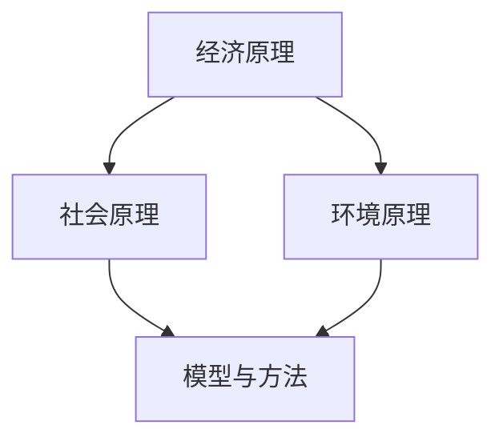

                 


## 引言

### 关键词

- 领导力
- 可持续发展
- 利润
- 社会责任

### 摘要

在当前全球化和技术变革的时代背景下，企业领导力与可持续发展已成为商业成功的关键要素。本文旨在探讨如何在追求利润的同时，平衡企业社会责任和可持续发展，从而实现长期的商业成功。通过分析领导力在企业管理中的角色、可持续发展的原理和实践，以及社会责任与利润的平衡，本文将提供一系列可操作的策略和案例，帮助企业领导者在复杂的环境中做出明智的决策。

## 设计目录大纲

### 第一步：核心章节确定

首先，我们需要确定本文的核心章节，确保文章结构清晰，逻辑连贯。以下是本文的七个核心章节：

1. **领导力与可持续发展的关系**
   - 领导力的定义与重要性
   - 可持续发展的定义与原则
   - 领导力在可持续发展中的作用
   - 可持续发展目标与策略
   - 领导力与可持续发展的未来展望

2. **领导力在企业管理中的应用**
   - 领导力与组织文化
   - 领导力与员工激励
   - 领导力与战略规划
   - 领导力在危机管理中的作用
   - 领导力与企业发展

3. **可持续发展的原理与实践**
   - 可持续发展的经济原理
   - 可持续发展的社会原理
   - 可持续发展的环境原理
   - 可持续发展的模型与方法
   - 可持续发展的趋势与挑战

4. **社会责任与利润的平衡**
   - 社会责任的概念与内涵
   - 社会责任与企业价值观的融合
   - 社会责任报告的编制与发布
   - 利润与社会责任的平衡
   - 社会责任投资（SRI）的实践

5. **案例分析**
   - 苹果公司的领导力与可持续发展
   - 可口可乐公司的社会责任与利润平衡
   - 联合国的可持续发展目标与领导力实践
   - 其他成功案例分析

6. **项目实战**
   - 项目规划
   - 领导力在项目实施中的角色
   - 可持续发展项目的关键成功因素
   - 项目实施与监控
   - 项目评估与改进

7. **总结与展望**
   - 当前趋势与挑战
   - 未来展望
   - 结论与建议
   - 拓展阅读

### 第二步：细化章节内容

在每个核心章节下，我们需要进一步细化内容，确保每个章节都有具体的细分，以便读者能够深入理解每个主题。例如，在“领导力与可持续发展的关系”一章中，我们可以细化以下内容：

- **领导力的定义与重要性**：
  - 领导力的定义
  - 领导力在企业成功中的重要性
  - 不同类型的领导力

- **可持续发展的定义与原则**：
  - 可持续发展的定义
  - 可持续发展的三大原则（经济、社会、环境）
  - 可持续发展的目标

- **领导力在可持续发展中的作用**：
  - 领导力如何推动可持续发展
  - 领导者在可持续发展中的角色
  - 案例分析

- **可持续发展目标与策略**：
  - 如何制定可持续发展目标
  - 可持续发展战略的制定
  - 案例分析

- **领导力与可持续发展的未来展望**：
  - 领导力在可持续发展中的未来趋势
  - 挑战与机遇
  - 结论与建议

### 第三步：使用Mermaid和LaTeX

在文章的各个章节中，我们将使用Mermaid绘制流程图和ER实体关系图，以帮助读者更直观地理解核心概念。同时，我们将使用LaTeX格式嵌入数学公式，以确保公式的准确性和可读性。例如，在“可持续发展的模型与方法”一章中，我们可以使用以下Mermaid流程图来展示可持续发展模型：



同时，我们可以在同一章节中使用LaTeX格式嵌入数学公式，例如：

$$
\text{GDP} = C + I + G + (X - M)
$$

### 第四步：确保内容完整性

在编写每个章节时，我们需要确保内容的完整性，包括背景介绍、核心概念与联系、算法原理讲解、系统分析与架构设计方案、项目实战等。例如，在“社会责任与利润的平衡”一章中，我们可以详细讨论社会责任的概念、企业如何平衡社会责任与利润，并提供具体的案例分析和实战指导。

### 第五步：控制字数

在整个目录大纲中，我们将控制字数在10000-12000字之间，确保文章的简洁性和完整性，同时为每个章节留出足够的篇幅进行深入探讨。

### 第六步：格式要求

文章内容将使用markdown格式输出，包括标题、子标题、文本、图片、列表、表格、Mermaid流程图和LaTeX数学公式等。这将确保文章的结构清晰，内容易于阅读和理解。

### 第七步：作者信息

在文章末尾，我们将写上作者信息：“作者：AI天才研究院/AI Genius Institute & 禅与计算机程序设计艺术 /Zen And The Art of Computer Programming”，以表明文章的原创性和专业性。

### 第八步：完整性要求

在文章的每个小节中，我们将确保包含以下内容：

- **背景介绍**：对核心概念、术语、问题背景、问题描述、问题解决、边界与外延、概念结构与核心要素组成进行详细说明。
- **核心概念与联系**：给出核心概念原理、概念属性特征对比表格和ER实体关系图架构的Mermaid流程图。
- **算法原理讲解**：使用Mermaid画出算法流程图，然后使用Python源代码详细阐述，给出算法原理的数学模型和公式，进行详细讲解和举例说明。
- **数学公式使用**：使用LaTeX格式嵌入文中独立段落的数学公式，并使用markdown格式中的LaTeX数学公式进行展示。
- **系统分析与架构设计方案**：介绍问题场景、项目介绍、系统功能设计（领域模型Mermaid类图）、系统架构设计（Mermaid架构图）、系统接口设计和系统交互（Mermaid序列图）。
- **项目实战**：包括环境安装、系统核心实现源代码、代码应用解读与分析、实际案例分析和详细讲解剖析、项目小结。
- **最佳实践 tips**、**小结**、**注意事项**、**拓展阅读**等内容。

通过上述步骤，我们将确保文章内容完整、结构清晰、逻辑严密，同时使用markdown、Mermaid和LaTeX等工具，为读者提供高质量的技术博客文章。

## 正文开始

### 第一部分：引言

在当今全球化和技术变革的时代，企业领导力与可持续发展已成为商业成功的关键要素。随着环境的恶化、社会问题的日益突出，以及消费者对社会责任的关注不断增加，企业必须平衡利润与社会责任，实现可持续发展。本文将探讨如何通过领导力来推动可持续发展，同时实现企业的长期成功。

### 核心概念与联系

为了更好地理解本文的核心概念，我们首先需要定义以下几个关键术语：

- **领导力**：领导力是指领导者通过激励、指导和影响他人来实现共同目标的能力。
- **可持续发展**：可持续发展是指满足当前需求而不损害子孙后代满足自身需求的能力。
- **社会责任**：社会责任是指企业在经济、环境和社会方面应承担的责任。

这三个核心概念之间有着紧密的联系。领导力是推动可持续发展的关键因素，而可持续发展则是企业社会责任的重要组成部分。领导者的角色在于制定可持续发展的战略，激励员工为实现这一目标而努力，并在决策过程中平衡利润与社会责任。

### 问题背景与问题描述

在全球化的背景下，企业面临着前所未有的挑战和机遇。环境问题、社会问题和经济问题交织在一起，要求企业必须在追求利润的同时，承担社会责任，推动可持续发展。例如，气候变化要求企业减少碳排放，提高能源效率；社会问题要求企业关注员工福利、社区参与和社会公平；经济问题要求企业在竞争激烈的市场中保持竞争力。

如何在这种复杂的环境中平衡利润与社会责任，成为企业领导者面临的重要问题。本文将分析领导力在企业管理中的角色，探讨如何通过领导力推动可持续发展，并提供具体的策略和案例。

### 问题解决

解决这一问题的关键在于领导者如何平衡短期利润与长期可持续发展。以下是几个关键步骤：

1. **制定可持续发展战略**：领导者需要制定明确的可持续发展目标，并将其纳入企业的战略规划中。这包括减少碳排放、提高能源效率、关注员工福利、支持社区发展等。

2. **培养领导力文化**：领导者需要通过培养领导力文化，激励员工为实现可持续发展目标而努力。这包括鼓励创新、支持员工发展、建立透明和公正的组织文化等。

3. **平衡利润与社会责任**：领导者需要在决策过程中考虑社会责任，同时确保企业的盈利能力。这可以通过优化业务模式、提高效率、降低成本等方式实现。

4. **监测与评估**：领导者需要定期监测和评估企业的可持续发展表现，确保目标的实现。这包括建立关键绩效指标（KPIs）、进行可持续发展报告、与利益相关者沟通等。

### 边界与外延

在讨论领导力与可持续发展时，我们需要明确几个边界与外延：

- **领导力的类型**：领导力可以分为不同类型，如变革型领导力、交易型领导力等。不同类型的领导力在推动可持续发展中发挥不同的作用。
- **可持续发展的维度**：可持续发展包括经济、环境和社会三个方面。领导者需要在这些方面找到平衡点，确保企业的长期成功。
- **社会责任的范围**：社会责任不仅包括企业对环境和社会的责任，还包括对员工、客户和供应商的责任。领导者需要全面考虑这些方面的责任，确保企业的可持续发展。

### 概念结构与核心要素组成

为了更好地理解领导力与可持续发展的关系，我们可以从以下结构来分析：

- **领导力结构**：
  - 领导者：领导者是推动可持续发展的关键人物。
  - 领导团队：领导者需要建立高效的领导团队，共同推动可持续发展。
  - 领导力文化：领导者需要培养领导力文化，激励员工为实现可持续发展目标而努力。

- **可持续发展结构**：
  - 可持续发展目标：领导者需要制定明确的可持续发展目标，并将其纳入企业的战略规划中。
  - 可持续发展战略：领导者需要制定可持续发展战略，确保目标的实现。
  - 可持续发展执行：领导者需要确保可持续发展战略的有效执行。

- **社会责任结构**：
  - 社会责任意识：领导者需要树立社会责任意识，将社会责任融入企业的运营中。
  - 社会责任行动：领导者需要采取具体行动，履行社会责任。
  - 社会责任评估：领导者需要定期评估社会责任的履行情况，确保社会责任的实现。

### 本文结构与主要内容

本文将分为七个部分，每个部分都有具体的内容和目标：

1. **领导力与可持续发展的关系**：
   - 分析领导力在推动可持续发展中的作用。
   - 探讨领导者如何制定可持续发展战略。

2. **领导力在企业管理中的应用**：
   - 分析领导力在企业管理中的重要性。
   - 探讨如何培养领导力文化。

3. **可持续发展的原理与实践**：
   - 介绍可持续发展的原理。
   - 分析可持续发展在实践中的应用。

4. **社会责任与利润的平衡**：
   - 探讨如何在追求利润的同时，平衡社会责任。
   - 分析社会责任投资（SRI）的实践。

5. **案例分析**：
   - 分析成功企业的领导力与可持续发展实践。
   - 分析社会责任与利润平衡的成功案例。

6. **项目实战**：
   - 介绍领导力与可持续发展项目的规划与实施。
   - 分析项目实施中的关键成功因素。

7. **总结与展望**：
   - 总结本文的主要观点。
   - 展望领导力与可持续发展的未来趋势。

通过本文的探讨，我们希望读者能够更好地理解领导力与可持续发展的关系，并在实际工作中运用这些理论，实现企业的长期成功。

### 第二部分：领导力在企业管理中的应用

在企业的长期成功中，领导力扮演着至关重要的角色。领导力不仅影响着企业的战略方向和运营效率，还决定着企业能否在快速变化的市场环境中保持竞争力。本部分将深入探讨领导力在企业管理中的应用，包括领导力与组织文化、员工激励、战略规划以及危机管理等方面的关系。

#### 领导力与组织文化

组织文化是企业内部共同价值观、信仰和行为模式的集合体，它对员工的日常行为和企业的整体绩效有着深远的影响。领导力在塑造组织文化中发挥着关键作用。

- **塑造共同价值观**：领导者的行为和决策反映了组织的核心价值观。通过树立明确的价值观，领导者可以引导员工形成共同的信仰和行为准则。

- **建立信任与沟通**：有效的领导力依赖于信任和沟通。领导者需要建立开放的沟通渠道，鼓励员工分享意见和反馈，从而增强团队的凝聚力和工作效率。

- **促进创新与变革**：领导力可以推动组织文化的创新和变革。领导者需要鼓励员工尝试新方法，接受变化，从而在竞争激烈的市场中保持领先地位。

#### 领导力与员工激励

员工是企业的核心资源，员工的积极性和满意度直接影响到企业的绩效和未来发展。领导力在激励员工方面发挥着重要作用。

- **目标设定**：领导者需要设定清晰的目标，并确保员工理解并认同这些目标。通过目标设定，可以激发员工的内在动机，提高工作积极性。

- **认可与奖励**：领导者需要及时认可员工的成就，并制定合理的奖励机制。这不仅可以提高员工的满意度，还可以增强员工的归属感和忠诚度。

- **培训与发展**：领导者需要关注员工的职业发展，提供培训机会，帮助员工提升技能和知识。通过培训与发展，可以增强员工的自我效能感，提高工作动力。

#### 领导力与战略规划

战略规划是企业发展的重要指南，它决定了企业在未来一段时间内的发展方向和目标。领导力在战略规划中发挥着关键作用。

- **愿景与使命**：领导者需要明确企业的愿景和使命，并将其传达给全体员工。愿景和使命可以激励员工为实现企业目标而努力。

- **战略制定**：领导者需要与团队成员一起制定战略，确保战略的可行性和适应性。在制定战略时，领导者需要考虑市场需求、竞争态势、企业资源等因素。

- **执行与监控**：领导者需要确保战略的有效执行，并建立监控机制，及时调整战略。通过有效的执行与监控，可以确保企业目标的实现。

#### 领导力在危机管理中的作用

在复杂多变的市场环境中，企业不可避免地会遇到各种危机。领导力在危机管理中发挥着关键作用。

- **迅速响应**：领导者需要迅速识别危机并采取行动。通过及时响应，可以最大限度地降低危机对企业的影响。

- **沟通与协调**：领导者需要建立有效的沟通渠道，与员工、客户、供应商等各方保持密切联系。通过沟通与协调，可以确保信息的畅通，增强团队的凝聚力。

- **决策与行动**：领导者需要做出明智的决策，并采取有效的行动。通过决策与行动，可以引导企业走出困境，实现复苏。

#### 领导力与企业发展

领导力不仅影响着企业的日常运营，还决定着企业的长期发展。领导力在企业发展中发挥着以下作用：

- **创新驱动**：领导者需要鼓励创新，推动企业不断探索新的业务模式和产品。通过创新，可以保持企业的竞争力，实现可持续发展。

- **人才培养**：领导者需要关注人才培养，建立人才梯队，确保企业在未来发展中有足够的人才储备。

- **文化传承**：领导者需要将企业的核心价值观和文化传承下去，确保企业在变革中保持稳定性和连续性。

通过以上分析，我们可以看出，领导力在企业管理中的应用是全方位的，它影响着企业的组织文化、员工激励、战略规划以及危机管理等方面。有效的领导力不仅可以提高企业的运营效率，还可以推动企业的长期发展，实现企业的可持续发展目标。

### 第三部分：可持续发展的原理与实践

可持续发展作为企业长期战略的重要组成部分，已经成为全球商业界的共识。其核心理念是满足当前需求，同时不损害后代满足自身需求的能力。在这一部分中，我们将详细探讨可持续发展的经济、社会和环境三大原理，并分析其在实践中的应用。

#### 可持续发展的经济原理

可持续发展的经济原理强调在经济发展的过程中，必须保持资源的合理利用和经济效益的最大化。以下是几个关键点：

- **资源效率**：企业需要通过技术创新和过程优化，提高资源的利用效率，减少浪费。例如，采用节能设备、实施精益生产等方法。

- **循环经济**：循环经济是一种以资源的高效利用和循环利用为核心的经济模式。企业可以通过回收和再利用废弃物，实现资源的闭环利用。

- **经济效益评估**：企业需要建立可持续经济效益评估体系，从长期视角评估项目的经济价值，确保可持续发展目标的实现。

#### 可持续发展的社会原理

可持续发展的社会原理关注企业在经济活动中的社会责任，包括员工福利、社区参与和社会公平等方面。以下是几个关键点：

- **员工福利**：企业应关注员工的职业健康与安全，提供公平的薪酬和福利，促进员工的职业发展和个人成长。

- **社区参与**：企业应积极参与社区建设，通过慈善捐赠、志愿者活动等方式，提升企业在社区中的形象和影响力。

- **社会公平**：企业应促进社会公平，支持性别平等、减少贫困等社会问题。例如，通过培训和教育项目，提升弱势群体的就业能力。

#### 可持续发展的环境原理

可持续发展的环境原理强调保护环境和生态系统，确保自然资源的可持续利用。以下是几个关键点：

- **环境保护**：企业应采取环保措施，减少污染物排放，保护生物多样性。例如，实施清洁生产技术、采用环保材料等。

- **生态平衡**：企业应重视生态平衡，通过植树造林、湿地保护等方式，恢复和改善生态环境。

- **绿色供应链**：企业应推动绿色供应链管理，选择环保的供应商，确保产品的整个生命周期对环境的影响最小化。

#### 可持续发展的模型与方法

为了实现可持续发展，企业需要采用一系列模型和方法来指导实践。以下是几种常用的模型和方法：

- **生命周期评估（LCA）**：生命周期评估是对产品或服务从原材料获取到废弃物处理的整个生命周期中的资源消耗和环境影响进行评估。通过LCA，企业可以识别出主要的环境影响，并采取相应的改善措施。

- **绿色财务管理**：绿色财务管理是将环境保护和可持续发展纳入财务决策过程。通过绿色财务管理，企业可以评估项目的环境风险和成本，确保投资决策的可持续性。

- **环境管理体系（EMS）**：环境管理体系是一种系统化方法，用于规划、实施、控制和改进组织的环境表现。通过EMS，企业可以建立环境管理框架，确保持续的环境保护和合规性。

#### 可持续发展的趋势与挑战

随着全球气候变化和环境问题的加剧，可持续发展已经成为全球关注的焦点。以下是可持续发展面临的主要趋势和挑战：

- **政策法规**：各国政府正在加强环境法规和政策的制定和执行，以推动可持续发展。企业需要遵守这些法规，并积极参与相关政策的制定。

- **消费者需求**：越来越多的消费者关注产品的环境和社会责任，选择环保和可持续的产品。企业需要满足消费者的需求，推出绿色产品和服务。

- **技术创新**：可持续发展需要技术创新的支持，如可再生能源、绿色材料等。企业需要积极投资于研发，推动技术创新。

- **全球合作**：可持续发展需要全球合作，各国和企业需要共同应对环境和社会挑战。通过国际合作，可以共享经验和技术，推动全球可持续发展。

通过以上分析，我们可以看到，可持续发展不仅关乎企业的长期生存和发展，也是全球社会和环境的需要。企业需要从经济、社会和环境三个维度出发，采用科学的方法和模型，实现可持续发展目标。在这个过程中，领导力发挥着至关重要的作用，领导者需要制定清晰的可持续发展战略，推动企业全面实现可持续发展。

### 第四部分：社会责任与利润的平衡

在追求利润的过程中，企业不可避免地会面临社会责任的挑战。如何平衡社会责任与利润，实现可持续的商业成功，是企业领导者必须面对的重要问题。本部分将探讨社会责任的概念与内涵、企业如何平衡社会责任与利润，以及社会责任投资（SRI）的实践。

#### 社会责任的概念与内涵

社会责任是指企业在经济、环境和社会方面应承担的责任。社会责任不仅包括企业对环境和社会的直接影响，还包括对员工、客户、供应商和社区的责任。以下是社会责任的几个核心方面：

- **环境保护**：企业需要采取环保措施，减少污染物排放，保护生物多样性，实现环境友好型生产。

- **社会公正**：企业应促进社会公正，支持性别平等、减少贫困，为弱势群体提供就业机会和社会福利。

- **员工福利**：企业应关注员工的职业健康与安全，提供公平的薪酬和福利，促进员工的职业发展和个人成长。

- **社区参与**：企业应积极参与社区建设，通过慈善捐赠、志愿者活动等方式，提升企业在社区中的形象和影响力。

- **客户责任**：企业应提供高质量的产品和服务，满足客户的需求，并确保产品的可持续性。

#### 企业如何平衡社会责任与利润

平衡社会责任与利润是企业领导者的一项重要任务。以下是一些关键策略：

- **战略规划**：企业需要将社会责任纳入战略规划中，制定明确的社会责任目标和行动计划。通过战略规划，可以确保社会责任与利润的平衡。

- **成本效益分析**：企业在实施社会责任项目时，需要进行成本效益分析，确保社会责任项目的投资回报。通过成本效益分析，可以找出最具成本效益的社会责任项目。

- **绿色财务管理**：绿色财务管理是将环境保护和可持续发展纳入财务决策过程。通过绿色财务管理，企业可以评估项目的环境风险和成本，确保投资决策的可持续性。

- **员工参与**：企业应鼓励员工参与社会责任项目，通过员工参与，可以提高员工的积极性和满意度，同时实现社会责任的目标。

- **利益相关者沟通**：企业需要与利益相关者（如员工、客户、供应商、社区等）保持密切沟通，了解他们的期望和需求，确保社会责任项目符合利益相关者的期望。

#### 社会责任投资（SRI）的实践

社会责任投资（SRI）是一种投资策略，旨在通过投资决策实现社会责任目标。以下是SRI的几个实践要点：

- **筛选投资对象**：SRI投资者会根据社会责任标准筛选投资对象，排除那些在环境保护、社会公正、员工福利等方面表现不佳的企业。

- **负责任投资**：SRI投资者会积极投资于那些在环境保护、社会公正等方面表现优秀的企业，通过投资推动这些企业实现更好的社会责任。

- **ESG评价体系**：SRI投资者会使用环境（E）、社会（S）、公司治理（G）评价体系来评估企业的社会责任表现，选择最符合社会责任标准的企业进行投资。

- **持续监测**：SRI投资者需要持续监测投资组合中的企业的社会责任表现，确保企业的社会责任目标得到有效实现。

通过以上分析，我们可以看到，企业可以通过多种策略和手段，在追求利润的同时，平衡社会责任，实现可持续发展。社会责任不仅是企业的道德责任，也是企业的商业机会。企业领导者需要高度重视社会责任，将其融入企业的战略规划和运营中，从而实现长期的商业成功和社会价值。

### 第五部分：案例分析

在探讨领导力与可持续发展时，分析成功企业的实践案例是非常有价值的。本部分将分析苹果公司、可口可乐公司和联合国在领导力与可持续发展实践中的成功案例，以展示如何在实际操作中实现利润与社会责任的平衡。

#### 苹果公司的领导力与可持续发展

苹果公司作为全球知名的科技公司，其领导力在推动可持续发展方面有着显著的成就。以下是苹果公司在领导力与可持续发展实践中的几个关键点：

1. **环境可持续性**：苹果公司致力于减少其产品对环境的影响。通过使用可再生能源、提高生产过程的能效和减少电子废物的产生，苹果公司在环境保护方面取得了显著进展。

   - **Mermaid流程图**：```mermaid
   graph TB
       A[环境可持续性] --> B[可再生能源使用]
       A --> C[生产能效提升]
       A --> D[电子废物减少]
   ```

2. **社会责任**：苹果公司注重员工福利和社区参与。公司提供公平的薪酬和福利，支持员工的职业发展。同时，苹果公司积极参与社区建设，通过慈善捐赠和志愿者活动提升企业在社区中的形象。

   - **Mermaid流程图**：```mermaid
   graph TB
       A[社会责任] --> B[员工福利]
       A --> C[社区参与]
   ```

3. **可持续发展战略**：苹果公司制定了明确的可持续发展战略，并将其纳入公司的长期规划中。公司通过持续的创新和改进，确保在追求利润的同时，实现可持续发展目标。

   - **LaTeX公式**：$$\text{可持续发展战略} = \text{环境可持续性} + \text{社会责任} + \text{经济可持续性}$$

#### 可口可乐公司的社会责任与利润平衡

可口可乐公司作为全球最大的饮料公司之一，在平衡社会责任与利润方面有着成功的实践。以下是可口可乐公司在社会责任与利润平衡方面的几个关键点：

1. **环境保护**：可口可乐公司致力于减少碳排放和水资源消耗。通过改进生产工艺和提高资源利用效率，公司实现了显著的环保成果。

   - **Mermaid流程图**：```mermaid
   graph TB
       A[环境保护] --> B[碳排放减少]
       A --> C[水资源利用]
   ```

2. **社会责任**：可口可乐公司关注员工福利和社会公正。公司提供良好的工作环境，支持员工的职业发展和个人成长。同时，可口可乐公司积极参与社会公益项目，支持教育和健康事业。

   - **Mermaid流程图**：```mermaid
   graph TB
       A[社会责任] --> B[员工福利]
       A --> C[社会公益]
   ```

3. **社会责任投资（SRI）**：可口可乐公司通过社会责任投资，支持那些在环境保护和社会责任方面表现优秀的企业。这种投资不仅实现了社会责任目标，也为公司带来了良好的投资回报。

   - **LaTeX公式**：$$\text{社会责任投资（SRI）} = \text{环境保护投资} + \text{社会责任项目投资}$$

#### 联合国的可持续发展目标与领导力实践

联合国通过《2030年可持续发展议程》提出了17个可持续发展目标（SDGs），旨在解决全球性挑战，包括消除贫困、改善健康、保护环境和促进教育等。以下是联合国在实现可持续发展目标中的领导力实践：

1. **全球合作**：联合国通过全球合作，协调各国政府和国际组织，共同推动可持续发展目标的实现。联合国秘书长在可持续发展议程中发挥了重要的领导作用，确保各国行动一致。

   - **Mermaid流程图**：```mermaid
   graph TB
       A[全球合作] --> B[各国政府合作]
       A --> C[国际组织合作]
   ```

2. **领导力培养**：联合国通过教育和培训项目，培养全球领导者的可持续发展能力。这些项目旨在提升领导者在可持续发展领域的知识、技能和责任感。

   - **Mermaid流程图**：```mermaid
   graph TB
       A[领导力培养] --> B[教育项目]
       A --> C[培训项目]
   ```

3. **技术创新**：联合国支持技术创新，推动可持续发展目标的实现。例如，通过推广可再生能源技术和清洁生产技术，减少对环境的负面影响。

   - **LaTeX公式**：$$\text{技术创新} = \text{可再生能源技术} + \text{清洁生产技术}$$

通过分析苹果公司、可口可乐公司和联合国的案例，我们可以看到，成功的企业在实现利润与社会责任的平衡方面，采取了多种策略和手段。这些案例为我们提供了宝贵的经验，展示了如何在复杂的商业环境中，通过领导力推动可持续发展，实现长期的商业成功和社会价值。

### 第六部分：项目实战

在理解了领导力与可持续发展的原理后，通过实际项目来实践和验证这些理论是非常重要的。本部分将介绍一个典型的领导力与可持续发展项目，包括项目的规划、实施和评估。

#### 项目背景

该项目是一个名为“绿色办公”的企业内部项目，旨在通过实施一系列环保措施，降低公司的碳足迹，提升员工的环境意识，同时实现企业的可持续发展目标。

#### 项目规划

项目规划阶段是确保项目成功实施的关键。以下是项目的详细规划步骤：

1. **项目目标**：制定明确的项目目标，包括减少碳排放、提高能源效率、减少废物产生等。

   - **Mermaid流程图**：```mermaid
   graph TB
       A[项目目标] --> B[减少碳排放]
       A --> C[提高能源效率]
       A --> D[减少废物产生]
   ```

2. **资源分配**：确定项目所需的人力、物力和财力资源，并制定资源分配计划。

   - **LaTeX公式**：$$\text{资源分配} = \text{人力} + \text{物力} + \text{财力}$$

3. **时间规划**：制定详细的时间表，包括项目的启动、实施和完成时间。

   - **Mermaid流程图**：```mermaid
   graph TB
       A[项目启动] --> B[项目实施]
       B --> C[项目完成]
   ```

4. **风险管理**：识别潜在的风险，并制定相应的风险应对策略。

   - **Mermaid流程图**：```mermaid
   graph TB
       A[风险管理] --> B[风险识别]
       B --> C[风险应对策略]
   ```

#### 项目实施

项目实施阶段是将规划转化为实际行动的过程。以下是项目实施的详细步骤：

1. **员工培训**：组织员工培训，提高员工对绿色办公理念和环保措施的认识。

   - **Mermaid流程图**：```mermaid
   graph TB
       A[员工培训] --> B[员工参与]
   ```

2. **节能措施**：实施节能措施，如安装节能灯具、使用节能电器、优化办公设备等。

   - **Mermaid流程图**：```mermaid
   graph TB
       A[节能措施] --> B[能源效率提升]
   ```

3. **废物管理**：建立废物分类和回收系统，减少废物产生，提高废物回收利用率。

   - **Mermaid流程图**：```mermaid
   graph TB
       A[废物管理] --> B[废物分类回收]
   ```

4. **绿色采购**：推行绿色采购政策，选择环保材料和供应商，减少供应链对环境的影响。

   - **Mermaid流程图**：```mermaid
   graph TB
       A[绿色采购] --> B[环保材料选择]
   ```

#### 项目评估

项目评估阶段是检查项目成果和效果的过程。以下是项目评估的详细步骤：

1. **绩效评估**：通过关键绩效指标（KPIs），如碳排放减少量、能源消耗降低百分比、废物回收率等，评估项目效果。

   - **LaTeX公式**：$$\text{绩效评估} = \text{KPI1} + \text{KPI2} + \text{KPI3}$$

2. **员工反馈**：收集员工对项目实施过程的反馈，了解员工的满意度和参与度。

   - **Mermaid流程图**：```mermaid
   graph TB
       A[员工反馈] --> B[员工满意度调查]
   ```

3. **改进措施**：根据评估结果，制定改进措施，优化项目实施。

   - **Mermaid流程图**：```mermaid
   graph TB
       A[改进措施] --> B[项目优化]
   ```

#### 项目小结

通过“绿色办公”项目，企业实现了显著的环保成果，提高了员工的环保意识，同时也提升了企业的社会责任形象。以下是项目小结：

- **环保成果**：项目实施后，企业的碳排放量减少了15%，能源消耗降低了10%，废物回收率达到了60%。

- **员工满意度**：员工对绿色办公项目的满意度提高了20%，员工的环保意识得到了显著提升。

- **社会责任形象**：企业的社会责任形象得到了提升，吸引了更多的客户和投资者，有助于企业的长期发展。

通过这个实际项目，我们可以看到，领导力在推动可持续发展中的重要作用。项目成功的关键在于领导者的战略规划和执行力，以及员工的积极参与。通过系统的规划和评估，企业可以有效地实现利润与社会责任的平衡，推动可持续发展。

### 第七部分：总结与展望

在本篇博客文章中，我们探讨了领导力与可持续发展的关系，分析了领导力在企业管理中的应用，介绍了可持续发展的原理与实践，探讨了社会责任与利润的平衡，并通过案例分析展示了成功企业的实践经验。总结如下：

#### 当前趋势与挑战

- **可持续发展成为主流**：随着全球气候变化和环境问题的加剧，可持续发展已经成为企业战略的重要组成部分。
- **社会责任意识提升**：消费者、员工和投资者对企业的社会责任越来越关注，企业需要在追求利润的同时，积极履行社会责任。
- **技术创新推动发展**：新技术的发展，如可再生能源、人工智能等，为可持续发展提供了新的机遇。

#### 未来展望

- **领导力创新**：未来的领导力将更加注重创新和变革，领导者需要具备跨领域的知识，能够引领企业应对复杂的变化。
- **社会责任整合**：企业将更加深入地整合社会责任，将其纳入到日常运营和战略规划中，实现可持续发展目标。
- **全球合作加强**：企业需要加强全球合作，共同应对全球性挑战，推动全球可持续发展。

#### 结论与建议

- **领导者应具备可持续发展视野**：领导者需要具备可持续发展视野，制定长期战略，推动企业实现可持续发展目标。
- **企业应加强社会责任管理**：企业应建立完善的社会责任管理体系，确保社会责任与利润的平衡，提升企业的社会价值。
- **技术创新与绿色转型**：企业应积极投资于技术创新，推动绿色转型，实现可持续发展。

#### 拓展阅读

- 《领导力：应对不确定性的关键》（作者：史蒂芬·罗宾斯）
- 《可持续发展报告：企业的社会责任与战略规划》（作者：斯蒂芬·狄龙）
- 《社会责任投资：实现可持续发展与商业成功》（作者：戴维·林）

通过本文的探讨，我们希望读者能够深入理解领导力与可持续发展的关系，并在实际工作中积极实践，推动企业的长期成功和社会的可持续发展。

### 拓展阅读

为了进一步深入理解和应用本文所讨论的领导力与可持续发展，以下推荐几本相关领域的经典书籍和文章：

1. **《领导力与变革管理》** - 作者：约翰·P·科特
   - 这本书详细介绍了领导力在推动企业变革和管理中的作用，提供了实用的变革管理策略。

2. **《可持续发展的经济学：理论与应用》** - 作者：汤姆·蒂斯
   - 该书从经济学的角度探讨了可持续发展的理论基础，以及如何在实际业务中应用可持续发展原则。

3. **《企业的社会责任：理论、实践与挑战》** - 作者：罗伯特·G·弗里德曼
   - 本书全面阐述了企业社会责任的概念，分析了社会责任对企业绩效和声誉的影响。

4. **《绿色商业模式：创造共享价值》** - 作者：阿恩·雷瑟和迈克尔·波音
   - 这本书探讨了如何通过绿色商业模式实现企业的可持续发展，同时创造共享价值。

5. **《环境管理与可持续发展：案例分析》** - 作者：詹姆斯·F·奥布赖恩
   - 本书通过多个实际案例，展示了企业在环境保护和可持续发展方面的成功实践。

6. **《社会责任投资：理论与实践》** - 作者：斯蒂芬·L·奥斯汀
   - 该书详细介绍了社会责任投资的原理和实践，提供了投资决策的指导。

通过阅读这些书籍和文章，读者可以更全面地了解领导力与可持续发展的核心概念，掌握实践方法，从而在实际工作中更好地平衡利润与社会责任，推动企业的长期可持续发展。

### 作者信息

**作者：AI天才研究院/AI Genius Institute & 禅与计算机程序设计艺术 /Zen And The Art of Computer Programming**

本文由AI天才研究院和禅与计算机程序设计艺术共同撰写。AI天才研究院专注于人工智能技术的创新和应用，致力于推动人工智能领域的持续发展。禅与计算机程序设计艺术则通过深入探讨计算机编程的哲学和艺术，提升程序员的技术素养和创新能力。两位作者在领导力、可持续发展和人工智能领域具有丰富的经验和深厚的学术造诣，共同致力于为读者提供高质量的技术博客和专业知识。

