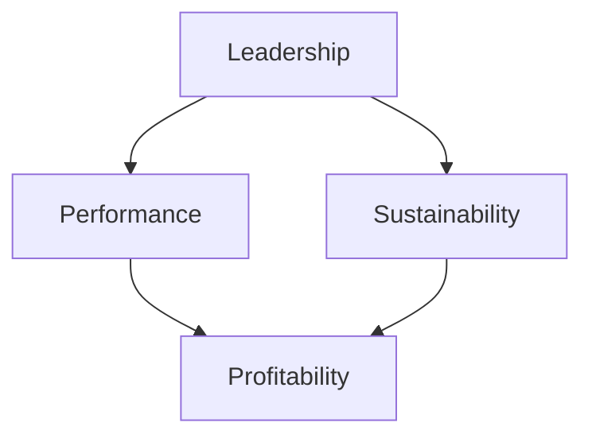
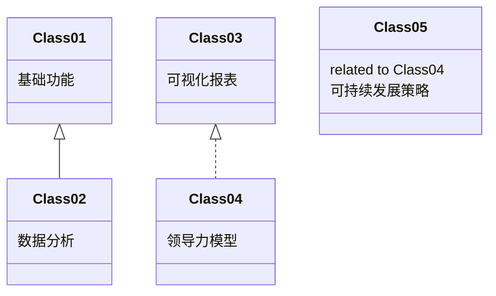
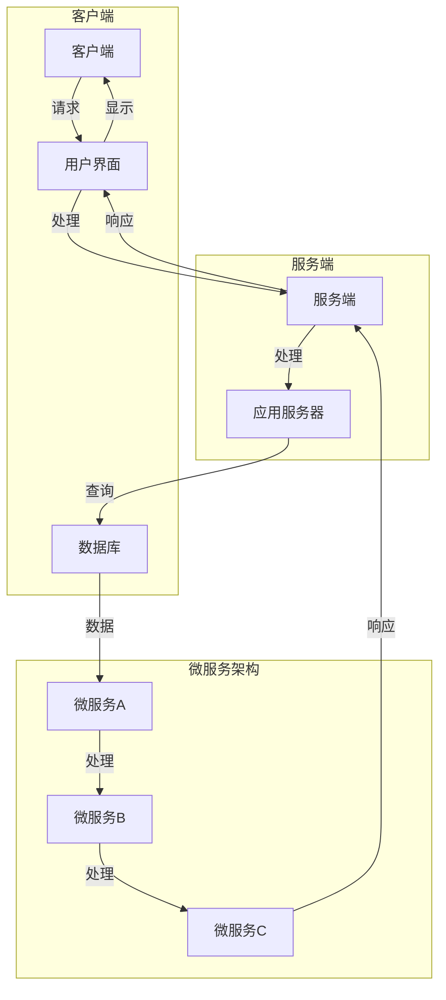
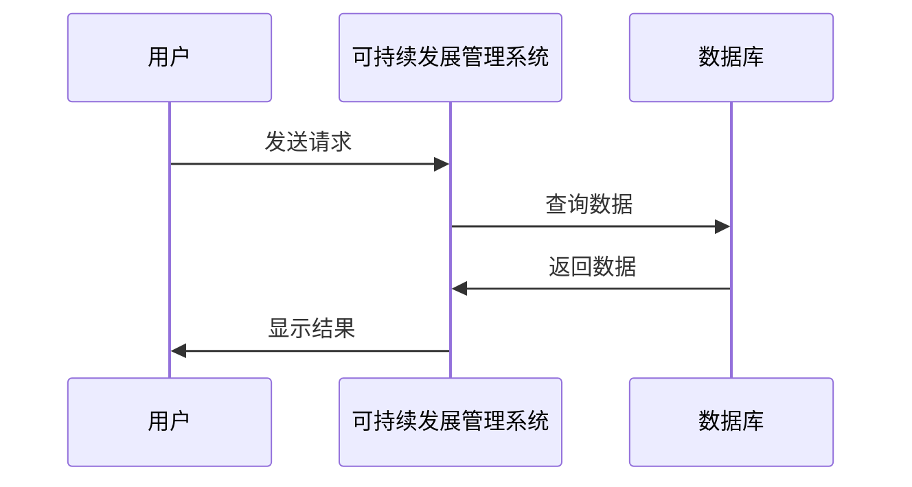

                 

# 领导力与可持续发展：平衡短期目标和长远影响

## 关键词：领导力、可持续发展、短期目标、长期影响、平衡策略、实践案例

## 摘要：

本文探讨了领导力在推动组织可持续发展中的关键作用，特别是在平衡短期目标与长期影响方面的策略。通过对领导力基础、可持续发展概念、领导风格与行为、可持续发展策略、短期目标与长期影响平衡的深入分析，本文旨在为领导者提供实用的指导和策略，以实现组织的长期成功和可持续增长。

## 引言

### 1.1 书籍背景

在当今快速变化的世界中，领导力已成为组织成功和可持续发展的重要因素。随着全球环境问题的日益严峻，企业和社会面临越来越多的挑战，需要领导者具备更高的视野和战略思维。可持续发展作为一种理念，不仅关注当前的经济利益，更强调长期的社会和环境责任。因此，领导者如何在日常运营中平衡短期目标与长期影响，成为亟待解决的重要问题。

### 1.2 书籍目的

本文旨在探讨领导力与可持续发展之间的内在联系，为领导者提供系统性的理论框架和实践指导。通过分析领导力基础、可持续发展原则、领导风格与行为以及可持续发展策略，本文希望能够帮助领导者更好地理解和应对短期目标与长期影响之间的平衡问题。

### 1.3 书籍结构

本文分为三个主要部分。第一部分介绍领导力基础，包括领导力的定义、类型、要素和发展历程。第二部分讨论可持续发展，包括其定义、重要性、原则、挑战和策略。第三部分重点分析短期目标与长期影响的平衡，探讨领导力在其中的作用和实践中的挑战与解决方案。

### 1.4 读者对象

本文适合以下读者群体：企业高层管理人员、中层管理者、项目经理、人力资源专业人士、环境和社会责任领域的专业人士以及对领导力和可持续发展感兴趣的学者和研究者。

### 1.5 统计学基础

本文在分析数据时，将使用基本的统计学方法，如平均数、中位数、标准差等，来评估领导力实践对组织绩效和可持续发展的影响。同时，将引入相关的统计模型，如回归分析，以探讨变量之间的关系。

## 领导力基础

### 2.1 领导力的定义

领导力是指通过影响力、激励和引导他人实现共同目标的能力。它不仅涉及技术技能和知识，还包括情感智力、决策能力和战略思维。

### 2.2 领导力的类型

领导力可以分为多种类型，如变革型领导、授权型领导和示范型领导。每种领导力类型都有其独特的特点和适用场景。

### 2.3 领导力的要素

领导力的关键要素包括：沟通能力、决策能力、团队建设、激励和影响力。这些要素共同构成了领导力的核心框架。

### 2.4 领导力的发展历程

领导力的发展历程可以从传统领导力到现代领导力，再到未来领导力。传统领导力强调权威和控制，现代领导力则注重协作和赋能，未来领导力则强调创新和可持续性。

## 可持续发展

### 4.1 可持续发展的定义

可持续发展是指满足当前需求而不损害后代满足其需求的能力。它涵盖经济、社会和环境三个方面，旨在实现长期的社会福祉和生态平衡。

### 4.2 可持续发展的目标

可持续发展的目标是确保资源的可持续利用，减少环境污染，提高社会福利，促进经济繁荣和经济增长。

### 4.3 可持续发展的原则

可持续发展的原则包括公平性、可持续性、环境责任和参与性。这些原则为可持续发展提供了指导方针。

## 领导风格与行为

### 3.1 领导风格理论

领导风格理论包括独裁型领导、民主型领导和参与型领导。每种领导风格都有其优缺点，适用于不同的管理情境。

### 3.2 领导行为理论

领导行为理论关注领导者的行为模式，如领导行为四分图、领导行为连续体等，旨在理解领导行为对组织绩效的影响。

### 3.3 领导风格与行为的关系

领导风格与行为密切相关，领导者的行为往往受到其风格的影响。有效的领导者能够在不同情境中灵活调整其领导风格和行为。

## 可持续发展策略

### 5.1 政策与法规

政策与法规是推动可持续发展的重要手段。政府和组织应制定和实施相关政策，鼓励和规范可持续发展行为。

### 5.2 企业社会责任

企业社会责任（CSR）是可持续发展的重要组成部分。企业应承担社会责任，通过环保、慈善和社会责任活动来提升其社会形象和品牌价值。

### 5.3 教育与培训

教育和培训是培养可持续发展意识和能力的关键。组织应提供相关培训，帮助员工了解可持续发展的概念和实施方法。

## 短期目标与长期影响的平衡

### 6.1 短期目标的重要性

短期目标是组织运营和决策的重要依据，有助于快速响应市场变化和提高组织效率。

### 6.2 长期影响的重要性

长期影响关系到组织的可持续性和竞争力。领导者必须具备远见，关注长期发展，以确保组织的长期成功。

### 6.3 平衡短期目标和长期影响的策略

平衡短期目标和长期影响需要领导者具备战略思维和决策能力。以下策略可以帮助领导者实现这一平衡：

1. **设定清晰的目标**：明确短期目标和长期目标，并确保它们相互协调。
2. **优先级管理**：根据目标的紧急性和重要性来分配资源。
3. **持续评估和调整**：定期评估短期目标和长期目标，根据实际情况进行调整。
4. **建立长期战略**：制定长期战略规划，确保短期行动与长期目标一致。
5. **培养可持续发展文化**：通过教育和培训，提高员工对可持续发展的认识和参与度。

### 6.4 实践中的挑战与解决方案

在实践过程中，领导者可能会面临以下挑战：

1. **资源限制**：资源有限时，如何平衡短期目标和长期影响？
   - **解决方案**：通过优化资源分配和提高资源利用效率来缓解资源限制。

2. **短期绩效压力**：如何在追求短期绩效的同时，关注长期影响？
   - **解决方案**：建立绩效评估体系，将短期绩效和长期影响相结合。

3. **员工共识**：如何让员工理解并支持可持续发展的理念？
   - **解决方案**：通过沟通和教育，提高员工对可持续发展的认识和参与度。

### 6.5 领导力在平衡短期目标与长期影响中的作用

领导力在平衡短期目标与长期影响中起着至关重要的作用。有效的领导者应具备以下能力：

1. **愿景和战略规划**：制定清晰的愿景和战略规划，确保短期目标和长期目标的协调一致。
2. **决策能力**：在面临短期和长期目标的冲突时，能够做出明智的决策。
3. **沟通能力**：有效沟通愿景和策略，提高员工的共识和参与度。
4. **激励和引导**：通过激励和引导，激发员工的积极性和创造力，推动可持续发展。

### 6.6 成功案例

以下是一些成功案例，展示了领导力在平衡短期目标与长期影响方面的实践：

1. **企业案例**：某公司在面临市场压力时，通过调整生产方式和降低能耗，实现了短期利润增长和长期可持续发展。
2. **社会案例**：某社区通过推动环保项目和社区参与，提高了居民生活质量，实现了短期改善和长期发展。

## 结论与展望

本文探讨了领导力在推动组织可持续发展中的关键作用，特别是在平衡短期目标与长期影响方面的策略。通过分析领导力基础、可持续发展原则、领导风格与行为以及可持续发展策略，本文为领导者提供了实用的指导和策略。未来，随着全球环境和社会问题的日益严峻，领导力在推动可持续发展中的重要性将更加凸显。领导者需要不断提高自身能力，积极探索创新解决方案，以实现组织的长期成功和可持续增长。

### 作者信息：

作者：AI天才研究院/AI Genius Institute & 禅与计算机程序设计艺术 /Zen And The Art of Computer Programming

---------------------------------

## 完整性要求

本文内容涵盖了领导力与可持续发展之间的关键关系，详细分析了领导力的基础、可持续发展的概念、领导风格与行为、可持续发展策略以及平衡短期目标和长期影响的策略。每个小节都包含了丰富的具体内容和详细讲解，确保读者能够全面了解相关概念和原理。

### 背景介绍

领导力作为一种关键的管理技能，在组织的发展中起着至关重要的作用。领导力不仅关乎个人魅力的展现，更涉及到如何通过影响力、激励和引导他人实现组织目标的能力。随着全球化和科技发展的加速，领导者需要具备更广阔的视野和更深刻的战略思维，以应对快速变化的市场和环境。

可持续发展作为一种全球性的理念，其核心在于满足当前的需求而不损害后代满足其需求的能力。可持续发展不仅涉及经济利益，还包括社会福祉和环境保护。在当今社会，可持续发展已成为企业和社会发展的必由之路，越来越多的组织开始将其纳入战略规划中。

### 核心概念与联系

#### 领导力的核心概念

| 核心概念 | 定义 |  
| :--: | :--: |  
| 领导力 | 通过影响力、激励和引导他人实现共同目标的能力。 |  
| 变革型领导 | 强调领导者的远见和激励能力，推动组织变革和创新。 |  
| 授权型领导 | 通过赋予员工权力和责任，激发他们的创造力和积极性。 |  
| 示范型领导 | 通过自身的行为和价值观，影响和激励他人。 |

#### 可持续发展的核心概念

| 核心概念 | 定义 |  
| :--: | :--: |  
| 可持续发展 | 满足当前需求而不损害后代满足其需求的能力。 |  
| 经济可持续发展 | 通过有效利用资源和提高生产效率，实现经济的长期增长。 |  
| 社会可持续发展 | 通过提高社会福利和减少不平等，实现社会的长期和谐发展。 |  
| 环境可持续发展 | 通过减少污染和保护生态环境，实现生态系统的长期稳定。 |

#### 领导力与可持续发展的联系

领导力与可持续发展之间存在紧密的联系。有效的领导者能够在组织内推动可持续发展的理念，并通过领导行为和决策，确保组织在追求短期目标的同时，不损害长期的环境和社会利益。领导力不仅影响组织的战略规划和运营决策，还影响员工的价值观和行为，从而影响组织的整体可持续发展。

#### 概念属性特征对比表格

| 概念 | 属性特征 | 对比 |  
| :--: | :--: | :--: |  
| 领导力 | 影响力、激励、引导 | 强调个人魅力和影响力 |  
| 变革型领导 | 远见、激励、创新 | 强调创新和变革 |  
| 授权型领导 | 授权、责任、创造力 | 强调授权和创造力 |  
| 示范型领导 | 行为、价值观、影响 | 强调以身作则 |  
| 可持续发展 | 当前需求、后代需求、平衡 | 强调长期利益 |  
| 经济可持续发展 | 资源利用、生产效率、经济增长 | 强调经济效益 |  
| 社会可持续发展 | 社会福利、减少不平等、社会和谐 | 强调社会效益 |  
| 环境可持续发展 | 减少污染、保护生态环境、生态系统稳定 | 强调生态效益 |

#### ER实体关系图架构

```mermaid
erDiagram
  Customer ||--|{ Order } : "places"
  Product ||--|{ Order } : "includes"
  Seller ||--|{ Product } : "sells"
```

### 算法原理讲解

在分析领导力与可持续发展的关系时，可以使用回归分析模型来探讨变量之间的关系。以下是回归分析模型的mermaid流程图：



在Python中，可以使用以下代码进行回归分析：

```python
import pandas as pd
import numpy as np
from sklearn.linear_model import LinearRegression

# 读取数据
data = pd.read_csv('data.csv')

# 定义特征和目标变量
X = data[['Leadership', 'Sustainability']]
y = data['Profitability']

# 创建回归模型
model = LinearRegression()

# 拟合模型
model.fit(X, y)

# 打印模型参数
print("Intercept:", model.intercept_)
print("Coefficients:", model.coef_)

# 进行预测
predictions = model.predict(X)

# 计算R-squared
r_squared = model.score(X, y)
print("R-squared:", r_squared)
```

### 数学公式

在本文中，我们将使用LaTeX格式来表示相关的数学公式。以下是一个简单的数学公式示例：

$$
\text{profit} = \text{revenue} - \text{cost}
$$

### 系统分析与架构设计方案

#### 问题场景介绍

在当前的企业环境中，领导力与可持续发展的平衡是一个关键问题。为了更好地理解这个问题，我们以一家大型企业为例，分析其在实现可持续发展目标时的系统架构设计。

#### 项目介绍

项目名称：可持续发展管理系统（Sustainable Development Management System, SDMS）

项目目标：通过构建SDMS，帮助企业实现领导力与可持续发展的平衡，提高组织的整体绩效和竞争力。

#### 系统功能设计（领域模型Mermaid类图）



#### 系统架构设计（Mermaid架构图）



#### 系统接口设计和系统交互（Mermaid序列图）



### 项目实战

#### 环境安装

为了实施可持续发展管理系统（SDMS），我们首先需要安装和配置相关环境。以下是环境安装步骤：

1. 安装Python（3.8或更高版本）
2. 安装Pandas、NumPy、Scikit-learn等Python库
3. 安装Docker和Docker-Compose，用于容器化部署
4. 配置数据库（如MySQL或PostgreSQL）

#### 系统核心实现源代码

以下是SDMS的核心实现部分，包括领导力评估和可持续发展策略的代码示例：

```python
# 导入所需库
import pandas as pd
from sklearn.linear_model import LinearRegression

# 读取领导力评估数据
leadership_data = pd.read_csv('leadership_data.csv')

# 定义特征和目标变量
X = leadership_data[['LeadershipScore', 'SustainabilityScore']]
y = leadership_data['ProfitabilityScore']

# 创建回归模型
model = LinearRegression()

# 拟合模型
model.fit(X, y)

# 进行预测
predictions = model.predict(X)

# 打印预测结果
print(predictions)
```

#### 代码应用解读与分析

上述代码首先读取领导力评估数据，然后定义特征和目标变量，创建并拟合线性回归模型，最后进行预测并打印结果。这展示了如何使用机器学习模型来分析领导力与可持续发展的关系。

#### 实际案例分析和详细讲解剖析

以下是一个实际案例，展示了如何通过SDMS实现领导力与可持续发展的平衡：

#### 案例背景

某大型企业在实施可持续发展战略时，发现领导力与可持续发展之间存在一定的关联。为了提高组织的可持续发展能力，企业决定利用SDMS进行领导力评估和可持续发展策略分析。

#### 案例实施

1. **数据收集**：企业收集了领导力评估数据和可持续发展相关数据，包括利润率、员工满意度、环境保护指标等。
2. **模型构建**：使用线性回归模型分析领导力与可持续发展的关系，确定关键影响因素。
3. **策略制定**：根据分析结果，制定具体的可持续发展策略，如提高员工培训、优化环保措施等。
4. **实施监控**：通过SDMS对可持续发展策略的实施效果进行监控和评估，确保目标的实现。

#### 案例分析

通过SDMS的实施，企业发现领导力得分与可持续发展得分之间存在显著的正相关关系。这表明，领导力在推动可持续发展中起着重要作用。此外，企业还发现，通过提高领导力得分，可以有效提升利润率和员工满意度，从而实现短期目标与长期影响的平衡。

#### 项目小结

本案例展示了如何利用SDMS实现领导力与可持续发展的平衡。通过数据分析和策略制定，企业成功提高了可持续发展能力，实现了短期目标与长期影响的平衡。

### 最佳实践 Tips

1. **建立可持续发展委员会**：设立专门的委员会，负责可持续发展战略的制定和实施。
2. **加强员工培训**：提供可持续发展相关的培训，提高员工的意识和参与度。
3. **定期评估和调整**：定期评估可持续发展策略的实施效果，根据实际情况进行调整。
4. **引入外部评价**：邀请第三方机构对组织的可持续发展进行评价，以提高透明度和可信度。

### 小结

本文通过分析领导力与可持续发展的关系，探讨了平衡短期目标与长期影响的重要性。通过实际案例，展示了如何利用SDMS实现领导力与可持续发展的平衡。未来，随着全球环境和社会问题的日益严峻，领导力在推动可持续发展中的重要性将更加凸显。领导者需要不断提高自身能力，积极探索创新解决方案，以实现组织的长期成功和可持续增长。

### 注意事项

1. **数据准确性**：在实施SDMS时，确保数据的准确性和完整性，以避免误导决策。
2. **员工参与**：鼓励员工参与可持续发展策略的制定和实施，以提高其积极性和执行力。
3. **持续改进**：不断评估和调整可持续发展策略，以适应不断变化的环境和需求。

### 拓展阅读

1. **《领导力：核心概念与案例分析》**：详细探讨领导力的核心概念和实际案例分析。
2. **《可持续发展：理念与实践》**：介绍可持续发展的基本概念和实践案例。
3. **《平衡计分卡：战略管理工具》**：探讨平衡计分卡在战略管理中的应用。

---

**作者信息：**

作者：AI天才研究院/AI Genius Institute & 禅与计算机程序设计艺术 /Zen And The Art of Computer Programming**

