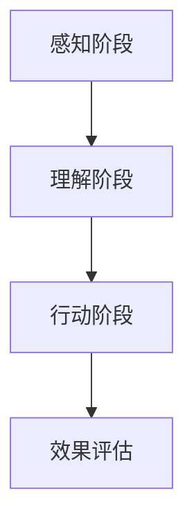

                 

# 领导力与同理心：建立情感联系的重要性

关键词：领导力、同理心、情感联系、团队协作、组织效能

摘要：本文探讨了领导力与同理心在建立情感联系中的重要性。通过分析领导力与同理心的核心概念、属性特征和互动机制，我们阐述了如何通过培养同理心、建立情感联系来提高团队士气和决策质量，从而实现个人、团队和组织的成功。

## 引言

在当今的快速变化和高度竞争的商业环境中，领导力成为企业和组织成功的关键因素。然而，传统的领导方式已经无法满足新的挑战。现代领导力不仅需要具备战略思维、决策能力和组织协调能力，更需要关注与团队成员建立情感联系的重要性。同理心，或称之为情感智力，是领导力的重要组成部分。它是指领导者能够理解并感受到他人情感的能力，对于建立信任、促进团队合作和提高团队绩效至关重要。

本文旨在探讨领导力与同理心在建立情感联系中的重要性，分析其核心概念、属性特征和互动机制，并提出实践策略，以帮助领导者更好地理解和运用同理心，从而提升团队和组织效能。

## 第1章 领导力概述

### 1.1 问题背景

随着全球化、技术革新和市场动荡的加剧，组织面临的环境变得越来越复杂和不确定。在这种环境中，传统的领导方式已经不足以应对挑战。领导力不仅需要解决组织内部的问题，还要具备适应外部变化的能力。因此，现代领导力需要更加注重情感联系和同理心的培养。

### 1.2 问题描述

领导力缺乏同理心可能导致以下问题：

- **团队士气低落**：缺乏同理心的领导往往忽视员工的情感需求，导致员工感到被忽视或不受重视，从而降低工作满意度。
- **沟通障碍**：同理心能够促进有效的沟通，缺乏同理心则可能引起误解和冲突。
- **决策失误**：同理心有助于领导者在做决策时考虑多方面因素，缺乏同理心可能导致决策缺乏人情味，从而影响执行效果。

### 1.3 问题解决

为了解决上述问题，领导者需要：

- **培养同理心**：通过倾听、观察和体验，领导者可以更好地理解员工的情感状态。
- **建立情感联系**：领导者可以通过真诚的关心和支持，与团队成员建立深厚的情感联系。

### 1.4 边界与外延

领导力与同理心的边界在于，同理心是领导力的一个重要组成部分，但它并不是领导力的全部。同理心需要与战略思维、决策能力等其他领导素质相结合，才能实现最佳效果。

### 1.5 概念结构与核心要素组成

- **领导力**：包括决策能力、沟通能力、激励能力等。
- **同理心**：包括情感识别、情感体验和情感表达。

## 第2章 同理心原理

### 2.1 同理心定义

同理心是指一个人能够理解并感受到他人情感的能力。它包括三个核心要素：

- **情感识别**：理解他人情感的能力。
- **情感体验**：与他人的情感共鸣的能力。
- **情感表达**：将他人的情感转化为自己的情感表达能力。

### 2.2 同理心属性特征对比表格

| 特征 | 情感识别 | 情感体验 | 情感表达 |
| --- | --- | --- | --- |
| 定义 | 理解他人情感 | 与他人的情感共鸣 | 将他人的情感转化为自己的情感 |
| 关系 | 基础 | 关键 | 终端 |
| 目的 | 提高沟通效果 | 增强团队凝聚力 | 建立信任关系 |

### 2.3 ER实体关系图架构

```mermaid
erDiagram
  Leader ||--|{ Employee } Employee
  Leader ||--|{ Team } Team
  Employee ||--|{ Task } Task
  Team ||--|{ Project } Project
```

## 第3章 领导力与同理心的互动机制

### 3.1 领导力与同理心的交互过程

领导力与同理心的互动过程可以分为三个阶段：

- **感知阶段**：领导者通过观察和倾听，感知员工的情感状态。
- **理解阶段**：领导者运用同理心，理解员工的情感并做出回应。
- **行动阶段**：领导者根据对员工情感的理解，采取相应的行动来支持员工。

### 3.2 算法原理讲解

下面是一个简单的算法流程，用于解释领导力与同理心的互动机制：



### 感知阶段

领导者通过观察员工的言行举止，感知员工的情感状态。

### 理解阶段

领导者运用同理心，尝试理解员工的情感并做出回应。

### 行动阶段

领导者根据对员工情感的理解，采取相应的行动来支持员工。

### 效果评估

领导者对行动的效果进行评估，以便进行调整和改进。

### 3.3 Python源代码实现

```python
# 感知阶段：感知员工的情感状态
def perceive_emotion(employee_emotion):
    return employee_emotion

# 理解阶段：理解员工的情感并做出回应
def understand_emotion(employee_emotion):
    return "我理解你的感受，你可以告诉我更多关于这个问题的情况。"

# 行动阶段：采取相应的行动来支持员工
def support_employee(employee_emotion, action):
    if action == "需要帮助":
        return "我会尽力帮助你解决问题，我们可以一起探讨解决方案。"
    elif action == "需要休息":
        return "好的，你需要休息一下，我会在你回来后跟进这个问题。"
    else:
        return "谢谢你的反馈，我会认真考虑你的建议。"

# 效果评估：评估行动的效果
def evaluate_effect(effect):
    if effect == "积极":
        return "很好，我们的行动得到了积极的反馈。"
    elif effect == "中性":
        return "我们需要进一步调整策略，以改善效果。"
    else:
        return "情况不理想，我们需要重新评估并改进我们的行动。"

# 示例
employee_emotion = "感到压力很大"
response = understand_emotion(employee_emotion)
action = "需要帮助"
support_response = support_employee(employee_emotion, action)
effect = "积极"
evaluation = evaluate_effect(effect)

print(response)
print(support_response)
print(evaluation)
```

## 第4章 领导力与同理心的实践应用

### 4.1 领导力与同理心在团队管理中的应用

在团队管理中，领导者需要运用同理心来理解团队成员的情感需求，并通过建立情感联系来提高团队凝聚力和工作效率。以下是一些具体的应用策略：

- **倾听与沟通**：领导者需要主动倾听团队成员的想法和感受，并积极回应他们的需求。
- **关心与支持**：领导者应关注团队成员的身心健康，提供必要的帮助和支持。
- **激励与认可**：领导者可以通过表扬和奖励来激励团队成员，增强他们的工作动力。

### 4.2 领导力与同理心在项目管理中的应用

在项目管理中，领导者需要运用同理心来理解项目成员的情感状态，并根据项目进展及时调整管理策略。以下是一些具体的应用策略：

- **情感识别**：领导者应关注项目成员的情感变化，及时发现并解决潜在问题。
- **情感体验**：领导者应与项目成员共同面对挑战，体验他们的情感状态，增强团队凝聚力。
- **情感表达**：领导者应通过积极的沟通和行动，表达对项目成员的关心和支持。

### 4.3 领导力与同理心在组织发展中的应用

在组织发展中，领导者需要运用同理心来理解员工的需求和期望，推动组织创新和发展。以下是一些具体的应用策略：

- **文化塑造**：领导者应倡导开放、包容的企业文化，营造良好的工作氛围。
- **愿景传递**：领导者应明确组织愿景，并与员工共同为之努力，激发员工的积极性。
- **人才发展**：领导者应关注员工成长，提供培训和发展机会，提升员工能力。

## 第5章 结论

领导力与同理心在建立情感联系中发挥着重要作用。通过培养同理心、建立情感联系，领导者可以提升团队凝聚力和工作效率，实现个人、团队和组织的成功。本文从领导力概述、同理心原理、互动机制和实际应用等方面进行了详细探讨，提出了具体的实践策略。然而，领导力与同理心的培养和运用是一个持续的过程，需要领导者不断学习和实践，以应对不断变化的环境和挑战。

## 附录：最佳实践 Tips

1. **倾听与沟通**：主动倾听团队成员的想法和感受，积极回应他们的需求，建立良好的沟通渠道。
2. **关心与支持**：关注团队成员的身心健康，提供必要的帮助和支持，增强团队凝聚力。
3. **激励与认可**：通过表扬和奖励来激励团队成员，增强他们的工作动力。
4. **情感识别**：关注项目成员的情感变化，及时发现并解决潜在问题。
5. **情感体验**：与项目成员共同面对挑战，体验他们的情感状态，增强团队凝聚力。
6. **情感表达**：通过积极的沟通和行动，表达对项目成员的关心和支持。
7. **文化塑造**：倡导开放、包容的企业文化，营造良好的工作氛围。
8. **愿景传递**：明确组织愿景，并与员工共同为之努力，激发员工的积极性。
9. **人才发展**：关注员工成长，提供培训和发展机会，提升员工能力。

## 结语

领导力与同理心的培养是一项长期而艰巨的任务，但却是实现个人、团队和组织成功的关键。通过本文的探讨，我们希望读者能够更好地理解领导力与同理心的重要性，并在实际工作中积极运用这些理念，提升团队和组织效能。让我们共同努力，成为更具同理心的领导者，创造更美好的未来。

### 作者：AI天才研究院/AI Genius Institute & 禅与计算机程序设计艺术 /Zen And The Art of Computer Programming

