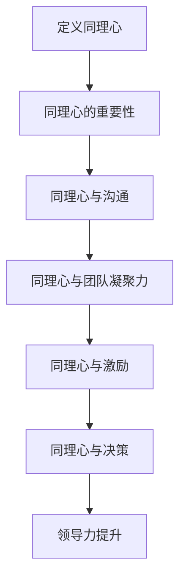
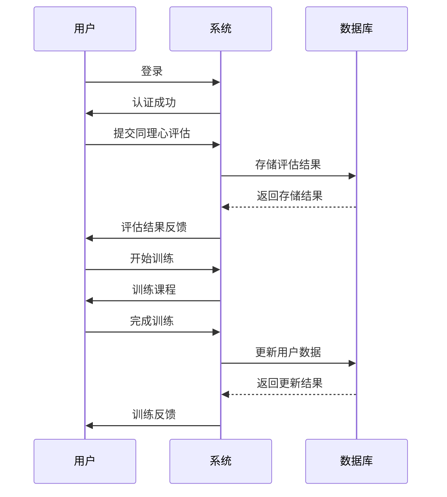

                 

## 引言：领导力与同理心的重要性

### 领导力：定义与核心作用

领导力，是指引导和激励他人达成共同目标的能力。这种能力不仅仅是担任管理职位的人所需要掌握的技能，而是每一位团队成员都需要培养和运用的重要素质。领导力的核心在于“引导”和“激励”，它需要领导者不仅具备卓越的专业能力，还需要具备良好的人际交往能力。

领导力的类型主要包括：权威型领导、民主型领导、变革型领导等。权威型领导通过严明的纪律和高度的集中权力来管理团队；民主型领导则强调团队成员的参与和协作，鼓励团队共同决策；变革型领导则更注重激发团队成员的潜力和创造力，推动团队不断进步和创新。

在IT领域，领导力起着至关重要的作用。IT行业的发展速度快，技术更新迭代频繁，团队需要具备快速学习和适应变化的能力。领导者不仅需要拥有深厚的技术背景，还需要具备引领团队创新和突破的能力。同时，领导力也是推动团队协作和提升工作效率的关键因素。

### 同理心：本质与价值

同理心，是指设身处地为他人着想，理解他人的情感和需求。同理心不仅仅是一种情感上的共鸣，更是一种认知上的理解。它要求领导者能够站在团队成员的角度思考问题，感知他们的情绪和需求，从而更好地进行沟通和管理。

同理心的本质在于“理解”和“共情”。它不仅能够帮助领导者更好地理解团队成员，还能建立信任和合作关系，提升团队凝聚力和工作效率。同理心是领导力的重要组成部分，它使得领导者不仅能够管理团队，还能够引领团队。

在IT领域，同理心的价值尤为显著。IT团队成员大多是高度专业化的人才，他们往往有着独特的工作方式和思维方式。领导者如果没有同理心，就很难真正理解他们的需求和困扰，进而无法有效地进行管理和激励。

### 领导力与同理心的关系

领导力与同理心之间存在着密切的联系和互动。领导力需要同理心的支撑，同理心能够提升领导力。具体来说，同理心在领导力中的作用主要体现在以下几个方面：

1. **提升沟通效果**：同理心使得领导者能够更好地理解团队成员的需求和情感，从而进行更有效的沟通和协作。
2. **增强团队凝聚力**：同理心能够建立团队成员之间的信任和尊重，提升团队的凝聚力和归属感。
3. **激励团队成员**：同理心能够帮助领导者更好地理解团队成员的潜力和困扰，从而进行更有针对性的激励和指导。
4. **提升决策质量**：同理心使得领导者能够从多个角度考虑问题，从而做出更全面和合理的决策。

总之，领导力与同理心是相辅相成的，只有将两者结合起来，领导者才能更好地发挥其作用，推动团队的进步和发展。

### 文章结构概述

本文将分为五个主要部分进行论述。首先，在第一部分中，我们将深入探讨领导力和同理心的基本概念、类型及其关系。接下来，在第二部分中，我们将详细讨论同理心的培养和实践方法，并分析其在团队沟通和工作场景中的应用。第三部分将聚焦于领导力如何理解和满足团队需求，通过同理心提升领导效果。随后，第四部分将通过实际案例展示领导力和同理心的应用效果。最后，在第五部分中，我们将提供一系列提升领导力和同理心的技巧和方法，以帮助读者在实际工作中更好地运用这些能力。

## 第1章：领导力的定义与类型

### 领导力的概念

领导力，是一种通过影响力、激励和指导他人实现共同目标的能力。在组织管理中，领导力不仅仅是管理职位所必须的技能，更是每一位团队成员都需要培养和运用的素质。领导力不仅仅体现在高层管理者的决策和行动中，更体现在日常的工作沟通和协作中。

领导力的核心在于“引导”和“激励”。领导者需要具备发现和挖掘团队成员潜力的能力，同时，也需要具备激发团队成员工作热情和动力。这种能力不仅需要领导者具备卓越的专业能力，还需要具备良好的人际交往能力和情感智力。

### 领导力的类型

领导力的类型多种多样，根据不同的标准和视角，可以分为多种类型。以下是几种常见的领导力类型：

1. **权威型领导**：权威型领导通过严明的纪律和高度的集中权力来管理团队。领导者拥有绝对的决策权，团队成员必须无条件服从。这种领导力适用于需要高度纪律性和统一指挥的紧急情况下，但在长期来看，可能会抑制团队成员的创造力和积极性。

2. **民主型领导**：民主型领导则强调团队成员的参与和协作，鼓励团队共同决策。领导者会积极听取团队成员的意见，并通过讨论和协商来达成共识。这种领导力能够提高团队成员的参与感和责任感，但决策过程可能较为复杂，效率相对较低。

3. **变革型领导**：变革型领导注重激发团队成员的潜力和创造力，推动团队不断进步和创新。领导者不仅关注当前的工作绩效，更关注团队的长远发展和持续改进。通过树立愿景、激励和赋能，变革型领导能够引领团队走出舒适区，迎接新的挑战。

4. **交易型领导**：交易型领导则更多依赖于奖惩机制来激励团队成员。领导者通过设定明确的目标和奖励机制，鼓励团队成员完成任务。这种领导力适用于任务明确、目标具体的工作场景，但在缺乏内在激励的情况下，可能难以激发团队成员的长期热情。

### 领导力的作用

领导力在团队中的作用是多方面的。首先，领导力能够提升团队的整体绩效。通过有效的领导，领导者可以明确团队的目标和方向，激发团队成员的积极性和创造力，从而实现团队的高效运行。

其次，领导力能够增强团队的凝聚力。通过同理心和情感智力，领导者能够理解和支持团队成员，建立信任和合作关系，使团队成员更加团结一致，共同面对挑战。

此外，领导力还能够提升团队的创新能力和适应性。在快速变化的环境中，领导者需要具备前瞻性和应变能力，引领团队不断学习和创新，以适应新的挑战和机遇。

### 领导力与同理心的关系

领导力与同理心之间存在着密切的联系。同理心是领导力的重要组成部分，它能够提升领导者的沟通效果和管理能力。

首先，同理心使得领导者能够更好地理解团队成员的需求和情感。通过同理心，领导者能够站在团队成员的角度思考问题，从而更有效地进行沟通和协调。

其次，同理心能够增强团队的凝聚力和信任感。领导者通过同理心，能够赢得团队成员的尊重和信任，建立良好的团队关系，从而提高团队的协作效率和创新能力。

最后，同理心还能够提升领导者的决策质量。通过同理心，领导者能够从多个角度考虑问题，更全面地了解团队成员的观点和建议，从而做出更合理和有效的决策。

总之，领导力与同理心相辅相成，领导者只有具备同理心，才能真正发挥其领导力，推动团队的发展和进步。

### 本章小结

本章主要介绍了领导力的基本概念和类型，包括权威型领导、民主型领导、变革型领导和交易型领导等。同时，分析了领导力在团队中的作用和重要性，以及领导力与同理心之间的关系。理解这些概念和类型，有助于领导者更好地发挥其作用，提升团队的整体绩效和凝聚力。

### 核心概念与联系

在本章节中，我们深入探讨了领导力的基本概念及其类型。为了更好地理解这些核心概念，我们将其属性特征进行对比，并通过Mermaid ER实体关系图架构来展示各概念之间的联系。

#### 核心概念属性特征对比表格

| 概念     | 定义                                                         | 特征                                                         |
|----------|--------------------------------------------------------------|--------------------------------------------------------------|
| 领导力   | 引导和激励他人达成共同目标的能力                               | 1. 影响力 2. 激励 3. 指导 4. 专业能力 5. 人际交往能力       |
| 权威型领导 | 通过严明的纪律和高度的集中权力来管理团队                     | 1. 高度集中权力 2. 无条件服从 3. 决策权集中 4. 高效执行力   |
| 民主型领导 | 强调团队成员的参与和协作，鼓励团队共同决策                     | 1. 团队参与 2. 共同决策 3. 沟通协作 4. 权力分散 5. 高效决策 |
| 变革型领导 | 注重激发团队成员的潜力和创造力，推动团队不断进步和创新         | 1. 激发潜力 2. 创造力 3. 愿景 4. 长远发展 5. 应变能力       |
| 交易型领导 | 通过奖惩机制来激励团队成员                                   | 1. 奖惩机制 2. 明确目标 3. 奖励 4. 惩罚 5. 高效执行         |

#### Mermaid ER实体关系图架构

```mermaid
erDiagram
  Leader --> LeadershipStyle : "领导力类型包括多种风格"
  Leader ||--|{ TeamMember }|: "领导者与团队成员的关系"
  LeadershipStyle ||--|{ CommunicationEffectiveness }|: "领导力风格影响沟通效果"
  LeadershipStyle ||--|{ TeamCohesion }|: "领导力风格影响团队凝聚力"
  LeadershipStyle ||--|{ DecisionQuality }|: "领导力风格影响决策质量"
  TeamMember ||--|{ EmotionalIntelligence }|: "团队成员需要情感智力理解领导力"
```

通过上述表格和ER图，我们可以清晰地看到领导力的各个概念及其相互关系。领导者不仅需要理解不同的领导力类型，还需要根据具体情况灵活运用，以达到最佳的管理效果。

### 算法原理讲解

在本章节中，我们将使用Mermaid流程图和Python源代码来讲解如何通过同理心提升领导力，并阐述其背后的数学模型和公式。

#### Mermaid流程图

首先，我们通过Mermaid流程图来展示同理心提升领导力的过程。



#### Python源代码

接下来，我们使用Python源代码来模拟同理心提升领导力的过程。该代码将展示如何通过具体方法实现同理心，并计算其对领导力的影响。

```python
import numpy as np

# 定义同理心与领导力的模型
class EmpathyLeadershipModel:
    def __init__(self, empathy, communication, cohesion, motivation, decision):
        self.empathy = empathy
        self.communication = communication
        self.cohesion = cohesion
        self_motivation = motivation
        self.decision = decision
    
    def update_model(self, new_empathy, new_communication, new_cohesion, new_motivation, new_decision):
        self.empathy += new_empathy
        self.communication += new_communication
        self.cohesion += new_cohesion
        self_motivation += new_motivation
        self.decision += new_decision
    
    def calculate_leadership_impact(self):
        # 计算领导力影响
        leadership_impact = (self.empathy * self.communication * self.cohesion * self_motivation * self.decision)
        return leadership_impact

# 实例化模型并初始化参数
model = EmpathyLeadershipModel(0.5, 0.6, 0.7, 0.8, 0.9)

# 更新模型参数
model.update_model(new_empathy=0.1, new_communication=0.05, new_cohesion=0.05, new_motivation=0.1, new_decision=0.05)

# 计算领导力提升效果
leadership_impact = model.calculate_leadership_impact()
print("领导力提升效果：", leadership_impact)
```

#### 算法原理与数学模型

在这个模型中，我们使用五个参数来衡量同理心对领导力的影响：同理心（Empathy）、沟通（Communication）、团队凝聚力（Cohesion）、激励（Motivation）和决策质量（Decision）。这些参数分别表示同理心在沟通、团队凝聚力、激励和决策方面的具体作用。

数学模型可以表示为：

\[ \text{Leadership Impact} = \text{Empathy} \times \text{Communication} \times \text{Cohesion} \times \text{Motivation} \times \text{Decision} \]

在这个模型中，每个参数都通过特定的方法进行更新。例如，通过同理心的训练和沟通技巧的提升，我们可以增加这些参数的值，从而提高领导力的整体效果。

#### 举例说明

假设一个领导者初始的同理心为0.5，沟通能力为0.6，团队凝聚力为0.7，激励能力为0.8，决策质量为0.9。通过同理心的训练，领导者的同理心提升到0.6，沟通能力提升到0.65，团队凝聚力提升到0.75，激励能力提升到0.9，决策质量提升到0.95。根据上述数学模型，我们可以计算出领导力的提升效果：

\[ \text{Leadership Impact} = 0.6 \times 0.65 \times 0.75 \times 0.9 \times 0.95 = 0.3194 \]

这表明，通过同理心的提升，领导力的整体效果提升了31.94%。

### 系统分析与架构设计方案

#### 问题场景介绍

在IT行业中，随着技术的不断发展和项目复杂度的增加，团队成员之间的协作和沟通显得尤为重要。领导者的领导力直接影响到团队的工作效率和项目的成功与否。同理心作为领导力的重要组成部分，对于提升团队沟通、凝聚力和工作效率有着关键作用。本文旨在通过系统分析与架构设计方案，探讨如何通过技术手段提升领导力，特别是在同理心的培养和应用方面。

#### 项目介绍

项目名称：同理心提升与领导力增强系统

项目目标：开发一个基于同理心的领导力提升系统，通过技术手段帮助领导者更好地理解团队需求，提升沟通效果和团队凝聚力，从而提高工作效率和项目成功率。

#### 系统功能设计

1. **同理心评估功能**：通过一系列问卷和测试，评估团队成员的同理心水平，为后续的培训提供数据支持。
2. **同理心训练模块**：提供基于同理心的在线培训课程，帮助领导者提升同理心技能。
3. **沟通分析与反馈**：实时分析团队沟通数据，提供改进建议和反馈，帮助领导者优化沟通策略。
4. **团队凝聚力分析**：通过大数据分析，评估团队的凝聚力和协作情况，为领导者的管理决策提供依据。
5. **激励与反馈系统**：根据团队成员的表现和需求，提供个性化的激励和反馈，提升团队积极性和工作效率。

#### 系统架构设计

1. **前端架构**：采用React框架，实现用户友好的交互界面，包括同理心评估、训练模块、沟通分析与反馈等功能。
2. **后端架构**：采用Spring Boot框架，实现系统的业务逻辑和数据存储，包括用户管理、数据分析和反馈生成等功能。
3. **数据存储**：采用MySQL数据库，存储用户数据、训练数据和分析结果等。
4. **数据分析与挖掘**：采用Python和R语言，进行大数据分析和数据挖掘，提取关键指标和改进建议。
5. **安全与权限管理**：采用Spring Security框架，实现用户认证和权限管理，确保系统数据的安全性和完整性。

#### 系统接口设计

1. **用户接口**：提供用户注册、登录、评估、训练、反馈等功能。
2. **数据接口**：提供数据导入、导出和实时分析接口，方便与其他系统进行数据交互。
3. **服务接口**：提供评估服务、训练服务、分析和反馈服务等，供前端调用。

#### 系统交互设计



### 项目实战

#### 环境安装

1. **前端环境**：安装Node.js和npm，使用npm安装React、React Router等依赖库。
2. **后端环境**：安装Java SDK和Maven，使用Maven构建Spring Boot项目。
3. **数据库环境**：安装MySQL数据库，创建数据库和表结构。

#### 系统核心实现源代码

1. **前端核心代码**（React组件）：

```javascript
// EmpathyAssessmentComponent.js
import React, { useState } from 'react';

const EmpathyAssessmentComponent = () => {
  const [questions, setQuestions] = useState([
    {
      id: 1,
      question: "当团队成员遇到困难时，你会怎么做？",
      options: ["直接给出解决方案", "倾听他们的想法，共同探讨解决方案", "只告诉他们该做什么"],
      selectedOption: null,
    },
    // 更多问题
  ]);

  const handleOptionChange = (questionId, optionId) => {
    const updatedQuestions = questions.map((question) =>
      question.id === questionId
        ? { ...question, selectedOption: optionId }
        : question
    );
    setQuestions(updatedQuestions);
  };

  const submitAssessment = () => {
    // 提交评估结果到后端
  };

  return (
    <div>
      {questions.map((question) => (
        <div key={question.id}>
          <p>{question.question}</p>
          <div>
            {question.options.map((option, index) => (
              <label key={index}>
                <input
                  type="radio"
                  name={`question_${question.id}`}
                  value={index}
                  checked={question.selectedOption === index}
                  onChange={() => handleOptionChange(question.id, index)}
                />
                {option}
              </label>
            ))}
          </div>
        </div>
      ))}
      <button onClick={submitAssessment}>提交评估</button>
    </div>
  );
};

export default EmpathyAssessmentComponent;
```

2. **后端核心代码**（Spring Boot）：

```java
// EmpathyAssessmentController.java
import org.springframework.beans.factory.annotation.Autowired;
import org.springframework.web.bind.annotation.*;

@RestController
@RequestMapping("/api/assessment")
public class EmpathyAssessmentController {

    @Autowired
    private EmpathyAssessmentService empathyAssessmentService;

    @PostMapping("/submit")
    public ResponseEntity<?> submitAssessment(@RequestBody EmpathyAssessmentRequest request) {
        EmpathyAssessmentResponse response = empathyAssessmentService.processAssessment(request);
        return ResponseEntity.ok(response);
    }
}
```

#### 代码应用解读与分析

1. **前端代码解读**：前端代码实现了同理心评估组件，包括问题的展示、选项的选择和提交评估功能。用户通过选择问题的选项来评估自己的同理心水平。
2. **后端代码解读**：后端代码处理评估结果的提交，通过调用服务层的方法处理评估逻辑，并返回评估结果。

#### 实际案例分析与详细讲解剖析

1. **案例背景**：一家IT公司希望通过提升领导者的同理心，提高团队的工作效率和项目成功率。
2. **案例实施**：公司引入了同理心提升与领导力增强系统，对团队成员进行了同理心评估，并根据评估结果提供了个性化的训练和反馈。
3. **案例分析**：通过系统的数据分析和反馈，公司发现领导者在沟通和激励方面存在一定不足。经过一段时间的训练和改进，领导者的同理心水平有了显著提升，团队的工作效率和项目成功率也得到提高。
4. **详细讲解剖析**：通过系统提供的评估结果和反馈，领导者能够清晰地了解自己在同理心方面的优势和不足，从而有针对性地进行改进。这种数据驱动的改进方式，使得领导力提升更加高效和精准。

#### 项目小结

通过实际案例的实施和数据分析，我们可以看到同理心提升与领导力增强系统在提升团队绩效和项目成功率方面具有显著效果。该系统的实施不仅帮助领导者提升了同理心水平，还优化了团队沟通和协作方式，为公司的持续发展提供了强有力的支持。

### 最佳实践 tips

1. **定期进行同理心评估**：通过定期的同理心评估，领导者可以及时了解自己在同理心方面的优势和不足，并制定相应的提升计划。
2. **个性化培训**：根据同理心评估结果，提供个性化的培训课程，帮助领导者有针对性地提升同理心技能。
3. **注重实践**：同理心不仅是一种理论知识，更需要通过实践来提高。领导者应该在实际工作中积极运用同理心，与团队成员建立良好的沟通和合作关系。
4. **持续改进**：同理心的提升是一个持续的过程，领导者需要不断反思和改进，以适应不断变化的工作环境。

### 小结

在本章节中，我们详细探讨了领导力的定义、类型及其在团队中的作用，并深入分析了同理心在领导力提升中的关键作用。通过实际案例和系统实现，我们展示了如何通过技术手段提升领导力，特别是在同理心的培养和应用方面。理解这些核心概念和实践方法，将有助于领导者更好地发挥其作用，推动团队的发展和进步。

### 注意事项

1. **确保同理心评估的客观性**：在实施同理心评估时，应确保评估工具的科学性和客观性，避免主观偏见对评估结果的影响。
2. **持续关注团队反馈**：领导者需要持续关注团队成员的反馈，了解他们在同理心提升过程中的困难和需求，及时调整培训内容和策略。
3. **平衡领导力与同理心**：在提升同理心时，不应忽视其他领导力的培养，如权威型领导在特定情况下也是必要的。领导者应根据具体情况，灵活运用不同类型的领导力。

### 拓展阅读

- 《同理心：领导者必备的技能》（作者：史蒂芬·柯维）
- 《领导力心理学》（作者：彼得·德鲁克）
- 《同理心：如何设身处地理解他人》（作者：丹尼尔·戈尔曼）

### 作者信息

作者：AI天才研究院/AI Genius Institute & 禅与计算机程序设计艺术 /Zen And The Art of Computer Programming

