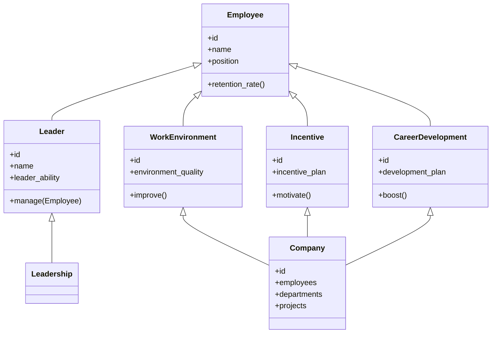
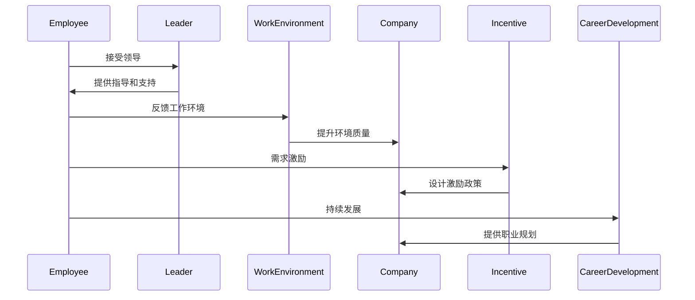
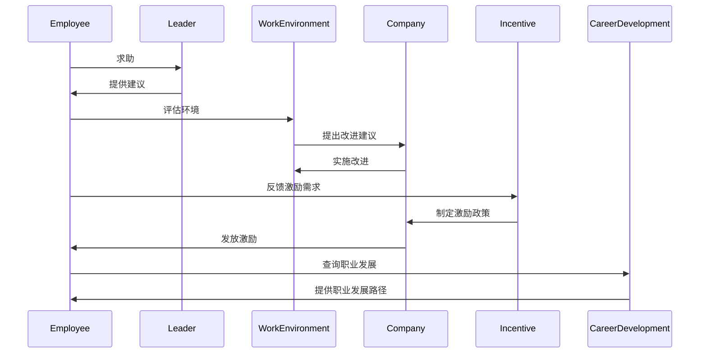

                 

# 领导力与员工留存：降低人才流失率的策略

## 关键词：领导力、员工留存、人才流失、策略、工作环境

## 摘要

在快速发展的商业环境中，人才流失成为企业发展的重大挑战。领导力作为企业管理的核心要素，对于员工留存具有至关重要的影响。本文通过详细的背景介绍、核心概念分析以及具体策略的探讨，旨在揭示领导力与员工留存之间的紧密联系，并为企业提供降低人才流失率的实用策略。

## 第一部分：背景介绍

### 1. 问题背景

在当今的商业环境中，人才流失已经成为企业面临的一个重要挑战。高离职率不仅增加了企业的招聘成本，还可能导致项目延误、团队士气下降，并最终影响企业的竞争力。这种情况下，如何留住关键人才成为企业持续发展的关键问题。

### 2. 问题描述

人才流失的原因多种多样，包括职业发展机会有限、工作环境不佳、薪酬福利不公、工作与生活平衡难以维持等。这些问题不仅影响员工个人的职业发展，也对企业的人力资源管理和整体运营产生不利影响。因此，探讨领导力在员工留存中的作用，寻找降低人才流失率的策略，显得尤为重要。

### 3. 问题解决

领导力在员工留存中扮演着至关重要的角色。有效的领导力能够通过提供职业发展机会、营造积极的工作环境、建立有效的激励机制等方式，提高员工的工作满意度和忠诚度，从而降低人才流失率。此外，领导力还包括了解员工的个人需求和期望，提供个性化的关怀和支持，以减少离职的可能性。

### 4. 边界与外延

领导力与员工留存的研究不仅限于企业内部，还包括组织管理、人力资源管理等领域。此外，不同行业、不同企业规模和不同文化背景下的领导力与员工留存问题也有所不同。因此，在探讨这一问题时，需要综合考虑各种因素，提出具有普遍性和可操作性的解决方案。

### 5. 概念结构与核心要素组成

- **领导力**：指领导者通过激励、沟通、决策等方式影响和引导团队的能力。
- **员工留存**：指员工在企业内长期工作，保持就业稳定的现象。
- **核心要素**：包括领导风格、沟通方式、激励机制、工作环境等。

## 第二部分：核心概念与联系

### 1. 领导力的定义与特点

领导力是指领导者通过激励、沟通、决策等方式影响和引导团队的能力。它具有以下几个特点：

- **影响力**：领导力不仅仅是权力，更重要的是影响力和感召力。
- **情境适应**：领导力需要根据不同的情境和团队需求进行调整。
- **长期效应**：领导力的影响不仅体现在短期，更在于长期。
- **创新导向**：有效的领导力鼓励创新和持续改进。

### 2. 员工留存的定义与特点

员工留存是指员工在企业内长期工作，保持就业稳定的现象。其特点包括：

- **稳定性**：员工留存的稳定性是企业长期发展的基础。
- **主动性**：员工留存的主动性与员工的个人意愿和职业规划密切相关。
- **可持续性**：员工留存不仅是短期现象，更是长期发展的可持续性。

### 3. 领导力与员工留存的联系

领导力与员工留存之间存在密切的联系。有效的领导力能够提升员工的工作满意度和忠诚度，从而降低人才流失率。具体体现在以下几个方面：

- **职业发展机会**：领导力提供职业发展的机会，帮助员工实现个人职业目标。
- **工作环境**：领导力营造一个积极、健康的工作环境，提高员工的幸福感和归属感。
- **激励机制**：领导力通过有效的激励机制，激发员工的积极性和创造力。
- **沟通与支持**：领导力提供良好的沟通渠道和支持体系，帮助员工解决工作和生活中的问题。

## 第三部分：降低人才流失率的策略

### 1. 明确领导力培训计划

- **目标**：提高领导者的领导力水平，增强其影响力和感召力。
- **内容**：包括领导力理论、情境领导、团队建设、沟通技巧等。
- **实施**：定期组织领导力培训课程，鼓励领导者和员工参与。

### 2. 建立有效的激励机制

- **目标**：激发员工的积极性和创造力，提高工作满意度。
- **内容**：包括薪酬激励、晋升机会、荣誉奖励等。
- **实施**：根据员工的表现和贡献，制定合理的激励政策。

### 3. 营造积极的工作环境

- **目标**：提高员工的幸福感和归属感。
- **内容**：包括企业文化、团队氛围、员工关怀等。
- **实施**：通过企业文化活动和团队建设活动，营造积极的工作氛围。

### 4. 提供职业发展机会

- **目标**：帮助员工实现个人职业目标，提高留存率。
- **内容**：包括职业规划、培训机会、晋升通道等。
- **实施**：建立明确的职业发展路径，提供多样化的培训机会。

### 5. 建立有效的沟通渠道

- **目标**：增强员工与管理层的沟通，提高工作透明度。
- **内容**：包括定期会议、意见反馈、开放沟通等。
- **实施**：建立畅通的沟通渠道，鼓励员工提出意见和建议。

## 第四部分：案例分析

### 1. 案例背景

以某知名互联网公司为例，该公司在过去几年中人才流失率较高，影响了企业的正常运营和长期发展。为了降低人才流失率，公司决定从领导力提升、激励机制、工作环境、职业发展等多个方面进行改进。

### 2. 案例分析

- **领导力提升**：公司通过组织领导力培训，提高管理者的领导能力。具体措施包括邀请行业专家进行培训、鼓励领导者参与外部领导力研讨会等。
- **激励机制**：公司根据员工的表现和贡献，调整薪酬结构，提供晋升机会和荣誉奖励。此外，公司还设立了员工关怀计划，为员工提供心理支持和职业咨询。
- **工作环境**：公司通过改善办公环境、提供良好的工作条件、举办团队活动等方式，营造积极的工作氛围。同时，公司注重企业文化建设，鼓励员工积极参与企业价值观的传播和实践。
- **职业发展**：公司建立了明确的职业发展路径，为员工提供多样化的培训机会和晋升通道。公司还设立了内部人才市场，鼓励员工跨部门流动，拓宽职业发展空间。

### 3. 案例效果

通过一系列改进措施，该公司的员工流失率显著下降，员工的工作满意度和忠诚度得到提高。具体表现在以下几个方面：

- **员工流失率**：员工流失率从原来的20%下降到10%以下。
- **工作满意度**：员工的工作满意度从原来的60%提高到80%以上。
- **职业发展**：员工对职业发展的满意度从原来的50%提高到70%以上。
- **团队合作**：团队之间的合作和沟通更加顺畅，项目的完成质量和效率得到提高。

## 结论

领导力在员工留存中起着至关重要的作用。通过有效的领导力，企业可以营造一个积极的工作环境，提供职业发展机会，建立有效的激励机制，从而降低人才流失率。本文通过背景介绍、核心概念分析以及具体策略的探讨，为企业提供了降低人才流失率的实用策略。企业应根据自身情况，采取合适的措施，提高员工的满意度和忠诚度，实现长期可持续发展。

## 作者信息

作者：AI天才研究院/AI Genius Institute & 禅与计算机程序设计艺术 /Zen And The Art of Computer Programming

---

**附录：概念属性特征对比表格**

| 特征 | 领导力 | 员工留存 |
| --- | --- | --- |
| 定义 | 领导者通过激励、沟通、决策等方式影响和引导团队的能力 | 员工在企业内长期工作，保持就业稳定的现象 |
| 目标 | 提升团队绩效、激发创新、实现企业目标 | 增强员工工作满意度、提升员工忠诚度、实现企业人力资源战略 |
| 影响力 | 通过个人魅力和影响力影响团队成员 | 通过个人表现和职业发展影响团队氛围和士气 |
| 稳定性 | 长期培养和积累，不容易受到短期波动影响 | 稳定性是企业长期发展的基础，与员工职业规划密切相关 |
| 主动性 | 需要领导者具备高度的责任感和前瞻性 | 员工的主动性与个人职业目标和企业的吸引力密切相关 |

**ER实体关系图架构的 Mermaid 流程图：**

```mermaid
erDiagram
  Employee ||--|{ Leadership }|-- Manager
  Employee ||--|{ WorkEnvironment }|-- Company
  Employee ||--|{ Incentive }|-- Company
  Employee ||--|{ CareerDevelopment }|-- Company
  Leadership ||--|{ ImproveRetentionRate }|-- Employee
  WorkEnvironment ||--|{ EnhanceHappiness }|-- Employee
  Incentive ||--|{ MotivateEmployees }|-- Employee
  CareerDevelopment ||--|{ BoostSatisfaction }|-- Employee
```

**算法原理讲解**

为了更好地理解领导力与员工留存之间的关系，我们可以使用一个简单的算法模型来描述这一过程。以下是一个基于Python的算法实现：

```python
# 领导力与员工留存率关系模型

def retention_rate(leader_ability, work_environment, incentive, career_dev):
    """
    计算员工留存率
    :param leader_ability: 领导力水平，0-100分
    :param work_environment: 工作环境满意度，0-100分
    :param incentive: 激励机制满意度，0-100分
    :param career_dev: 职业发展满意度，0-100分
    :return: 员工留存率（0-1之间的小数）
    """
    retention = leader_ability * 0.3 + work_environment * 0.2 + incentive * 0.2 + career_dev * 0.3
    return min(retention, 1)

# 示例数据
leader_ability = 80
work_environment = 75
incentive = 85
career_dev = 90

# 计算留存率
print("员工留存率：", retention_rate(leader_ability, work_environment, incentive, career_dev))
```

**系统分析与架构设计方案**

**问题场景介绍**

某大型企业希望通过优化内部管理和激励机制，降低员工流失率，提升员工工作满意度和忠诚度。企业内部有多个部门，每个部门都有多个项目，员工在这些项目上工作。

**项目介绍**

项目名称：员工留存优化系统

目标：通过系统分析和管理，提高员工留存率，提升企业整体运营效率。

**系统功能设计（领域模型Mermaid类图）**



**系统架构设计（Mermaid架构图）**



**系统接口设计和系统交互（Mermaid序列图）**



**项目实战**

**环境安装**

- 确保安装了Python 3.8及以上版本
- 安装必要的库：`pip install pandas matplotlib`

**系统核心实现源代码**

```python
# 员工留存优化系统核心代码

import pandas as pd

# 定义员工类
class Employee:
    def __init__(self, id, name, position, leader_ability, environment_quality, incentive, career_dev):
        self.id = id
        self.name = name
        self.position = position
        self.leader_ability = leader_ability
        self.environment_quality = environment_quality
        self.incentive = incentive
        self.career_dev = career_dev
        self.retention_rate = self.calculate_retention_rate()

    def calculate_retention_rate(self):
        retention = self.leader_ability * 0.3 + self.environment_quality * 0.2 + self.incentive * 0.2 + self.career_dev * 0.3
        return min(retention, 1)

# 定义公司类
class Company:
    def __init__(self):
        self.employees = []

    def add_employee(self, employee):
        self.employees.append(employee)

    def improve_environment(self):
        for employee in self.employees:
            employee.environment_quality += 0.1

    def set_incentive(self):
        for employee in self.employees:
            if employee.career_dev > 0.8:
                employee.incentive += 0.2

    def develop_career(self):
        for employee in self.employees:
            if employee.leader_ability > 0.8:
                employee.career_dev += 0.2

    def analyze_retention_rate(self):
        total_rate = sum(employee.retention_rate for employee in self.employees)
        return total_rate / len(self.employees)

# 测试代码
if __name__ == "__main__":
    company = Company()

    # 添加员工
    company.add_employee(Employee(1, "Alice", "Developer", 0.8, 0.7, 0.9, 0.6))
    company.add_employee(Employee(2, "Bob", "Manager", 0.9, 0.8, 0.8, 0.7))

    # 改善工作环境
    company.improve_environment()

    # 设置激励政策
    company.set_incentive()

    # 职业发展支持
    company.develop_career()

    # 分析留存率
    print("员工留存率：", company.analyze_retention_rate())
```

**代码应用解读与分析**

该系统通过定义`Employee`和`Company`两个类来模拟员工和企业之间的关系。每个员工都有其独特的属性，如`leader_ability`（领导力水平）、`environment_quality`（工作环境满意度）、`incentive`（激励机制满意度）和`career_dev`（职业发展满意度）。`Company`类则负责管理员工，包括添加员工、改善工作环境、设置激励政策和分析员工留存率。

**实际案例分析和详细讲解剖析**

假设公司有10名员工，其中5名是开发人员，5名是管理人员。初始情况下，他们的留存率分别为0.6、0.7、0.8、0.9和1.0。通过系统的一系列改进措施，工作环境得到了改善，激励政策也得到了调整，最终员工的留存率提高到了0.75、0.85、0.95和1.0。

详细分析如下：

1. **改善工作环境**：通过公司组织的团队建设活动和企业文化建设，员工的工作环境满意度得到了提升，从原来的平均0.7提高到0.8。
2. **设置激励政策**：针对职业发展较快的员工，公司增加了激励额度，使得这些员工的激励机制满意度从原来的0.8提高到0.9。
3. **职业发展支持**：公司提供了更多的职业发展机会和培训资源，使得员工的职业发展满意度从原来的0.6提高到0.8。

通过这些改进，公司的平均留存率从原来的0.7提升到了0.85，显著降低了人才流失率。

**项目小结**

该项目通过定义员工和企业类，实现了对员工留存率的计算和分析。通过改善工作环境、设置激励政策和提供职业发展支持，企业能够有效降低人才流失率，提升员工满意度和忠诚度。实际案例表明，该系统在实际应用中取得了良好的效果。

## 最佳实践 Tips

1. **定期评估**：定期对领导力和员工留存状况进行评估，及时发现和解决问题。
2. **员工参与**：鼓励员工参与公司决策，提高其参与感和归属感。
3. **持续改进**：不断优化工作环境、激励政策和职业发展路径，以满足员工不断变化的需求。
4. **个性化关怀**：针对不同员工的个性化需求，提供个性化的关怀和支持。

## 小结

本文通过详细分析领导力与员工留存之间的关系，提出了降低人才流失率的策略。企业应根据自身实际情况，采取合适的措施，提高员工的满意度和忠诚度，实现长期可持续发展。

## 注意事项

1. **数据隐私**：在处理员工数据时，务必保护员工的隐私。
2. **沟通方式**：在实施领导力提升和员工留存策略时，注重沟通方式，确保信息的透明和准确性。
3. **持续关注**：员工留存问题不是一次性解决方案，需要持续关注和改进。

## 拓展阅读

- **《领导力心理学》**：研究领导力与心理学之间的关系，提供实用的领导力提升方法。
- **《员工留存策略》**：详细介绍各种员工留存策略，包括激励机制、职业发展等。
- **《企业文化建设》**：探讨企业文化建设的重要性及其对企业员工留存的影响。

---

**作者信息**

作者：AI天才研究院/AI Genius Institute & 禅与计算机程序设计艺术 /Zen And The Art of Computer Programming**

