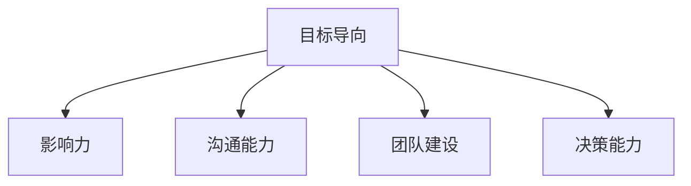
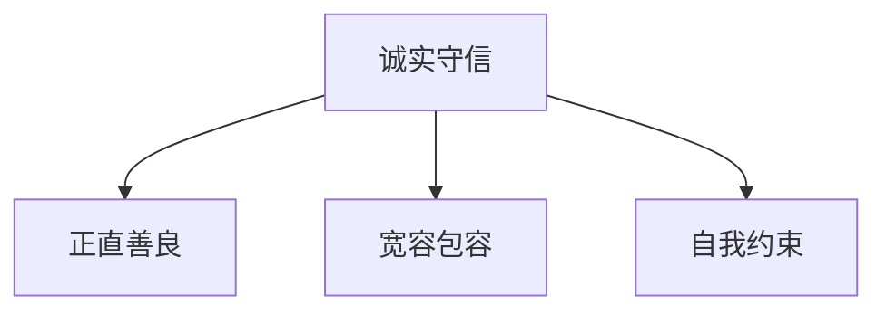
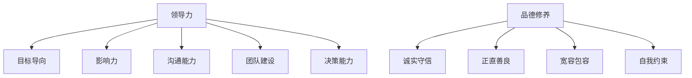
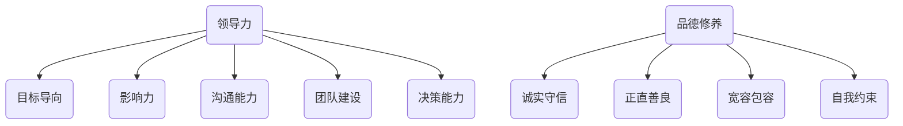

                 

# 领导力与品德修养：塑造高尚人格

## 关键词

领导力、品德修养、高尚人格、个人成长、组织发展、实践指南

## 摘要

本文深入探讨了领导力与品德修养之间的关系，以及如何通过高尚的人格塑造提升个人和组织的综合竞争力。文章首先阐述了领导力与品德修养的定义和核心要素，随后通过理论和实际案例分析了二者的相互影响和作用机制。在此基础上，文章提出了具体的实践方法和策略，帮助读者在实际工作中培养高尚的人格和领导力，最终实现个人与组织的共同成长。

## 第一部分：背景介绍

### 1.1 问题背景

领导力与品德修养作为现代管理中的重要概念，已经成为推动个人和组织发展的重要力量。在企业管理中，领导力被视为企业创新和持续发展的关键因素，而品德修养则是企业文化的基石。随着全球化竞争的加剧，企业需要具备强大的领导力来应对复杂多变的市场环境，同时也需要高尚的品德修养来赢得员工的信任和市场的尊重。

#### 1.1.1 社会需求

社会的发展对领导者和组织提出了更高的要求。现代社会需要领导者不仅具备卓越的领导能力，还要具备高尚的品德修养，能够以身作则，引领团队共同进步。这种领导力不仅体现在企业内部，还体现在对社会的责任感和影响力上。因此，探讨领导力与品德修养的关系，对于提升个人领导能力和企业竞争力具有重要意义。

#### 1.1.2 现实问题

当前，许多企业在领导力与品德修养方面存在一定问题。一方面，一些领导者缺乏对品德修养的重视，只注重个人权力和利益的追求，忽视了团队和社会的利益。另一方面，一些企业在选拔和培养领导者时，过分强调领导力的技术层面，忽视了品德修养的培育。这些问题不仅影响了企业的正常运营，还可能导致企业声誉受损。

#### 1.1.3 问题解决

为了解决上述问题，本文旨在从理论与实践两个层面，探讨领导力与品德修养的关系，为读者提供一套系统、实用的领导力与品德修养提升方法。本文不仅关注领导者个人素质的提升，还关注领导者如何影响和塑造团队成员的品德修养。通过深入分析领导力与品德修养的核心要素，本文旨在为读者提供一套行之有效的实践指南，帮助他们在实际工作中培养高尚的人格和领导力。

### 1.2 边界与外延

#### 1.2.1 领导力

领导力是指领导者通过影响、激励和引导他人，实现共同目标的能力。领导力不仅涉及个人能力，还涉及人际关系、组织文化和战略思维等方面。

#### 1.2.2 品德修养

品德修养是指个人在道德、品行、习惯等方面的综合素质。品德修养是一个长期的过程，需要通过不断学习和实践来提升。

### 1.3 概念结构与核心要素组成

#### 1.3.1 领导力与品德修养的关系

领导力与品德修养密切相关，二者相辅相成。一个优秀的领导者不仅需要具备强大的领导力，还需要具备高尚的品德修养。领导力是品德修养的外在表现，品德修养是领导力的内在基础。

#### 1.3.2 领导力与品德修养的核心要素

领导力的核心要素包括：目标设定、沟通协调、团队建设、决策能力等；品德修养的核心要素包括：诚实守信、正直善良、宽容包容、自我约束等。

### 1.4 本章小结

本章从问题背景、现实问题、问题解决等方面，对领导力与品德修养进行了深入分析。通过明确领导力与品德修养的概念和核心要素，为后续章节的内容奠定了基础。

----------------------------------------------------------------

## 第二部分：核心概念与联系

### 2.1 领导力原理

#### 2.1.1 领导力的定义

领导力是指领导者通过影响、激励和引导他人，实现共同目标的能力。领导力不仅涉及个人能力，还涉及人际关系、组织文化和战略思维等方面。

#### 2.1.2 领导力的核心要素

领导力的核心要素包括：目标导向、影响力、沟通能力、团队建设、决策能力等。

##### 2.1.2.1 目标导向

目标导向是指领导者能够明确目标，并引导团队成员为实现目标而努力。目标导向是领导力的基础。

##### 2.1.2.2 影响力

影响力是指领导者能够影响他人的行为、态度和决策。影响力是领导力的核心要素之一。

##### 2.1.2.3 沟通能力

沟通能力是指领导者能够有效地与团队成员进行沟通，理解他们的需求和意见。沟通能力是领导力的重要体现。

##### 2.1.2.4 团队建设

团队建设是指领导者能够构建一个有凝聚力和协作精神的团队。团队建设是领导力的重要组成部分。

##### 2.1.2.5 决策能力

决策能力是指领导者能够在复杂环境中做出正确决策。决策能力是领导力的关键要素。

#### 2.1.3 领导力原理的Mermaid流程图

### 2.2 品德修养原理

#### 2.2.1 品德修养的定义

品德修养是指个人在道德、品行、习惯等方面的综合素质。品德修养是一个长期的过程，需要通过不断学习和实践来提升。

#### 2.2.2 品德修养的核心要素

品德修养的核心要素包括：诚实守信、正直善良、宽容包容、自我约束等。

##### 2.2.2.1 诚实守信

诚实守信是指个人在言行中始终坚持真实、诚实，遵守承诺。诚实守信是品德修养的基础。

##### 2.2.2.2 正直善良

正直善良是指个人在行为和决策中始终坚持正义，善良待人。正直善良是品德修养的重要体现。

##### 2.2.2.3 宽容包容

宽容包容是指个人在面对他人的不足和错误时，能够宽容、理解和包容。宽容包容是品德修养的体现。

##### 2.2.2.4 自我约束

自我约束是指个人在行为和思维上，能够自我控制，遵守道德规范。自我约束是品德修养的保障。

#### 2.2.3 品德修养原理的Mermaid流程图

### 2.3 领导力与品德修养的联系

领导力与品德修养之间存在着紧密的联系，二者相互作用，共同推动个人和组织的成长。

#### 2.3.1 领导力对品德修养的影响

领导力通过以下几个方面影响品德修养：
1. **示范作用**：领导者通过自身的行为和决策，为团队成员树立榜样，影响他们的道德观念和行为习惯。
2. **激励机制**：领导力可以通过奖励和惩罚等机制，激励团队成员遵守道德规范，提升品德修养。
3. **文化塑造**：领导力通过塑造组织文化，推动形成良好的道德氛围，促进团队成员的品德修养。

#### 2.3.2 品德修养对领导力的影响

品德修养对领导力的影响体现在以下几个方面：
1. **信任基础**：高尚的品德修养能够赢得团队成员的信任，为领导力的发挥提供坚实的基础。
2. **决策能力**：品德修养良好的领导者，在决策过程中能够更加客观、公正，减少因个人利益驱动而做出的错误决策。
3. **团队凝聚力**：品德修养良好的领导者能够更好地凝聚团队，提升团队的整体战斗力。

#### 2.3.3 领导力与品德修养的相互促进

领导力与品德修养是相互促进的关系。高尚的品德修养能够提升领导力，使领导者更加有效地影响和激励团队成员；而强大的领导力则能够推动团队成员更好地践行道德规范，提升品德修养。这种相互促进的关系，构成了个人和组织的核心竞争力。

### 2.4 本章小结

本章详细阐述了领导力与品德修养的核心概念和相互联系。通过分析领导力与品德修养的原理和影响机制，本文为读者提供了深入理解二者关系的基础。下一章将结合具体案例，进一步探讨如何在实际工作中培养高尚的领导力和品德修养。

----------------------------------------------------------------

## 第三部分：案例分析

为了更深入地理解领导力与品德修养之间的关系，我们通过具体案例来探讨二者在实际工作中的应用。

### 3.1 案例一：谷歌公司的领导力与品德修养

谷歌公司以其卓越的领导力和高尚的企业文化而闻名。谷歌的创始人拉里·佩奇和谢尔盖·布林，以其强大的领导力和高尚的品德修养，引领谷歌取得了巨大的成功。

#### 3.1.1 领导力体现

1. **目标导向**：谷歌的领导者在成立之初就明确了公司的愿景，即组织全球信息，使人人皆可访问并从中受益。这一目标引导了谷歌的发展方向。
2. **影响力**：佩奇和布林以其创新和远见卓识，影响了整个科技行业，推动了互联网技术的发展。
3. **沟通能力**：谷歌的领导层通过开放的文化和透明的沟通，与员工建立了良好的沟通渠道，确保信息的有效传递。

#### 3.1.2 品德修养体现

1. **诚实守信**：谷歌在数据隐私和安全方面严格遵守法律法规，赢得了用户的信任。
2. **正直善良**：谷歌倡导创新和自由，鼓励员工提出新的想法，即使这些想法与现有流程相冲突。
3. **宽容包容**：谷歌鼓励多样性和包容性，尊重员工的差异，为每个人提供平等的发展机会。

#### 3.1.3 案例分析

谷歌的成功很大程度上归因于其领导力和高尚的品德修养。领导力帮助谷歌明确了目标，并在变革过程中保持了方向；而高尚的品德修养则确保了谷歌在实现目标的过程中，始终坚持正确的道德和价值观念。这种领导力和品德修养的结合，为谷歌的持续创新和快速发展提供了强有力的支撑。

### 3.2 案例二：华为公司的领导力与品德修养

华为公司作为中国高科技企业的代表，以其强大的领导力和高尚的品德修养在国际市场上取得了显著的成绩。

#### 3.2.1 领导力体现

1. **目标导向**：华为的领导者在面对激烈的市场竞争时，始终坚持以客户为中心，不断提升产品质量和服务水平。
2. **影响力**：华为的创始人任正非以其深刻的洞察力和坚定的信念，影响了整个企业，使其在复杂的市场环境中始终保持竞争力。
3. **沟通能力**：华为通过建立高效的内部沟通机制，确保了信息的高效传递和资源的合理配置。

#### 3.2.2 品德修养体现

1. **诚实守信**：华为在商业活动中始终坚持诚信原则，赢得了客户的信任和合作伙伴的支持。
2. **正直善良**：华为鼓励员工以正直善良的态度对待工作和生活，营造了积极向上的企业文化。
3. **宽容包容**：华为尊重员工的个人差异，鼓励创新，为员工提供广阔的发展空间。

#### 3.2.3 案例分析

华为的成功不仅在于其卓越的领导力，还在于其高尚的品德修养。领导力帮助华为在市场竞争中脱颖而出，而高尚的品德修养则确保了企业在快速发展过程中，始终遵循正确的道德准则，赢得了市场和社会的认可。

### 3.3 案例三：比尔·盖茨与微软公司的领导力与品德修养

比尔·盖茨作为微软公司的创始人，以其卓越的领导力和高尚的品德修养，推动了微软成为全球科技行业的领军企业。

#### 3.3.1 领导力体现

1. **目标导向**：比尔·盖茨始终坚持以技术创新为驱动，带领微软不断推出革命性的产品。
2. **影响力**：盖茨以其远见卓识和坚定的信念，影响了整个科技行业，推动了计算机技术的发展。
3. **沟通能力**：盖茨通过开放的文化和透明的沟通，与员工和合作伙伴建立了良好的关系。

#### 3.3.2 品德修养体现

1. **诚实守信**：盖茨在商业活动中始终坚持诚信原则，赢得了用户的信任和合作伙伴的支持。
2. **正直善良**：盖茨倡导慈善事业，通过比尔和梅琳达·盖茨基金会，致力于全球健康和教育事业。
3. **宽容包容**：盖茨尊重员工的个人差异，鼓励创新，为员工提供广阔的发展空间。

#### 3.3.3 案例分析

比尔·盖茨的成功不仅在于其卓越的领导力，还在于其高尚的品德修养。领导力帮助盖茨和微软在科技行业中始终保持领先地位，而高尚的品德修养则确保了微软在追求商业成功的过程中，始终遵循正确的道德准则，赢得了社会的高度认可。

### 3.4 案例总结

通过以上案例分析，我们可以看到，领导力与品德修养在个人和组织成功中起到了关键作用。领导力帮助个人和组织设定目标、激励团队、提升沟通能力，而高尚的品德修养则为个人和组织赢得了信任、塑造了良好的企业形象。二者相互促进，共同构成了个人和组织的核心竞争力。

### 3.5 本章小结

本章通过具体案例，深入分析了领导力与品德修养在实际工作中的体现和作用。通过谷歌、华为和微软等成功企业的案例，我们可以看到，领导力与品德修养的结合，不仅有助于个人和组织取得成功，还能为社会带来积极的影响。下一章将结合理论和实践，提出具体的培养方法和策略。

----------------------------------------------------------------

## 第四部分：培养方法和策略

在了解了领导力与品德修养的重要性以及其在个人和组织成功中的关键作用后，本部分将探讨具体的培养方法和策略，帮助读者在实际工作中提升自己的领导力和品德修养。

### 4.1 培养领导力的方法

#### 4.1.1 目标设定

目标设定是领导力的基础。一个明确的、具有挑战性的目标能够激励团队成员共同努力。以下是一些目标设定的技巧：

1. **SMART原则**：目标应具备具体的（Specific）、可测量的（Measurable）、可实现的（Achievable）、相关的（Relevant）和有时限的（Time-bound）。
2. **目标分解**：将大目标分解为小目标，逐步实现，这样可以更清晰地看到进展和成果。
3. **激励承诺**：与团队成员共同设定目标，并激励他们为实现目标而努力。

#### 4.1.2 影响力提升

影响力是领导力的核心要素之一。以下是一些提升影响力的方法：

1. **建立信任**：通过诚实守信、正直善良等品德修养，赢得团队成员的信任。
2. **沟通技巧**：提高沟通能力，善于倾听和理解团队成员的需求和意见。
3. **领导风格**：根据团队特点和任务需求，选择合适的领导风格，如民主式、权威式或参与式。

#### 4.1.3 团队建设

团队建设是提升领导力的关键。以下是一些团队建设的策略：

1. **明确角色和责任**：确保每个团队成员都清楚自己的角色和责任，避免工作重叠和责任缺失。
2. **培养团队合作精神**：通过团队活动、培训和激励，培养团队成员的团队合作精神。
3. **激励机制**：建立合理的激励机制，鼓励团队成员共同努力，实现团队目标。

#### 4.1.4 决策能力

决策能力是领导力的关键要素。以下是一些提升决策能力的策略：

1. **信息收集**：在做出决策前，充分收集相关信息，确保决策的准确性。
2. **风险评估**：对决策可能带来的风险进行评估，制定应对措施。
3. **团队合作**：与团队成员共同讨论和决策，充分利用集体智慧。

### 4.2 培养品德修养的方法

#### 4.2.1 诚实守信

诚实守信是品德修养的基础。以下是一些培养诚实守信的方法：

1. **言行一致**：在言行上始终保持一致，避免欺骗和虚伪。
2. **遵守承诺**：对做出的承诺要全力以赴，不轻易放弃。
3. **正直善良**：在决策和行动中始终坚持正义和善良，不偏不倚。

#### 4.2.2 正直善良

正直善良是品德修养的重要体现。以下是一些培养正直善良的方法：

1. **公正无私**：在处理事情时，始终坚持公正和无私，不偏袒任何一方。
2. **关爱他人**：关心团队成员，关注他们的需求和感受，提供帮助和支持。
3. **积极向上**：面对困难和挑战，保持积极向上的态度，鼓励团队成员共同克服困难。

#### 4.2.3 宽容包容

宽容包容是品德修养的体现。以下是一些培养宽容包容的方法：

1. **尊重差异**：尊重团队成员的个性和差异，接受不同的观点和意见。
2. **理解和接纳**：理解和接纳团队成员的不足和错误，给予宽容和包容。
3. **沟通协调**：通过有效的沟通和协调，解决团队成员之间的矛盾和冲突。

#### 4.2.4 自我约束

自我约束是品德修养的保障。以下是一些培养自我约束的方法：

1. **自我反思**：定期反思自己的言行，发现问题并及时纠正。
2. **道德规范**：遵守道德规范，不违背社会伦理和道德准则。
3. **自我提升**：通过不断学习和实践，提升自己的品德修养，成为更好的领导者。

### 4.3 综合培养策略

领导力和品德修养的培养是一个长期而复杂的过程，需要综合考虑多种因素。以下是一些综合培养策略：

1. **持续学习**：不断学习新的知识和技能，提升自身的综合素质。
2. **实践经验**：通过实际工作经验，不断积累和总结，提升领导力和品德修养。
3. **榜样示范**：学习优秀的领导者，借鉴他们的经验和做法，提升自己的领导力和品德修养。
4. **自我约束**：通过自我约束，克服自身的缺点和不足，不断提升自己的领导力和品德修养。

### 4.4 本章小结

通过本部分的内容，我们提出了培养领导力和品德修养的具体方法和策略。这些方法和策略不仅适用于个人，也适用于组织。通过持续的学习和实践，不断总结和提升，我们每个人都能够成为具备高尚人格和强大领导力的优秀领导者。

----------------------------------------------------------------

## 第五部分：实践指南

在了解了领导力与品德修养的核心概念、联系和培养方法之后，本部分将提供一份具体的实践指南，帮助读者在实际工作中提升领导力和品德修养。

### 5.1 设定明确的目标

**步骤一**：思考并明确你个人和团队的目标。使用SMART原则（具体、可衡量、可实现、相关、时限）来确保目标的明确性。

**步骤二**：将大目标分解为小目标，制定具体的行动计划。确保每个小目标都有明确的时间节点和责任人。

**步骤三**：定期检查进展，及时调整计划，确保目标的实现。

### 5.2 培养影响力

**步骤一**：通过诚实守信和正直善良的行为，赢得团队成员的信任。

**步骤二**：提高沟通能力，善于倾听和理解团队成员的需求和意见。

**步骤三**：在决策过程中，充分利用团队成员的智慧，增强团队凝聚力。

### 5.3 加强团队建设

**步骤一**：明确每个团队成员的角色和责任，确保工作的有效执行。

**步骤二**：组织团队活动，培养团队合作精神。

**步骤三**：建立合理的激励机制，鼓励团队成员共同为实现团队目标而努力。

### 5.4 提升决策能力

**步骤一**：在做出决策前，充分收集相关信息，确保决策的准确性。

**步骤二**：对决策可能带来的风险进行评估，制定应对措施。

**步骤三**：与团队成员共同讨论和决策，充分利用集体智慧。

### 5.5 培养诚实守信

**步骤一**：在言行上始终坚持真实、诚实，遵守承诺。

**步骤二**：在处理事情时，始终坚持公正和无私，不偏袒任何一方。

**步骤三**：与团队成员建立透明、信任的沟通渠道，确保信息的真实性。

### 5.6 培养正直善良

**步骤一**：关心团队成员，关注他们的需求和感受，提供帮助和支持。

**步骤二**：面对困难和挑战，保持积极向上的态度，鼓励团队成员共同克服困难。

**步骤三**：在决策和行动中始终坚持正义和善良，不违背道德准则。

### 5.7 培养宽容包容

**步骤一**：尊重团队成员的个性和差异，接受不同的观点和意见。

**步骤二**：理解和接纳团队成员的不足和错误，给予宽容和包容。

**步骤三**：通过有效的沟通和协调，解决团队成员之间的矛盾和冲突。

### 5.8 培养自我约束

**步骤一**：定期反思自己的言行，发现问题并及时纠正。

**步骤二**：遵守道德规范，不违背社会伦理和道德准则。

**步骤三**：通过不断学习和实践，提升自己的品德修养。

### 5.9 实践指南总结

通过以上实践指南，我们可以看到，领导力与品德修养的提升并非一蹴而就，需要我们持续地学习和实践。在实际工作中，我们需要将理论转化为行动，通过不断的努力和实践，逐步提升自己的领导力和品德修养。只有这样，我们才能成为真正优秀的领导者，为个人和组织的发展做出贡献。

### 5.10 本章小结

本部分通过具体的实践指南，帮助读者在实际工作中提升领导力和品德修养。这些指南不仅适用于个人，也适用于组织。通过持续的学习和实践，我们每个人都能够成为具备高尚人格和强大领导力的优秀领导者。

----------------------------------------------------------------

## 第六部分：总结与展望

### 6.1 文章总结

本文从领导力与品德修养的定义、关系、培养方法等方面进行了深入探讨。通过具体案例的分析，我们看到了领导力与品德修养在个人和组织成功中的关键作用。文章提出了一系列实用的培养策略和实践指南，帮助读者在实际工作中提升领导力和品德修养。

### 6.2 展望未来

未来，领导力与品德修养的研究将继续深入，随着社会和科技的不断发展，领导力将面临新的挑战和机遇。人工智能和大数据技术的应用，将为领导力带来新的变革。同时，品德修养也将更加注重社会责任感和全球视野。我们期待未来能够有更多的研究成果和实践经验，帮助领导者更好地应对挑战，实现个人与组织的共同成长。

### 6.3 本章小结

通过本文的探讨，我们明确了领导力与品德修养的重要性，并提出了一系列实用的培养方法和策略。这些内容不仅适用于个人，也适用于组织。希望读者能够结合自己的实际情况，不断学习和实践，提升自己的领导力和品德修养，为个人和组织的发展做出贡献。

## 作者信息

作者：AI天才研究院/AI Genius Institute & 禅与计算机程序设计艺术 /Zen And The Art of Computer Programming

----------------------------------------------------------------

本文为AI天才研究院/AI Genius Institute与《禅与计算机程序设计艺术》合作出品，旨在探讨领导力与品德修养的关系，并提供实用的培养方法与实践指南。通过深入分析理论和具体案例，本文希望能够为读者提供有价值的参考和启示。

在撰写本文的过程中，我们力求逻辑清晰、结构紧凑、内容丰富。如果您在阅读过程中有任何疑问或建议，欢迎随时与我们联系。我们将持续关注领导力与品德修养的研究，为您提供更多高质量的内容。

---

附录：

1. 《领导力与品德修养》核心概念对比表格：

| 核心概念 | 定义 | 要素 |
| --- | --- | --- |
| 领导力 | 影响和引导他人实现共同目标的能力 | 目标导向、影响力、沟通能力、团队建设、决策能力 |
| 品德修养 | 个人在道德、品行、习惯等方面的综合素质 | 诚实守信、正直善良、宽容包容、自我约束 |

2. 领导力与品德修养的Mermaid流程图：

3. 领导力与品德修养的关系ER实体关系图：

---

本文内容仅供参考，如需引用，请标明出处。感谢您的阅读和支持！

----------------------------------------------------------------

### 注意事项

在提升领导力与品德修养的过程中，以下事项需要特别注意：

1. **持续学习**：领导力和品德修养的提升需要不断学习和实践。通过阅读相关书籍、参加培训课程、与他人交流等途径，不断丰富自己的知识储备和经验。

2. **诚实守信**：在工作和生活中，始终保持诚实守信。遵守承诺，不说谎、不欺骗，树立良好的个人形象。

3. **正直善良**：在决策和行动中，始终坚持正义和善良。对待他人公正无私，不偏袒，不滥用权力。

4. **宽容包容**：尊重团队成员的个性和差异，理解和接纳他们的不足和错误。通过有效的沟通和协调，解决团队内部的矛盾和冲突。

5. **自我约束**：在行为和思维上，能够自我控制，遵守道德规范。通过自我反思和总结，不断提升自己的品德修养。

6. **理论与实践相结合**：在学习和实践过程中，要将理论与实际相结合。将领导力和品德修养的理论应用到实际工作中，不断总结和反思，提升自己的领导力和品德修养。

7. **反馈与改进**：定期收集团队成员和合作伙伴的反馈，了解自己在领导力和品德修养方面的优点和不足。根据反馈，不断改进自己的行为和决策，提升自己的领导力与品德修养。

通过以上注意事项，我们能够更好地提升领导力与品德修养，为个人和组织的发展做出更大的贡献。

### 拓展阅读

1. **《领导力心理学》**：通过心理学视角，深入探讨领导力的本质和培养方法。
2. **《德鲁克管理思想精要》**：系统介绍了德鲁克的管理思想，包括领导力与品德修养的重要观点。
3. **《领导力的五个层次》**：探讨了领导力的不同层次，从个人成长到团队领导，再到组织变革。
4. **《品德修养与道德教育》**：分析了品德修养的重要性，以及如何通过教育提升个人的道德素养。
5. **《道德经》**：中国古代哲学家老子所著的哲学经典，其中包含了许多关于品德修养的深刻见解。

通过阅读这些拓展资料，您将能够更全面地了解领导力与品德修养的理论和实践，进一步提升自己的领导能力和品德修养。

