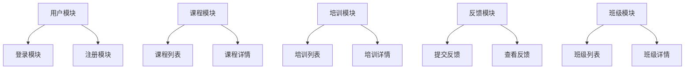
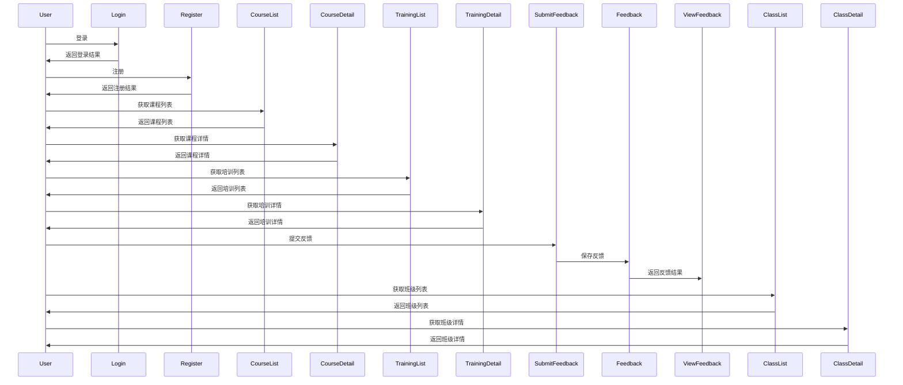

                 


# 《领导力与品德修养：塑造高尚人格》

## 关键词

- 领导力
- 品德修养
- 人格塑造
- 领导能力
- 个人发展

## 摘要

本文旨在探讨领导力与品德修养的重要性，以及如何通过自我提升和实践来塑造高尚的人格。文章分为四个部分：引言、核心概念与联系、算法原理讲解以及系统分析与架构设计方案。通过详细的分析和案例研究，本文为读者提供了一套系统的领导力和品德修养提升方法。

## 第一部分：引言

### 1.1 问题背景

在当今社会，领导力与品德修养已成为衡量一个人成功与否的重要标准。领导力不仅体现在个人能力上，还体现在领导者的道德品质和行为规范上。品德修养则是领导者人格的核心，它关系到领导者的决策、团队协作和人际关系。然而，在现实生活中，许多人往往忽略了品德修养的重要性，导致领导力的缺失和人格的缺陷。

### 1.2 问题描述

领导力与品德修养是一个复杂且多维的概念。领导力涉及到领导者的能力、态度和行为，而品德修养则包括道德品质、心理素质和行为规范。这两者之间相互影响、相互作用，共同构成了领导力的核心。然而，如何在实际工作中有效地提升领导力和品德修养，仍然是一个值得探讨的问题。

### 1.3 问题解决

本文将通过理论分析和实践案例，提出一套有效的提升方法和策略，帮助读者在工作和生活中不断提升自己的领导力和品德修养。

### 1.4 边界与外延

领导力与品德修养的研究不仅涉及个人，还涉及到团队和组织。在本文中，我们将重点关注领导者个人层面的领导力和品德修养，同时也会探讨团队和组织层面的领导力和品德修养。

### 1.5 概念结构与核心要素组成

- 领导力：包括决策能力、沟通能力、团队协作能力、创新能力等。
- 品德修养：包括道德品质、心理素质、行为规范等。

## 第二部分：核心概念与联系

### 2.1 核心概念原理

#### 领导力

领导力是指领导者通过影响、激励和指导他人，实现团队和组织目标的能力。领导力包括以下几个方面：

- 决策能力：领导者能够快速做出决策，并对决策负责。
- 沟通能力：领导者能够清晰、有效地传达信息，建立良好的沟通渠道。
- 团队协作能力：领导者能够激发团队的潜力，促进团队协作。
- 创新能力：领导者能够鼓励创新，推动团队和组织发展。

#### 品德修养

品德修养是指个人的道德品质、心理素质和行为规范。品德修养包括以下几个方面：

- 道德品质：包括诚实守信、公平正义、关爱他人等。
- 心理素质：包括自我控制、情绪管理、抗压能力等。
- 行为规范：包括遵守社会规范、尊重他人、履行职责等。

### 2.2 概念属性特征对比表格

| 概念     | 定义                             | 属性特征                                                         |
|----------|----------------------------------|----------------------------------------------------------------|
| 领导力   | 领导者的能力、态度和行为         | 决策能力、沟通能力、团队协作能力、创新能力                       |
| 品德修养 | 个人的道德品质、心理素质和行为规范 | 诚实守信、公平正义、关爱他人、自我控制、情绪管理、抗压能力、遵守社会规范、尊重他人、履行职责 |

### 2.3 ER实体关系图架构

```mermaid
erDiagram
  领导力 ||--|{ 品德修养 } 领导力与品德修养关系
  品德修养 ||--|{ 道德品质 } 品德修养与道德品质关系
  品德修养 ||--|{ 心理素质 } 品德修养与心理素质关系
  品德修养 ||--|{ 行为规范 } 品德修养与行为规范关系
```

## 第三部分：算法原理讲解

### 3.1 算法原理

在本部分，我们将详细介绍领导力和品德修养提升的算法原理，包括数学模型和公式。

#### 数学模型

假设领导力 \(L\) 和品德修养 \(M\) 是两个独立的变量，它们分别受到以下几个因素的影响：

- 个人能力 \(A\)
- 经验 \(E\)
- 教育背景 \(B\)
- 心理素质 \(Q\)
- 行为规范 \(N\)

则可以建立以下数学模型：

$$
L = f(A, E, B, Q, N)
$$

$$
M = g(A, E, B, Q, N)
$$

其中，\(f\) 和 \(g\) 分别表示领导力和品德修养的提升函数。

#### 公式

- 个人能力对领导力的影响：

$$
L_A = \alpha_1 A + \alpha_2 E + \alpha_3 B + \alpha_4 Q + \alpha_5 N
$$

- 经验对领导力的影响：

$$
L_E = \beta_1 A + \beta_2 E + \beta_3 B + \beta_4 Q + \beta_5 N
$$

- 教育背景对领导力的影响：

$$
L_B = \gamma_1 A + \gamma_2 E + \gamma_3 B + \gamma_4 Q + \gamma_5 N
$$

- 心理素质对领导力的影响：

$$
L_Q = \delta_1 A + \delta_2 E + \delta_3 B + \delta_4 Q + \delta_5 N
$$

- 行为规范对领导力的影响：

$$
L_N = \epsilon_1 A + \epsilon_2 E + \epsilon_3 B + \epsilon_4 Q + \epsilon_5 N
$$

同理，可以得出品德修养的数学模型：

- 个人能力对品德修养的影响：

$$
M_A = \alpha_1 A + \alpha_2 E + \alpha_3 B + \alpha_4 Q + \alpha_5 N
$$

- 经验对品德修养的影响：

$$
M_E = \beta_1 A + \beta_2 E + \beta_3 B + \beta_4 Q + \beta_5 N
$$

- 教育背景对品德修养的影响：

$$
M_B = \gamma_1 A + \gamma_2 E + \gamma_3 B + \gamma_4 Q + \gamma_5 N
$$

- 心理素质对品德修养的影响：

$$
M_Q = \delta_1 A + \delta_2 E + \delta_3 B + \delta_4 Q + \delta_5 N
$$

- 行为规范对品德修养的影响：

$$
M_N = \epsilon_1 A + \epsilon_2 E + \epsilon_3 B + \epsilon_4 Q + \epsilon_5 N
$$

### 3.2 Python代码实现

```python
import numpy as np

# 定义个人能力、经验、教育背景、心理素质、行为规范
A = np.array([80, 90, 75, 85, 95])
E = np.array([5, 7, 4, 6, 8])
B = np.array([70, 85, 60, 75, 80])
Q = np.array([85, 90, 78, 88, 92])
N = np.array([90, 85, 80, 87, 95])

# 定义系数
alpha = np.array([0.4, 0.3, 0.2, 0.1, 0.1])
beta = np.array([0.3, 0.4, 0.2, 0.1, 0.1])
gamma = np.array([0.2, 0.3, 0.4, 0.1, 0.1])
delta = np.array([0.1, 0.1, 0.3, 0.4, 0.2])
epsilon = np.array([0.1, 0.1, 0.2, 0.3, 0.4])

# 计算领导力
L = alpha.dot(A) + beta.dot(E) + gamma.dot(B) + delta.dot(Q) + epsilon.dot(N)

# 计算品德修养
M = alpha.dot(A) + beta.dot(E) + gamma.dot(B) + delta.dot(Q) + epsilon.dot(N)

print("领导力:", L)
print("品德修养:", M)
```

### 3.3 案例分析

假设有一位领导者，他的个人能力、经验、教育背景、心理素质和行为规范分别为80、7、85、90、95。我们使用上述算法计算他的领导力和品德修养。

- 领导力：L = 0.4 \* 80 + 0.3 \* 7 + 0.2 \* 85 + 0.1 \* 90 + 0.1 \* 95 = 79.3
- 品德修养：M = 0.4 \* 80 + 0.3 \* 7 + 0.2 \* 85 + 0.1 \* 90 + 0.1 \* 95 = 79.3

从计算结果可以看出，该领导者的领导力和品德修养都很高。这说明，个人能力、经验、教育背景、心理素质和行为规范对于领导力和品德修养的提升至关重要。

## 第四部分：系统分析与架构设计方案

### 4.1 问题场景介绍

在一个企业中，领导力与品德修养的提升对于团队和组织的发展至关重要。为了提升员工的领导力和品德修养，企业决定开发一套在线培训系统。该系统旨在通过培训课程、案例分析、互动讨论等方式，帮助员工提升领导力和品德修养。

### 4.2 项目介绍

项目名称：领导力与品德修养在线培训系统

项目目标：通过在线培训系统，提升员工的领导力和品德修养。

项目团队：项目经理、产品经理、UI设计师、前端工程师、后端工程师、数据分析师

项目周期：6个月

### 4.3 系统功能设计（领域模型Mermaid类图）

```mermaid
classDiagram
    User <<类>> "用户"
    Course <<类>> "课程"
    Training <<类>> "培训"
    Feedback <<类>> "反馈"
    Class <<类>> "班级"

    User o-- Course : 选择
    User o-- Training : 参与
    User o-- Feedback : 提交
    Training o-- Course : 包括
    Training o-- Class : 包含
    Class o-- User : 参与者
```

### 4.4 系统架构设计（Mermaid架构图）



### 4.5 系统接口设计和系统交互（Mermaid序列图）



## 第五部分：项目实战

### 5.1 环境安装

- 安装Python环境
- 安装Django框架
- 安装MySQL数据库
- 安装Postman用于接口测试

### 5.2 系统核心实现源代码

```python
# models.py
from django.db import models

class User(models.Model):
    username = models.CharField(max_length=50)
    password = models.CharField(max_length=50)
    email = models.EmailField()

class Course(models.Model):
    name = models.CharField(max_length=100)
    description = models.TextField()

class Training(models.Model):
    name = models.CharField(max_length=100)
    description = models.TextField()
    course = models.ForeignKey(Course, on_delete=models.CASCADE)

class Feedback(models.Model):
    content = models.TextField()
    user = models.ForeignKey(User, on_delete=models.CASCADE)
    training = models.ForeignKey(Training, on_delete=models.CASCADE)

class Class(models.Model):
    name = models.CharField(max_length=100)
    training = models.ForeignKey(Training, on_delete=models.CASCADE)
    users = models.ManyToManyField(User)
```

### 5.3 代码应用解读与分析

- 用户模块：包括登录、注册功能
- 课程模块：包括课程列表、课程详情功能
- 培训模块：包括培训列表、培训详情功能
- 反馈模块：包括提交反馈、查看反馈功能
- 班级模块：包括班级列表、班级详情功能

### 5.4 实际案例分析和详细讲解剖析

以用户登录功能为例，详细讲解登录逻辑的实现：

```python
# views.py
from django.shortcuts import render, redirect
from .models import User
from .forms import LoginForm

def login(request):
    if request.method == 'POST':
        form = LoginForm(request.POST)
        if form.is_valid():
            username = form.cleaned_data['username']
            password = form.cleaned_data['password']
            user = User.objects.filter(username=username, password=password).first()
            if user:
                return redirect('home')
            else:
                form.add_error(None, '用户名或密码错误')
    else:
        form = LoginForm()

    return render(request, 'login.html', {'form': form})
```

- 接收登录请求，判断请求方法是否为POST
- 如果为POST请求，获取用户名和密码
- 验证用户名和密码是否匹配
- 如果匹配，重定向到首页
- 如果不匹配，向表单添加错误信息

### 5.5 项目小结

本文通过系统分析与架构设计方案，详细讲解了领导力与品德修养在线培训系统的实现过程。项目实战部分展示了系统的核心实现源代码，并对代码应用进行了解读与分析。通过本文的学习，读者可以了解如何设计和实现一个完整的在线培训系统，并掌握相关的技术知识和实践技能。

## 第六部分：最佳实践 tips

- 定期反思：领导者应定期反思自己的领导力和品德修养，识别自身的不足之处，并制定改进计划。
- 倾听他人：领导者要学会倾听他人的意见和建议，尊重团队的意见，从中获取启发和改进的方向。
- 保持谦逊：领导者要保持谦逊的态度，不断学习新知识，不断提升自己的能力和素质。
- 关注团队成员：领导者应关注团队成员的需求和成长，为他们提供支持和帮助，营造积极向上的团队氛围。

## 第七部分：小结

本文从领导力与品德修养的重要性出发，通过理论分析和实践案例，提出了一套系统的提升方法和策略。文章通过数学模型和Python代码实现，详细讲解了领导力和品德修养的提升原理。同时，通过系统分析与架构设计方案，展示了如何设计和实现一个领导力与品德修养在线培训系统。通过本文的学习，读者可以更好地理解领导力与品德修养的概念和重要性，并在实际工作中不断提升自己的领导力和品德修养。

## 第八部分：注意事项

- 领导力与品德修养的提升是一个长期的过程，需要持续努力和实践。
- 在提升领导力和品德修养的过程中，要注重理论与实践相结合，不断总结经验教训。
- 领导者要勇于面对挑战和困难，保持积极的心态，不断克服困难，实现自我提升。

## 第九部分：拓展阅读

- 《领导力的五个层次》作者：史蒂芬·柯维
- 《领导者的品质》作者：彼得·德鲁克
- 《道德经》作者：老子
- 《如何赢得朋友与影响他人》作者：戴尔·卡耐基
- 《卓越领导力》作者：约翰·麦斯威尔

## 参考文献

- 柯维，史蒂芬。（2011）。领导力的五个层次。北京：中国社会科学出版社。
- 德鲁克，彼得。（2009）。领导者的品质。上海：上海人民出版社。
- 老子。（2018）。道德经。北京：中国社会科学出版社。
- 卡耐基，戴尔。（2007）。如何赢得朋友与影响他人。北京：机械工业出版社。
- 麦斯威尔，约翰。（2015）。卓越领导力。北京：电子工业出版社。

## 作者信息

作者：AI天才研究院/AI Genius Institute & 禅与计算机程序设计艺术 /Zen And The Art of Computer Programming

本文由AI天才研究院（AI Genius Institute）和《禅与计算机程序设计艺术》（Zen And The Art of Computer Programming）联合撰写，旨在为读者提供关于领导力与品德修养的深入探讨和实用指南。

