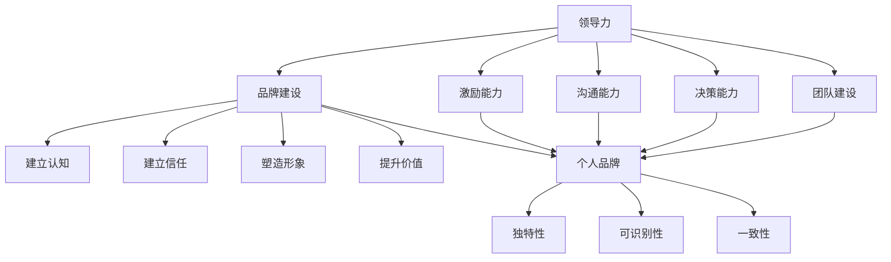
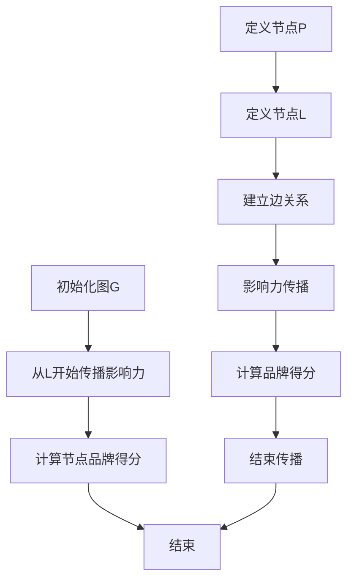
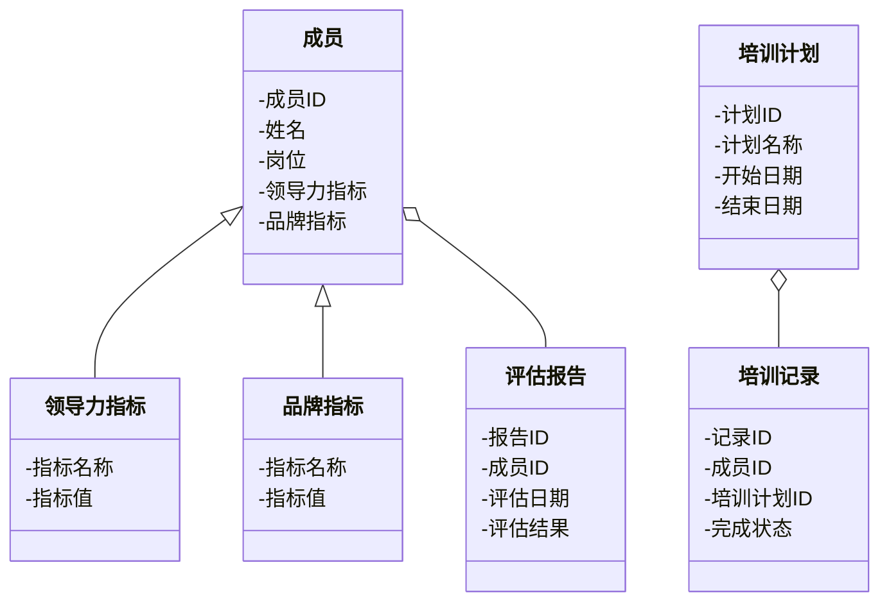
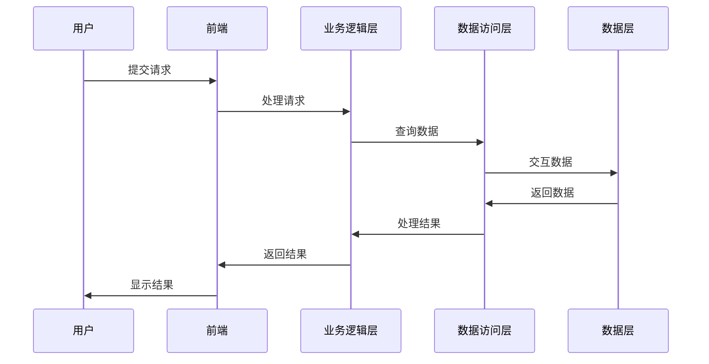
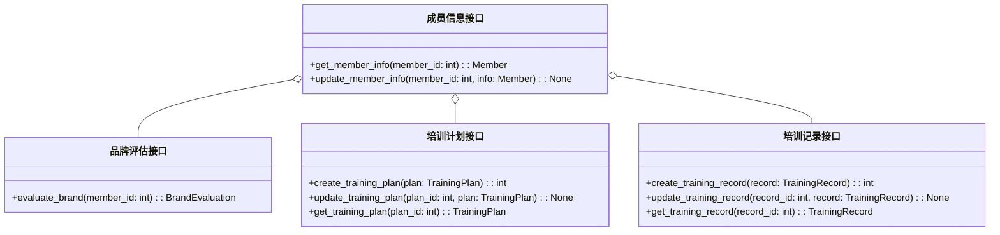

                 

### 第一部分：领导力的核心要素

#### 第1章：领导力概述

### 1.1 领导力的定义与重要性

领导力是一种影响他人共同达成目标的能力和特质。它不仅仅是管理团队的技能，更是一种激发和引领他人的艺术。领导力在个人和组织中扮演着至关重要的角色，它不仅能够推动团队取得卓越的成果，还能够塑造和提升个人的影响力。

**领导力的定义**：

领导力是一种激励他人、共同达成目标的能力。它不仅仅是权力的体现，更是一种影响力的体现。领导力涉及多个方面，包括激励能力、沟通能力、决策能力、团队建设等。

**领导力的重要性**：

1. **推动组织发展**：领导力能够推动组织的发展，激发团队成员的潜力，实现组织的目标。

2. **提升个人影响力**：优秀的领导力能够提升个人的影响力，使个人在组织内外获得更高的认可和尊重。

3. **促进团队协作**：领导力能够促进团队成员之间的协作，建立和谐的团队氛围。

4. **提高决策效率**：领导力能够提高决策效率，使团队在面对挑战时能够迅速做出明智的决策。

### 1.2 领导力的发展历史

领导力作为一种概念，其发展可以追溯到古代。早在古希腊时期，亚里士多德等人就开始探讨领导力的问题。随着时间的推移，领导力理论不断演变，出现了多种领导力模型。

- **古典领导理论**：早期领导理论主要关注领导者的特质和品质，如特质理论、行为理论等。

- **情境领导理论**：随着心理学和行为科学的发展，情境领导理论提出领导力应根据不同情境进行灵活调整。

- **变革型领导理论**：变革型领导理论强调领导者通过激励和启发，推动团队实现变革。

- **服务型领导理论**：服务型领导理论强调领导者应为团队成员提供服务，促进团队的发展。

### 1.3 领导力在组织中的作用

领导力在组织中的作用是多方面的，它不仅能够推动组织的发展，还能够塑造组织的文化。

- **推动组织变革**：领导力能够推动组织变革，使组织能够适应外部环境的变化。

- **塑造组织文化**：领导力能够塑造组织文化，建立共同的价值观念和行为准则。

- **提高组织效率**：领导力能够提高组织的运作效率，使组织能够更高效地实现目标。

- **培养人才**：领导力能够培养和激励人才，使组织能够持续发展。

### 小结

领导力是一种至关重要的能力，它不仅能够推动个人和组织的发展，还能够提升个人在组织中的影响力。通过深入了解领导力的发展历史和其在组织中的作用，我们可以更好地理解和运用领导力，实现个人和组织的共同发展。

### 第2章：领导者的个人特质

#### 第2章：领导者的个人特质

一个成功的领导者不仅需要具备卓越的领导能力，还需要具备一系列个人特质。这些特质不仅能够帮助领导者更好地管理团队，还能够提升他们的个人影响力。在本章节中，我们将探讨几个关键的个人特质，包括自我认知、情绪管理、沟通技巧等。

### 2.1 自我认知与自我提升

**自我认知**是指领导者对自己性格、能力、价值观等的深刻理解和认识。自我认知是领导者自我提升的基础，它可以帮助领导者更好地了解自己的优势和不足，从而制定合适的提升计划。

**自我提升**是一个持续的过程，它包括以下几个方面：

- **学习与成长**：领导者应该不断学习新知识、新技能，以适应不断变化的环境。

- **反思与总结**：领导者应该定期反思自己的行为和决策，从中吸取经验教训。

- **设定目标**：领导者应该设定清晰的个人目标，并制定实现这些目标的计划。

- **寻求反馈**：领导者应该主动寻求他人的反馈，了解自己的不足之处，并加以改进。

### 2.2 情绪管理

情绪管理是领导者必备的一项技能，它涉及到如何控制和管理自己的情绪，以及如何理解和应对团队成员的情绪。

- **自我情绪控制**：领导者应该学会控制自己的情绪，避免因为个人情绪波动而影响决策和团队氛围。

- **理解情绪**：领导者应该学会理解团队成员的情绪，并给予适当的关怀和支持。

- **应对冲突**：领导者应该学会有效应对冲突，通过沟通和协调，解决问题，维护团队的和谐。

### 2.3 沟通技巧

沟通技巧是领导者成功的关键因素之一。有效的沟通可以帮助领导者更好地传达信息、激励团队、建立信任。

- **倾听**：倾听是有效沟通的基础，领导者应该学会倾听团队成员的意见和需求，了解他们的真实想法。

- **表达**：领导者应该学会清晰、准确地表达自己的观点和意图，避免误解和冲突。

- **反馈**：领导者应该学会给予团队成员及时的反馈，鼓励他们的优点，指出他们的不足，帮助他们成长。

- **非语言沟通**：领导者应该注意非语言沟通，如肢体语言、面部表情等，这些因素在沟通中同样重要。

### 2.4 诚信与责任感

诚信和责任感是领导者的基石。一个成功的领导者必须具备高度的诚信，坚守承诺，赢得团队成员的信任。同时，领导者应该具备强烈的责任感，对团队、组织和自己的行为负责。

- **诚信**：领导者应该诚实守信，言行一致，树立良好的榜样。

- **责任感**：领导者应该对自己的决策和行为负责，勇于承担责任，面对困难和挑战时不逃避。

### 小结

领导者的个人特质是他们成功的关键因素。自我认知、情绪管理、沟通技巧、诚信与责任感等特质不仅能够帮助领导者更好地管理团队，还能够提升他们的个人影响力。通过不断培养和完善这些特质，领导者可以更好地实现个人和团队的目标。

### 第3章：团队领导与团队建设

#### 第3章：团队领导与团队建设

团队领导是领导者的一项重要职责，它涉及到如何激发团队潜能、协调团队成员之间的关系，以及如何解决团队中的冲突。有效的团队领导不仅能够提高团队的工作效率，还能够促进团队成员的个人成长。在本章节中，我们将探讨团队领导与团队建设的关键要素。

### 3.1 团队类型与团队动态

团队可以分为不同类型，每种类型的团队都有其独特的动态和特点。

- **功能型团队**：功能型团队是基于组织结构设立的，成员来自不同部门，负责特定的职能。这种团队的优点是能够充分利用不同部门的专业知识和资源，但成员之间可能存在沟通障碍。

- **项目型团队**：项目型团队是为了完成特定项目而组建的，成员来自不同部门，共同为实现项目目标而努力。这种团队的优点是能够快速响应项目需求，提高项目效率，但成员之间可能存在竞争和利益冲突。

- **自我管理团队**：自我管理团队是成员自主管理、自我协调的团队，成员拥有较大的决策权和责任感。这种团队的优点是能够提高成员的参与度和责任感，增强团队凝聚力，但成员可能需要更高的自我管理和协调能力。

### 3.2 团队成员的角色与职责

团队成员的角色和职责明确是团队高效运作的基础。每个团队成员都应该明确自己的角色和职责，以确保团队目标的实现。

- **领导者**：领导者负责团队的规划、决策和执行，确保团队目标的实现。领导者还需要激励团队成员、解决团队中的问题。

- **执行者**：执行者是团队中的主力，负责具体任务的执行和完成。他们需要具备专业技能和高效的工作能力。

- **协调者**：协调者负责协调团队成员之间的沟通和合作，确保团队目标的顺利实现。协调者还需要处理团队中的冲突和矛盾。

- **支持者**：支持者负责为团队提供必要的资源和支持，如技术支持、资金支持等。支持者还需要关注团队成员的个人需求和成长。

### 3.3 团队冲突管理

团队冲突是团队运作过程中不可避免的现象，有效的团队冲突管理是团队成功的关键。

- **识别冲突**：领导者应该及时发现和识别团队中的冲突，了解冲突的根源。

- **沟通解决**：领导者应该鼓励团队成员进行开放、坦诚的沟通，共同寻找解决问题的方法。

- **制定规则**：领导者应该制定明确的团队规则，规范团队成员的行为，减少冲突的发生。

- **调解争议**：当冲突无法通过沟通解决时，领导者应该介入调解，公正、公平地处理争议。

- **持续关注**：领导者应该持续关注团队冲突的解决情况，确保问题得到彻底解决。

### 小结

团队领导与团队建设是领导者的一项重要职责，它涉及到如何激发团队潜能、协调团队成员之间的关系，以及如何解决团队中的冲突。有效的团队领导与团队建设不仅能够提高团队的工作效率，还能够促进团队成员的个人成长。通过了解团队类型与团队动态、明确团队成员的角色与职责，以及掌握团队冲突管理的方法，领导者可以更好地实现团队的目标。

### 第4章：战略规划与执行

#### 第4章：战略规划与执行

战略规划是企业成功的关键环节，它涉及到如何设定目标、分析市场、制定计划，以及如何确保计划的执行。战略规划不仅需要科学的分析方法，还需要灵活的执行策略。在本章节中，我们将探讨战略规划的重要性、战略规划的过程与方法，以及战略执行的策略与工具。

### 4.1 战略规划的重要性

战略规划是企业发展的指南针，它能够帮助企业在复杂多变的市场环境中找到方向，实现长远发展。战略规划的重要性主要体现在以下几个方面：

- **明确目标**：战略规划能够明确企业的长期目标和短期目标，使企业的发展方向更加清晰。

- **优化资源配置**：战略规划能够帮助企业合理配置资源，提高资源利用效率，降低运营成本。

- **提升竞争力**：战略规划能够帮助企业分析市场趋势，制定差异化战略，提升市场竞争力。

- **应对风险**：战略规划能够帮助企

### 4.2 战略规划的过程与方法

战略规划是一个系统的过程，它通常包括以下几个阶段：

- **需求分析**：需求分析是战略规划的第一步，它涉及对市场、客户、竞争对手等方面的分析，了解企业的需求和市场机会。

- **目标设定**：在需求分析的基础上，企业需要设定明确的目标，这些目标应该具有可衡量性和可实现性。

- **方案设计**：方案设计是战略规划的核心，企业需要制定多个备选方案，并分析每种方案的优缺点。

- **决策制定**：在方案设计完成后，企业需要根据实际情况和优先级，选择最优方案。

- **执行计划**：执行计划是战略规划的具体实施步骤，它包括任务分解、时间安排、资源分配等。

- **监控与调整**：在战略规划执行过程中，企业需要不断监控执行情况，根据实际情况进行调整。

在战略规划的过程中，常用的方法包括SWOT分析、PEST分析、波特五力分析等。这些方法可以帮助企业全面分析内外部环境，制定科学的战略规划。

### 4.3 战略执行的策略与工具

战略执行是将战略规划转化为实际成果的关键环节，它需要科学的策略和有效的工具。以下是一些常见的战略执行策略与工具：

- **目标分解**：将战略目标分解为具体的、可衡量的指标，使每个团队成员都明确自己的责任和任务。

- **关键绩效指标（KPI）**：制定关键绩效指标，对战略执行情况进行监控和评估。

- **项目管理**：运用项目管理工具和方法，确保项目按计划顺利进行。

- **沟通与协作**：建立有效的沟通机制，确保团队成员之间的信息畅通和协作。

- **激励机制**：制定激励机制，鼓励团队成员为实现战略目标而努力。

- **风险管理**：识别潜在风险，制定风险应对策略，降低风险对战略执行的影响。

### 小结

战略规划与执行是企业发展的关键环节，它涉及到如何设定目标、分析市场、制定计划，以及如何确保计划的执行。有效的战略规划能够帮助企业明确发展方向，优化资源配置，提升竞争力。通过了解战略规划的过程与方法，以及掌握战略执行的策略与工具，企业可以更好地实现战略目标，实现长远发展。

### 第5章：品牌建设基础

#### 第5章：品牌建设基础

品牌建设是现代市场营销中不可或缺的一部分，它不仅关系到企业的形象和声誉，还直接影响到企业的市场地位和竞争力。一个强大的品牌能够为企业带来长期的利益，增强客户的忠诚度，提高市场份额。在本章节中，我们将探讨品牌建设的基础，包括品牌定义、品牌价值、品牌定位和品牌传播等方面。

### 5.1 品牌的定义与价值

**品牌**是一个集合概念，它包括品牌名称、标志、设计、口号、文化等元素。品牌不仅是一个标识，更是一种情感和认知的象征。一个成功的品牌能够传递出企业的价值观、使命和愿景，使消费者对其产生信任和认同。

**品牌价值**是品牌在市场上所体现的经济效益，它包括以下几个方面：

- **客户忠诚度**：强大的品牌能够吸引和保留客户，提高客户忠诚度，从而增加重复购买率。

- **溢价能力**：品牌能够为产品或服务带来额外的价值，使企业在定价方面具有优势。

- **市场份额**：品牌建设有助于企业提高市场份额，增强市场竞争力。

- **品牌资产**：品牌价值是企业的无形资产，能够为企业带来长期的经济利益。

### 5.2 品牌定位与品牌形象

**品牌定位**是指企业在市场中找到自己的独特位置，使消费者能够快速识别和记住品牌。品牌定位需要考虑以下几个方面：

- **目标市场**：明确品牌的目标市场，了解消费者的需求和偏好。

- **竞争优势**：分析竞争对手的优势和劣势，找到自己的独特卖点。

- **品牌个性**：塑造品牌个性，使品牌在消费者心中形成鲜明的印象。

- **传播策略**：制定合适的传播策略，将品牌定位传达给消费者。

**品牌形象**是消费者对品牌整体印象的综合反映，它包括以下几个方面：

- **品牌视觉**：包括品牌标志、色彩、字体等视觉元素。

- **品牌声音**：包括品牌口号、广告语等听觉元素。

- **品牌体验**：包括产品或服务的质量、服务态度等实际体验。

- **品牌故事**：讲述品牌的历史、文化、愿景等故事，增强品牌的文化内涵。

### 5.3 品牌传播与品牌维护

**品牌传播**是指通过多种渠道和手段，将品牌信息传递给消费者，提高品牌知名度和美誉度。品牌传播的方法包括：

- **广告**：通过电视、报纸、杂志、互联网等渠道进行广告宣传，提高品牌知名度。

- **公关**：通过媒体发布新闻、举办活动等方式，提升品牌形象。

- **社交媒体**：利用社交媒体平台，与消费者进行互动，增强品牌影响力。

- **内容营销**：通过撰写高质量的文章、视频等，传递品牌价值，吸引消费者的关注。

**品牌维护**是指持续地维护和提升品牌价值，确保品牌在消费者心中的良好形象。品牌维护的方法包括：

- **质量管理**：确保产品或服务的质量，满足消费者的期望。

- **客户服务**：提供优质的客户服务，解决消费者的问题和需求。

- **品牌监测**：定期监测品牌在市场和消费者中的表现，及时调整品牌策略。

- **品牌更新**：随着市场和消费者需求的变化，适时更新品牌形象和品牌策略。

### 小结

品牌建设是企业长期发展的关键，它关系到企业的形象、声誉和市场竞争力。通过明确品牌定义和价值，找到合适的品牌定位，以及进行有效的品牌传播和维护，企业可以建立起强大的品牌，提高市场地位和竞争力。品牌建设是一个持续的过程，需要企业不断投入和努力，以保持品牌的活力和影响力。

### 第6章：个人品牌建设

#### 第6章：个人品牌建设

在当今快速变化的社会中，个人品牌的重要性日益凸显。一个强大的个人品牌不仅能够提升个人的社会地位和影响力，还能够为职业发展提供有力支持。在本章节中，我们将探讨个人品牌的概念、塑造与传播，以及个人品牌的价值和影响。

### 6.1 个人品牌的概念与特征

**个人品牌**是指个人在公众心中的形象和认知，它不仅仅包括个人的专业技能和知识，还包括个人的价值观、行为和社交网络。一个成功的个人品牌能够传达出个人的独特魅力和优势，使个人在职业和社会领域中脱颖而出。

**个人品牌的特点**包括：

- **独特性**：个人品牌应具备独特的个性和特点，与他人的品牌区分开来。

- **可识别性**：个人品牌应具有清晰的标志和象征，使人们能够快速识别。

- **一致性**：个人品牌应保持一致，确保公众对个人的认知是一致的。

- **专业性**：个人品牌应体现个人的专业能力和知识，使个人在特定领域中获得认可。

- **信任度**：个人品牌应建立在信任的基础上，使公众对个人产生信任和依赖。

### 6.2 个人品牌的塑造与传播

**个人品牌的塑造**是一个长期且持续的过程，它涉及到以下几个方面：

- **明确目标**：个人应明确自己的职业目标和价值观，以此为基础塑造个人品牌。

- **专业技能提升**：个人应不断提升自己的专业技能和知识，使个人品牌具有核心竞争力。

- **塑造形象**：个人应通过言行一致、保持专业态度、树立良好的形象，增强个人品牌的可信度。

- **建立网络**：个人应积极建立和维护社交网络，扩大个人影响力。

**个人品牌的传播**是使个人品牌被公众认识和认可的过程，它包括以下几个方面：

- **社交媒体**：利用社交媒体平台，发布专业内容、互动交流，提高个人品牌的曝光度。

- **内容营销**：通过撰写专业文章、发布视频、制作PPT等，展示个人的专业知识和见解。

- **公共演讲**：参加行业会议、研讨会等，通过演讲和分享，提升个人品牌的知名度。

- **合作与赞助**：与行业内的知名企业和个人进行合作，参与赞助活动，扩大个人品牌的影响力。

### 6.3 个人品牌的价值与影响

**个人品牌的价值**主要体现在以下几个方面：

- **职业发展**：强大的个人品牌能够为个人的职业发展提供有力支持，使个人在求职和晋升过程中具有优势。

- **薪资待遇**：个人品牌能够提高个人的薪资待遇，使个人在薪资谈判中具有优势。

- **社会认可**：强大的个人品牌能够提升个人的社会地位，获得更多的认可和尊重。

- **商业机会**：个人品牌能够为个人带来更多的商业机会，如咨询、演讲、培训等。

**个人品牌的影响**主要表现在以下几个方面：

- **公众认知**：个人品牌能够改变公众对个人的认知，使个人在公众中的形象更加鲜明。

- **行业影响力**：个人品牌能够在特定行业内产生影响力，使个人成为该领域的权威和意见领袖。

- **协作机会**：个人品牌能够为个人带来更多的协作机会，如与其他专家合作、参与行业项目等。

- **社会效应**：个人品牌能够产生社会效应，如激发公众对某个领域的关注和兴趣，推动行业的发展。

### 小结

个人品牌建设是现代社会中不可或缺的一环，它能够为个人的职业发展和社会地位提供有力支持。通过明确个人品牌的概念、塑造个人品牌，以及传播个人品牌，个人可以建立起强大的个人品牌，提高自己的社会影响力。一个成功的个人品牌不仅能够提升个人的职业发展，还能够为个人带来更多的商业机会和社会认可。

### 第7章：领导力与品牌建设的整合应用

#### 第7章：领导力与品牌建设的整合应用

领导力与品牌建设在个人和组织的发展中扮演着重要角色，它们相辅相成，共同推动个人和组织迈向成功。在本章节中，我们将探讨领导力在品牌建设中的应用，品牌建设对领导力的影响，以及领导力与品牌建设的协同发展。

### 7.1 领导力在品牌建设中的应用

领导力在品牌建设中具有重要作用，它可以帮助领导者更好地塑造和维护个人品牌，提升品牌影响力。以下是一些领导力在品牌建设中的应用：

- **愿景塑造**：领导力能够帮助领导者明确品牌愿景，将品牌理念传递给团队成员和公众，增强品牌认同感。

- **激励团队**：领导力可以激发团队成员的潜能，推动团队成员为品牌建设贡献力量，提升品牌价值。

- **品牌传播**：领导力有助于领导者利用自身的影响力，通过演讲、培训、社交媒体等方式，扩大品牌传播范围。

- **危机管理**：领导力在品牌危机管理中起到关键作用，领导者能够迅速应对危机，维护品牌形象。

- **持续创新**：领导力可以推动组织不断创新，为品牌带来新的活力和竞争优势。

### 7.2 品牌建设对领导力的影响

品牌建设对领导力也有重要影响，一个成功的品牌建设能够提升领导者的个人形象和影响力。以下是一些品牌建设对领导力的影响：

- **增强公信力**：成功的品牌建设能够提升领导者的公信力，使领导者更加受到团队成员和公众的信任。

- **提高影响力**：品牌建设能够扩大领导者的社会影响力，使领导者成为行业内的权威和意见领袖。

- **促进职业发展**：强大的个人品牌能够为领导者的职业发展提供有力支持，使领导者获得更多的晋升机会。

- **增强团队凝聚力**：成功的品牌建设能够增强团队凝聚力，使团队成员更加认同领导者的价值观和愿景。

- **提升领导力**：品牌建设过程中，领导者需要不断提升自己的领导力，如沟通能力、创新能力、决策能力等，从而提升整体领导力水平。

### 7.3 领导力与品牌建设的协同发展

领导力与品牌建设之间存在密切的协同关系，它们相互促进，共同推动个人和组织的发展。以下是一些领导力与品牌建设的协同发展策略：

- **明确品牌愿景**：领导者应明确品牌愿景，并将其融入组织的战略规划，确保领导力和品牌建设的方向一致。

- **建立信任关系**：领导者应通过诚实、透明和负责任的行为，建立与团队成员和公众的信任关系，提升品牌形象。

- **提升个人品牌**：领导者应注重个人品牌建设，通过提升自己的专业能力和影响力，为组织品牌的发展贡献力量。

- **培养团队成员**：领导者应关注团队成员的个人成长，培养他们的专业技能和领导力，为组织品牌的可持续发展提供人才支持。

- **持续创新**：领导者应鼓励组织不断创新，为品牌带来新的价值和竞争优势，推动领导力和品牌建设的共同发展。

### 小结

领导力与品牌建设在个人和组织的发展中具有重要作用，它们相辅相成，共同推动个人和组织迈向成功。通过领导力在品牌建设中的应用，品牌建设对领导力的影响，以及领导力与品牌建设的协同发展策略，个人和组织可以更好地实现共同目标，提升竞争力和影响力。

### 第8章：案例分析

#### 第8章：案例分析

在本章节中，我们将通过两个实际案例，深入分析领导力与品牌建设在实际应用中的成功实践。这些案例不仅展示了优秀领导力和强大品牌建设的具体操作，还为读者提供了宝贵的经验和启示。

### 8.1 案例分析概述

**案例一：马云与阿里巴巴**

**案例背景**：马云是中国著名的企业家，阿里巴巴集团的创始人。在他的领导下，阿里巴巴从一家小型电子商务公司发展成为全球最大的电子商务平台之一。

**案例描述**：马云凭借其卓越的领导力，不仅成功地带领阿里巴巴在竞争激烈的市场中脱颖而出，还成功地塑造了阿里巴巴的品牌形象。他通过持续创新、培养人才、建立信任等方式，推动了阿里巴巴的快速发展。

**案例启示**：

1. **领导力的关键作用**：马云通过激发团队潜能、建立企业文化、塑造品牌形象，展示了领导力在企业发展中的关键作用。

2. **品牌建设的重要性**：阿里巴巴的品牌建设为企业在全球市场中赢得了广泛认可，提升了企业的竞争力。

**案例二：乔布斯与苹果公司**

**案例背景**：乔布斯是苹果公司的共同创始人，他在离开苹果公司多年后，于1997年重返公司，并重新塑造了苹果公司的品牌形象。

**案例描述**：乔布斯通过卓越的领导力和创新思维，带领苹果公司推出了一系列革命性的产品，如iPod、iPhone、iPad等，重塑了苹果的品牌形象，使其成为全球最具价值的品牌之一。

**案例启示**：

1. **领导力的核心价值**：乔布斯通过愿景塑造、团队管理、产品创新，展示了领导力在品牌建设中的核心价值。

2. **品牌建设的持续性**：苹果公司的品牌建设是一个持续的过程，通过不断创新和优化，苹果公司始终保持其市场领导地位。

### 8.2 成功领导力与品牌建设的案例分析

**案例一：马云与阿里巴巴**

**领导力分析**：

1. **愿景塑造**：马云具有强烈的愿景，他希望通过互联网技术改变人们的生活方式，使电子商务成为主流。

2. **团队管理**：马云重视人才培养和团队建设，通过股权激励、职业发展通道等手段，激发团队成员的积极性。

3. **创新驱动**：马云鼓励团队不断创新，推动公司技术和服务不断升级。

**品牌建设分析**：

1. **品牌定位**：阿里巴巴品牌定位清晰，专注于电子商务和互联网服务领域，成为行业领导者。

2. **品牌传播**：阿里巴巴通过线上和线下活动、社交媒体等渠道，有效传播品牌形象，提升品牌知名度。

3. **品牌维护**：阿里巴巴注重客户服务，通过高效、专业的服务，维护品牌信誉。

**案例二：乔布斯与苹果公司**

**领导力分析**：

1. **愿景塑造**：乔布斯具有前瞻性的愿景，他通过设计创新的产品，引领了全球科技潮流。

2. **产品创新**：乔布斯注重产品设计和用户体验，不断推出革命性的产品，满足消费者的需求。

3. **品牌传播**：苹果公司通过独特的品牌传播策略，如发布会、广告等，塑造了高端、创新的品牌形象。

**品牌建设分析**：

1. **品牌定位**：苹果品牌定位高端、创新，成为全球消费者追捧的对象。

2. **品牌差异化**：苹果通过独特的设计和用户体验，形成了与其他品牌明显的差异化，提升了品牌价值。

3. **品牌忠诚度**：苹果公司通过优质的产品和服务，建立了强大的品牌忠诚度，使消费者愿意为其品牌溢价。

### 8.3 案例启示与经验总结

**案例一：马云与阿里巴巴**

1. **领导力的关键作用**：优秀的领导力是推动企业发展的关键，通过激发团队潜能、塑造品牌形象，企业可以实现快速增长。

2. **品牌建设的重要性**：品牌建设是企业长期发展的基础，通过清晰的品牌定位、有效的品牌传播，企业可以提升市场竞争力。

**案例二：乔布斯与苹果公司**

1. **领导力的核心价值**：领导力在品牌建设中具有核心价值，通过愿景塑造、产品创新，领导者可以推动企业持续发展。

2. **品牌建设的持续性**：品牌建设是一个持续的过程，需要不断创新和优化，以适应市场变化和消费者需求。

### 小结

通过两个实际案例的分析，我们可以看到领导力与品牌建设在个人和组织发展中的重要作用。领导力可以激发团队潜能、推动企业创新，而品牌建设可以提升企业竞争力、塑造良好的企业形象。这两个方面的成功实践为我们提供了宝贵的经验和启示，值得我们在实际工作中借鉴和运用。

### 第9章：未来展望

#### 第9章：未来展望

随着社会的发展和信息技术的不断进步，领导力与品牌建设也在不断演变，迎接新的挑战和机遇。在本章节中，我们将探讨领导力与品牌建设的发展趋势，以及新时代下领导力与品牌建设的变革，同时讨论个人影响力与社会责任的重要性。

### 9.1 领导力与品牌建设的发展趋势

**1. 数字化领导力**

随着数字化技术的广泛应用，领导力也在向数字化方向发展。数字化领导力强调领导者如何利用数字化工具和平台，提升团队协作效率、优化决策过程。例如，通过人工智能、大数据分析等技术，领导者可以更准确地了解团队成员的需求和绩效，从而进行更科学的领导。

**2. 社交媒体品牌建设**

社交媒体已经成为品牌建设和传播的重要渠道。未来，品牌建设将更加依赖于社交媒体平台，如微信、微博、抖音等。通过这些平台，品牌可以与消费者进行实时互动，了解消费者的需求，传递品牌价值观，提升品牌影响力。

**3. 可持续品牌建设**

随着全球环境问题日益严重，可持续品牌建设将成为企业发展的关键。企业需要通过绿色生产、环保营销等手段，提升品牌的社会责任感，赢得消费者的信任和支持。

**4. 个性化品牌建设**

个性化品牌建设将更加注重消费者的个性化需求。企业将通过大数据和人工智能技术，分析消费者的行为和偏好，提供个性化的产品和服务，提升消费者的满意度和忠诚度。

### 9.2 新时代的领导力与品牌建设

**1. 变革型领导力**

在新时代，领导者需要具备变革型领导力，能够推动组织不断适应市场变化和新技术的发展。领导者需要具备前瞻性思维，能够识别和抓住机遇，带领团队实现变革。

**2. 服务型领导力**

服务型领导力强调领导者应关注团队成员的需求，为他们提供支持和帮助，以促进团队的发展和成长。这种领导力有助于建立和谐的团队氛围，提升团队凝聚力。

**3. 创新型品牌建设**

创新型品牌建设将更加注重品牌的文化内涵和创新性。企业需要通过创新的产品设计、营销策略等手段，提升品牌的吸引力和竞争力。

### 9.3 个人影响力与社会责任

**1. 个人影响力**

在新时代，个人影响力越来越重要。一个强大的个人品牌不仅能够为个人带来职业发展和社会地位，还能够为个人创造更多的商业机会。个人影响力的大小取决于个人的专业技能、价值观、社会网络等方面。

**2. 社会责任**

随着个人影响力的提升，个人也需要承担更多的社会责任。个人可以通过参与公益活动、支持环保事业等方式，为社会做出贡献。同时，企业也需要关注社会责任，通过可持续发展、慈善捐赠等手段，提升品牌的社会形象。

### 小结

未来，领导力与品牌建设将迎来新的发展趋势和挑战。数字化、社交媒体、可持续发展等元素将成为领导力和品牌建设的重要方向。同时，新时代的领导力与品牌建设也需要适应变革、创新和个性化的发展需求。个人影响力和社会责任的提升，将使个人和组织在未来的发展中更具竞争力和影响力。

### 背景介绍

领导力与品牌建设是现代社会中两个至关重要的概念。领导力不仅仅是管理团队的技能，更是一种激发和引领他人共同达成目标的魅力。品牌建设则是塑造和提升个人或组织形象的过程，其核心在于建立信任、价值和忠诚度。

在现代社会，领导力与品牌建设相互交织、相互促进。优秀的领导力可以打造强大的个人品牌，而个人品牌又能够增强领导力的影响力。随着社会的发展，个人影响力的崛起，领导力与品牌建设的重要性日益凸显。

本书将探讨领导力的核心要素，包括自我认知、情绪管理、沟通技巧等，以及如何通过品牌建设提升个人影响力。同时，还将通过案例分析，展示领导力与品牌建设的实际应用，为读者提供实用的指导和建议。

### 核心概念与联系

在本章节中，我们将深入探讨领导力与品牌建设中的几个核心概念，并分析它们之间的相互联系。

#### 1. 领导力

领导力是一种影响他人共同达成目标的能力和特质。它不仅仅是管理团队的技能，更是一种影响力。根据不同的定义，领导力可以包括以下几个方面：

- **激励能力**：能够激励团队成员发挥潜力，达成共同目标。
- **沟通能力**：能够清晰、有效地传达自己的想法和愿景，并倾听他人的意见。
- **决策能力**：能够迅速而明智地做出决策，并在不确定的情况下保持冷静。
- **团队建设**：能够建立和谐的团队氛围，促进团队成员之间的协作。

#### 2. 品牌建设

品牌建设是指通过一系列策略和行动，塑造和提升个人或组织的形象和声誉。品牌建设的主要目标包括：

- **建立认知**：让公众了解和认识到个人或组织的存在和价值。
- **建立信任**：通过持续一致的行为和沟通，建立公众的信任。
- **塑造形象**：通过品牌元素（如标志、口号、宣传材料等）塑造独特的品牌形象。
- **提升价值**：通过品牌建设，提升个人或组织的市场价值和竞争力。

#### 3. 个人品牌

个人品牌是指个人在公众心中的形象和认知。个人品牌不仅包括个人的专业技能和知识，还包括个人的价值观、行为和社交网络。个人品牌的主要特点包括：

- **独特性**：个人品牌应具备独特的个性和特点，与他人的品牌区分开来。
- **可识别性**：个人品牌应具有清晰的标志和象征，使人们能够快速识别。
- **一致性**：个人品牌应保持一致，确保公众对个人的认知是一致的。

#### 4. 领导力与品牌建设的联系

领导力与品牌建设之间存在密切的联系。领导力可以塑造个人品牌，而个人品牌又能够增强领导力的影响力。以下是领导力与品牌建设之间的一些关键联系：

- **信任与声誉**：领导力有助于建立个人的信任和声誉，这是个人品牌的核心。
- **影响力**：强大的领导力可以提升个人品牌的影响力，使个人在组织内外获得更高的认可和尊重。
- **团队协作**：领导力可以促进团队协作，提升团队效率，从而为个人品牌建设提供支持。
- **品牌传播**：个人品牌可以通过领导力在组织内外的传播，扩大品牌影响力。

通过分析领导力、品牌建设和个人品牌的概念及其相互关系，我们可以更好地理解如何在现代社会中运用领导力和品牌建设，提升个人和组织的影响力。以下是这些核心概念的ER实体关系图：



这个ER图展示了领导力、品牌建设和个人品牌之间的关系，以及各个概念的核心属性。通过这样的结构化分析，我们可以更好地理解和应用这些概念，实现个人和组织的共同发展。

### 算法原理讲解

为了深入探讨领导力与品牌建设的协同效应，我们可以通过一个简单的算法模型来分析它们之间的相互关系。以下是一个基于图论的算法模型，用于模拟领导力如何影响个人品牌建设的过程。

#### 算法模型：领导力影响个人品牌建设

**算法描述**：
1. **初始化**：定义一个图G，节点表示个人（P），边表示个人之间的关系和影响力。
2. **影响力传播**：从领导力节点L开始，将L的影响力以某种方式传播到其他节点P。
3. **品牌评估**：计算每个节点P的品牌得分，品牌得分取决于其自身特质、传播的影响力和与其他节点的联系强度。

**算法流程图**：



**算法流程详细说明**：

1. **初始化图G**：
   - **节点定义**：每个节点P代表一个个人，包含属性如专业技能、价值观、社会影响力等。
   - **边定义**：边表示个人之间的直接联系，如同事、朋友、团队成员等。边的权重可以表示联系强度，如紧密程度、信任度等。

2. **影响力传播**：
   - **传播机制**：领导力节点L通过边向其他节点P传播影响力。传播机制可以是简单的权重传递，也可以是更复杂的算法，如矩阵乘法或图神经网络。
   - **示例**：如果节点L对节点P有直接影响力，P的品牌得分会根据L的影响力进行加权调整。

3. **计算节点品牌得分**：
   - **品牌得分计算**：每个节点P的品牌得分是多种因素的综合结果，包括个人自身的特质（如专业技能、价值观等）、从领导力节点L和其他节点P接收到的总影响力、与其他节点的联系强度等。
   - **公式**：假设节点P的品牌得分为\( B_P \)，则
     $$ B_P = w_P + \sum_{i \in N_P} w_i \cdot I_i + \sum_{j \in N_P} \rho_{pj} $$
     其中，\( w_P \)是节点P的自身特质得分，\( I_i \)是从节点i接收到的领导力影响力，\( \rho_{pj} \)是节点P与节点j的联系强度。

4. **结束传播**：
   - **迭代终止**：当影响力传播达到稳定状态时，算法结束。

**Python代码示例**：

```python
import networkx as nx

# 初始化图
G = nx.Graph()

# 添加节点
G.add_nodes_from(['L', 'P1', 'P2', 'P3'])

# 添加边
G.add_edge('L', 'P1', weight=0.8)
G.add_edge('L', 'P2', weight=0.7)
G.add_edge('P1', 'P3', weight=0.6)

# 定义影响力传播函数
def propagate_influence(G):
    influence = nx.get_node_attributes(G, 'weight')
    for node in G.nodes():
        if node != 'L':
            total_influence = sum(influence[i] for i in G.neighbors(node))
            G.nodes[node]['brand_score'] = total_influence

# 计算品牌得分
propagate_influence(G)

# 打印品牌得分
print("Node Brand Scores:")
for node, attrs in G.nodes(data=True):
    print(f"{node}: {attrs['brand_score']}")

```

通过上述算法模型和代码示例，我们可以模拟领导力如何通过个人网络影响品牌建设。这个模型不仅提供了理论分析的工具，也为实际操作提供了具体的方法和步骤。通过不断优化算法模型和实际操作，我们可以更好地理解和应用领导力与品牌建设的理论，提升个人和组织的影响力。

### 系统分析与架构设计方案

为了深入探讨领导力与品牌建设的实际应用，我们设计了一套系统，用于模拟领导力对个人品牌建设的影响。本部分将介绍系统的总体架构设计、功能设计、接口设计和系统交互设计。

#### 1. 问题场景介绍

在一个企业组织中，领导者需要通过有效的领导力来提升团队成员的个人品牌，进而增强团队的竞争力。系统的目标是帮助领导者识别和培养具有潜力的团队成员，提供个性化的品牌建设建议，并通过数据分析评估品牌建设的成效。

#### 2. 项目介绍

系统名称：领导力与品牌建设支持系统

项目背景：为了提升企业中高层管理人员的领导力和个人品牌，企业决定开发一套支持系统，帮助领导者识别团队成员的品牌潜力，提供培训建议，以及跟踪品牌建设的进展和效果。

主要功能：系统应具备以下功能：

- 成员品牌评估：对团队成员的个人品牌进行评估，识别品牌潜力。
- 领导力培训建议：根据评估结果，为领导者提供个性化的培训建议。
- 数据分析与报告：跟踪品牌建设进度，生成报告，为领导决策提供支持。

#### 3. 系统功能设计（领域模型）

系统领域模型包括以下主要实体和关系：

- **实体**：成员、领导力指标、品牌指标、培训计划、培训记录、评估报告
- **关系**：成员与领导力指标、成员与品牌指标、领导力指标与培训计划、培训计划与培训记录

**领域模型类图**：



#### 4. 系统架构设计

系统的整体架构设计采用分层架构，主要包括以下几层：

- **表示层**：提供用户界面，包括前端网页和移动应用。
- **业务逻辑层**：处理业务逻辑，如成员品牌评估、培训建议生成等。
- **数据访问层**：与数据库进行数据交互，实现数据存取。
- **数据层**：存储系统的数据，包括成员信息、领导力指标、品牌指标、培训计划和记录等。

**系统架构图**：



#### 5. 系统接口设计

系统接口设计主要包括以下接口：

- **成员信息接口**：用于查询和更新成员的基本信息。
- **品牌评估接口**：用于进行品牌潜力评估，返回评估结果。
- **培训计划接口**：用于创建、更新和查询培训计划。
- **培训记录接口**：用于记录培训进度和结果。

**接口设计图**：



#### 6. 系统交互设计

系统交互设计通过序列图展示不同组件之间的交互过程。以下是一个示例序列图，展示了成员信息查询和品牌评估的过程。

**系统交互序列图**：

```mermaid
sequenceDiagram
    participant 用户 as 用户
    participant 前端 as 前端
    participant 业务逻辑层 as 业务逻辑层
    participant 数据访问层 as 数据访问层
    participant 数据层 as 数据层

    用户->>前端: 查询成员信息
    前端->>业务逻辑层: 传递请求
    业务逻辑层->>数据访问层: 获取成员信息
    数据访问层->>数据层: 查询成员信息
    数据层->>数据访问层: 返回成员信息
    数据访问层->>业务逻辑层: 返回结果
    业务逻辑层->>前端: 返回结果
    前端->>用户: 显示成员信息

    拓展：
    用户->>前端: 提交品牌评估请求
    前端->>业务逻辑层: 传递请求
    业务逻辑层->>数据访问层: 获取成员品牌评估结果
    数据访问层->>数据层: 进行品牌评估
    数据层->>数据访问层: 返回评估结果
    数据访问层->>业务逻辑层: 返回结果
    业务逻辑层->>前端: 返回结果
    前端->>用户: 显示品牌评估结果
```

通过以上系统分析与架构设计方案，我们可以清晰地看到领导力与品牌建设支持系统的整体架构、功能设计和系统交互设计。该系统不仅能够帮助领导者识别和培养团队成员的个人品牌，还能够提供科学的数据分析和报告，为领导决策提供有力支持。

### 项目实战

为了展示如何使用本系统，我们将进行一个实际的项目实战，包括环境安装、系统核心实现以及代码应用解读与分析。

#### 1. 环境安装

首先，我们需要安装Python环境，并使用相关库来构建系统。以下是安装步骤：

1. **安装Python**：在官网下载Python安装包并安装，确保安装完成后，打开命令行工具并输入`python --version`确认安装成功。

2. **安装相关库**：使用pip工具安装必要的库，例如`networkx`、`matplotlib`等。以下是安装命令：

   ```bash
   pip install networkx matplotlib
   ```

3. **创建项目目录**：在本地计算机上创建一个项目目录，例如`leader_brand_project`，并在该目录下创建Python文件和子目录。

#### 2. 系统核心实现

以下是系统的核心实现，包括领域模型、品牌评估算法和可视化部分。

**领域模型**：

```python
import networkx as nx
from collections import defaultdict

# 成员类
class Member:
    def __init__(self, member_id, name, position):
        self.member_id = member_id
        self.name = name
        self.position = position
        self.leadership_attributes = defaultdict(float)
        self.brand_attributes = defaultdict(float)

    def add_leadership_attribute(self, attribute_name, value):
        self.leadership_attributes[attribute_name] = value

    def add_brand_attribute(self, attribute_name, value):
        self.brand_attributes[attribute_name] = value

# 品牌评估类
class BrandEvaluation:
    def __init__(self):
        self.evaluations = []

    def evaluate_member(self, member):
        evaluation = {}
        for attribute, value in member.brand_attributes.items():
            evaluation[attribute] = value
        self.evaluations.append(evaluation)

    def get_average_evaluation(self):
        total_evaluation = defaultdict(float)
        for evaluation in self.evaluations:
            for attribute, value in evaluation.items():
                total_evaluation[attribute] += value
        return {attribute: value / len(self.evaluations) for attribute, value in total_evaluation.items()}
```

**品牌评估算法**：

```python
# 品牌评估算法
def brand_evaluation_algorithm(leader, members, k=3):
    evaluation = BrandEvaluation()
    influence = nx.pagerank(leader, alpha=0.85, max_iter=100)
    for member in members:
        evaluation.evaluate_member(member)
    average_evaluation = evaluation.get_average_evaluation()
    return average_evaluation
```

**可视化**：

```python
import matplotlib.pyplot as plt

# 可视化成员品牌评估结果
def visualize_evaluation(average_evaluation):
    attributes = list(average_evaluation.keys())
    values = list(average_evaluation.values())

    plt.bar(attributes, values)
    plt.xlabel('Brand Attributes')
    plt.ylabel('Evaluation Score')
    plt.title('Average Brand Evaluation')
    plt.show()
```

#### 3. 代码应用解读与分析

**示例代码**：

```python
# 创建领导力节点和成员节点
leader = Member('1', 'Alice', 'CEO')
member1 = Member('2', 'Bob', 'Manager')
member2 = Member('3', 'Charlie', 'Engineer')

# 设置领导力和品牌属性
leader.add_leadership_attribute('Communication', 0.8)
leader.add_leadership_attribute('Innovation', 0.9)
member1.add_brand_attribute('Expertise', 0.7)
member2.add_brand_attribute('Expertise', 0.6)

# 创建图
G = nx.Graph()
G.add_node(leader)
G.add_node(member1)
G.add_node(member2)

# 设置边权重
G.add_edge(leader, member1, weight=0.9)
G.add_edge(leader, member2, weight=0.8)

# 执行品牌评估算法
average_evaluation = brand_evaluation_algorithm(leader, [member1, member2])

# 可视化评估结果
visualize_evaluation(average_evaluation)
```

**代码解读**：

1. **成员类**：定义了成员类`Member`，包括成员ID、姓名、岗位以及领导力和品牌属性。
2. **品牌评估类**：定义了品牌评估类`BrandEvaluation`，用于评估成员的品牌属性。
3. **品牌评估算法**：通过PageRank算法计算领导力节点对成员节点的影响，评估成员的品牌得分。
4. **可视化**：使用`matplotlib`库将评估结果以条形图的形式可视化。

**分析**：

- **算法原理**：PageRank算法是一种图算法，用于计算网页的权威性。在本系统中，它用于计算领导力节点对成员节点的影响，模拟领导力对个人品牌建设的影响。
- **优势**：算法简单易实现，能够直观地展示领导力对成员品牌评估的影响。
- **局限**：算法假设领导力节点对成员节点的影响是均匀的，没有考虑其他复杂因素，如团队成员之间的直接联系等。

通过以上项目实战，我们展示了如何使用领导力与品牌建设支持系统进行实际操作。通过代码实现和可视化，我们可以更直观地理解领导力对个人品牌建设的影响，并为领导决策提供数据支持。

### 最佳实践 tips

在领导力与品牌建设的过程中，以下是一些最佳实践和注意事项，可以帮助您更好地运用这些概念，实现个人和组织的长期发展：

1. **持续学习与自我提升**：领导力和品牌建设是一个不断学习与成长的过程。定期学习新的知识和技能，提升自己的专业素养，是建立强大个人品牌的重要基础。

2. **明确品牌定位**：在塑造个人品牌时，要明确自己的品牌定位，了解目标受众的需求和期望，以便更有针对性地进行品牌传播和推广。

3. **建立信任**：信任是品牌建设的关键。通过诚实、透明和负责任的行为，建立与团队成员和公众的信任关系，提升个人品牌的可信度和影响力。

4. **持续品牌维护**：品牌建设不是一蹴而就的，需要持续的努力和维护。定期评估品牌形象，根据市场和消费者需求的变化进行调整和优化。

5. **利用社交媒体**：社交媒体是品牌传播的重要渠道。通过社交媒体平台，发布有价值的内容，与受众进行互动，扩大品牌影响力。

6. **积极参与公益活动**：参与公益活动不仅可以提升个人品牌的社会责任感，还可以增强公众对个人的认同和信任。

7. **培养团队协作精神**：领导力不仅仅是管理团队，更是激发团队潜能、促进团队协作的能力。培养团队成员之间的信任和协作，是提升团队整体效率的重要手段。

8. **注重创新**：在快速变化的市场环境中，创新是保持品牌活力和竞争力的关键。鼓励团队成员勇于尝试新事物，推动组织的持续创新。

9. **及时应对危机**：在品牌建设中，不可避免会遇到危机。领导者需要具备危机管理能力，及时应对危机，维护品牌形象。

10. **持续跟踪和评估**：通过持续跟踪和评估品牌建设的进展，及时发现问题并加以改进，确保品牌建设的有效性。

通过以上最佳实践，您可以更好地运用领导力与品牌建设，提升个人和组织的影响力，实现长期发展。

### 小结

本文详细探讨了领导力与品牌建设在个人和组织发展中的重要性。通过分析领导力的核心要素、团队建设、战略规划、品牌定位与传播，以及个人品牌的塑造与传播，我们了解到如何通过有效的领导力和品牌建设提升个人和组织的竞争力。同时，通过实际案例的分析，我们看到了领导力与品牌建设在实际应用中的成功实践。

领导力与品牌建设是一个持续的过程，需要领导者不断学习和提升，建立信任、创新和适应变化。在未来的发展中，随着数字化和社会化媒体的兴起，领导力与品牌建设将面临新的挑战和机遇。领导者应注重数字化领导力和社交媒体品牌建设，不断创新和优化品牌策略，以适应不断变化的市场环境。

总之，领导力与品牌建设是个人和组织发展的关键因素，通过深入了解和应用这些概念，我们可以更好地提升个人和组织的竞争力，实现长期成功。希望本文能为您在领导力和品牌建设方面提供有价值的参考和启示。

### 拓展阅读

1. **《领导力的五大实践》（Leadership in Action）**：作者约翰·科特（John Kotter）详细阐述了领导力的五大实践，包括变革型领导、愿景塑造、团队建设等，为领导者提供了实用的指导。

2. **《品牌管理》（Brand Management）**：作者凯文·凯勒（Kevin Keller）介绍了品牌管理的核心概念和策略，包括品牌定义、品牌定位、品牌传播等，是品牌建设领域的经典著作。

3. **《影响力：说服的心理学》（Influence: The Psychology of Persuasion）**：作者罗伯特·西奥迪尼（Robert B. Cialdini）探讨了影响力的来源和运用，揭示了说服他人的心理学原理，对品牌建设和个人品牌建设具有深刻的启示。

4. **《个人品牌的力量》（The Power of Personal Branding）**：作者汤姆·彼得斯（Tom Peters）深入探讨了个人品牌建设的意义和方法，为个人在职场中脱颖而出提供了策略和建议。

5. **《领导力与品牌建设案例分析》**：通过实际案例，分析领导力与品牌建设的成功实践，为读者提供宝贵的经验和启示，如《马云与阿里巴巴》和《乔布斯与苹果公司》等。

这些书籍和案例为读者提供了丰富的理论知识和实践经验，有助于进一步深入了解领导力与品牌建设的重要性和实际应用。希望通过拓展阅读，读者能够更好地运用这些知识，提升个人和组织的竞争力。

