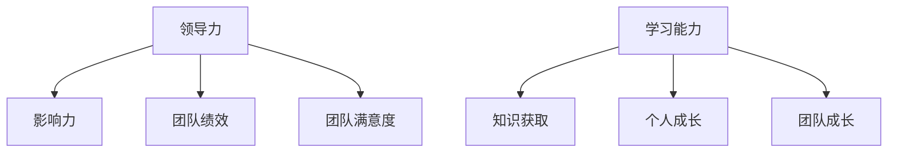

                 

# 领导力与学习能力：持续成长的重要性

> 关键词：领导力，学习能力，持续成长，自我评估，目标设定，时间管理，在线课程，研讨会，实战案例

> 摘要：本文将探讨领导力和学习能力在IT领域中的重要性，通过深入分析领导理论和学习过程，阐述如何通过有效的领导实践和持续的学习策略来促进个人和团队的成长。文章还将分享一些实用的方法和最佳实践，以帮助读者在职业生涯中实现持续成长。

## 引言

在当今快速发展的技术领域，领导力和学习能力已经成为成功的关键因素。无论是作为团队的领导者，还是作为IT专业人士，持续的成长和进步都至关重要。本文将围绕这两个核心概念，探讨它们在IT行业中的重要性，并提供实用的策略和方法，以帮助读者在职业生涯中取得更大的成功。

### 领导力的背景

领导力是一种影响力，它不仅仅是指导他人完成工作，更涉及到激发团队的潜力，推动创新，并在复杂多变的环境中保持团队的稳定和适应性。在现代企业中，领导力被看作是组织成功的关键因素之一。

### 学习能力的重要性

学习能力是个人和团队持续成长的动力源泉。在信息技术领域，技术更新换代迅速，不断学习新的知识和技能成为保持竞争力的必要条件。同时，学习能力也决定了一个人在面临挑战和不确定性时，能否迅速适应并找到解决问题的方法。

### 本书的目的

本书旨在帮助IT专业人士和领导者理解领导力和学习能力的核心概念，并提供实用的策略和方法，以实现个人和团队的持续成长。通过本书，读者将：

1. 深入了解领导理论和学习过程。
2. 学会有效的领导实践。
3. 制定和实施持续学习的策略。
4. 在实践中应用所学知识，实现个人和团队的成长。

## 核心概念

### 领导力的基本概念

#### 领导理论

领导理论是理解领导行为和领导效果的基础。以下是几种主要的领导理论：

##### 传统领导理论

传统领导理论强调领导者应该具备特定的品质和能力，如责任感、决策能力和专业知识。

##### 转型型领导理论

转型型领导理论强调领导者通过愿景激励和变革来推动团队进步。

##### 情境领导理论

情境领导理论认为领导风格应该根据团队成员的特点和工作环境来调整。

### 学习能力的基本概念

#### 学习类型

学习类型决定了个人如何吸收和处理信息。以下是几种常见的学习类型：

##### 传统学习

传统学习是通过正式的教育和培训课程获取知识。

##### 自主学习

自主学习是通过个人兴趣和自我驱动力来学习新技能。

##### 终身学习

终身学习是一种持续的学习态度，强调在整个职业生涯中不断学习新的知识和技能。

#### 学习过程

学习过程包括信息处理、批判性思维和问题解决。以下是学习过程中的几个关键步骤：

##### 信息处理

信息处理是指如何收集、分析和解释信息。

##### 批判性思维

批判性思维是指对信息进行深入分析和评估的能力。

##### 问题解决

问题解决是指应用知识和技能来找到解决问题的方法。

### 领导力与学习能力的比较和联系

领导力和学习能力虽然在概念上有所不同，但它们之间存在紧密的联系。领导力需要依赖学习能力来持续发展和适应变化，而学习能力可以通过领导力实践得到提升。以下是领导力和学习能力的一些比较属性和实体关系图：

#### 比较属性表

| 属性 | 领导力 | 学习能力 |
| --- | --- | --- |
| 目标 | 指导团队达成目标 | 持续获取新知识 |
| 方式 | 通过影响力引导团队 | 通过实践和反思学习 |
| 结果 | 影响团队绩效和满意度 | 提升个人和团队能力 |

#### 实体关系图

## 领导原则与实践

### 领导原则

领导原则是领导行为的基础，以下是一些核心领导原则：

#### 核心价值观

##### 诚信

诚信是领导力的基石，它建立信任并促进团队合作。

##### 尊重

尊重团队成员，认识到每个个体的价值和贡献。

##### 信任

信任是团队协作的关键，它促进开放沟通和共同目标。

##### 创新

鼓励创新思维，推动团队在技术和业务上取得突破。

#### 有效的领导实践

##### 沟通技能

有效的沟通技能包括清晰表达、倾听和反馈。

##### 决策

领导者需要做出明智的决策，考虑团队和组织的长期利益。

##### 团队建设

团队建设是通过建立紧密的团队关系和协作来提升团队绩效。

##### 冲突解决

冲突解决是指通过积极的对话和解决方案来处理团队内部的分歧。

## 持续学习策略

### 自我评估和目标设定

#### 自我评估工具

##### SWOT分析

SWOT分析是一种评估自身优势、劣势、机会和威胁的工具。

##### 力量与弱点

通过分析个人的优势和弱点，找到需要提升的领域。

#### 目标设定技术

##### SMART目标

SMART目标是一种具体、可衡量、可实现、相关性强且有时间限制的目标设定方法。

##### 行动计划

制定详细的行动计划，明确实现目标所需的步骤和时间表。

### 时间管理和优先级

#### 时间管理技巧

##### 柏拉图法则

柏拉图法则是识别和专注于最重要的任务的工具。

##### 埃克豪斯矩阵

埃克豪斯矩阵是一种时间管理工具，用于区分紧急重要、紧急不重要、重要不紧急和不重要不紧急的任务。

#### 优先级管理

##### 优先级排序

根据任务的重要性和紧急性对任务进行排序。

##### 执行策略

确保按照优先级执行任务，避免拖延和资源浪费。

### 持续学习和发展的来源

#### 学习资源

##### 书籍和阅读

阅读是获取新知识和见解的重要途径。

##### 在线课程

在线课程提供了灵活的学习时间和广泛的知识领域。

##### 研讨会和研讨会

研讨会和研讨会是交流知识和经验的绝佳机会。

##### 导师和教练

导师和教练可以提供指导和支持，帮助个人实现职业目标。

##### 在职学习

在职学习是通过实际工作体验来提升技能和知识的过程。

## 案例研究和最佳实践

### 案例研究1：成功的领导力和持续学习的实践

#### 案例背景

在一个快速发展的科技公司中，团队领导李明通过实施有效的领导原则和持续学习策略，成功地推动了团队的成长。

#### 成功要素

1. **领导原则**：李明注重诚信和尊重，建立了信任和开放沟通的文化。
2. **学习策略**：他鼓励团队成员参与在线课程和研讨会，并提供时间和资源支持。
3. **自我评估和目标设定**：李明定期与团队成员进行一对一的评估和目标设定，帮助他们识别弱点并设定职业目标。

#### 效果

通过李明的领导和持续学习的实践，团队的协作效率显著提升，创新能力和解决问题的能力也得到显著增强。

### 最佳实践提示

1. **定期自我评估**：定期评估个人能力和职业发展，及时调整学习和发展计划。
2. **积极参与外部培训**：定期参加外部培训和研讨会，以获取行业最新的知识和技能。
3. **建立学习小组**：与他人建立学习小组，通过讨论和分享来深化学习效果。
4. **实践和应用**：将学习的新知识应用于实际工作中，通过实践来巩固和提高技能。

## 总结

领导力和学习能力是IT专业人士和领导者持续成长的重要基石。通过理解领导理论和学习过程，实施有效的领导实践和持续学习策略，个人和团队可以在不断变化的技术环境中保持竞争力。希望本文提供的策略和实践方法能够帮助读者在职业生涯中实现持续成长和成功。

### 注意事项

1. **定期反思**：定期反思自己的领导风格和学习习惯，以便不断改进。
2. **平衡工作与学习**：确保在忙碌的工作中留出时间进行学习和自我提升。
3. **灵活调整**：根据实际情况灵活调整学习和发展计划。

### 拓展阅读

- 《领导力的五项修炼》
- 《学习之道》
- 《时间管理的艺术》
- 《持续学习的力量》

作者：AI天才研究院/AI Genius Institute & 禅与计算机程序设计艺术 /Zen And The Art of Computer Programming

---

**本文为原创文章，版权归AI天才研究院和禅与计算机程序设计艺术所有。未经授权，请勿转载。**

**本文内容仅供参考，实际应用请根据具体情况进行调整。**

