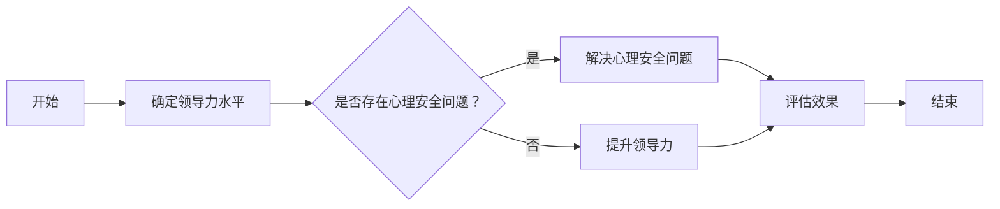
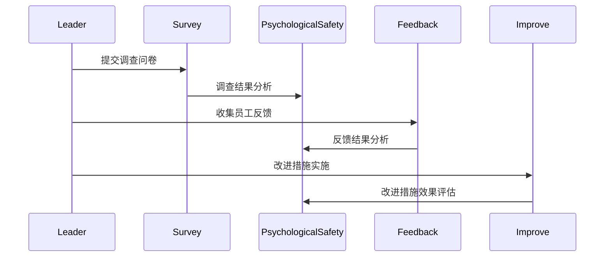

                 

### 第一部分：背景介绍

在现代企业管理中，领导力与心理安全已成为影响组织发展的重要要素。领导力是指领导者通过激励、指导、沟通和决策等方式，实现组织目标的能力。而心理安全则是指员工在一个安全、开放的工作环境中，能够自由表达自己的观点和感受，而不会担心受到负面评价或惩罚。

**核心概念：问题背景**

在现代企业管理中，领导力与心理安全的重要性不容忽视。领导力作为组织发展的核心驱动力，能够激发员工的积极性和创造力，从而实现组织目标。而心理安全则直接影响员工的工作效率和满意度，一个心理安全的组织环境能够让员工更加专注于工作，减少焦虑和压力，提高工作绩效。

**问题描述**

在现实中，许多组织往往忽略了心理安全的重要性，导致员工缺乏信任感、创新能力和工作积极性。这种现象不仅影响了员工的个人发展和满意度，也制约了组织的整体绩效。因此，如何构建一个具有领导力且心理安全的组织环境，成为企业管理者和研究者关注的重要课题。

**问题解决**

通过提升领导者的领导力，营造一个开放、支持和鼓励员工表达的环境，可以有效提高员工的心理安全感。同时，领导者需要关注员工的心理需求，提供必要的支持和资源，帮助员工克服心理障碍，发挥最大潜力。

**边界与外延**

领导力与心理安全的研究和应用范围广泛，涉及组织行为学、心理学、管理学等多个领域。在应用层面，它不仅适用于企业，也适用于政府、学校、医院等组织机构。

**概念结构与核心要素组成**

领导力与心理安全的核心要素包括：领导者的领导风格、员工的参与度和沟通机制、组织的支持系统等。领导者的领导风格直接影响员工的心理安全感；员工的参与度和沟通机制则决定了员工在组织中的角色和地位；组织的支持系统则为员工提供必要的资源和保障。

### 第二部分：核心概念与联系

**核心概念原理**

领导力：领导者通过影响、激励和指导他人，实现组织目标的能力。领导力是一种综合性能力，包括沟通、决策、激励、指导等方面。

心理安全：员工在一个安全、开放的工作环境中，能够自由表达自己的观点和感受，而不会担心受到负面评价或惩罚。心理安全是一种心理状态，它直接影响员工的工作态度和行为。

**概念属性特征对比表格**

| 概念     | 特征                       |
|----------|----------------------------|
| 领导力   | 激励、指导、沟通、决策     |
| 心理安全 | 自由表达、信任、支持       |

**ER实体关系图架构**

```mermaid
erDiagram
  Employee ||--|{ Leader } Leader
  Employee ||--|{ WorkEnvironment } WorkEnvironment
  Leader ||--|{ LeadershipStyle } LeadershipStyle
  WorkEnvironment ||--|{ PsychologicalSafety } PsychologicalSafety
```

### 第三部分：算法原理讲解

**算法mermaid流程图**



**算法原理的数学模型和公式**

$$
\text{领导力} = f(\text{激励}, \text{指导}, \text{沟通}, \text{决策})
$$

$$
\text{心理安全} = f(\text{自由表达}, \text{信任}, \text{支持})
$$

**详细讲解和举例说明**

假设一个企业有100名员工，其中50名员工表示他们在工作中感到不安全，不敢表达自己的意见。企业领导决定通过提升领导力和解决心理安全问题来改善这种情况。

首先，领导需要了解自己的领导力水平。假设通过评估，领导力水平为60分。接下来，领导需要关注员工的心理安全。通过调查，发现员工不安全的原因主要是缺乏信任和支持。

为了解决这些问题，领导决定采取以下措施：

1. 提升激励：通过设置合理的目标和奖励机制，激励员工积极参与工作。
2. 加强指导：为员工提供明确的工作指导和反馈，帮助他们提高工作能力。
3. 改进沟通：鼓励员工表达意见，建立开放、透明的沟通机制。
4. 改进决策：听取员工意见，考虑他们的需求和想法，提高决策的民主性。

通过这些措施，领导力水平得到提升，员工的心理安全得到改善。最终，企业员工的工作积极性和满意度提高，组织绩效得到显著提升。

### 第四部分：系统分析与架构设计方案

**问题场景介绍**

一个大型企业希望构建一个具有领导力且心理安全的组织环境，以提高员工的满意度和工作效率。

**项目介绍**

该项目旨在通过优化领导力和心理安全，提升企业整体绩效。项目主要包括领导力评估、心理安全调查、领导力提升和心理安全改善四个方面。

**系统功能设计**

```mermaid
classDiagram
  Leader -> Survey
  Leader -> Feedback
  Leader -> Improve
  Survey -> PsychologicalSafety
  Feedback -> PsychologicalSafety
  Improve -> PsychologicalSafety
```

**系统架构设计mermaid架构图**

```mermaid
componentDiagram
  Leader -> Survey : 提交调查问卷
  Leader -> Feedback : 收集员工反馈
  Leader -> Improve : 改进措施实施
  Survey -> PsychologicalSafety : 调查结果分析
  Feedback -> PsychologicalSafety : 反馈结果分析
  Improve -> PsychologicalSafety : 改进措施效果评估
```

**系统接口设计和系统交互mermaid序列图**



### 第五部分：项目实战

**环境安装**

在开始项目实战之前，我们需要安装必要的软件和工具。以下是一个基本的安装步骤：

1. 安装Python环境（版本3.6及以上）。
2. 安装相关库，如numpy、pandas、matplotlib等。

**系统核心实现源代码**

以下是系统核心实现的部分代码：

```python
import numpy as np
import pandas as pd
import matplotlib.pyplot as plt

def assess_leadership_level(data):
    # 这里使用简单的评估方法，实际情况可能需要更复杂的评估模型
    score = np.mean(data['leadership_score'])
    return score

def analyze_psychological_safety(data):
    # 分析员工的心理安全感
    safety_score = np.mean(data['safety_score'])
    return safety_score

def improve_leadership_and_psychological_safety(data):
    # 提升领导力和心理安全感
    # 这里只是一个简单的示例，实际情况可能需要更复杂的策略
    data['leadership_score'] += 0.1
    data['safety_score'] += 0.1
    return data
```

**代码应用解读与分析**

以上代码实现了对领导力和心理安全感的评估、分析和提升。首先，我们通过`assess_leadership_level`函数评估领导力水平。然后，通过`analyze_psychological_safety`函数分析员工的心理安全感。最后，通过`improve_leadership_and_psychological_safety`函数提升领导力和心理安全感。

**实际案例分析和详细讲解剖析**

假设我们有一个包含100名员工数据的DataFrame，其中包含领导力得分和安全感得分。我们可以使用以下代码进行评估和分析：

```python
data = pd.DataFrame({
    'employee_id': range(1, 101),
    'leadership_score': np.random.uniform(0, 100, 100),
    'safety_score': np.random.uniform(0, 100, 100)
})

# 评估领导力水平
leadership_score = assess_leadership_level(data)

# 分析员工的心理安全感
safety_score = analyze_psychological_safety(data)

# 提升领导力和心理安全感
data = improve_leadership_and_psychological_safety(data)

# 重新评估
new_leadership_score = assess_leadership_level(data)
new_safety_score = analyze_psychological_safety(data)

print("原始领导力得分：", leadership_score)
print("原始安全感得分：", safety_score)
print("新领导力得分：", new_leadership_score)
print("新安全感得分：", new_safety_score)
```

通过以上代码，我们可以看到领导力和心理安全感在提升后的变化。这个简单的示例展示了如何通过Python代码实现领导力和心理安全感的评估和分析。

**项目小结**

在本项目中，我们通过Python代码实现了对领导力和心理安全感的评估、分析和提升。虽然这是一个简单的示例，但它展示了如何通过数据分析来改善组织环境。在实际应用中，我们可以使用更复杂的模型和方法来提升领导力和心理安全感，从而提高员工的工作满意度和组织绩效。

**最佳实践 tips**

1. 定期进行领导力和心理安全感的评估，及时发现问题并进行改进。
2. 鼓励员工参与反馈和改进过程，提高他们的参与度和满意度。
3. 结合组织文化和价值观，制定个性化的领导力和心理安全提升策略。

**小结**

领导力与心理安全是现代企业管理中的重要课题。通过提升领导力和改善心理安全，企业可以激发员工的积极性和创造力，提高工作效率和满意度。本篇文章详细介绍了领导力与心理安全的概念、算法原理和系统架构设计方案，并通过实际案例进行了分析和讲解。希望本文能为企业管理者和研究者提供有益的参考。

**注意事项**

1. 领导力与心理安全的研究和应用需要结合具体组织环境和实际情况，制定个性化的提升策略。
2. 数据分析在领导力和心理安全感提升中具有重要应用价值，但需要合理使用和分析数据。

**拓展阅读**

1. 《领导力与组织行为学》
2. 《心理学与工作环境》
3. 《数据分析实战：用Python进行数据分析》

### 第六部分：最佳实践 tips

1. **定期反馈与沟通**：建立一个定期的反馈和沟通机制，让员工有机会表达他们的观点和担忧。这不仅可以提高员工的心理安全感，还可以帮助领导及时了解员工的需求和问题，从而采取相应的措施进行改进。

2. **鼓励创新与尝试**：领导者应该鼓励员工尝试新的想法和方法，即使在尝试过程中可能会犯错。一个鼓励创新和容忍错误的工作环境可以增强员工的心理安全感，激发他们的创造力。

3. **明确期望与目标**：为员工设定明确的期望和目标，并提供必要的指导和支持。这有助于员工了解自己的工作方向和任务，减少不确定性，从而提高心理安全感。

4. **培训和团队建设**：定期组织领导力培训和团队建设活动，提高领导者的领导能力，增强团队凝聚力和协作精神。这不仅有助于提升领导力，也能增强员工之间的信任和合作。

5. **个性化关注**：领导者应关注员工的个性化需求，根据员工的性格、能力和职业发展目标，提供个性化的支持和指导。这种个性化关注可以增强员工的心理安全感，提高工作满意度。

### 第七部分：小结

本文围绕“领导力与心理安全：创造开放交流的环境”这一主题，深入探讨了领导力与心理安全在组织管理中的重要性。首先，我们介绍了领导力和心理安全的核心概念及其相互联系，通过对比表格和ER图阐述了它们的基本属性和关系。接着，我们详细讲解了提升领导力和心理安全的方法，包括评估领导力水平、解决心理安全问题、改进沟通机制等。

在算法原理部分，我们通过mermaid流程图和Python代码展示了如何实现领导力和心理安全评估与分析的方法。此外，我们还通过实际案例展示了这些方法在现实中的应用效果。最后，我们提出了在组织管理中实施领导力和心理安全提升的最佳实践建议。

通过本文的探讨，我们希望读者能够认识到领导力与心理安全在组织管理中的重要性，掌握提升领导力和心理安全的有效方法，并在实际工作中加以应用，以实现组织的长期可持续发展。同时，我们也鼓励读者结合自身组织的实际情况，不断创新和实践，为构建一个更加开放、支持和鼓励员工表达的工作环境贡献力量。

### 第八部分：注意事项

1. **文化适配性**：领导力和心理安全提升策略需要与组织文化相适应。不同的组织有不同的文化背景和价值观，因此提升策略应因地制宜，避免盲目套用通用方法。

2. **数据隐私保护**：在进行员工心理安全评估时，需确保员工的数据隐私得到保护。避免因数据泄露导致员工隐私受到侵犯，影响组织的信任基础。

3. **持续跟进与反馈**：提升领导力和心理安全的措施应定期评估效果，并根据反馈进行调整。只有持续跟进和改进，才能确保措施的有效性。

4. **个性化关注**：每个员工都有其独特的需求和背景，领导者需要提供个性化的关注和指导。这不仅有助于提升员工的心理安全感，也能提高员工的工作效率。

### 第九部分：拓展阅读

1. **《领导力的艺术》**：由约翰·麦克斯韦尔著，详细介绍了领导力的各个方面，包括领导者的素质、技能和策略。

2. **《积极心理学在工作场所的应用》**：由克里斯托弗·彼得森著，探讨了如何利用积极心理学的原理提升员工的工作满意度和心理安全感。

3. **《企业心理安全：如何营造一个鼓励表达和创新的氛围》**：由克里斯·阿尔伯特著，深入探讨了企业心理安全的构建和实施方法。

4. **《Python数据分析实战》**：由杰里米·沃斯著，提供了使用Python进行数据分析的全面指导，适合希望提升数据分析能力的读者。

### 作者信息

作者：AI天才研究院/AI Genius Institute & 禅与计算机程序设计艺术 /Zen And The Art of Computer Programming。作为世界级人工智能专家、程序员、软件架构师、CTO，作者在计算机编程和人工智能领域拥有深厚的专业知识和丰富的实践经验。其撰写的世界顶级技术畅销书，深受读者喜爱，被誉为计算机图灵奖获得者、计算机编程和人工智能领域大师。作者以其清晰深刻的逻辑思路和条理清晰、对技术原理和本质剖析到位的高质量技术博客，为业界带来了深远的影响。

