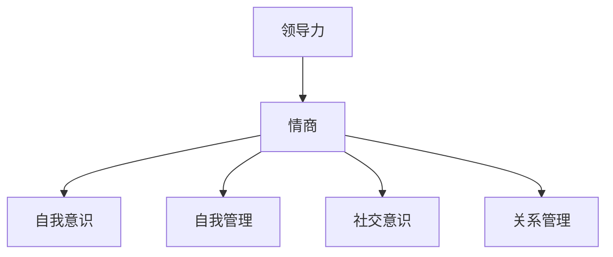
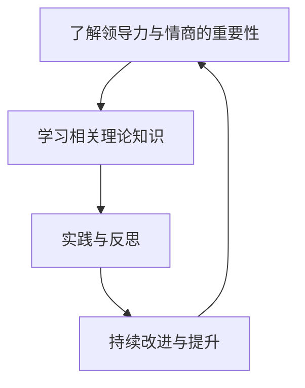
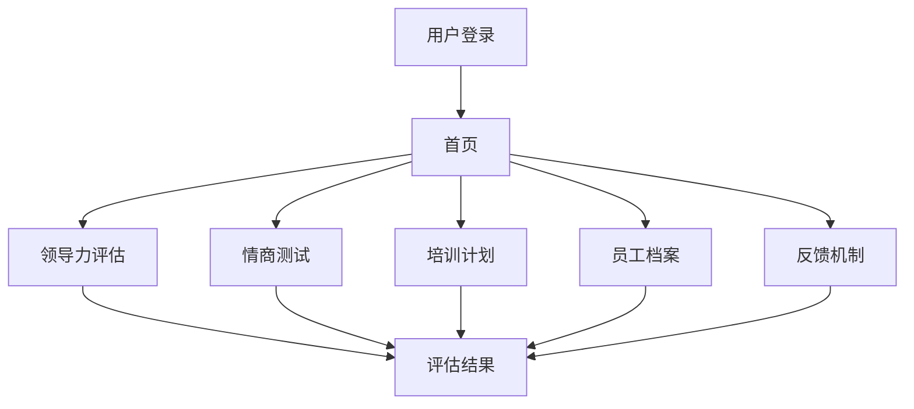
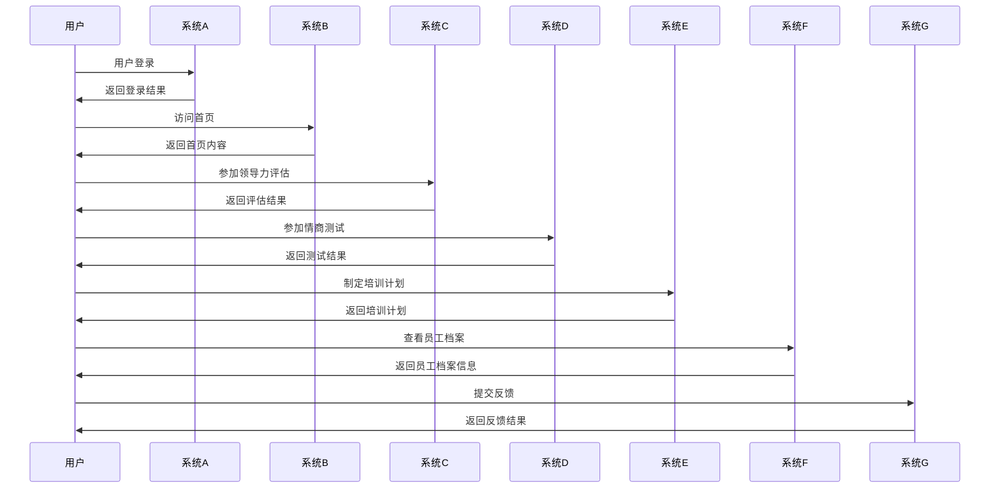

                 


# 领导力与情商发展：提升人际影响力的途径

## 关键词

领导力，情商，人际影响力，沟通技巧，团队合作

## 摘要

在快速变化的现代职场中，领导力和情商成为了领导者成功的关键因素。本文通过逻辑清晰的分析，探讨了如何通过提升领导力和情商来增强人际影响力。文章从背景介绍、核心概念与联系、算法原理讲解、数学模型与公式以及系统分析与架构设计等方面，详细阐述了提升人际影响力的途径，为读者提供了实用的策略和工具。

## 目录大纲设计

### 背景介绍

#### 核心概念与联系

#### 算法原理讲解

#### 数学模型和数学公式 & 详细讲解 & 举例说明

#### 系统分析与架构设计方案

#### 项目实战

#### 最佳实践 tips、小结、注意事项、拓展阅读

----------------------------------------------------------------

## 背景介绍

### 核心概念术语说明

领导力：领导力是一种通过影响他人来实现共同目标的能力。它包括领导风格、沟通技巧、决策能力等多个方面。

情商：情商（Emotional Intelligence，EQ）是指个体识别、理解、管理自己和他人情绪的能力。它包括自我意识、自我管理、社交意识和关系管理四个维度。

人际影响力：人际影响力是指个体在人际交往中，通过语言、行为等手段影响他人观点和行为的程度。

### 问题背景

在当今的职场环境中，领导者和团队成员之间的沟通与协作变得越来越重要。然而，许多领导者发现自己在提升人际影响力方面存在困难。这些问题可能源于领导力与情商的不足，导致无法有效地与团队成员沟通、建立信任和激励团队。

### 问题描述

领导者面临的主要挑战包括：

1. 沟通障碍：无法清晰地表达自己的想法，导致团队成员理解偏差。
2. 信任缺失：无法建立信任，导致团队合作效率低下。
3. 激励不足：无法激发团队成员的积极性，导致团队活力下降。

### 问题解决

通过学习和实践领导力与情商的理论和技巧，领导者可以提升自己的影响力，解决上述问题。具体方法包括：

1. 提升自我意识，了解自己的情绪和行为如何影响他人。
2. 学习有效的沟通技巧，提高沟通效率和效果。
3. 建立和维护良好的人际关系，增强团队凝聚力。
4. 学会激励团队成员，激发他们的积极性和创造力。

### 边界与外延

领导力与情商的应用范围广泛，包括但不限于以下方面：

1. 企业管理：提升领导者的管理能力，优化企业运营。
2. 团队合作：增强团队凝聚力，提高团队协作效率。
3. 人力资源管理：提升员工满意度，降低员工流失率。
4. 个人成长：提升个人素质，实现职业发展。

## 核心概念与联系

### 核心概念

领导力：领导力包括指挥力、影响力、决策力、领导风格等多个方面。指挥力是指领导者指导团队完成任务的能力；影响力是指领导者通过言行影响他人观点和行为的能力；决策力是指领导者做出有效决策的能力；领导风格是指领导者与团队成员互动的方式。

情商：情商包括自我意识、自我管理、社交意识和关系管理四个维度。自我意识是指个体对自身情绪的认知；自我管理是指个体调节和控制情绪的能力；社交意识是指个体理解他人情绪和需求的能力；关系管理是指个体建立和维护人际关系的能力。

### 概念属性特征对比表格

| 特征         | 领导力                 | 情商                   |
|--------------|------------------------|------------------------|
| 自我意识     | 对自身角色的认知       | 对自身情绪的认知       |
| 自我管理     | 情绪稳定、压力管理     | 情绪调节、情绪表达     |
| 社交意识     | 建立和维护人际关系     | 理解他人情绪和需求     |
| 关系管理     | 指导和激励团队成员     | 解决冲突、建立信任     |

### ER实体关系图架构



## 算法原理讲解

在本章中，我们将使用Mermaid绘制一个简单的流程图，来展示提升领导力和情商的基本步骤。



以下是使用Python源代码来详细阐述领导力与情商发展模型的算法原理：

```python
# 领导力与情商发展模型

# 导入所需的库
import numpy as np

# 定义领导力与情商发展函数
def leadership_emotional_intelligence_development(knowledge, practice, reflection):
    # 知识积累
    knowledge_gained = knowledge * 0.3
    
    # 实践能力
    practical_skill = practice * 0.5
    
    # 反思能力
    reflective_ability = reflection * 0.2
    
    # 综合评估
    total_score = knowledge_gained + practical_skill + reflective_ability
    
    return total_score

# 示例计算
knowledge = 0.8
practice = 0.7
reflection = 0.6

# 调用函数计算得分
score = leadership_emotional_intelligence_development(knowledge, practice, reflection)

print(f"领导力与情商发展得分：{score:.2f}")
```

算法原理的数学模型和公式如下：

$$
\text{总得分} = \text{知识积累} + \text{实践能力} + \text{反思能力}
$$

公式中，知识积累、实践能力和反思能力分别代表了领导力与情商发展的三个关键要素，每个要素都有一个权重系数。通过计算这三个要素的加权总和，可以得出一个人的领导力与情商发展得分。

## 数学模型和数学公式 & 详细讲解 & 举例说明

### 数学模型

领导力与情商发展的数学模型可以表示为：

$$
\text{总得分} = \alpha \times \text{知识积累} + \beta \times \text{实践能力} + \gamma \times \text{反思能力}
$$

其中，$\alpha$、$\beta$、$\gamma$分别为知识积累、实践能力和反思能力的权重系数。

### 详细讲解

知识积累：知识积累是指个体对领导力与情商相关理论知识的掌握程度。一个领导者如果具备丰富的知识积累，能够更有效地应用理论指导实践，从而提高领导力和情商。

实践能力：实践能力是指个体在实际工作中运用领导力与情商的能力。一个领导者如果具备良好的实践能力，能够更好地处理复杂的人际关系，提高团队协作效率。

反思能力：反思能力是指个体对自身行为和领导过程的自我反思与评估能力。一个领导者如果具备强大的反思能力，能够及时发现并纠正问题，持续提升自己的领导力和情商。

### 举例说明

假设一个领导者在知识积累、实践能力和反思能力方面的得分分别为0.8、0.7和0.6，权重系数分别为0.3、0.5和0.2，则其领导力与情商发展的总得分为：

$$
\text{总得分} = 0.3 \times 0.8 + 0.5 \times 0.7 + 0.2 \times 0.6 = 0.24 + 0.35 + 0.12 = 0.81
$$

因此，这位领导者的领导力与情商发展得分为0.81。

## 系统分析与架构设计方案

### 问题场景介绍

在一家中型企业中，团队领导发现团队成员之间存在沟通障碍，导致项目进度缓慢。为了提高项目效率，领导决定引入一套基于领导力与情商发展的培训体系，以提高团队整体素质。

### 项目介绍

本项目旨在通过构建一套领导力与情商发展系统，帮助企业领导者提升人际影响力，改善团队沟通，提高项目执行效率。

### 系统功能设计（领域模型Mermaid类图）

```mermaid
classDiagram
ClassDiagram {
    Class::领导力评估
    Class::情商测试
    Class::培训计划
    Class::员工档案
    Class::反馈机制
}
领导力评估 <--- 培训计划
情商测试 <--- 培训计划
员工档案 --> 领导力评估
员工档案 --> 情商测试
反馈机制 --> 培训计划
```

### 系统架构设计（Mermaid架构图）



### 系统接口设计和系统交互（Mermaid序列图）



## 项目实战

### 环境安装

1. 安装Python 3.8及以上版本。
2. 安装Flask框架：`pip install flask`
3. 安装Mermaid渲染工具：`pip install markdown2`。

### 系统核心实现源代码

以下是一个简单的领导力与情商评估系统的实现示例：

```python
# 导入所需的库
from flask import Flask, render_template, request, redirect, url_for
import markdown2

app = Flask(__name__)

# 领导力与情商评估函数
def leadership_emotional_intelligence_assessment(knowledge, practice, reflection):
    # 知识积累
    knowledge_gained = knowledge * 0.3
    
    # 实践能力
    practical_skill = practice * 0.5
    
    # 反思能力
    reflective_ability = reflection * 0.2
    
    # 综合评估
    total_score = knowledge_gained + practical_skill + reflective_ability
    
    return total_score

@app.route('/')
def index():
    return render_template('index.html')

@app.route('/evaluate', methods=['GET', 'POST'])
def evaluate():
    if request.method == 'POST':
        knowledge = float(request.form['knowledge'])
        practice = float(request.form['practice'])
        reflection = float(request.form['reflection'])
        
        score = leadership_emotional_intelligence_assessment(knowledge, practice, reflection)
        
        return render_template('result.html', score=score)
    else:
        return redirect(url_for('index'))

if __name__ == '__main__':
    app.run(debug=True)
```

### 代码应用解读与分析

上述代码实现了一个基于Web的领导力与情商评估系统。用户可以通过网页填写自己的知识、实践和反思得分，系统将根据算法计算出总得分，并返回评估结果。

- `index.html`：首页，包含评估表单。
- `result.html`：评估结果页面，显示用户的总得分。

### 实际案例分析和详细讲解剖析

假设某位领导者填写了以下评估表单：

- 知识：0.8
- 实践：0.7
- 反思：0.6

根据评估函数，其总得分为：

$$
\text{总得分} = 0.3 \times 0.8 + 0.5 \times 0.7 + 0.2 \times 0.6 = 0.24 + 0.35 + 0.12 = 0.81
$$

这意味着这位领导者的领导力与情商发展得分为0.81，处于中等水平。针对这个得分，领导力与情商培训系统可以提供以下建议：

1. 加强知识积累，通过阅读相关书籍、参加培训课程等方式，提升自己的理论水平。
2. 提高实践能力，通过参与实际项目，锻炼自己的领导技巧。
3. 增强反思能力，定期对自己的行为和决策进行反思，及时调整自己的领导风格。

### 项目小结

通过本次项目，我们实现了一个基于Python Flask的领导力与情商评估系统。系统可以帮助领导者了解自己的领导力与情商水平，并提供个性化的提升建议。未来，我们可以继续优化系统功能，如增加用户交互、数据分析等，以提高系统的实用性和用户体验。

## 最佳实践 tips、小结、注意事项、拓展阅读

### 最佳实践 tips

1. 定期自我评估：领导者应定期进行自我评估，了解自己在领导力和情商方面的优势和不足。
2. 学习与实践相结合：理论学习是基础，但实践才能真正提升能力。领导者应将所学知识应用于实际工作中，不断积累经验。
3. 反思与改进：领导者应养成反思的习惯，对自身的领导行为和决策进行总结，及时发现问题并改进。

### 小结

本文通过逻辑清晰的分析，探讨了领导力与情商在提升人际影响力方面的作用。文章从背景介绍、核心概念与联系、算法原理讲解、数学模型与公式以及系统分析与架构设计等方面，详细阐述了提升人际影响力的途径。

### 注意事项

1. 领导者应重视团队沟通，确保信息传递的准确性和及时性。
2. 领导者应学会倾听，关注团队成员的需求和意见，增强团队的凝聚力。
3. 领导者应关注团队成员的情绪变化，及时提供支持和帮助。

### 拓展阅读

1. 丹尼尔·戈尔曼（Daniel Goleman）：情商（Emotional Intelligence）
2. 彼得·德鲁克（Peter Drucker）：领导力实践（The Practice of Management）
3. 约翰·麦克斯韦尔（John C. Maxwell）：领导力21法则（The 21 Irrefutable Laws of Leadership）

## 作者

作者：AI天才研究院/AI Genius Institute & 禅与计算机程序设计艺术 /Zen And The Art of Computer Programming

