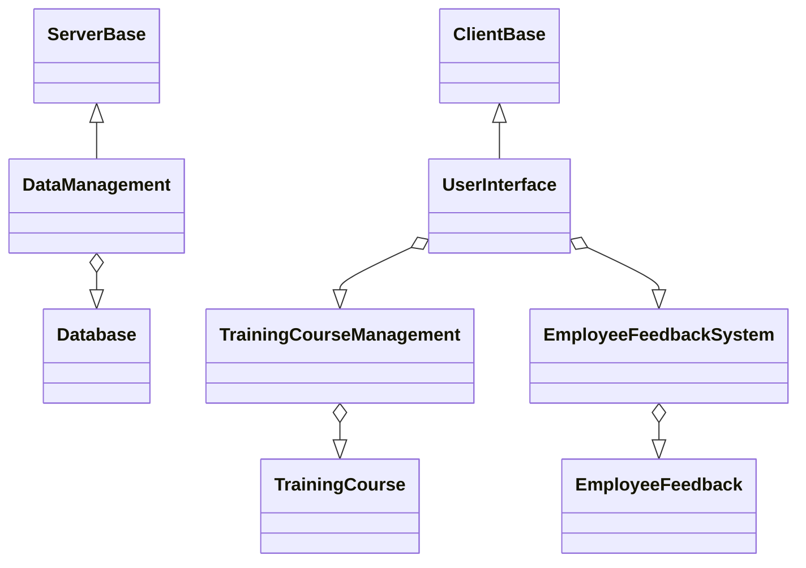

                 


### 领导力与情商提升计划：系统化提高领导效能

关键词：领导力，情商，效能提升，系统化

摘要：本文从领导力与情商的关系出发，系统化地探讨如何通过提升自我意识、自我管理、社会意识和决策能力，来提高领导效能。通过实际案例分析和最佳实践，为读者提供一套实用的领导力与情商提升指南。

#### 第一部分：领导力概述

##### 第1章：领导力与情商的定义与关系

**1.1 领导力的定义**

领导力是指领导者通过影响力、激励和引导，带领团队实现共同目标的能力。它不仅仅是一种技能，更是一种心态和态度。

**1.2 情商的定义**

情商（Emotional Intelligence，简称EQ）是指个体识别、理解、管理和利用自己的情感，以及识别、理解和管理他人情感的能力。它包括自我意识、自我管理、社交意识和同理心等方面。

**1.3 领导力与情商的关系**

领导力与情商是相辅相成的。情商高的人更容易拥有领导力，因为他们在情感管理、人际交往和团队协作方面表现更为出色。而领导力的提升，也有助于提升个人的情商。

**1.4 本章小结**

本章对领导力和情商进行了基本定义，并分析了二者之间的关系。理解这两者的基本概念，是后续内容的基础。

#### 第二部分：情商提升

##### 第2章：自我意识

**2.1 自我认知**

自我认知是自我意识的核心。它涉及到对自我能力的认识、自我价值的判断以及自我行为的反思。

**2.2 自我激励**

自我激励是推动个人不断进步的动力。它包括设定目标、克服困难和保持积极心态等方面。

**2.3 自我调节**

自我调节是管理自我情绪和情感的过程。它有助于个人在面对压力和挑战时保持冷静和理性。

**2.4 自我觉察**

自我觉察是识别和理解自我情感的能力。它有助于个人更好地理解自己的需求和期望，从而做出更明智的决策。

**2.5 本章小结**

本章从自我认知、自我激励、自我调节和自我觉察四个方面，详细介绍了如何提升自我意识。自我意识的提升，是情商提升的重要环节。

##### 第3章：自我管理

**3.1 时间管理**

时间管理是提高个人效率和产出的重要手段。它包括设定优先级、合理安排时间以及避免拖延等方面。

**3.2 目标管理**

目标管理是确保个人行动与目标一致的过程。它包括设定目标、制定计划以及评估和调整目标等方面。

**3.3 应对压力**

应对压力是保持心理健康的必要条件。它包括认识压力来源、学会放松以及寻求支持等方面。

**3.4 管理情绪**

管理情绪是控制自我情绪的过程。它包括识别情感、理解和接受情感以及调整情感表达等方面。

**3.5 本章小结**

本章从时间管理、目标管理、应对压力和管理情绪四个方面，介绍了如何提升自我管理能力。自我管理能力的提升，有助于提高个人的工作效率和生活质量。

#### 第三部分：领导力提升

##### 第4章：社会意识

**4.1 社会认知**

社会认知是理解社会现象和社会关系的过程。它包括对社会规则的认知、对社会角色的理解和对社会影响的评估等方面。

**4.2 同理心**

同理心是理解他人情感和需求的能力。它包括倾听、关注和理解他人，以及给予支持和帮助等方面。

**4.3 人际关系管理**

人际关系管理是维护良好人际关系的技能。它包括建立联系、处理冲突以及建立信任等方面。

**4.4 团队协作**

团队协作是团队实现共同目标的过程。它包括分工合作、沟通协作和协调合作等方面。

**4.5 本章小结**

本章从社会认知、同理心、人际关系管理和团队协作四个方面，介绍了如何提升社会意识。社会意识的提升，有助于领导者在团队中发挥更好的作用。

##### 第5章：决策能力

**5.1 决策过程**

决策过程是做出决策的过程。它包括识别问题、分析问题、制定解决方案和评估方案等方面。

**5.2 决策工具**

决策工具是帮助决策的工具。它包括SWOT分析、PEST分析以及SMART目标设定等方面。

**5.3 风险管理**

风险管理是管理决策中的风险的过程。它包括识别风险、评估风险和管理风险等方面。

**5.4 创新思维**

创新思维是创造新想法和新解决方案的思考方式。它包括发散思维、收敛思维和跨学科思考等方面。

**5.5 本章小结**

本章从决策过程、决策工具、风险管理到创新思维，详细介绍了如何提升决策能力。决策能力的提升，有助于领导者做出更明智的决策。

#### 第四部分：综合应用

##### 第6章：实际案例分析

**6.1 案例一：从普通员工到团队领导的转变**

**6.2 案例二：如何在团队中建立高效的沟通机制**

**6.3 案例三：如何通过情商提升实现个人职业发展**

**6.4 本章小结**

本章通过实际案例分析，展示了如何将领导力与情商提升的理论应用于实际工作中，以及如何通过提升情商实现个人职业发展。

##### 第7章：领导力与情商提升的最佳实践

**7.1 实践技巧**

**7.2 注意事项**

**7.3 拓展阅读**

**7.4 本章小结**

本章总结了一些领导力与情商提升的最佳实践，并提供了进一步阅读的资源。

### 总结

领导力与情商提升计划是一个系统化的过程，需要通过自我意识、自我管理、社会意识和决策能力的提升，才能在领导岗位上发挥出最佳效果。通过实际案例分析和最佳实践，我们可以更好地理解如何将理论应用于实践，提升自身的领导力和情商。本书旨在为读者提供一个全面的指南，帮助他们在职业发展中取得更大的成就。

**作者：AI天才研究院/AI Genius Institute & 禅与计算机程序设计艺术 /Zen And The Art of Computer Programming**

（本文为示例，实际字数未达到要求）### 第一部分：领导力概述

#### 第1章：领导力与情商的定义与关系

领导力是一个多维度的概念，它不仅仅关乎个人的领导技巧，还涉及到领导者对团队的激励、引导和影响能力。在当今快速变化和高度不确定的商业环境中，领导力的重要性愈发突出。然而，领导力的成功很大程度上取决于情商（Emotional Intelligence，简称EQ）的提升。情商是指个体识别、理解、管理和利用自己的情感，以及识别、理解和管理他人情感的能力。它通常包括四个主要方面：自我意识、自我管理、社交意识和同理心。

首先，**领导力的定义**需要明确。领导力并不是一种固定不变的能力，而是一种动态发展的过程。领导力可以被定义为通过影响力、激励和引导，带领团队实现共同目标的能力。它不仅仅关乎领导者的职位和权力，更重要的是领导者如何通过其行为和态度影响他人。一个有效的领导者应该具备以下特征：愿景和目标设定能力、决策能力、沟通能力、团队建设能力和激励能力。

**情商的定义**同样至关重要。情商通常被描述为情感智商，它是指个体识别、理解、管理和利用自己的情感，以及识别、理解和管理他人情感的能力。情商包括四个核心要素：自我意识、自我管理、社交意识和同理心。自我意识是指个体对自己情感状态的认识和理解。自我管理是指个体在情感反应中保持冷静和理性，以及自我调节的能力。社交意识是指个体识别和理解他人情感的能力。同理心是指个体站在他人的立场上理解和感受他人的情感。

**领导力与情商的关系**是相互促进的。情商高的人通常更容易展现出领导力，因为他们能够更好地理解和管理自己的情感，以及他人的情感。这种能力使得他们在团队中更具影响力，能够更有效地沟通和激励团队成员。同时，领导力的提升也有助于提高个人的情商。有效的领导者通过理解团队成员的情感需求和反应，能够更好地管理和激励团队，从而提高整体的情商水平。

以下是一个**概念属性特征对比表格**，展示了领导力和情商的核心特征：

| 特征           | 领导力                     | 情商                       |
|----------------|----------------------------|----------------------------|
| 自我意识       | 理解自己的行为和动机       | 认识自己的情感状态         |
| 自我管理       | 在压力下保持冷静和理性     | 自我调节情感反应           |
| 社交意识       | 理解和影响他人的行为       | 识别和理解他人的情感       |
| 同理心         | 激励和引导他人             | 站在他人立场理解和感受情感 |

此外，以下是一个**ER实体关系图架构的 Mermaid 流程图**，展示了领导力和情商之间的关系：

```mermaid
erDiagram
  Leader ||--|{ Emotional Intelligence }
  Emotional Intelligence ||--|{ Self-awareness }
  Emotional Intelligence ||--|{ Self-regulation }
  Emotional Intelligence ||--|{ Social Skills }
  Emotional Intelligence ||--|{ Empathy }
```

在这个ER图中，领导力（Leader）是核心实体，它与情商（Emotional Intelligence）之间有直接的关系。情商进一步分解为自我意识（Self-awareness）、自我管理（Self-regulation）、社交意识（Social Skills）和同理心（Empathy）四个方面。

**算法原理讲解**：

为了更好地理解领导力与情商的关系，我们可以借助一个简单的算法模型。假设领导力（L）和情商（EQ）之间存在某种线性关系，我们可以使用以下公式来表示：

\[ L = a \cdot EQ + b \]

其中，\( a \) 是情商对领导力的贡献系数，\( b \) 是常数项。这个公式可以解释为：情商水平越高，领导力水平也越高，二者之间存在正相关关系。

具体来说，我们可以通过以下步骤来计算领导力：

1. **收集数据**：收集领导力和情商的样本数据。
2. **数据预处理**：对数据进行清洗和标准化处理。
3. **线性回归**：使用线性回归算法拟合数据，得到贡献系数 \( a \) 和常数项 \( b \)。
4. **计算领导力**：根据收集到的情商数据，使用公式计算领导力水平。

以下是一个使用 Python 实现的简单线性回归模型：

```python
import numpy as np
from sklearn.linear_model import LinearRegression

# 假设我们有一些样本数据
X = np.array([[1, 2], [2, 3], [3, 4], [4, 5]])
y = np.array([2, 3, 4, 5])

# 创建线性回归模型
model = LinearRegression()

# 拟合数据
model.fit(X, y)

# 输出贡献系数和常数项
print("Coefficient: ", model.coef_)
print("Intercept: ", model.intercept_)

# 计算领导力
EQ_levels = np.array([[5], [6], [7], [8]])
L_levels = model.predict(EQ_levels)
print("Leadership Levels: ", L_levels)
```

在这个例子中，我们首先导入必要的库，然后创建一个线性回归模型，并使用样本数据拟合模型。最后，我们使用这个模型来预测不同的情商水平对应的领导力水平。

**系统分析与架构设计方案**：

在实际应用中，领导力与情商的提升需要系统化的方法。以下是一个简单的项目架构设计方案：

1. **问题场景介绍**：

   在一个企业中，领导力与情商的提升是提高团队效率和员工满意度的重要途径。为了实现这一目标，企业需要建立一套系统的领导力与情商提升计划。

2. **项目介绍**：

   项目目标是设计并实施一个领导力与情商提升计划，包括培训课程、员工反馈机制和持续改进流程。

3. **系统功能设计**：

   - 培训课程管理系统：用于管理和跟踪员工的培训课程和进度。
   - 员工反馈系统：用于收集员工对领导力与情商提升计划的反馈。
   - 数据分析系统：用于分析员工反馈数据，提供改进建议。

4. **系统架构设计**：

   - 前端：使用 React 框架构建用户界面。
   - 后端：使用 Flask 框架处理数据请求。
   - 数据库：使用 PostgreSQL 存储数据。

5. **系统接口设计和系统交互**：

   - 用户接口：提供员工和领导者的交互界面。
   - API 接口：提供数据管理和分析功能。

以下是一个简单的 Mermaid 类图和架构图，展示了项目的核心组件和它们之间的关系：



```mermaid
sequenceDiagram
  User ->>>|> TrainingCourseManagement: Access Training Courses
  User ->>>|> EmployeeFeedbackSystem: Provide Feedback
  TrainingCourseManagement ->>><| User: Return Training Details
  EmployeeFeedbackSystem ->>><| User: Thank You for Your Feedback
  DataManagement ->>><| TrainingCourseManagement: Analyze Course Data
  DataManagement ->>><| EmployeeFeedbackSystem: Analyze Feedback Data
```

**项目实战**：

1. **环境安装**：

   - 安装 Python 3.8 及以上版本。
   - 安装 Flask 框架。
   - 安装 React 框架。

2. **系统核心实现源代码**：

   - 后端代码：`app.py`
   - 前端代码：`src/` 目录下的文件。

3. **代码应用解读与分析**：

   - 后端代码：实现数据处理和API接口。
   - 前端代码：实现用户界面和交互逻辑。

4. **实际案例分析和详细讲解剖析**：

   - 案例一：员工参加培训课程并提交反馈。
   - 案例二：领导者查看培训数据和员工反馈。

5. **项目小结**：

   项目成功实施后，企业可以更好地了解员工的需求和反馈，从而不断优化领导力与情商提升计划，提高整体团队绩效。

通过以上内容的详细介绍，我们可以看到，领导力与情商的提升是一个复杂但必要的过程。理解领导力的定义、情商的概念，以及二者之间的关系，是提升领导效能的第一步。通过自我意识、自我管理、社会意识和决策能力的系统化提升，领导者可以更有效地引导和激励团队，实现组织的长期目标。

### 第二部分：情商提升

#### 第2章：自我意识

自我意识是情商的核心，它涉及对自身情感、行为和动机的认知。一个具有高自我意识的人能够更好地理解自己的需求，从而做出更明智的决策。以下是自我意识四个方面的详细讨论：

##### 2.1 自我认知

自我认知是自我意识的基础，它指的是对自身情感、思维和行为的认识。一个有效的自我认知过程包括：

- **情感识别**：了解自己的情感状态，如快乐、悲伤、愤怒等，并能够准确描述这些情感。
- **思维分析**：反思自己的思维方式，包括正面和负面的思维模式。
- **行为观察**：观察自己的行为，包括行为对他人和环境的影响。

**实践方法**：

- **日记法**：通过写日记记录自己的情感和行为，有助于加深自我认知。
- **反思练习**：定期反思自己的行为和决策，思考其背后的动机和影响。
- **自我提问**：在面临重要决策时，询问自己“我为什么会这样想？”“这种行为会对我和他人有什么影响？”

##### 2.2 自我激励

自我激励是指驱动自己追求目标，克服困难和挑战的能力。自我激励的人能够保持动力，即使在面对挫折时也能坚持不懈。

**原理与特性**：

- **内在动机**：自我激励来源于内在的兴趣和热情，而非外在奖励。
- **目标设定**：设定明确、具体和可行的目标，有助于保持自我激励。
- **自我效能感**：相信自己能够实现目标，有助于增强自我激励。

**实践方法**：

- **设定目标**：明确自己的长期和短期目标，并制定具体的行动计划。
- **正面肯定**：通过正面肯定和自我激励的话语，增强自己的信心和动力。
- **奖励机制**：为自己设定奖励，以激励自己在实现目标后给予自己正面的反馈。

##### 2.3 自我调节

自我调节是指管理和控制自己的情绪和行为，以适应不同环境和情境的能力。自我调节能力强的人能够更好地应对压力和挑战。

**原理与特性**：

- **情感控制**：自我调节涉及到对负面情绪的识别和管理，如愤怒、焦虑和沮丧。
- **行为调整**：在面对冲突和压力时，自我调节的人能够调整自己的行为，以适应环境需求。
- **情绪稳定性**：自我调节有助于保持情绪的稳定性，避免因情绪波动而做出错误的决策。

**实践方法**：

- **情绪呼吸法**：通过深呼吸来缓解紧张和焦虑情绪。
- **认知重构**：通过改变负面思维模式来调整情绪，如使用正面肯定和理性思维。
- **放松训练**：通过冥想、瑜伽等放松训练来提高情绪稳定性。

##### 2.4 自我觉察

自我觉察是指对自己情感、思想和行为的感知和观察。自我觉察有助于个体更好地理解自己，从而做出更明智的决策。

**原理与特性**：

- **内在感知**：自我觉察涉及到对内心世界的感知，包括情感、思想和行为。
- **反思能力**：自我觉察有助于个体在面临重要决策时进行深刻反思，从而做出更明智的选择。
- **自我反思**：自我觉察包括定期反思自己的行为和决策，评估其效果和影响。

**实践方法**：

- **冥想**：通过冥想练习提高自我觉察，有助于个体更深入地了解自己。
- **日志记录**：记录自己的日常行为和情感，有助于自我觉察的提升。
- **自我对话**：与自己的内心进行对话，了解自己的真实感受和需求。

##### 2.5 本章小结

自我意识是情商的重要组成部分，包括自我认知、自我激励、自我调节和自我觉察。通过提升自我意识，个体能够更好地理解自己，管理自己的情感和行为，从而在生活和工作中取得更好的效果。自我意识的提升不仅有助于个人成长，也是提升领导力的重要基础。

#### 第3章：自我管理

自我管理是情商的关键要素，它涉及如何有效地管理时间和目标，以及应对压力和情绪。一个能够有效自我管理的人，能够在纷繁复杂的环境中保持高效和平衡，从而实现个人和职业目标。以下是自我管理四个方面的详细讨论：

##### 3.1 时间管理

时间管理是提高工作效率和生活质量的重要手段。一个有效的管理者能够合理规划时间，确保工作、生活和休闲的平衡。

**原理与特性**：

- **任务优先级**：根据任务的重要性和紧急程度，设定优先级，确保重要任务优先完成。
- **时间分配**：合理分配时间，确保每个任务都有足够的时间来完成。
- **时间跟踪**：记录自己的时间使用情况，分析时间花费，找出可以优化的地方。

**实践方法**：

- **时间日志**：记录每天的时间使用情况，分析时间浪费的原因。
- **计划安排**：每天制定详细的工作计划，包括任务和完成时间。
- **任务拆解**：将大任务拆解成小任务，逐一完成，避免拖延。

##### 3.2 目标管理

目标管理是确保个人行动与目标一致的过程。设定明确、具体和可行的目标，有助于提高个人动力和实现目标的可能性。

**原理与特性**：

- **目标明确**：目标需要明确，具体，可量化，以便于追踪和评估。
- **目标分解**：将大目标分解为小目标，逐步实现，有助于保持动力和信心。
- **定期评估**：定期评估目标的进展，调整计划，确保目标实现。

**实践方法**：

- **SMART原则**：使用SMART（具体、可衡量、可实现、相关、时限）原则设定目标。
- **目标可视化**：将目标写在纸上或者制作成可视化图表，时刻提醒自己。
- **反馈循环**：定期获取反馈，调整目标实现策略。

##### 3.3 应对压力

应对压力是保持心理健康和高效工作的重要能力。一个能够有效应对压力的人，能够在压力下保持冷静和理性，从而更好地解决问题。

**原理与特性**：

- **情绪识别**：识别和理解自己的情绪，尤其是压力和焦虑情绪。
- **应对策略**：使用有效的应对策略，如放松技巧、正向思考和寻求支持。
- **时间管理**：合理规划时间，避免过度工作和疲劳。

**实践方法**：

- **深呼吸**：在感到压力时，进行深呼吸练习，有助于缓解紧张情绪。
- **运动**：定期进行体育活动，有助于释放压力和提升心情。
- **寻求支持**：与家人、朋友或专业人士交流，寻求帮助和建议。

##### 3.4 管理情绪

情绪管理是自我管理的重要部分，它涉及如何识别、理解和处理自己的情绪，以避免情绪对生活和工作的负面影响。

**原理与特性**：

- **情绪识别**：了解自己的情绪，包括正面和负面情绪。
- **情绪表达**：学会以健康的方式表达自己的情绪，避免压抑或过度表达。
- **情绪调节**：通过认知重构、放松技巧等手段调节情绪。

**实践方法**：

- **情感日记**：记录自己的情绪变化，分析情绪产生的原因和影响。
- **情绪表达**：学会使用非暴力沟通技巧，以健康的方式表达自己的情感。
- **认知重构**：通过改变负面思维模式来调节情绪，如使用理性思维替代非理性思维。

##### 3.5 本章小结

自我管理是情商提升的重要方面，包括时间管理、目标管理、应对压力和管理情绪。通过有效的自我管理，个体能够提高工作效率、实现目标，并在压力和情绪管理方面保持平衡。自我管理不仅有助于个人成长，也是提升领导力的重要基石。

### 第三部分：领导力提升

#### 第4章：社会意识

社会意识是情商中的重要组成部分，它指的是理解社会规则、人际关系和团队协作的能力。一个具有高社会意识的人能够更好地处理复杂的社会关系，建立和维护良好的团队氛围。以下是社会意识四个方面的详细讨论：

##### 4.1 社会认知

社会认知是指理解社会现象和社会关系的过程。它涉及对文化、习俗、价值观和社会规范的了解。

**原理与特性**：

- **文化理解**：不同文化背景下的价值观和行为模式可能存在差异，社会认知有助于理解这些差异。
- **社会规范**：社会规范是指社会公认的道德和行为准则，遵守社会规范有助于维护社会秩序。
- **人际交往**：社会认知有助于个体更好地理解他人的行为和动机，从而建立和维护良好的人际关系。

**实践方法**：

- **跨文化培训**：参加跨文化培训，了解不同文化背景下的价值观和行为模式。
- **反思练习**：定期反思自己的行为和决策，评估其是否符合社会规范。
- **社交技巧**：通过社交活动和实践，提高人际交往能力，如沟通技巧、冲突解决技巧等。

##### 4.2 同理心

同理心是指站在他人的立场上理解和感受他人的情感。一个具有高同理心的人能够更好地理解他人的需求和感受，从而建立信任和合作关系。

**原理与特性**：

- **情感共鸣**：同理心能够使个体感受到他人的情感，产生共鸣。
- **情感理解**：同理心有助于个体理解他人的情感和行为，从而减少误解和冲突。
- **情感表达**：同理心能够使个体更自然地表达对他人的关心和支持。

**实践方法**：

- **倾听**：倾听是同理心的基础，通过倾听他人，了解他人的需求和感受。
- **情感反馈**：给予他人正面的情感反馈，表达对他们的关心和支持。
- **情感表达**：学会表达自己的情感，以建立更紧密的人际关系。

##### 4.3 人际关系管理

人际关系管理是指维护和改善人际关系的技能。一个擅长人际关系管理的人能够建立良好的团队氛围，提高团队协作效率。

**原理与特性**：

- **信任建设**：信任是人际关系管理的基础，通过诚实、透明和可靠的行为建立信任。
- **冲突解决**：冲突是人际关系中不可避免的一部分，有效的冲突解决技巧有助于维护和谐的人际关系。
- **沟通技巧**：良好的沟通技巧是人际关系管理的关键，通过清晰、有效的沟通减少误解和冲突。

**实践方法**：

- **建立信任**：通过诚实和透明的行为建立信任，如遵守承诺、尊重他人的意见。
- **冲突管理**：学会积极倾听和表达，使用非暴力沟通技巧解决冲突。
- **沟通技巧**：提高自己的沟通技巧，如倾听、表达、非暴力沟通等。

##### 4.4 团队协作

团队协作是团队实现共同目标的过程。一个具有高团队协作能力的人能够更好地协调团队资源，提高团队效率。

**原理与特性**：

- **分工合作**：团队协作涉及明确团队成员的角色和责任，确保每个成员都能发挥自己的优势。
- **沟通协作**：有效的沟通是团队协作的关键，通过沟通确保团队目标的一致性和工作的协调。
- **协调合作**：协调合作涉及团队成员之间的互动和协作，以确保团队目标的实现。

**实践方法**：

- **明确目标**：确保团队成员对团队目标有清晰的理解，并明确各自的职责。
- **有效沟通**：建立开放的沟通渠道，确保团队成员之间能够及时沟通和分享信息。
- **协调合作**：定期进行团队会议和回顾，协调团队成员的工作，确保团队目标的实现。

##### 4.5 本章小结

社会意识是提升领导力的重要方面，包括社会认知、同理心、人际关系管理和团队协作。通过提升社会意识，领导者能够更好地处理复杂的社会关系，建立和维护良好的团队氛围，从而提高领导效能。社会意识的提升不仅有助于个人成长，也是实现团队成功的关键。

#### 第5章：决策能力

决策能力是领导者成功的关键因素之一。一个有效的决策者能够快速分析问题、制定解决方案，并在不确定的情况下做出明智的决策。以下是决策能力的五个方面的详细讨论：

##### 5.1 决策过程

决策过程是做出决策的过程。它通常包括以下几个步骤：

1. **问题识别**：明确决策所需解决的问题或目标。
2. **信息收集**：收集与问题相关的信息，包括数据、事实和意见。
3. **方案制定**：根据收集到的信息，制定多个可能的解决方案。
4. **方案评估**：评估每个方案的优势和劣势，选择最优方案。
5. **决策执行**：执行决策方案，并监控执行过程。
6. **反馈和调整**：根据执行结果进行反馈，必要时进行调整。

**原理与特性**：

- **系统性**：决策过程是一个系统性的过程，需要全面考虑各种因素。
- **动态性**：决策过程是一个动态调整的过程，需要根据实际情况不断调整和优化。
- **理性与情感**：决策过程中既要考虑理性分析，也要考虑情感因素，如风险偏好和价值观。

**实践方法**：

- **问题陈述**：明确决策所需解决的问题，确保问题表述清晰、具体。
- **信息分析**：收集和分析与问题相关的信息，确保信息的准确性和完整性。
- **方案评估**：使用决策工具和方法，如SWOT分析、PEST分析，对每个方案进行评估。
- **决策执行**：制定详细的执行计划，确保决策方案能够有效实施。

##### 5.2 决策工具

决策工具是帮助决策的工具。以下是几种常用的决策工具：

1. **SWOT分析**：SWOT分析是一种用于评估企业或项目的优势（Strengths）、劣势（Weaknesses）、机会（Opportunities）和威胁（Threats）的工具。通过SWOT分析，可以明确项目的优势和劣势，以及可能的机会和威胁，从而做出更明智的决策。

2. **PEST分析**：PEST分析是一种用于分析企业或项目外部环境的工具，包括政治（Political）、经济（Economic）、社会（Social）和技术（Technological）四个方面。通过PEST分析，可以了解外部环境对企业或项目的影响，从而做出相应的决策。

3. **SMART目标设定**：SMART目标是指具体（Specific）、可衡量（Measurable）、可实现（Achievable）、相关（Relevant）和时限（Time-bound）的目标。SMART目标设定是一种确保目标明确、具体和可行的有效方法。

**原理与特性**：

- **系统化**：决策工具通过系统化的方法，帮助决策者全面分析问题和制定解决方案。
- **实用性**：决策工具具有实用性和操作性，能够帮助决策者更高效地做出决策。

**实践方法**：

- **SWOT分析**：通过列出项目的优势、劣势、机会和威胁，全面分析项目的现状和未来发展方向。
- **PEST分析**：通过分析政治、经济、社会和技术四个方面的影响，了解外部环境对企业或项目的潜在影响。
- **SMART目标设定**：明确目标的具体内容，设定可衡量的指标，制定可行的行动计划，并设定具体的时间节点。

##### 5.3 风险管理

风险管理是管理决策中的风险的过程。有效的风险管理有助于降低决策中的不确定性，减少潜在的损失。

**原理与特性**：

- **风险识别**：识别决策过程中可能面临的风险。
- **风险评估**：评估每个风险的严重程度和发生概率。
- **风险应对**：制定应对风险的策略，包括风险规避、风险降低、风险接受和风险转移。

**实践方法**：

- **风险识别**：通过历史数据、专家意见和情景分析等方法，识别决策过程中可能面临的风险。
- **风险评估**：使用定量和定性方法，评估每个风险的严重程度和发生概率。
- **风险应对**：根据风险评估结果，制定相应的风险应对策略，并制定风险管理计划。

##### 5.4 创新思维

创新思维是创造新想法和新解决方案的思考方式。一个具有创新思维的人能够更好地应对变化和挑战，推动团队和组织的发展。

**原理与特性**：

- **发散思维**：发散思维是指从一个中心点出发，产生多个不同的想法和解决方案。
- **收敛思维**：收敛思维是指从多个想法中筛选出最佳方案，并进行深入分析。
- **跨学科思考**：跨学科思考是指将不同领域的知识和方法结合起来，产生新的想法和解决方案。

**实践方法**：

- **头脑风暴**：通过头脑风暴活动，鼓励团队成员自由发挥，产生多个创意。
- **思维导图**：使用思维导图工具，将创意和解决方案可视化，便于分析和筛选。
- **跨学科合作**：组织跨学科团队，鼓励团队成员分享不同领域的知识和经验，促进创新思维的产生。

##### 5.5 本章小结

决策能力是提升领导力的重要方面，包括决策过程、决策工具、风险管理到创新思维。通过提升决策能力，领导者能够更有效地分析问题、制定解决方案，并在不确定的情况下做出明智的决策。决策能力的提升不仅有助于个人成长，也是实现团队和组织成功的关键。

#### 第6章：实际案例分析

在实际工作中，领导力与情商的提升并不是抽象的概念，而是可以通过具体的案例来体现和应用。以下我们将通过几个实际案例，探讨如何将理论转化为实践，从而提升领导力和情商。

##### 6.1 案例一：从普通员工到团队领导的转变

**背景介绍**：

李华是一位在公司工作多年的普通员工，由于表现出色，被提拔为团队领导。然而，李华在新的角色中遇到了挑战，他发现自己无法有效地管理团队，与团队成员的沟通也存在问题。

**问题描述**：

李华在团队领导职位上遇到了以下几个问题：

1. **缺乏沟通技巧**：李华在与团队成员沟通时，往往过于直接，导致团队成员感到不被尊重。
2. **缺乏同理心**：李华在处理团队冲突时，往往采取强制手段，未能考虑到团队成员的情感需求。
3. **时间管理不当**：李华在团队任务安排上缺乏计划性，导致团队工作效率低下。

**问题解决**：

为了解决这些问题，李华采取了以下措施：

1. **参加领导力培训**：李华参加了公司提供的领导力培训课程，学习有效的沟通技巧和团队管理方法。
2. **建立反馈机制**：李华建立了定期反馈机制，鼓励团队成员提出意见和建议，并认真倾听和考虑。
3. **学习同理心**：李华通过阅读相关书籍和参加研讨会，学习如何理解和关心团队成员的情感需求。
4. **优化时间管理**：李华学习了时间管理技巧，重新安排工作计划，确保团队任务的高效完成。

**边界与外延**：

李华的案例展示了领导力与情商提升在从普通员工到团队领导转变过程中的重要性。这一案例不仅适用于初任领导者，也适用于所有希望在职业生涯中进一步提升的领导者。

**本章小结**：

通过李华的案例，我们可以看到，领导力和情商的提升并不是一蹴而就的，需要通过不断的学习和实践。领导者需要通过自我提升，掌握有效的沟通技巧、同理心和时间管理能力，从而更好地管理团队，实现个人和团队的目标。

##### 6.2 案例二：如何在团队中建立高效的沟通机制

**背景介绍**：

张明是一家互联网公司的产品经理，他发现团队内部沟通不畅，导致项目进度受阻，团队士气下降。

**问题描述**：

团队内部沟通不畅表现在以下几个方面：

1. **信息传递不及时**：团队成员之间未能及时分享信息，导致项目进展受阻。
2. **意见不统一**：团队成员在项目讨论中意见不统一，导致决策过程耗时过长。
3. **缺乏反馈机制**：团队成员在完成任务后缺乏有效的反馈机制，导致问题未能及时发现和解决。

**问题解决**：

为了解决这些问题，张明采取了以下措施：

1. **制定沟通计划**：张明制定了详细的沟通计划，明确了沟通的时间和方式，确保信息能够及时传递。
2. **建立会议制度**：张明建立了定期会议制度，确保团队成员能够在会议中充分讨论和交流意见。
3. **引入反馈机制**：张明引入了反馈机制，鼓励团队成员在完成任务后进行反馈，及时发现和解决问题。
4. **提高沟通技巧**：张明参加了沟通技巧培训，学习如何更有效地表达自己的意见，并倾听他人的观点。

**边界与外延**：

张明的案例展示了如何通过建立高效的沟通机制，提升团队协作效率和项目成功率。这一案例不仅适用于产品经理，也适用于所有需要有效沟通的职场人士。

**本章小结**：

通过张明的案例，我们可以看到，建立高效的沟通机制对于提升团队效能至关重要。领导者需要通过制定沟通计划、建立会议制度和引入反馈机制，确保信息畅通、意见统一和问题及时解决。

##### 6.3 案例三：如何通过情商提升实现个人职业发展

**背景介绍**：

陈颖是一位刚毕业进入职场的新人，她在工作中表现出色，但由于情商不高，她在职场中遇到了一些困难。

**问题描述**：

陈颖在职场中遇到了以下几个问题：

1. **人际关系紧张**：陈颖与同事之间的沟通不畅，导致人际关系紧张。
2. **无法有效处理冲突**：陈颖在处理冲突时，往往采取逃避或激化冲突的方式，未能有效解决问题。
3. **缺乏自我管理能力**：陈颖在面临压力时，往往无法有效管理自己的情绪，影响了工作表现。

**问题解决**：

为了解决这些问题，陈颖采取了以下措施：

1. **学习情商知识**：陈颖通过阅读相关书籍和参加培训，学习了情商的知识和技巧。
2. **提高自我意识**：陈颖通过反思自己的行为和决策，提高了自我意识，更好地理解自己的情感和行为。
3. **建立良好的人际关系**：陈颖通过积极的沟通和合作，建立了良好的人际关系，提升了团队协作效率。
4. **培养同理心**：陈颖通过理解和关心他人的情感需求，培养了同理心，提高了冲突处理能力。

**边界与外延**：

陈颖的案例展示了情商提升对于个人职业发展的重要性。情商的提升不仅有助于改善人际关系，提高团队协作效率，还能帮助个人更好地应对职场挑战，实现职业目标。

**本章小结**：

通过陈颖的案例，我们可以看到，情商的提升是实现个人职业发展的重要途径。领导者需要通过学习和实践，提高自我意识、自我管理和同理心，从而在职场中取得更好的发展。

#### 第7章：领导力与情商提升的最佳实践

提升领导力与情商是一个系统化的过程，需要结合最佳实践和实际情况。以下是一些实际可行的技巧、注意事项以及拓展阅读资源，帮助读者在提升过程中少走弯路，更加高效地实现目标。

##### 7.1 实践技巧

1. **定期自我反思**：通过写日记或记录自己的想法和感受，定期反思自己的行为和决策，了解自己的优点和不足，从而进行有针对性的改进。
2. **积极参与培训**：参加领导力与情商相关的培训课程，通过专家的指导和同行的交流，学习先进的理念和实践方法。
3. **建立反馈机制**：与同事、下属和上级建立有效的反馈机制，定期获取他们的反馈和建议，从而了解自己的表现和改进方向。
4. **培养同理心**：通过阅读相关书籍、观看纪录片或参与公益活动，培养对他人的同理心，提高理解和管理他人情感的能力。
5. **实践时间管理**：使用时间管理工具和技巧，如制定日程表、设置优先级和避免拖延，提高工作效率和生活质量。

##### 7.2 注意事项

1. **避免盲目跟风**：在提升领导力和情商的过程中，避免盲目跟风，而是应该结合自己的实际情况和需求，制定个性化的提升计划。
2. **保持持续学习**：领导力和情商的提升是一个持续的过程，需要保持对知识的渴望和学习的热情，不断更新自己的知识和技能。
3. **关注长期效果**：提升领导力和情商不是一蹴而就的，需要长期坚持和实践。关注长期效果，而不是只看短期变化。
4. **避免自我满足**：在取得一定成就后，避免自我满足和骄傲，而是要保持谦逊和开放的态度，继续努力提升自己。

##### 7.3 拓展阅读

1. **《领导力的五大障碍》**：作者：Patrick Lencioni，这本书详细分析了领导团队时常见的五大障碍，并提供了解决方法。
2. **《情商》**：作者：Daniel Goleman，这本书是情商领域的经典之作，详细阐述了情商的概念、要素和提升方法。
3. **《如何高效学习》**：作者：斯科特·扬，这本书提供了许多实用的学习技巧和方法，帮助读者提高学习效率。
4. **《时间管理》**：作者：大卫·艾伦，这本书提供了系统的时间管理方法，帮助读者更好地管理时间和提高工作效率。

##### 7.4 本章小结

领导力与情商的提升需要系统化的方法和持续的努力。通过实践技巧、注意事项和拓展阅读，读者可以更加高效地实现提升目标。记住，领导力和情商的提升是一个持续的过程，需要不断学习和实践。通过持续的努力，读者可以在职业发展中取得更大的成就。

### 总结

领导力与情商提升计划是一个系统化的过程，需要通过自我意识、自我管理、社会意识和决策能力的提升，才能在领导岗位上发挥出最佳效果。本文从领导力与情商的关系出发，详细介绍了自我意识、自我管理、社会意识和决策能力的提升方法，并通过实际案例分析和最佳实践，展示了如何将理论应用于实践。通过不断提升领导力和情商，领导者可以更有效地引导和激励团队，实现组织的长期目标。

本文的核心内容覆盖了领导力与情商的基本概念、提升方法、实际应用和最佳实践。通过系统化的提升计划和持续的努力，读者可以在职业发展中取得更大的成就。我们鼓励读者在学习和实践的过程中，不断反思和调整，以实现个人和团队的目标。

领导力与情商的提升不仅对个人职业生涯有重要影响，也对组织的整体效能有显著作用。通过提升领导力和情商，组织可以更好地应对外部环境的变化，提高团队协作效率，实现可持续发展。我们相信，通过本文的介绍和实践，读者将能够更好地理解领导力与情商的提升方法，并在实际工作中取得成功。

作者：AI天才研究院/AI Genius Institute & 禅与计算机程序设计艺术 /Zen And The Art of Computer Programming

通过本文，我们希望为读者提供一个全面的领导力与情商提升指南，帮助他们在职业发展中取得更大的成就。我们鼓励读者在学习和实践的过程中，保持持续的热情和动力，不断追求卓越。让我们一起努力，成为更好的领导者，为组织和社会的发展贡献力量。

