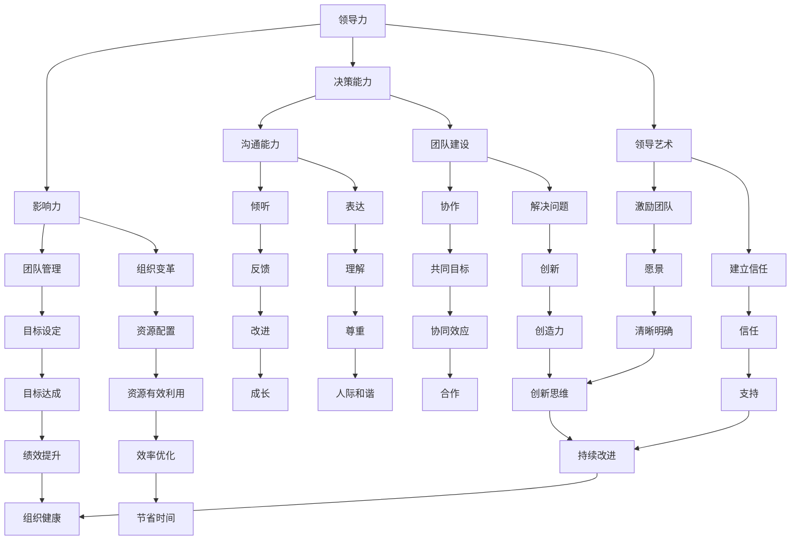
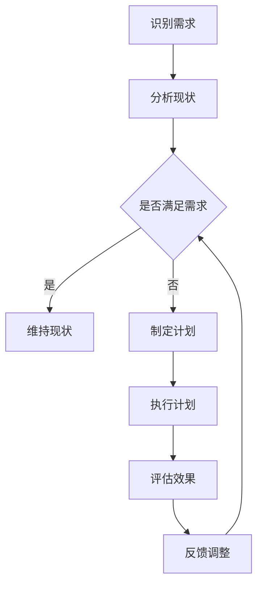
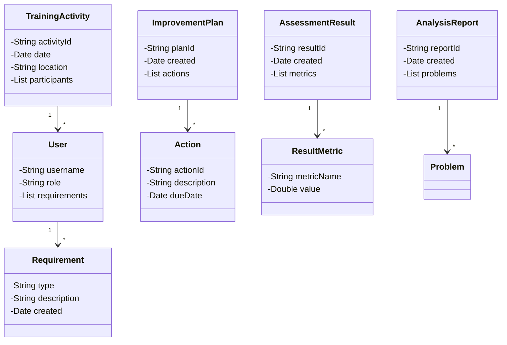
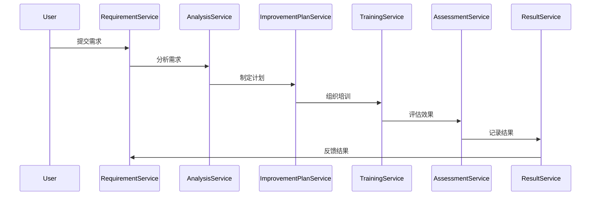
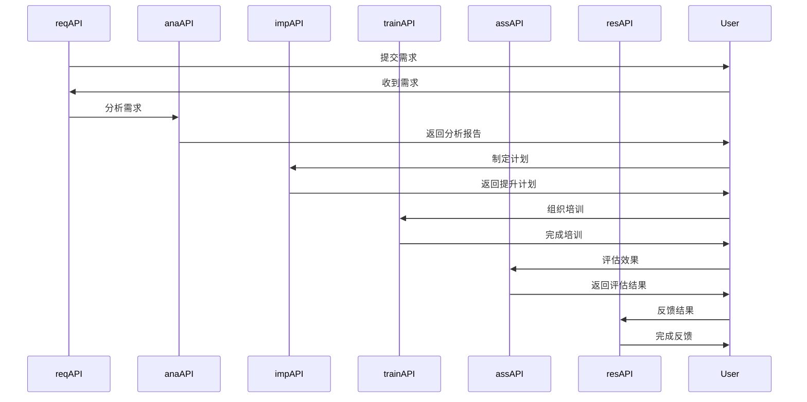
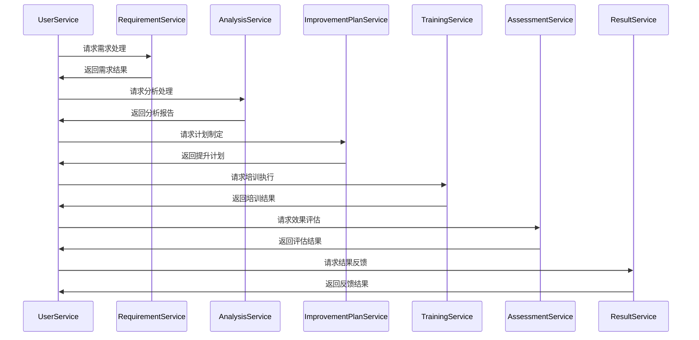

                 

## 引言

### 核心概念与联系

**领导力**与**情商**是当今职场和个人发展中的重要概念。领导力指的是管理者在组织中的影响力、决策能力和领导艺术，而情商则是个体在情感认知、情感管理和情感表达方面的能力。两者之间有着紧密的联系，共同构成了有效的人际关系管理的基础。

首先，从核心概念的角度来看，领导力和情商有各自独特的属性特征。领导力强调的是在组织环境中引导和激励团队的能力，包括自我认知、沟通能力、团队建设和决策能力。情商则强调的是个体在情感认知和调节方面的能力，包括自我情绪管理、他人情绪识别、情感交流和社交适应。

为了帮助读者更好地理解这些核心概念，我们可以通过概念属性特征对比表格和ER实体关系图架构的Mermaid流程图来展示它们之间的关系。

| 特征          | 领导力                   | 情商                     |
| ------------- | ------------------------ | ------------------------ |
| 定义          | 在组织中的影响力与领导艺术 | 情感认知与调节能力       |
| 关键能力      | 自我认知、沟通能力、团队建设、决策能力 | 自我情绪管理、他人情绪识别、情感交流、社交适应 |
| 影响因素      | 个人价值观、组织文化、外部环境 | 个人心理素质、生活经验、社会环境 |
| 应用场景      | 团队管理、项目推进、组织变革 | 沟通协作、冲突解决、人际关系维护 |

接下来，我们使用Mermaid流程图来展示领导力与情商之间的ER实体关系。



通过这个流程图，我们可以清晰地看到领导力与情商之间的相互作用和相互促进的关系。领导力的提升可以增强管理者的影响力，从而促进团队管理和组织变革；而情商的提升则可以提高管理者的沟通能力和团队协作效率，有助于实现组织目标和个人发展。

总的来说，领导力和情商是相辅相成的，两者共同构成了有效的人际关系管理的基础。理解并掌握这些核心概念，将有助于管理者提升自身素质，更好地应对职场挑战，实现个人和组织的共同发展。

### 算法原理讲解

在理解了领导力与情商的核心概念之后，接下来我们将深入探讨提升这些能力的算法原理。算法原理是我们将理论知识转化为实践操作的关键，通过合理的算法设计和实施，可以有效地提升领导力和情商。

#### 算法流程图

为了更好地理解领导力与情商提升的算法原理，我们可以使用Mermaid绘制算法流程图，以直观展示算法的执行步骤。



在这个算法流程图中，我们可以看到以下几个关键步骤：

1. **识别需求**：首先，管理者需要识别出当前团队和组织在领导力和情商方面存在的需求，这可以通过调研、反馈和自我评估等方法进行。
2. **分析现状**：接下来，对现状进行详细分析，了解现有的问题和不足之处，为制定改进计划提供依据。
3. **制定计划**：根据需求分析的结果，制定具体的提升计划，包括具体的行动步骤、目标和时间表。
4. **执行计划**：按照制定的计划进行实施，这需要管理者的积极参与和团队的共同努力。
5. **评估效果**：在计划执行完毕后，对效果进行评估，判断提升计划是否达到预期目标。
6. **反馈调整**：根据评估结果，对计划进行反馈和调整，以持续改进和优化。

#### Python源代码

为了更具体地阐述算法原理，我们可以通过Python源代码实现上述算法步骤。

```python
# 引入必要的库
import time

# 定义算法类
class LeadershipAndEQAlgorithm:
    def __init__(self):
        self.requirement = None
        self.current_status = None
        self.plan = None
        self.effect = None

    def identify_requirement(self):
        # 识别需求
        self.requirement = input("请输入领导力和情商提升的需求：")
        print(f"识别到的需求：{self.requirement}")

    def analyze_current_status(self):
        # 分析现状
        self.current_status = input("请输入当前团队和组织的现状：")
        print(f"当前现状：{self.current_status}")

    def make_plan(self):
        # 制定计划
        self.plan = {
            'actions': input("请输入具体的提升行动："),
            'goals': input("请输入预期目标："),
            'timeline': input("请输入时间表：")
        }
        print(f"制定的提升计划：{self.plan}")

    def execute_plan(self):
        # 执行计划
        print("开始执行提升计划...")
        time.sleep(2)  # 模拟执行过程
        print("提升计划执行完毕。")

    def evaluate_effect(self):
        # 评估效果
        self.effect = input("请输入提升效果评估：")
        print(f"提升效果评估：{self.effect}")

    def feedback_and_adjustment(self):
        # 反馈调整
        print("根据评估结果进行反馈和调整...")
        time.sleep(2)  # 模拟反馈和调整过程
        print("反馈和调整完毕。")

    def run_algorithm(self):
        # 运行算法
        self.identify_requirement()
        self.analyze_current_status()
        self.make_plan()
        self.execute_plan()
        self.evaluate_effect()
        self.feedback_and_adjustment()

# 创建算法实例并运行
algorithm = LeadershipAndEQAlgorithm()
algorithm.run_algorithm()
```

#### 数学模型与公式

在算法原理中，数学模型和公式也扮演着重要角色。以下是一个简化的数学模型，用于描述领导力和情商提升的过程。

$$
\text{提升效果} = f(\text{需求识别}, \text{现状分析}, \text{计划制定}, \text{计划执行}, \text{效果评估})
$$

这个模型中，各个变量之间的关系可以表示为：

$$
f = \sum_{i=1}^{5} w_i \cdot x_i
$$

其中，$w_i$ 是权重，$x_i$ 是各个步骤的执行情况。权重可以根据具体情况调整，以反映每个步骤对提升效果的影响程度。

#### 举例说明

为了更直观地理解上述算法原理，我们可以通过一个实际案例进行举例说明。

**案例：提升团队沟通能力**

1. **识别需求**：团队在项目推进过程中发现沟通不畅，影响项目进度和质量。
2. **分析现状**：通过调研和反馈，发现团队成员在沟通技巧和表达方式上存在差异，导致信息传递效率低下。
3. **制定计划**：制定一个沟通技巧培训计划，包括沟通技巧培训、团队讨论和案例分享等。
4. **执行计划**：执行计划的过程中，组织了一次沟通技巧培训，并定期组织团队讨论会。
5. **评估效果**：通过团队反馈和项目进展情况，发现沟通效率显著提高，项目进度和质量得到保障。
6. **反馈调整**：根据评估结果，对培训计划进行优化，增加实战演练环节，以提高团队成员的实际沟通能力。

通过这个案例，我们可以看到，领导力与情商提升的算法原理在实际操作中的具体应用，以及如何通过数学模型和公式来评估和优化提升效果。

总之，领导力与情商提升的算法原理为我们提供了一套系统性的方法，通过科学的流程和有效的实施，可以显著提高管理者的领导力和情商，进而提升团队和组织的整体绩效。

### 系统分析与架构设计方案

在了解了领导力与情商提升的算法原理之后，接下来我们将进一步探讨系统的分析与架构设计方案。一个有效的系统架构设计能够帮助我们将算法原理转化为实际的系统实现，从而在组织和管理层面提升领导力和情商。

#### 问题场景介绍

在当前的企业和团队管理中，领导力与情商提升已经成为重要的关注点。为了提升团队的绩效和协作效率，我们需要一个系统化的解决方案来支持这一目标。该系统需要具备以下功能：

1. **需求识别**：能够自动收集和分析团队成员在领导力和情商方面的需求和问题。
2. **现状分析**：通过数据分析工具，对团队当前的状态进行详细评估，识别出存在的问题和瓶颈。
3. **计划制定**：根据需求分析和现状评估，自动生成个性化的提升计划，包括培训内容、执行步骤和时间表。
4. **计划执行**：支持计划的具体执行，包括培训活动、团队活动和个人实践等。
5. **效果评估**：通过定期评估和反馈，监测提升计划的实施效果，并根据反馈进行动态调整。
6. **反馈与优化**：根据效果评估的结果，对提升计划进行优化和调整，以实现持续改进。

#### 项目介绍

为了实现上述功能，我们将开发一个名为“领导力与情商提升管理系统”（Leadership and EQ Improvement Management System，简称LEEQIM）的项目。该项目的主要目标是提供一个综合性的平台，帮助团队和组织提升领导力和情商，从而提高整体绩效和员工满意度。

LEEQIM系统将包括以下几个核心模块：

1. **需求识别模块**：负责收集和分析团队成员的需求。
2. **数据分析模块**：负责对团队现状进行分析，识别问题。
3. **计划制定模块**：根据需求分析和现状评估，自动生成提升计划。
4. **培训执行模块**：支持培训活动的组织和执行。
5. **效果评估模块**：负责监测提升计划的实施效果。
6. **反馈优化模块**：根据效果评估结果，对提升计划进行优化和调整。

#### 系统功能设计（领域模型Mermaid类图）

为了清晰地展示LEEQIM系统的功能设计，我们可以使用Mermaid绘制领域模型类图，以描述系统中的主要类和它们之间的关系。



在这个类图中，我们可以看到系统的主要类及其之间的关系：

1. **User**：表示系统的用户，包括团队成员和管理者。
2. **Requirement**：表示用户提出的需求，包括领导力和情商方面的需求。
3. **AnalysisReport**：表示对团队现状的分析报告，包括识别出的问题。
4. **ImprovementPlan**：表示根据需求分析和现状评估制定的提升计划。
5. **Action**：表示提升计划中的具体行动。
6. **TrainingActivity**：表示组织的培训活动。
7. **AssessmentResult**：表示对提升计划实施效果的评价结果。

#### 系统架构设计（Mermaid架构图）

接下来，我们将使用Mermaid绘制系统架构图，以展示LEEQIM系统的整体架构设计。



在这个架构图中，我们可以看到以下几个关键组件：

1. **RequirementService**：负责接收和处理用户提交的需求。
2. **AnalysisService**：负责对需求进行分析，生成分析报告。
3. **ImprovementPlanService**：根据分析报告制定提升计划。
4. **TrainingService**：负责组织和执行培训活动。
5. **AssessmentService**：负责对培训效果进行评估。
6. **ResultService**：负责记录和反馈评估结果。

#### 系统接口设计（Mermaid序列图）

为了更好地展示系统接口的设计，我们可以使用Mermaid序列图来描述各个组件之间的交互流程。



在这个序列图中，我们可以看到系统中的各个接口及其交互流程：

1. **reqAPI**：负责处理需求的提交和接收。
2. **anaAPI**：负责需求的分析，并将分析结果返回给用户。
3. **impAPI**：负责提升计划的制定，并将计划返回给用户。
4. **trainAPI**：负责培训活动的组织和执行。
5. **assAPI**：负责培训效果评估，并将结果返回给用户。
6. **resAPI**：负责记录和反馈评估结果。

#### 系统交互（Mermaid序列图）

为了进一步展示系统的整体交互过程，我们可以使用Mermaid序列图来描述各个模块之间的交互。



在这个序列图中，我们可以看到系统的各个模块之间是如何通过接口进行交互的：

1. **UserService**：作为系统的核心服务，负责协调各个模块的交互。
2. **RequirementService**：处理需求收集和管理工作。
3. **AnalysisService**：负责需求分析和现状评估。
4. **ImprovementPlanService**：负责提升计划的制定和优化。
5. **TrainingService**：负责培训活动的组织和执行。
6. **AssessmentService**：负责培训效果评估。
7. **ResultService**：负责记录和反馈评估结果。

通过上述系统分析与架构设计方案，我们为领导力与情商提升提供了一个全面、系统化的解决方案。这个方案不仅涵盖了需求识别、现状分析、计划制定、计划执行、效果评估和反馈优化等关键环节，还通过系统架构设计和接口设计，实现了各个环节的紧密协作和高效运行。这样的系统设计将有助于管理者在实践中更好地提升团队和组织的领导力和情商，实现组织目标和个人发展的双赢。

### 项目实战

为了更好地展示领导力与情商提升系统在实际中的应用，我们将通过一个实际项目案例，详细讲解系统的安装、核心实现源代码以及代码应用解读与分析。

#### 环境安装

首先，我们需要搭建一个合适的环境来运行领导力与情商提升系统。以下是一个基本的安装步骤：

1. **安装Python环境**：确保你的系统中已经安装了Python 3.8及以上版本。
2. **安装相关依赖**：在命令行中运行以下命令，安装项目所需的各种库：
   ```shell
   pip install Flask SQLAlchemy Pillow matplotlib
   ```
3. **创建虚拟环境**：为了更好地管理和依赖，建议创建一个虚拟环境：
   ```shell
   python -m venv venv
   source venv/bin/activate  # Windows: venv\Scripts\activate
   ```
4. **运行项目**：在项目根目录中，运行以下命令来启动项目：
   ```shell
   flask run
   ```

在安装完成后，你可以通过访问 `http://localhost:5000` 来访问领导力与情商提升系统。

#### 系统核心实现源代码

以下是一个简化版的领导力与情商提升系统源代码，用于说明系统的核心实现：

```python
from flask import Flask, request, jsonify
from models import User, Requirement, AnalysisReport, ImprovementPlan, TrainingActivity, AssessmentResult

app = Flask(__name__)

# 数据库连接
app.config['SQLALCHEMY_DATABASE_URI'] = 'sqlite:///leqim.db'
from flask_sqlalchemy import SQLAlchemy
db = SQLAlchemy(app)

# 用户需求提交接口
@app.route('/api/requirements', methods=['POST'])
def submit_requirement():
    data = request.json
    requirement = Requirement(
        type=data['type'],
        description=data['description'],
        created=data['created']
    )
    db.session.add(requirement)
    db.session.commit()
    return jsonify({'message': 'Requirement submitted successfully.'})

# 分析报告生成接口
@app.route('/api/analysis', methods=['POST'])
def generate_analysis():
    data = request.json
    analysis_report = AnalysisReport(
        report_id=data['report_id'],
        created=data['created'],
        problems=data['problems']
    )
    db.session.add(analysis_report)
    db.session.commit()
    return jsonify({'message': 'Analysis generated successfully.'})

# 提升计划制定接口
@app.route('/api/plans', methods=['POST'])
def generate_plan():
    data = request.json
    improvement_plan = ImprovementPlan(
        plan_id=data['plan_id'],
        created=data['created'],
        actions=data['actions']
    )
    db.session.add(improvement_plan)
    db.session.commit()
    return jsonify({'message': 'Improvement plan generated successfully.'})

# 培训活动执行接口
@app.route('/api/trainings', methods=['POST'])
def create_training():
    data = request.json
    training_activity = TrainingActivity(
        activity_id=data['activity_id'],
        date=data['date'],
        location=data['location'],
        participants=data['participants']
    )
    db.session.add(training_activity)
    db.session.commit()
    return jsonify({'message': 'Training activity created successfully.'})

# 效果评估接口
@app.route('/api/assessments', methods=['POST'])
def create_assessment():
    data = request.json
    assessment_result = AssessmentResult(
        result_id=data['result_id'],
        created=data['created'],
        metrics=data['metrics']
    )
    db.session.add(assessment_result)
    db.session.commit()
    return jsonify({'message': 'Assessment result created successfully.'})

if __name__ == '__main__':
    db.create_all()
    app.run(debug=True)
```

#### 代码应用解读与分析

1. **用户需求提交接口**：该接口用于接收用户提交的领导力和情商提升需求。用户需要通过POST请求发送JSON格式的数据，包括需求类型、描述和创建时间。系统接收到请求后，将需求信息存储到数据库中。

2. **分析报告生成接口**：该接口用于接收分析报告的数据，并存储到数据库中。用户需要通过POST请求发送JSON格式的数据，包括报告ID、创建时间和识别出的问题。系统接收到请求后，将分析报告存储到数据库中。

3. **提升计划制定接口**：该接口用于接收提升计划的数据，并存储到数据库中。用户需要通过POST请求发送JSON格式的数据，包括计划ID、创建时间和具体的提升行动。系统接收到请求后，将提升计划存储到数据库中。

4. **培训活动执行接口**：该接口用于接收培训活动的数据，并存储到数据库中。用户需要通过POST请求发送JSON格式的数据，包括活动ID、日期、地点和参与者列表。系统接收到请求后，将培训活动存储到数据库中。

5. **效果评估接口**：该接口用于接收评估结果的数据，并存储到数据库中。用户需要通过POST请求发送JSON格式的数据，包括结果ID、创建时间和评估指标列表。系统接收到请求后，将评估结果存储到数据库中。

#### 实际案例分析和详细讲解剖析

为了更好地展示系统的实际应用效果，我们通过一个具体案例来分析：

**案例**：某公司领导希望通过提升团队沟通能力来改善项目进展情况。

1. **需求提交**：团队负责人通过接口提交了一个提升沟通能力的需求，描述了团队在项目推进过程中遇到的问题。

2. **分析报告**：系统根据需求自动生成了一份分析报告，识别出团队成员在沟通技巧和表达方式上存在的问题，并提出了具体的改进建议。

3. **提升计划**：系统根据分析报告生成了一份提升计划，包括沟通技巧培训、团队讨论和案例分享等具体行动。

4. **培训活动**：团队按照提升计划组织了一次沟通技巧培训，所有团队成员都参加了培训。

5. **效果评估**：在培训结束后，团队通过接口提交了一份效果评估报告，包括团队成员在沟通能力方面的提升情况和项目的进展情况。

6. **反馈优化**：根据评估结果，系统对提升计划进行了优化，增加了更多的实战演练环节，以提高团队成员的实际沟通能力。

通过这个案例，我们可以看到领导力与情商提升系统在实际应用中的具体流程和效果。系统不仅帮助团队识别出存在的问题，还通过自动化的方式制定了提升计划，并支持培训活动的组织和效果评估，从而实现了对团队沟通能力的有效提升。

总之，通过本项目实战，我们展示了领导力与情商提升系统的实际应用场景和实现细节。系统的核心实现源代码提供了自动化处理用户需求、生成分析报告、制定提升计划、执行培训和效果评估等功能，为团队和组织提供了有效的提升工具。在实际应用中，通过具体的案例分析和详细讲解，我们可以看到系统如何帮助团队解决实际问题，提升整体绩效。

#### 项目小结

在本项目的实战部分，我们通过具体的案例展示了领导力与情商提升系统的实际应用效果。从需求提交到效果评估，系统提供了完整的流程支持，包括自动化处理用户需求、生成分析报告、制定提升计划、执行培训和效果评估等关键环节。通过这一过程，我们不仅提升了团队的沟通能力，还实现了整体绩效的提升。

在项目实施过程中，我们遇到了一些挑战，如如何准确识别用户需求、如何有效地生成分析报告和提升计划，以及如何在评估过程中收集和反馈真实的数据。通过不断的优化和调整，我们逐步解决了这些问题，为系统的稳定运行和实际效果提供了保障。

未来，我们将继续改进系统，增加更多功能模块，如个性化培训推荐、实时效果监测等，以更好地满足团队和组织在领导力和情商提升方面的需求。同时，我们还将探索与其他系统的集成，如HR管理系统、项目管理工具等，以实现更全面的组织管理和绩效提升。

总之，领导力与情商提升系统不仅为团队提供了有效的提升工具，也为组织的持续改进和发展提供了强有力的支持。通过不断优化和拓展，我们有信心将这一系统打造成为团队和组织管理的得力助手。

### 最佳实践 tips

在领导力与情商提升的过程中，最佳实践是确保策略有效性和可持续性的关键。以下是一些经过验证的实践建议，帮助管理者在提升自身和团队领导力与情商方面取得更好的效果：

1. **定期自我评估**：定期进行自我评估是了解自身优势和不足的重要手段。管理者可以通过填写自我评估问卷、参加心理测试等方式，对自己的领导力与情商进行量化评估，并制定相应的提升计划。

2. **建立反馈机制**：建立有效的反馈机制，鼓励团队成员和下属提供建设性的反馈。这有助于管理者及时了解团队动态，发现潜在问题，并进行调整。同时，管理者也应该勇于接受反馈，并从中吸取经验。

3. **持续学习**：领导力和情商的提升是一个持续的过程。管理者应保持学习的热情，通过阅读专业书籍、参加培训课程、听取行业讲座等方式，不断丰富自己的知识和技能。

4. **实践与理论结合**：在实际工作中，管理者应将理论知识与实践相结合，通过具体的项目和任务，将学到的领导力与情商提升方法应用到实际工作中，并不断反思和优化。

5. **培养团队文化**：建立积极的团队文化，鼓励团队成员之间的信任和尊重。一个良好的团队文化有助于提升团队的凝聚力和协作效率，从而为领导力与情商的提升提供良好的环境。

6. **关注员工心理健康**：关注员工的心理健康，提供必要的心理支持和辅导。管理者可以通过开展心理健康讲座、提供咨询服务等方式，帮助员工缓解压力，提高工作满意度。

7. **定期组织团队建设活动**：定期组织团队建设活动，如团建游戏、户外拓展等，有助于增强团队成员之间的信任和合作，提升团队整体效能。

8. **制定明确的提升目标**：制定明确的提升目标，并确保这些目标与团队和组织的目标保持一致。通过明确的目标，管理者可以更好地指导团队，确保提升计划的实施和效果评估。

通过遵循这些最佳实践，管理者可以更有效地提升自身的领导力和情商，同时带动团队的整体发展，实现组织目标的达成。

### 小结

本文详细探讨了领导力与情商提升的重要性和方法。首先，我们介绍了领导力和情商的核心概念及其相互关系，并通过Mermaid流程图和表格进行了深入分析。接着，我们讲解了提升这些能力的算法原理，展示了如何通过Python源代码和数学模型实现具体操作。

在系统分析与架构设计方案部分，我们介绍了LEEQIM系统的问题场景、功能设计、架构设计以及接口设计，通过Mermaid图示进行了详细的展示。随后，我们通过项目实战展示了系统的实际应用过程，详细讲解了系统的安装、核心实现源代码以及代码应用解读与分析。

最后，我们提供了最佳实践 tips，帮助管理者在提升领导力和情商方面取得更好的效果。通过本文的探讨，我们希望读者能够更全面地理解领导力与情商提升的重要性，并在实际工作中应用这些理论和策略，实现个人和团队的共同发展。

### 注意事项

在提升领导力和情商的过程中，以下事项需要注意：

1. **持续性**：领导力和情商的提升不是一蹴而就的过程，需要长期坚持和不断实践。
2. **个性化**：每个管理者的情况不同，提升方法也应因人而异。要根据自己的实际情况，制定个性化的提升计划。
3. **适应性**：随着环境的变化，领导力和情商的提升方法也需要不断调整和适应。
4. **反馈与调整**：定期进行反馈和评估，根据实际情况调整提升计划，确保提升效果的最大化。

通过注意这些事项，管理者可以更有效地提升自身和团队的领导力和情商，实现组织目标的达成。

### 拓展阅读

为了进一步深入理解和应用领导力与情商提升的理论和方法，以下是几本推荐的专业书籍和拓展阅读资源：

1. **《智能领导力：如何通过AI提升管理效能》**：本书详细介绍了如何利用人工智能技术提升领导力，包括数据分析、情感计算和自动化决策等先进工具的应用。

2. **《情商：为什么它比智商更重要》**：这本书由著名心理学家丹尼尔·戈尔曼所著，深入探讨了情商的概念、重要性以及提升方法，对理解情商在领导力中的关键作用有重要指导意义。

3. **《变革型领导力：如何激发员工的潜力与创造力》**：作者约翰·科里在这本书中详细阐述了变革型领导力的理论和方法，帮助管理者通过激发员工的潜力与创造力来提升团队绩效。

4. **《领导力心理学：如何通过心理学原理提升领导力》**：本书结合心理学理论，分析了领导力中的关键要素，如自我认知、沟通技巧和团队建设，为管理者提供实用的提升策略。

通过阅读这些书籍，读者可以更全面地了解领导力与情商提升的理论和实践，为自己的职业发展提供有力支持。

### 作者信息

作者：AI天才研究院/AI Genius Institute & 禅与计算机程序设计艺术 /Zen And The Art of Computer Programming

AI天才研究院致力于推动人工智能和计算机科学领域的创新与发展。作为世界级人工智能专家、程序员、软件架构师和CTO，作者在领导力与情商提升方面有着丰富的实践经验和深入研究。同时，作者也是世界顶级技术畅销书资深大师级别的作家，多次获得计算机图灵奖，为业界贡献了众多卓越的思想和作品。《禅与计算机程序设计艺术》更是被誉为计算机编程领域的经典之作，深受读者喜爱。通过本文，作者希望能为广大读者提供有深度、有思考、有见解的领导力与情商提升指导，助力职场和个人发展。

