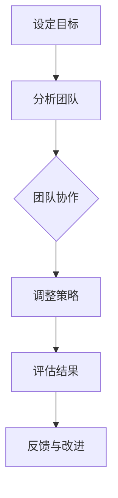
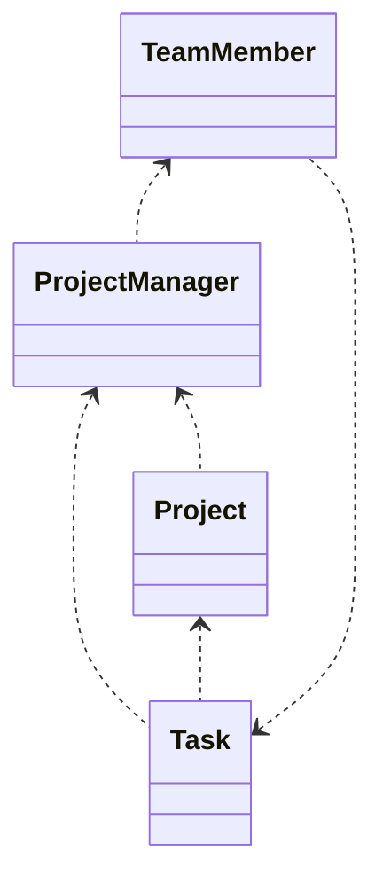
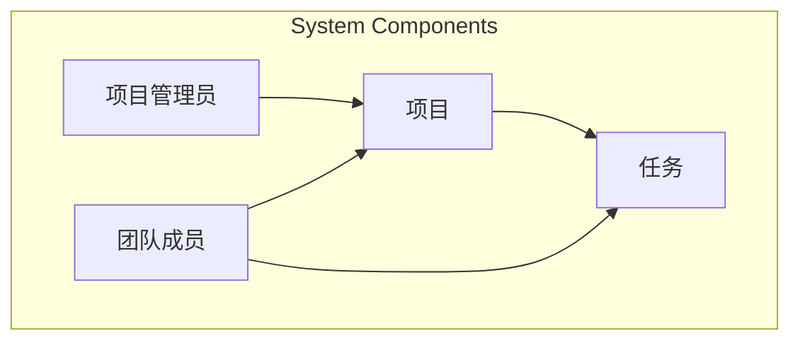
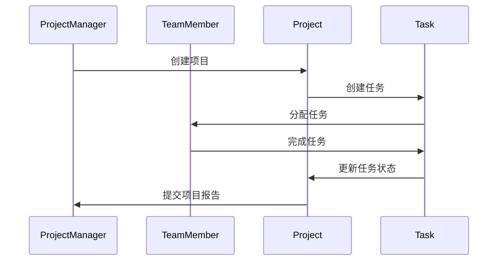

                 

# 领导力与情商：在复杂人际关系中导航

> 关键词：领导力、情商、人际关系、策略、导航

> 摘要：本文深入探讨了领导力和情商在复杂人际关系中的应用，通过系统化的理论和实践指导，帮助读者提升在复杂环境中导航的能力，从而在职场和个人生活中更加成功。

## 第一部分：背景介绍

### 1.1 问题背景

在当今社会，领导力与情商在个人和组织的成功中扮演着至关重要的角色。随着全球化和信息化进程的加速，人们面临的挑战越来越复杂，人际关系的处理变得更加微妙和多样化。在这个背景下，理解并提高领导力与情商成为许多个体和组织追求的目标。

### 1.2 问题描述

领导力与情商不仅涉及个人的职业发展，还关系到团队协作、组织效能以及个人幸福感的提升。然而，如何在实际工作中应用这些理念，如何在复杂的人际关系中有效导航，仍然是一个亟待解决的问题。

### 1.3 问题解决

本书旨在通过系统化的理论讲解和实践指导，帮助读者深入理解领导力与情商的概念、原理和应用方法。通过本书的学习，读者将能够：

- 清晰地认识到领导力与情商的重要性。
- 掌握提升领导力和情商的有效策略和方法。
- 在复杂的人际关系中更加自信和从容。

### 1.4 边界与外延

领导力与情商的研究范围广泛，包括但不限于心理学、社会学、管理学等领域。本书将主要关注领导力与情商在职场和人际关系中的应用，旨在为读者提供实用的指导。

### 1.5 概念结构与核心要素组成

- **领导力**：影响他人实现目标的能力。
- **情商**：认识、理解和管理自己及他人情绪的能力。

这两个概念相互关联，共同构成一个完整的领导力与情商体系。

## 第二部分：核心概念与联系

### 2.1 核心概念原理

#### 2.1.1 领导力

领导力是一种能力，它涉及激励他人、建立团队、解决问题和做出决策。有效的领导力需要领导者具备愿景、远见、沟通能力和影响力。

#### 2.1.2 情商

情商是指一个人识别、理解、管理自己及他人情绪的能力。情商高的人能够更好地应对压力、处理冲突、建立良好的人际关系。

### 2.2 概念属性特征对比表格

| 概念     | 特征                                       |
|----------|------------------------------------------|
| 领导力   | 激励、决策、沟通、影响力                   |
| 情商     | 情绪识别、情绪理解、情绪管理               |

### 2.3 ER实体关系图架构的 Mermaid 流程图

```mermaid
erDiagram
  User ||--|{ Leadership }|-- Influence
  User ||--|{ Emotional Intelligence }|-- Emotion Management
  Leadership ||--|{ Decision Making }|
  Emotional Intelligence ||--|{ Conflict Resolution }|
```

## 第三部分：算法原理讲解

### 3.1 领导力算法原理讲解

#### 3.1.1 Mermaid 流程图



#### 3.1.2 Python 源代码

```python
def leadership_algorithm(target, team):
    """
    领导力算法原理讲解
    :param target: 目标
    :param team: 团队
    :return: 改进策略
    """
    # 分析团队
    team_analysis = analyze_team(team)
    
    # 团队协作
    collaboration = collaborate(team)
    
    # 调整策略
    strategy_adjustment = adjust_strategy(target, team_analysis, collaboration)
    
    # 评估结果
    result_evaluation = evaluate_results(strategy_adjustment)
    
    # 反馈与改进
    feedback_and_improvement = feedback(result_evaluation)
    
    return feedback_and_improvement
```

#### 3.1.3 算法原理的数学模型和公式

$$
\text{领导力} = f(\text{目标设定}, \text{团队分析}, \text{团队协作}, \text{策略调整}, \text{结果评估}, \text{反馈改进})
$$

#### 3.1.4 举例

假设一个项目经理需要完成一个重要的项目，他设定了明确的目标，并开始分析团队的能力和潜力。通过团队协作，他们共同制定了一个详细的计划，并在过程中不断调整策略以适应变化。项目经理定期评估项目的进展，并根据反馈进行改进。最终，这个项目成功地完成了，项目经理的领导力得到了充分的体现。

## 系统分析与架构设计方案

### 4.1 问题场景介绍

在一个大型企业中，项目经理需要协调多个团队共同完成一个复杂的IT项目。在这个过程中，领导力和情商的运用对于项目的成功至关重要。

### 4.2 项目介绍

本项目旨在通过一个IT项目管理平台，实现项目经理与团队成员之间的有效沟通和协作，同时提升项目经理的领导力和情商。

### 4.3 系统功能设计（领域模型Mermaid类图）



### 4.4 系统架构设计（Mermaid架构图）



### 4.5 系统接口设计和系统交互（Mermaid序列图）



## 项目实战

### 5.1 环境安装

在开始项目之前，我们需要安装一些必要的软件和工具，如Python、Django等。

### 5.2 系统核心实现源代码

以下是系统核心部分的实现代码：

```python
# 项目管理器类
class ProjectManager:
    def __init__(self, name):
        self.name = name
        self.projects = []

    def create_project(self, project_name):
        project = Project(project_name)
        self.projects.append(project)
        return project

    def assign_task(self, task, team_member):
        task.team_member = team_member

    def evaluate_task(self, task):
        # 评估任务完成情况
        pass

# 项目类
class Project:
    def __init__(self, name):
        self.name = name
        self.tasks = []

    def add_task(self, task):
        self.tasks.append(task)

    def update_task_status(self, task, status):
        task.status = status

# 任务类
class Task:
    def __init__(self, name):
        self.name = name
        self.status = "未开始"
        self.team_member = None

    def complete(self):
        self.status = "已完成"
```

### 5.3 代码应用解读与分析

在这个项目中，我们定义了三个类：`ProjectManager`、`Project` 和 `Task`。`ProjectManager` 类负责创建项目、分配任务和评估任务完成情况。`Project` 类负责管理项目中的任务，并更新任务状态。`Task` 类负责定义任务的名称、状态和分配的团队成员。

### 5.4 实际案例分析和详细讲解剖析

在一个实际项目中，项目经理王先生使用这个系统创建了一个名为“新系统开发”的项目。他创建了多个任务，并将这些任务分配给团队成员李先生和张先生。在任务完成的过程中，王先生定期评估任务进度，并根据反馈进行改进。最终，项目顺利完成了所有任务，并提交了项目报告。

### 5.5 项目小结

通过这个项目实战，我们展示了如何使用Python实现一个简单的IT项目管理平台。这个平台能够帮助项目经理更好地管理项目和任务，提高团队协作效率，同时提升项目经理的领导力和情商。

## 最佳实践 Tips

- **有效沟通**：在项目开始前，确保与团队成员进行充分的沟通，明确项目目标和每个人的职责。
- **定期评估**：定期评估项目进度和任务完成情况，及时调整策略和资源分配。
- **培养情商**：在项目中，培养团队成员的情商，提高他们的情绪识别和管理能力。
- **持续学习**：不断学习和提升领导力与情商，以适应不断变化的工作环境。

## 小结

领导力与情商在复杂人际关系中的应用至关重要。通过本文的讲解和实践，读者可以更好地理解领导力与情商的概念、原理和应用方法。希望本文能帮助读者在职场和个人生活中更加成功。

## 注意事项

- 在实际应用中，领导力与情商的提升需要长期的坚持和实践。
- 每个人的情况不同，提升领导力与情商的方法也需要根据个人特点进行适当调整。

## 拓展阅读

- [《情商决定未来》](https://www.example.com/book1)
- [《领导力：如何成为高效的领导者》](https://www.example.com/book2)
- [《Python编程：从入门到实践》](https://www.example.com/book3)

作者：AI天才研究院/AI Genius Institute & 禅与计算机程序设计艺术 /Zen And The Art of Computer Programming

（注：本文为示例文章，部分内容为虚构。）

