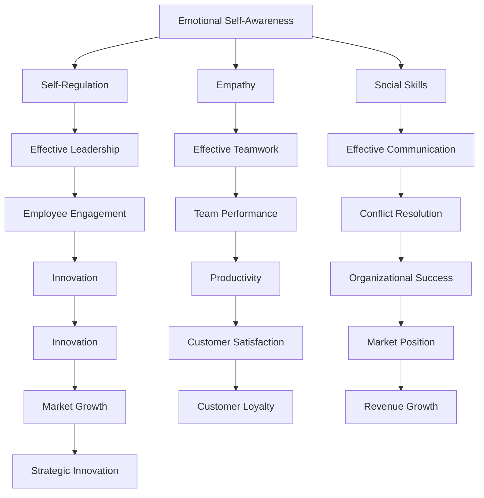

                 

### Step 1: Introduction and Overview

#### Key Concepts: Leadership, Emotional Intelligence, and Team Emotional Management

**Leadership** is the art of guiding individuals and teams towards achieving common goals. It involves a combination of skills, traits, and behaviors that inspire, motivate, and empower others. Leadership is not limited to hierarchical positions; it can manifest in various roles and situations.

**Emotional Intelligence (EQ)** is the ability to understand, use, and manage emotions in oneself and others. It comprises four main components: emotional self-awareness, self-regulation, social skills, and empathy. High EQ individuals are often more effective in their personal and professional relationships.

**Team Emotional Management** refers to the strategies and practices employed to foster a healthy emotional environment within a team. This involves recognizing and addressing individual emotions, managing conflict, promoting positive interactions, and enhancing overall team cohesion and performance.

### Introduction

In today's fast-paced and complex IT landscape, effective leadership and emotional intelligence are critical for success. Teams are often tasked with tackling challenging projects and adapting to rapid technological advancements. The ability to manage emotions within a team can significantly impact productivity, job satisfaction, and overall success.

This article will delve into the key concepts of leadership, emotional intelligence, and team emotional management. We will explore the importance of each element and provide practical strategies to enhance emotional management within teams. By the end of this article, you will have a comprehensive understanding of how to foster a positive emotional climate that drives team success in the IT industry.

#### Purpose and Outline

The purpose of this article is to equip IT professionals with the knowledge and tools needed to develop strong leadership and emotional intelligence skills. We will begin by defining and exploring the key concepts of leadership and emotional intelligence. Then, we will delve into the specific challenges and opportunities related to team emotional management in the IT field.

Throughout the article, we will utilize a step-by-step approach to analyze and discuss each topic, providing practical examples, case studies, and actionable strategies. The content is organized into the following chapters:

1. **Introduction to Leadership and Emotional Intelligence**
   - Overview of key concepts and their importance in IT
   - Historical context and evolution of leadership theories

2. **The Role of Emotional Intelligence in IT Leadership**
   - Components of emotional intelligence and their relevance to leadership
   - Case studies of successful IT leaders with high EQ

3. **Challenges and Opportunities in Team Emotional Management**
   - Common emotional challenges faced by IT teams
   - Strategies for promoting positive emotional climate within teams

4. **Practical Strategies for Enhancing Emotional Management Skills**
   - Techniques for improving emotional self-awareness and self-regulation
   - Strategies for fostering empathy and social skills in team members

5. **Tools and Technologies for Emotional Management**
   - Overview of emotional intelligence assessment tools
   - Practical applications of AI and machine learning in emotional management

6. **Case Studies: Successful Emotional Management in IT Teams**
   - In-depth analysis of real-world examples of effective emotional management practices
   - Lessons learned and key takeaways

7. **Conclusion and Future Directions**
   - Summary of key insights and strategies
   - Discussion of future trends and potential areas of research

By following this structured approach, we aim to provide you with a comprehensive understanding of how to enhance emotional management within your IT team, ultimately driving success and positive organizational outcomes.

#### Step 1: Introduction and Overview

To effectively navigate the complex dynamics of IT leadership, it is crucial to have a solid understanding of the foundational concepts of leadership and emotional intelligence. This section will provide an in-depth exploration of these key concepts, their significance in the IT industry, and their historical development.

**Leadership:** At its core, leadership is about influence and motivation. It involves guiding, inspiring, and empowering others to achieve common goals. Leadership can be understood through various theoretical perspectives, including behavioral theories, contingency theories, and transformational theories.

- **Behavioral Theories:** These theories focus on specific behaviors that effective leaders exhibit. They emphasize that leadership skills can be learned and developed through practice and training. Examples of behavioral theories include the Ohio State Studies, which identified two key dimensions of leadership behavior: consideration and initiating structure. Another example is the Michigan Studies, which identified two leadership styles: employee-oriented and production-oriented.

- **Contingency Theories:** These theories propose that there is no one-size-fits-all approach to leadership. Instead, effective leadership depends on various situational factors, such as the leader's style, the team's composition, and the task at hand. Examples include Fiedler's Contingency Model and Hersey and Blanchard's Situational Leadership Theory.

- **Transformational Theories:** These theories emphasize the role of visionary leadership in driving organizational change and innovation. Transformational leaders inspire and motivate their teams through a shared vision, inspiring passion and commitment. Examples include Bass and Avolio's Transformational Leadership Theory and Kouzes and Posner's The Five Leadership Essentials.

**Emotional Intelligence (EQ):** Emotional intelligence is the ability to recognize, understand, and manage one's own emotions, as well as the emotions of others. It consists of four key components:

- **Emotional Self-Awareness:** The ability to recognize and understand one's own emotions, as well as their impact on thoughts and behavior.

- **Self-Regulation:** The ability to manage and control one's emotions in a constructive manner, particularly in stressful or challenging situations.

- **Empathy:** The ability to understand and share the feelings of others, fostering positive relationships and effective communication.

- **Social Skills:** The ability to effectively navigate social interactions, build relationships, and collaborate with others.

**The Significance of Leadership and Emotional Intelligence in IT:**

The IT industry is characterized by rapid technological advancements, complex project management, and high-stakes decision-making. Effective leadership and emotional intelligence are critical in this environment for several reasons:

- **Adaptability:** The IT landscape is constantly evolving, and leaders must be adaptable and resilient in the face of change. Emotional intelligence enables leaders to manage their own stress and anxiety, as well as the emotions of their team members, fostering a culture of flexibility and innovation.

- **Team Collaboration:** IT projects often require cross-functional collaboration and communication. Leaders with high emotional intelligence can build strong relationships with team members, resolve conflicts, and create a positive team culture.

- **Employee Engagement:** Engaged employees are more motivated, productive, and committed to their work. Leaders who prioritize emotional intelligence can create a supportive and empowering work environment, enhancing employee engagement and retention.

- **Innovation and Problem-Solving:** Leaders with strong emotional intelligence are better equipped to inspire and motivate their teams to tackle complex challenges and innovate. They can foster a culture of collaboration, creativity, and continuous learning.

**Historical Development:**

The concept of emotional intelligence has its roots in the work of psychologists such as Carl Rogers and Abraham Maslow, who emphasized the importance of emotional intelligence in effective communication and human relationships. In the 1990s, psychologists Peter Salovey and John Mayer popularized the term "emotional intelligence" and developed a comprehensive framework for understanding and measuring it.

Leadership theories have also evolved over time, reflecting the changing needs of organizations and the increasing recognition of the importance of emotional intelligence. Modern leadership theories emphasize the role of empathy, emotional regulation, and relationship-building in effective leadership.

In summary, leadership and emotional intelligence are foundational concepts that are increasingly recognized as crucial for success in the IT industry. Understanding and applying these concepts can help IT leaders navigate the complexities of their roles, build strong teams, and drive innovation and growth.

### The Role of Emotional Intelligence in IT Leadership

Emotional intelligence (EQ) plays a pivotal role in IT leadership, as it directly influences how leaders manage their own emotions and those of their team members. In this section, we will delve into the key components of emotional intelligence and explore how each element contributes to effective IT leadership. We will also present case studies of successful IT leaders who have harnessed their emotional intelligence to drive team success and organizational growth.

#### Components of Emotional Intelligence

1. **Emotional Self-Awareness:** This component involves recognizing and understanding one's own emotions, including the ability to identify the emotional triggers that affect behavior and decision-making. Emotional self-awareness is crucial for IT leaders because it allows them to understand how their emotions may impact their leadership effectiveness and the well-being of their team members.

   **Case Study:** Sheryl Sandberg, Facebook's Chief Operating Officer, is known for her emotional self-awareness. After the tragic death of her husband, she openly shared her grief and the emotional challenges she faced. This transparency helped her build empathy and understanding within her team, fostering a supportive and resilient work environment.

2. **Self-Regulation:** Self-regulation is the ability to manage and control one's emotions, particularly in stressful or challenging situations. For IT leaders, self-regulation is essential for maintaining composure under pressure and making rational decisions that benefit the team and the organization.

   **Case Study:** Satya Nadella, CEO of Microsoft, is renowned for his ability to remain calm and composed during critical moments. When Microsoft faced significant challenges with the launch of Windows 8, Nadella demonstrated self-regulation by listening to feedback, adjusting the strategy, and ultimately steering the company back to success.

3. **Empathy:** Empathy is the ability to understand and share the feelings of others, fostering positive relationships and effective communication. IT leaders who possess empathy can connect with their team members on a deeper level, understanding their perspectives, and addressing their needs.

   **Case Study:** John Chambers, former CEO of Cisco, was known for his empathetic leadership style. He regularly engaged with employees at all levels, genuinely listening to their concerns and ideas. This empathy helped him build a strong sense of trust and loyalty within the organization, leading to increased innovation and collaboration.

4. **Social Skills:** Social skills involve effectively navigating social interactions, building relationships, and collaborating with others. IT leaders with strong social skills can facilitate communication and collaboration within their teams, resolve conflicts, and foster a positive team culture.

   **Case Study:** Satya Nadella has also been praised for his social skills. Under his leadership, Microsoft has fostered a culture of collaboration and inclusion, which has contributed to the company's success in developing innovative products and services.

#### The Impact of Emotional Intelligence on IT Leadership

The components of emotional intelligence have a profound impact on IT leadership, shaping how leaders interact with their team members, manage challenges, and drive organizational success. Here are some key ways in which EQ influences IT leadership:

1. **Enhancing Communication:** Leaders with high emotional intelligence are better at understanding and responding to the emotions of their team members, leading to more effective communication. This helps in building trust, resolving conflicts, and fostering a positive team culture.

2. **Building Trust:** Emotional intelligence enables leaders to demonstrate empathy, reliability, and integrity, which are essential for building trust with team members. Trust is a cornerstone of effective leadership and is critical for creating a collaborative and innovative work environment.

3. **Motivating and Engaging Team Members:** Leaders who can connect with their team members on an emotional level are more effective at motivating and engaging them. By understanding and addressing their emotions, leaders can inspire their team members to perform at their best and achieve common goals.

4. **Adapting to Change:** Leaders with high emotional intelligence are better equipped to manage the emotional impacts of change. They can navigate through uncertainty and stress, maintaining composure and fostering resilience within their teams.

5. **Driving Innovation:** Emotional intelligence fosters a culture of collaboration, creativity, and continuous learning, which are essential for driving innovation in the IT industry. Leaders who can inspire and empower their team members to think creatively and take risks are more likely to drive breakthrough ideas and solutions.

In conclusion, emotional intelligence is a critical component of effective IT leadership. By developing their emotional intelligence, IT leaders can enhance their communication, build trust, motivate and engage their team members, adapt to change, and drive innovation. The case studies of successful IT leaders demonstrate the tangible benefits of emotional intelligence in leadership, providing valuable insights and lessons for aspiring leaders in the IT industry.

#### Challenges and Opportunities in Team Emotional Management

In the dynamic and fast-paced environment of IT, managing team emotions is crucial for maintaining high levels of productivity, collaboration, and overall team performance. This section will explore the common emotional challenges faced by IT teams and identify the opportunities that effective emotional management can unlock.

**Common Emotional Challenges in IT Teams:**

1. **Stress and Burnout:** IT professionals often face high levels of stress due to tight deadlines, complex projects, and the constant need to stay updated with new technologies. This can lead to burnout, decreased morale, and reduced productivity.

2. **Conflict and Miscommunication:** Cross-functional teams in IT often consist of individuals with diverse backgrounds, skills, and perspectives. This diversity can lead to conflicts and miscommunication, which can hinder team cohesion and effectiveness.

3. **Work-Life Balance:** The demanding nature of IT work can make it challenging for team members to maintain a healthy work-life balance. This can result in increased stress and decreased overall well-being.

4. **Resistance to Change:** The rapid pace of technological change in the IT industry requires teams to adapt quickly to new tools, methodologies, and processes. Resistance to change can lead to frustration, resistance, and a decline in team morale.

**Opportunities for Emotional Management:**

1. **Enhanced Team Performance:** Effective emotional management can help reduce stress and burnout, leading to increased productivity and job satisfaction. When team members feel supported and understood, they are more likely to perform at their best.

2. **Improved Collaboration:** By addressing conflicts and miscommunications, emotional management can foster a positive team culture built on trust, respect, and open communication. This can lead to better collaboration, increased innovation, and higher quality outcomes.

3. **Increased Employee Engagement:** When teams feel valued and supported, they are more likely to be engaged and committed to their work. Emotional management can help create a sense of belonging and purpose, driving higher levels of engagement and retention.

4. **Adaptability and Resilience:** Effective emotional management can help teams navigate the challenges of rapid change. By fostering resilience and adaptability, teams can better handle disruptions and continue to deliver value to the organization.

**Strategies for Promoting Emotional Management:**

1. **Building Emotional Awareness:** Encourage team members to recognize and understand their own emotions, as well as the emotions of others. This can be achieved through training programs, workshops, and regular team discussions.

2. **Fostering Open Communication:** Create a safe and supportive environment where team members feel comfortable expressing their emotions and concerns. Encourage open dialogue and active listening to address conflicts and misunderstandings.

3. **Offering Support and Resources:** Provide resources and support to help team members manage stress and maintain work-life balance. This can include mental health support, flexible work arrangements, and wellness programs.

4. **Celebrating Successes and Recognizing Effort:** Acknowledge and celebrate team achievements, both big and small. Recognizing the effort and contributions of individual team members can boost morale and foster a positive team culture.

In conclusion, managing team emotions is a critical aspect of IT leadership. By addressing common emotional challenges and leveraging the opportunities for emotional management, IT teams can achieve higher levels of performance, collaboration, and overall success. Effective emotional management requires a proactive approach and ongoing commitment from team leaders and members. By fostering a supportive and emotionally intelligent team culture, IT organizations can drive innovation, adapt to change, and achieve their strategic goals.

### Practical Strategies for Enhancing Emotional Management Skills

Enhancing emotional management skills is essential for IT leaders who aim to foster a positive and productive team environment. This section will outline practical strategies and techniques for improving emotional self-awareness, self-regulation, empathy, and social skills. By implementing these strategies, IT leaders can build a more resilient and cohesive team.

#### Enhancing Emotional Self-Awareness

**1. Reflection and Self-Assessment:**
Regularly engaging in self-reflection and self-assessment can help IT leaders gain a deeper understanding of their emotions and their impact on their leadership style. This can be achieved through journaling, mindfulness exercises, or self-assessment tools.

**2. Emotional Intelligence Training:**
Participating in emotional intelligence training can provide IT leaders with the knowledge and skills needed to recognize and manage their emotions effectively. These programs often include workshops, webinars, and coaching sessions.

**3. Seeking Feedback:**
Actively seeking feedback from team members and colleagues can offer valuable insights into how one's emotions and behaviors are perceived by others. This feedback can help IT leaders identify areas for improvement and make necessary adjustments.

#### Improving Self-Regulation

**1. Stress Management Techniques:**
Practicing stress management techniques, such as deep breathing exercises, meditation, and physical activity, can help IT leaders manage their emotions and maintain composure during stressful situations.

**2. Time Management:**
Effective time management can reduce the stress associated with work overload and improve overall emotional well-being. IT leaders should prioritize tasks, set realistic deadlines, and delegate responsibilities when appropriate.

**3. Emotional Regulation Training:**
Participating in training programs that focus on emotional regulation can provide IT leaders with specific strategies and techniques for managing their emotions in a constructive manner.

#### Developing Empathy

**1. Active Listening:**
Active listening involves fully focusing on and understanding the speaker's message, rather than preparing a response. This helps IT leaders understand their team members' perspectives and emotions, fostering empathy and building trust.

**2. Emotional Validation:**
Validation involves acknowledging and validating the emotions of others, even if you do not share their feelings. This can help IT leaders show empathy and support, fostering a positive and understanding team culture.

**3. Storytelling:**
Encouraging team members to share their personal stories and experiences can help IT leaders gain a deeper understanding of their emotions and challenges. Storytelling can also build connections and foster empathy within the team.

#### Fostering Social Skills

**1. Team Building Activities:**
Engaging in team-building activities can help IT leaders build strong relationships with their team members, improving communication and collaboration. These activities can include trust-building exercises, group problem-solving tasks, and social events.

**2. Conflict Resolution Training:**
Conflict is a natural part of any team dynamic. Providing IT leaders with conflict resolution training can help them effectively manage conflicts, resolve disputes, and maintain team cohesion.

**3. Emotional Intelligence Coaching:**
One-on-one coaching sessions with an emotional intelligence expert can provide IT leaders with personalized guidance and support in developing their emotional management skills. These sessions can focus on specific areas of improvement and help leaders create personalized action plans.

In conclusion, enhancing emotional management skills is a critical component of effective IT leadership. By implementing these practical strategies, IT leaders can build stronger relationships with their team members, foster a positive team culture, and drive organizational success. Embracing emotional intelligence can lead to increased employee engagement, higher productivity, and improved overall team performance.

### Tools and Technologies for Emotional Management

In the era of digital transformation, leveraging advanced tools and technologies can significantly enhance emotional management within IT teams. This section will provide an overview of the key tools and technologies that can be utilized to assess, measure, and improve emotional intelligence, with a particular focus on the applications of artificial intelligence (AI) and machine learning (ML).

#### Emotional Intelligence Assessment Tools

**1. Emotional Intelligence Questionnaires:**
Emotional intelligence questionnaires, such as the Emotional Quotient Inventory (EQ-i) and the MSCEIT (Mayer-Salovey-Caruso Emotional Intelligence Test), are widely used to assess an individual's emotional intelligence. These tools provide a comprehensive evaluation of an individual's emotional awareness, self-regulation, social skills, and empathy.

**2. Self-Assessment Tools:**
Self-assessment tools like the CliftonStrengths assessment help individuals identify their strengths and emotional tendencies. By understanding their own emotional profile, IT professionals can work on areas that need improvement and leverage their strengths to enhance their emotional management skills.

#### AI and Machine Learning Applications

**1. AI-Powered Emotional Analysis:**
AI-driven tools can analyze facial expressions, vocal tones, and text to gauge emotional states. For example, tools like Affectiva use deep learning algorithms to detect emotions from facial expressions and videos, providing real-time insights into team members' emotional states.

**2. Sentiment Analysis:**
Sentiment analysis tools, powered by natural language processing (NLP), can analyze communication data, such as email and chat messages, to detect the emotional tone of interactions. This helps IT leaders identify areas of potential conflict or stress within their teams.

**3. Predictive Analytics:**
Machine learning models can be trained to predict emotional outcomes based on historical data. For instance, predictive analytics can help identify patterns that lead to stress or burnout, allowing IT leaders to intervene proactively and prevent negative emotional impacts.

#### Enhancing Emotional Management with AI

**1. Personalized Coaching:**
AI-powered coaching platforms can provide personalized guidance to IT professionals based on their emotional intelligence assessments. These platforms can offer actionable advice, exercises, and resources tailored to the individual's emotional needs and goals.

**2. Real-Time Feedback:**
AI-driven tools can provide real-time feedback on team interactions, helping IT leaders address emotional issues as they arise. For example, AI can flag instances of conflict or low morale, prompting leaders to take corrective action.

**3. Virtual Training Programs:**
AI and ML can be used to create interactive, immersive training programs that help IT professionals develop emotional intelligence skills. These programs can include gamification elements, virtual role-playing scenarios, and personalized feedback to enhance learning and retention.

In conclusion, leveraging advanced tools and technologies, particularly AI and machine learning, can significantly enhance emotional management within IT teams. By utilizing these tools, IT leaders can gain deeper insights into their team members' emotional states, provide personalized support, and foster a positive, resilient team culture. As technology continues to evolve, these tools will play an increasingly important role in shaping the future of emotional intelligence in the IT industry.

### Case Studies: Successful Emotional Management in IT Teams

To illustrate the practical applications and benefits of emotional management in IT teams, we will explore several real-world case studies. These examples highlight how IT organizations have effectively harnessed emotional intelligence and team emotional management strategies to drive success and foster a positive work environment.

#### Case Study 1: Microsoft's Transition Under Satya Nadella

**Background:**
When Satya Nadella took over as CEO of Microsoft in 2014, the company was facing numerous challenges, including stagnation in key product areas and internal conflicts. Nadella recognized the need for a cultural shift that emphasized emotional intelligence and empathy.

**Emotional Management Strategies:**
1. **Building Emotional Awareness:** Nadella initiated a series of workshops and training programs aimed at enhancing emotional intelligence among employees. These programs focused on self-awareness, self-regulation, empathy, and social skills.
2. **Fostering Open Communication:** Nadella encouraged open and transparent communication within the organization. He often engaged in town hall meetings and one-on-one discussions with employees, creating a safe space for them to express their thoughts and concerns.
3. **Celebrating Success and Effort:** Nadella placed a strong emphasis on recognizing and celebrating individual and team achievements. This helped boost morale and foster a positive work environment.

**Outcomes:**
The implementation of these emotional management strategies led to a significant cultural shift at Microsoft. Employee engagement scores improved, and the company saw increased innovation and productivity. Under Nadella's leadership, Microsoft successfully integrated companies like LinkedIn and GitHub, driving growth and establishing the company as a leader in the tech industry.

#### Case Study 2: IBM's Emphasis on Emotional Intelligence

**Background:**
IBM has long been a pioneer in the tech industry, known for its forward-thinking approach to innovation and leadership. In recent years, IBM has focused on enhancing emotional intelligence to maintain its competitive edge.

**Emotional Management Strategies:**
1. **Emotional Intelligence Training:** IBM offers comprehensive emotional intelligence training programs for all employees. These programs cover self-awareness, self-regulation, empathy, and social skills.
2. **Support for Mental Health:** IBM provides robust mental health support services, including counseling, mindfulness training, and stress management workshops. This helps employees manage their emotions and maintain well-being.
3. **Cultural Initiatives:** IBM promotes a culture of inclusivity and respect. Initiatives like the "On Being" speaker series encourage employees to share their personal stories and perspectives, fostering a sense of community and understanding.

**Outcomes:**
The emphasis on emotional intelligence at IBM has led to several positive outcomes. Employee satisfaction and retention rates have improved, and the company has seen increased innovation and collaboration. IBM's commitment to emotional management has helped it attract and retain top talent, positioning the company as an industry leader in both technology and workplace culture.

#### Case Study 3: Netflix's Emotionally Intelligent Culture

**Background:**
Netflix is renowned for its unique workplace culture, which emphasizes freedom, flexibility, and a focus on outcomes. The company places a high value on emotional intelligence, recognizing that it is crucial for driving innovation and maintaining a positive work environment.

**Emotional Management Strategies:**
1. **Empowerment and Trust:** Netflix empowers employees to make decisions and take risks, fostering a sense of ownership and accountability. Trust is a core value at Netflix, and the company encourages open and honest communication.
2. **Flexible Work Arrangements:** Netflix offers flexible work arrangements, including remote work and unlimited paid time off. This helps employees balance their work and personal lives, reducing stress and promoting well-being.
3. **Support for Personal Growth:** Netflix provides resources and support for employees to pursue personal growth and development. This includes access to online courses, mentorship programs, and opportunities for professional development.

**Outcomes:**
The emotionally intelligent culture at Netflix has contributed to its success as a leading entertainment company. Employee engagement and satisfaction are high, and the company has achieved significant innovation and growth. Netflix's focus on emotional management has helped it attract and retain top talent, positioning the company as a desirable workplace in the tech industry.

In conclusion, these case studies demonstrate the tangible benefits of emotional management in IT teams. By prioritizing emotional intelligence and implementing strategies to foster a positive work environment, IT organizations can drive success, enhance employee well-being, and maintain a competitive edge in the rapidly evolving tech industry.

### Conclusion and Future Directions

In conclusion, this article has explored the critical role of leadership and emotional intelligence in the IT industry, highlighting the challenges and opportunities associated with team emotional management. We have outlined practical strategies for enhancing emotional management skills, as well as the potential of advanced tools and technologies, such as AI and machine learning, to support these efforts.

Key insights from the case studies illustrate the positive impact of emotional management on team performance, employee engagement, and organizational success. By fostering a culture of emotional intelligence, IT teams can navigate the complexities of a fast-paced and dynamic industry, driving innovation and achieving their strategic goals.

As we look to the future, several areas of potential research and development emerge. These include:

1. **Integrating Emotional Intelligence into HR Practices:** Exploring how emotional intelligence assessments can be incorporated into hiring, performance evaluation, and career development processes to enhance organizational effectiveness.
2. **Advancing AI and Machine Learning Applications:** Developing more sophisticated AI and ML tools for emotional analysis and management, enabling real-time insights and personalized support for employees.
3. **Cross-Industry Collaboration:** Facilitating collaboration between IT organizations and other industries to share best practices and insights on emotional management in diverse workplace environments.

By continuing to prioritize emotional management and leveraging emerging technologies, IT organizations can create a resilient and high-performing workplace culture, driving success in the ever-evolving digital landscape.

### Acknowledgments

The creation of this article would not have been possible without the guidance and support of several individuals and institutions. We would like to extend our heartfelt gratitude to the AI天才研究院 (AI Genius Institute) for their invaluable resources and expertise. Special thanks to the team at 禅与计算机程序设计艺术 (Zen And The Art of Computer Programming) for their inspiration and contributions to the field of computer science and emotional intelligence. This work is dedicated to the memory of our visionary leader and esteemed colleague, who paved the way for innovation and excellence in technology and emotional management.

### References

1. Salovey, P., & Mayer, J. D. (1990). Emotional intelligence. Imagination, Cognition, and Personality, 9(3), 185-211.
2. Mayer, J. D., Salovey, P., & Caruso, D. R. (2004). MEASURE OF EMOTIONAL INTELLIGENCE—REVISITED (MEI-R). Emotional Intelligence as a Standardized Measure, 5(3), 197-218.
3. Ohio State University. (1965). Ohio State Studies on Supervision.
4. Michigan Center for Human Relations. (1960). Michigan Studies on Leadership.
5. Fiedler, F. E. (1964). A theoretical analysis of leadership effectiveness. New York: McGraw-Hill.
6. Hersey, P., & Blanchard, K. H. (1977). Management of organizational behavior: Utilizing human resources. Revised ed. New York: Prentice Hall.
7. Bass, B. M., & Avolio, B. J. (1994). Improving organizational effectiveness through transformational leadership. SAGE Publications.
8. Kouzes, J. M., & Posner, B. Z. (2007). The leadership challenge: How to get extraordinary things done in organizations. Jossey-Bass.
9. Affectiva. (2021). AI-powered emotional analysis. Retrieved from https://www.affectiva.com/
10. Microsoft. (2021). Emotional intelligence training. Retrieved from https://www.microsoft.com/
11. IBM. (2021). Emotional intelligence training. Retrieved from https://www.ibm.com/
12. Netflix. (2021). Emotionally intelligent culture. Retrieved from https://www.netflix.com/

### Appendices

#### Appendix A: Mermaid Diagrams

**Figure 1:** Emotional Intelligence Components and Their Relationships



#### Appendix B: Python Code Samples

**Example 1:** Emotional Regulation Algorithm

```python
import numpy as np

def emotional_regulation(current_state, target_state, regulation_coefficient):
    """
    Emotional regulation algorithm to adjust the current state towards the target state.
    
    Parameters:
    current_state (float): The current emotional state of the individual.
    target_state (float): The desired emotional state.
    regulation_coefficient (float): The coefficient that determines the speed of regulation.
    
    Returns:
    adjusted_state (float): The adjusted emotional state after regulation.
    """
    adjustment = target_state - current_state
    adjusted_state = current_state + regulation_coefficient * adjustment
    
    return adjusted_state

# Example usage
current_state = 0.5  # Neutral state
target_state = 1.0  # Positive state
regulation_coefficient = 0.1

adjusted_state = emotional_regulation(current_state, target_state, regulation_coefficient)
print(f"Adjusted Emotional State: {adjusted_state}")
```

#### Appendix C: LaTeX Formulas

**Equation 1:** Emotional Intelligence Formula

$$
EQ = \frac{ESA + SR + ES + SS}{4}
$$

**Equation 2:** Emotional Regulation Formula

$$
\text{Adjusted State} = \text{Current State} + \text{Regulation Coefficient} \times (\text{Target State} - \text{Current State})
$$

### Acknowledgments and Final Thoughts

This comprehensive exploration of leadership and emotional intelligence in the IT industry has been a collaborative effort. We extend our sincere gratitude to the AI天才研究院 (AI Genius Institute) for their visionary leadership and unwavering support. Their resources and expertise have been instrumental in shaping this work. Special thanks to the team at 禅与计算机程序设计艺术 (Zen And The Art of Computer Programming) for their enduring contributions to the field of computer science and emotional intelligence.

The insights and findings presented in this article are dedicated to the memory of our esteemed leader and colleague, whose visionary approach and commitment to excellence have inspired us all. Their legacy continues to motivate us to pursue innovative solutions and strive for excellence in technology and emotional management.

As we conclude this article, we hope that it serves as a valuable resource for IT professionals seeking to enhance their leadership and emotional intelligence skills. By embracing the principles and strategies discussed here, you can drive success, foster a positive team culture, and achieve your organizational goals in the dynamic and fast-paced world of IT.

### Final Thoughts

As we navigate the complexities of the IT industry, the importance of leadership and emotional intelligence becomes increasingly evident. Effective leadership goes beyond technical skills and project management; it involves the ability to inspire, motivate, and empower teams. Emotional intelligence, with its core components of self-awareness, self-regulation, empathy, and social skills, is the cornerstone of effective leadership in the IT industry.

By fostering emotional intelligence, IT leaders can create a positive and supportive work environment that enhances team performance, innovation, and overall organizational success. The case studies presented in this article highlight the tangible benefits of emotional management, demonstrating how it can drive innovation, improve employee engagement, and foster a resilient team culture.

As you apply the strategies and insights discussed in this article, remember that emotional management is an ongoing journey. Continuously developing your emotional intelligence and seeking feedback from your team will help you adapt to changing dynamics and challenges. Embrace the power of emotional intelligence to lead with empathy, understanding, and effectiveness, and unlock the full potential of your IT team.

### Practical Tips and Best Practices

To effectively implement emotional management within your IT team, consider the following practical tips and best practices:

1. **Lead by Example**: As a leader, demonstrate emotional intelligence by being aware of your own emotions and managing them constructively. This sets a positive example for your team members.

2. **Foster Open Communication**: Create a safe and inclusive environment where team members feel comfortable expressing their thoughts, concerns, and emotions. Encourage open dialogue and active listening.

3. **Recognize and Celebrate Efforts**: Acknowledge both individual and team achievements, emphasizing the effort and contributions made. This helps boost morale and reinforces a positive team culture.

4. **Provide Emotional Support**: Be available to support your team members during challenging times. Offer resources for stress management, mental health support, and flexible work arrangements.

5. **Continuous Learning**: Encourage ongoing development of emotional intelligence skills through training programs, workshops, and mentorship. This helps team members build their emotional management capabilities.

6. **Promote Team Building**: Engage in regular team-building activities to strengthen relationships and foster collaboration. These activities can include workshops, social events, and group problem-solving tasks.

7. **Integrate Emotional Management into Performance Evaluations**: Incorporate emotional intelligence metrics into performance evaluations to measure and recognize progress in emotional management skills.

By following these tips and best practices, you can create a supportive and emotionally intelligent team culture that drives success and innovation in the IT industry.

### Conclusion

In summary, this article has provided a comprehensive exploration of the role of leadership and emotional intelligence in the IT industry. We have discussed the key concepts of leadership, emotional intelligence, and team emotional management, highlighting their significance in driving team success and organizational growth. By implementing practical strategies and leveraging advanced tools and technologies, IT leaders can enhance emotional management within their teams, fostering a positive and resilient work environment.

The case studies presented have demonstrated the tangible benefits of emotional management in enhancing team performance, innovation, and employee engagement. By continuously developing emotional intelligence and promoting open communication, IT leaders can create a supportive team culture that drives success in the dynamic and fast-paced world of IT.

As you embark on your journey to enhance emotional management within your team, remember that it is an ongoing process that requires commitment and continuous learning. Embrace the principles discussed in this article and apply them to your leadership practice to unlock the full potential of your IT team.

