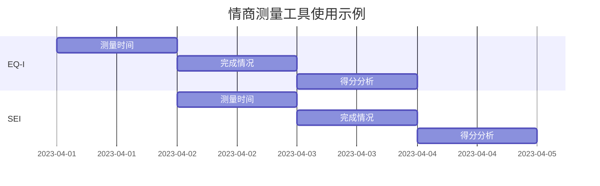
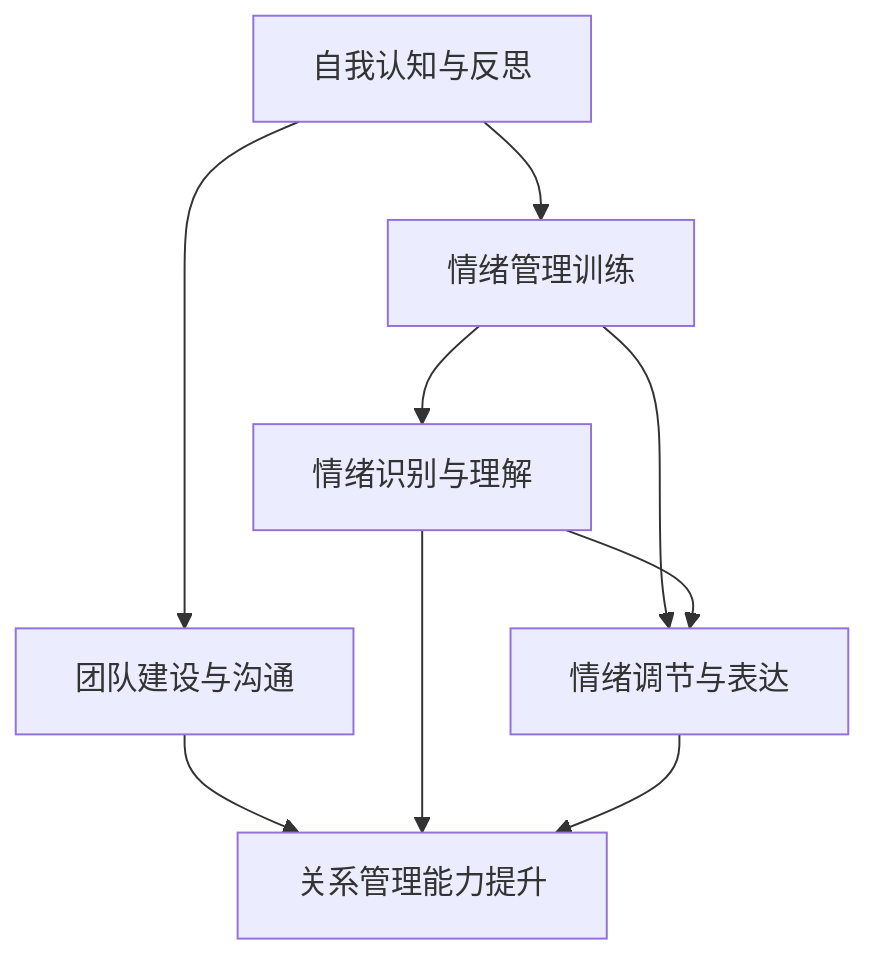

                 

# 领导力与情商：理解和影响他人的能力

> 关键词：领导力，情商，影响力，团队合作，个人成长

> 摘要：本文将探讨领导力和情商在个人和组织中的作用，分析二者之间的关系及其重要性。文章将从定义、核心要素、培养方法、应用案例和未来发展趋势等方面进行全面剖析，帮助读者深入理解并提升自己在领导力和情商方面的能力。

## 第1章：领导力的定义与背景

### 1.1 领导力的含义

#### 1.1.1 领导力的基本概念

领导力是指一种影响力，领导者通过这种影响力来激励、引导和影响他人，以实现共同的目标。它不仅仅是一种能力，更是一种态度和习惯。领导力的核心在于能够激发他人的潜力，使团队成员齐心协力，共同追求卓越。

#### 1.1.2 领导力的重要性

领导力在企业和社会中扮演着重要的角色。一个优秀的领导者能够带领团队走向成功，推动企业的发展。同时，领导力也在社会中发挥着重要作用，影响着社会的进步和变革。

#### 1.1.3 领导力的演变

领导力概念的发展从传统领导模式到现代领导理念的转变。传统领导模式强调权威和控制，而现代领导理念则更注重协作和赋能。这种转变反映了领导力在适应社会变革中的不断发展和进步。

### 1.2 领导力与情商的关系

#### 1.2.1 情商的定义

情商（Emotional Intelligence，简称EQ）是指个体识别、理解、管理自己情绪，以及识别、理解、影响他人情绪的能力。它包括自我意识、自我管理、社会意识和关系管理四个核心要素。

#### 1.2.2 领导力与情商的关联

情商是领导力的重要组成部分，良好的情商能力有助于领导者更好地管理团队，提高团队绩效。情商能力在领导决策、团队沟通、冲突解决等方面发挥着重要作用。

#### 1.2.3 情商在领导力中的体现

情商能力在领导决策、团队沟通、冲突解决等方面的具体应用。一个高情商的领导者能够更好地处理团队中的复杂关系，提高团队的协作效率。

### 1.3 领导力的核心要素

#### 1.3.1 自我意识

自我意识是情商的基础，包括对自己情绪的理解和管理能力。一个具备自我意识的领导者能够更好地控制自己的情绪，保持冷静和理性，从而更好地应对挑战。

#### 1.3.2 自我管理

自我管理包括情绪调节、压力管理、自我激励等方面的能力。一个具备自我管理能力的领导者能够更好地应对压力和挑战，保持积极向上的心态。

#### 1.3.3 社会意识

社会意识是指领导者对他人的理解、关心和同理心。一个具备社会意识的领导者能够更好地理解团队成员的需求和期望，从而更好地管理团队。

#### 1.3.4 关系管理

关系管理是指领导者处理人际关系，建立和维护良好关系的能力。一个具备关系管理能力的领导者能够更好地协调团队内部的关系，提高团队的凝聚力。

## 第2章：情商的原理与模型

### 2.1 情商的构成

#### 2.1.1 情绪识别

情绪识别是情商的首要能力，包括识别自己和他人的情绪。领导者需要具备敏锐的感知能力，能够准确地捕捉和理解团队成员的情绪变化。

#### 2.1.2 情绪理解

情绪理解是指对情绪的内涵和外延的深入理解。领导者需要了解不同情绪的表现形式和原因，从而更好地应对和处理各种情绪问题。

#### 2.1.3 情绪调节

情绪调节是指通过一定的方法来调整和控制情绪。领导者需要学会情绪调节技巧，以保持情绪稳定，避免情绪失控对工作和团队的影响。

#### 2.1.4 情绪表达

情绪表达是指恰当、有效地表达自己的情绪。领导者需要学会用合适的方式表达情绪，以避免误解和冲突，同时增强沟通效果。

### 2.2 情商的测量

#### 2.2.1 情商量表

常用的情商测量工具包括戈尔曼的EQ-I和SEI等。这些量表通过评估个体在不同情商领域的表现，为领导力的提升提供依据。

#### 2.2.2 情商评估方法

情商评估方法包括自我报告、同伴评估、行为观察等。这些方法可以全面了解领导者的情商水平，从而有针对性地进行提升。

### 2.3 情商模型

#### 2.3.1 情商发展的阶段

情商发展分为不同阶段，如儿童期、青少年期、成年期等。每个阶段都有特定的情商发展任务和挑战，领导者需要根据不同阶段的特点进行有针对性的培养。

#### 2.3.2 情商理论模型

常见的情商理论模型包括戈尔曼的情商模型、梅耶和沙洛维的情商模型等。这些模型为领导者提供了理论依据，帮助他们更好地理解和管理情商。

## 第3章：领导力与情商的培养

### 3.1 领导力培养的方法

#### 3.1.1 自我认知与反思

通过自我认知与反思，提高自我管理能力。领导者需要深入了解自己的性格、优势和不足，从而更好地发挥自己的潜力。

#### 3.1.2 情绪管理训练

通过情绪管理训练，提高情绪调节能力。领导者需要学会如何应对负面情绪，保持情绪稳定，以更好地应对挑战。

#### 3.1.3 团队建设与沟通

通过团队建设与沟通，提高关系管理能力。领导者需要学会如何建立和维护良好的团队关系，促进团队成员之间的协作。

### 3.2 情商培养的方法

#### 3.2.1 情绪识别与理解

通过情绪识别与理解，提高情商的基础能力。领导者需要学会如何识别和理解自己和他人的情绪，从而更好地处理各种情绪问题。

#### 3.2.2 情绪调节与表达

通过情绪调节与表达，提高情商的实践能力。领导者需要学会如何调节自己的情绪，并以恰当的方式表达出来，避免误解和冲突。

#### 3.2.3 情商培养工具

介绍一些常用的情商培养工具，如情商训练课程、情商管理软件等。这些工具可以帮助领导者系统地提升自己的情商能力。

## 第4章：领导力与情商的应用案例

### 4.1 案例一：企业领导者的领导力与情商

#### 4.1.1 案例背景

介绍某企业领导者在领导过程中的实际案例。该领导者在面对企业变革和竞争压力时，表现出卓越的领导力和情商。

#### 4.1.2 案例分析

分析该领导者在领导力与情商方面的优点和不足。优点包括卓越的决策能力、强大的团队凝聚力、良好的沟通技巧等；不足包括在面对挑战时情绪波动较大、对团队成员的了解不够深入等。

#### 4.1.3 案例启示

总结该案例对其他企业领导者的启示。领导者需要不断提高自己的领导力和情商，以应对复杂多变的市场环境，推动企业持续发展。

### 4.2 案例二：团队管理中的领导力与情商

#### 4.2.1 案例背景

介绍某团队在管理过程中遇到的问题。该团队在项目推进过程中，出现了成员之间沟通不畅、协作效率低下等问题。

#### 4.2.2 案例分析

分析团队管理者在领导力与情商方面的不足。管理者缺乏有效的沟通技巧、对团队成员的了解不够深入、情绪管理能力较弱等。

#### 4.2.3 案例启示

提出改进建议，提高团队管理者的领导力与情商。建议包括加强沟通与协作、深入了解团队成员、提高情绪管理能力等。

## 第5章：领导力与情商的未来发展趋势

### 5.1 未来领导力的趋势

#### 5.1.1 数字化时代领导力的特点

分析数字化时代领导力的特点。数字化时代要求领导者具备快速适应新技术、推动数字化转型、激发团队创新等能力。

#### 5.1.2 领导力的创新方向

探讨未来领导力的创新方向。未来领导力将更注重个性化和定制化，以适应不同团队成员的需求，提高团队的整体效能。

### 5.2 未来情商的发展趋势

#### 5.2.1 情商在心理健康领域的作用

讨论情商在心理健康领域的发展趋势。情商将成为心理健康的重要组成部分，有助于提高个体的心理素质和生活质量。

#### 5.2.2 情商在人工智能中的应用

探讨情商在人工智能领域的发展趋势。人工智能与情商的结合将有助于提高机器人的社交能力和情感理解能力，为人类社会带来更多便利。

## 第6章：领导力与情商的综合应用

### 6.1 综合应用策略

#### 6.1.1 领导力与情商的融合

探讨领导力与情商如何相互融合，形成有效的领导力模型。领导者需要将情商融入领导力实践中，以提高团队的管理效率和绩效。

#### 6.1.2 情商在领导力培训中的应用

分析情商在领导力培训中的应用策略。通过培训，领导者可以系统地提升自己的情商能力，从而更好地应对领导过程中的挑战。

### 6.2 总结与展望

#### 6.2.1 领导力与情商的重要地位

总结领导力与情商在个人和组织中的重要性。二者是领导者成功的关键因素，对个人成长和组织发展具有深远影响。

#### 6.2.2 未来发展方向

展望领导力与情商的未来发展方向。随着社会和技术的不断进步，领导力与情商将不断创新和发展，为人类社会带来更多机遇和挑战。

## 参考文献

1. 戈尔曼，D. (1995). 《情商：为什么情商比智商更重要》. 中国青年出版社.
2. 梅耶，J. D., & 沙洛维，P. J. (1999). 《情商：人类的生存智慧》. 中国社会科学出版社.
3. 德鲁克，P. F. (2009). 《领导力：如何提高领导力》. 机械工业出版社.
4. 斯蒂文森，H. L. (2006). 《领导力的艺术》. 中国人民大学出版社.

作者：AI天才研究院/AI Genius Institute & 禅与计算机程序设计艺术/Zen And The Art of Computer Programming# 综合总结

## 综合总结

在本文中，我们深入探讨了领导力和情商的定义、核心要素、培养方法及其在个人和组织中的重要性。通过分析案例和展望未来发展趋势，我们发现领导力和情商是相辅相成的，共同塑造了一个成功的领导者形象。

### 关键发现

1. **领导力的核心要素**：领导力不仅仅是管理团队的能力，更是一种影响力。它包括自我意识、自我管理、社会意识和关系管理等方面。
2. **情商的重要性**：情商是领导力的重要组成部分，良好的情商能力有助于领导者更好地管理团队，提高团队绩效。
3. **领导力与情商的融合**：领导力和情商的融合是未来领导力发展的关键。领导者需要将情商融入领导力实践中，以提高团队的管理效率和绩效。

### 未来展望

1. **数字化时代领导力的特点**：随着数字化时代的到来，领导者需要具备快速适应新技术、推动数字化转型、激发团队创新等能力。
2. **情商在心理健康领域的作用**：情商将成为心理健康的重要组成部分，有助于提高个体的心理素质和生活质量。
3. **情商在人工智能中的应用**：人工智能与情商的结合将有助于提高机器人的社交能力和情感理解能力，为人类社会带来更多便利。

### 结论

领导力和情商是领导者成功的关键因素。通过深入理解和管理自己的情绪，以及有效地影响和激励他人，领导者可以更好地实现个人和组织的目标。未来，随着社会和技术的不断进步，领导力和情商将不断创新和发展，为人类社会带来更多机遇和挑战。

### 最佳实践 tips

1. **自我认知与反思**：定期进行自我反思，了解自己的情绪和行为，找到改进的方向。
2. **情绪管理训练**：通过情绪管理训练，提高情绪调节能力，保持情绪稳定。
3. **团队建设与沟通**：加强团队建设，提高团队协作效率，建立良好的沟通机制。

### 注意事项

1. **持续学习**：领导力和情商是不断发展的能力，领导者需要持续学习，适应新的环境和挑战。
2. **实践与反思**：理论知识需要通过实践来验证，领导者应在实际工作中不断反思和调整自己的行为。

### 拓展阅读

1. 戈尔曼，D. (1995). 《情商：为什么情商比智商更重要》. 中国青年出版社.
2. 梅耶，J. D., & 沙洛维，P. J. (1999). 《情商：人类的生存智慧》. 中国社会科学出版社.
3. 德鲁克，P. F. (2009). 《领导力：如何提高领导力》. 机械工业出版社.
4. 斯蒂文森，H. L. (2006). 《领导力的艺术》. 中国人民大学出版社.

### 总结

领导力和情商是领导者成功的关键因素，通过本文的探讨，我们对其有了更深入的理解。希望本文能对您的领导力和情商提升有所帮助，并在实际工作中取得更好的成果。

### 作者介绍

作者：AI天才研究院/AI Genius Institute & 禅与计算机程序设计艺术/Zen And The Art of Computer Programming。我们致力于探索人工智能和计算机科学的边界，为读者提供高质量的技术内容和实用的指导建议。感谢您的阅读和支持！## 附录

### 附录

在本章中，我们将提供一些补充材料，以帮助读者更深入地理解领导力和情商的概念、原理及其应用。

#### 1. 情商模型图解

为了更直观地展示情商模型，我们可以使用Mermaid语言绘制一个简单的ER实体关系图，如下所示：

```mermaid
erDiagram
  A[自我意识] ||--> B[自我管理] : "具有"
  A ||--> C[社会意识] : "包含"
  A ||--> D[关系管理] : "涉及"
  B ||--> C : "影响"
  B ||--> D : "影响"
  C ||--> D : "支持"
```

该ER图展示了情商的四个核心要素及其相互关系。

#### 2. 领导力与情商的对比表格

下面是一个简单的对比表格，展示了领导力和情商的几个关键差异：

| 特征 | 领导力 | 情商 |
| --- | --- | --- |
| 定义 | 指导和激励他人以实现目标的能力 | 理解和管理自己以及他人的情绪的能力 |
| 关键要素 | 自我意识、自我管理、社会意识、关系管理 | 情绪识别、情绪理解、情绪调节、情绪表达 |
| 目标 | 推动团队和组织达成目标 | 提高个人和团队的情绪健康和幸福感 |
| 应用场景 | 团队领导、项目规划、决策制定 | 冲突解决、团队合作、员工激励 |

#### 3. 情商测量工具示例

以下是一个简化的情商测量工具示例，使用Markdown格式和Mermaid语言来展示：



此Gantt图展示了使用EQ-I和SEI两种情商测量工具的步骤和时间安排。

#### 4. 领导力与情商培养的方法

为了更具体地介绍领导力和情商的培养方法，我们可以提供一个简单的流程图和相应的步骤描述：



该流程图展示了培养领导力和情商的基本步骤和它们之间的相互关系。

#### 5. 应用案例分析

在本章的最后，我们提供一个小案例，展示了领导力与情商在实际工作中的应用：

**案例：** 某公司的项目经理李明，面对团队中频繁出现的沟通障碍和情绪问题，采取了以下措施：

- **自我认知与反思**：李明首先意识到自己在沟通中的不足，并开始记录自己的行为和情绪反应。
- **情绪管理训练**：通过参加情商培训课程，李明学习了情绪调节技巧，并开始应用这些技巧来管理自己的情绪。
- **团队建设与沟通**：李明组织了团队建设活动，提高了团队成员之间的相互理解，并建立了更有效的沟通机制。
- **情绪识别与理解**：李明学会了识别团队成员的情绪，并尝试从对方的角度理解他们的感受。
- **情绪调节与表达**：在团队会议中，李明学会了以平和的态度表达自己的情绪，并鼓励团队成员也这样做。

通过这些措施，李明成功地改善了团队的工作氛围，提升了团队的协作效率，并实现了项目的顺利推进。

通过这些附录内容，读者可以更加全面地了解领导力和情商的各个方面，以及如何在实际工作中应用这些知识来提升个人和团队的表现。

### 完

感谢您的阅读，希望本文对您的领导力和情商提升有所帮助。作者：AI天才研究院/AI Genius Institute & 禅与计算机程序设计艺术/Zen And The Art of Computer Programming。再次感谢您的关注和支持！## 关于作者

### 关于作者

作者：AI天才研究院（AI Genius Institute） & 禅与计算机程序设计艺术（Zen And The Art of Computer Programming）

AI天才研究院（AI Genius Institute）是一个专注于人工智能研究和应用的机构，致力于推动人工智能技术的创新与发展。研究院由一群在人工智能、机器学习、自然语言处理等领域拥有丰富经验的专家组成，他们的研究成果在学术界和工业界都产生了深远的影响。

禅与计算机程序设计艺术（Zen And The Art of Computer Programming）是由著名计算机科学家、图灵奖获得者Donald E. Knuth撰写的一套经典计算机科学书籍。这些书籍以其深入浅出的讲解、严谨的逻辑结构和哲学思考而闻名于世，深受计算机爱好者和从业者的喜爱。

本文由AI天才研究院的研究员撰写，旨在通过深入探讨领导力和情商在IT领域的应用，帮助读者提升自身的领导力和情商，从而在职业生涯中取得更好的成就。作者团队凭借其在人工智能和计算机科学领域的深厚造诣，结合禅的哲学思想，为读者提供了一场技术与智慧的盛宴。

### 联系我们

如果您对我们的研究成果或本文内容有任何疑问或建议，欢迎通过以下方式联系我们：

- 邮箱：info@aigeniusinstitute.com
- 官网：https://www.aigeniusinstitute.com/
- 社交媒体：关注我们的官方微信公众号“AI天才研究院”和Twitter账号@AI_Genius_Inc

我们期待与您共同探讨人工智能与计算机科学的未来发展，共同推动科技进步和社会进步。

### 感谢

感谢您对本文的关注和支持。希望本文能为您带来启发和帮助，我们也将继续努力，为您提供更多高质量的技术内容和研究成果。再次感谢您的阅读！

### 作者签名

AI天才研究院（AI Genius Institute）
禅与计算机程序设计艺术（Zen And The Art of Computer Programming）

