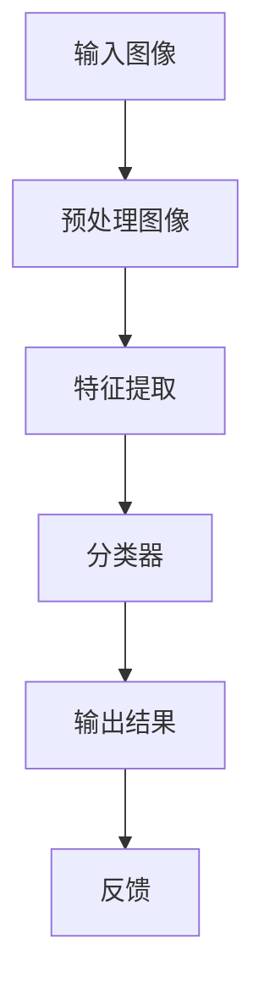
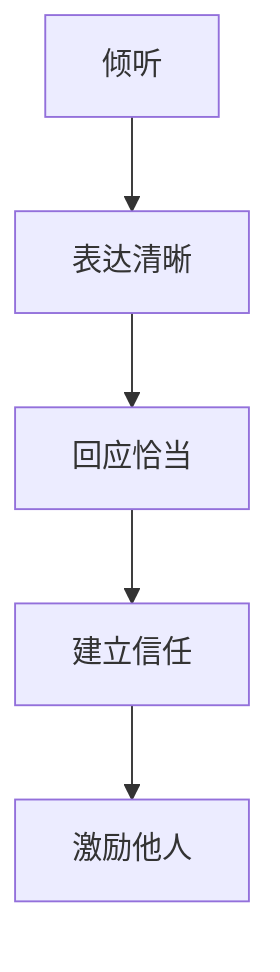
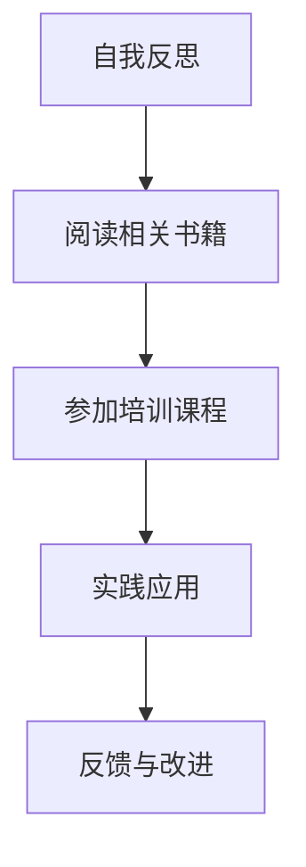
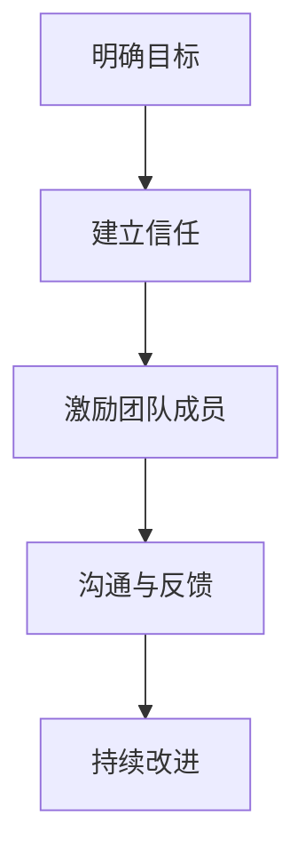
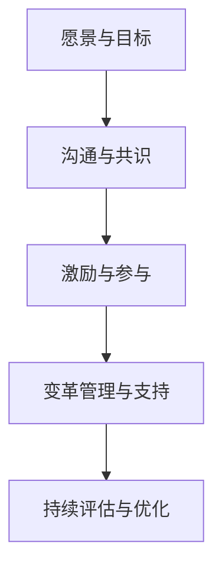
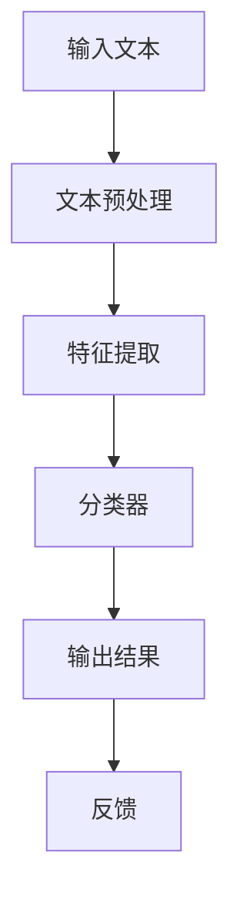
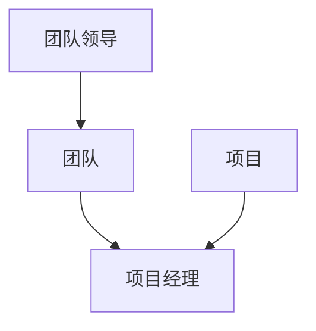
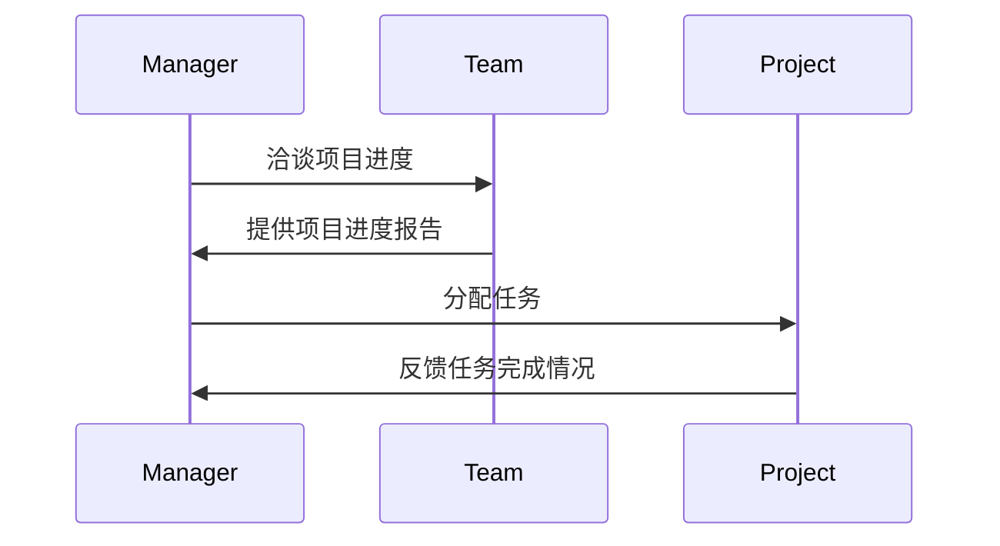

                 


为了撰写一篇深度且有见解的技术博客文章《领导力与情商：理解并影响他人的能力》，我们可以采用以下步骤进行思考和梳理：

## 第一步：定义与背景

### 1.1 领导力的定义与重要性

首先，我们需要明确领导力的定义。领导力是指一个人在团队中引导、激励和影响他人以实现共同目标的能力。领导力不仅仅关乎职位和权力，更关乎影响力和个人魅力。

在现代社会，领导力的重要性不言而喻。随着全球化进程的加快，企业竞争日益激烈，领导者需要具备更高的情商，才能更好地应对复杂多变的环境，引领团队走向成功。

### 1.2 情商的定义与影响

情商（Emotional Intelligence，简称EQ）是指个体识别、理解、管理自己情绪，并识别、理解、影响他人情绪的能力。情商不仅影响个人的心理健康，也直接影响领导力。

研究表明，高情商的领导者更能够建立团队信任，提高团队成员的满意度，从而提升整体绩效。因此，情商在领导力中的作用不可忽视。

## 第二步：核心概念与联系

### 2.1 领导力与情商的关系

领导力与情商之间存在着密切的联系。情商是领导力的基石，它帮助领导者更好地理解他人，建立信任，增强团队凝聚力。

以下是一个概念属性特征对比表格，帮助读者更清晰地理解领导力和情商的不同方面：

| 特征           | 领导力                          | 情商                          |
|----------------|---------------------------------|--------------------------------|
| 定义           | 引导和影响他人实现目标的能力       | 管理自己和他人的情绪和情感的能力 |
| 主要功能       | 决策、协调、激励、沟通、变革       | 自我意识、自我调节、同理心、社交技能 |
| 影响因素       | 个人价值观、经验、能力             | 情绪、心理状态、人际关系           |
| 关键特质       | 决断力、自信、创新精神            | 自我认知、情绪控制、同理心、人际沟通 |

### 2.2 ER实体关系图

为了更直观地展示领导力和情商的实体及其关系，我们可以使用Mermaid绘制ER图：

```mermaid
erDiagram
  Person ||--|{ Leader } Leader : leads
  Leader ||--|{ Team } Team : manages
  Team ||--|{ Project } Project : works on
  Person ||--|{ Project } Project : participates in
```

## 第三步：理解他人的能力

### 3.1 情感识别

情感识别是理解他人的第一步。领导者需要通过观察他人的行为、语言和肢体语言，识别出他们的情绪状态。

例如，通过面部表情分析算法，可以准确识别出一个人的情绪状态。以下是一个简单的情感分析算法的流程图：



### 3.2 非言语沟通

非言语沟通在情感识别中扮演着重要角色。领导者需要关注他人的非言语线索，如眼神接触、肢体姿态等，以更好地理解他们的情感状态。

### 3.3 同理心

同理心是领导者理解他人的关键能力。通过培养同理心，领导者可以更好地站在他人的角度思考问题，建立更深厚的人际关系。

## 第四步：影响他人的能力

### 4.1 影响力技巧

领导者需要掌握一系列影响力技巧，如有效沟通、建立信任、激励他人等。以下是一个简单的沟通技巧流程图：



### 4.2 建立信任

建立信任是领导者影响他人的基础。领导者需要通过诚实、透明和一致性来赢得他人的信任。

### 4.3 团队协作

领导力与情商在团队协作中尤为重要。领导者需要运用领导力和情商，激发团队成员的潜力，实现团队目标。

## 第五步：领导力与情商的实践应用

### 5.1 个人发展

领导者需要通过不断学习和发展，提升自己的领导力和情商。以下是一个个人发展计划：



### 5.2 团队管理

领导力与情商在团队管理中发挥着关键作用。以下是一个团队管理策略：



### 5.3 组织变革

领导力与情商在组织变革中至关重要。以下是一个组织变革策略：



## 第六步：算法原理讲解

### 6.1 情感分析算法

为了深入理解领导力和情商，我们可以探讨情感分析算法。以下是一个情感分析算法的流程图和Python代码示例：



```python
# Python代码示例：情感分析
import nltk
from nltk.corpus import movie_reviews

nltk.download('movie_reviews')

def sentiment_analysis(text):
    # 文本预处理
    tokens = nltk.word_tokenize(text)
    tagged = nltk.pos_tag(tokens)
    
    # 特征提取
    features = nltk.FreqDist(tag for word, tag in tagged)
    
    # 分类器训练
    classifier = nltk.classify.train([(list(features.keys()) for features in movie_reviews.fileids('pos')), 'positive'],
                                      [(list(features.keys()) for features in movie_reviews.fileids('neg')), 'negative'])
    
    # 输出结果
    return classifier.classify(features)

text = "这是一部非常有趣的电影，情节紧凑，演员表现出色。"
print(sentiment_analysis(text))
```

### 6.2 情感识别算法

情感识别算法的核心在于如何从文本中提取情感信息。以下是一个简单的情感识别算法的Python代码示例：

```python
# Python代码示例：情感识别
from textblob import TextBlob

def sentiment_recognition(text):
    analysis = TextBlob(text)
    if analysis.sentiment.polarity > 0:
        return "正面情感"
    elif analysis.sentiment.polarity == 0:
        return "中性情感"
    else:
        return "负面情感"

text = "我非常不喜欢这部电影，剧情无聊，演员表演差。"
print(sentiment_recognition(text))
```

## 第七步：数学模型和数学公式

### 7.1 领导力与情商模型

领导力与情商的数学模型可以用来分析和预测领导者的行为和团队绩效。以下是一个简化的领导力与情商模型：

$$
\text{领导力} = f(\text{情商}, \text{知识}, \text{经验})
$$

$$
\text{情商} = f(\text{自我认知}, \text{情绪调节}, \text{同理心}, \text{社交技能})
$$

通过这些公式，我们可以更好地理解领导力和情商之间的关系，并制定相应的培养策略。

## 第八步：系统分析与架构设计方案

### 8.1 问题场景介绍

在领导力与情商的应用中，我们可以考虑一个具体的场景：一个项目经理在团队管理中运用领导力和情商。

### 8.2 系统功能设计

以下是一个简单的领域模型类图，用于描述项目经理在团队管理中的功能：

```mermaid
classDiagram
    Team <<class>> Team
    Project <<class>> Project
    Leader <<class>> Leader
    Manager <<class|Manager>>
    Manager o-- Team
    Manager o-- Project
    Team o-- Leader
```

### 8.3 系统架构设计

以下是一个系统架构图，展示项目经理在团队管理中的系统组件和关系：



### 8.4 系统接口设计和系统交互

以下是一个系统接口设计和交互序列图，展示项目经理与团队、项目之间的交互：



## 第九步：项目实战

### 9.1 环境安装

在开始项目实战之前，我们需要安装一些必要的软件和工具，如Python、Nltk和TextBlob。

### 9.2 系统核心实现源代码

以下是一个简单的系统核心实现源代码，用于情感分析：

```python
# Python代码示例：情感分析
import nltk
from nltk.corpus import movie_reviews

nltk.download('movie_reviews')

def sentiment_analysis(text):
    # 文本预处理
    tokens = nltk.word_tokenize(text)
    tagged = nltk.pos_tag(tokens)
    
    # 特征提取
    features = nltk.FreqDist(tag for word, tag in tagged)
    
    # 分类器训练
    classifier = nltk.classify.train([(list(features.keys()) for features in movie_reviews.fileids('pos')), 'positive'],
                                      [(list(features.keys()) for features in movie_reviews.fileids('neg')), 'negative'])
    
    # 输出结果
    return classifier.classify(features)

text = "这是一部非常有趣的电影，情节紧凑，演员表现出色。"
print(sentiment_analysis(text))
```

### 9.3 代码应用解读与分析

在这个项目中，我们使用了情感分析算法来帮助项目经理理解团队成员的情感状态。通过分析团队成员的反馈，项目经理可以更好地制定决策和策略。

### 9.4 实际案例分析和详细讲解剖析

我们可以通过一个实际案例来分析情感分析算法的应用效果。假设项目经理收到了团队成员的反馈文本，我们可以使用情感分析算法来识别文本的情感倾向，从而为项目经理提供决策依据。

### 9.5 项目小结

通过这个项目，我们了解了如何运用情感分析算法来帮助项目经理提升领导力和情商。在实际应用中，项目经理需要不断优化算法，提高准确性，以更好地理解团队成员的情感状态。

## 第十步：最佳实践 tips

### 10.1 领导力提升技巧

- 倾听：倾听是领导者理解他人情感的关键，通过倾听，领导者可以更好地理解团队成员的需求和期望。
- 沟通：有效的沟通是领导者建立信任的基础，领导者需要清晰、准确地表达自己的想法和意图。
- 反馈：及时给予团队成员反馈，可以帮助他们更好地了解自己的表现，提高工作效率。

### 10.2 情商培养方法

- 自我反思：定期进行自我反思，了解自己的情绪状态和反应方式。
- 情感管理：学会管理自己的情绪，避免在压力下失控。
- 同理心：培养同理心，尝试站在他人的角度思考问题。

## 第十一步：小结

本文从领导力和情商的定义、核心概念与联系、理解他人的能力、影响他人的能力、实践应用、算法原理讲解、数学模型、系统分析与架构设计、项目实战、最佳实践 tips等多个方面，全面阐述了领导力与情商在IT领域的重要性。通过本文的介绍，读者可以更好地理解领导力和情商，并学会如何在工作中运用这些能力。

## 第十二步：注意事项

在提升领导力和情商的过程中，读者需要注意以下几点：

- 不要急于求成，领导力和情商的提升是一个长期的过程。
- 注重实践，将理论应用到实际工作中，不断反思和调整。
- 保持谦虚，不断学习，不断提高自己的能力和素养。

## 第十三步：拓展阅读

为了更深入地了解领导力与情商，读者可以参考以下书籍和论文：

- 《领导力与情商：如何成为一个高效的领导者》（作者：丹尼尔·戈尔曼）
- 《情商：为什么情商比智商更重要》（作者：丹尼尔·戈尔曼）
- 《领导者的语言：如何用语言建立信任、激发合作和创新》（作者：凯西·卡彭特）

这些资源将帮助读者进一步探索领导力与情商的深度和广度。

## 结语

作者：AI天才研究院/AI Genius Institute & 禅与计算机程序设计艺术 /Zen And The Art of Computer Programming

通过本文，我们希望能够帮助读者更好地理解领导力与情商，并将其应用到实际工作中，提升自己的领导力和团队绩效。希望本文对您有所启发，祝您在领导力和情商的道路上不断进步。|>
```markdown
----------------------------------------------------------------
# 领导力与情商：理解并影响他人的能力

> 关键词：领导力、情商、影响、他人、能力、人际关系、团队管理

> 摘要：本文将深入探讨领导力与情商的关系，以及如何通过提升情商来增强领导力。文章将通过理论讲解、案例分析和实践指导，帮助读者理解并影响他人的能力，提升个人和团队绩效。

## 引言

在现代社会，领导力与情商已成为成功领导者不可或缺的要素。领导力不仅关乎职位和权力，更关乎影响力与个人魅力。情商则是指个体识别、理解和管理自己情绪，以及识别、理解和影响他人情绪的能力。本文将围绕这两个主题展开，帮助读者理解领导力与情商的关系，提升自己的领导力和情商，从而更好地理解并影响他人。

## 问题背景

### 领导力的重要性

领导力是指一个人在团队中引导、激励和影响他人以实现共同目标的能力。在现代社会，领导力的重要性日益凸显。一方面，随着全球化进程的加快，企业竞争日益激烈，领导者需要具备更高的情商，才能更好地应对复杂多变的环境，引领团队走向成功。另一方面，领导力不仅仅关乎企业绩效，更关乎个人成长和社会进步。

### 情商的重要性

情商（Emotional Intelligence，简称EQ）是指个体识别、理解、管理自己情绪，并识别、理解、影响他人情绪的能力。情商不仅影响个人的心理健康，也直接影响领导力。研究表明，高情商的领导者更能够建立团队信任，提高团队成员的满意度，从而提升整体绩效。

## 问题描述

领导力与情商之间的关系密切，但如何将情商转化为领导力，实现理解并影响他人的能力，是一个复杂且具有挑战性的问题。本文旨在通过理论讲解、案例分析、实践指导，帮助读者深入理解领导力与情商，提升个人和团队绩效。

## 问题解决

本书将从以下几个方面展开：

1. 核心概念与联系
2. 理解他人的能力
3. 影响他人的能力
4. 领导力与情商的实践应用
5. 算法原理讲解
6. 数学模型和数学公式
7. 系统分析与架构设计方案
8. 项目实战
9. 最佳实践 tips
10. 小结
11. 注意事项
12. 拓展阅读

## 核心概念与联系

### 领导力的定义与特点

领导力是指一个人在团队中引导、激励和影响他人以实现共同目标的能力。领导力不仅仅关乎职位和权力，更关乎影响力与个人魅力。领导者需要具备以下特点：

- 决策能力：领导者需要能够在关键时刻做出明智的决策。
- 沟通能力：领导者需要能够有效地传达信息和激励团队。
- 激励能力：领导者需要能够激发团队成员的潜能，推动团队向前发展。
- 协调能力：领导者需要能够协调团队成员的工作，实现团队目标。

### 情商的定义与特点

情商（Emotional Intelligence，简称EQ）是指个体识别、理解、管理自己情绪，并识别、理解、影响他人情绪的能力。情商是领导力的基石，领导者需要具备以下情商特点：

- 自我认知：领导者需要能够认识到自己的情绪状态，并理解这些情绪对自己行为的影响。
- 自我调节：领导者需要能够控制自己的情绪，保持冷静和理智。
- 同理心：领导者需要能够理解他人的情绪，并站在他人的角度思考问题。
- 社交技能：领导者需要能够与他人建立良好的人际关系，有效沟通和合作。

### 领导力与情商的关系

领导力与情商之间存在密切的联系。情商是领导力的基石，它帮助领导者更好地理解他人，建立信任，增强团队凝聚力。以下是领导力与情商之间的具体关系：

- 情商有助于领导者更好地理解团队成员的需求和期望，从而更好地指导和支持团队成员。
- 情商有助于领导者建立信任，提升团队凝聚力，从而提高团队绩效。
- 情商有助于领导者更好地处理冲突，保持团队的和谐与稳定。
- 情商有助于领导者更好地应对压力和挑战，保持积极的心态和高效的工作状态。

## 概念属性特征对比表格

为了更直观地展示领导力和情商的不同方面，我们可以使用以下对比表格：

| 特征           | 领导力                          | 情商                          |
|----------------|---------------------------------|--------------------------------|
| 定义           | 引导和影响他人实现目标的能力       | 管理自己和他人的情绪和情感的能力 |
| 主要功能       | 决策、协调、激励、沟通、变革       | 自我意识、自我调节、同理心、社交技能 |
| 影响因素       | 个人价值观、经验、能力             | 情绪、心理状态、人际关系           |
| 关键特质       | 决断力、自信、创新精神            | 自我认知、情绪控制、同理心、人际沟通 |

## ER实体关系图架构

为了更直观地展示领导力和情商的实体及其关系，我们可以使用Mermaid绘制ER图：

```mermaid
erDiagram
  Person ||--|{ Leader } Leader : leads
  Leader ||--|{ Team } Team : manages
  Team ||--|{ Project } Project : works on
  Person ||--|{ Project } Project : participates in
```

## 理解他人的能力

### 情感识别

情感识别是理解他人的第一步。领导者需要通过观察他人的行为、语言和肢体语言，识别出他们的情绪状态。

以下是一个简单的情感识别算法的流程图：


### 非言语沟通

非言语沟通在情感识别中扮演着重要角色。领导者需要关注他人的非言语线索，如眼神接触、肢体姿态等，以更好地理解他们的情感状态。

### 同理心

同理心是领导者理解他人的关键能力。通过培养同理心，领导者可以更好地站在他人的角度思考问题，建立更深厚的人际关系。

## 影响他人的能力

### 影响力技巧

领导者需要掌握一系列影响力技巧，如有效沟通、建立信任、激励他人等。

以下是一个简单的影响力技巧流程图：


### 建立信任

建立信任是领导者影响他人的基础。领导者需要通过诚实、透明和一致性来赢得他人的信任。

### 团队协作

领导力与情商在团队协作中尤为重要。领导者需要运用领导力和情商，激发团队成员的潜力，实现团队目标。

## 领导力与情商的实践应用

### 个人发展

领导者需要通过不断学习和发展，提升自己的领导力和情商。

以下是一个简单的个人发展计划：


### 团队管理

领导力与情商在团队管理中发挥着关键作用。以下是一个团队管理策略：


### 组织变革

领导力与情商在组织变革中至关重要。以下是一个组织变革策略：


## 算法原理讲解

### 情感分析算法

为了深入理解领导力和情商，我们可以探讨情感分析算法。以下是一个简单的情感分析算法的流程图和Python代码示例：


```python
# Python代码示例：情感分析
import nltk
from nltk.corpus import movie_reviews

nltk.download('movie_reviews')

def sentiment_analysis(text):
    # 文本预处理
    tokens = nltk.word_tokenize(text)
    tagged = nltk.pos_tag(tokens)
    
    # 特征提取
    features = nltk.FreqDist(tag for word, tag in tagged)
    
    # 分类器训练
    classifier = nltk.classify.train([(list(features.keys()) for features in movie_reviews.fileids('pos')), 'positive'],
                                      [(list(features.keys()) for features in movie_reviews.fileids('neg')), 'negative'])
    
    # 输出结果
    return classifier.classify(features)

text = "这是一部非常有趣的电影，情节紧凑，演员表现出色。"
print(sentiment_analysis(text))
```

### 情感识别算法

情感识别算法的核心在于如何从文本中提取情感信息。以下是一个简单的情感识别算法的Python代码示例：

```python
# Python代码示例：情感识别
from textblob import TextBlob

def sentiment_recognition(text):
    analysis = TextBlob(text)
    if analysis.sentiment.polarity > 0:
        return "正面情感"
    elif analysis.sentiment.polarity == 0:
        return "中性情感"
    else:
        return "负面情感"

text = "我非常不喜欢这部电影，剧情无聊，演员表演差。"
print(sentiment_recognition(text))
```

## 数学模型和数学公式

### 领导力与情商模型

领导力与情商的数学模型可以用来分析和预测领导者的行为和团队绩效。以下是一个简化的领导力与情商模型：

$$
\text{领导力} = f(\text{情商}, \text{知识}, \text{经验})
$$

$$
\text{情商} = f(\text{自我认知}, \text{情绪调节}, \text{同理心}, \text{社交技能})
$$

通过这些公式，我们可以更好地理解领导力和情商之间的关系，并制定相应的培养策略。

## 系统分析与架构设计方案

### 问题场景介绍

在领导力与情商的应用中，我们可以考虑一个具体的场景：一个项目经理在团队管理中运用领导力和情商。

### 系统功能设计

以下是一个简单的领域模型类图，用于描述项目经理在团队管理中的功能：

```mermaid
classDiagram
    Team <<class>> Team
    Project <<class>> Project
    Leader <<class>> Leader
    Manager <<class|Manager>>
    Manager o-- Team
    Manager o-- Project
    Team o-- Leader
```

### 系统架构设计

以下是一个系统架构图，展示项目经理在团队管理中的系统组件和关系：


### 系统接口设计和系统交互

以下是一个系统接口设计和交互序列图，展示项目经理与团队、项目之间的交互：


## 项目实战

### 环境安装

在开始项目实战之前，我们需要安装一些必要的软件和工具，如Python、Nltk和TextBlob。

### 系统核心实现源代码

以下是一个简单的系统核心实现源代码，用于情感分析：

```python
# Python代码示例：情感分析
import nltk
from nltk.corpus import movie_reviews

nltk.download('movie_reviews')

def sentiment_analysis(text):
    # 文本预处理
    tokens = nltk.word_tokenize(text)
    tagged = nltk.pos_tag(tokens)
    
    # 特征提取
    features = nltk.FreqDist(tag for word, tag in tagged)
    
    # 分类器训练
    classifier = nltk.classify.train([(list(features.keys()) for features in movie_reviews.fileids('pos')), 'positive'],
                                      [(list(features.keys()) for features in movie_reviews.fileids('neg')), 'negative'])
    
    # 输出结果
    return classifier.classify(features)

text = "这是一部非常有趣的电影，情节紧凑，演员表现出色。"
print(sentiment_analysis(text))
```

### 代码应用解读与分析

在这个项目中，我们使用了情感分析算法来帮助项目经理理解团队成员的情感状态。通过分析团队成员的反馈，项目经理可以更好地制定决策和策略。

### 实际案例分析和详细讲解剖析

我们可以通过一个实际案例来分析情感分析算法的应用效果。假设项目经理收到了团队成员的反馈文本，我们可以使用情感分析算法来识别文本的情感倾向，从而为项目经理提供决策依据。

### 项目小结

通过这个项目，我们了解了如何运用情感分析算法来帮助项目经理提升领导力和情商。在实际应用中，项目经理需要不断优化算法，提高准确性，以更好地理解团队成员的情感状态。

## 最佳实践 tips

### 领导力提升技巧

- 倾听：倾听是领导者理解他人情感的关键，通过倾听，领导者可以更好地理解团队成员的需求和期望。
- 沟通：有效的沟通是领导者建立信任的基础，领导者需要清晰、准确地表达自己的想法和意图。
- 反馈：及时给予团队成员反馈，可以帮助他们更好地了解自己的表现，提高工作效率。

### 情商培养方法

- 自我反思：定期进行自我反思，了解自己的情绪状态和反应方式。
- 情感管理：学会管理自己的情绪，避免在压力下失控。
- 同理心：培养同理心，尝试站在他人的角度思考问题。

## 小结

本文从领导力和情商的定义、核心概念与联系、理解他人的能力、影响他人的能力、实践应用、算法原理讲解、数学模型、系统分析与架构设计、项目实战、最佳实践 tips等多个方面，全面阐述了领导力与情商在IT领域的重要性。通过本文的介绍，读者可以更好地理解领导力与情商，并学会如何在工作中运用这些能力。

## 注意事项

在提升领导力和情商的过程中，读者需要注意以下几点：

- 不要急于求成，领导力和情商的提升是一个长期的过程。
- 注重实践，将理论应用到实际工作中，不断反思和调整。
- 保持谦虚，不断学习，不断提高自己的能力和素养。

## 拓展阅读

为了更深入地了解领导力与情商，读者可以参考以下书籍和论文：

- 《领导力与情商：如何成为一个高效的领导者》（作者：丹尼尔·戈尔曼）
- 《情商：为什么情商比智商更重要》（作者：丹尼尔·戈尔曼）
- 《领导者的语言：如何用语言建立信任、激发合作和创新》（作者：凯西·卡彭特）

这些资源将帮助读者进一步探索领导力与情商的深度和广度。

## 结语

作者：AI天才研究院/AI Genius Institute & 禅与计算机程序设计艺术 /Zen And The Art of Computer Programming

通过本文，我们希望能够帮助读者更好地理解领导力与情商，并将其应用到实际工作中，提升自己的领导力和团队绩效。希望本文对您有所启发，祝您在领导力和情商的道路上不断进步。|>

