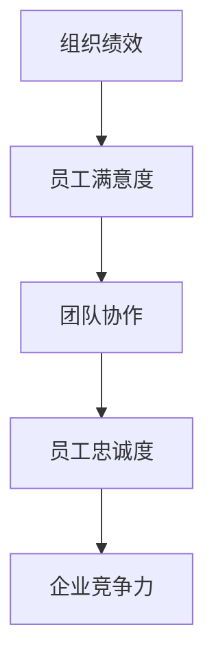
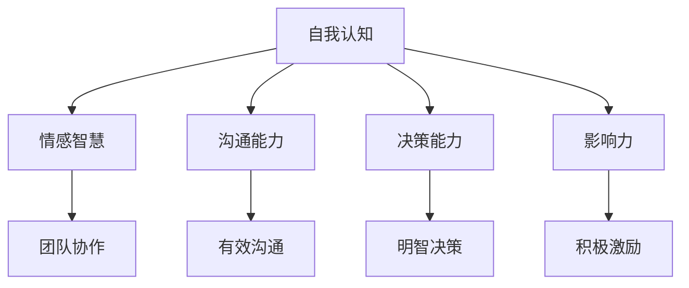

                 

# 领导力与情感智慧：理解人性的艺术

## 关键词
领导力，情感智慧，人性理解，团队管理，个人成长，组织变革

## 摘要
本文旨在探讨领导力与情感智慧在组织和个人发展中的重要作用。通过详细分析领导力与情感智慧的核心概念、基础理论和应用实践，本文揭示了人性理解的重要性，并提出了领导力与情感智慧融合的方法和策略。文章最后展望了领导力与情感智慧在未来组织中的发展前景，为读者提供了实用的实践建议。

## 目录大纲

### 第一部分: 引言

#### 第1章: 领导力与情感智慧概述

1.1 领导力与情感智慧的核心概念

1.2 人性理解的重要性

1.3 领导力与情感智慧在组织中的作用

#### 第2章: 领导力基础

2.1 领导力定义与特点

2.2 领导风格的多样性

2.3 领导力发展的要素

#### 第3章: 情感智慧基础

3.1 情感智慧的定义与作用

3.2 情感识别与表达

3.3 情感调节与应对策略

#### 第4章: 领导力与情感智慧的融合

4.1 融合的概念与意义

4.2 融合的实践方法

4.3 融合的挑战与解决方案

#### 第5章: 领导力与情感智慧在团队管理中的应用

5.1 团队领导者的角色

5.2 建立高效的团队

5.3 团队冲突的处理

#### 第6章: 领导力与情感智慧在个人成长中的应用

6.1 自我认知与成长

6.2 情感管理提升

6.3 个人领导力提升策略

#### 第7章: 领导力与情感智慧在未来组织中的展望

7.1 组织变革的趋势

7.2 情感智慧在组织发展中的应用前景

7.3 未来组织领导力的关键能力

#### 第8章: 结论

8.1 领导力与情感智慧的重要性

8.2 个人与组织发展中的实践建议

8.3 未来研究方向与展望

---

### 详细章节内容

#### 第1章: 领导力与情感智慧概述

**1.1 领导力与情感智慧的核心概念**

领导力与情感智慧是现代组织管理中不可或缺的两个核心概念。领导力指的是领导者引导、激励和影响他人实现共同目标的能力与特质。情感智慧则是指个体识别、理解和管理自己及他人情绪的能力。

我们通过以下表格来梳理领导力与情感智慧的关键特性：

| 特性            | 领导力                             | 情感智慧                          |
|-----------------|------------------------------------|----------------------------------|
| 定义            | 指领导者在组织中所展现的能力与特质 | 指个体识别、理解和管理自己及他人情绪的能力 |
| 关键要素        | 沟通能力、决策能力、影响力         | 情感识别、情感表达、情感调节       |
| 重要性          | 决定组织绩效和员工满意度           | 影响人际关系、团队协作和个人发展   |

**1.2 人性理解的重要性**

人性理解是领导力与情感智慧的重要组成部分。它涉及到对人类行为动机、心理状态和社会互动的深刻洞察。人性理解的重要性体现在以下几个方面：

- **增强沟通效果**：领导者通过对人性的理解，能够更准确地把握员工的需求和期望，从而建立更有效的沟通渠道。
- **提升团队协作**：领导者通过人性理解，可以更好地协调团队成员的关系，促进协作，提高团队的整体效率。
- **增强领导影响力**：领导者通过对人性的深刻理解，能够更有效地激励和影响他人，实现组织目标。

**1.3 领导力与情感智慧在组织中的作用**

领导力与情感智慧在组织中发挥着至关重要的作用。以下是它们在组织中的具体作用：

- **提升组织绩效**：有效的领导力可以激励员工积极工作，提高工作效率，从而提升组织的整体绩效。
- **增强员工满意度**：情感智慧的运用可以帮助领导者更好地理解员工的情感需求，提高员工的满意度和忠诚度。
- **促进团队协作**：领导者通过情感智慧，可以构建和谐的人际关系，促进团队成员之间的合作与协作。
- **推动组织变革**：领导力与情感智慧的融合可以引导组织应对变革，推动组织持续发展和创新。

我们通过以下Mermaid流程图展示领导力与情感智慧在组织中的具体作用：

#### 第2章: 领导力基础

**2.1 领导力定义与特点**

领导力是领导者引导、激励和影响他人实现共同目标的能力与特质。领导力不仅仅是一种职位赋予的权力，更是一种影响力。以下是对领导力的定义及其特点的详细阐述：

- **定义**：领导力是一种通过激励、影响和引导他人来实现组织目标的能力。
- **特点**：
  - **影响力**：领导力是一种影响力，它能够激发他人的积极性和创造力，使团队成员愿意为共同目标努力。
  - **适应性**：领导力需要根据不同的情境和团队成员的特点进行调整，以适应不同的领导环境和需求。
  - **持续性**：领导力是一种持续的实践过程，它需要领导者不断地学习和成长，以适应不断变化的环境。

**2.2 领导风格的多样性**

领导风格是指领导者在进行管理活动时所采用的方式和手段。不同的领导风格对团队和员工有着不同的影响。以下是几种常见的领导风格及其特点：

- **授权型领导**：这种领导风格强调给予员工自主权和责任感，鼓励员工自主决策和解决问题。其特点是：
  - **鼓励创新**：员工有更多的空间进行创新，提高团队的创新力。
  - **增强责任感**：员工对自己的工作负责，提高工作质量。

- **民主型领导**：这种领导风格强调团队成员的参与和民主决策，领导者通过与团队成员的沟通和协商来做出决策。其特点是：
  - **提高团队凝聚力**：团队成员感受到自己的意见被重视，增强团队凝聚力。
  - **促进协作**：团队成员之间更容易协作，共同完成任务。

- **专制型领导**：这种领导风格强调领导者的权威和控制，领导者做出决策并要求团队成员执行。其特点是：
  - **快速决策**：决策过程迅速，可以快速应对紧急情况。
  - **提高执行力**：团队成员按照领导者的指示执行任务，提高执行力。

**2.3 领导力发展的要素**

领导力的发展是一个持续的过程，需要领导者不断地学习和提升。以下是领导力发展的几个关键要素：

- **自我认知**：领导者需要了解自己的优点和不足，认识到自己的行为对团队成员的影响。
- **情感智慧**：领导者需要具备情感智慧，能够理解和管理自己的情绪，同时也能够理解和管理团队成员的情绪。
- **沟通能力**：领导者需要具备良好的沟通能力，能够有效地与团队成员沟通，传达目标和期望。
- **决策能力**：领导者需要具备决策能力，能够在复杂和不确定的环境中做出明智的决策。
- **影响力**：领导者需要具备影响力，能够激励和引导团队成员为实现共同目标而努力。

我们通过以下Mermaid ER图展示领导力的核心要素及其相互关系：

#### 第3章: 情感智慧基础

**3.1 情感智慧的定义与作用**

情感智慧，也被称作情绪智能或情商，是指个体识别、理解和管理自己及他人情绪的能力。它包括以下几个方面：

- **自我认知**：个体能够识别和理解自己的情绪状态，知道自己的情绪是由什么引起的。
- **自我管理**：个体能够控制自己的情绪，避免情绪的负面影响，保持积极的心态。
- **社交意识**：个体能够理解和管理他人的情绪，建立良好的人际关系。
- **关系管理**：个体能够运用情感智慧处理人际关系中的冲突，建立和谐的人际环境。

情感智慧在领导力中起着至关重要的作用。以下是情感智慧在领导力中的作用：

- **增强沟通效果**：领导者通过情感智慧，能够更好地理解员工的情感需求，从而进行更有效的沟通。
- **提升团队协作**：领导者通过情感智慧，能够更好地协调团队成员之间的关系，促进团队协作。
- **增强领导影响力**：领导者通过情感智慧，能够更好地激励和影响团队成员，提高领导效果。

**3.2 情感识别与表达**

情感识别与表达是情感智慧的重要组成部分。以下是情感识别与表达的关键点：

- **情感识别**：领导者需要能够准确地识别自己和他人的情感状态，了解情感背后的动机和需求。
- **情感表达**：领导者需要能够以合适的方式表达自己的情感，避免误解和冲突。

**3.3 情感调节与应对策略**

情感调节与应对策略是指领导者如何管理和应对自己的情绪，以保持积极的心态和高效的领导效果。以下是情感调节与应对策略的关键点：

- **情绪调节**：领导者需要学会调整自己的情绪，避免负面情绪的影响，保持积极的心态。
- **应对策略**：领导者需要学会应对各种情境下的挑战，运用情感智慧处理各种冲突和问题。

#### 第4章: 领导力与情感智慧的融合

**4.1 融合的概念与意义**

领导力与情感智慧的融合是指将情感智慧应用于领导力实践中，以提高领导效果和团队绩效。融合的概念可以理解为将情感智慧作为领导力发展的重要组成部分，将情感识别、情感表达和情感调节等情感智慧技能融入领导行为中。

融合的意义主要体现在以下几个方面：

- **提高领导效果**：通过情感智慧的应用，领导者能够更准确地识别员工的情感需求，提高领导效果。
- **促进团队协作**：领导者通过情感智慧，能够更好地协调团队成员之间的关系，促进团队协作。
- **增强组织绩效**：领导者通过情感智慧，能够提高员工的满意度和忠诚度，从而增强组织绩效。

**4.2 融合的实践方法**

以下是领导力与情感智慧融合的几种实践方法：

- **培养情感智慧**：领导者需要通过学习和实践，提高自己的情感智慧，包括情感识别、情感表达和情感调节等技能。
- **建立情感连接**：领导者需要与团队成员建立情感连接，了解他们的情感需求和期望。
- **运用情感智慧**：领导者需要将情感智慧融入领导行为中，包括沟通、决策和冲突处理等方面。

**4.3 融合的挑战与解决方案**

融合领导力与情感智慧可能会面临一些挑战，以下是其中的一些挑战及解决方案：

- **挑战一：情感智慧与理性决策的平衡**：领导者需要在情感智慧和理性决策之间找到平衡，避免过度依赖情感智慧导致决策失误。
- **解决方案**：领导者可以通过学习决策理论和实践，提高自己的理性决策能力，同时保持对情感智慧的关注。

- **挑战二：情感智慧在不同文化背景中的应用**：不同文化背景下的领导者可能需要不同的情感智慧应用策略。
- **解决方案**：领导者需要了解不同文化背景下的情感表达和情感需求，灵活调整自己的领导策略。

#### 第5章: 领导力与情感智慧在团队管理中的应用

**5.1 团队领导者的角色**

团队领导者是团队的核心，其角色和职责对于团队的成功至关重要。以下是团队领导者的角色和职责：

- **角色**：
  - **领导者**：引导和激励团队成员，实现团队目标。
  - **协调者**：协调团队成员之间的关系，解决冲突。
  - **支持者**：为团队成员提供必要的资源和支持，帮助他们克服困难。
- **职责**：
  - **设定目标**：明确团队的目标和方向，确保团队成员对目标有共同的理解。
  - **规划资源**：合理分配资源，确保团队成员有足够的资源完成工作任务。
  - **激励团队**：激励团队成员，提高团队的士气和动力。

**5.2 建立高效的团队**

建立高效的团队是实现组织目标的关键。以下是建立高效团队的关键步骤：

- **明确目标**：确保团队成员对团队的目标有共同的理解，明确团队成员的角色和职责。
- **建立信任**：通过建立信任，提高团队成员之间的合作和沟通效率。
- **提供反馈**：及时提供反馈，帮助团队成员了解自己的表现，改进工作方法。
- **培养团队文化**：建立积极、健康、合作的团队文化，提高团队的凝聚力和效率。

**5.3 团队冲突的处理**

团队冲突是团队管理中不可避免的问题。有效的处理团队冲突，可以促进团队的发展和提高团队绩效。以下是处理团队冲突的步骤：

- **识别冲突**：及时识别团队中的冲突，了解冲突的原因和影响。
- **沟通与协商**：通过沟通和协商，寻找冲突的解决方案，促进团队成员的理解和合作。
- **解决冲突**：采取适当的措施，解决冲突，恢复团队的和谐与高效。

#### 第6章: 领导力与情感智慧在个人成长中的应用

**6.1 自我认知与成长**

自我认知是个人成长的基础。通过自我认知，个人可以了解自己的优点和不足，明确自己的发展方向。以下是自我认知与成长的关键步骤：

- **反思**：定期进行反思，思考自己的行为和情绪，了解自己的优缺点。
- **设定目标**：根据自己的优点和不足，设定明确的发展目标，制定实现目标的计划。
- **持续学习**：通过学习和实践，不断提升自己的知识和技能，实现个人成长。

**6.2 情感管理提升**

情感管理是个人成长的重要方面。通过提升情感管理能力，个人可以更好地应对压力和挑战，提高生活质量。以下是情感管理提升的关键步骤：

- **情绪识别**：学会识别自己的情绪，了解情绪背后的原因。
- **情绪调节**：学会调节自己的情绪，避免负面情绪的影响。
- **情绪表达**：学会以合适的方式表达自己的情绪，避免误解和冲突。

**6.3 个人领导力提升策略**

个人领导力提升是实现个人价值和发展的重要途径。以下是个人领导力提升的关键策略：

- **自我认知**：通过自我认知，了解自己的优势和不足，明确个人领导力的发展方向。
- **学习与借鉴**：通过学习和借鉴他人的成功经验，提升自己的领导力。
- **实践与反思**：通过实践和反思，不断改进自己的领导行为，提高领导效果。

#### 第7章: 领导力与情感智慧在未来组织中的展望

**7.1 组织变革的趋势**

随着全球化和数字化的加速，组织变革已成为不可避免的趋势。以下是组织变革的几个关键趋势：

- **扁平化管理**：组织结构日益扁平化，减少管理层级，提高决策效率。
- **灵活性**：组织更加注重灵活性，能够快速适应市场变化和客户需求。
- **数字化**：数字化技术在组织中的应用越来越广泛，提升组织的运营效率和创新能力。

**7.2 情感智慧在组织发展中的应用前景**

情感智慧在组织发展中的应用前景十分广阔。以下是情感智慧在组织发展中的应用前景：

- **提升员工满意度**：通过情感智慧的应用，提高员工的满意度和忠诚度，增强组织的凝聚力。
- **促进团队合作**：通过情感智慧的应用，促进团队成员之间的合作和沟通，提高团队绩效。
- **推动组织创新**：通过情感智慧的应用，激发员工的创造力和创新精神，推动组织的创新发展。

**7.3 未来组织领导力的关键能力**

未来组织领导力的关键能力将更加注重情感智慧的应用。以下是未来组织领导力的关键能力：

- **情感智慧**：领导者需要具备强大的情感智慧，能够理解和管理自己的情绪，同时也能够理解和管理他人的情绪。
- **适应性**：领导者需要具备高度的适应性，能够灵活应对各种变化和挑战。
- **创新能力**：领导者需要具备创新能力，能够引领组织进行创新和变革。

#### 第8章: 结论

**8.1 领导力与情感智慧的重要性**

领导力与情感智慧是现代组织管理中不可或缺的两个核心概念。领导力决定了组织的绩效和员工满意度，而情感智慧则影响了人际关系和团队协作。只有将领导力与情感智慧融合，领导者才能更好地应对各种挑战，实现组织目标。

**8.2 个人与组织发展中的实践建议**

为了提升领导力和情感智慧，个人和组织可以采取以下实践建议：

- **个人发展**：
  - **自我认知**：通过反思和自我认知，了解自己的优势和不足，明确个人发展目标。
  - **情感管理**：通过学习和实践，提升自己的情感管理能力，更好地应对压力和挑战。
  - **持续学习**：通过学习和借鉴他人的成功经验，不断提升自己的知识和技能。

- **组织发展**：
  - **建立情感智慧文化**：通过培养情感智慧文化，提高员工的满意度和忠诚度，增强组织的凝聚力。
  - **提供培训与发展机会**：为员工提供情感智慧相关的培训和发展机会，提升员工的情感管理能力。
  - **建立有效的沟通机制**：通过建立有效的沟通机制，促进团队成员之间的沟通和协作，提高团队绩效。

**8.3 未来研究方向与展望**

未来的研究可以进一步探讨领导力与情感智慧在实际组织中的应用，以及如何通过情感智慧提升领导效果和团队绩效。同时，研究还可以关注不同文化背景下的领导力与情感智慧的应用差异，以及未来组织领导力的关键能力。通过这些研究，我们可以为组织管理提供更有针对性的指导和建议。# 作者

作者：AI天才研究院/AI Genius Institute & 禅与计算机程序设计艺术 /Zen And The Art of Computer Programming

