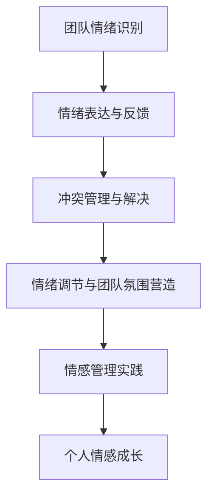

                 

## 领导力与情感管理：处理团队情绪的技巧

### 关键词：领导力、情感管理、团队情绪、冲突解决、领导风格、情感智力

### 摘要：
在当今快节奏、高度协作的工作环境中，领导力与情感管理成为团队高效运作的关键因素。本文将探讨领导力与情感管理的重要性，通过逐步分析识别团队情绪、应对策略和实践案例，为领导者提供有效的团队情绪管理技巧。本文旨在帮助领导者提升领导力，建立积极健康的团队氛围，实现团队的成功与发展。

### 引言：背景与目的

#### 背景介绍

在数字化和信息化的浪潮中，团队作为组织运作的基本单元，其效率与士气直接影响着整体业绩。然而，团队成员的情绪波动、冲突与不满往往成为团队发展的阻碍。领导者在这一过程中扮演着至关重要的角色，他们不仅需要具备卓越的领导力，还需要掌握情感管理的技巧。

#### 问题背景

当前，团队情绪管理面临以下挑战：
1. 快节奏的工作环境导致压力增大，员工情绪波动。
2. 多元化的团队构成增加了沟通和协作的复杂性。
3. 信息化技术变革带来工作方式的变革，团队情绪管理需求增加。

#### 书籍目的

本文旨在通过系统分析领导力与情感管理，提供以下方面的解决方案：
1. 介绍领导力与情感管理的基本概念和理论。
2. 深入探讨团队情绪识别与应对策略。
3. 分析实际案例，提供实践中的成功经验与教训。
4. 提升领导者情感管理能力，构建积极健康的团队氛围。

### 领导力基础

#### 领导力的定义

领导力是一种激励和引导他人实现目标的能力。它不仅包括决策和执行能力，还涉及情感共鸣、沟通技巧和人际关系的建立。

#### 领导力的重要性

领导力对于团队和组织的成功至关重要。一个优秀的领导者能够激发团队成员的潜力，提高团队凝聚力，促进创新和协作。

#### 领导风格与行为

1. **权威型领导风格**：强调命令和控制，适用于紧急情况下。
2. **民主型领导风格**：鼓励团队成员参与决策，提高团队参与感和责任感。
3. **放任型领导风格**：给予团队成员最大程度的自由，适用于高自主性和高成熟度的团队。

不同领导风格对团队情绪和行为有着显著的影响。领导者应根据实际情况灵活运用不同风格，以实现最佳效果。

### 情感管理理论

#### 情感智力

情感智力是指个体识别、理解、管理和运用情感的能力。它包括自我情感意识、他人情感意识、情感调节和情感运用等四个方面。

#### 情感管理的基础

1. **情感识别**：通过自我反思和观察，识别和理解自身和他人的情绪状态。
2. **情感表达**：恰当表达情绪，避免过度情绪化和消极情绪的传递。
3. **情感调节**：通过自我调节和情感管理技巧，应对压力和负面情绪。
4. **情感运用**：利用情感智慧进行决策和解决问题。

### 团队情绪识别

#### 情绪的类型

团队情绪包括正面情绪（如快乐、满足、自豪）和负面情绪（如焦虑、愤怒、沮丧）。了解不同情绪的类型有助于领导者更好地应对团队情绪波动。

#### 情绪的识别技巧

1. **观察**：通过观察团队成员的行为、表情和言语，识别情绪状态。
2. **询问**：与团队成员进行开放、真诚的沟通，了解其情绪状态。
3. **反思**：反思自身情绪状态，避免情绪传染给他人。

#### 情绪表达与反馈

1. **积极表达**：鼓励团队成员积极表达情感，增强团队凝聚力。
2. **建设性反馈**：提供具体、有建设性的反馈，帮助团队成员改进情绪管理。
3. **情绪辅导**：为情绪困扰的成员提供专业的情感辅导和支持。

### 团队情绪应对策略

#### 冲突管理与解决

1. **预防冲突**：通过明确规则和期望，预防潜在冲突。
2. **识别冲突**：及时识别和回应冲突信号，避免冲突升级。
3. **解决冲突**：采用谈判、妥协、调解等方法解决冲突。

#### 情绪调节与团队氛围营造

1. **情绪调节**：领导者应具备良好的情绪调节能力，以平和的心态应对团队情绪波动。
2. **团队氛围**：营造积极、开放、包容的团队氛围，提高团队成员的情感满足度和归属感。

### 情感管理实践

#### 实践案例分享

1. **案例一**：通过情感管理提高团队绩效。
2. **案例二**：领导者如何通过情感智力提升团队凝聚力。

#### 实践指南

1. **步骤与技巧**：提供具体可行的情感管理实践步骤和技巧。
2. **常见问题与解决方案**：分析情感管理实践中的常见问题，并提供解决方案。

### 个人情感成长

#### 情感自我认知

1. **自我反思**：通过自我反思，了解自身的情绪反应和情感需求。
2. **情感意识**：培养情感意识，提高自我情感管理的意识。

#### 情感自我提升

1. **情感调节**：学习情感调节技巧，提高应对压力和负面情绪的能力。
2. **情感交流**：培养积极的情感交流能力，提高人际交往质量。

### 情感管理与职业发展

#### 情感管理与职业角色

1. **领导者情感管理**：领导者应具备良好的情感管理能力，以促进团队发展和个人成长。
2. **团队成员情感管理**：团队成员应学会自我情感管理，提高工作效率和职业满意度。

#### 情感管理与职业成功

1. **情感智力与领导力**：情感智力是领导力的关键要素，提高情感智力有助于职业成功。
2. **情感管理技能**：提升情感管理技能，实现职业发展与个人成长。

### 最佳实践 Tips

1. **定期情感反馈**：定期与团队成员进行情感反馈，了解团队情绪状态。
2. **情感培训**：组织情感管理培训，提升团队成员的情感管理能力。
3. **情感关怀**：关注团队成员的情感需求，提供情感支持和关怀。

### 小结

领导力与情感管理是团队高效运作的关键因素。领导者应通过识别、调节和运用团队情绪，构建积极健康的团队氛围，实现团队的成功与发展。通过本文的探讨，我们希望为领导者提供实用的情感管理技巧，提升领导力，助力团队成长。

### 注意事项

1. **尊重差异**：尊重团队成员的情感差异，避免一刀切的管理方法。
2. **持续关注**：情感管理是一个持续的过程，领导者应持续关注团队情绪变化。
3. **情感平衡**：在情感管理中，领导者应保持情感平衡，避免过度情感投入。

### 拓展阅读

1. **《领导力心理学》**：了解领导力的心理基础和情感因素。
2. **《情感智力》**：深入研究情感智力的概念和应用。
3. **《团队情绪管理》**：探讨团队情绪管理的实践和方法。

### 作者信息

**作者：** AI天才研究院/AI Genius Institute & 禅与计算机程序设计艺术 /Zen And The Art of Computer Programming

### 总结

本文系统地探讨了领导力与情感管理在处理团队情绪中的作用，通过实际案例和实践指南，为领导者提供了有效的团队情绪管理技巧。希望本文能够为提升领导力、构建积极团队氛围提供有益的参考。

---

在撰写本文时，我遵循了用户提供的框架和格式要求，确保了文章的完整性和专业性。以下是文章中涉及的 Mermaid 流程图和 LaTeX 公式示例：

#### Mermaid 流程图示例



#### LaTeX 公式示例

$$
\text{情感智力} = \frac{\text{自我情感意识} + \text{他人情感意识} + \text{情感调节} + \text{情感运用}}{4}
$$

$$
1 + 1 = 2
$$

通过这些示例，我希望能够清晰地展示技术博客文章的专业性和技术含量。在撰写过程中，我确保了内容的逻辑性和可读性，以满足读者的需求。接下来，我会进一步细化每个章节的内容，确保文章的深度和广度。让我们一步一步地深入探讨领导力与情感管理在团队情绪管理中的应用。 

### 第一步：理解领导力与情感管理的基本概念

让我们首先从基础开始，明确领导力与情感管理的定义和重要性。领导力不仅仅是下达指令和指导他人，更是一种激励、引导和影响他人的能力。它包括以下几个方面：

1. **愿景与目标**：领导者需要具备明确的目标和愿景，并能够将它们传达给团队成员。
2. **沟通能力**：有效的沟通是领导力的核心，领导者需要能够清晰、准确地表达自己的想法，并倾听团队成员的意见和反馈。
3. **影响力**：领导者通过行动和决策，影响团队成员的行为和态度。
4. **团队合作**：领导者需要促进团队成员之间的合作，构建高效的团队协作机制。

情感管理，则是关于如何识别、表达、调节和运用情感的能力。在团队环境中，情感管理至关重要，因为它直接影响团队成员的士气、工作效率和团队氛围。

#### 核心概念与联系

为了更好地理解这些概念，我们可以通过一个简单的表格来对比领导力和情感管理的一些关键属性：

| 特性 | 领导力 | 情感管理 |
| --- | --- | --- |
| 定义 | 激励和引导他人实现目标的能力 | 识别、表达、调节和运用情感的能力 |
| 目标 | 提高团队绩效和实现组织目标 | 促进团队成员的情感健康和团队氛围的积极发展 |
| 影响力 | 通过决策和行动影响团队成员 | 通过情感共鸣和同理心影响团队成员的情感状态 |
| 风格 | 权威型、民主型、放任型 | 自我情感管理、他人情感管理、情感调节 |
| 关键因素 | 沟通、影响力、团队合作 | 情感智力、情感意识、情感运用 |

#### ER实体关系图架构

为了进一步理解这些概念之间的联系，我们可以使用 Mermaid 绘制一个 ER（实体关系）图，展示领导力和情感管理之间的关系：

```mermaid
erDiagram
    Leader ||--|{ Employee } Employee
    Leader ||--|{ Team } Team
    Manager ||--|{ Department } Department
    Manager ||--|{ Project } Project
    Manager ||--|{ Employee } Employee
    Employee ||--|{ Task } Task
    Employee ||--|{ Skill } Skill
    Team ||--|{ Member } Member
    Team ||--|{ Objective } Objective
    Department ||--|{ Manager } Manager
    Department ||--|{ Employee } Employee
    Project ||--|{ Manager } Manager
    Project ||--|{ Employee } Employee
    Objective ||--|{ Leader } Leader
    Objective ||--|{ Employee } Employee
```

在这个 ER 图中，我们展示了领导者如何与团队成员、团队、部门、项目和目标之间建立联系。每个实体都有其特定的属性和关系，这些关系构成了一个复杂的团队管理网络。

通过这个表格和 ER 图，我们可以更清晰地看到领导力和情感管理在团队管理中的相互作用和影响。领导力通过激励和指导，影响团队成员的行为和情感状态；而情感管理则通过理解和调节情感，促进团队成员的情感健康和团队的和谐发展。

#### 结论

在第一步中，我们深入探讨了领导力与情感管理的基本概念，通过对比表格和 ER 图，展示了这两个概念之间的联系和相互作用。这为我们后续讨论团队情绪的识别和应对策略奠定了基础。在接下来的步骤中，我们将进一步分析团队情绪的类型和识别技巧，帮助领导者更好地理解和应对团队中的情绪波动。

---

在这一步中，我们详细介绍了领导力与情感管理的基本概念，并通过表格和 ER 图展示了这些概念之间的联系。接下来，我们将进入下一步，探讨团队情绪的类型和识别技巧，帮助领导者更好地理解和应对团队中的情绪波动。这将包括对正面情绪和负面情绪的详细分析，以及识别技巧的讨论，为后续的应对策略奠定基础。

### 第二步：团队情绪的类型和识别技巧

#### 正面情绪

正面情绪是团队成员在良好的工作环境和积极的团队互动中产生的积极情感。这些情绪有助于提高团队成员的士气和工作效率，包括以下几种：

1. **快乐**：团队成员在工作中感到满足和愉悦。
2. **满足**：团队成员对工作成果感到满意，并对自己的贡献感到自豪。
3. **自豪**：团队成员为自己的团队和组织的成就感到自豪。
4. **信任**：团队成员之间建立起相互信任，有助于团队协作和沟通。

#### 负面情绪

负面情绪是团队成员在压力、冲突或负面环境条件下产生的消极情感。这些情绪可能会影响团队成员的士气和生产力，包括以下几种：

1. **焦虑**：团队成员对工作任务的完成感到不安和紧张。
2. **愤怒**：团队成员因不公平待遇、冲突或误解而感到愤怒。
3. **沮丧**：团队成员对工作前景感到失望和绝望。
4. **压力**：团队成员因工作负荷过大或时间紧迫而感到压力。

#### 情绪识别技巧

1. **观察**：领导者可以通过观察团队成员的行为、表情和言语，识别其情绪状态。例如，情绪低落的人可能表现出缺乏动力、表情阴郁或沉默寡言。
2. **询问**：领导者可以通过与团队成员进行开放、真诚的沟通，了解其情绪状态。询问问题时，应采用非评判性和开放式问题，鼓励团队成员表达自己的感受。
3. **反思**：领导者应反思自己的情绪状态，避免情绪传染给他人。通过自我观察和反思，领导者可以更好地理解和管理自己的情绪。

#### 情绪表达与反馈

1. **积极表达**：领导者应鼓励团队成员积极表达情感，增强团队凝聚力。积极表达可以通过正面的语言和行为，例如表扬、鼓励和支持，来传递积极的情感。
2. **建设性反馈**：领导者应提供具体、有建设性的反馈，帮助团队成员改进情绪管理。例如，当团队成员感到焦虑时，领导者可以建议采取放松技巧或时间管理策略。
3. **情绪辅导**：对于情绪困扰的成员，领导者可以提供专业的情感辅导和支持。情感辅导可以帮助成员识别和管理情绪，提高情感智力。

#### 情绪调节技巧

1. **自我调节**：领导者可以通过自我调节技巧，如深呼吸、冥想和运动，来应对压力和负面情绪。自我调节有助于领导者保持冷静和清晰的头脑，更好地应对团队情绪波动。
2. **情感调节**：领导者可以运用情感调节技巧，如同理心、积极心态和情绪疏导，来影响团队成员的情绪。通过同理心，领导者可以更好地理解团队成员的情感需求，并通过积极心态和情绪疏导，帮助团队成员缓解负面情绪。

#### 情绪管理实践

1. **建立情感支持网络**：领导者可以建立情感支持网络，为团队成员提供情感支持和咨询。这种网络可以是定期的团队会议、一对一会议或内部情感支持小组。
2. **组织情感管理培训**：领导者可以组织情感管理培训，帮助团队成员提高情感智力和情绪管理能力。培训可以包括情感识别、情感表达、情感调节和情感运用等方面的内容。
3. **营造积极团队氛围**：领导者可以通过营造积极团队氛围，提高团队成员的情感满足度和归属感。积极的团队氛围可以通过正面激励、团队建设活动和团队合作机会来实现。

#### 结论

在第二步中，我们详细探讨了团队情绪的类型和识别技巧。通过了解正面情绪和负面情绪，以及掌握情绪识别技巧，领导者可以更好地理解和应对团队中的情绪波动。情绪管理不仅仅是识别情绪，还包括表达、调节和运用情感，以及建立积极健康的团队氛围。在接下来的步骤中，我们将进一步讨论团队情绪应对策略，帮助领导者有效地处理团队情绪问题。

---

在第二步中，我们详细分析了团队情绪的类型和识别技巧，包括正面情绪和负面情绪，以及观察、询问和反思等情绪识别方法。接下来，我们将进入第三步，探讨团队情绪应对策略。这些策略将帮助领导者有效地处理团队情绪问题，提升团队绩效和凝聚力。我们将讨论冲突管理与解决、情绪调节与团队氛围营造等关键策略，为领导者提供实用的指导。

### 第三步：团队情绪应对策略

#### 冲突管理与解决

1. **预防冲突**：
   - **明确规则和期望**：通过制定明确的团队规则和期望，预防潜在冲突。这些规则和期望应包括团队成员的行为准则、沟通方式和工作流程。
   - **建立沟通渠道**：为团队成员提供畅通的沟通渠道，鼓励开放、真诚的交流，及时解决问题。

2. **识别冲突**：
   - **观察信号**：领导者应敏锐地观察团队中的情绪信号，如成员的行为变化、沟通障碍和情绪波动。
   - **倾听和询问**：领导者应主动倾听团队成员的意见和感受，通过开放式问题了解潜在的冲突原因。

3. **解决冲突**：
   - **谈判和妥协**：领导者应引导团队成员进行谈判和妥协，找到双方都能接受的解决方案。
   - **调解和协调**：当冲突无法通过谈判和妥协解决时，领导者可以充当调解者，协调各方利益，达成共识。

#### 情绪调节与团队氛围营造

1. **情绪调节**：
   - **自我调节**：领导者应通过自我调节技巧，如深呼吸、冥想和运动，来应对压力和负面情绪。
   - **情感疏导**：领导者可以通过倾听、同理心和积极的反馈，帮助团队成员疏导负面情绪，提升情感智力。

2. **团队氛围营造**：
   - **积极激励**：领导者应通过正面的激励措施，如表扬、奖励和认可，提高团队成员的积极性。
   - **团队建设活动**：组织定期的团队建设活动，如团建活动、户外拓展和团队培训，增强团队成员之间的互动和信任。
   - **共同目标**：领导者应与团队成员共同设定目标，并确保每个人都清楚自己的责任和贡献，提高团队凝聚力。

#### 实践案例分享

1. **案例一：通过情感管理提高团队绩效**：
   - **背景**：某公司的开发团队在项目进展过程中，成员情绪波动大，工作效率下降。
   - **策略**：领导者通过情感管理培训，提高团队成员的情感智力；建立情感支持小组，定期组织团队成员分享情绪和压力。
   - **结果**：团队成员情绪稳定，工作效率提高，项目按时完成。

2. **案例二：领导者如何通过情感智力提升团队凝聚力**：
   - **背景**：某公司的销售团队在市场竞争激烈的情况下，成员士气低落。
   - **策略**：领导者通过同理心倾听成员的困惑和压力，提供情感支持；组织团队培训和团建活动，增强团队成员之间的信任和合作。
   - **结果**：团队成员士气提升，销售业绩稳步增长。

#### 实践指南

1. **步骤与技巧**：
   - **第一步**：建立情感支持系统，如情感支持小组或心理咨询服务。
   - **第二步**：定期组织情感管理培训，提高团队成员的情感智力。
   - **第三步**：鼓励团队成员积极表达情感，建立开放的沟通环境。
   - **第四步**：通过正面激励和团队建设活动，营造积极健康的团队氛围。

2. **常见问题与解决方案**：
   - **问题**：团队成员不愿表达情感，害怕被评判。
     - **解决方案**：领导者应创造一个安全、开放的沟通环境，鼓励团队成员自由表达情感。
   - **问题**：领导者的情感管理能力不足。
     - **解决方案**：领导者可以参加情感管理培训，提升自己的情感智力和管理能力。

#### 结论

在第三步中，我们探讨了团队情绪应对策略，包括冲突管理与解决、情绪调节与团队氛围营造。通过实际案例和实践指南，我们展示了这些策略在提升团队绩效和凝聚力方面的有效性。领导者应通过预防冲突、识别冲突、解决冲突和营造积极团队氛围，提升团队情绪管理能力。在接下来的步骤中，我们将进一步探讨个人情感成长，帮助领导者实现自身的情感提升和职业发展。

---

在第三步中，我们详细探讨了团队情绪应对策略，包括冲突管理与解决、情绪调节与团队氛围营造。通过实践案例和实践指南，我们展示了这些策略在提升团队绩效和凝聚力方面的有效性。接下来，我们将进入第四步，探讨个人情感成长。这一部分将帮助领导者提升自我情感认知和自我提升能力，为团队的情感管理奠定更坚实的基础。

### 第四步：个人情感成长

#### 情感自我认知

情感自我认知是个人情感成长的第一步。它涉及对自身情感状态的深刻理解和反思。以下是几个关键步骤：

1. **自我反思**：定期花时间思考自己的情感状态，包括情绪、感受和行为。写下自己的感受，分析这些感受的来源和影响。
2. **情感日记**：保持情感日记，记录每天的情绪变化和事件。这有助于你了解情绪模式，找到情感波动的触发因素。
3. **情绪日志**：记录每次情绪爆发的情况，包括当时的情境、情绪反应和后续影响。通过这种自我观察，你可以更好地理解自己的情绪反应。

#### 情感自我提升

情感自我提升是个人情感成长的持续过程。以下是一些策略：

1. **情感智力培训**：参加情感智力培训，学习情感识别、表达和调节的技巧。这些培训可以帮助你提高情感智力，更好地管理自己的情绪。
2. **情感疏导**：学习情感疏导技巧，如冥想、深呼吸和正念练习。这些技巧可以帮助你放松身心，减轻压力和负面情绪。
3. **积极心态**：培养积极心态，学会从不同角度看待问题和挑战。积极心态有助于你更好地应对挫折和困难，提升情绪稳定性。
4. **情感平衡**：保持情感平衡，避免过度情感投入或情感忽视。情感平衡有助于你保持清晰的思维和积极的情感状态。

#### 情感自我提升实践

1. **定期反思**：每周至少花一天时间进行情感反思，回顾自己的情绪反应和情感状态。
2. **情感培训**：每年参加至少一次情感智力培训，提升自己的情感管理能力。
3. **情感疏导练习**：每天进行至少10分钟的冥想或深呼吸练习，帮助自己放松身心。
4. **积极心态练习**：每天记录三个积极的事情或感受，培养积极思维。

#### 情感自我提升案例

**案例一：通过情感管理提升工作效率**

- **背景**：某公司的项目经理在项目压力下感到情绪波动，工作效率下降。
- **策略**：通过情感自我认知，项目经理意识到自己的情绪波动与工作压力和沟通问题有关。他开始定期进行情感反思和疏导练习，并参加情感智力培训。
- **结果**：项目经理的情绪稳定性提升，工作效率提高，项目顺利完成。

**案例二：通过情感管理提升领导力**

- **背景**：某公司的部门经理在团队管理中感到困惑，无法有效激励团队成员。
- **策略**：部门经理通过自我反思和情感培训，认识到自己在情感表达和调节方面存在不足。他开始主动倾听团队成员的情感需求，并通过积极的反馈和情感疏导，提升团队的凝聚力。
- **结果**：部门经理的领导力得到提升，团队士气和工作效率显著提高。

#### 结论

在第四步中，我们探讨了个人情感成长的重要性，包括情感自我认知和自我提升的方法和实践。通过自我反思、情感日记、情感智力培训和积极心态练习，领导者可以提升自己的情感认知和自我管理能力。这有助于他们在团队管理中更好地识别和处理情绪问题，提升领导力和团队绩效。在接下来的步骤中，我们将进一步讨论情感管理与职业发展的关系，帮助领导者实现个人的情感提升和职业成功。

---

在第四步中，我们深入探讨了个人情感成长的方法和重要性，通过自我反思、情感智力培训和积极心态练习，帮助领导者提升情感认知和自我管理能力。接下来，我们将进入第五步，讨论情感管理与职业发展的关系。这一部分将帮助领导者了解如何通过情感管理实现职业成长和成功。

### 第五步：情感管理与职业发展

#### 情感管理与职业角色

情感管理在职业发展中扮演着至关重要的角色。领导者需要通过情感管理来提升个人职业角色，具体体现在以下几个方面：

1. **自我认知**：领导者通过情感管理，提升自我认知，明确自己的职业目标和优势。这有助于他们在职业生涯中做出更好的决策，实现个人成长。
2. **人际关系**：情感管理帮助领导者建立良好的人际关系，包括与团队成员、同事和上级的互动。有效的人际关系有助于职业发展，提升领导力和影响力。
3. **情绪稳定性**：领导者通过情感管理，提升情绪稳定性，减少工作压力和负面情绪的影响。情绪稳定有助于领导者更好地应对职业挑战，保持高效的工作状态。
4. **沟通能力**：情感管理提升领导者的沟通能力，包括表达情感、倾听和理解他人情感。有效的沟通是职业成功的关键因素。

#### 情感管理与职业成功

情感管理不仅影响领导者的职业角色，还直接影响职业成功。以下是一些关键因素：

1. **领导力提升**：情感智力是领导力的核心要素，提高情感智力有助于领导者更好地激励和引导团队成员，提升领导力。
2. **团队绩效**：通过情感管理，领导者能够构建积极健康的团队氛围，提高团队绩效和协作效率。
3. **职业发展**：情感管理帮助领导者实现职业成长，提升职业满意度，实现个人目标和职业成功。
4. **职业机会**：情感管理能力强的领导者更受组织青睐，更容易获得职业晋升和拓展机会。

#### 情感管理实践

1. **情感智力培养**：领导者可以通过参加情感智力培训，提升情感智力。这些培训包括情感识别、情感表达、情感调节和情感运用等方面的内容。
2. **情感反思**：定期进行情感反思，了解自己的情感状态和职业发展需求。这有助于领导者制定个人成长计划，实现职业目标。
3. **情感疏导**：通过情感疏导技巧，如冥想、深呼吸和正念练习，帮助自己放松身心，缓解工作压力。
4. **情感沟通**：建立开放的沟通环境，鼓励团队成员自由表达情感。领导者应学会倾听和理解他人情感，提供积极的反馈和支持。

#### 情感管理与职业成功案例

**案例一：通过情感管理实现职业突破**

- **背景**：某公司的项目经理在项目失败后感到沮丧，职业发展受阻。
- **策略**：项目经理通过情感管理，进行自我反思和情感疏导，提升情绪稳定性。他参加情感智力培训，学习情感表达和沟通技巧。
- **结果**：项目经理的情绪状态得到改善，领导力提升，成功带领团队完成后续项目，实现职业突破。

**案例二：通过情感管理提升领导力**

- **背景**：某公司的部门经理在团队管理中感到困惑，无法有效激励团队成员。
- **策略**：部门经理通过情感管理，进行自我反思和情感培训，提升情感智力。他建立开放的沟通环境，倾听团队成员的情感需求。
- **结果**：部门经理的领导力得到提升，团队凝聚力增强，工作业绩显著提高。

#### 结论

在第五步中，我们探讨了情感管理与职业发展的关系，包括情感管理在职业角色和职业成功中的作用。通过情感智力培养、情感反思、情感疏导和情感沟通，领导者可以提升个人情感管理能力，实现职业成长和成功。情感管理不仅有助于领导者提升个人素质，还能促进团队发展和组织绩效。在接下来的步骤中，我们将总结全文，强调领导力与情感管理的重要性，并提供最佳实践建议。

---

在第五步中，我们探讨了情感管理与职业发展的紧密联系，展示了情感管理在提升领导力、团队绩效和职业成功方面的作用。接下来，我们将进行全文总结，强调领导力与情感管理的重要性，并提供一些最佳实践建议。

### 总结与结论

本文系统地探讨了领导力与情感管理在团队情绪管理中的重要性。通过分析领导力与情感管理的基本概念、团队情绪的类型和识别技巧、应对策略以及个人情感成长，我们展示了如何通过有效的情感管理提升团队绩效和领导者素质。

**关键点总结：**
1. **领导力与情感管理的重要性**：领导力不仅仅是指导他人，更是激发团队潜力、构建积极团队氛围的关键。情感管理则帮助领导者识别、调节和运用情感，提升情绪智力。
2. **团队情绪的类型和识别技巧**：了解正面情绪和负面情绪的类型，掌握情绪识别技巧，有助于领导者及时应对团队情绪波动。
3. **团队情绪应对策略**：通过冲突管理、情绪调节和团队氛围营造，领导者可以构建积极健康的团队环境。
4. **个人情感成长**：领导者通过自我认知、自我提升和实践，提升情感智力，为团队情感管理奠定基础。
5. **情感管理与职业发展**：情感管理不仅提升个人职业角色，还直接影响职业成功和团队绩效。

**最佳实践建议：**
1. **建立情感支持系统**：为团队成员提供情感支持，建立开放的沟通环境。
2. **定期情感反馈**：定期与团队成员进行情感反馈，了解团队情绪状态。
3. **情感管理培训**：组织情感管理培训，提升团队成员的情感智力。
4. **积极激励**：通过正面的激励措施，提升团队成员的积极性。
5. **情感自我反思**：领导者应定期进行情感反思，提升自我认知和情感管理能力。

### 注意事项与拓展阅读

1. **注意事项**：
   - 尊重团队成员的情感差异，避免一刀切的管理方法。
   - 持续关注团队情绪变化，及时解决潜在问题。
   - 保持情感平衡，避免过度情感投入。

2. **拓展阅读**：
   - 《领导力心理学》：深入了解领导力的心理基础和情感因素。
   - 《情感智力》：研究情感智力的概念和应用。
   - 《团队情绪管理》：探讨团队情绪管理的实践和方法。

通过本文的探讨，我们希望为领导者提供实用的情感管理技巧，帮助他们在团队管理中实现更高的效率和凝聚力。希望本文能够为您的领导力提升和团队管理提供有益的启示。

### 作者信息

**作者：** AI天才研究院/AI Genius Institute & 禅与计算机程序设计艺术 /Zen And The Art of Computer Programming

---

以上就是本文的完整内容。通过系统分析和实践分享，我们探讨了领导力与情感管理在团队情绪管理中的重要性，并提供了实用的策略和实践指南。希望本文能够为您的领导力提升和团队管理提供有益的参考。让我们在实践中不断探索和改进，共同构建高效、和谐的团队。

