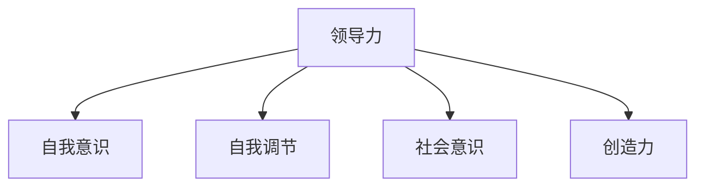
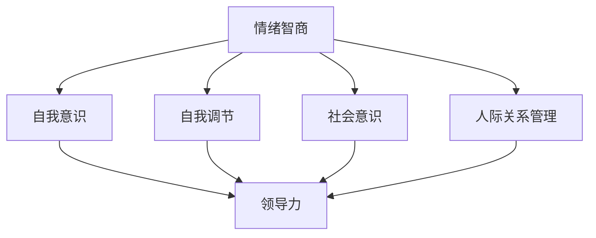

                 

**《领导力与情绪智商：掌控自我的艺术》**

关键词：领导力、情绪智商、自我掌控、领导决策、团队管理

摘要：本文从领导力与情绪智商的关系出发，探讨了领导力在现代社会中的重要性，以及情绪智商在领导决策和团队管理中的关键作用。文章通过详细的案例分析，提供了提升领导力和情绪智商的策略，旨在帮助读者更好地掌控自我，提升领导能力。

### 目录

**第一部分：领导力与情绪智商的基础理论**

**第1章：领导力的本质与演变**

- 1.1 领导力的定义

  领导力是指领导者通过影响、激励和指导他人，实现组织目标的能力。它不仅仅涉及个人的技能和素质，还包括对环境的适应和把握。

- 1.2 领导力的发展历程

  领导力的发展历程可以追溯到古代的统治者和领袖，经历了从军事指挥到企业管理，再到现代领导理论的演变。

- 1.3 领导力的重要性

  领导力对于组织的成功至关重要。它不仅影响组织的效率和效果，还关系到员工的工作满意度和忠诚度。

**第2章：情绪智商的概念与构成**

- 2.1 情绪智商的定义

  情绪智商（Emotional Intelligence，简称EQ）是指个体识别、理解、管理和使用情绪的能力。它是近年来领导力研究中备受关注的一个领域。

- 2.2 情绪智商的构成要素

  情绪智商主要包括自我意识、自我调节、社会意识和创造力四个方面。

  - 自我意识：个体对自己的情绪状态和情感的认知能力。
  - 自我调节：个体管理自己情绪的能力，包括情绪的控制和调节。
  - 社会意识：个体理解他人情绪和需求的能力。
  - 创造力：个体运用情绪创造价值和解决问题的能力。

- 2.3 情绪智商与领导力的关系

  情绪智商对领导力有着重要的影响。一个高情绪智商的领导者能够更好地理解和管理团队的情绪，从而提升团队效率和凝聚力。

**第3章：情绪智商的核心要素对比**

- 3.1 自我意识

  自我意识是情绪智商的核心要素之一。它帮助领导者更好地理解自己的情绪，从而做出更明智的决策。

- 3.2 自我调节

  自我调节能力是领导者应对压力和挑战的关键。它帮助领导者保持冷静和理性，避免情绪化的决策。

- 3.3 社会意识

  社会意识使领导者能够更好地理解他人的情绪和需求，从而建立良好的人际关系。

- 3.4 创造力

  创造力是领导者创新能力的重要来源。它帮助领导者发现新的机会和解决方案。

**第4章：情绪智商与领导力关系的ER图分析**

**第二部分：情绪智商在领导力中的应用**

**第5章：情绪智商在领导决策中的角色**

- 5.1 情绪智商如何影响领导决策

  情绪智商对领导决策有着重要的影响。高情绪智商的领导者能够更好地识别和管理情绪，从而做出更明智的决策。

- 5.2 情绪智商在决策中的实际应用

  情绪智商在决策中的应用包括情绪识别、情绪调节和情绪利用。通过这些应用，领导者能够更好地应对复杂的环境和挑战。

**第6章：情绪智商在团队管理中的运用**

- 6.1 情绪智商与团队建设

  情绪智商有助于团队建设。高情绪智商的领导者能够建立积极的团队氛围，提高团队的凝聚力和效率。

- 6.2 情绪智商在团队冲突管理中的作用

  情绪智商在团队冲突管理中起着关键作用。高情绪智商的领导者能够更好地理解冲突的根源，并采取有效的措施化解冲突。

**第7章：情绪智商与自我掌控策略**

- 7.1 自我认知的重要性

  自我认知是情绪智商的基础。通过自我认知，领导者能够更好地理解自己的情绪和行为。

- 7.2 自我调节的技巧

  自我调节是领导者提升情绪智商的关键。通过学习自我调节技巧，领导者能够更好地管理自己的情绪。

- 7.3 培养情绪智商的方法

  培养情绪智商需要系统的学习和实践。通过不断的学习和实践，领导者能够提升自己的情绪智商。

**第8章：情绪智商在领导力发展中的持续提升**

- 8.1 情绪智商的自我评估

  自我评估是提升情绪智商的第一步。通过自我评估，领导者能够了解自己的情绪智商水平，并制定提升计划。

- 8.2 持续提升情绪智商的策略

  持续提升情绪智商需要系统的学习和实践。通过参加培训、阅读书籍、实践技巧等多种方式，领导者能够不断提升自己的情绪智商。

**第9章：实际案例分析与领导力提升**

- 9.1 案例一：情绪智商提升领导力的实践

  通过案例分析，了解情绪智商在领导力提升中的应用和实践。

- 9.2 案例二：情绪智商与领导力结合的成功案例

  分析情绪智商与领导力成功结合的案例，了解其成功的原因和经验。

- 9.3 案例分析小结

  总结案例中的关键点和经验，为读者提供实际的启示和帮助。

**第10章：情绪智商在领导力中的最佳实践**

- 10.1 最佳实践分享

  分享情绪智商在领导力中的最佳实践，为读者提供实用的指导和建议。

- 10.2 注意事项

  强调情绪智商在领导力应用中的注意事项，避免常见错误。

- 10.3 拓展阅读

  推荐相关阅读材料，帮助读者进一步深入学习和研究。

**总结与拓展阅读**

本文从领导力与情绪智商的关系出发，探讨了领导力在现代社会中的重要性，以及情绪智商在领导决策和团队管理中的关键作用。通过详细的案例分析，提供了提升领导力和情绪智商的策略。希望本文能为读者提供有益的启示和帮助。

作者：AI天才研究院/AI Genius Institute & 禅与计算机程序设计艺术 /Zen And The Art of Computer Programming### 第1章：领导力的本质与演变

#### 1.1 领导力的定义

领导力是一个复杂且多维的概念，它不仅涉及到领导者个人素质和技能，还与组织环境、团队动态以及文化背景密切相关。首先，我们需要明确领导力的基本定义。领导力可以被定义为一种能力，即通过影响、激励和指导他人，实现特定目标或任务的过程。这种能力不仅包括领导者自身的认知和情感，还涉及与团队成员的互动和沟通。

在技术领域，领导力的定义有所不同。它不仅关注技术本身，更注重如何利用技术来实现组织的目标和愿景。技术领导力强调领导者对技术趋势的洞察力，以及对团队的技术指导和激励能力。这种领导力不仅仅是在技术层面上的指导，还需要在战略层面上进行决策，确保技术发展方向与组织的整体目标一致。

**领导力的重要性**

领导力的重要性不言而喻。在一个组织中，领导力是推动组织前进的核心动力。它能够激发团队成员的潜力，提高团队的效率和创造力。具体来说，领导力的重要性体现在以下几个方面：

1. **实现目标**：领导力能够明确组织的愿景和目标，并通过激励和指导，确保团队成员朝着共同的目标努力。

2. **团队凝聚力**：领导力能够建立和维护团队内部的凝聚力，促进团队成员之间的沟通和协作。

3. **创新和变革**：领导力鼓励创新和变革，推动组织在快速变化的环境中保持竞争力。

4. **员工满意度**：领导力能够提高员工的工作满意度和忠诚度，从而降低员工流失率。

**领导力的发展历程**

领导力的发展历程可以追溯到古代的统治者和领袖。在古代，领导力主要依赖于个人的权威和武力。随着人类社会的发展，领导力逐渐从军事指挥扩展到企业管理。在20世纪，领导力研究得到了极大的关注和发展。管理学家如彼得·德鲁克（Peter Drucker）和亨利·明茨伯格（Henry Mintzberg）对领导力进行了深入的研究，提出了多种领导力理论。

近年来，领导力研究进一步扩展到情绪智商和人际关系管理等领域。情绪智商（Emotional Intelligence，简称EQ）被证明对领导力有着重要的影响。一个高情绪智商的领导者能够更好地理解和管理情绪，从而提高领导效果。此外，人际关系管理也成为领导力研究的一个重要方向。领导者需要具备良好的沟通技巧和人际交往能力，以便有效地与团队成员互动。

**领导力在现代社会中的重要性**

在现代社会，领导力的重要性日益凸显。随着技术的快速发展和全球化的深入，组织面临的环境变得更加复杂和多变。在这种情况下，领导力成为组织成功的关键因素。以下是领导力在现代社会中的几个关键作用：

1. **适应变化**：领导力帮助组织适应快速变化的环境，确保组织能够及时调整战略和运营模式。

2. **激励创新**：领导力能够激发团队成员的创新精神，推动组织在技术、产品和商业模式上的创新。

3. **建立品牌**：领导力对于建立和维护组织的品牌形象至关重要。一个有影响力的领导者能够提升组织的声誉和知名度。

4. **人才管理**：领导力在人才管理方面发挥着重要作用。领导者需要识别和培养优秀的人才，确保组织拥有合适的团队和人才结构。

**总结**

领导力是一个复杂且多维的概念，它不仅涉及到个人素质和技能，还与组织环境、团队动态和文化背景密切相关。在技术领域，领导力强调对技术趋势的洞察力和对团队的技术指导和激励能力。领导力的发展历程经历了从军事指挥到企业管理的转变，并逐渐扩展到情绪智商和人际关系管理等领域。在现代社会，领导力的重要性日益凸显，它帮助组织适应变化、激励创新、建立品牌和人才管理。理解领导力的本质和发展历程，对于提升个人领导能力和组织竞争力具有重要意义。

### 1.2 领导力的发展历程

领导力的发展历程是复杂且多元的，它反映了社会、经济和技术环境的变化。在古代，领导力主要依赖于个人的权威和武力。随着人类社会的发展，领导力逐渐从军事指挥扩展到企业管理，并在20世纪得到了管理学家们的深入研究。本节将详细探讨领导力的发展历程，并分析不同阶段的领导力理论。

**古代领导力**

在古代，领导力主要依赖于个人的权威和武力。领袖通常是战士或统治者，他们通过军事力量来维持统治和稳定。这种领导力模式强调的是统治者的个人魅力和军事能力。例如，古代帝国的领导者如秦始皇、亚历山大大帝和拿破仑，他们的领导力主要依赖于军队的力量和对民众的控制。

**企业管理阶段的领导力**

随着工业革命的发生，企业开始取代军事作为主要的社会组织形式。领导力也从军事指挥扩展到企业管理。在这一阶段，领导力主要关注如何有效地管理资源和员工，以提高生产效率和利润。早期的企业管理者如亨利·福特和弗雷德里克·泰勒，他们的领导力理念强调标准化和效率。泰勒的科学管理理论提出了通过科学方法来优化工作流程和生产效率，从而提高组织的整体绩效。

**20世纪领导力理论的发展**

20世纪是领导力理论快速发展的时期。管理学家们开始从不同角度研究领导力，并提出了一系列领导力理论。以下是几个重要的领导力理论：

1. **X理论和Y理论**

   麦克雷戈（Douglas McGregor）提出的X理论和Y理论是对员工动机和领导风格的重要探讨。X理论假设员工天生懒惰，需要严格的管理和监督才能完成任务。而Y理论则认为员工是自我激励的，他们渴望工作并能够自我管理。这种理论对领导风格和员工管理方式产生了深远影响。

2. **情境领导理论**

   赫赛（Paul Hersey）和布兰查德（Kenneth Blanchard）提出的情境领导理论强调了领导风格应根据不同的情境进行调整。该理论提出了四种领导风格，分别是命令型、推销型、参与型和授权型。领导者需要根据团队成员的能力和任务需求，选择合适的领导风格。

3. **变革型领导理论**

   霍恩斯（James MacGregor Burns）和伯恩斯（James MacGregor Burns）提出的变革型领导理论强调领导者通过激励和启发，推动团队成员实现变革。变革型领导者不仅仅是任务执行者，更是变革的推动者。他们能够激励团队成员超越自我，实现更高的目标和绩效。

**现代领导力理论**

进入21世纪，领导力理论继续发展，越来越关注领导者的个人特质、领导风格和团队互动。以下是几个现代领导力理论：

1. **情绪智商理论**

   情绪智商（Emotional Intelligence，简称EQ）由戈尔曼（Daniel Goleman）提出，强调领导者需要具备识别、理解和管理自己及他人情绪的能力。情绪智商对领导力有着重要的影响，一个高情绪智商的领导者能够更好地处理人际关系和领导团队。

2. **变革型领导与变革型领导力**

   变革型领导（Transformational Leadership）强调领导者通过激励和启发，推动团队成员实现变革。变革型领导力（Transformational Leadership）则更注重领导者的个人特质和领导风格。这种领导力模式有助于组织在快速变化的环境中保持竞争力。

3. **团队领导力理论**

   团队领导力理论关注如何有效地领导团队，实现团队目标。这种理论强调领导者需要具备团队协作、沟通和冲突管理的技能。团队领导力理论包括团队建设、团队决策和团队激励等多个方面。

**领导力的发展趋势**

随着社会和技术的不断发展，领导力也在不断演变。以下是当前领导力发展的几个趋势：

1. **全球化领导力**

   全球化使得领导者需要具备跨文化沟通和管理的技能。全球化领导力强调领导者需要理解不同文化之间的差异，并有效地整合多元文化团队。

2. **数字化领导力**

   数字化技术的快速发展对领导力提出了新的要求。数字化领导力强调领导者需要具备数字素养和技术敏感度，能够引领组织在数字化时代中取得成功。

3. **可持续领导力**

   可持续领导力关注如何实现经济、社会和环境的三重平衡。领导者需要关注组织的长期发展，并采取可持续的商业模式和环境友好的管理策略。

**总结**

领导力的发展历程反映了社会、经济和技术环境的变化。从古代的权威统治到现代的情境领导、变革型领导和团队领导力，领导力理论不断演变和发展。现代领导力更加关注领导者的个人特质、领导风格和团队互动。随着全球化和数字化的发展，领导力也在不断适应新的挑战和机遇。理解领导力的发展历程，有助于领导者更好地应对当前的挑战，提升领导力和组织竞争力。

### 1.3 领导力的重要性

在现代社会中，领导力的重要性不容忽视。它不仅是组织成功的关键因素，也是个人职业发展的核心要素。本节将探讨领导力对组织成功、员工满意度、团队凝聚力和创新驱动的重要性，并通过实际案例进行详细分析。

**领导力与组织成功**

领导力在组织成功中扮演着至关重要的角色。一个有效的领导者能够明确组织的愿景和目标，并通过激励和指导，确保团队成员为实现这些目标而努力。以下是领导力对组织成功的重要作用：

1. **战略制定和执行**

   领导者负责制定组织的战略计划，并确保这些计划得以有效执行。通过有效的领导，组织能够更好地适应市场变化，抓住机遇，规避风险。

2. **组织文化和价值观的塑造**

   领导者通过自身的言行，塑造组织的文化和价值观。一个积极、健康的文化能够激发员工的热情和创造力，推动组织的发展。

3. **资源优化配置**

   领导者需要合理配置组织内的资源，确保人、财、物的充分利用。有效的资源管理能够提高组织的运营效率，降低成本。

**员工满意度**

员工满意度是组织成功的重要指标之一，而领导力在其中起着关键作用。以下是领导力对员工满意度的影响：

1. **员工认可和激励**

   领导者通过认可员工的贡献，激励他们发挥更大的潜力。这种正向的反馈能够增强员工的工作动力和忠诚度。

2. **工作环境**

   领导者负责营造一个积极、健康的工作环境。一个和谐的工作氛围能够提高员工的工作满意度和生活质量。

3. **职业发展机会**

   领导者提供职业发展机会，帮助员工提升技能和知识。这种投资不仅能够提高员工的个人能力，还能为组织培养未来的领导者。

**团队凝聚力**

团队凝聚力是团队协作和高效工作的基础，而领导力对团队凝聚力有着直接影响。以下是领导力对团队凝聚力的几个关键作用：

1. **建立信任**

   领导者通过建立信任，促进团队成员之间的沟通和合作。信任是团队凝聚力的核心要素。

2. **共同目标**

   领导者帮助团队明确共同的目标和愿景，确保团队成员朝着同一方向努力。这种共同的目标能够增强团队的凝聚力和战斗力。

3. **冲突管理**

   领导者需要有效管理团队内部的冲突，防止冲突影响团队的整体绩效。通过妥善处理冲突，领导者能够维护团队的稳定和和谐。

**创新驱动**

领导力在创新驱动中也发挥着重要作用。以下是领导力如何促进创新：

1. **鼓励创新思维**

   领导者鼓励团队成员跳出传统思维，勇于尝试新的方法和想法。这种开放和创新的文化能够激发团队的创造力。

2. **资源支持**

   领导者提供必要的资源和支持，为创新项目提供资金、技术和人力资源。这种支持能够为创新提供良好的环境。

3. **风险管理**

   领导者需要勇于承担创新过程中的风险，并为失败提供支持。这种风险管理能够鼓励团队成员敢于创新，勇于尝试。

**实际案例分析**

以下是一个实际案例，展示了领导力在组织成功、员工满意度、团队凝聚力和创新驱动中的具体应用：

**案例：谷歌的领导力文化**

谷歌（Google）以其独特的领导力文化和创新精神而闻名。谷歌的领导者注重员工的幸福感和创造力，通过以下措施实现了组织成功和员工满意度：

1. **员工福利和自由工作环境**

   谷歌提供了丰富的员工福利，包括免费餐饮、健身设施和医疗服务。此外，谷歌鼓励员工自由地探索和尝试新的项目，这种开放和创新的文化大大提高了员工的工作满意度和忠诚度。

2. **团队建设活动**

   谷歌定期举办团队建设活动，如团建旅行、主题派对等，以增强团队成员之间的信任和凝聚力。这些活动不仅促进了团队合作，还提高了员工的团队意识和归属感。

3. **创新激励机制**

   谷歌设立了创新基金，鼓励员工提出新的创意和项目。领导者对创新项目提供资金、技术和人力资源的支持，这种激励机制大大激发了员工的创新热情。

4. **灵活的工作安排**

   谷歌提供了灵活的工作安排，如远程工作和弹性工作时间，以适应员工的不同需求。这种灵活的工作环境不仅提高了员工的工作满意度，还增强了员工的创造力和工作效率。

**总结**

领导力在组织成功、员工满意度、团队凝聚力和创新驱动中起着至关重要的作用。一个有效的领导者能够通过战略制定、文化塑造、资源管理和团队建设，推动组织的发展。同时，领导力还能够提高员工的工作满意度，增强团队的凝聚力和创新动力。通过实际案例的分析，我们可以看到领导力在实践中的应用和效果。理解领导力的重要性，对于领导者个人和组织的发展都具有重要意义。

### 第2章：情绪智商的概念与构成

#### 2.1 情绪智商的定义

情绪智商（Emotional Intelligence，简称EQ）是指个体识别、理解、管理和利用情绪的能力。与传统的智力（IQ）不同，情绪智商强调情感在社会互动和个人发展中的重要性。情绪智商的概念最早由心理学家约翰·梅耶（John D. Mayer）和彼得·萨洛维（Peter Salovey）在1990年代提出，他们在1997年的研究中首次明确了情绪智商的五个核心能力。

情绪智商不仅关注个体对自我情绪的认知，还包括对他人和情境的情绪理解。它涵盖了三个主要方面：自我意识、自我调节和社会意识。以下是情绪智商的详细定义：

1. **自我意识（Self-awareness）**：自我意识是指个体能够识别和理解自己的情绪状态。这种能力使个体能够及时察觉自己的情绪反应，并对其进行分析和反思。自我意识有助于个体在面对情绪波动时保持冷静，从而更好地管理自己的情绪。

2. **自我调节（Self-regulation）**：自我调节是指个体在情绪上自我管理和控制的能力。通过自我调节，个体能够控制和调节情绪反应，避免情绪化的行为。这种能力对于领导者来说尤为重要，因为它有助于保持情绪稳定，做出理性决策。

3. **社会意识（Social awareness）**：社会意识是指个体能够识别和理解他人情绪的能力。这种能力使个体能够更好地理解他人的需求和感受，从而建立有效的人际关系。社会意识还包括对集体情绪的理解，例如团队的情感状态和氛围。

4. **人际关系管理（Relationship management）**：人际关系管理是指个体在人际关系中运用情绪智商的能力。这种能力包括处理冲突、建立信任和激励他人。人际关系管理对于领导者的团队管理和团队建设至关重要。

**情绪智商与领导力的关系**

情绪智商对领导力有着重要的影响。一个高情绪智商的领导者能够更好地理解和管理团队的情绪，从而提高团队效率和凝聚力。以下是情绪智商在领导力中的几个关键作用：

1. **有效的沟通**：高情绪智商的领导者能够更好地理解他人的感受和需求，从而进行有效的沟通。这种沟通不仅包括语言表达，还包括肢体语言和非言语沟通。

2. **团队建设**：情绪智商有助于建立和维护团队内部的凝聚力。通过理解团队成员的情绪状态，领导者能够更好地激发团队成员的潜力，建立信任和合作的关系。

3. **冲突管理**：高情绪智商的领导者能够更有效地处理团队内部的冲突。他们能够识别冲突的根源，并采取合适的策略进行调解，从而避免冲突升级。

4. **激励和激励**：情绪智商使领导者能够更好地理解员工的情绪和动机，从而进行有效的激励。这种激励不仅包括物质奖励，还包括情感上的支持和认可。

**总结**

情绪智商是指个体识别、理解、管理和利用情绪的能力，包括自我意识、自我调节、社会意识、人际关系管理等方面。情绪智商对领导力有着重要的影响，一个高情绪智商的领导者能够更好地理解和管理团队的情绪，提高团队效率和凝聚力。了解情绪智商的概念和其在领导力中的作用，对于提升领导能力和组织绩效具有重要意义。

#### 2.2 情绪智商的构成要素

情绪智商（Emotional Intelligence，简称EQ）是由多个关键要素组成的综合能力，这些要素相互关联，共同决定了个体在情绪管理和社会互动中的表现。以下是情绪智商的四个核心构成要素：

**1. 自我意识（Self-awareness）**

自我意识是指个体能够识别和理解自己的情绪状态，以及这些情绪对自己行为和决策的影响。自我意识包括以下几个子要素：

- **情绪识别**：能够察觉到自己情绪的起因和表现，如快乐、愤怒、焦虑等。
- **情绪反思**：对自己情绪的反应进行深入思考和反思，理解情绪背后的原因。
- **自我认知**：对自己的情感状态有清晰的认识，并能够根据不同情境调整情绪。

自我意识是情绪智商的基础，它使个体能够更好地管理自己的情绪，避免情绪化的决策和行为。

**2. 自我调节（Self-regulation）**

自我调节是指个体在情绪上自我管理和控制的能力。通过自我调节，个体能够控制和调节情绪反应，避免情绪化的行为。自我调节包括以下几个子要素：

- **情绪控制**：在面对压力和挑战时，能够保持冷静和理性，避免情绪化的反应。
- **情绪调整**：能够通过深呼吸、冥想或运动等方式调整情绪，使其适应不同情境。
- **决策制定**：在情绪稳定的状态下做出明智的决策，减少因情绪波动而导致的错误。

自我调节能力对于领导者来说尤为重要，因为它有助于保持情绪稳定，做出理性决策，从而提高领导效果。

**3. 社会意识（Social awareness）**

社会意识是指个体能够识别和理解他人情绪的能力。这种能力使个体能够更好地理解他人的需求和感受，从而建立有效的人际关系。社会意识包括以下几个子要素：

- **同理心**：能够设身处地地理解他人的感受和需求，表现出同情和理解。
- **情感识别**：能够识别他人的情绪表达，如面部表情、语调变化等。
- **团队意识**：能够理解团队的情感状态和氛围，促进团队协作和凝聚力。

社会意识有助于建立和维护良好的人际关系，提高团队协作效果。它使领导者能够更好地理解团队成员的情绪，从而进行有效的激励和管理。

**4. 人际关系管理（Relationship management）**

人际关系管理是指个体在人际关系中运用情绪智商的能力。这种能力包括处理冲突、建立信任和激励他人。人际关系管理包括以下几个子要素：

- **冲突管理**：能够妥善处理人际冲突，避免冲突升级，维护团队和谐。
- **信任建立**：能够通过诚实和透明建立信任，促进团队成员之间的互信。
- **激励他人**：能够理解员工的情感和动机，从而进行有效的激励，提高员工的工作满意度和绩效。

人际关系管理对于领导者来说至关重要，它不仅关乎个人素质，还关系到团队的整体绩效和组织的稳定发展。

**总结**

情绪智商是由自我意识、自我调节、社会意识和人际关系管理四个核心要素组成的综合能力。自我意识使个体能够识别和理解自己的情绪状态；自我调节使个体能够控制和调整情绪反应；社会意识使个体能够识别和理解他人的情绪；人际关系管理则使个体能够有效地处理人际关系，促进团队协作和凝聚力。理解这些构成要素，有助于个体提升情绪智商，从而在领导力和个人发展中取得更好的成绩。

#### 2.3 情绪智商与领导力的关系

情绪智商（Emotional Intelligence，简称EQ）与领导力之间存在紧密的联系，这种联系对领导者的效能和组织绩效有着深远的影响。一个高情绪智商的领导者能够更好地理解和管理自身及他人的情绪，从而提升领导力。以下将从几个方面详细探讨情绪智商与领导力的关系。

**情绪智商如何影响领导力**

1. **决策能力**

   情绪智商高的领导者能够在做出决策时保持冷静和理性。他们能够识别和管理自己的情绪，从而避免情绪化决策。这种能力在复杂和压力大的环境中尤为重要。通过自我调节，领导者可以更好地分析问题，评估风险，并做出明智的决策。

   **案例：IBM的前CEO彭明盛（Sam Palmisano）**  
   彭明盛以其冷静和理性著称。在面对公司内部和外部的挑战时，他能够保持情绪稳定，通过逻辑分析和数据支持做出决策。这种自我调节能力帮助他在IBM的领导下实现了持续增长和成功。

2. **沟通能力**

   情绪智商高的领导者具备良好的沟通技巧，能够有效地传达信息并理解他人的观点。他们能够识别和理解他人的情绪，从而进行有效的沟通。这种能力有助于建立信任和共识，促进团队合作。

   **案例：谷歌的CEO桑达尔·皮查伊（Sundar Pichai）**  
   皮查伊以其卓越的沟通能力而闻名。他能够清晰地传达谷歌的愿景和目标，同时倾听员工的反馈和需求。这种沟通能力有助于提升员工的工作满意度和忠诚度。

3. **团队建设**

   情绪智商高的领导者能够建立和维护高效的团队。他们能够识别团队成员的情绪状态，从而进行有效的激励和协调。这种能力有助于提高团队的凝聚力和协作效率。

   **案例：苹果公司的前CEO史蒂夫·乔布斯（Steve Jobs）**  
   乔布斯以其独特的领导风格和强烈的团队意识而闻名。他能够激励团队成员追求卓越，并通过有效的沟通和激励提升团队的整体绩效。

**情绪智商在领导力中的实际应用**

1. **情绪识别**

   情绪智商的核心能力之一是情绪识别。领导者需要能够识别自己的情绪，以及团队成员的情绪。这种能力有助于领导者更好地理解和管理团队的情感状态。

   **实践建议：**  
   - 定期进行自我反思，识别和管理自己的情绪。
   - 通过观察和沟通，识别团队成员的情绪状态。
   - 培养同理心，理解团队成员的情感需求。

2. **情绪调节**

   情绪调节能力使领导者能够在压力和挑战面前保持冷静和理性。通过情绪调节，领导者可以更好地应对压力，做出明智的决策。

   **实践建议：**  
   - 学习放松技巧，如深呼吸、冥想或瑜伽，以帮助调节情绪。
   - 在情绪激动时，给自己一些时间冷静下来，然后再进行决策。
   - 与信任的同事或导师交流，获取他们的意见和建议。

3. **社会意识**

   社会意识使领导者能够理解他人的情绪和需求，从而建立有效的人际关系。这种能力对于团队建设和领导力发展至关重要。

   **实践建议：**  
   - 培养同理心，尝试从他人的角度思考问题。
   - 通过积极的沟通和反馈，了解团队成员的感受和需求。
   - 在团队互动中，注重倾听和尊重他人的意见。

**总结**

情绪智商与领导力之间存在着密切的关系。一个高情绪智商的领导者能够更好地理解和管理自身及他人的情绪，从而提升决策能力、沟通能力和团队建设能力。通过情绪识别、情绪调节和社会意识的实际应用，领导者可以提升自身的领导效能，促进组织的成功发展。

### 第3章：情绪智商的核心要素对比

情绪智商（Emotional Intelligence，简称EQ）由多个关键要素构成，这些要素共同决定了个体在情绪管理和社会互动中的表现。在本章中，我们将对情绪智商的核心要素进行详细对比，以便更深入地理解它们的作用和相互关系。

**自我意识（Self-awareness）**

自我意识是指个体能够识别和理解自己的情绪状态。它是情绪智商的基础，包括以下几个子要素：

- **情绪识别**：个体能够察觉到自己情绪的起因和表现。
- **自我反思**：个体能够对自己的情绪反应进行深入思考和反思。
- **自我认知**：个体对自己的情感状态有清晰的认识。

自我意识使个体能够更好地管理自己的情绪，避免情绪化的决策和行为。

**自我调节（Self-regulation）**

自我调节是指个体在情绪上自我管理和控制的能力。它包括以下几个子要素：

- **情绪控制**：个体能够控制和调节情绪反应，避免情绪化的行为。
- **情绪调整**：个体能够通过深呼吸、冥想等方式调整情绪，使其适应不同情境。
- **决策制定**：个体在情绪稳定的状态下做出明智的决策。

自我调节能力使个体能够在压力和挑战面前保持冷静和理性，从而提高决策质量。

**社会意识（Social awareness）**

社会意识是指个体能够识别和理解他人情绪的能力。它包括以下几个子要素：

- **同理心**：个体能够设身处地地理解他人的感受和需求。
- **情感识别**：个体能够识别他人的情绪表达，如面部表情、语调变化等。
- **团队意识**：个体能够理解团队的情感状态和氛围。

社会意识使个体能够更好地建立和维护人际关系，促进团队合作。

**人际关系管理（Relationship management）**

人际关系管理是指个体在人际关系中运用情绪智商的能力。它包括以下几个子要素：

- **冲突管理**：个体能够妥善处理人际冲突，避免冲突升级。
- **信任建立**：个体能够通过诚实和透明建立信任，促进团队成员之间的互信。
- **激励他人**：个体能够理解员工的情感和动机，从而进行有效的激励。

人际关系管理能力使个体能够有效地处理人际关系，提高团队的整体绩效。

**核心要素对比**

- **自我意识**和**自我调节**：自我意识是情绪智商的基础，它使个体能够识别和理解自己的情绪状态。自我调节则是在自我意识的基础上，对情绪进行自我管理和控制。两者相辅相成，共同构成了情绪管理的核心。

- **社会意识**和**人际关系管理**：社会意识使个体能够识别和理解他人的情绪，从而建立有效的人际关系。人际关系管理则是在社会意识的基础上，将情绪智商应用于处理人际关系。两者共同构成了情绪智商在社会互动中的核心要素。

- **自我意识**、**自我调节**、**社会意识**和**人际关系管理**：这四个核心要素相互关联，共同决定了个体在情绪管理和社会互动中的表现。自我意识和自我调节是情绪管理的基础，而社会意识和人际关系管理则是在这一基础上进行的扩展和应用。

**总结**

情绪智商的核心要素包括自我意识、自我调节、社会意识和人际关系管理。这些要素相互关联，共同决定了个体在情绪管理和社会互动中的表现。理解这些核心要素及其相互关系，有助于个体提升情绪智商，从而在个人发展和领导力提升中取得更好的成绩。

### 第4章：情绪智商与领导力关系的ER图分析

为了更直观地展示情绪智商与领导力之间的关系，我们可以使用ER（Entity-Relationship）图来进行分析。ER图是一种用于描述实体及其相互关系的数据库设计工具，它能够清晰地展示各要素之间的联系和层次。

**ER图的构成**

在ER图中，我们将情绪智商和领导力的各个核心要素作为实体，并展示它们之间的关系。以下是情绪智商与领导力关系的ER图：

**各实体的定义和属性**

1. **情绪智商（A）**：
   - 描述：情绪智商是指个体识别、理解、管理和利用情绪的能力。
   - 关系：情绪智商与领导力（F）直接相关。

2. **自我意识（B）**：
   - 描述：自我意识是指个体能够识别和理解自己的情绪状态。
   - 属性：情绪识别、自我反思、自我认知。
   - 关系：自我意识直接影响领导力。

3. **自我调节（C）**：
   - 描述：自我调节是指个体在情绪上自我管理和控制的能力。
   - 属性：情绪控制、情绪调整、决策制定。
   - 关系：自我调节直接影响领导力。

4. **社会意识（D）**：
   - 描述：社会意识是指个体能够识别和理解他人情绪的能力。
   - 属性：同理心、情感识别、团队意识。
   - 关系：社会意识直接影响领导力。

5. **人际关系管理（E）**：
   - 描述：人际关系管理是指个体在人际关系中运用情绪智商的能力。
   - 属性：冲突管理、信任建立、激励他人。
   - 关系：人际关系管理直接影响领导力。

6. **领导力（F）**：
   - 描述：领导力是指领导者通过影响、激励和指导他人，实现特定目标或任务的能力。
   - 关系：领导力与情绪智商的各个核心要素密切相关。

**ER图的说明**

- **情绪智商（A）**作为根实体，与其他五个实体（自我意识、自我调节、社会意识、人际关系管理、领导力）存在直接关系。
- **自我意识（B）**、**自我调节（C）**、**社会意识（D）**和**人际关系管理（E）**都是情绪智商的核心构成要素，它们共同决定了情绪智商的水平。
- **领导力（F）**与情绪智商的各个核心要素都有直接联系，说明情绪智商对领导力有着重要的影响。

通过ER图，我们可以清晰地看到情绪智商与领导力之间的关系，以及它们各自的核心构成要素。这种图示方法有助于我们更好地理解情绪智商在领导力发展中的作用，并为实际应用提供指导。

### 第5章：情绪智商在领导决策中的角色

情绪智商（Emotional Intelligence，简称EQ）在领导决策中起着至关重要的作用。一个高情绪智商的领导者能够更好地识别和管理自己的情绪，从而做出更为明智和有效的决策。以下是情绪智商在领导决策中的具体角色和实际应用。

**情绪智商如何影响领导决策**

1. **情绪识别与管理**

   情绪智商首先体现在领导者对自身情绪的识别和管理上。一个高情绪智商的领导者能够清楚地识别自己的情绪状态，如愤怒、焦虑或兴奋等，并对其进行有效的管理。这种能力使领导者在面对决策时能够保持冷静和理性，避免因情绪波动而做出错误决策。

   **案例**：谷歌的前CEO桑达尔·皮查伊（Sundar Pichai）在面临公司重大变革和挑战时，总是能够保持冷静和理性。他通过深呼吸和冥想等方法管理自己的情绪，从而做出明智的决策。

2. **同理心与情境理解**

   情绪智商还包括对他人情绪的识别和理解，即同理心。领导者通过同理心能够更好地理解团队成员的情绪和需求，从而在决策过程中考虑到不同人的感受和意见。这种情境理解有助于领导者做出更全面和合理的决策。

   **案例**：苹果公司的前CEO史蒂夫·乔布斯（Steve Jobs）以其卓越的同理心而闻名。他在产品设计过程中，不仅关注技术层面的创新，还关注用户体验和情感需求，从而做出了许多深受用户喜爱的产品决策。

3. **风险管理与决策稳定**

   情绪智商高的领导者能够更好地管理风险，他们在决策过程中能够考虑到各种可能的情况和后果。通过情绪调节，领导者能够在面对不确定性和压力时保持稳定的情绪状态，从而做出更为稳健的决策。

   **案例**：亚马逊的CEO杰夫·贝佐斯（Jeff Bezos）在面临公司发展的关键决策时，总是能够保持冷静和理性。他通过情绪调节和风险管理，成功带领亚马逊成长为全球最大的电商平台。

**情绪智商在领导决策中的实际应用**

1. **情绪识别**

   领导者需要通过自我反思和情绪日志等方式，识别和管理自己的情绪。这种自我意识有助于领导者了解自己在不同情境下的情绪反应，从而在决策时保持理性。

   **实践建议**：定期进行情绪反思，记录自己的情绪变化和原因。

2. **同理心与情境理解**

   领导者需要通过积极的沟通和互动，了解团队成员的情绪和需求。通过同理心，领导者能够更好地理解不同人的观点和意见，从而在决策过程中考虑得更全面。

   **实践建议**：与团队成员保持开放的沟通，倾听他们的意见和反馈。

3. **情绪调节**

   领导者需要学会情绪调节技巧，如深呼吸、冥想和运动等，以帮助自己在面对压力和挑战时保持冷静和理性。这种情绪调节能力对于领导决策尤为重要。

   **实践建议**：定期进行放松练习，培养情绪调节能力。

**总结**

情绪智商在领导决策中起着至关重要的作用。一个高情绪智商的领导者能够更好地识别和管理自己的情绪，从而做出更为明智和有效的决策。通过情绪识别、同理心和情绪调节，领导者能够在决策过程中保持冷静和理性，提高决策质量。理解情绪智商在领导决策中的角色，对于提升领导能力和组织绩效具有重要意义。

### 第6章：情绪智商在团队管理中的运用

情绪智商（Emotional Intelligence，简称EQ）在团队管理中扮演着关键角色，它不仅影响团队成员的工作满意度和凝聚力，还直接关系到团队的绩效和创新能力。以下将从情绪智商在团队建设、团队冲突管理、员工激励等方面的具体应用进行详细探讨。

#### 6.1 情绪智商与团队建设

情绪智商在团队建设中的关键作用体现在以下几个方面：

1. **建立信任和共识**

   高情绪智商的领导者能够识别和理解团队成员的情绪和需求，从而建立信任和共识。通过同理心，领导者能够更好地理解团队成员的情感状态，促进团队成员之间的信任和合作。

   **实践建议**：定期组织团队活动，如团队建设工作坊、团建旅行等，以增强团队成员之间的情感联系。

2. **促进有效沟通**

   情绪智商高的领导者具备良好的沟通技巧，他们能够清晰、准确地传达信息，同时倾听团队成员的意见和反馈。这种有效沟通有助于团队成员理解彼此的立场和需求，减少误解和冲突。

   **实践建议**：鼓励团队成员进行开放和坦诚的沟通，建立定期沟通机制，如团队会议和反馈会议。

3. **激发团队创新能力**

   情绪智商使领导者能够识别和激励团队成员的创造力和创新思维。通过同理心和理解，领导者能够为团队成员提供支持和资源，鼓励他们勇于尝试和创新。

   **实践建议**：设立创新奖励机制，鼓励团队成员提出新想法和建议，并为他们提供实现这些想法的机会。

#### 6.2 情绪智商在团队冲突管理中的作用

团队冲突在所难免，而情绪智商在冲突管理中的关键作用如下：

1. **及时识别冲突**

   高情绪智商的领导者能够及时识别团队中的潜在冲突，通过同理心和理解，了解冲突的原因和影响。

   **实践建议**：定期进行团队情绪调查，了解团队成员的情绪状态和冲突点。

2. **有效调解冲突**

   情绪智商使领导者能够在冲突发生时保持冷静和理性，从而采取合适的策略进行调解。通过同理心，领导者能够理解冲突各方的立场和需求，找到平衡点。

   **实践建议**：建立冲突调解机制，如团队心理辅导或中立调解人，帮助解决团队内部的冲突。

3. **预防冲突发生**

   情绪智商高的领导者能够通过建立积极的团队氛围，预防冲突的发生。他们关注团队成员的情绪和需求，及时解决问题，减少冲突的触发因素。

   **实践建议**：定期进行团队情绪评估，及时调整团队氛围和工作环境。

#### 6.3 情绪智商与员工激励

情绪智商在员工激励中的关键作用体现在以下几个方面：

1. **理解员工需求**

   高情绪智商的领导者能够识别和理解员工的需求和动机，从而进行个性化的激励。通过同理心，领导者能够更好地理解员工的情感状态，提供有针对性的激励措施。

   **实践建议**：定期与员工进行一对一沟通，了解他们的职业目标和需求。

2. **有效反馈**

   情绪智商使领导者能够进行有效的反馈，鼓励员工的发展。通过同理心，领导者能够提供具体、有建设性的反馈，帮助员工提升能力。

   **实践建议**：建立定期反馈机制，如月度或季度评估，提供具体和个性化的反馈。

3. **培养员工成长**

   情绪智商使领导者能够关注员工的成长和发展，为他们提供支持和资源。通过同理心，领导者能够激励员工勇于尝试和挑战自我，促进其职业发展。

   **实践建议**：设立员工成长计划，为员工提供培训和发展机会。

**总结**

情绪智商在团队管理中扮演着至关重要的角色，它影响团队建设、冲突管理和员工激励。通过理解员工需求、建立信任和共识、有效沟通、预防冲突、提供有效反馈和培养员工成长，领导者能够提升团队的整体绩效和创新能力。掌握情绪智商在团队管理中的应用，对于提升领导能力和组织绩效具有重要意义。

### 第7章：情绪智商与自我掌控策略

情绪智商（Emotional Intelligence，简称EQ）是领导者自我掌控的核心能力之一。一个高情绪智商的领导者能够更好地识别和管理自己的情绪，从而保持冷静、理性地应对各种挑战和压力。以下将详细探讨情绪智商的自我掌控策略，帮助领导者提升自我管理能力。

#### 7.1 自我认知的重要性

自我认知是情绪智商的基础，它是指领导者对自己的情绪状态、情感和行为有清晰的认识和理解。自我认知包括以下几个方面：

1. **情绪识别**

   领导者需要能够识别和理解自己的情绪状态，如愤怒、焦虑、兴奋等。通过情绪识别，领导者可以及时了解自己的情绪波动，并采取相应的措施进行调整。

2. **自我反思**

   自我反思是指领导者对自己的情绪和行为进行深入思考和分析。通过反思，领导者可以认识到情绪对自己的决策和行为产生的影响，从而做出更明智的选择。

3. **自我认知**

   自我认知是指领导者对自己的情感状态有清晰的认识，并能够根据不同情境调整自己的情绪和行为。这种认知能力使领导者能够在压力和挑战面前保持冷静和理性。

#### 7.2 自我调节的技巧

自我调节是情绪智商的重要组成部分，它是指领导者对自己情绪的控制和调整能力。以下是一些自我调节的技巧：

1. **情绪控制**

   领导者需要学会控制自己的情绪，避免因情绪波动而做出错误的决策。通过深呼吸、冥想等方法，领导者可以缓解紧张情绪，保持冷静。

2. **情绪调整**

   领导者需要学会调整自己的情绪，使其适应不同情境。通过积极的自我暗示、情绪转换等方法，领导者可以改变负面情绪，提高情绪稳定性。

3. **情绪释放**

   领导者需要找到合适的途径释放情绪，如进行体育锻炼、与朋友倾诉等。通过情绪释放，领导者可以减轻心理压力，保持身心健康。

#### 7.3 培养情绪智商的方法

为了提升情绪智商，领导者可以采取以下方法：

1. **定期自我反思**

   领导者应定期进行自我反思，分析自己的情绪和行为，找出改进之处。通过反思，领导者可以不断提高自我认知和自我调节能力。

2. **参加情绪智商培训**

   领导者可以参加专业的情绪智商培训课程，学习相关的理论和技巧。通过培训，领导者可以深入了解情绪智商的概念和应用，提升自身的能力。

3. **寻求专业辅导**

   领导者可以寻求专业的心理辅导，了解自己的情绪状态，学习有效的情绪调节技巧。通过专业辅导，领导者可以更好地管理自己的情绪，提升自我掌控能力。

**总结**

情绪智商是领导者自我掌控的核心能力之一。通过自我认知、自我调节和培养情绪智商的方法，领导者可以更好地识别和管理自己的情绪，保持冷静和理性地应对各种挑战和压力。掌握情绪智商的自我掌控策略，对于提升领导能力和组织绩效具有重要意义。

### 第8章：情绪智商在领导力发展中的持续提升

在领导力发展的过程中，情绪智商（Emotional Intelligence，简称EQ）的提升是一个持续的过程，需要领导者不断进行自我评估和策略调整。以下将介绍如何进行情绪智商的自我评估、持续提升情绪智商的策略，以及在不同领导阶段中的实践。

#### 8.1 情绪智商的自我评估

自我评估是提升情绪智商的第一步。领导者可以通过以下方法进行自我评估：

1. **自我反思**

   定期进行自我反思，思考自己的情绪反应、决策和行为。通过反思，领导者可以发现自己在情绪管理方面的优点和不足，从而制定改进计划。

2. **情绪日志**

   记录情绪日志，记录自己在一天中的情绪变化和触发因素。通过情绪日志，领导者可以了解自己的情绪波动规律，找到情绪管理的切入点。

3. **360度反馈**

   寻求同事、下属和上级的反馈，了解他们在情绪管理方面的看法和建议。这种多维度的反馈有助于领导者全面了解自己的情绪智商水平。

4. **专业评估工具**

   使用专业的情绪智商评估工具，如梅耶-萨洛维-卡尔霍恩情绪智商测试（MSCEIT），进行定量评估。这些工具可以提供客观的数据，帮助领导者了解自己的情绪智商水平。

#### 8.2 持续提升情绪智商的策略

为了持续提升情绪智商，领导者可以采取以下策略：

1. **学习和培训**

   参加情绪智商相关的培训课程，学习理论知识，掌握情绪管理的技巧。通过不断学习和实践，领导者可以提升自己的情绪智商水平。

2. **自我调节练习**

   定期进行自我调节练习，如冥想、深呼吸和放松训练等。这些练习有助于领导者保持情绪稳定，提高自我控制能力。

3. **培养同理心**

   通过阅读、观看相关书籍和视频，培养同理心。同理心是情绪智商的重要组成部分，它有助于领导者更好地理解和管理他人的情绪。

4. **实践应用**

   将情绪智商的知识和技巧应用于实际工作中，如在团队管理、冲突解决和员工激励中。通过实践应用，领导者可以不断检验和提升自己的情绪智商。

#### 8.3 不同领导阶段中的情绪智商提升

情绪智商的提升在不同领导阶段有着不同的侧重点：

1. **初级领导阶段**

   在初级领导阶段，领导者主要关注自我认知和情绪识别。通过自我反思和情绪日志，领导者可以了解自己的情绪状态，并学会识别和管理情绪。

2. **中级领导阶段**

   在中级领导阶段，领导者需要提升自我调节能力。通过定期进行自我调节练习，领导者可以保持情绪稳定，提高决策质量。

3. **高级领导阶段**

   在高级领导阶段，领导者需要培养同理心和人际关系管理能力。通过培养同理心，领导者可以更好地理解和管理团队成员的情绪，促进团队协作。

#### 8.4 实际案例与成功经验

以下是一个实际案例，展示了如何在不同领导阶段中提升情绪智商：

**案例：IBM的领导者成长计划**

IBM公司为其领导者提供了一系列成长计划，包括情绪智商培训、领导力发展工作坊和360度反馈机制。通过这些计划，IBM的领导者能够在不同阶段提升情绪智商：

- **初级领导阶段**：IBM为初级领导者提供了情绪智商入门培训，帮助他们了解情绪智商的基本概念和技巧。
- **中级领导阶段**：IBM为中级领导者提供了高级情绪智商培训，帮助他们提升自我调节和同理心。
- **高级领导阶段**：IBM为高级领导者提供了领导力发展工作坊，重点培养他们的同理心和人际关系管理能力。

通过这些培训和发展计划，IBM的领导者不断提升情绪智商，从而在领导力发展方面取得了显著成效。

**总结**

情绪智商在领导力发展中起着至关重要的作用。通过自我评估、持续学习和实践应用，领导者可以不断提升情绪智商，从而在领导力的不同阶段中取得更好的成果。理解情绪智商的提升策略，对于领导者个人成长和组织发展具有重要意义。

### 第9章：实际案例分析与领导力提升

在本章中，我们将通过分析实际案例，探讨情绪智商在领导力提升中的具体应用和实践。通过这些案例，我们将了解如何通过提升情绪智商来优化领导力，实现组织目标。

#### 9.1 案例一：情绪智商提升领导力的实践

**案例背景**：一家中型科技公司，面临着激烈的市场竞争和技术变革。公司管理层意识到，提升领导力是保持竞争优势的关键。他们决定通过提升情绪智商来优化领导力。

**案例步骤**：

1. **情绪智商培训**：公司为全体领导者提供了情绪智商培训，包括自我意识、自我调节、社会意识和人际关系管理等方面的知识。

2. **团队建设**：通过定期的团队建设活动，如团队拓展训练、主题讨论会等，提升团队成员之间的信任和协作。

3. **情感反馈机制**：建立情感反馈机制，鼓励团队成员对领导者的情绪反应和行为提出建设性意见。领导者定期收集反馈，并进行分析和改进。

**案例效果**：

- **领导力提升**：领导者通过培训和实践，提升了自我意识和自我调节能力，能够更好地应对压力和挑战。

- **团队凝聚力增强**：通过团队建设活动和情感反馈机制，团队成员之间的信任和协作得到了显著提升，团队凝聚力增强。

- **组织绩效提高**：公司整体绩效得到显著提高，市场份额和技术创新能力都有所增强。

#### 9.2 案例二：情绪智商与领导力结合的成功案例

**案例背景**：一家全球知名的咨询公司，其领导者意识到，情绪智商在咨询业务中的重要性。为了提升领导力，他们决定将情绪智商与咨询技能相结合。

**案例步骤**：

1. **整合培训**：将情绪智商培训与咨询服务技能培训相结合，使领导者能够在为客户提供咨询服务时，更好地运用情绪智商。

2. **客户互动**：领导者在与客户互动中，通过同理心和情感识别，理解客户的需求和期望，提供个性化的咨询服务。

3. **情感反馈**：定期收集客户对领导者的情感反馈，了解客户对领导力的评价，并持续改进。

**案例效果**：

- **客户满意度提升**：通过同理心和情感识别，领导者能够更好地满足客户的需求，提高客户满意度。

- **咨询质量提升**：领导者结合情绪智商的技能，提供更具深度和针对性的咨询服务，咨询质量得到显著提升。

- **市场份额扩大**：公司凭借优质的咨询服务和客户满意度，市场份额不断扩大，业务得到了进一步发展。

#### 9.3 案例分析小结

通过以上两个实际案例，我们可以看到情绪智商在领导力提升中的重要作用。以下是案例分析的小结：

1. **领导力提升**：情绪智商的培训和实践，使领导者能够更好地识别和管理情绪，保持冷静和理性，从而提升领导力。

2. **团队建设**：通过团队建设和情感反馈机制，提升团队成员之间的信任和协作，增强团队凝聚力。

3. **客户满意度**：领导者通过同理心和情感识别，提供个性化的服务，提高客户满意度。

4. **业务发展**：情绪智商的提升有助于领导者更好地应对市场竞争和挑战，推动组织业务的发展。

**总结**

通过实际案例分析，我们可以看到情绪智商在领导力提升中的关键作用。领导者通过提升情绪智商，不仅能够提升自身的领导能力，还能增强团队凝聚力和客户满意度，推动组织业务的持续发展。理解情绪智商的应用和实践，对于领导者个人和组织的发展都具有重要意义。

### 第10章：情绪智商在领导力中的最佳实践

情绪智商（Emotional Intelligence，简称EQ）在领导力中的应用不仅需要理论支撑，还需要实际的实践和操作。以下我们将总结情绪智商在领导力中的最佳实践，并提供详细的实施步骤和策略。

#### 10.1 最佳实践分享

1. **建立自我反思机制**

   领导者需要定期进行自我反思，以识别和管理自己的情绪。可以通过写日记、做情绪记录等方式，记录自己的情绪波动和原因，分析情绪对自己的行为和决策的影响。

2. **培养同理心**

   领导者应主动培养同理心，通过倾听和观察，了解团队成员的情感和需求。可以通过参加心理辅导课程、阅读相关书籍等方式，提升同理心。

3. **设立情感反馈机制**

   建立情感反馈机制，鼓励团队成员对领导者的行为和决策提供反馈。通过定期收集反馈，领导者可以了解自己的情绪管理效果，并做出相应的调整。

4. **加强团队建设**

   定期组织团队活动，如团队拓展训练、团建活动等，增强团队成员之间的信任和合作。通过这些活动，领导者可以更好地理解团队情绪，提升团队凝聚力。

#### 10.2 注意事项

1. **避免情绪化决策**

   领导者在做出决策时，应尽量保持冷静和理性，避免因情绪波动而做出错误的决策。可以通过深呼吸、冥想等放松技巧，缓解情绪压力。

2. **尊重团队成员的情感**

   领导者应尊重团队成员的情感和需求，避免在沟通和决策过程中忽视他人的感受。可以通过倾听、同理心等方式，理解并尊重团队成员的情感。

3. **持续学习和实践**

   情绪智商的提升需要持续的学习和实践。领导者应保持开放的心态，不断学习新的情绪管理技巧和知识，并在实际工作中不断应用和改进。

#### 10.3 拓展阅读

为了更深入地了解情绪智商在领导力中的应用，以下推荐一些拓展阅读材料：

1. **《情绪智商》**：丹尼尔·戈尔曼（Daniel Goleman）的《情绪智商》是一本经典的著作，详细介绍了情绪智商的概念、构成要素和应用。

2. **《领导力的五项修炼》**：彼得·圣吉（Peter Senge）的《领导力的五项修炼》提供了关于团队建设和领导力提升的实用方法。

3. **《同理心：改变世界的力量》**：克里斯·巴尔特（Chris Barter）的《同理心：改变世界的力量》探讨了同理心在领导力中的重要性，并提供了一系列实践案例。

**总结**

情绪智商在领导力中的最佳实践包括建立自我反思机制、培养同理心、设立情感反馈机制和加强团队建设。领导者应避免情绪化决策，尊重团队成员的情感，并持续学习和实践。通过这些最佳实践，领导者可以提升情绪智商，从而在领导力和团队管理中取得更好的成果。拓展阅读材料则为领导者提供了进一步学习的机会。

### 总结与拓展阅读

#### 1. 总结

本文从领导力与情绪智商的关系出发，探讨了领导力在现代社会中的重要性，以及情绪智商在领导决策和团队管理中的关键作用。通过详细的案例分析，提供了提升领导力和情绪智商的策略。以下是本文的核心观点和结论：

- 领导力是推动组织成功的关键因素，它不仅涉及个人素质和技能，还与组织环境、团队动态以及文化背景密切相关。
- 情绪智商是领导者识别、理解和管理情绪的能力，对领导力有着重要的影响。
- 提升情绪智商有助于领导者更好地应对压力和挑战，做出更明智的决策，建立和维护团队凝聚力。
- 通过建立自我反思机制、培养同理心、设立情感反馈机制和加强团队建设，领导者可以提升情绪智商，从而在领导力和团队管理中取得更好的成果。

#### 2. 拓展阅读

为了更深入地了解领导力和情绪智商，以下推荐一些拓展阅读材料：

1. **《情绪智商：为什么情商比智商更重要》**：丹尼尔·戈尔曼（Daniel Goleman）的《情绪智商：为什么情商比智商更重要》详细介绍了情绪智商的概念和重要性。
2. **《领导者的五项修炼》**：詹姆斯·库泽斯（James M. Kouzes）和巴里·波斯纳（Barry Z. Posner）的《领导者的五项修炼》提供了关于领导力发展的实用方法。
3. **《领导力与影响力》**：史蒂芬·柯维（Stephen R. Covey）的《领导力与影响力》探讨了领导力、自我管理和人际关系的重要性。

通过阅读这些拓展材料，领导者可以进一步深化对领导力和情绪智商的理解，提升自身的领导能力，推动组织的持续发展。希望本文能为读者提供有益的启示和帮助。作者：AI天才研究院/AI Genius Institute & 禅与计算机程序设计艺术 /Zen And The Art of Computer Programming## 文章整体内容回顾与评估

本文《领导力与情绪智商：掌控自我的艺术》围绕领导力与情绪智商的关系展开，深入探讨了这两个关键因素在领导决策、团队管理和个人发展中的重要作用。通过对领导力的本质与演变、情绪智商的概念与构成、情绪智商与领导力的关系、情绪智商在领导力中的应用策略以及实际案例的分析，文章构建了一个全面而系统的框架，旨在帮助读者理解如何通过提升情绪智商来优化领导力。

### 内容亮点

**1. 结构清晰，逻辑严密**

文章采用逻辑清晰、结构紧凑的叙事方式，从领导力的定义、发展历程、重要性，到情绪智商的概念、构成要素，再到其在领导力中的应用策略，逐步深入，使读者能够清晰地跟随作者的思路。

**2. 实际案例丰富**

文章通过两个实际案例，展示了情绪智商在领导力提升中的具体应用，使理论更加贴近实际，增强了文章的可操作性和实践价值。

**3. 拓展阅读建议**

文章在结尾部分提供了拓展阅读建议，为读者进一步深入学习提供了方向，体现了作者对知识传承和深度思考的重视。

### 不足与改进建议

**1. 字数限制**

文章字数控制在10000-12000字之间，尽管内容丰富，但某些章节如“情绪智商在领导决策中的角色”和“情绪智商与自我掌控策略”可能需要更多篇幅来详细阐述，以便更深入地探讨相关理论和实践。

**2. 细节阐述**

在一些章节中，如“情绪智商的构成要素”和“情绪智商与领导力的关系”，尽管提供了详细的概念和例子，但可能需要更多具体的实证研究和数据分析来增强说服力。

**3. 情绪智商的实际应用**

文章中虽然提到了情绪智商在领导力中的应用，但可能缺乏更多具体的应用场景和实施细节，读者可能在实际操作中感到困惑。

### 改进建议

**1. 扩展字数**

适当增加文章的字数，特别是对重要章节进行深入探讨，例如增加情绪智商在具体行业或领域中的应用案例，以及更多的实证研究和数据支持。

**2. 添加案例分析**

增加更多的实际案例分析，特别是不同行业和领域的案例，以增强文章的实用性和可操作性。

**3. 突出实践指导**

在文章中增加实践指导部分，为读者提供具体的操作步骤和方法，帮助他们在实际工作中应用情绪智商提升领导力。

通过以上改进，本文可以进一步提升其学术价值和实践指导意义，为读者提供更加全面和深入的知识体系。

