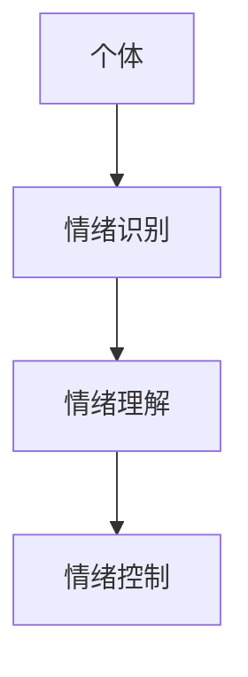
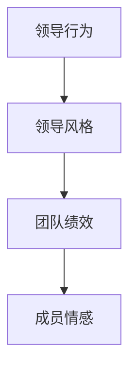
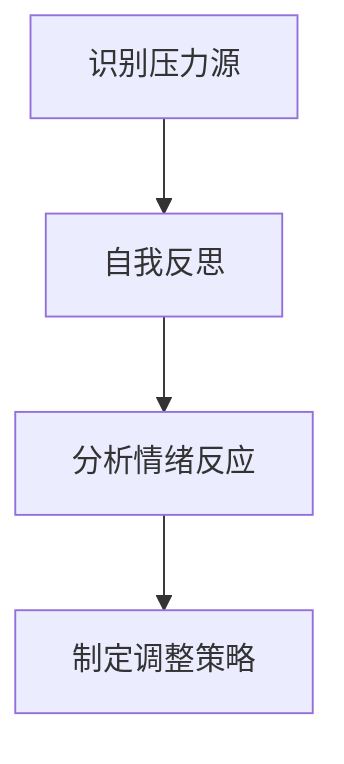
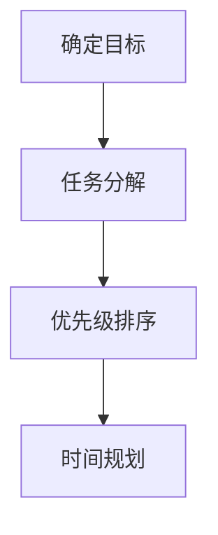
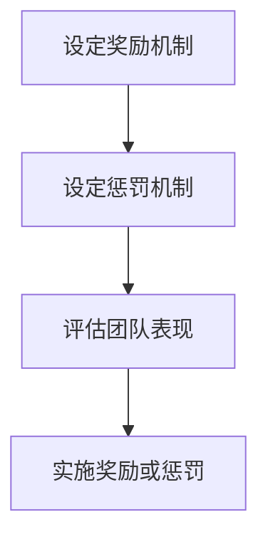
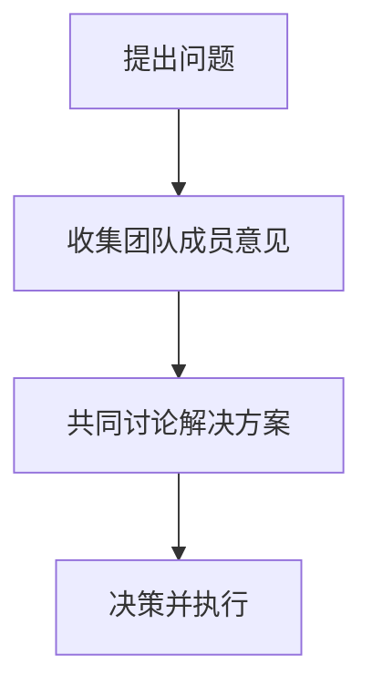
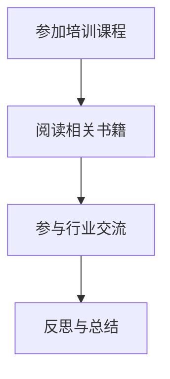
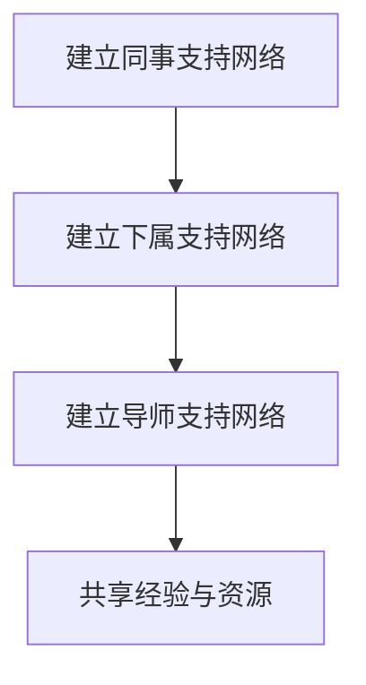

                 

### 目录

# 领导力与情绪管理：在压力下保持冷静

> 关键词：领导力、情绪管理、压力应对、心理韧性、团队协作

> 摘要：本文将探讨领导力与情绪管理在压力环境下的重要性，通过定义关键概念、理论框架、实际技巧和案例分析，帮助领导者学会如何在高压情境中保持冷静和高效。

## 前言

在现代职场中，领导者不仅需要具备卓越的技术能力和业务知识，还需要具备强大的情绪管理和领导力。在压力和不确定性的环境中，领导者的情绪状态直接影响团队的士气和生产力。本文将探讨如何通过有效的情绪管理和领导力策略，帮助领导者在压力下保持冷静和专注，从而提高团队的整体表现。

## 第一部分：定义关键概念

### 1.1 领导力

**定义**：领导力是指通过影响力、愿景和策略来引导、激励和协调团队成员，实现共同目标的能力。

**属性特征对比表**

| 特征            | 传统领导力 | 新时代领导力 |
|-----------------|-------------|---------------|
| 控制与命令      | 高          | 低           |
| 个人英雄主义    | 高          | 低           |
| 短期目标导向    | 高          | 低           |
| 持续学习与成长  | 低          | 高           |

### 1.2 情绪管理

**定义**：情绪管理是指个体识别、理解和控制自己情绪的过程，以确保情绪在适当的范围内，不影响日常生活和工作表现。

**ER实体关系图**



## 第二部分：理论框架

### 2.1 心理韧性

**定义**：心理韧性是指个体在面对压力、挑战和逆境时，能够迅速适应、恢复并继续成长的能力。

**属性特征对比表**

| 特征            | 压力应对能力 | 情绪调节能力 | 抗挫折能力 |
|-----------------|---------------|---------------|-------------|
| 传统心理学视角  | 低            | 低            | 高          |
| 新时代心理学视角 | 高            | 高            | 高          |

### 2.2 领导行为理论

**定义**：领导行为理论是指通过分析领导者的行为模式，来理解其如何影响团队绩效和成员情感。

**ER实体关系图**



## 第三部分：情绪管理技巧

### 3.1 自我意识

**原理讲解**：自我意识是指领导者对自己情感和行为有清晰的认识，包括自己的优点和不足。通过自我反思，领导者可以更好地理解自己在压力下的反应，并做出适当的调整。

**Mermaid流程图**



### 3.2 呼吸练习

**原理讲解**：呼吸练习是一种简单有效的情绪调节方法，通过调整呼吸节奏，可以降低心率，减少焦虑感，帮助领导者保持冷静。

**Python源代码示例**

```python
import time

def breathe_in_out(duration):
    for _ in range(duration):
        print("深吸一口气...")
        time.sleep(5)
        print("缓缓呼出一口气...")
        time.sleep(5)

# 测试呼吸练习
breathe_in_out(3)
```

### 3.3 时间管理

**原理讲解**：时间管理是指领导者合理安排工作时间和个人时间，以减少压力和焦虑。通过优先级排序和有效的时间规划，领导者可以更好地掌控自己的时间和情绪。

**Mermaid流程图**



## 第四部分：领导风格与情绪管理

### 4.1 胡萝卜加大棒策略

**原理讲解**：胡萝卜加大棒策略是指领导者通过奖励和惩罚来激励团队成员。在压力下，领导者应根据团队的表现，灵活运用奖励和惩罚，以保持团队的积极性和稳定性。

**Mermaid流程图**



### 4.2 参与型领导风格

**原理讲解**：参与型领导风格是指领导者鼓励团队成员参与决策过程，增加团队的归属感和责任感。在压力下，参与型领导风格有助于团队成员共同面对挑战，减轻领导者的压力。

**Mermaid流程图**



## 第五部分：案例分析

### 5.1 案例一：谷歌的员工福利政策

**案例介绍**：谷歌通过提供灵活的工作时间、员工辅导计划和心理健康支持，帮助员工在压力下保持身心健康，提高了员工的工作满意度和生产力。

**案例分析**：谷歌的员工福利政策体现了参与型领导风格和人性化管理，通过关心员工的生活和心理，降低了员工的压力水平，提高了团队的凝聚力和创造力。

### 5.2 案例二：诺基亚的领导力转型

**案例介绍**：诺基亚在面临激烈的市场竞争和内部变革时，通过引入新的领导力培训和情绪管理课程，帮助领导者应对压力，保持冷静和高效。

**案例分析**：诺基亚的领导力转型表明，在压力环境下，领导者的情绪管理和领导力水平对企业的生存和发展至关重要。

## 第六部分：构建心理韧性

### 6.1 持续学习与成长

**原理讲解**：领导者应持续学习和成长，提升自身的情绪管理和领导力技能。通过参加培训课程、阅读相关书籍和参与行业交流，领导者可以不断更新自己的知识和观念。

**Mermaid流程图**



### 6.2 建立支持网络

**原理讲解**：领导者应建立支持网络，包括同事、下属和导师等，以便在面临压力时获得帮助和支持。支持网络有助于领导者分担压力，保持情绪稳定。

**Mermaid流程图**



## 第七部分：结论

本文通过定义关键概念、理论框架、情绪管理技巧和案例分析，探讨了领导力与情绪管理在压力环境下的重要性。领导者应通过自我意识、呼吸练习、时间管理等技巧，以及参与型领导风格，来应对压力，保持冷静和高效。同时，持续学习和建立支持网络也是构建心理韧性的关键。

**作者：AI天才研究院/AI Genius Institute & 禅与计算机程序设计艺术 /Zen And The Art of Computer Programming**### 介绍

在现代职场中，领导者面临着前所未有的压力和挑战。无论是经济波动、技术革新，还是市场不确定性，领导者都必须在高压环境下做出明智的决策，并保持团队的稳定和高效。然而，压力不仅影响领导者的个人健康，还会对整个团队和组织的绩效产生深远的影响。因此，领导力与情绪管理在当前职场中的重要性不容忽视。

本文旨在探讨领导力与情绪管理在压力下的应用，帮助领导者理解情绪管理的基本概念和策略，并提供实际可行的技巧和方法，以应对职场中的各种压力和挑战。文章将围绕以下核心议题展开：

1. 领导力的定义及其在压力环境中的作用。
2. 情绪管理的概念及其在领导力中的应用。
3. 心理韧性理论及其在领导力发展中的意义。
4. 实用的情绪管理技巧，如自我意识、呼吸练习和时间管理。
5. 不同领导风格在压力下的表现和影响。
6. 案例分析，展示情绪管理和领导力在实践中的应用。
7. 构建心理韧性的策略和技巧。

通过本文的探讨，读者将能够了解领导力与情绪管理的重要作用，掌握一些实用的技巧，并在实际工作中应用这些策略，以在压力下保持冷静和高效。

### 定义关键概念

在探讨领导力与情绪管理之前，我们需要明确一些关键概念的定义，以确保讨论的准确性和一致性。

#### 1.1 领导力

领导力是指通过影响力、愿景和策略来引导、激励和协调团队成员，实现共同目标的能力。传统的领导力模型通常强调控制与命令、个人英雄主义和短期目标导向，而新时代的领导力则更加注重持续学习与成长、团队协作和长期发展。以下是一个关于传统领导力与新时代领导力属性特征的对比表格：

| 特征            | 传统领导力 | 新时代领导力 |
|-----------------|-------------|---------------|
| 控制与命令      | 高          | 低           |
| 个人英雄主义    | 高          | 低           |
| 短期目标导向    | 高          | 低           |
| 持续学习与成长  | 低          | 高           |

**1.2 情绪管理**

情绪管理是指个体识别、理解和控制自己情绪的过程，以确保情绪在适当的范围内，不影响日常生活和工作表现。情绪管理不仅仅是对负面情绪的抑制，还包括对积极情绪的调适和利用，以达到情绪平衡。以下是情绪管理的一些核心概念：

- **情绪识别**：个体能够识别自己正在经历的情绪，包括情绪的类型、强度和持续时间。
- **情绪理解**：个体能够理解情绪背后的原因和影响，以及情绪对自身行为和决策的潜在影响。
- **情绪控制**：个体能够通过各种策略和技巧，有效地控制情绪，使其在合理的范围内波动，而不影响工作和生活。

**1.3 压力**

压力是指个体在面对挑战、威胁或期望时，感受到的一种紧张和不安的状态。压力可以来自工作、家庭、人际关系等多个方面。长期的压力会对个体的心理健康产生负面影响，如焦虑、抑郁和身体疾病。因此，理解压力的来源和影响对于情绪管理至关重要。

**1.4 心理韧性**

心理韧性是指个体在面对压力、挑战和逆境时，能够迅速适应、恢复并继续成长的能力。心理韧性不仅有助于个体在逆境中保持情绪稳定，还能促进其长期的心理健康和发展。心理韧性包括以下几个关键要素：

- **适应能力**：个体能够适应环境变化和挑战，并在逆境中找到新的解决方案。
- **恢复力**：个体能够在面对压力后迅速恢复，并重新投入工作和生活。
- **成长视角**：个体认为逆境是一种机会，可以从中学习和成长。

**1.5 团队协作**

团队协作是指团队成员通过共同的目标和协作，实现个人和团队目标的过程。在压力环境下，团队协作尤为重要，因为它有助于分担压力，提高工作效率，并增强团队凝聚力。团队协作的核心要素包括：

- **沟通**：团队成员之间的有效沟通是团队协作的基础。
- **信任**：团队成员之间的信任是建立稳定协作关系的关键。
- **共同目标**：团队成员共同的目标和愿景是推动团队协作的动力。
- **角色分配**：明确每个团队成员的角色和责任，有助于提高团队协作效率。

通过明确这些关键概念，读者可以更好地理解领导力与情绪管理的基本框架，为后续的内容探讨奠定坚实的基础。

### 理论框架

在深入探讨领导力与情绪管理之前，我们需要了解一些相关的理论框架。这些框架为我们提供了理解和分析领导行为和情绪管理策略的视角。以下将介绍两种重要的理论框架：心理韧性理论和领导行为理论。

#### 2.1 心理韧性理论

心理韧性理论是近年来在心理学和领导力研究领域中得到广泛关注的一个概念。它强调个体在面对压力和逆境时的适应能力和恢复力。心理韧性理论的核心观点是，个体不是被动地受外部环境的影响，而是可以通过内在的心理机制主动应对和适应这些挑战。

**2.1.1 心理韧性的核心要素**

心理韧性包括以下几个核心要素：

- **适应能力**：个体在面对压力和变化时，能够迅速调整自己的行为和思维，以适应新环境。
- **恢复力**：个体在经历压力后，能够迅速恢复到正常状态，并重新投入工作和生活。
- **成长视角**：个体将逆境视为一个学习和成长的机会，而不是一种威胁。

**2.1.2 心理韧性的表现形式**

心理韧性的表现形式多样，包括以下几个方面：

- **情绪调节**：个体能够有效地管理自己的情绪，即使在压力下也能保持冷静和理性。
- **积极态度**：个体在面对挑战时，能够保持积极乐观的态度，并从中找到积极的意义。
- **适应性策略**：个体能够灵活地采取各种策略来应对不同的情况和挑战。

**2.1.3 心理韧性的培养方法**

要培养和提高心理韧性，个体可以采取以下几种方法：

- **自我反思**：通过定期自我反思，个体可以更好地理解自己的情绪和行为，并找到改进的方法。
- **情绪管理技巧**：学习并实践情绪管理技巧，如深呼吸、冥想和正念练习，有助于个体更好地调节情绪。
- **积极心态**：培养积极的心态，将挑战视为成长的机会，有助于个体增强心理韧性。
- **建立支持网络**：与家人、朋友和同事建立良好的支持网络，有助于个体在面临压力时获得帮助和支持。

#### 2.2 领导行为理论

领导行为理论关注领导者的行为模式及其对团队和员工的影响。不同的领导行为可以产生不同的效果，既可能促进团队绩效和员工满意度，也可能导致压力和冲突。

**2.2.1 领导行为的主要类型**

领导行为主要可以分为以下几种类型：

- **命令型领导**：领导者通过明确指示和命令来指导团队成员，强调纪律和效率。
- **支持型领导**：领导者关心团队成员的感受和需求，提供情感支持和资源帮助。
- **参与型领导**：领导者鼓励团队成员参与决策过程，尊重员工的意见和建议。
- **变革型领导**：领导者通过激励和启发，推动团队成员实现更高的目标和更卓越的绩效。

**2.2.2 领导行为对情绪管理的影响**

领导行为对情绪管理有着重要的影响：

- **命令型领导**：可能增加团队成员的压力感，但在紧急情况下有助于提高效率。
- **支持型领导**：有助于减少团队成员的压力感，提高情绪稳定性和工作满意度。
- **参与型领导**：通过增加团队成员的参与感和责任感，有助于提升团队凝聚力和绩效。
- **变革型领导**：通过激发团队成员的激情和使命感，有助于提升团队的创新能力和应对压力的能力。

**2.2.3 领导行为的转变策略**

为了在压力环境中更好地管理情绪，领导者可以采取以下几种转变策略：

- **增强支持性**：领导者可以通过倾听和关注团队成员的需求，提供更多的情感支持和资源。
- **提高参与度**：领导者可以鼓励团队成员参与决策，增加他们的参与感和责任感。
- **培养积极态度**：领导者可以通过积极的反馈和激励，培养团队成员的积极态度和信心。
- **增强心理韧性**：领导者可以引导团队成员学习和实践情绪管理技巧，提高他们的心理韧性。

通过了解这些理论框架，领导者可以更好地理解和应用情绪管理策略，以在压力环境中保持冷静和高效，从而提升团队的整体绩效。

### 情绪管理技巧

情绪管理是领导力的重要组成部分，尤其在压力环境下，有效的情绪管理技巧对于保持冷静和高效至关重要。以下是一些具体的情绪管理技巧，帮助领导者应对职场中的压力和挑战。

#### 3.1 自我意识

自我意识是指领导者对自己情感和行为有清晰的认识。通过自我反思，领导者可以了解自己在压力下的反应模式，从而采取适当的调整策略。

**原理讲解**：

- **自我反思**：定期花时间反思自己的情绪和行为，思考自己在特定情境中的反应是否合适。
- **情绪记录**：记录每天的情绪变化，分析情绪的触发因素和影响。

**实施步骤**：

1. **设定反思时间**：每天或每周固定时间进行自我反思，例如每天晚上睡前花10分钟回顾一天的情绪变化。
2. **撰写反思日记**：记录情绪的触发点、情绪的类型（如焦虑、愤怒、开心等）以及当时的反应。
3. **分析反思结果**：通过分析反思日记，找出情绪反应的模式和可能的调整策略。

**案例**：

一位项目经理在压力大的项目中，通过自我反思发现自己在面对团队成员的失误时容易情绪失控。通过分析，他意识到自己需要更加冷静和理性地处理问题。于是，他开始练习深呼吸和冥想，以帮助自己更好地控制情绪。

#### 3.2 呼吸练习

呼吸练习是一种简单有效的情绪调节方法，通过调整呼吸节奏，可以降低心率，减少焦虑感，帮助领导者保持冷静。

**原理讲解**：

- **深呼吸**：深呼吸可以激活副交感神经系统，减缓心率，降低焦虑水平。
- **放松身体**：深呼吸能够放松肌肉，缓解紧张和压力。

**实施步骤**：

1. **选择舒适的位置**：坐在椅子上或躺在床上，找到一个舒适的位置。
2. **开始深呼吸**：用鼻子吸气，腹部向外膨胀，保持5秒钟；然后用口呼气，腹部向内收缩，保持5秒钟。
3. **重复练习**：每次深呼吸练习持续5-10分钟，每天进行1-2次。

**案例**：

一位高层管理者在参加重要会议前，会花5分钟时间进行深呼吸练习。通过这个简单的技巧，他能够减少紧张感，保持冷静和专注。

#### 3.3 时间管理

时间管理是指领导者合理安排工作时间和个人时间，以减少压力和焦虑。通过优先级排序和有效的时间规划，领导者可以更好地掌控自己的时间和情绪。

**原理讲解**：

- **优先级排序**：识别和确定最重要的任务，优先完成。
- **时间分配**：为每个任务分配合理的时间，避免超负荷工作。

**实施步骤**：

1. **制定每日计划**：每天早上制定一个详细的计划，列出当天需要完成的任务和目标。
2. **优先级排序**：将任务按优先级排序，优先完成最重要的任务。
3. **时间分配**：为每个任务设置时间限制，确保在规定时间内完成。
4. **调整计划**：如果某些任务需要更多时间，及时调整计划，确保任务的顺利完成。

**案例**：

一位公司高管通过使用时间管理工具，如日历和任务列表，能够更有效地管理自己的时间。他每天早上都会花10分钟规划当天的工作，确保所有重要任务都能得到妥善处理。

#### 3.4 情绪释放技巧

情绪释放技巧是指通过某些活动或方法，将积压的情绪释放出去，以减轻压力和焦虑。

**原理讲解**：

- **释放情绪**：通过运动、艺术创作或与他人交流等方式，将负面情绪释放出去。
- **减少焦虑**：释放情绪有助于减少焦虑感和紧张情绪，提高情绪稳定性。

**实施步骤**：

1. **选择合适的释放方式**：根据个人喜好，选择一种或多种释放情绪的方法，如跑步、瑜伽、绘画或聊天等。
2. **定期进行情绪释放**：每周至少安排1-2次情绪释放活动，确保情绪得到有效释放。
3. **记录情绪变化**：在情绪释放后，记录情绪的变化和感受，分析哪种方法最有效。

**案例**：

一位领导者通过每周参加瑜伽课程，不仅能够释放工作压力，还能保持身心的健康。每次瑜伽课程后，他都会感到更加平静和放松。

通过以上情绪管理技巧，领导者可以更好地应对职场中的压力和挑战，保持冷静和高效，从而提升个人和团队的整体绩效。这些技巧不仅适用于领导者，也适用于所有在职场中面临压力的人。

### 领导风格与情绪管理

在压力环境下，领导者的情绪状态及其所采用的领导风格对团队的表现和成员的情绪管理有着至关重要的影响。不同类型的领导风格会对情绪管理产生不同的效果，以下是几种常见的领导风格及其对情绪管理的影响。

#### 4.1 胡萝卜加大棒策略

**原理讲解**：胡萝卜加大棒策略是指领导者通过奖励和惩罚来激励团队成员。奖励可以是奖金、晋升或认可，而惩罚则包括批评、降职或解雇。这种领导风格在短期内可能提高团队成员的动机和绩效，但在长期来看，可能会产生负面影响。

**对情绪管理的影响**：

- **短期效果**：奖励可以提升团队成员的积极性和工作热情，减少消极情绪。
- **长期效果**：过度依赖惩罚可能导致团队成员产生焦虑、恐惧和抵触情绪，影响长期的情绪稳定性和工作满意度。

**实施建议**：

- **平衡奖励与惩罚**：在奖励和惩罚之间找到平衡，避免过度依赖惩罚。
- **注重情感沟通**：在实施惩罚时，应与团队成员进行充分的沟通，确保其理解惩罚的原因和意义。

#### 4.2 参与型领导风格

**原理讲解**：参与型领导风格是指领导者鼓励团队成员参与决策过程，增加团队的归属感和责任感。这种领导风格强调团队合作和共同目标，有助于提高团队成员的参与感和工作满意度。

**对情绪管理的影响**：

- **提高参与感**：参与型领导风格有助于提升团队成员的参与感和责任感，减少因被动工作而产生的情绪问题。
- **增强团队凝聚力**：团队成员在共同参与决策时，能够建立信任和合作关系，增强团队的凝聚力。

**实施建议**：

- **开放沟通**：领导者应保持开放的态度，鼓励团队成员提出建议和意见，确保决策过程中有充分的沟通。
- **建立共同目标**：明确团队的目标和愿景，确保每个成员都了解自己在团队中的角色和责任。

#### 4.3 变革型领导风格

**原理讲解**：变革型领导风格是指领导者通过激励和启发，推动团队成员实现更高的目标和更卓越的绩效。这种领导风格强调创新和变革，鼓励团队成员跳出舒适区，勇于尝试新方法。

**对情绪管理的影响**：

- **激发激情**：变革型领导风格能够激发团队成员的激情和使命感，减少因缺乏动力而产生的消极情绪。
- **提升适应性**：通过变革型领导，团队成员能够提高适应变化的能力，更好地应对压力和挑战。

**实施建议**：

- **提供激励**：领导者应通过奖励、认可和晋升等激励措施，激发团队成员的积极性和创造力。
- **培养成长视角**：鼓励团队成员将挑战视为成长的机会，培养积极的心态和适应性。

#### 4.4 情境型领导风格

**原理讲解**：情境型领导风格是指领导者根据团队成员的不同特点和情境，灵活调整领导风格。这种领导风格强调个性化和适应性，能够更好地满足团队成员的需求。

**对情绪管理的影响**：

- **个性关怀**：情境型领导风格能够根据团队成员的情绪状态和需求，提供个性化的关怀和支持，减少情绪问题。
- **提高适应能力**：通过适应不同情境，领导者能够帮助团队成员更好地应对各种挑战和压力。

**实施建议**：

- **了解团队成员**：领导者应花时间了解团队成员的性格、需求和情绪状态，以便制定合适的领导策略。
- **灵活调整领导风格**：根据不同情境和团队成员的表现，灵活调整领导风格，确保团队成员在压力环境中得到适当的支持。

通过了解和运用不同类型的领导风格，领导者可以在压力环境下更好地管理自己和团队的情绪，提高整体绩效和团队凝聚力。

### 案例分析

#### 5.1 案例一：谷歌的员工福利政策

**案例介绍**：

谷歌以其卓越的员工福利政策而闻名，这些政策旨在帮助员工在压力环境下保持身心健康，从而提高工作效率和创造力。谷歌提供的福利包括灵活的工作时间、心理健康支持、员工辅导计划、健身设施和丰富的团建活动等。

**案例分析**：

谷歌的员工福利政策体现了参与型领导风格和人性化管理。通过关注员工的生活和心理需求，谷歌帮助员工在压力下保持积极的心态和良好的情绪状态。以下是谷歌员工福利政策的一些具体实践：

- **灵活的工作时间**：谷歌允许员工自主安排工作时间，这有助于员工更好地平衡工作和生活，减少工作压力。
- **心理健康支持**：谷歌提供专业的心理健康咨询服务，员工可以随时寻求帮助，以缓解工作压力和焦虑。
- **员工辅导计划**：谷歌为员工提供职业发展辅导，帮助员工提升技能和职业素养，增强自信心和成就感。
- **健身设施和团建活动**：谷歌在办公区内设有健身设施，并定期组织团建活动，鼓励员工积极参与，增进团队凝聚力。

**效果评估**：

通过这些福利政策，谷歌成功提升了员工的工作满意度和生产力。员工在压力环境下能够更好地管理自己的情绪，保持身心健康，从而提高了整体的工作效率和团队绩效。此外，这些政策也有助于吸引和留住优秀人才，增强了企业的竞争力。

#### 5.2 案例二：诺基亚的领导力转型

**案例介绍**：

诺基亚在面临激烈的市场竞争和内部变革时，意识到领导力转型的重要性。为了保持竞争力，诺基亚引入了一系列领导力培训和情绪管理课程，帮助领导者应对压力，保持冷静和高效。

**案例分析**：

诺基亚的领导力转型主要从以下几个方面展开：

- **领导力培训**：诺基亚为各级领导提供系统的领导力培训，内容包括情绪管理、团队建设、决策制定和战略思维等。
- **情绪管理课程**：通过情绪管理课程，领导者学习如何识别和调节自己的情绪，以及在压力环境下保持冷静和专注。
- **心理韧性培养**：诺基亚鼓励领导者培养心理韧性，通过自我反思和适应性训练，提高应对压力和挑战的能力。

**效果评估**：

通过领导力转型，诺基亚领导者的情绪管理能力得到了显著提升。领导者能够更好地应对压力，保持冷静和理性，从而提高了决策质量和团队绩效。此外，领导者的心理韧性也得到增强，能够在面对市场变化和内部变革时，迅速适应并引领团队走向成功。这些变化为诺基亚在激烈的市场竞争中保持领先地位提供了有力支持。

### 总结

通过以上案例分析，我们可以看到情绪管理和领导力在实践中的重要性。谷歌的员工福利政策和诺基亚的领导力转型都表明，通过关注员工心理健康和领导力发展，企业可以显著提升员工的情绪状态和工作绩效。领导者应在实际工作中运用这些经验和技巧，帮助自己和团队在压力下保持冷静和高效，从而实现更高的目标和卓越的绩效。

### 建构心理韧性

心理韧性是领导者应对压力和挑战的重要能力。通过培养心理韧性，领导者不仅能够更好地管理自己的情绪，还能提高团队的整体绩效和凝聚力。以下是一些策略和技巧，帮助领导者建构心理韧性。

#### 6.1 持续学习与成长

持续学习和成长是培养心理韧性的重要途径。领导者应保持好奇心和求知欲，不断更新知识和技能。

**策略**：

- **定期学习**：安排时间参加培训课程、研讨会和行业交流会，以获取最新的信息和知识。
- **阅读与研究**：阅读相关书籍和研究报告，深入理解领导力和情绪管理的理论和方法。
- **实践反思**：通过实践和应用所学知识，不断反思和调整自己的领导行为和情绪管理策略。

**技巧**：

- **设定学习目标**：明确学习目标和优先级，确保学习计划的具体可行性和实际效果。
- **整合学习资源**：利用在线课程、图书、专业咨询等多种资源，丰富学习内容和形式。

#### 6.2 建立支持网络

建立支持网络是提高心理韧性的关键。领导者需要与同事、下属和导师建立紧密的联系，以便在面临压力时获得支持和帮助。

**策略**：

- **建立信任关系**：与团队成员建立信任关系，鼓励开放和坦诚的沟通。
- **提供反馈和支持**：在团队成员遇到困难时，提供积极的反馈和支持，帮助他们克服挑战。

**技巧**：

- **定期沟通**：通过定期会议、一对一交流等方式，保持与团队成员的沟通和联系。
- **利用外部资源**：借助专业咨询机构、心理咨询师等外部资源，为团队成员提供专业支持和建议。

#### 6.3 情绪管理技巧

掌握情绪管理技巧是构建心理韧性的基础。领导者应学会识别、理解和控制自己的情绪，以保持冷静和专注。

**策略**：

- **自我意识**：通过自我反思，了解自己在不同情境下的情绪反应，找到情绪管理的切入点。
- **情绪调节**：运用深呼吸、冥想和正念练习等技巧，调节情绪，减少焦虑和压力。

**技巧**：

- **情绪记录**：记录自己的情绪变化，分析情绪的触发因素和影响，以找到情绪管理的策略。
- **情绪共享**：与信任的同事或朋友分享情绪，获得他们的观点和建议，从而更好地调节情绪。

#### 6.4 心理韧性训练

心理韧性训练是通过一系列练习和活动，提高领导者应对压力和挑战的能力。

**策略**：

- **适应性训练**：通过挑战自我和适应新环境，提高应对不确定性和变化的能力。
- **危机应对训练**：模拟危机情境，让领导者学会在高压环境下保持冷静和理性。

**技巧**：

- **设定挑战**：为自己设定一些具有挑战性的目标和任务，通过不断克服困难，增强心理韧性。
- **反思与总结**：在挑战结束后，反思自己的应对过程，总结经验和教训，不断改进。

通过以上策略和技巧，领导者可以逐步构建心理韧性，提高自己在压力环境下的情绪管理和领导能力，从而带领团队实现更高的目标和卓越的绩效。

### 结论

通过本文的探讨，我们可以清晰地看到领导力与情绪管理在压力环境下的重要性。有效的情绪管理不仅有助于领导者保持冷静和专注，还能提升团队的士气和生产力。领导者应通过自我意识、呼吸练习、时间管理以及各种情绪管理技巧，来应对职场中的各种压力和挑战。同时，领导风格的选择和有效的支持网络也是构建心理韧性的关键。通过不断学习和实践，领导者可以不断提升自己的情绪管理和领导能力，带领团队实现卓越的绩效和持续的发展。

**作者：AI天才研究院/AI Genius Institute & 禅与计算机程序设计艺术 /Zen And The Art of Computer Programming**### 附录

#### 1. 情绪管理技巧总结表

| 技巧                | 描述                                                         | 适用场景                     |
|---------------------|--------------------------------------------------------------|------------------------------|
| 自我意识            | 通过反思了解自己在压力下的情绪反应。                         | 长期压力、情感波动           |
| 呼吸练习            | 通过深呼吸降低心率和焦虑感。                                 | 紧急会议、重要决策前          |
| 时间管理            | 优先处理重要任务，合理分配工作时间。                         | 高强度工作、多任务处理       |
| 情绪释放技巧        | 通过运动、艺术创作或与他人交流等方式释放情绪。               | 长时间紧张工作后、情绪累积时 |
| 支持网络建设        | 与同事、下属和导师建立支持关系。                           | 长期压力、情感支持需求       |

#### 2. 领导风格与情绪管理对照表

| 领导风格           | 对情绪管理的影响                                            | 适用情境                       |
|--------------------|-----------------------------------------------------------|-------------------------------|
| 命令型领导         | 可短期内提升效率，长期可能导致压力和焦虑。                   | 紧急情况、任务明确              |
| 支持型领导         | 增强团队成员的情感支持，降低压力感。                         | 长期项目、团队建设期           |
| 参与型领导         | 提高团队成员的参与感和责任感，减少情绪问题。                 | 决策制定、创新项目             |
| 变革型领导         | 激发团队成员的激情和创新能力，提高心理韧性。                 | 组织变革、市场变革             |
| 情境型领导         | 根据团队成员的情绪状态和情境灵活调整领导风格。               | 多样化团队、复杂工作环境       |

#### 3. 常见情绪管理工具

| 工具                 | 描述                                                         | 适用场景                     |
|----------------------|--------------------------------------------------------------|------------------------------|
| 冥想应用             | 提供冥想指导，帮助放松和调节情绪。                           | 焦虑、压力缓解               |
| 时间管理应用         | 如Trello、Asana等，帮助规划任务和时间。                      | 多任务处理、项目管理         |
| 情绪日记             | 记录每日情绪变化，分析触发因素。                            | 情绪追踪、自我反思           |
| 心理健康应用         | 如Moodfit、Headspace等，提供心理健康建议和练习。             | 情绪调节、心理健康维护       |

#### 4. 拓展阅读

- 《情绪智商》（Daniel Goleman）：详细介绍了情绪智商的概念和重要性。
- 《五项管理：提升情绪效率》（Richard Boyatzis）：提供情绪管理的实用方法和策略。
- 《心理韧性：如何培养不易崩溃的心灵》（Karen Reivich & Andrew Shatté）：深入探讨心理韧性的培养方法。
- 《赋能领导力：如何激发团队潜力》（Liz Wiseman）：介绍如何通过领导力提升团队绩效。

通过这些工具和资源，领导者可以更好地理解和应用情绪管理技巧，提升自身的心理韧性，从而在压力环境中保持冷静和高效。

