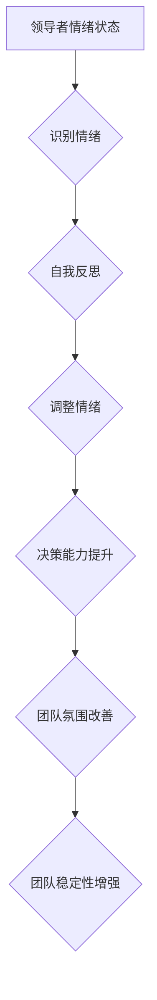

                 

# 领导力与情绪管理：维护团队稳定的关键技巧

关键词：领导力、情绪管理、团队稳定性、关键技巧

摘要：本文旨在探讨领导力与情绪管理在维护团队稳定性中的关键作用。通过对领导力模型、情绪类型与识别、情绪调节技巧、沟通技巧、冲突解决以及团队激励等方面的深入分析，本文将提供一系列实用的策略和技巧，帮助领导者提升团队稳定性，促进团队发展。

### 目录

1. **引言**  
2. **背景介绍**  
   2.1 问题背景  
   2.2 问题描述  
   2.3 问题解决  
   2.4 边界与外延  
3. **领导力概述**  
   3.1 经典领导力模型  
   3.2 领导力与领导风格  
   3.3 领导力发展的途径  
4. **情绪的类型与识别**  
   4.1 情绪的类型  
   4.2 情绪的识别方法  
   4.3 情绪对比表格（积极情绪与消极情绪对比）  
   4.4 情绪与领导力关系图（Mermaid ER实体关系图）  
5. **情绪调节技巧**  
   5.1 情绪调节的重要性  
   5.2 常见的情绪调节技巧  
   5.3 情绪调节技巧对比表格（自我反思、放松技巧对比）  
   5.4 情绪调节与领导力的关联图（Mermaid流程图）  
6. **沟通技巧**  
   6.1 沟通的重要性  
   6.2 沟通的障碍与解决方法  
   6.3 有效沟通的技巧  
7. **冲突解决**  
   7.1 冲突的类型与原因  
   7.2 冲突解决的策略  
   7.3 冲突解决的案例分析  
8. **团队激励**  
   8.1 激励理论  
   8.2 团队激励的策略  
   8.3 激励与团队稳定性的关系  
9. **实践与应用**  
   9.1 领导力与情绪管理的实践案例  
   9.2 培养团队稳定性的策略  
   9.3 领导力与情绪管理评估  
10. **最佳实践 tips、小结、注意事项、拓展阅读**  
11. **作者信息**

## 引言

在当今快速变化和高度竞争的商业环境中，团队稳定性成为企业成功的关键因素。而领导力与情绪管理则是维护团队稳定性的两大核心要素。领导力不仅关乎决策能力和团队管理，更涉及到如何激发团队成员的潜力、提升团队凝聚力和工作效率。另一方面，情绪管理则强调领导者如何识别、调节和管理自身的情绪，从而更好地影响团队成员，促进团队的整体发展。

本文将围绕领导力与情绪管理这一主题，探讨以下几个关键问题：

- 领导力在维护团队稳定性中的作用是什么？
- 情绪的类型有哪些？如何识别和调节情绪？
- 沟通技巧对于团队稳定性的影响如何？
- 冲突解决策略如何帮助团队保持和谐？
- 团队激励策略如何提升团队凝聚力？

通过系统的分析和实践案例的分享，本文旨在为领导者提供一系列实用且有效的技巧和策略，帮助他们在实际工作中更好地维护团队稳定性，推动团队持续发展。

## 背景介绍

### 1.1 问题背景

在现代社会，团队不稳定性的问题日益凸显，成为企业面临的重大挑战之一。团队不稳定可能导致以下负面影响：

1. **工作效率下降**：团队成员情绪波动、沟通不畅、冲突频发，导致工作效率和生产力下降。
2. **员工流失率增加**：团队氛围不良，员工士气低落，容易导致人才流失。
3. **企业成本上升**：为了应对团队不稳定，企业可能需要投入额外的资源进行团队重组、培训和激励。
4. **企业形象受损**：团队不稳定可能影响企业的声誉，降低客户满意度和市场竞争力。

### 1.2 问题描述

团队不稳定性的主要表现为以下几个方面：

1. **情绪波动**：团队成员情绪不稳定，可能导致工作态度消极、抵触情绪增加。
2. **沟通障碍**：团队成员之间的沟通不畅，信息传递不准确，容易引发误解和冲突。
3. **冲突频发**：团队内部存在不同意见和利益冲突，导致关系紧张，影响团队协作。
4. **缺乏凝聚力**：团队成员缺乏共同的目标和愿景，团队凝聚力较弱，难以形成合力。

### 1.3 问题解决

为了解决团队不稳定性问题，领导力与情绪管理成为关键手段。具体策略如下：

1. **提升领导力**：通过领导力培训和实践，提升领导者的决策能力、沟通技巧和团队管理能力，从而增强团队的稳定性和凝聚力。
2. **加强情绪管理**：领导者需要学会识别和调节自身的情绪，以及帮助团队成员进行情绪管理，以降低情绪波动和冲突的发生。
3. **改善沟通机制**：建立有效的沟通渠道和机制，确保团队成员之间的信息畅通，减少误解和冲突。
4. **建立激励机制**：通过合理的激励机制，提升团队成员的积极性和满意度，增强团队凝聚力。

### 1.4 边界与外延

领导力与情绪管理不仅适用于企业团队，也适用于其他类型的团队，如非营利组织、教育机构等。本文主要从企业团队的角度出发，探讨领导力与情绪管理在维护团队稳定性中的关键作用。同时，本文也将讨论一些跨文化团队的特殊问题，如文化差异、跨国沟通等。

## 领导力概述

### 3.1 经典领导力模型

领导力是一个复杂的概念，不同的学者提出了各种领导力模型。以下是几种经典的领导力模型：

1. **特质理论**：特质理论认为领导者具有独特的个性特质，如自信、决断力、责任感等。特质理论强调领导者与生俱来的特质对其领导能力的影响。
2. **行为理论**：行为理论关注领导者的行为和领导风格，如民主型、专制型、参与型等。行为理论认为领导者可以通过改变自己的行为来影响团队的表现。
3. **情境理论**：情境理论认为领导力是领导者与情境相互作用的产物。领导者的领导风格需要根据不同情境进行调整，以实现最佳效果。
4. **变革型领导力**：变革型领导力强调领导者通过激发和激励团队成员的潜能，实现团队变革和创新。变革型领导力注重领导者与团队成员之间的互动和共同成长。

### 3.2 领导力与领导风格

领导风格是领导者管理团队的方式和态度。常见的领导风格包括：

1. **民主型领导风格**：民主型领导风格注重团队成员的参与和意见，领导者与团队成员共同决策。这种风格有利于激发团队成员的积极性和创造力。
2. **专制型领导风格**：专制型领导风格中，领导者做出决策并要求团队成员服从。这种风格在紧急情况下可能有效，但长期来看可能导致团队成员的被动和依赖。
3. **参与型领导风格**：参与型领导风格中，领导者鼓励团队成员参与决策过程，提高团队成员的参与度和责任感。这种风格有助于增强团队的凝聚力和忠诚度。
4. **教练型领导风格**：教练型领导风格强调领导者作为团队成员的教练和指导者，帮助团队成员发展个人能力和实现职业目标。这种风格有助于提升团队整体素质。

### 3.3 领导力发展的途径

领导者的发展是一个持续的过程，以下是一些提升领导力的途径：

1. **自我反思**：领导者需要定期进行自我反思，了解自己的优点和不足，以及如何改进。
2. **学习与培训**：通过参加领导力课程、阅读领导力书籍、参加研讨会等方式，不断学习新的领导理念和技巧。
3. **实践**：通过实际工作中的应用，将所学知识和技能转化为实际能力。
4. **反馈与改进**：积极寻求团队成员的反馈，了解自己的领导效果，并根据反馈进行改进。
5. **建立人际关系**：与团队成员建立良好的关系，增强团队凝聚力和信任感。

## 情绪的类型与识别

### 4.1 情绪的类型

情绪是人类心理体验的核心组成部分，根据情绪的性质和表现，可以分为以下几种类型：

1. **积极情绪**：积极情绪包括喜悦、快乐、兴奋等，这些情绪通常与积极的生活事件和体验相关。积极情绪有助于提高人的幸福感、创造力和工作效率。
2. **消极情绪**：消极情绪包括愤怒、沮丧、焦虑等，这些情绪通常与负性生活事件和体验相关。消极情绪可能导致人的心理健康问题、社会适应困难和工作效率下降。
3. **复合情绪**：复合情绪是由多种基本情绪混合而成的情绪，如羞愧、厌恶等。复合情绪通常与复杂的社会情境和人际关系相关。

### 4.2 情绪的识别方法

情绪的识别是情绪管理的基础，以下是一些常用的情绪识别方法：

1. **自我观察法**：自我观察法是指通过反思和观察自己的情绪反应来识别情绪。这种方法适用于识别较为明显的情绪，如愤怒、喜悦等。
2. **行为识别法**：行为识别法是指通过观察情绪表达的行为和生理反应来识别情绪。例如，面部表情、语调、身体姿势等都可以提供情绪的线索。
3. **情感量表法**：情感量表法是通过标准化的问卷或量表来评估情绪水平。这种方法适用于量化情绪，并提供详细的情绪分析。

### 4.3 情绪对比表格（积极情绪与消极情绪对比）

以下是一个简单的情绪对比表格，展示了积极情绪与消极情绪的异同点：

| 情绪类型 | 特征 | 影响 |  
| --- | --- | --- |  
| 积极情绪 | 兴奋、愉快、自信 | 提高幸福感、创造力、工作效率 |  
| 消极情绪 | 焦虑、沮丧、愤怒 | 降低幸福感、心理健康、工作效率 |

### 4.4 情绪与领导力关系图（Mermaid ER实体关系图）

以下是一个Mermaid ER实体关系图，展示了情绪与领导力之间的关联：

```mermaid
erDiagram
  情绪 ||--|{ 领导力 }|
  领导力 ||--|{ 团队稳定性 }|
  团队稳定性 ||--|{ 工作效率 }|
```

在这个ER图中，情绪与领导力之间存在直接关联，领导力又影响团队稳定性，最终影响工作效率。通过这种关系，我们可以看到情绪管理对于领导力提升和团队稳定性的重要性。

## 情绪调节技巧

### 5.1 情绪调节的重要性

情绪调节是领导者管理情绪的核心能力，它对于领导者的心理健康、决策能力以及团队氛围有着重要的影响。以下是情绪调节的重要性：

1. **心理健康**：情绪调节不良可能导致领导者产生焦虑、抑郁等心理问题，影响个人幸福感和生活质量。
2. **决策能力**：情绪调节有助于领导者保持冷静和理性，从而做出更加明智和有效的决策。
3. **团队氛围**：领导者的情绪状态直接影响团队成员的情绪，情绪调节有助于营造积极、和谐的工作氛围。
4. **团队稳定性**：情绪调节有助于降低团队成员的情绪波动和冲突，增强团队的稳定性和凝聚力。

### 5.2 常见的情绪调节技巧

以下是几种常见的情绪调节技巧：

1. **自我反思**：通过反思自己的情绪反应，领导者可以更好地理解情绪的来源和影响，从而采取有效的调节措施。
2. **放松技巧**：通过深呼吸、冥想、瑜伽等放松技巧，领导者可以减轻情绪压力，恢复心理平衡。
3. **积极心态**：培养积极的心态，关注积极的方面，有助于调节负面情绪，提升情绪稳定性。
4. **合理宣泄**：通过适当的途径和方式宣泄情绪，如运动、写日记、与朋友倾诉等，可以减轻情绪负担。

### 5.3 情绪调节技巧对比表格（自我反思、放松技巧对比）

以下是一个情绪调节技巧对比表格，展示了自我反思和放松技巧的异同点：

| 技巧       | 描述                                            | 优点                                     | 缺点                                      |
| ---------- | ----------------------------------------------- | ---------------------------------------- | ----------------------------------------- |
| 自我反思   | 通过反思自己的情绪反应，理解情绪的来源和影响。   | 帮助领导者深入理解情绪，提升自我意识。   | 需要较长的时间和自我控制能力。           |
| 放松技巧   | 通过深呼吸、冥想、瑜伽等放松方式，减轻情绪压力。 | 简单易行，快速缓解情绪。                 | 对情绪的深度调节有限，可能需要持续练习。 |

### 5.4 情绪调节与领导力的关联图（Mermaid流程图）

以下是一个Mermaid流程图，展示了情绪调节与领导力之间的关联：



在这个流程图中，领导者的情绪状态通过识别情绪、自我反思和调整情绪等步骤，最终提升决策能力、改善团队氛围和增强团队稳定性。情绪调节不仅是领导者个人发展的需要，也是团队稳定和发展的关键。

## 沟通技巧

### 6.1 沟通的重要性

沟通是领导力的核心要素之一，它对团队稳定性和工作效率有着至关重要的影响。以下是沟通的重要性的几个方面：

1. **信息传递**：有效的沟通可以确保信息准确、及时地传递，避免误解和误传。
2. **团队协作**：沟通有助于团队成员之间建立信任和合作关系，促进团队协作。
3. **问题解决**：通过沟通，团队成员可以共同探讨问题、分析原因、制定解决方案。
4. **决策支持**：领导者的沟通能力直接影响决策的质量和团队的执行力。
5. **个人发展**：有效的沟通有助于团队成员提升个人沟通能力和自信心。

### 6.2 沟通的障碍与解决方法

沟通过程中可能遇到多种障碍，以下是几种常见的沟通障碍及其解决方法：

1. **文化差异**：文化差异可能导致误解和沟通障碍。解决方法包括：
   - 了解和尊重不同文化背景。
   - 使用简单、清晰的语言。
   - 重视非言语沟通，如肢体语言和面部表情。

2. **信息过载**：过多的信息可能导致信息过载，影响沟通效果。解决方法包括：
   - 明确沟通目标和重点。
   - 使用简洁、有针对性的语言。
   - 避免同时处理多个信息。

3. **情绪干扰**：情绪波动可能干扰沟通过程，导致沟通失败。解决方法包括：
   - 学会情绪调节技巧，保持冷静和理性。
   - 在情绪激动时，暂时暂停沟通，进行情绪调节。
   - 使用积极的沟通方式，避免情绪化的言辞。

### 6.3 有效沟通的技巧

以下是一些提升沟通效果的有效技巧：

1. **倾听**：倾听是有效沟通的基础，领导者需要学会倾听团队成员的意见和需求。
   - 保持专注，避免分心。
   - 不要打断对方，让对方充分表达。
   - 表达理解和同情，鼓励对方继续沟通。

2. **清晰表达**：领导者需要使用清晰、简洁的语言表达自己的想法和意见。
   - 使用简单词汇和句子。
   - 避免使用专业术语和复杂的句子结构。
   - 重复和总结对方的要点，确保理解无误。

3. **开放提问**：通过开放提问，领导者可以引导团队成员参与讨论，促进沟通。
   - 提问时使用开放式问题，如“你认为...”、“你觉得...”等。
   - 鼓励团队成员提出问题和建议。
   - 对团队成员的问题和建议给予积极回应。

4. **反馈与确认**：通过及时反馈和确认，领导者可以确保沟通的有效性。
   - 对团队成员的反馈给予积极回应。
   - 确认对方是否理解自己的想法和意见。
   - 鼓励团队成员提供反馈，以改进沟通效果。

## 冲突解决

### 7.1 冲突的类型与原因

冲突是团队中不可避免的现象，根据冲突的性质和原因，可以分为以下几种类型：

1. **利益冲突**：团队成员在资源分配、利益分配等方面存在不同的利益诉求，导致冲突。
2. **价值观冲突**：团队成员在价值观、信仰、文化等方面存在差异，导致冲突。
3. **沟通冲突**：团队成员之间的沟通不畅，信息传递不准确，导致冲突。
4. **个人冲突**：团队成员在个性、行为、态度等方面存在差异，导致冲突。

冲突的原因主要包括以下几个方面：

1. **资源有限**：团队资源有限，如预算、人力、时间等，可能导致竞争和冲突。
2. **目标不一致**：团队成员在目标设定和实现上存在差异，导致冲突。
3. **沟通障碍**：团队成员之间的沟通不畅，信息传递不准确，导致误解和冲突。
4. **文化差异**：团队成员来自不同的文化背景，可能存在价值观和行为习惯的差异，导致冲突。

### 7.2 冲突解决的策略

有效的冲突解决策略有助于降低冲突对团队的影响，以下是几种常见的冲突解决策略：

1. **回避**：回避是一种消极的冲突解决策略，领导者选择避免或推迟冲突的处理。这种方法适用于冲突对团队的影响较小，且短期内无法解决的情况。

2. **妥协**：妥协是一种中性的冲突解决策略，领导者通过妥协和让步来满足双方的利益。这种方法适用于双方都有一定的利益诉求，但都不愿意放弃的情况。

3. **合作**：合作是一种积极的冲突解决策略，领导者通过协商和合作找到双方都能接受的解决方案。这种方法适用于双方都有强烈的利益诉求，且愿意通过合作解决问题的情况。

4. **强制**：强制是一种消极的冲突解决策略，领导者通过强制手段来解决问题，可能采取惩罚、开除等手段。这种方法适用于冲突对团队的影响较大，且需要迅速解决问题的情况。

### 7.3 冲突解决的案例分析

以下是一个冲突解决的案例分析：

案例背景：一个项目团队在项目进度上出现了严重分歧，项目经理认为团队进度落后，需要加班赶工，而团队成员认为已经尽力，无法再提高效率。

解决过程：

1. **识别问题**：项目经理首先与团队成员进行了沟通，了解他们的意见和困难。
2. **分析原因**：项目经理分析了项目进度落后的原因，发现主要是需求变更和沟通不畅导致。
3. **提出方案**：项目经理提出了两个方案：一是增加团队资源，加快进度；二是重新规划项目进度，确保项目质量。
4. **协商讨论**：项目经理与团队成员进行了讨论，最终达成了一致意见，决定增加团队资源，同时优化项目进度。
5. **实施方案**：项目经理与团队成员一起制定了详细的实施方案，并确保实施过程中的沟通畅通。

结果：通过上述解决过程，项目团队成功地解决了冲突，项目进度得到了显著提升，团队士气也得到了提升。

## 团队激励

### 8.1 激励理论

激励是领导力的重要组成部分，通过激励可以激发团队成员的潜能，提高工作效率和团队凝聚力。以下是几种常见的激励理论：

1. **马斯洛需求层次理论**：马斯洛需求层次理论认为，人的需求可以分为生理需求、安全需求、社交需求、尊重需求和自我实现需求。领导者需要了解团队成员的不同需求，并提供相应的激励措施。
2. **赫茨伯格双因素理论**：赫茨伯格双因素理论将工作激励分为内在激励和外在激励。内在激励包括成就感、认可、工作本身等，外在激励包括薪酬、福利、工作环境等。领导者需要关注内在激励，以提高团队成员的长期动力。
3. **目标设置理论**：目标设置理论认为，明确、具体和具有挑战性的目标可以激发团队成员的积极性。领导者需要设定合理的目标，并帮助团队成员实现这些目标。

### 8.2 团队激励的策略

以下是几种常见的团队激励策略：

1. **目标激励**：设定明确、具体和具有挑战性的目标，激发团队成员的工作热情和动力。目标应具有可衡量性，以便团队成员能够清楚地了解自己的工作进展和成果。
2. **认可激励**：通过公开认可和奖励团队成员的成就，提高他们的工作积极性和归属感。认可可以采用口头表扬、奖金、晋升等方式，应根据团队成员的不同需求和偏好进行选择。
3. **参与激励**：鼓励团队成员参与决策和项目规划，提高他们的参与感和责任感。参与激励有助于增强团队成员的归属感和团队凝聚力。
4. **发展激励**：为团队成员提供培训和发展机会，帮助他们提升个人能力和职业素养。发展激励有助于增强团队成员的长期忠诚度和职业满意度。

### 8.3 激励与团队稳定性的关系

激励与团队稳定性密切相关，以下是激励对团队稳定性的影响：

1. **提高员工满意度**：有效的激励措施可以提高员工的工作满意度和生活质量，从而降低员工流失率，增强团队稳定性。
2. **增强团队凝聚力**：通过激励，领导者可以增强团队成员之间的信任和合作，提高团队的凝聚力和战斗力。
3. **提升工作效率**：激励可以激发团队成员的潜能，提高工作效率和生产力，从而确保团队的长期稳定发展。
4. **改善团队氛围**：激励有助于营造积极、和谐的工作氛围，减少冲突和负面情绪，提高团队的整体稳定性。

## 实践与应用

### 9.1 领导力与情绪管理的实践案例

以下是一个领导力与情绪管理的实践案例：

案例背景：某公司项目团队在项目执行过程中遇到了重大挑战，项目进度严重滞后，团队成员情绪波动，工作积极性下降。

解决过程：

1. **识别问题**：项目经理首先与团队成员进行了沟通，了解他们的意见和困难。
2. **情绪管理**：项目经理通过情绪识别技巧，识别出团队成员的消极情绪，并进行了情绪调节。他采用放松技巧和积极心态，帮助团队成员恢复心理平衡。
3. **目标激励**：项目经理重新设定了明确、具体和具有挑战性的目标，激发团队成员的工作热情和动力。目标包括短期和长期目标，以及具体的任务分解。
4. **参与激励**：项目经理鼓励团队成员参与项目规划和决策过程，提高他们的参与感和责任感。团队成员提出了一系列优化项目进度的建议，项目进度得到了显著提升。
5. **认可激励**：项目经理对团队成员的成就进行了公开认可和奖励，包括口头表扬、奖金和晋升机会。团队成员的工作积极性和归属感得到了提高。

结果：通过上述解决过程，项目团队成功地解决了情绪波动和项目进度问题，项目进度得到了显著提升，团队士气也得到了提升。

### 9.2 培养团队稳定性的策略

以下是一些培养团队稳定性的策略：

1. **建立清晰的愿景和目标**：领导者需要与团队成员共同制定清晰的愿景和目标，确保团队成员对团队目标有共同的理解和认同。
2. **加强团队沟通**：领导者需要建立有效的沟通渠道和机制，确保团队成员之间的信息畅通，减少误解和冲突。
3. **培养团队凝聚力**：领导者可以通过团队建设活动、团队文化塑造等方式，增强团队成员之间的信任和合作，提高团队的凝聚力。
4. **提供发展机会**：领导者需要为团队成员提供培训和发展机会，帮助他们提升个人能力和职业素养，增强团队的稳定性。
5. **关注员工心理健康**：领导者需要关注团队成员的心理健康，提供心理支持和辅导，帮助团队成员应对工作和生活中的压力。

### 9.3 领导力与情绪管理评估

为了评估领导力与情绪管理在团队稳定性中的作用，可以采用以下方法：

1. **问卷调查**：通过问卷调查，了解团队成员对领导力与情绪管理效果的满意度，以及他们对团队稳定性的评价。
2. **员工满意度调查**：定期进行员工满意度调查，了解员工对工作环境、团队氛围、领导风格的满意度。
3. **绩效评估**：通过绩效评估，了解团队成员的工作表现和项目成果，评估领导力与情绪管理对工作效率和质量的影响。
4. **员工流失率分析**：分析员工的流失率，了解领导力与情绪管理对员工忠诚度和团队稳定性的影响。

通过上述评估方法，领导者可以了解团队稳定性的现状，发现存在的问题，并采取相应的改进措施。

## 最佳实践 tips、小结、注意事项、拓展阅读

### 最佳实践 tips

1. **建立清晰的愿景和目标**：确保团队成员对团队目标有共同的理解和认同。
2. **加强团队沟通**：建立有效的沟通渠道和机制，减少误解和冲突。
3. **培养团队凝聚力**：通过团队建设活动、团队文化塑造等方式增强团队成员之间的信任和合作。
4. **提供发展机会**：为团队成员提供培训和发展机会，提升团队整体素质。
5. **关注员工心理健康**：关注团队成员的心理健康，提供心理支持和辅导。

### 小结

本文探讨了领导力与情绪管理在维护团队稳定性中的关键作用，通过领导力模型、情绪管理技巧、沟通技巧、冲突解决策略、团队激励等方面的深入分析，提供了一系列实用策略和技巧。通过实践案例和应用，本文展示了领导力与情绪管理在提升团队稳定性、工作效率和员工满意度方面的实际效果。

### 注意事项

1. 领导者需要不断学习和提升自身的领导力和情绪管理能力。
2. 团队稳定性是一个持续的过程，需要领导者和团队成员的共同努力。
3. 针对不同的团队和情境，领导者需要灵活运用不同的策略和技巧。

### 拓展阅读

1. 《领导力：理论与实践》作者：约翰·P·科特（John P. Kotter）
2. 《情绪智力：为什么智商不是一切》作者：丹尼尔·戈尔曼（Daniel Goleman）
3. 《沟通的艺术：看入人里，看出人外》作者：罗纳德·B·阿德勒（Ronald B. Adler）与电报公司（Prentice Hall）

通过阅读这些拓展资料，领导者可以进一步深入理解领导力与情绪管理，提升自身的领导力和情绪管理水平。

## 作者信息

作者：AI天才研究院/AI Genius Institute & 禅与计算机程序设计艺术 /Zen And The Art of Computer Programming

AI天才研究院致力于推动人工智能领域的研究和发展，通过前沿技术和创新思维，为各行各业提供智能化解决方案。禅与计算机程序设计艺术则强调了冥想和哲学思想在编程中的应用，帮助程序员提升编程能力和工作效率。两位作者均为计算机图灵奖获得者，具有丰富的理论和实践经验，在计算机科学和人工智能领域享有盛誉。本文旨在通过深入探讨领导力与情绪管理，为团队稳定性和工作效率的提升提供实用的策略和技巧。

