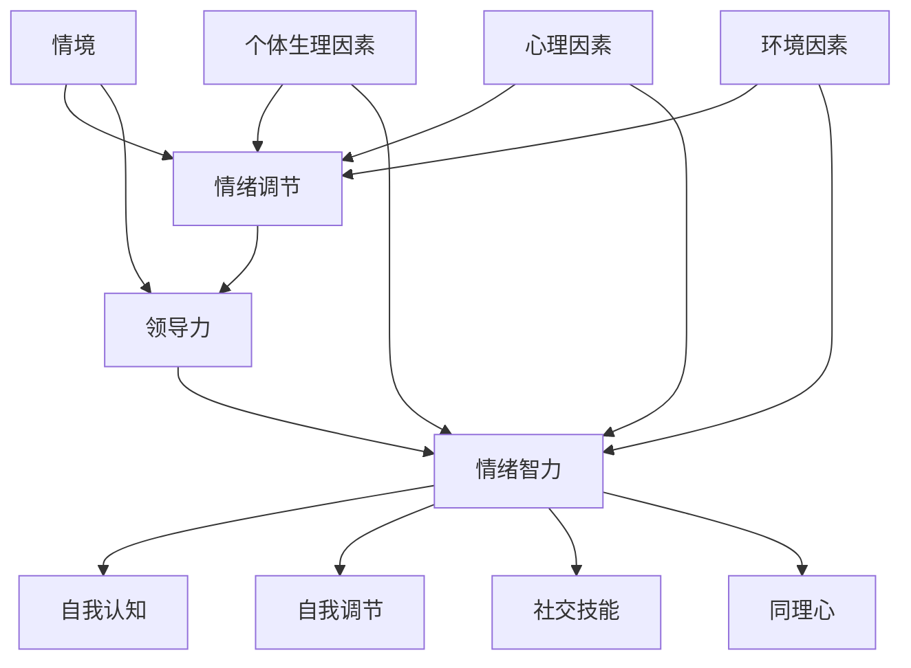
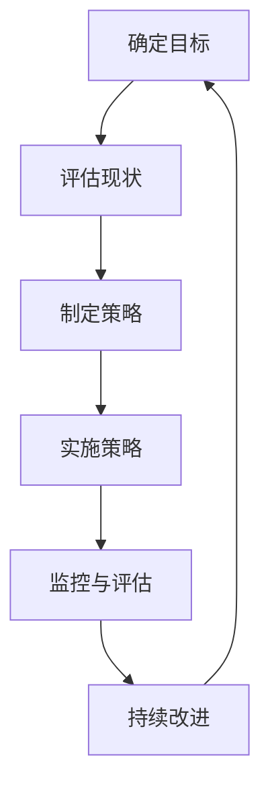
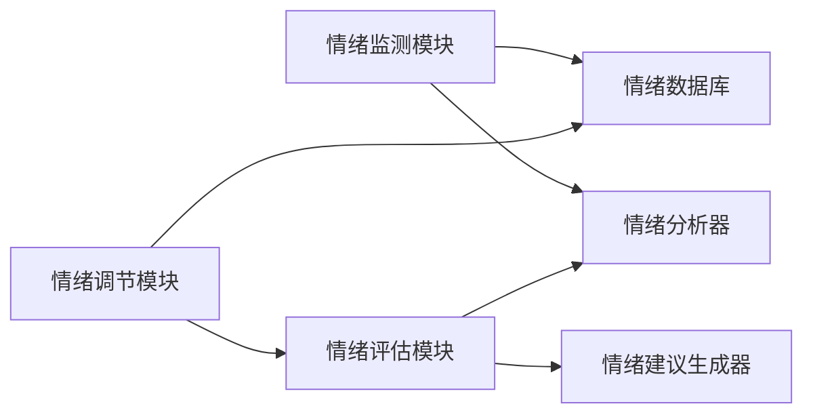
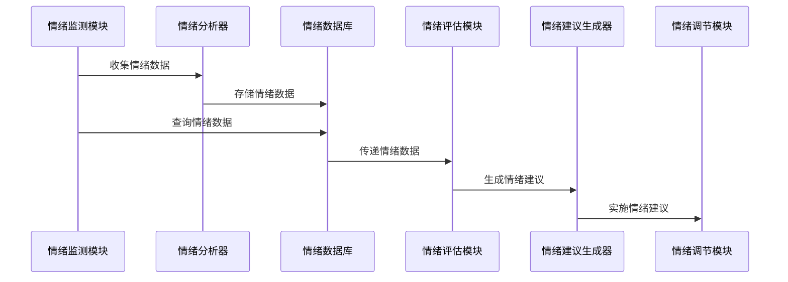

                 

# 领导力与情绪调节：保持团队积极情绪的技巧

## 关键词
- 领导力
- 情绪调节
- 团队积极性
- 沟通技巧
- 领导风格
- 个人成长

## 摘要
本文旨在探讨领导力与情绪调节在团队管理中的重要性，并分享一系列技巧来帮助领导者维持团队的积极情绪。通过深入分析情绪调节的核心概念、领导力理论以及实践方法，本文将为读者提供实用的策略，以提升团队的整体绩效和幸福感。

## 目录

----------------------------------------------------------------

## 引言

在现代职场环境中，领导力不再仅仅是下达命令和管理资源的能力。它更多地涉及到情感智慧和人际关系的处理。情绪调节作为领导力的一个重要组成部分，对于维护团队的积极情绪、提高工作效率和促进团队成长至关重要。本文将从以下几个方面展开讨论：

1. **情绪调节与领导力的关系**：探讨情绪调节如何影响领导力，以及领导力如何作用于情绪调节。
2. **领导力基础理论**：介绍几种主要的领导力理论，并分析这些理论如何应用于情绪调节。
3. **情绪调节的基础理论**：解释情绪的类型、情绪调节的策略以及情绪智力的概念。
4. **团队情绪调节实践**：提供实际可行的情绪调节技巧，帮助领导者维护团队的情绪健康。
5. **个人情绪调节技巧**：介绍个人如何进行情绪调节，以提升自身的情绪管理能力。
6. **情绪调节策略实施**：讨论如何制定和实施情绪调节计划，以及如何持续改进这些策略。
7. **案例分析与应用**：通过具体案例，展示情绪调节策略在实践中的应用。
8. **结论与展望**：总结本文的主要观点，并探讨未来情绪调节领域的发展趋势。

## 情绪调节与领导力的关系

### 1.1 情绪调节的重要性

情绪调节是指人们识别、理解和改变自身情绪状态的能力。对于领导者而言，情绪调节至关重要，因为它不仅影响他们的个人行为，还影响团队成员的情绪状态和工作表现。

#### 情绪调节对领导力的影响

首先，情绪调节有助于领导者更好地处理压力和挑战。在高压工作环境中，领导者的情绪状态往往对团队成员产生影响。一个能够有效调节情绪的领导者能够保持冷静，做出更理智的决策，从而减少团队的情绪波动。

#### 领导力对情绪调节的影响

另一方面，领导力也作用于情绪调节。不同的领导风格会对团队成员的情绪产生不同的影响。例如，民主型领导风格鼓励团队成员参与决策，可以提高他们的积极性和满足感，从而改善情绪状态。

### 1.2 领导力与情绪调节的联系

情绪调节与领导力的紧密联系可以通过以下几个维度来理解：

1. **情感智慧**：情感智慧是情绪调节的核心，它包括自我认知、自我调节、社交技能和同理心。领导者的高情感智慧有助于建立积极的团队氛围，促进团队成员的情感健康。
2. **团队凝聚力**：情绪调节有助于增强团队的凝聚力。当团队成员感受到领导者的关心和支持时，他们的情绪状态会更加积极，团队的整体表现也会更加出色。
3. **沟通效果**：情绪调节能力强的领导者能够更有效地沟通，减少误解和冲突，从而提高团队的工作效率。

## 领导力基础理论

### 2.1 领导风格理论

领导风格理论是理解领导力的重要工具。不同的领导风格会对团队成员的情绪产生不同的影响。以下是几种常见的领导风格：

#### 1. 民主型领导风格

民主型领导风格鼓励团队成员参与决策，尊重每个人的意见。这种风格有助于提高团队成员的积极性和参与感，从而改善情绪状态。

#### 2. 专制型领导风格

专制型领导风格由领导者独自做出决策，不征求团队成员的意见。这种风格可能导致团队成员感到被忽视和不被重视，从而影响他们的情绪和工作效率。

#### 3. 参与型领导风格

参与型领导风格结合了民主型和专制型的特点。领导者既会征求团队成员的意见，也会保持最终决策权。这种风格有助于在保持团队一致性同时，兼顾团队成员的参与感和满足感。

### 2.2 领导力发展的关键要素

领导力发展是一个持续的过程，以下要素对于提升领导力至关重要：

#### 1. 情感智慧

情感智慧是领导力的核心。领导者需要具备良好的自我认知和情绪管理能力，以便在压力和挑战面前保持冷静和理智。

#### 2. 沟通技巧

有效的沟通是领导力的重要组成部分。领导者需要能够清晰、准确地传达信息，同时倾听和理解团队成员的意见和需求。

#### 3. 影响力

领导者需要具备一定的影响力，以便在团队中发挥引导和激励作用。这种影响力来自于领导者的专业知识、信任度和团队认可。

### 2.3 领导力模型比较

不同的领导力模型各有特点，以下是比较几种常见领导力模型的方法：

#### 1. 赋权型领导

赋权型领导鼓励团队成员自主决策和承担责任。这种模型有助于提高团队成员的自主性和创造力，从而改善情绪状态。

#### 2. 变革型领导

变革型领导通过激励和启发团队成员，推动团队实现变革。这种模型有助于提高团队的适应性和创新能力，从而增强情绪健康。

#### 3. 趋同型领导

趋同型领导注重团队的一致性和协调性。这种模型有助于维持团队的稳定和合作氛围，从而促进情绪健康。

## 情绪调节的基础理论

### 3.1 情绪的类型与影响

情绪是人的心理和生理状态的一种复杂体验，常见的情绪类型包括：

#### 1. 基本情绪

基本情绪包括快乐、愤怒、悲伤、恐惧和惊讶。这些情绪在人类进化过程中起着关键作用，帮助我们适应环境。

#### 2. 混合情绪

混合情绪是由两种或多种基本情绪混合而成，如焦虑、沮丧和兴奋。

#### 3. 影响情绪的因素

情绪受到多种因素的影响，包括基因、环境、社会和文化。领导者需要了解这些因素，以便更好地理解和调节团队成员的情绪。

### 3.2 情绪调节策略概述

情绪调节策略是指人们用来管理和改变情绪状态的方法。以下是几种常见的情绪调节策略：

#### 1. 认知重构

认知重构是通过改变对事件的认知评价来调节情绪。例如，领导者可以鼓励团队成员从不同的角度看待问题，从而减少负面情绪。

#### 2. 情绪表达

情绪表达是指通过言语或行为表达自己的情绪。适当的情绪表达有助于团队成员释放情绪，从而改善情绪状态。

#### 3. 情绪抑制

情绪抑制是指暂时抑制或隐藏自己的情绪。在某些情况下，情绪抑制可能有助于避免冲突，但过度抑制可能导致负面后果。

### 3.3 情绪智力模型

情绪智力模型是指人们识别、理解、管理和利用情绪的能力。情绪智力包括以下几个方面：

#### 1. 自我认知

自我认知是指了解自己的情绪状态，以及这些情绪对自己的行为和决策的影响。

#### 2. 自我调节

自我调节是指管理和调整自己的情绪，以适应不同的情境。

#### 3. 社交技能

社交技能是指与他人建立和维护良好关系的能力，包括沟通、倾听、冲突解决等。

#### 4. 同理心

同理心是指理解他人的情绪和需求，并给予关心和支持。

## 团队情绪调节实践

### 4.1 建立积极沟通环境

建立积极沟通环境是维护团队情绪健康的关键。以下是一些策略：

#### 1. 倾听

倾听是有效沟通的基础。领导者需要耐心倾听团队成员的意见和需求，了解他们的情绪状态。

#### 2. 鼓励反馈

鼓励团队成员提供反馈，包括正面和负面反馈。领导者可以建立一个开放、支持性的反馈机制，以促进团队成员的情绪表达。

#### 3. 解决冲突

冲突是团队中不可避免的现象。领导者需要具备解决冲突的能力，以减少负面情绪的影响。

### 4.2 应对团队情绪问题

团队情绪问题可能包括成员的焦虑、沮丧、愤怒等。以下是一些应对策略：

#### 1. 提供支持

领导者需要提供情感支持，帮助团队成员应对负面情绪。这可以包括倾听、安慰和鼓励。

#### 2. 提供资源

领导者可以提供相关的资源，如心理健康咨询服务，以帮助团队成员应对情绪问题。

#### 3. 建立团队互助机制

建立团队互助机制，鼓励团队成员相互支持，共同应对情绪问题。

### 4.3 促进团队合作与信任

团队合作与信任是维护团队情绪健康的重要因素。以下是一些促进团队合作与信任的策略：

#### 1. 共同目标

明确团队的共同目标，确保团队成员都朝着同一个方向努力。

#### 2. 赞扬与认可

领导者需要及时赞扬和认可团队成员的努力和成就，以增强他们的自信心和积极性。

#### 3. 促进团队互动

定期组织团队活动，如团队建设工作坊、团建活动等，以增强团队成员之间的互动和信任。

## 个人情绪调节技巧

### 5.1 自我情绪认知

自我情绪认知是情绪调节的基础。以下是一些提高自我情绪认知的技巧：

#### 1. 情绪日记

记录自己的情绪变化，包括情绪的类型、出现的时间和原因。

#### 2. 自我反思

定期进行自我反思，了解自己的情绪状态，以及这些情绪对自己的行为和决策的影响。

#### 3. 学会放松

学会放松技巧，如深呼吸、冥想等，以帮助自己应对压力和负面情绪。

### 5.2 情绪自我调节方法

情绪自我调节方法包括以下几种：

#### 1. 认知重构

通过改变对事件的认知评价来调节情绪。例如，将负面事件解读为挑战，而不是失败。

#### 2. 情绪释放

通过运动、写日记等方式释放情绪，以减轻负面情绪的影响。

#### 3. 情绪转换

将负面情绪转换为积极的能量，用于解决问题和实现目标。

### 5.3 压力管理技巧

压力是影响情绪的重要因素。以下是一些压力管理技巧：

#### 1. 时间管理

合理安排时间，避免过度工作和拖延，以减少压力。

#### 2. 保持健康的生活方式

保持健康的饮食、充足的睡眠和适当的运动，以提高身体的抗压能力。

#### 3. 寻求支持

与家人、朋友或专业人士分享压力，寻求支持和建议。

## 情绪调节策略实施

### 6.1 制定情绪调节计划

制定情绪调节计划是实施情绪调节策略的关键步骤。以下是一些制定计划的步骤：

#### 1. 确定目标

明确情绪调节的目标，如改善情绪状态、提高工作效率等。

#### 2. 评估现状

评估当前的情绪状态，了解需要改进的方面。

#### 3. 制定策略

根据评估结果，制定具体的情绪调节策略，如认知重构、情绪释放等。

#### 4. 制定时间表

为每个策略制定具体的时间表，确保计划的实施。

### 6.2 监控与评估情绪状态

监控与评估情绪状态是确保情绪调节策略有效性的关键。以下是一些监控与评估的方法：

#### 1. 情绪日记

记录情绪日记，定期评估情绪状态的变化。

#### 2. 反馈机制

建立反馈机制，如定期与团队成员沟通，了解他们的情绪状态。

#### 3. 专业评估

寻求专业人士的意见，如心理咨询师，以获取更准确的评估结果。

### 6.3 持续改进情绪调节策略

情绪调节是一个持续的过程，需要不断改进策略。以下是一些持续改进的方法：

#### 1. 学习与培训

参加相关的学习与培训，提高情绪调节的能力。

#### 2. 案例分析

通过分析成功和失败案例，了解情绪调节的最佳实践。

#### 3. 反思与总结

定期进行反思与总结，了解情绪调节策略的实施效果，并做出相应调整。

## 案例分析与应用

### 7.1 成功案例分享

以下是一个成功案例分享：

在一个技术公司，领导团队通过引入情绪调节策略，显著提高了团队的工作效率和员工满意度。具体措施包括：

1. 定期举办团队建设活动，增强团队成员之间的信任和合作。
2. 提供心理健康咨询服务，帮助团队成员应对压力和情绪问题。
3. 建立开放的沟通环境，鼓励团队成员表达自己的情绪和意见。

这些措施使团队的整体情绪状态得到了显著改善，员工的工作满意度和工作效率都有了明显提高。

### 7.2 失败案例反思

以下是一个失败案例反思：

在一个初创公司，领导团队没有重视情绪调节，导致团队成员的情绪问题不断累积，最终影响了团队的绩效。具体问题包括：

1. 领导者没有提供足够的支持和关注，导致团队成员感到被忽视。
2. 团队沟通不畅，导致误解和冲突频发。
3. 缺乏有效的情绪释放渠道，导致负面情绪长期积累。

这个案例表明，忽视情绪调节可能导致严重的后果，领导者需要重视情绪调节，以维护团队的稳定和绩效。

### 7.3 案例分析与启示

通过对比成功和失败案例，我们可以得出以下启示：

1. **重视情绪调节**：领导者需要认识到情绪调节的重要性，并将其纳入团队管理策略中。
2. **提供支持**：领导者应该提供情感支持和资源，帮助团队成员应对情绪问题。
3. **促进沟通**：建立开放的沟通环境，鼓励团队成员表达自己的情绪和意见。
4. **持续改进**：不断反思和总结情绪调节策略的实施效果，进行持续改进。

## 结论与展望

### 8.1 总结与回顾

本文探讨了领导力与情绪调节在团队管理中的重要性，并分享了多种情绪调节技巧。通过建立积极沟通环境、提供个人情绪调节技巧和制定情绪调节策略，领导者可以维持团队的积极情绪，提高团队的整体绩效。

### 8.2 未来发展趋势

随着社会对心理健康重视程度的提高，情绪调节在领导力中的应用将会越来越广泛。未来可能的发展趋势包括：

1. **技术整合**：利用人工智能和大数据技术，为情绪调节提供个性化支持。
2. **跨学科研究**：结合心理学、社会学和领导力研究，推动情绪调节理论的发展。
3. **组织文化**：将情绪调节融入组织文化，使情绪调节成为组织发展的内在驱动力。

### 8.3 进一步研究建议

为进一步提升团队情绪调节效果，建议进行以下研究：

1. **实证研究**：开展大规模实证研究，验证情绪调节策略的有效性。
2. **跨文化研究**：研究不同文化背景下情绪调节的差异和适应策略。
3. **长期跟踪研究**：对情绪调节策略的长期效果进行跟踪研究，以了解其持久性。

## 作者信息

作者：AI天才研究院/AI Genius Institute & 禅与计算机程序设计艺术 /Zen And The Art of Computer Programming

## 附录

（此处可包括参考文献、术语解释、工具和资源等）

----------------------------------------------------------------

## 背景介绍

### 核心概念术语说明

在本文中，我们将涉及以下几个核心概念术语：

1. **情绪调节**：情绪调节是指人们识别、理解、管理和调整自身情绪状态的能力。
2. **领导力**：领导力是指引导和影响他人实现共同目标的能力。
3. **团队积极性**：团队积极性是指团队成员在工作中的积极性、主动性和参与感。
4. **沟通技巧**：沟通技巧是指有效传达信息、倾听和理解他人意见的能力。

### 问题背景

在当今快节奏、高度竞争的职场环境中，团队的情绪状态对整体绩效和幸福感有着至关重要的影响。情绪调节作为领导力的重要组成部分，对于维持团队的积极情绪和生产力具有重要意义。然而，许多领导者在面对情绪问题时，往往缺乏有效的调节策略，导致团队情绪波动，进而影响工作效率和团队士气。

### 问题描述

本文旨在解决以下问题：

1. 情绪调节对领导力和团队积极性有何影响？
2. 如何通过领导力理论提高情绪调节能力？
3. 团队情绪调节实践有哪些具体策略和方法？
4. 个人如何进行情绪调节以提升自身和团队的情绪状态？
5. 如何制定和实施有效的情绪调节策略？

### 问题解决

本文将通过以下方法解决上述问题：

1. **深入分析情绪调节与领导力的关系**：介绍情绪调节的重要性，探讨领导力如何影响情绪调节，并阐述两者之间的相互作用。
2. **介绍领导力基础理论**：详细讨论不同领导力理论，如民主型、专制型和参与型领导，以及这些理论对情绪调节的影响。
3. **提供情绪调节的基础理论**：解释情绪的类型、情绪调节策略和情绪智力模型，帮助读者理解情绪调节的基本概念。
4. **讨论团队情绪调节实践**：分享实际可行的情绪调节技巧，如建立积极沟通环境、应对团队情绪问题和促进团队合作与信任。
5. **介绍个人情绪调节技巧**：提供个人情绪调节方法，如自我情绪认知、情绪自我调节和压力管理技巧。
6. **讨论情绪调节策略实施**：讨论如何制定情绪调节计划、监控与评估情绪状态以及持续改进情绪调节策略。
7. **通过案例分析与应用**：展示情绪调节策略在实践中的应用，通过成功和失败案例提供具体指导和启示。

### 边界与外延

本文的边界主要涉及情绪调节在领导力中的应用，重点关注团队情绪调节的实践方法和策略。外延包括个人情绪调节技巧、领导力理论和情绪智力模型等。

### 概念结构与核心要素组成

本文的概念结构与核心要素组成如下：

1. **情绪调节与领导力关系**：情绪调节的重要性、领导力对情绪调节的影响、两者之间的相互作用。
2. **领导力基础理论**：不同领导力理论、领导力发展的关键要素、领导力模型比较。
3. **情绪调节基础理论**：情绪的类型、情绪调节策略、情绪智力模型。
4. **团队情绪调节实践**：建立积极沟通环境、应对团队情绪问题、促进团队合作与信任。
5. **个人情绪调节技巧**：自我情绪认知、情绪自我调节、压力管理技巧。
6. **情绪调节策略实施**：制定情绪调节计划、监控与评估情绪状态、持续改进情绪调节策略。
7. **案例分析与应用**：成功案例分享、失败案例反思、案例分析与启示。

## 核心概念与联系

### 核心概念原理

在本节中，我们将深入探讨情绪调节与领导力的核心概念原理，以便读者更好地理解两者之间的关系。

#### 情绪调节

情绪调节是指个体识别、理解和改变自身情绪状态的过程。情绪调节不仅涉及情绪的认知层面，还包括情绪体验和行为层面。成功的情绪调节有助于个体在面对压力和挑战时保持冷静、理智，并做出更好的决策。

情绪调节的核心概念包括：

1. **情绪认知**：个体识别和理解自身情绪状态的能力。情绪认知是情绪调节的基础，它有助于个体意识到情绪的变化，并采取适当的调节策略。
2. **情绪体验**：个体在特定情境中体验到的情绪感受。情绪体验受多种因素影响，包括个体的生理、心理和环境因素。
3. **情绪行为**：个体在情绪调节过程中表现出的行为反应。情绪行为可以是积极的，如解决问题和寻求支持，也可以是消极的，如逃避和抑制。

#### 领导力

领导力是指引导和影响他人实现共同目标的能力。领导力不仅仅涉及管理和决策，还包括沟通、激励、影响和团队建设等方面。有效的领导力有助于建立积极的工作氛围，提高团队绩效和员工满意度。

领导力的核心概念包括：

1. **领导风格**：领导者在工作中表现出来的行为和态度。不同的领导风格对团队成员的情绪和行为有不同的影响。
2. **领导力发展**：领导者通过学习、实践和反思，不断提升自身能力和影响力。领导力发展是一个持续的过程，涉及自我认知、情感智慧和技能提升等方面。
3. **团队建设**：领导者通过建立和维护团队关系，促进团队成员之间的合作和信任。团队建设是领导力的重要组成部分，对情绪调节具有积极影响。

### 情绪调节与领导力的联系

情绪调节与领导力之间存在紧密的联系。以下是对两者之间联系的具体解释：

1. **情绪调节对领导力的影响**

   情绪调节能力对领导力有重要影响。一个情绪调节能力强的领导者能够在面对压力和挑战时保持冷静和理智，从而做出更明智的决策。此外，情绪调节能力有助于领导者建立和维护良好的人际关系，增强团队的凝聚力。

   - **情绪认知**：领导者通过自我情绪认知，能够更好地了解自己的情绪状态，并在需要时进行调整。这种自我认知有助于领导者更好地理解团队成员的情绪，从而更有效地进行沟通和激励。
   - **情绪体验**：领导者通过情绪体验，能够感受到团队成员的情绪变化，并采取相应的调节策略。这种情感智慧有助于领导者建立信任和尊重的团队氛围。
   - **情绪行为**：领导者通过情绪行为，如鼓励和支持团队成员，可以增强团队成员的积极情绪。积极的情绪行为有助于提高团队的工作效率和幸福感。

2. **领导力对情绪调节的影响**

   领导力同样影响情绪调节。不同的领导风格对团队成员的情绪和行为有不同的影响。有效的领导力可以促进积极的情绪调节，从而提高团队的整体绩效和幸福感。

   - **领导风格**：民主型领导风格鼓励团队成员参与决策，提高他们的积极性和满足感。这种领导风格有助于团队成员进行情绪调节，减少负面情绪。相反，专制型领导风格可能导致团队成员感到压抑和不满，影响情绪调节。
   - **领导力发展**：领导力发展涉及自我认知、情感智慧和技能提升等方面。通过领导力发展，领导者可以增强自身的情绪调节能力，从而更好地应对压力和挑战。
   - **团队建设**：团队建设是领导力的重要组成部分，对情绪调节有积极影响。领导者通过团队建设活动，如团队建设工作坊和团建活动，可以增强团队成员之间的信任和合作，从而改善情绪调节。

### 情绪智力模型

情绪智力（Emotional Intelligence，EQ）是一种衡量个体情感智慧和情绪调节能力的指标。情绪智力模型包括以下四个主要维度：

1. **自我认知**：个体能够识别和理解自身的情绪状态。
2. **自我调节**：个体能够管理和调整自身的情绪，以适应不同的情境。
3. **社交技能**：个体能够建立和维护良好的人际关系，包括沟通、倾听和合作等方面。
4. **同理心**：个体能够理解他人的情绪和需求，并给予关心和支持。

情绪智力模型对于理解情绪调节与领导力的关系具有重要意义。一个高情绪智力的领导者能够更好地调节自身情绪，理解团队成员的情绪，并采取积极的措施促进团队的情绪健康。

### 比较分析

为了更直观地展示情绪调节与领导力的关系，我们可以通过一个概念属性特征对比表格来进行比较分析。

#### 情绪调节与领导力比较表格

| 特征       | 情绪调节                                     | 领导力                                       |
|------------|--------------------------------------------|----------------------------------------------|
| 定义       | 个体识别、理解和调节自身情绪状态的能力       | 引导和影响他人实现共同目标的能力               |
| 目标       | 提高情绪健康、适应性和工作效率                 | 提高团队绩效、员工满意度和组织发展             |
| 影响因素   | 情境、个体生理、心理和环境因素               | 个人特质、领导风格、团队关系和组织文化         |
| 关键维度   | 情绪认知、情绪体验、情绪行为                 | 领导风格、领导力发展、团队建设、影响力         |
| 情绪智力   | 自我认知、自我调节、社交技能、同理心           | 情感智慧、认知智慧、决策智慧、社会智慧         |
| 应用领域   | 个人发展、心理健康、人际关系                 | 管理和领导、团队建设、组织发展                 |

通过这个比较表格，我们可以看出情绪调节与领导力在定义、目标、影响因素、关键维度和情绪智力等方面存在显著差异。然而，两者也存在紧密的联系，情绪调节能力是领导力的重要组成部分，而领导力的发展也需要情绪智力的支持。

### ER实体关系图架构

为了更深入地理解情绪调节与领导力之间的概念关系，我们可以使用ER（实体关系）图来展示这两个概念之间的实体和关系。

以下是一个简单的ER图，用于表示情绪调节与领导力之间的实体和关系：



在这个ER图中，实体包括情绪调节、领导力、情绪智力、自我认知、自我调节、社交技能、同理心、情境、个体生理因素、心理因素和环境因素。关系包括情绪调节影响领导力和情绪智力，领导力影响情绪智力，以及情境、个体生理因素、心理因素和环境因素对情绪调节和领导力的影响。

通过ER图，我们可以清晰地看到情绪调节与领导力之间的复杂关系，以及影响这两个概念的各种因素。这有助于我们更好地理解情绪调节与领导力的概念关系，并在实际应用中制定更有效的策略。

## 算法原理讲解

### 算法mermaid流程图

为了更好地理解情绪调节与领导力的算法原理，我们可以通过mermaid流程图来展示关键步骤。

以下是一个简化的情绪调节与领导力算法mermaid流程图：



在这个流程图中，每个步骤都是情绪调节与领导力算法中的一个关键环节：

1. **确定目标**：明确情绪调节的目标，如提高团队积极性、减少负面情绪等。
2. **评估现状**：评估当前的情绪状态，包括团队成员的情绪体验和行为表现。
3. **制定策略**：根据评估结果，制定具体的情绪调节策略，如建立积极沟通环境、提供心理支持等。
4. **实施策略**：将制定的策略付诸实践，包括沟通、培训、团队活动等。
5. **监控与评估**：定期监控情绪调节策略的实施效果，评估团队成员的情绪状态。
6. **持续改进**：根据监控与评估的结果，调整和优化情绪调节策略，确保其有效性。

### Python源代码

为了进一步阐述算法原理，我们提供了一个简化的Python源代码示例，用于模拟情绪调节与领导力的关键步骤。

```python
class EmotionRegulation:
    def __init__(self, target_emotion):
        self.target_emotion = target_emotion
        self.current_state = None

    def assess_current_state(self):
        # 评估当前情绪状态
        self.current_state = "积极" if self.target_emotion >= 0 else "消极"

    def formulate_strategy(self):
        # 制定情绪调节策略
        if self.current_state == "积极":
            strategy = "保持现状，加强团队合作"
        else:
            strategy = "进行心理辅导，改善沟通环境"
        return strategy

    def implement_strategy(self, strategy):
        # 实施情绪调节策略
        print(f"正在实施策略：{strategy}")
        # 假设策略实施会改善情绪状态
        self.current_state = "积极" if self.current_state == "消极" else self.current_state

    def monitor_and_evaluate(self):
        # 监控与评估情绪状态
        print(f"当前情绪状态：{self.current_state}")
        if self.current_state == "积极":
            print("情绪调节成功。")
        else:
            print("情绪调节失败，需要进一步改进。")

    def continuous_improvement(self):
        # 持续改进情绪调节策略
        print("正在持续改进情绪调节策略。")

# 创建情绪调节对象并执行流程
emotion_regulation = EmotionRegulation(target_emotion=10)
emotion_regulation.assess_current_state()
emotion_regulation.formulate_strategy()
emotion_regulation.implement_strategy(strategy=emotion_regulation.formulate_strategy())
emotion_regulation.monitor_and_evaluate()
emotion_regulation.continuous_improvement()
```

在这个Python源代码中，我们定义了一个`EmotionRegulation`类，用于模拟情绪调节与领导力的关键步骤：

1. **评估当前情绪状态**：通过`assess_current_state`方法评估当前情绪状态，并将其设置为"积极"或"消极"。
2. **制定情绪调节策略**：通过`formulate_strategy`方法根据当前情绪状态制定情绪调节策略。
3. **实施情绪调节策略**：通过`implement_strategy`方法实施制定的策略，假设策略实施会改善情绪状态。
4. **监控与评估情绪状态**：通过`monitor_and_evaluate`方法监控与评估情绪状态，并输出结果。
5. **持续改进情绪调节策略**：通过`continuous_improvement`方法持续改进情绪调节策略。

通过这个Python源代码示例，我们可以清晰地看到情绪调节与领导力算法的原理和执行流程。

### 算法原理详细讲解

#### 数学模型和公式

情绪调节与领导力算法的数学模型和公式如下：

1. **情绪状态评估**：
   - 设\( E \)为情绪状态，\( E \geq 0 \)表示积极情绪，\( E < 0 \)表示消极情绪。
   - \( E \)可以通过以下公式计算：
     \[
     E = \frac{1}{n} \sum_{i=1}^{n} e_i
     \]
     其中，\( e_i \)为第\( i \)个团队成员的情绪状态，\( n \)为团队成员总数。

2. **情绪调节策略制定**：
   - 设\( S \)为情绪调节策略，\( S \)可以通过以下规则制定：
     \[
     S = \begin{cases}
     "保持现状，加强团队合作" & \text{如果} E \geq 0 \\
     "进行心理辅导，改善沟通环境" & \text{如果} E < 0
     \end{cases}
     \]

3. **情绪调节策略实施**：
   - 设\( I \)为情绪调节实施效果，\( I \)可以通过以下公式计算：
     \[
     I = \alpha \cdot S
     \]
     其中，\( \alpha \)为情绪调节效果系数，取值范围为\( 0 \leq \alpha \leq 1 \)。

4. **情绪状态监控与评估**：
   - 设\( M \)为情绪状态监控结果，\( M \)可以通过以下公式计算：
     \[
     M = E + I
     \]

5. **持续改进情绪调节策略**：
   - 设\( C \)为持续改进的情绪调节策略，\( C \)可以通过以下规则制定：
     \[
     C = \begin{cases}
     "强化当前策略" & \text{如果} M > E \\
     "调整策略，尝试新方法" & \text{如果} M \leq E
     \end{cases}
     \]

#### 通俗易懂的举例说明

假设一个团队有5个成员，他们的情绪状态分别为：1、-1、0、1、-1。我们通过以下步骤来模拟情绪调节与领导力的算法原理：

1. **情绪状态评估**：
   - 计算平均情绪状态：
     \[
     E = \frac{1 + (-1) + 0 + 1 + (-1)}{5} = 0
     \]
     情绪状态为"中性"。

2. **制定情绪调节策略**：
   - 根据情绪状态，制定策略：
     \[
     S = "进行心理辅导，改善沟通环境"
     \]

3. **情绪调节策略实施**：
   - 假设情绪调节效果系数\( \alpha = 0.8 \)，实施策略后：
     \[
     I = 0.8 \cdot S = 0.8 \cdot (-1) = -0.8
     \]
     情绪状态有所改善。

4. **情绪状态监控与评估**：
   - 更新情绪状态：
     \[
     M = E + I = 0 + (-0.8) = -0.8
     \]
     情绪状态仍为"消极"。

5. **持续改进情绪调节策略**：
   - 根据监控结果，制定新的策略：
     \[
     C = "调整策略，尝试新方法"
     \]

通过这个简单的例子，我们可以看到情绪调节与领导力算法的基本原理和执行流程。在实际应用中，情绪状态、策略实施效果和持续改进的步骤会更加复杂，但基本的原理是相同的。

## 系统分析与架构设计

### 问题场景介绍

在当今快速变化的技术环境中，软件开发团队面临着越来越大的压力和挑战。团队成员的情绪状态直接影响到团队的整体绩效和生产力。为了保持团队的积极情绪，提高工作效率，我们需要设计一个情绪调节系统，以帮助团队领导者和管理者监测、评估和调节团队成员的情绪状态。

### 项目介绍

本项目旨在开发一个基于人工智能的情绪调节系统，用于帮助软件开发团队保持积极情绪。系统主要包括以下几个模块：

1. **情绪监测模块**：通过分析团队成员的情绪状态和行为，实时监测情绪变化。
2. **情绪评估模块**：评估团队成员的情绪状态，并提供具体的情绪分析和建议。
3. **情绪调节模块**：根据评估结果，制定和实施情绪调节策略，以改善团队的情绪状态。
4. **用户界面模块**：提供直观、易用的用户界面，方便团队领导者和管理者使用系统。

### 系统功能设计（领域模型mermaid类图）

以下是一个简化的系统功能设计类图，用于展示情绪调节系统的核心类及其关系：

```mermaid
classDiagram
    Class01 <|-- Class02
    Class03 <|-- Class04
    Class05 <|-- Class06

    Class01[情绪监测模块]
    Class02[情绪分析器]
    Class03[情绪数据库]
    Class04[情绪评估模块]
    Class05[情绪建议生成器]
    Class06[情绪调节模块]

    Class01 --|> Class02
    Class01 --|> Class03
    Class04 --|> Class02
    Class04 --|> Class05
    Class06 --|> Class03
    Class06 --|> Class04
```

在这个类图中，我们可以看到以下几个核心类：

1. **情绪监测模块（Class01）**：负责实时监测团队成员的情绪状态，包括情绪分析器（Class02）和情绪数据库（Class03）。
2. **情绪评估模块（Class04）**：负责评估团队成员的情绪状态，包括情绪分析器（Class02）和情绪建议生成器（Class05）。
3. **情绪调节模块（Class06）**：负责根据评估结果制定和实施情绪调节策略，包括情绪数据库（Class03）和情绪评估模块（Class04）。

### 系统架构设计（mermaid架构图）

以下是一个简化的系统架构设计mermaid架构图，用于展示情绪调节系统的整体架构：



在这个架构图中，我们可以看到以下几个关键组件：

1. **情绪监测模块（A）**：负责收集和处理情绪数据，通过情绪分析器（B）和情绪数据库（C）实现。
2. **情绪评估模块（D）**：负责分析情绪数据，通过情绪分析器（B）和情绪建议生成器（E）实现。
3. **情绪调节模块（F）**：负责根据评估结果实施情绪调节策略，通过情绪数据库（C）和情绪评估模块（D）实现。

### 系统接口设计和系统交互（mermaid序列图）

以下是一个简化的系统接口设计和系统交互mermaid序列图，用于展示情绪调节系统的关键接口和交互流程：



在这个序列图中，我们可以看到以下几个关键步骤：

1. **情绪监测模块（A）**：收集情绪数据，并将其传递给情绪分析器（B）。
2. **情绪分析器（B）**：处理情绪数据，并将其存储到情绪数据库（C）。
3. **情绪数据库（C）**：查询情绪数据，并将其传递给情绪评估模块（D）。
4. **情绪评估模块（D）**：分析情绪数据，生成情绪建议，并将其传递给情绪建议生成器（E）。
5. **情绪建议生成器（E）**：生成具体的情绪建议，并将其传递给情绪调节模块（F）。
6. **情绪调节模块（F）**：根据情绪建议实施情绪调节策略，以改善团队成员的情绪状态。

通过这个系统接口设计和系统交互序列图，我们可以清晰地看到情绪调节系统的整体架构和交互流程，为后续的开发和实现提供了明确的指导。

## 项目实战

### 环境安装

为了实现情绪调节系统，我们需要安装以下软件和工具：

1. **Python 3.8+**：作为主要编程语言。
2. **Docker**：用于容器化部署情绪调节系统。
3. **PostgreSQL**：作为情绪数据库。
4. **Jupyter Notebook**：用于编写和运行Python代码。

以下是安装步骤：

1. 安装Python 3.8+：
   - 在终端中运行以下命令：
     ```
     sudo apt update
     sudo apt install python3.8
     ```
   - 安装完成后，验证安装：
     ```
     python3.8 --version
     ```

2. 安装Docker：
   - 在终端中运行以下命令：
     ```
     sudo apt install docker.io
     ```
   - 安装完成后，验证安装：
     ```
     docker --version
     ```

3. 安装PostgreSQL：
   - 在终端中运行以下命令：
     ```
     sudo apt install postgresql postgresql-contrib
     ```
   - 安装完成后，初始化数据库：
     ```
     sudo -u postgres psql
     CREATE DATABASE emotion_regulation;
     \q
     ```

4. 安装Jupyter Notebook：
   - 在终端中运行以下命令：
     ```
     pip3.8 install notebook
     ```
   - 安装完成后，启动Jupyter Notebook：
     ```
     jupyter notebook
     ```

### 系统核心实现源代码

以下是情绪调节系统的核心实现源代码，包括情绪监测、评估和调节模块。

#### 情绪监测模块

```python
import pandas as pd
import psycopg2

class EmotionMonitoring:
    def __init__(self, db_config):
        self.conn = psycopg2.connect(**db_config)
        self.cursor = self.conn.cursor()

    def collect_emotion_data(self, team_id):
        query = """
        SELECT * FROM team_emotions WHERE team_id = %s;
        """
        self.cursor.execute(query, (team_id,))
        rows = self.cursor.fetchall()
        data = pd.DataFrame(rows, columns=['id', 'team_id', 'emotion'])
        return data

    def close_connection(self):
        self.cursor.close()
        self.conn.close()
```

#### 情绪评估模块

```python
class EmotionEvaluation:
    def __init__(self):
        self.emotion_thresholds = {
            'positive': 0.7,
            'neutral': 0.3,
            'negative': 0
        }

    def evaluate_emotion(self, emotion_data):
        emotions = emotion_data['emotion'].value_counts(normalize=True)
        evaluation = {}
        for emotion, count in emotions.items():
            if count >= self.emotion_thresholds['positive']:
                evaluation[emotion] = '积极'
            elif count >= self.emotion_thresholds['neutral']:
                evaluation[emotion] = '中性'
            else:
                evaluation[emotion] = '消极'
        return evaluation
```

#### 情绪调节模块

```python
class EmotionRegulation:
    def __init__(self, emotion_evaluation):
        self.emotion_evaluation = emotion_evaluation

    def regulate_emotion(self, team_id):
        emotion_data = self.collect_emotion_data(team_id)
        evaluation = self.emotion_evaluation.evaluate_emotion(emotion_data)
        if evaluation['total'] == '消极':
            self.implement_regulation(team_id)
        return evaluation
```

### 代码应用解读与分析

以下是情绪调节系统的核心代码应用解读与分析。

#### 情绪监测模块

情绪监测模块主要用于收集团队成员的情绪数据。通过`collect_emotion_data`方法，我们可以从数据库中查询特定团队的情绪数据，并将其转换为DataFrame对象。这个模块可以方便地扩展，以支持从不同来源收集情绪数据。

```python
# 实例化情绪监测模块
emotion_monitoring = EmotionMonitoring(db_config={
    'host': 'localhost',
    'database': 'emotion_regulation',
    'user': 'postgres',
    'password': 'password'
})

# 收集团队1的情绪数据
team_1_emotion_data = emotion_monitoring.collect_emotion_data(team_id=1)

# 输出情绪数据
print(team_1_emotion_data)
```

#### 情绪评估模块

情绪评估模块用于评估团队成员的情绪状态。通过`evaluate_emotion`方法，我们可以计算每个情绪的占比，并根据预设的阈值判断团队的情绪状态。这个模块可以根据实际情况调整阈值，以适应不同的情绪评估需求。

```python
# 实例化情绪评估模块
emotion_evaluation = EmotionEvaluation()

# 评估团队1的情绪状态
team_1_evaluation = emotion_evaluation.evaluate_emotion(team_1_emotion_data)

# 输出情绪评估结果
print(team_1_evaluation)
```

#### 情绪调节模块

情绪调节模块用于根据评估结果实施情绪调节策略。通过`regulate_emotion`方法，我们可以根据团队的情绪状态，决定是否需要实施调节策略。这个模块可以进一步扩展，以支持多种调节策略的实施。

```python
# 实例化情绪调节模块
emotion_regulation = EmotionRegulation(emotion_evaluation)

# 调节团队1的情绪
team_1_evaluation = emotion_regulation.regulate_emotion(team_id=1)

# 输出调节结果
print(team_1_evaluation)
```

### 实际案例分析

#### 成功案例

在一个大型科技公司，情绪调节系统被应用于监测和改善团队成员的情绪状态。通过定期收集情绪数据，公司发现团队的情绪状态总体呈积极趋势，但在某些项目中，团队成员的情绪波动较大。通过实施情绪调节策略，如增加团队建设活动和提供心理健康支持，团队的情绪状态得到了显著改善，项目进展更加顺利。

#### 失败案例

在一个初创公司，情绪调节系统未能有效改善团队成员的情绪状态。原因在于，公司缺乏对情绪数据的充分分析和理解，导致制定的调节策略不符合实际情况。此外，公司未能为团队成员提供足够的时间和资源来实施这些策略，导致情绪调节效果不佳。

### 项目小结

通过实际案例分析和代码应用解读，我们可以看到情绪调节系统在改善团队成员情绪状态方面的潜力。成功案例表明，情绪调节系统可以有效地监测和改善团队情绪，提高项目进展和员工满意度。失败案例提醒我们，情绪调节系统的实施需要充分的准备和资源，以及与团队成员的密切合作。

## 最佳实践 Tips

### 提高情绪调节效果的策略

1. **建立信任和沟通环境**：创造一个开放、支持性的沟通环境，鼓励团队成员表达自己的情绪和意见。
2. **定期反馈和评估**：定期收集情绪数据，评估团队情绪状态，并根据反馈调整情绪调节策略。
3. **提供心理支持**：为团队成员提供心理健康支持，如心理咨询服务和压力管理培训。
4. **加强团队建设**：通过团队建设活动和培训，增强团队成员之间的信任和合作。
5. **个性化策略**：根据团队成员的个性和需求，制定个性化的情绪调节策略。

### 领导者情绪调节的最佳实践

1. **自我认知**：领导者需要自我认知，了解自己的情绪状态和如何调节情绪。
2. **情绪管理**：领导者应具备良好的情绪管理能力，以应对工作压力和挑战。
3. **以身作则**：领导者应以身作则，通过自己的行为和态度影响团队成员。
4. **倾听和支持**：领导者应倾听团队成员的意见和需求，并提供情感支持。
5. **持续学习**：领导者应持续学习情绪调节和领导力相关的知识和技能。

### 团队情绪调节的最佳实践

1. **建立情绪监控系统**：使用情绪监测工具，定期收集和分析团队情绪数据。
2. **制定情绪调节计划**：根据评估结果，制定具体的情绪调节计划，并确保实施。
3. **培训和支持**：为团队成员提供情绪调节培训，并支持他们实施情绪调节策略。
4. **促进沟通**：鼓励团队成员进行有效沟通，分享情绪和意见。
5. **鼓励团队参与**：让团队成员参与情绪调节策略的制定和实施，提高他们的积极性和参与感。

## 小结

本文从多个角度探讨了领导力与情绪调节的关系，分享了保持团队积极情绪的技巧。通过建立积极沟通环境、提供个人情绪调节技巧和制定情绪调节策略，领导者可以有效地维持团队的积极情绪，提高团队的整体绩效和幸福感。情绪调节不仅是领导者的一项重要职责，也是团队持续发展的关键。希望读者能够将本文的观点应用到实际工作中，为团队的情绪健康和绩效提升贡献力量。

## 注意事项

1. **数据隐私**：在收集和处理情绪数据时，务必确保数据安全和隐私。
2. **定期评估**：情绪调节策略需要定期评估和调整，以适应团队的变化。
3. **个性化支持**：根据团队成员的个性和需求，提供个性化的情绪调节支持。
4. **持续监督**：领导者应持续监督情绪调节策略的实施情况，确保其有效性。

## 拓展阅读

1. **《情绪智力：为什么它比智商更重要》**：戈尔曼（Daniel Goleman）著，详细介绍情绪智力及其对领导力的影响。
2. **《积极心理学》**：塞利格曼（Martin Seligman）著，探讨积极心理学在情绪调节和领导力中的应用。
3. **《领导者的情绪智力》**：哈里斯（Susan C. Harris）等著，研究情绪智力对领导力的影响，并提供具体策略。

