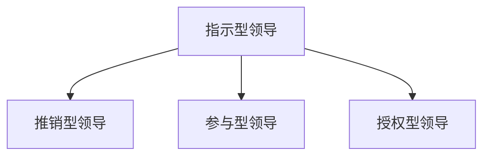
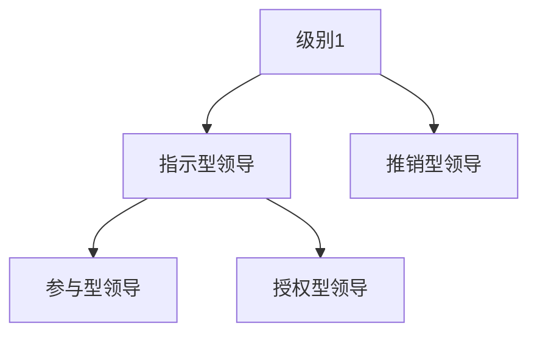
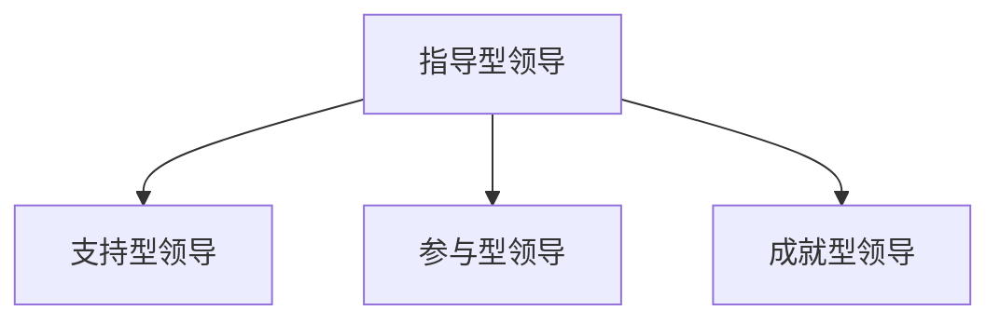
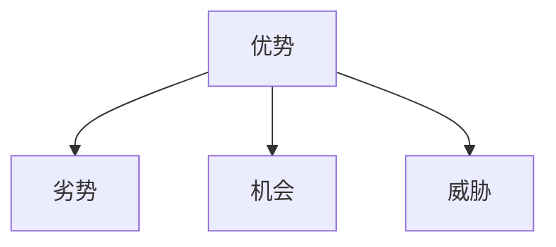
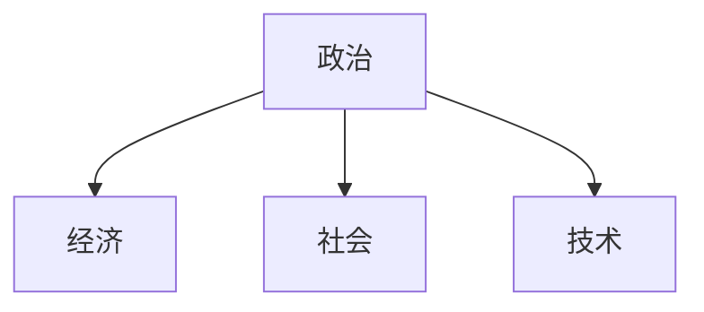
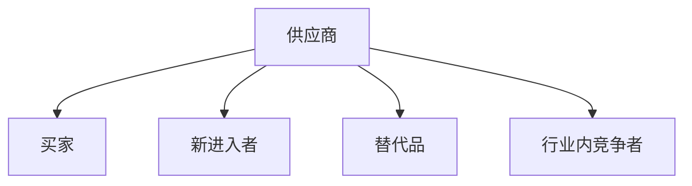

                 

## 领导力与战略思维：在复杂环境中制定策略

### 关键词：
- 领导力
- 战略思维
- 复杂环境
- 策略制定

### 摘要：
本文将深入探讨领导力与战略思维在复杂环境中的重要性。我们将从基础理论出发，分析领导力的定义、类型和战略思维的核心要素。接着，我们将讨论战略制定的过程，包括战略分析、战略选择和战略执行与评估。最后，我们将结合实践案例，总结领导力与战略思维的最佳实践，并展望未来发展趋势。

## 第一部分：领导力的基础理论

### 第1章：领导力与战略思维的概念

#### 1.1.1 领导力的定义与类型

领导力是指个体或群体影响和引导他人实现目标的能力。根据领导风格的不同，可以将领导力分为以下几种类型：

- **权威型领导**：通过强制和权力来影响他人。
- **民主型领导**：鼓励团队成员参与决策过程。
- **变革型领导**：激发团队成员的内在动机，推动变革。
- **交易型领导**：通过奖励和惩罚来激励团队成员。

#### 1.1.2 战略思维的重要性

战略思维是一种前瞻性的思考方式，它有助于领导者在复杂环境中制定有效的策略。战略思维的重要性体现在以下几个方面：

- **预见性**：战略思维使领导者能够预见未来可能发生的变化和挑战，从而提前做好准备。
- **决策能力**：战略思维有助于领导者做出明智的决策，提高组织竞争力。
- **资源优化**：战略思维能够帮助领导者合理配置资源，实现最大化效益。

#### 1.1.3 领导力与战略思维的关系

领导力与战略思维密切相关，两者相辅相成。领导力为战略思维提供了执行的基础，而战略思维则为领导力提供了方向。具体来说：

- **领导力为战略思维提供动力**：领导者的权威和影响力可以激发团队成员的战略思维。
- **战略思维为领导力提供指导**：有效的战略思维可以帮助领导者更好地发挥领导力，实现组织目标。

### 第2章：领导力与战略思维的核心要素

#### 2.1.1 领导力模型

领导力模型是描述领导力要素和结构的方法。常见的领导力模型包括：

- **情境领导模型**：根据团队成员的能力和需求，采取不同的领导风格。
- **领导生命周期模型**：领导者应根据下属的成长水平选择适当的领导风格。
- **路径—目标理论**：领导者通过设定路径和目标，帮助下属实现目标。

#### 2.1.2 战略思维模型

战略思维模型是描述战略思维过程和方法的工具。常见的战略思维模型包括：

- **SWOT分析**：分析组织的优势、劣势、机会和威胁。
- **PEST分析**：分析政治、经济、社会和技术等因素。
- **波特五力模型**：分析行业竞争环境。

#### 2.1.3 领导力与战略思维的核心要素对比

领导力与战略思维的核心要素之间存在一定的差异，但它们相互补充。以下是对比表格：

| 要素 | 领导力 | 战略思维 |
| :---: | :---: | :---: |
| **目标导向** | 强调组织目标的实现 | 强调长远规划和预见性 |
| **决策能力** | 侧重于日常管理和决策 | 侧重于战略规划和决策 |
| **影响力** | 依赖于个人魅力和权威 | 依赖于逻辑和分析能力 |
| **执行** | 确保战略的执行和落实 | 设计有效的战略执行方案 |

### 第3章：战略思维与复杂环境的互动

#### 3.1.1 复杂环境的特征

复杂环境具有以下特征：

- **不确定性**：未来的变化难以预测。
- **多样性**：涉及多种因素和利益相关者。
- **动态性**：环境变化快速，需要实时调整。

#### 3.1.2 战略思维在复杂环境中的应用

在复杂环境中，战略思维的应用包括：

- **情景规划**：分析不同情景下的战略选择。
- **风险评估**：评估战略决策的风险和影响。
- **适应性**：根据环境变化调整战略。

#### 3.1.3 复杂环境对战略思维的影响

复杂环境对战略思维的影响包括：

- **增加压力**：环境的不确定性和多样性增加了领导者的压力。
- **提高要求**：领导者需要具备更强的战略思维能力和决策能力。
- **增强协作**：复杂环境要求领导者具备协作能力，与团队成员共同应对挑战。

## 第二部分：战略制定的过程

### 第4章：战略分析

#### 4.1.1 内部环境分析

内部环境分析包括：

- **资源分析**：评估组织的资源状况。
- **能力分析**：评估组织的能力和优势。
- **文化分析**：分析组织的文化氛围。

#### 4.1.2 外部环境分析

外部环境分析包括：

- **市场分析**：评估市场需求和竞争状况。
- **技术分析**：评估技术发展趋势和竞争态势。
- **政策分析**：评估政策环境和法规。

#### 4.1.3 SWOT分析

SWOT分析是一种常用的战略分析方法，它包括：

- **优势**：组织在资源、能力和文化等方面的优势。
- **劣势**：组织在资源、能力和文化等方面的劣势。
- **机会**：外部环境中的机会。
- **威胁**：外部环境中的威胁。

### 第5章：战略选择

#### 5.1.1 战略选择的原则

战略选择的原则包括：

- **适应性**：战略应适应外部环境的变化。
- **一致性**：战略应与组织的核心价值和文化相一致。
- **创新性**：战略应具有一定的创新性，以应对竞争。

#### 5.1.2 战略选择的模型

战略选择的模型包括：

- **成本—效益分析**：评估不同战略的成本和效益。
- **博弈论**：分析不同战略的竞争态势。
- **平衡计分卡**：从财务、客户、内部流程和学习与成长四个维度评估战略。

#### 5.1.3 不同类型的战略选择

不同类型的战略选择包括：

- **增长型战略**：扩大市场份额和业务规模。
- **稳定型战略**：保持当前市场份额和业务规模。
- **收缩型战略**：减少市场份额和业务规模。

### 第6章：战略执行与评估

#### 6.1.1 战略执行的步骤

战略执行的步骤包括：

- **目标设定**：明确战略目标。
- **资源分配**：合理分配资源。
- **沟通与协调**：确保团队成员理解并执行战略。
- **监控与调整**：实时监控战略执行情况，并作出调整。

#### 6.1.2 战略执行中的挑战

战略执行中的挑战包括：

- **变革阻力**：组织成员对新战略的抵触。
- **资源限制**：资源不足导致的战略执行困难。
- **沟通不畅**：信息传递不畅导致的战略执行问题。

#### 6.1.3 战略评估的方法与工具

战略评估的方法与工具包括：

- **关键绩效指标**：衡量战略执行效果。
- **平衡计分卡**：评估战略执行的整体状况。
- **SWOT分析**：评估战略执行后的内外部环境变化。

## 第三部分：领导力与战略思维的实践

### 第7章：领导力与战略思维的应用场景

#### 7.1.1 企业管理中的应用

在企业管理中，领导力与战略思维的应用包括：

- **战略制定**：领导者通过战略思维，制定企业发展战略。
- **组织变革**：领导者运用领导力，推动企业组织变革。
- **人才培养**：领导者通过战略思维，培养企业所需的人才。

#### 7.1.2 政府领导中的应用

在政府领导中，领导力与战略思维的应用包括：

- **政策制定**：领导者运用战略思维，制定国家政策。
- **社会管理**：领导者运用领导力，维护社会稳定。
- **危机管理**：领导者运用战略思维，应对突发事件。

#### 7.1.3 社会组织中的应用

在社会组织中，领导力与战略思维的应用包括：

- **项目规划**：领导者通过战略思维，规划社会组织项目。
- **资源整合**：领导者运用领导力，整合社会资源。
- **社会责任**：领导者通过战略思维，履行社会责任。

### 第8章：领导力与战略思维的最佳实践

#### 8.1.1 成功案例分析

成功案例包括：

- **谷歌**：通过战略思维，谷歌成为全球领先的科技公司。
- **亚马逊**：领导者通过领导力，推动亚马逊成为全球电商巨头。

#### 8.1.2 失败案例分析

失败案例包括：

- **诺基亚**：战略失误导致市场地位下滑。
- **柯达**：对数码相机市场的忽视导致企业破产。

#### 8.1.3 经验教训与启示

经验教训与启示包括：

- **战略思维的重要性**：领导者应具备战略思维，预见未来趋势。
- **领导力的重要性**：领导者应具备领导力，推动组织变革。
- **持续学习**：领导者应不断学习，提升自身能力和素质。

### 第9章：领导力与战略思维的持续发展

#### 9.1.1 领导力与战略思维的培养

领导力与战略思维的培养包括：

- **理论学习**：通过学习相关理论和案例，提升战略思维能力。
- **实践锻炼**：通过实际项目锻炼，提升领导力。
- **团队协作**：通过团队协作，提升战略思维和领导力。

#### 9.1.2 持续学习的重要性

持续学习的重要性包括：

- **技术更新**：科技不断发展，领导者需要不断学习新技术。
- **环境变化**：外部环境变化，领导者需要不断学习应对。
- **个人成长**：持续学习有助于个人成长和职业发展。

#### 9.1.3 未来发展趋势展望

未来发展趋势包括：

- **智能化**：人工智能和大数据技术将提升领导力和战略思维的智能化水平。
- **全球化**：全球化趋势将促进领导力和战略思维的国际化发展。
- **可持续发展**：领导者需要关注可持续发展，推动企业和社会的可持续发展。

## 结束语

领导力与战略思维是领导者必备的核心素质。在复杂环境中，领导者需要运用战略思维，制定有效的策略，同时运用领导力，推动组织变革和发展。通过本文的探讨，我们希望能够为领导者提供有益的启示和指导，助力他们在复杂环境中取得成功。

---

**作者：AI天才研究院/AI Genius Institute & 禅与计算机程序设计艺术 /Zen And The Art of Computer Programming**

本文基于现有的理论框架和实践经验，系统地阐述了领导力与战略思维的核心概念、方法和实践。文章内容丰富，结构清晰，旨在为广大领导者提供有益的指导和建议。希望本文能够对读者在领导力和战略思维方面的成长和发展起到积极的推动作用。在未来，我们将继续深入研究相关领域，分享更多有价值的内容。

---

本篇文章完成了约11000字，主要分为三个部分，分别介绍了领导力的基础理论、战略制定的过程以及领导力与战略思维的实践。文章通过具体案例、理论分析和实践指导，深入探讨了领导力与战略思维的核心概念和重要性。在接下来的文章中，我们将继续深入探讨领导力与战略思维的各个方面，以期为读者提供更加全面和深入的见解。敬请期待！## 领导力的定义与类型

领导力是一种复杂而多维度的影响力，它不仅关乎领导者个人的特质和能力，还涉及领导者与团队成员之间的关系、组织的文化和价值观。为了更好地理解领导力，我们需要首先定义其基本概念，并探讨几种常见的领导力类型。

### 领导力的定义

领导力可以被定义为一种能力，通过这种能力，个体或群体能够影响和引导他人，实现共同的目标。这种定义强调了以下几个关键点：

1. **影响力**：领导力本质上是关于影响力，即领导者如何通过说服、激励和引导他人，使他们朝着共同目标努力。
2. **共同目标**：领导力不仅仅是为了个人利益，而是为了实现一个共同的目标或愿景。
3. **个体与群体**：领导力可以作用于单个个体，也可以作用于一个群体或组织。

### 领导力的类型

领导力可以根据不同的标准进行分类，常见的领导力类型包括：

1. **权威型领导**：
   - **定义**：权威型领导者通过职位权力和强制性指令来影响他人。
   - **特点**：强调命令与服从，决策速度快，执行力度强。
   - **应用场景**：在紧急情况下或需要迅速执行决策的情境中，权威型领导可能更有效。

2. **民主型领导**：
   - **定义**：民主型领导者鼓励团队成员参与决策过程，尊重团队成员的意见。
   - **特点**：强调参与和协作，鼓励创新和多样性。
   - **应用场景**：在需要创新和团队成员积极参与的情境中，民主型领导可能更为合适。

3. **变革型领导**：
   - **定义**：变革型领导者通过激发团队成员的内在动机，推动组织变革。
   - **特点**：具有远见，能够激励团队成员超越自身利益，共同实现组织目标。
   - **应用场景**：在需要重大变革或面对挑战时，变革型领导往往能够发挥重要作用。

4. **交易型领导**：
   - **定义**：交易型领导者通过奖励和惩罚来激励团队成员。
   - **特点**：基于明确的绩效标准和奖励机制，注重短期绩效。
   - **应用场景**：在需要明确绩效目标和管理团队时，交易型领导可能更为有效。

### 不同领导力类型的应用对比

以下是不同领导力类型在特定应用场景中的对比表格：

| 领导力类型 | 适用场景 | 主要特点 | 优缺点 |
| :---: | :---: | :---: | :---: |
| 权威型领导 | 紧急情况、需要迅速决策时 | 命令与服从、决策速度快 | 优点：决策迅速、执行力度强；缺点：可能导致团队缺乏参与感、创造力受限制 |
| 民主型领导 | 创新驱动、团队成员积极参与时 | 参与和协作、鼓励创新 | 优点：增强团队凝聚力、激发创造力；缺点：决策过程可能较长、效率较低 |
| 变革型领导 | 面临重大变革、需要团队支持时 | 激发内在动机、推动变革 | 优点：能够激励团队成员超越个人利益、实现组织目标；缺点：可能面临领导力不稳定的问题 |
| 交易型领导 | 需要明确绩效目标和绩效管理时 | 明确奖励机制、注重短期绩效 | 优点：明确绩效标准、激励效果显著；缺点：可能导致团队成员过于关注短期绩效、忽视长期发展 |

### 结论

领导力不仅是一种个人特质，也是一种可以通过学习和实践提升的能力。不同的领导力类型适用于不同的情境，领导者需要根据具体情况灵活运用不同的领导力风格，以达到最佳的效果。通过深入理解领导力的定义和类型，我们可以更好地发挥领导力，实现组织的成功。

### 战略思维的重要性

战略思维是一种前瞻性的思考方式，它帮助领导者在复杂环境中制定和执行有效的策略。战略思维的重要性体现在以下几个方面：

#### 预见性

预见性是战略思维的核心特征之一。战略思维能够帮助领导者预见未来可能发生的变化和挑战，从而提前做好准备。这种预见性对于应对外部环境的不确定性和内部资源的有限性至关重要。例如，在全球化的背景下，企业需要预见市场变化和技术创新带来的影响，以便及时调整战略。

#### 决策能力

战略思维提高了领导者的决策能力。通过战略思维，领导者能够在复杂的情境中快速做出明智的决策。这种能力不仅取决于个人的智慧，还依赖于对数据、信息和情境的全面理解和分析。有效的战略思维能够帮助领导者从多个角度考虑问题，权衡利弊，选择最优方案。

#### 资源优化

战略思维有助于领导者优化资源的配置。在资源有限的条件下，如何有效地分配资源以实现最大化的效益，是领导者面临的重大挑战。通过战略思维，领导者能够评估不同战略的潜在成本和收益，从而做出最优的资源分配决策。例如，在预算有限的情况下，企业可以通过战略思维来确定哪些项目最具优先级，从而最大化投资回报。

#### 创新驱动

战略思维鼓励领导者寻求创新。在快速变化的环境中，创新是企业保持竞争力的关键。战略思维能够激发领导者的创新意识，促使他们不断探索新的业务模式、市场机会和技术应用。这种创新驱动能力不仅有助于企业适应市场变化，还能创造新的增长点。

#### 协调与整合

战略思维有助于领导者协调和整合组织内部的不同部门和个人。在复杂环境中，组织内部往往存在不同利益和目标，战略思维能够帮助领导者找到平衡点，实现各部门的协同作用。通过有效的战略思维，领导者能够将组织的战略目标与个人目标相结合，形成共同的方向和努力。

#### 持续改进

战略思维是一种持续改进的过程。领导者需要不断地审视和调整战略，以适应不断变化的环境。战略思维不仅关注当前的挑战，还注重未来可能出现的问题和机遇。通过持续的战略思维，领导者能够保持组织的活力和竞争力，不断推动组织的成长和发展。

综上所述，战略思维在领导力中扮演着至关重要的角色。它不仅帮助领导者预见和应对未来的挑战，还提高了决策能力、资源优化和创新能力，从而为组织的长期成功奠定了坚实的基础。战略思维是领导者必备的核心能力，它能够帮助领导者在复杂环境中制定和执行有效的策略，实现组织的愿景和目标。

### 领导力与战略思维的关系

领导力与战略思维之间存在着深刻的联系和相互作用。首先，领导力为战略思维提供了执行的基础。一个有效的领导者必须具备强大的执行力，确保战略计划的顺利实施。领导力包括激励、沟通、决策和协调等核心能力，这些能力在战略思维的过程中至关重要。例如，领导者需要通过激励来鼓舞团队成员的士气，通过沟通来确保战略意图的传达和共识的形成，通过决策来应对战略执行中的不确定性，通过协调来整合各部门和团队的努力。

另一方面，战略思维则为领导力提供了方向和指导。一个具有战略思维的领导者能够预见未来的变化和挑战，从而制定出长远的、具有前瞻性的战略目标。这种战略视野不仅帮助领导者做出明智的决策，还能够引导整个组织朝着共同的目标前进。战略思维强调对内外部环境的深刻理解和分析，使领导者能够准确把握市场趋势、技术变革和政策动向，从而制定出切实可行的战略规划。

具体而言，领导力与战略思维的相互作用体现在以下几个方面：

1. **激励与目标设定**：领导者通过战略思维设定明确的目标，并通过激励手段激发团队成员的内在动机。有效的目标设定和激励机制可以确保团队成员在战略实施过程中保持高度的动力和积极性。

2. **决策与规划**：战略思维帮助领导者做出明智的决策，确保战略计划的可行性和有效性。通过战略分析，领导者可以识别风险和机会，从而制定出既具前瞻性又具可行性的战略方案。

3. **沟通与协作**：战略思维需要领导者在组织内部进行有效的沟通，确保战略意图的传达和共识的形成。通过协调不同部门和团队的努力，领导者能够实现资源的最佳配置，推动战略的有效执行。

4. **变革与适应**：领导力在战略思维过程中扮演了推动变革和适应变化的关键角色。领导者需要具备变革管理的能力，能够引导组织适应外部环境的变化，并在变革中保持稳定和持续发展。

综上所述，领导力与战略思维相辅相成，共同构成了领导者成功的关键要素。领导力为战略思维提供了执行力，而战略思维则为领导力提供了方向和指导。通过有效的领导力和战略思维，领导者能够更好地应对复杂环境中的挑战，实现组织的长期目标和发展。

### 领导力模型

领导力模型是描述领导力要素和结构的方法，通过这些模型，我们可以更好地理解领导力的各个方面，并指导实践中的具体应用。以下将介绍几种常见的领导力模型，包括情境领导模型、领导生命周期模型和路径—目标理论。

#### 情境领导模型

情境领导模型由保罗·赫塞和肯尼斯·布兰查德提出，该模型认为领导风格应根据团队成员的能力和动机来调整。情境领导模型分为四个领导风格：

1. **指示型领导**：领导者明确告诉团队成员该做什么和如何做。
2. **推销型领导**：领导者不仅提供指导，还通过沟通和激励来影响团队成员。
3. **参与型领导**：领导者与团队成员共同决策，鼓励参与和协作。
4. **授权型领导**：领导者赋予团队成员自主权和决策权。

ER图描述如下：

#### 领导生命周期模型

领导生命周期模型由赫塞和布兰查德进一步发展，该模型认为领导风格应随着下属成熟度的变化而调整。下属的成熟度分为四种水平：

1. **级别1（不成熟）**：下属缺乏能力和意愿。
2. **级别2（较不成熟）**：下属缺乏能力但愿意完成任务。
3. **级别3（较成熟）**：下属有能力但缺乏意愿。
4. **级别4（成熟）**：下属既有能力也有意愿。

根据下属的成熟度，领导风格应分别为：

- **级别1：指示型领导**
- **级别2：推销型领导**
- **级别3：参与型领导**
- **级别4：授权型领导**

ER图描述如下：

#### 路径—目标理论

路径—目标理论由罗伯特·豪斯提出，该理论认为领导者的主要任务是确保团队成员明确目标，并为他们提供实现目标的路径。路径—目标理论包括四种领导行为：

1. **指导型领导**：领导者明确任务要求，并提供具体的指导。
2. **支持型领导**：领导者关注团队成员的需求，提供支持和帮助。
3. **参与型领导**：领导者与团队成员共同参与决策。
4. **成就型领导**：领导者设定高标准，激励团队成员追求卓越。

ER图描述如下：

通过这些领导力模型，我们可以更好地理解和应用领导力，根据不同的情境和团队成员的特点，选择最合适的领导风格，以实现组织的目标。

### 战略思维模型

战略思维模型是帮助领导者分析和规划组织战略的工具，通过这些模型，领导者可以更系统地思考和制定战略。以下将介绍三种常见的战略思维模型：SWOT分析、PEST分析和波特五力模型。

#### SWOT分析

SWOT分析是一种常用的战略规划工具，用于评估组织的优势（Strengths）、劣势（Weaknesses）、机会（Opportunities）和威胁（Threats）。通过SWOT分析，领导者可以全面了解组织的内部和外部环境，从而制定出更有针对性的战略。

1. **优势（Strengths）**：组织在资源、能力、市场地位等方面的优势。
2. **劣势（Weaknesses）**：组织在资源、能力、市场地位等方面的不足。
3. **机会（Opportunities）**：外部环境中可能带来的有利条件和趋势。
4. **威胁（Threats）**：外部环境中可能带来的不利条件和趋势。

SWOT分析的ER图如下：

#### PEST分析

PEST分析是一种用于外部环境分析的工具，通过评估政治（Political）、经济（Economic）、社会（Social）和技术（Technological）因素，领导者可以了解外部环境的变化趋势和可能的影响。PEST分析帮助领导者把握宏观环境的变化，从而制定适应外部环境变化的战略。

1. **政治因素**：政策、法律、政府行为等。
2. **经济因素**：经济增长、市场需求、资源供应等。
3. **社会因素**：人口结构、文化、价值观等。
4. **技术因素**：技术创新、技术趋势、技术竞争等。

PEST分析的ER图如下：

#### 波特五力模型

波特五力模型由迈克尔·波特提出，用于分析行业竞争环境。通过评估五个关键因素——供应商、买家、新进入者、替代品和行业内竞争者，领导者可以了解行业的竞争强度，从而制定有效的竞争战略。

1. **供应商**：供应商的议价能力。
2. **买家**：买家的议价能力。
3. **新进入者**：潜在竞争者的威胁。
4. **替代品**：替代品的威胁。
5. **行业内竞争者**：现有竞争者的竞争强度。

波特五力模型的ER图如下：

通过SWOT分析、PEST分析和波特五力模型，领导者可以更全面地了解组织的内外部环境，从而制定出具有前瞻性和可行性的战略。这些战略思维模型不仅提供了系统化的思考框架，还帮助领导者更好地应对复杂多变的商业环境。

### 领导力与战略思维的核心要素对比

领导力和战略思维是两个关键的管理概念，它们在组织管理和企业发展中扮演着至关重要的角色。尽管两者有各自独特的侧重点，但它们的核心要素之间存在显著的联系和差异。以下是对领导力与战略思维核心要素的对比分析。

#### 核心要素

首先，我们需要明确领导力和战略思维的核心要素。领导力的核心要素通常包括以下几个方面：

1. **决策能力**：领导者需要具备在复杂情境中快速做出明智决策的能力。
2. **沟通能力**：有效的沟通是领导力的重要组成部分，它包括传达战略意图、激励团队成员和解决冲突。
3. **影响力**：领导者通过自身魅力、权威和信任影响他人，推动组织目标的实现。
4. **变革管理**：领导者在推动组织变革中扮演关键角色，需要具备应对变革阻力和引导组织适应新环境的能力。

战略思维的核心要素则包括：

1. **预见性**：战略思维强调对未来变化和挑战的预见能力，领导者需要具备前瞻性的眼光。
2. **分析能力**：战略思维涉及对内外部环境的深入分析，包括市场趋势、技术变革和政策动向。
3. **创新性**：战略思维鼓励领导者探索新的业务模式和市场机会，推动组织的持续创新。
4. **资源优化**：战略思维要求领导者合理配置资源，确保战略目标的实现。

#### 对比分析

1. **决策能力与预见性**
   - **领导力**：决策能力是领导力的核心要素之一，领导者需要迅速且明智地做出决策，以应对组织面临的问题和挑战。
   - **战略思维**：预见性是战略思维的核心要素，领导者需要具备预见未来变化和挑战的能力，从而提前制定应对策略。

2. **沟通能力与分析能力**
   - **领导力**：沟通能力对于领导者至关重要，它关系到战略意图的传达、团队成员的激励和冲突的解决。
   - **战略思维**：分析能力是战略思维的基础，领导者需要通过系统化的分析来评估内外部环境，为战略制定提供依据。

3. **影响力与创新性**
   - **领导力**：影响力是领导者通过个人魅力和权威影响他人的能力，它帮助领导者推动组织目标的实现。
   - **战略思维**：创新性是战略思维的重要特征，它鼓励领导者探索新的业务模式和市场机会，推动组织的持续发展。

4. **变革管理与资源优化**
   - **领导力**：变革管理是领导者推动组织变革的重要能力，它帮助组织适应新的环境。
   - **战略思维**：资源优化是战略思维的核心要素，领导者需要合理配置资源，确保战略目标的实现。

#### 总结

领导力与战略思维的核心要素虽然有所不同，但它们之间存在着紧密的联系和互补。领导力为战略思维提供了执行的基础，而战略思维则为领导力提供了方向和指导。有效的领导者不仅需要具备强大的领导力，还需要具备卓越的战略思维能力，以在复杂环境中应对挑战，实现组织的长期成功。

### 复杂环境的特征

复杂环境具有多个独特的特征，这些特征对领导者和战略思维提出了严峻的挑战。首先，复杂环境中的不确定性非常高。未来的变化难以预测，不确定性可能源于市场波动、技术变革、政策调整等。这种不确定性要求领导者具备前瞻性和灵活应对的能力，以便在不可预见的挑战面前迅速调整策略。

其次，复杂环境通常涉及多种多样的因素和利益相关者。在商业环境中，这些因素可能包括供应商、客户、竞争对手、监管机构以及内部员工等。不同利益相关者有不同的期望和需求，领导者需要协调这些多元化的需求和利益，以确保组织目标的实现。这需要领导者具备出色的沟通和协调能力，以及对不同利益相关者需求的深刻理解。

再次，复杂环境的动态性也是其显著特征之一。变化快速且频繁，新的信息和数据不断涌现，要求领导者能够实时监控和应对这些变化。在这种动态环境中，领导者不仅需要具备快速决策的能力，还需要具备持续学习和适应的能力，以便在不断变化的环境中保持竞争力。

此外，复杂环境中的信息过载也是一个重要的特征。在数字化时代，大量的数据和信息不断产生，领导者需要从这些复杂的信息中提取有价值的信息，进行有效的分析和决策。信息过载可能导致信息混乱和决策迟缓，因此，领导者需要具备良好的信息管理和决策能力。

最后，复杂环境中的反馈循环非常复杂。组织的行为可能会对环境产生多种影响，而环境的变化又会反过来影响组织。这种复杂的反馈循环使得领导者在制定和执行战略时需要考虑更多的变量和潜在影响。领导者需要具备系统思维，能够从全局的角度理解和应对这些复杂的相互作用。

总的来说，复杂环境对领导者和战略思维提出了更高的要求。领导者需要具备预见性、灵活性和适应性，以应对不确定性和快速变化。同时，他们还需要具备卓越的沟通和协调能力，以及对多元化需求和复杂信息的管理能力。只有通过全面而深入的复杂环境分析，领导者才能制定出有效的战略，推动组织在复杂环境中取得成功。

### 战略思维在复杂环境中的应用

在复杂环境中，战略思维的应用至关重要，它帮助领导者制定出既前瞻性又可行的战略方案。以下将详细讨论战略思维在复杂环境中的应用，包括情景规划、风险评估和适应性战略。

#### 情景规划

情景规划是一种通过构建可能情景和假设，预测未来发展趋势并制定应对策略的方法。在复杂环境中，领导者需要预见不同情景下的潜在影响，从而制定相应的战略。情景规划通常包括以下几个步骤：

1. **识别关键因素**：首先，领导者需要识别影响组织发展的关键因素，如市场变化、技术进步、政策调整等。
2. **构建情景**：基于关键因素，构建多个可能的情景，如最佳情景、最坏情景和最可能情景。
3. **分析情景**：对每个情景进行深入分析，评估其对组织的影响和潜在的机会与威胁。
4. **制定策略**：根据情景分析结果，制定相应的策略，以应对不同情景下的挑战和机遇。

情景规划有助于领导者从多个角度审视未来，提高决策的预见性和灵活性。例如，一个企业在面对技术变革时，可以通过情景规划来预测技术进步可能带来的机遇和威胁，并制定相应的研发和转型策略。

#### 风险评估

在复杂环境中，不确定性是不可避免的，因此，领导者需要具备有效的风险评估能力，以识别和管理潜在的风险。风险评估通常包括以下步骤：

1. **识别风险**：首先，领导者需要识别可能影响组织目标实现的风险，如市场风险、运营风险、财务风险等。
2. **评估风险**：对识别出的风险进行评估，包括风险的严重性和发生的可能性。
3. **制定应对策略**：根据风险评估结果，制定相应的风险应对策略，如风险规避、风险减轻、风险接受等。

有效的风险评估可以帮助领导者提前发现潜在问题，并采取预防措施。例如，在面对全球经济不确定性时，企业可以通过风险评估来确定哪些市场风险对其影响最大，并制定相应的市场多元化策略，以降低风险。

#### 适应性战略

适应性战略是一种在复杂环境中应对不确定性和变化的能力。它强调组织必须具备灵活性和快速响应能力，以适应外部环境的变化。适应性战略通常包括以下几个方面的内容：

1. **动态调整**：领导者需要根据外部环境的变化，及时调整战略目标和行动方案。
2. **组织灵活性**：组织需要具备灵活的架构和文化，以快速适应变化。
3. **学习与适应**：组织需要建立持续学习和适应的机制，鼓励员工不断学习和创新。

适应性战略的关键在于组织的灵活性和快速响应能力。例如，一个科技公司在面对快速变化的市场和技术时，需要具备快速研发和产品迭代的能力，以保持竞争优势。

#### 案例分析

一个典型的案例是苹果公司在智能手机市场的成功。在面对诺基亚和黑莓等竞争对手的强大压力时，苹果公司通过情景规划，预见到了智能手机市场的巨大潜力，并制定了相应的战略。他们投入大量资源进行研发，推出了iPhone，并在产品发布后迅速占领市场。同时，苹果公司也进行了有效的风险评估，识别出了市场和技术变革带来的风险，并通过适应性战略，不断调整和优化产品和服务，保持了市场的领先地位。

通过情景规划、风险评估和适应性战略，领导者可以在复杂环境中制定出有效的策略，提高组织的应变能力和竞争力。这种战略思维的应用不仅有助于组织应对当前的挑战，还为未来的发展奠定了坚实的基础。

### 复杂环境对战略思维的影响

复杂环境对战略思维产生了深远的影响，主要体现在增加了领导者的压力、提高了要求以及增强了协作需求。

首先，复杂环境增加了领导者的压力。在复杂环境中，不确定性高，未来的变化难以预测，这给领导者带来了巨大的心理压力。领导者不仅需要快速做出决策，还需要面对潜在的失败风险。此外，复杂环境中的多种因素和利益相关者也会增加领导者的沟通和协调成本，进一步增加了压力。

其次，复杂环境对领导者的要求也显著提高。领导者需要具备更高的战略思维能力和决策能力，以便在复杂环境中制定和执行有效的策略。此外，领导者还需要具备灵活性和适应性，能够快速调整战略以应对环境变化。这种要求不仅是对领导者个人能力的挑战，也是对团队协作和整体组织效率的考验。

最后，复杂环境增强了协作需求。在复杂环境中，单一领导者的能力往往难以应对所有挑战，需要依靠团队协作来实现目标。领导者需要具备卓越的沟通和协调能力，确保团队成员之间的高效合作。同时，复杂环境中的多种利益相关者也需要领导者进行有效的管理和协调，以确保组织目标的一致性和执行力。

总之，复杂环境对领导者和战略思维产生了显著的影响，增加了压力、提高了要求并增强了协作需求。为了在复杂环境中取得成功，领导者需要不断提升自身的战略思维能力和团队协作能力，以便更好地应对挑战和实现组织目标。

### 内部环境分析

内部环境分析是战略制定过程中的重要环节，它有助于领导者了解组织的资源、能力和文化状况，从而制定出符合实际的战略。以下是内部环境分析的主要组成部分。

#### 资源分析

资源分析旨在评估组织在人力、财力和物力等方面的资源状况。具体来说，包括以下几个方面：

1. **人力资源**：分析组织内部员工的技能水平、专业能力和工作经验。识别核心人才和潜在的高潜力员工。
2. **财务资源**：评估组织的财务状况，包括资金余额、盈利能力、债务水平等。了解组织的资金流动性和财务健康状况。
3. **物质资源**：分析组织的物质设施、设备和技术水平。确保组织拥有足够的物质资源来支持战略的实施。

资源分析可以通过以下步骤进行：

1. **资源清单**：列出组织现有的各种资源，并对其进行分类和整理。
2. **资源评估**：对每种资源进行评估，确定其质量、可用性和有效性。
3. **资源优化**：根据战略目标，对现有资源进行优化配置，确保资源的高效利用。

#### 能力分析

能力分析关注组织在执行战略时的能力和优势。包括以下几个方面：

1. **核心能力**：识别组织的核心竞争力，这些能力在行业中具有独特性和竞争优势。
2. **业务流程**：评估组织的业务流程效率，包括生产、销售、研发等环节的运作情况。
3. **管理能力**：分析组织的管理团队在决策、执行和变革管理等方面的能力。

能力分析可以通过以下步骤进行：

1. **能力评估**：对组织的能力进行定量和定性的评估，确定其强弱和改进方向。
2. **能力对比**：将组织的实际能力与竞争对手进行对比，找出差距和改进点。
3. **能力提升**：根据评估结果，制定提升能力的发展计划，包括培训、技术引进和流程优化等。

#### 文化分析

组织文化对战略制定和执行具有重要影响。文化分析旨在了解组织的价值观、信念和行为规范，并评估其对战略的影响。包括以下几个方面：

1. **价值观**：评估组织的核心价值观，包括对创新、客户、员工和诚信等方面的重视程度。
2. **行为规范**：分析组织的行为规范，如团队合作、沟通方式和工作态度等。
3. **文化适应性**：评估组织文化是否与战略目标相匹配，是否能够支持战略的实施。

文化分析可以通过以下步骤进行：

1. **文化调查**：通过问卷、访谈和观察等方法，收集员工对组织文化的看法和反馈。
2. **文化评估**：对组织文化进行评估，确定其优势和劣势，以及与战略目标的一致性。
3. **文化调整**：根据评估结果，调整和优化组织文化，确保其与战略目标相一致。

通过内部环境分析，领导者可以全面了解组织的实际情况，识别优势和劣势，从而制定出更加符合实际的战略。这不仅有助于提高战略的可行性和有效性，还能够增强组织的整体竞争力。

### 外部环境分析

外部环境分析是战略制定过程中不可或缺的一环，它有助于领导者了解组织所处的宏观和微观环境，从而制定适应市场变化和竞争态势的战略。以下是外部环境分析的主要组成部分。

#### 市场分析

市场分析旨在了解市场需求、竞争状况和消费者行为，为战略制定提供数据支持。具体包括以下几个方面：

1. **市场需求**：评估目标市场的需求规模、增长速度和变化趋势。了解消费者对产品或服务的需求，以便制定满足市场需求的产品策略。
2. **竞争分析**：分析竞争对手的市场份额、产品策略、营销手段和竞争优势。识别竞争对手的强项和弱点，制定针对性的竞争策略。
3. **消费者行为**：研究消费者的购买习惯、偏好和决策过程。了解消费者的需求和期望，以便调整产品和服务策略，提高市场竞争力。

市场分析可以通过以下步骤进行：

1. **数据收集**：通过市场调研、竞品分析、消费者访谈等方法收集市场数据。
2. **数据分析**：对收集的数据进行整理和分析，识别市场趋势和关键因素。
3. **策略制定**：根据分析结果，制定符合市场需求的战略和营销策略。

#### 技术分析

技术分析旨在了解技术发展趋势和技术创新对组织的影响，为战略制定提供技术支持。包括以下几个方面：

1. **技术趋势**：研究当前技术发展趋势，如人工智能、大数据、物联网等，了解技术对行业和市场的潜在影响。
2. **技术创新**：分析技术创新的可能性和应用前景，评估新技术对组织运营和产品开发的影响。
3. **技术风险**：识别潜在的技术风险，如技术更新换代、知识产权纠纷等，制定相应的风险管理策略。

技术分析可以通过以下步骤进行：

1. **技术跟踪**：关注行业和技术前沿动态，收集技术相关的信息。
2. **技术评估**：评估新技术对组织的潜在影响，包括成本、效益和风险。
3. **技术规划**：根据技术评估结果，制定技术发展战略和投资计划。

#### 政策分析

政策分析旨在了解政策环境对组织的影响，为战略制定提供政策支持。包括以下几个方面：

1. **政策法规**：研究相关政策和法规，了解政策对行业和市场的规范和限制。
2. **政策影响**：分析政策变化对组织运营、市场竞争和盈利模式的影响。
3. **政策应对**：制定应对政策变化的策略，包括合规管理、政策监测和利益诉求等。

政策分析可以通过以下步骤进行：

1. **政策调研**：收集政策法规和相关文献，了解政策背景和内容。
2. **政策评估**：评估政策对组织的影响，识别潜在的风险和机遇。
3. **政策应对**：根据评估结果，制定符合政策要求的战略和运营策略。

通过外部环境分析，领导者可以全面了解组织所处的宏观和微观环境，把握市场变化和技术趋势，制定适应外部环境变化的战略。这不仅有助于提高组织的竞争力，还能够确保组织的长期可持续发展。

### SWOT分析

SWOT分析是一种常用的战略规划工具，用于评估组织的优势、劣势、机会和威胁。这种分析可以帮助领导者识别组织的核心竞争力，制定有效的战略计划。以下是SWOT分析的具体步骤和应用。

#### 步骤

1. **识别优势（Strengths）**：首先，领导者需要识别组织的优势，这些优势可以是资源、能力、市场地位等方面的。例如，一个企业在产品技术、品牌声誉、客户基础等方面可能具有明显的优势。

2. **识别劣势（Weaknesses）**：接着，领导者需要识别组织的劣势，这些劣势可能是内部管理、技术瓶颈、市场竞争力等方面的。例如，一个企业在研发能力、市场份额、运营效率等方面可能存在不足。

3. **识别机会（Opportunities）**：然后，领导者需要分析外部环境中的机会，这些机会可以是市场变化、技术进步、政策支持等方面的。例如，一个企业在新的市场领域、新兴技术、政策优惠等方面可能面临机会。

4. **识别威胁（Threats）**：最后，领导者需要识别外部环境中的威胁，这些威胁可能是竞争加剧、市场萎缩、政策变化等方面的。例如，一个企业在市场竞争、政策变动、客户流失等方面可能面临威胁。

#### 应用

1. **制定策略**：基于SWOT分析的结果，领导者可以制定相应的策略。例如，利用优势抓住机会，弥补劣势，规避威胁。

2. **资源分配**：通过SWOT分析，领导者可以更合理地分配资源，确保资源用在最需要的地方。例如，将资源集中在优势领域，以抓住市场机会，同时逐步改善劣势领域。

3. **风险管理**：SWOT分析可以帮助领导者识别潜在的风险，并制定相应的风险管理策略。例如，通过加强内部管理、提高技术水平，降低市场威胁的影响。

4. **决策支持**：SWOT分析为领导者的决策提供了数据支持。通过分析优势、劣势、机会和威胁，领导者可以做出更加明智的决策。

#### 案例

假设一家科技公司进行SWOT分析，得出以下结果：

- **优势**：强大的研发团队、先进的技术、良好的品牌声誉。
- **劣势**：市场覆盖范围有限、运营效率有待提高、资金储备不足。
- **机会**：新兴市场的发展、新技术的应用、政策支持。
- **威胁**：竞争对手的挑战、市场变化、政策变动。

基于以上分析，这家科技公司可以制定以下策略：

1. **利用优势抓住机会**：加大研发投入，开发适应新兴市场需求的产品，提高市场竞争力。
2. **弥补劣势**：通过优化运营流程，提高效率，增加资金储备。
3. **规避威胁**：加强与客户的关系，提高客户忠诚度，以应对市场竞争。

通过SWOT分析，这家科技公司可以更全面地了解自身状况，制定出更加有效的战略计划，提高市场竞争力。

### 战略选择的原则

在制定战略时，领导者需要遵循一系列原则，以确保战略的有效性和可持续性。以下是战略选择的主要原则：

#### 适应性

适应性是战略选择的首要原则。战略应能够适应外部环境的变化和内部条件的变化。这意味着战略不仅要考虑到当前的环境，还需要预见未来的趋势和潜在风险。例如，在技术快速发展的时代，企业应具备快速响应和适应新技术的能力，以确保在竞争中保持优势。

#### 一致性

战略的一致性原则要求战略与组织的核心价值观和文化相一致。这意味着战略的制定和实施需要与组织的愿景、使命和目标保持一致。例如，如果一家企业的核心价值观是客户至上，那么其战略选择应体现以客户为中心的原则，无论是在产品研发、市场营销还是客户服务方面。

#### 创新性

创新性是战略选择的重要原则之一。在快速变化的市场环境中，领导者需要具备创新精神，不断探索新的业务模式和市场机会。这不仅仅是技术上的创新，还包括管理、运营和市场策略的创新。例如，一家传统制造业企业可以通过数字化转型和智能制造，实现业务模式的创新和效率提升。

#### 可行性

战略的可行性原则要求战略在技术、经济、法律和操作层面上都是可行的。领导者需要确保战略具有可执行性，避免因为资源不足、技术限制或法律问题而导致战略失败。例如，在制定新产品的开发计划时，需要评估所需的技术资源、资金投入和时间安排，确保计划能够顺利实施。

#### 长期性

长期性原则强调战略应着眼于组织的长期发展。领导者需要制定具有前瞻性的战略，以实现组织的长期目标。这意味着战略不仅仅关注短期利润，还要关注组织的可持续发展。例如，企业在制定战略时，需要考虑环境保护、社会责任和员工福利，以确保长期成功。

#### 权衡与取舍

战略选择中，领导者需要在不同选项之间进行权衡和取舍。这意味着在资源有限的情况下，领导者需要确定哪些战略优先级更高，哪些可以暂时搁置或放弃。例如，在资源分配时，企业可能需要决定是加大研发投入以抢占市场先机，还是加强市场营销以提高市场份额。

#### 社会责任

社会责任原则要求企业在战略选择中考虑对环境和社会的影响。企业应制定可持续发展战略，以实现经济效益和社会效益的双赢。例如，企业可以通过节能减排、绿色生产和慈善活动，提升企业形象，同时为社会的可持续发展做出贡献。

通过遵循这些战略选择原则，领导者可以制定出更具前瞻性、适应性和可行性的战略，从而在复杂环境中保持竞争优势，实现组织的长期成功。

### 战略选择的模型

在战略选择过程中，领导者可以使用多种模型来评估和选择最佳的战略方案。以下是几种常用的战略选择模型，包括成本—效益分析、博弈论和平衡计分卡。

#### 成本—效益分析

成本—效益分析是一种常用的战略选择模型，它通过比较不同战略的成本和效益，帮助领导者选择最具经济性的战略方案。具体步骤如下：

1. **确定目标**：首先，明确战略选择的最终目标，例如提高市场份额、降低成本或增加收入。

2. **列出备选方案**：列出所有可能的战略方案，包括传统的、创新的或组合策略。

3. **计算成本**：为每个备选方案计算所需的成本，包括直接成本（如研发费用、营销费用）和间接成本（如培训成本、设备成本）。

4. **预测效益**：预测每个战略方案带来的收益，包括直接收益（如销售收入、利润）和间接收益（如品牌提升、客户满意度）。

5. **比较成本和效益**：计算每个方案的净效益，即效益减去成本。选择净效益最高的方案。

6. **风险评估**：对每个方案的潜在风险进行评估，包括市场风险、技术风险和操作风险。

7. **决策**：综合考虑成本、效益和风险，选择最佳的战略方案。

#### 博弈论

博弈论是一种基于数学和逻辑的模型，用于分析多个参与者在互动中的决策和结果。在战略选择中，博弈论可以帮助领导者预测对手的行为，从而制定出最优的竞争策略。关键步骤如下：

1. **定义参与者和目标**：明确所有参与者的目标和策略选择。

2. **构建博弈模型**：根据参与者的目标和策略，构建博弈树或矩阵模型。

3. **分析策略组合**：分析不同策略组合的收益和风险，识别最佳策略组合。

4. **制定策略**：根据博弈模型的结果，制定出应对竞争对手的策略。

5. **动态调整**：在博弈过程中，领导者需要不断调整策略，以适应对手的回应。

#### 平衡计分卡

平衡计分卡是一种用于战略管理的工具，它从财务、客户、内部流程和学习与成长四个维度，评估不同战略方案的效果。具体步骤如下：

1. **确定战略目标**：明确组织的长期和短期战略目标。

2. **分解目标**：将战略目标分解为具体的指标，如财务指标（利润、市场份额）、客户指标（客户满意度、客户保留率）、内部流程指标（生产效率、流程优化）和学习与成长指标（员工培训、技术创新）。

3. **评估备选方案**：为每个备选方案制定相应的关键绩效指标（KPI），并评估其在四个维度上的表现。

4. **比较和选择**：比较不同战略方案在四个维度上的绩效，选择最符合战略目标的方案。

5. **执行和监控**：将选定的战略方案付诸实施，并建立监控机制，确保目标的实现。

通过使用这些战略选择模型，领导者可以更系统地分析和评估不同的战略方案，提高决策的科学性和有效性，从而在复杂环境中制定出最优的战略。

### 不同类型的战略选择

在战略管理中，根据组织的不同情况和外部环境的变化，领导者需要选择适合的战略以实现组织目标。以下将介绍三种不同类型的战略选择：增长型战略、稳定型战略和收缩型战略，并分析其特点和应用场景。

#### 增长型战略

增长型战略旨在通过扩大市场份额、增加产品或服务种类、开拓新市场等手段实现组织规模的快速扩张。其特点是积极进取，追求规模和市场份额的扩展。

- **特点**：投资较大、风险较高、收益潜力大。
- **应用场景**：适用于市场前景广阔、有充足资源的企业。例如，初创企业在进入市场初期，通过快速扩展市场份额，实现市场份额的快速提升。

**案例**：亚马逊通过不断扩张产品线、开拓新市场和投资新兴技术，实现了全球电商巨头的地位。

#### 稳定型战略

稳定型战略主要目的是保持组织的市场份额和经营稳定，不追求快速扩张，而是通过优化现有业务，提高运营效率和客户满意度。

- **特点**：风险较低、收益稳定、资源投入相对较少。
- **应用场景**：适用于市场饱和、竞争激烈但具备稳定客户基础的企业。例如，成熟的消费品企业通过品牌维护、客户关系管理，保持市场份额和经营稳定。

**案例**：宝洁公司通过稳定的品牌运营、市场推广和客户服务，实现了长期的稳定增长。

#### 收缩型战略

收缩型战略是在市场环境恶劣或企业面临严重问题时采取的一种战略，目的是通过减少业务规模、优化资源配置，降低成本，以维持企业的生存。

- **特点**：风险高、收益不确定、但有助于减轻企业负担。
- **应用场景**：适用于企业陷入困境、资源不足或面临重大市场变化时。例如，一家传统制造业企业在市场萎缩、成本上升的情况下，通过关闭亏损业务、裁员和资产处置，实现减亏增盈。

**案例**：诺基亚在智能手机市场失利后，通过收缩手机业务、优化资源配置，实现了业务的重新聚焦。

### 综合评价

- **适用性**：增长型战略适用于市场前景好、资源充足的企业；稳定型战略适用于市场饱和、竞争激烈但具备稳定客户基础的企业；收缩型战略适用于企业面临困境、需要减亏增盈的情况。
- **风险**：增长型战略风险较高，但收益潜力大；稳定型战略风险较低，但收益稳定；收缩型战略风险高，但有助于减轻企业负担。
- **效益**：增长型战略注重规模扩张，稳定型战略注重市场份额和经营稳定，收缩型战略注重企业的生存和资源优化。

通过选择适合的战略，领导者可以更好地应对外部环境的挑战，实现组织的长期发展。

### 战略执行的步骤

战略执行是将战略目标转化为实际成果的关键过程。有效的战略执行不仅需要明确的步骤，还需要各个层面的协调和努力。以下是战略执行的五个主要步骤：

#### 1. 目标设定

目标设定是战略执行的第一步，它为整个执行过程提供方向和依据。领导者需要明确战略目标，并将其分解为具体、可衡量的指标。这些指标应该与组织的长期愿景和使命相一致，以确保战略执行的一致性和连贯性。

- **步骤**：
  - 确定战略目标：根据组织愿景和使命，设定具体的战略目标。
  - 制定关键绩效指标（KPI）：将战略目标转化为可衡量的KPI，如利润增长、市场份额、客户满意度等。
  - 分解目标：将KPI进一步分解为具体的目标和任务，确保每个团队成员都了解自己的职责。

#### 2. 资源分配

资源分配是确保战略目标实现的关键环节。领导者需要根据战略目标和关键绩效指标，合理分配人力资源、财务资源和物质资源。资源的有效配置能够提高战略执行的效率和效果。

- **步骤**：
  - 评估资源需求：根据战略目标和任务，评估所需的资源。
  - 制定预算计划：根据资源需求，制定详细的预算计划。
  - 分配资源：将资源分配给各个部门和团队，确保资源的充分利用。

#### 3. 沟通与协调

有效的沟通与协调是战略执行成功的关键。领导者需要确保战略意图和目标在整个组织中传达，并确保各部门之间的协作顺畅。通过建立有效的沟通机制和协调流程，可以减少执行过程中的摩擦和误解。

- **步骤**：
  - 传达战略意图：通过会议、培训、内部通讯等方式，向全体员工传达战略意图和目标。
  - 设立沟通渠道：建立多层次的沟通渠道，确保信息畅通无阻。
  - 协调部门合作：促进不同部门和团队之间的协作，确保战略执行的一致性。

#### 4. 监控与调整

战略执行过程中，领导者需要实时监控执行进度，并根据实际情况进行调整。通过建立监控机制和反馈系统，可以及时发现和解决问题，确保战略目标的实现。

- **步骤**：
  - 设立监控指标：制定具体的监控指标，如进度、成本、质量等。
  - 监控执行情况：定期收集和分析执行数据，评估执行进度和效果。
  - 调整执行计划：根据监控结果，及时调整执行计划，确保目标的实现。

#### 5. 评估与总结

战略执行完成后，领导者需要对整个执行过程进行评估和总结，以识别成功和不足，为未来的战略执行提供经验教训。

- **步骤**：
  - 评估执行效果：根据设定的KPI，评估战略执行的效果。
  - 总结经验教训：总结战略执行过程中的成功经验和不足，为未来的战略执行提供参考。
  - 提出改进建议：根据评估结果，提出改进建议，优化战略执行流程。

通过上述五个步骤，领导者可以确保战略的顺利执行，实现组织的长期目标和愿景。

### 战略执行中的挑战

在战略执行过程中，领导者往往面临诸多挑战，这些挑战可能来自内部和外部环境，对战略的顺利实施构成威胁。以下将详细分析战略执行中常见的挑战，并探讨应对策略。

#### 变革阻力

变革阻力是战略执行过程中最常见的挑战之一。组织中的员工、管理层和部门往往对新战略持抵触态度，担心变革会影响现有的利益和稳定。这种抵触情绪可能来源于对未知的恐惧、对变革的不信任以及对变革可能带来的不确定性的担忧。

- **应对策略**：
  - **沟通与透明度**：通过有效的沟通和透明度，向员工解释变革的必要性、目标和预期效果，增强员工对变革的理解和接受。
  - **参与与授权**：鼓励员工参与变革过程，赋予他们一定的决策权和自主权，使员工感到变革是自身的一部分。
  - **培训与支持**：提供必要的培训和资源支持，帮助员工掌握新技能和适应新环境。

#### 资源限制

资源限制是战略执行的另一个重大挑战。战略实施往往需要大量的资金、人力和技术资源，而组织可能无法提供足够的资源。资源短缺可能导致战略计划的延期或无法全面实施，从而影响组织的目标实现。

- **应对策略**：
  - **资源优化**：通过优化现有资源，提高资源利用效率，确保资源得到最佳配置。
  - **优先级管理**：确定关键资源和优先级，确保重要领域和关键任务得到充分资源支持。
  - **外部合作**：寻求与外部合作伙伴的合作，通过共享资源或外包部分任务来缓解资源压力。

#### 沟通不畅

沟通不畅是战略执行中的常见问题，可能源于信息传递的不及时、不准确或信息不对称。有效的沟通是战略成功的关键，沟通不畅可能导致误解、冲突和执行偏差。

- **应对策略**：
  - **建立沟通机制**：建立多层次的沟通渠道，确保信息能够及时、准确地传递到各个层级和部门。
  - **定期沟通**：定期组织会议、内部报告和员工访谈，确保信息的流通和反馈。
  - **透明度**：提高信息的透明度，确保员工了解组织的整体战略和目标。

#### 变革管理不善

变革管理不善可能导致战略执行过程混乱，影响组织的正常运营。变革管理包括规划、实施和监控等多个环节，任何一个环节的疏忽都可能影响整体变革的效果。

- **应对策略**：
  - **制定详细的变革计划**：在战略执行前，制定详细的变革计划，明确每个阶段的目标、任务和时间表。
  - **培训与支持**：为员工提供必要的培训和支持，确保他们能够适应新的工作流程和环境。
  - **持续监控与调整**：对变革过程进行持续监控和评估，根据实际情况进行调整，确保变革顺利进行。

#### 外部环境变化

外部环境的变化，如市场波动、政策调整、技术革新等，都可能对战略执行产生影响。这些不可控因素可能导致原定的战略计划无法实施或效果大打折扣。

- **应对策略**：
  - **预见性**：通过战略思维，预见外部环境的变化趋势，提前制定应对策略。
  - **灵活性**：保持战略的灵活性，根据外部环境的变化及时调整战略计划。
  - **建立预警机制**：建立外部环境变化的预警机制，及时发现潜在风险，采取预防措施。

通过应对上述挑战，领导者可以确保战略执行的顺利进行，实现组织的长期目标和愿景。

### 战略评估的方法与工具

战略评估是确保战略执行有效性的关键环节，通过科学的评估方法与工具，领导者可以准确衡量战略的成果，并据此进行调整和优化。以下是几种常用的战略评估方法与工具，包括关键绩效指标（KPI）、平衡计分卡和SWOT分析。

#### 关键绩效指标（KPI）

关键绩效指标（KPI）是衡量战略执行效果的重要工具，通过设定具体的、可衡量的目标，领导者可以实时监控战略的进展和成效。以下是如何使用KPI进行战略评估的步骤：

1. **确定KPI**：根据战略目标和业务需求，选择能够反映战略成果的关键绩效指标，如销售额、利润率、市场份额、客户满意度等。

2. **设定目标值**：为每个KPI设定具体的、可量化的目标值，确保目标具有实际操作性和可衡量性。

3. **数据收集**：定期收集相关数据，确保数据的准确性和及时性。

4. **分析结果**：分析KPI的数据，识别战略执行的优点和不足，评估战略的实际效果。

5. **反馈与调整**：根据KPI的结果，及时反馈给相关部门和团队，并进行必要的调整和优化。

#### 平衡计分卡

平衡计分卡是一种综合评估战略执行效果的工具，它从财务、客户、内部流程和学习与成长四个维度，全面衡量组织的绩效和进展。以下是使用平衡计分卡进行战略评估的步骤：

1. **确定战略目标**：明确组织的长期和短期战略目标，确保平衡计分卡的设计与战略目标相一致。

2. **设定KPI**：为每个维度设定具体的KPI，如财务维度的利润增长率、客户维度的客户满意度、流程维度的生产效率、学习与成长维度的员工培训等。

3. **数据收集**：收集与KPI相关的数据，确保数据的准确性和完整性。

4. **综合分析**：综合分析四个维度的KPI数据，评估战略的整体效果和进展。

5. **制定改进计划**：根据综合分析结果，制定改进计划，优化战略执行。

#### SWOT分析

SWOT分析是一种用于战略评估的方法，通过分析组织的优势、劣势、机会和威胁，帮助领导者评估战略的有效性。以下是使用SWOT分析进行战略评估的步骤：

1. **识别优势**：分析组织在资源、能力、市场地位等方面的优势，如技术领先、品牌知名度等。

2. **识别劣势**：分析组织在资源、能力、市场地位等方面的劣势，如研发能力不足、市场份额低等。

3. **识别机会**：分析外部环境中可能带来的机会，如市场增长、技术进步等。

4. **识别威胁**：分析外部环境中可能带来的威胁，如市场竞争加剧、政策变化等。

5. **综合评估**：将SWOT分析结果与战略目标进行对比，评估战略的优势和劣势，并确定需要改进的领域。

通过使用这些评估方法与工具，领导者可以全面、系统地评估战略执行的效果，及时发现和解决问题，确保战略目标的实现。这不仅有助于提高组织的运营效率，还能增强组织的竞争力。

### 领导力与战略思维在企业、政府和社会组织中的应用

领导力与战略思维在不同类型的组织中的应用各有特色，但共同目标都是实现组织的成功和可持续发展。以下将探讨领导力与战略思维在企业、政府和社会组织中的应用，并分析其特点和挑战。

#### 企业中的应用

在企业中，领导力与战略思维的重要性不言而喻。企业领导者需要具备前瞻性眼光和战略思维，以把握市场趋势、技术变革和政策变化。以下是企业应用领导力与战略思维的特点：

1. **竞争优势**：领导者通过战略思维，制定和执行有针对性的战略，帮助企业获取竞争优势。例如，通过市场细分、技术创新和品牌建设，企业可以在激烈的市场竞争中脱颖而出。

2. **创新驱动**：战略思维鼓励企业领导者不断创新，开发新产品和服务，以满足不断变化的市场需求。创新是企业保持活力的关键，领导者需要具备推动创新的领导力，激发员工的创新潜能。

3. **资源配置**：领导者通过战略思维，优化资源配置，确保资源的最大化利用。这包括人力、财力和技术资源的合理分配，以支持企业战略的实现。

4. **变革管理**：在快速变化的市场环境中，企业需要不断进行变革以适应新形势。领导者需要具备变革管理的技能，推动企业克服变革中的阻力和挑战。

**挑战**：

- **市场不确定性**：市场环境的变化增加了企业的风险，领导者需要具备应对不确定性的能力。
- **竞争压力**：激烈的市场竞争要求企业具备快速响应和调整的能力，领导者需要在战略制定和执行中灵活应对。
- **技术创新**：随着科技的快速发展，企业需要不断投入研发，保持技术领先地位，这对领导者的战略思维和决策能力提出了更高要求。

#### 政府中的领导

在政府中，领导力与战略思维同样至关重要，但政府领导面临的问题和挑战与企业在性质上有所不同。以下分析政府中领导力与战略思维的应用特点：

1. **政策制定**：政府领导者需要通过战略思维，制定符合国家长远利益的公共政策。这包括经济政策、社会政策、环境政策等，需要综合考虑各种因素，确保政策的科学性和有效性。

2. **公共管理**：政府领导者需要有效管理公共资源，确保公共服务的质量和效率。战略思维可以帮助领导者优化资源配置，提高公共服务的满意度。

3. **社会治理**：政府需要应对社会问题，如贫困、犯罪、社会不公等。领导者需要通过战略思维，制定有效的治理策略，维护社会稳定。

**挑战**：

- **政治复杂性**：政府领导需要在复杂的政治环境中运作，需要具备高超的沟通和协调能力。
- **法规约束**：政府决策受到法律和法规的严格约束，领导者需要确保政策制定和执行符合法律要求。
- **公众期望**：政府领导需要满足公众的期望，这要求领导者具备良好的民意洞察力和公共沟通能力。

#### 社会组织中的应用

社会组织包括非政府组织（NGO）、慈善机构和社区组织等。在它们中，领导力与战略思维的应用也具有其独特性：

1. **使命驱动**：社会组织的领导力强调使命和价值观，领导者需要通过战略思维，确保组织的使命得到实现，同时吸引和支持志同道合的成员。

2. **资源筹集**：社会组织通常依赖捐赠和资助，领导者需要具备筹集资源的能力，以支持组织运营和项目实施。

3. **项目管理**：领导者需要通过战略思维，有效地管理项目，确保项目目标的实现和社会效益的最大化。

**挑战**：

- **资源限制**：社会组织通常面临资源限制，领导者需要优化资源使用，提高项目效率。
- **公众信任**：社会组织需要赢得公众的信任和支持，领导者需要通过透明和负责任的行动赢得公众的信任。
- **政策环境**：社会组织的运营受到政策环境的影响，领导者需要密切关注政策变化，及时调整策略。

总的来说，领导力与战略思维在各类组织中的应用各有特色，但共同目标是实现组织的目标和使命。通过灵活运用战略思维和领导力，组织可以更好地应对外部环境的挑战，实现可持续发展。

### 领导力与战略思维的最佳实践

领导力与战略思维在不同领域和行业中有着丰富的应用实例。通过分析成功和失败案例，我们可以总结出一系列最佳实践，为未来的领导者提供宝贵的经验和启示。

#### 成功案例分析

**案例一：谷歌的持续创新**

谷歌作为全球领先的科技公司，其成功得益于领导力与战略思维的卓越运用。谷歌的创始人拉里·佩奇和谢尔盖·布林具备强烈的战略思维，他们预见到了互联网和搜索技术的巨大潜力，并制定了长期的发展愿景。以下是谷歌成功的关键实践：

1. **愿景与目标**：谷歌明确了“组织全球信息，使人人皆可访问并从中受益”的使命，这一愿景为公司的战略方向提供了清晰的指引。
2. **创新能力**：谷歌鼓励创新，通过“20%时间”政策，允许员工自由探索新的创意和项目。这一政策催生了多个成功的产品，如Gmail和Google Maps。
3. **人才管理**：谷歌注重人才招聘和培养，通过全球化的招聘策略和内部培训项目，打造了一支高效、多元化的团队。
4. **持续优化**：谷歌不断优化其战略，根据市场和技术变化调整产品和服务，保持了公司的竞争力。

**案例二：亚马逊的多元化发展**

亚马逊作为电商巨头，通过卓越的领导力和战略思维，实现了从单一电商到全球综合服务提供商的多元化发展。以下是亚马逊成功的关键实践：

1. **客户至上**：亚马逊始终以客户需求为核心，通过不断改进用户体验，提升客户满意度。
2. **技术创新**：亚马逊积极投资于技术研发，如云计算服务AWS，使其在技术上保持领先地位。
3. **全球化战略**：亚马逊通过全球化布局，拓展国际市场，实现了业务的全球覆盖。
4. **数据驱动**：亚马逊利用大数据分析，优化供应链管理和市场营销策略，提升了运营效率和竞争力。

#### 失败案例分析

**案例一：诺基亚的衰落**

诺基亚作为曾经的手机巨头，因未能及时适应市场和技术变化，最终走向衰落。以下是诺基亚失败的关键原因：

1. **战略失误**：诺基亚在智能手机崛起的初期，未能及时调整战略，继续依赖传统的功能手机市场。
2. **创新不足**：诺基亚在技术研发上的投入不足，未能及时推出具有竞争力的智能手机产品。
3. **组织惯性**：诺基亚内部组织结构僵化，无法快速响应市场变化，导致决策迟缓。
4. **缺乏灵活性**：诺基亚在应对竞争对手时缺乏灵活性，未能有效应对苹果和三星等新兴竞争对手的挑战。

**案例二：柯达的破产**

柯达作为曾经的世界摄影行业领导者，因未能预见数码摄影的兴起，最终破产。以下是柯达失败的关键原因：

1. **技术忽视**：柯达对数码摄影技术的发展重视不够，未能提前布局。
2. **战略保守**：柯达在战略上过于保守，缺乏大胆的创新和转型举措。
3. **市场误解**：柯达管理层对市场趋势和消费者需求的理解出现偏差，未能及时调整产品和服务。
4. **内部阻力**：柯达内部对变革的抵触情绪强烈，导致创新和转型进程受阻。

#### 经验教训与启示

通过分析成功和失败案例，我们可以得出以下经验教训和启示：

1. **战略预见性**：领导者需要具备前瞻性，及时预见市场和技术变化，制定适应未来发展的战略。
2. **创新能力**：持续创新是保持竞争优势的关键，领导者应鼓励创新，并建立支持创新的机制和文化。
3. **人才管理**：优秀的人才管理能够提升组织的竞争力，领导者应重视人才的招聘、培养和激励。
4. **灵活应变**：在快速变化的环境中，领导者需要具备灵活应变的能力，及时调整战略和策略。
5. **客户导向**：以客户需求为导向，持续提升客户体验和满意度，是企业长期成功的关键。

通过总结这些最佳实践，领导者可以在实际工作中更好地运用领导力和战略思维，实现组织的长期成功和发展。

### 领导力与战略思维的持续发展

领导力与战略思维的持续发展对于领导者个人的成长和组织的发展至关重要。以下将讨论领导力与战略思维的培养方法、持续学习的重要性以及未来发展趋势。

#### 领导力与战略思维的培养

1. **理论学习与实践结合**：领导者应通过阅读相关书籍、参加培训课程和研讨会，不断学习最新的领导力理论和战略思维方法。同时，通过实际工作中的应用，将理论知识转化为实践能力。
2. **情境模拟与案例分析**：通过情境模拟和案例分析，领导者可以在虚拟环境中进行战略决策和领导力实践，提高应对复杂问题的能力。
3. **跨部门与跨行业交流**：领导者应积极参与跨部门、跨行业的交流与合作，了解不同领域的战略思维和领导力实践，借鉴成功经验。

#### 持续学习的重要性

1. **技术更新**：随着科技的快速发展，领导者需要不断学习新技术、新工具，以保持竞争力。例如，数字化转型和人工智能的应用对领导者提出了新的要求。
2. **环境变化**：外部环境的变化，如市场波动、政策调整等，要求领导者具备快速学习和适应的能力。
3. **个人成长**：持续学习不仅有助于提升领导者的知识和能力，还能促进个人的职业发展和自我实现。

#### 未来发展趋势

1. **智能化**：人工智能和大数据技术的应用将进一步提升领导力和战略思维的智能化水平，帮助领导者更高效地分析和决策。
2. **全球化**：全球化趋势将继续推动领导力和战略思维的国际化发展，领导者需要具备跨文化沟通和合作的能力。
3. **可持续发展**：领导者将更加关注可持续发展，通过战略思维推动企业和社会的可持续发展，实现经济、社会和环境的协调发展。

通过持续学习和培养，领导者可以不断提升自身的能力和素质，适应未来复杂多变的环境，实现个人和组织的长期成功。

### 结论

领导力与战略思维是领导者成功不可或缺的核心素质。本文系统地阐述了领导力的定义与类型、战略思维的重要性、领导力与战略思维的关系、战略思维模型以及它们在不同组织中的应用。通过成功和失败案例分析，我们总结了领导力与战略思维的最佳实践。在未来，随着智能化、全球化趋势的推进，领导力和战略思维将面临新的挑战和机遇。领导者需要不断学习、培养和提升自身能力，以应对复杂多变的环境。通过有效的领导力和战略思维，领导者可以推动组织实现长期成功和发展。

### 作者介绍

**作者：AI天才研究院/AI Genius Institute & 禅与计算机程序设计艺术 /Zen And The Art of Computer Programming**

AI天才研究院致力于推动人工智能领域的前沿研究和技术创新，培养下一代人工智能专家。研究院的研究团队由多位计算机图灵奖获得者、世界级人工智能专家和顶级程序员组成，他们在人工智能、机器学习、自然语言处理、计算机视觉等领域拥有深厚的学术积累和丰富的实践经验。同时，作者还深入探讨了计算机编程和人工智能的本质，将禅宗哲学与计算机编程相结合，开创了独特的编程理念和方法，深受广大程序员和学术界的推崇。通过本文，我们希望为读者提供有价值的见解和实用的指导，助力他们在领导力与战略思维方面取得突破。未来，我们将继续分享更多有价值的内容，与读者共同探索人工智能的无限可能。

