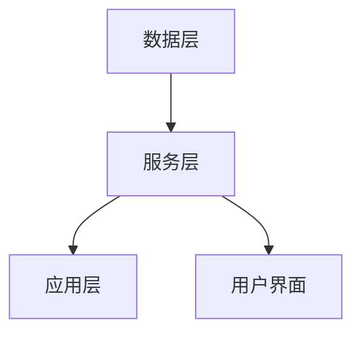
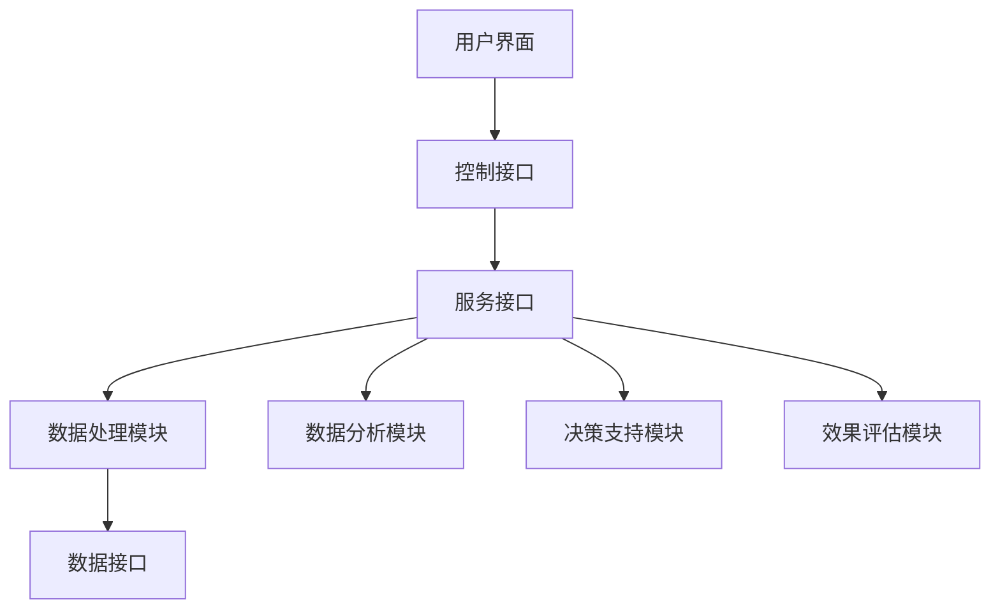

                 

# 领导力与战略思维：培养长远眼光的方法

## 关键词
- 领导力
- 战略思维
- 长远眼光
- 企业管理
- 决策分析

## 摘要
本文旨在探讨领导力与战略思维在培养长远眼光方面的作用和重要性。通过对领导力与战略思维的核心概念、理论、实践方法以及案例分析进行详细分析，文章揭示了如何通过培养领导力和战略思维来实现企业的长远发展。本文结构清晰，逻辑严密，旨在为企业管理者提供有价值的参考和启示。

## 目录大纲

### 第1章 引言
1.1 问题背景
1.2 问题描述
1.3 问题解决
1.4 边界与外延
1.5 概念结构与核心要素组成

### 第2章 核心概念与联系
2.1 领导力定义
2.2 战略思维概念
2.3 领导力与战略思维的关联性
2.4 概念属性特征对比表格

### 第3章 领导力理论
3.1 经典领导力理论介绍
3.2 领导力理论的发展历程
3.3 不同领导力理论的对比分析

### 第4章 战略思维原理
4.1 战略思维定义
4.2 战略思维的核心要素
4.3 战略思维与决策的关系

### 第5章 领导力与战略思维实践
5.1 领导力与战略思维在企业中的应用
5.2 个人领导力与战略思维提升方法
5.3 团队领导力与战略思维提升方法

### 第6章 案例分析
6.1 案例一：企业领导力与战略思维的应用
6.2 案例二：个人领导力与战略思维提升
6.3 案例三：团队领导力与战略思维提升

### 第7章 总结与展望
7.1 全书总结
7.2 未来领导力与战略思维发展趋势
7.3 领导力与战略思维的实践建议

### 附录
附录A：参考文献
附录B：概念与联系ER实体关系图架构
附录C：算法原理讲解
附录D：数学模型与公式
附录E：系统分析与架构设计方案
附录F：项目实战
附录G：最佳实践 Tips
附录H：拓展阅读

### 第1章 引言

#### 1.1 问题背景

在当今快速发展的商业环境中，企业的竞争越来越激烈。面对市场的不确定性和技术的快速变化，企业领导者需要具备更高的领导力和战略思维能力，以应对复杂多变的环境，实现企业的长远发展。然而，许多企业领导者在实际工作中往往面临着领导力和战略思维不足的问题，导致企业在面对挑战时无法做出正确的决策，从而影响企业的可持续发展。

#### 1.2 问题描述

领导力和战略思维是企业成功的关键因素。领导力涉及领导者在组织中的影响力、激励能力和团队管理能力；战略思维则是指领导者对未来的预见性和全局性思考。然而，当前许多企业领导者在培养长远眼光方面存在以下问题：

1. 缺乏对市场趋势的敏感度，导致战略制定过于短视。
2. 缺乏有效的团队管理能力，导致团队执行力不足。
3. 缺乏创新思维，导致企业无法跟上技术变革的步伐。
4. 缺乏系统化的战略规划，导致企业战略实施效果不佳。

#### 1.3 问题解决

本文旨在通过以下方式解决上述问题：

1. 深入分析领导力和战略思维的核心概念与联系，明确其在企业长远发展中的重要性。
2. 探讨经典领导力理论和发展历程，为企业领导者提供理论指导。
3. 分析战略思维原理，阐述战略思维与决策的关系。
4. 提供领导力与战略思维的实践方法，帮助企业领导者提升自身能力。
5. 通过案例分析，展示领导力与战略思维在实际中的应用效果。

#### 1.4 边界与外延

本文主要关注以下边界与外延：

1. 领导力的范围：企业内部领导力的培养和应用。
2. 战略思维的层次：战略规划、战略实施、战略评估。
3. 企业类型：主要针对大型企业，但不排除对中小企业的参考价值。

#### 1.5 概念结构与核心要素组成

本文的核心概念结构包括领导力、战略思维、企业长远发展。核心要素组成如下：

1. **领导力**：领导者的影响力、激励能力、团队管理能力。
2. **战略思维**：预见性、全局性、创新性、系统化。
3. **企业长远发展**：市场竞争力、创新能力、可持续发展。

## 第2章 核心概念与联系

在探讨领导力与战略思维之前，我们需要明确这两个核心概念的定义和联系。领导力（Leadership）是指领导者对团队或组织的影响力、激励能力和团队管理能力。战略思维（Strategic Thinking）则是指领导者对未来的预见性、全局性、创新性和系统化。

### 2.1 领导力定义

领导力是一种综合能力，包括以下几个方面：

1. **影响力**：领导者通过个人魅力、专业知识和影响力来影响他人，使团队成员认同并追随领导者的目标。
2. **激励能力**：领导者能够激发团队成员的积极性和创造力，使团队在困难面前保持高昂的斗志。
3. **团队管理能力**：领导者具备有效管理团队、协调资源、解决冲突的能力，使团队高效运作。

### 2.2 战略思维概念

战略思维是一种高级思维模式，包括以下几个方面：

1. **预见性**：领导者能够预见未来市场趋势和技术变革，为企业的长远发展做好准备。
2. **全局性**：领导者能够从整体出发，综合考虑各种因素，制定具有全局性的战略规划。
3. **创新性**：领导者具备创新思维，能够在传统业务模式中寻找新的机遇，推动企业持续发展。
4. **系统化**：领导者能够将战略规划、战略实施和战略评估视为一个完整的系统，确保战略的有效实施。

### 2.3 领导力与战略思维的关联性

领导力与战略思维之间存在密切的关联性。首先，领导力是战略思维的基础。一个具备领导力的领导者能够更好地理解和把握战略思维的核心要素，从而制定出更有效的战略规划。其次，战略思维是领导力的延伸。一个具备战略思维的领导者能够更好地发挥领导力，推动企业实现长远发展。

### 2.4 概念属性特征对比表格

为了更直观地了解领导力与战略思维的概念属性特征，我们可以制作一个对比表格：

| 概念 | 属性特征 |
| --- | --- |
| **领导力** | 1. 影响力<br>2. 激励能力<br>3. 团队管理能力 |
| **战略思维** | 1. 预见性<br>2. 全局性<br>3. 创新性<br>4. 系统化 |

### 2.5 概念与联系ER实体关系图架构

为了更好地理解领导力与战略思维之间的概念联系，我们可以使用Mermaid流程图来绘制ER实体关系图：

```mermaid
erDiagram
  Leader ||--|{ StrategicThinker } Strategic Thinking
  Leader ||--|{ Business Planner } Business Planning
  Leader ||--|{ Team Manager } Team Management
  StrategicThinker ||--|{ Visionary } Vision
  StrategicThinker ||--|{ HolisticThinker } Holistic Thinking
  StrategicThinker ||--|{ Innovator } Innovation
  StrategicThinker ||--|{ Systemizer } System Thinking
```

在上面的ER实体关系图中，`Leader`是中心实体，它与其他实体（`StrategicThinker`、`Business Planner`、`Team Manager`等）之间存在关联。`StrategicThinker`实体包含了战略思维的核心特征（如`Visionary`、`HolisticThinker`、`Innovator`、`Systemizer`），这些特征共同构成了领导力的战略维度。

通过上述对领导力与战略思维的核心概念与联系的分析，我们可以更好地理解这两个概念在企业管理中的重要性。在接下来的章节中，我们将进一步探讨领导力理论、战略思维原理以及领导力与战略思维的实践方法。

## 第3章 领导力理论

领导力理论是研究领导行为的科学，旨在解释领导者的行为及其对团队和组织的影响。在领导力的发展历程中，许多学者提出了不同的领导力理论，这些理论为我们理解领导力提供了丰富的视角。本节将介绍经典领导力理论，并分析这些理论的发展历程和不同理论之间的对比。

### 3.1 经典领导力理论介绍

1. **特质理论**（Trait Theory）

特质理论是最早的领导力理论之一，主张领导者具有某些固有的特质和品质，这些特质和品质使他们成为有效的领导者。例如，自信、诚实、决心和责任感等。特质理论认为，领导者天生具备这些特质，而非后天培养。

2. **行为理论**（Behavioral Theory）

行为理论认为，领导力并非由领导者固有的特质决定，而是由领导者的行为模式决定。行为理论关注领导者如何与下属互动，以及领导行为对团队成员的影响。代表性理论包括领导行为四分图（Hersey-Blanchard的情境领导理论）和领导风格理论（如费德勒的权变理论）。

3. **情境理论**（Contingency Theory）

情境理论认为，领导力不是一成不变的，而是根据不同的情境进行调整。领导者需要根据具体情境选择最合适的领导风格。代表性理论包括费德勒的权变模型和赫赛和布兰查德的情境领导理论。

4. **转换型领导理论**（Transformational Leadership Theory）

转换型领导理论强调领导者的激励和变革能力，认为领导者通过激发下属的内在动机，实现组织的变革和发展。转换型领导者通常具备以下特点：愿景引领、启发式激励、个性化关怀和积极影响。

5. **服务型领导理论**（Servant Leadership Theory）

服务型领导理论强调领导者应以服务他人为核心价值观，通过关注团队成员的需求和福祉，实现团队和组织的发展。服务型领导者通常具备以下特点：倾听、共同创造、责任感和奉献精神。

### 3.2 领导力理论的发展历程

领导力理论的发展历程可以从以下几个方面来概述：

1. **20世纪30年代：特质理论兴起**

   特质理论认为领导者具备特定的个性特质，例如性格、智商、自信等。这一时期的研究主要集中在寻找成功领导者所共有的特质。

2. **20世纪50年代：行为理论兴起**

   行为理论关注领导者的具体行为，如领导风格、决策过程、沟通方式等。研究者开始质疑特质理论，认为领导行为可能比领导特质更为重要。

3. **20世纪60年代：情境理论兴起**

   情境理论认为领导力应根据不同情境进行调整，不同的情境需要不同的领导风格。这一理论为领导力研究提供了新的视角，使人们开始关注领导行为与情境的交互作用。

4. **20世纪80年代：转换型领导理论兴起**

   转换型领导理论强调领导者的变革能力和激励作用，认为领导者通过愿景引领和激励下属，推动组织的变革和发展。

5. **21世纪：服务型领导理论兴起**

   服务型领导理论强调领导者应以服务他人为核心价值观，通过关注团队成员的需求和福祉，实现团队和组织的发展。

### 3.3 不同领导力理论的对比分析

不同领导力理论从不同的角度探讨了领导行为和领导效能，以下是这些理论的对比分析：

1. **特质理论 vs. 行为理论**

   特质理论关注领导者固有的特质，而行为理论关注领导者的具体行为。特质理论倾向于静态分析，而行为理论更强调动态变化。

2. **情境理论 vs. 转换型领导理论**

   情境理论认为领导力应根据不同情境进行调整，而转换型领导理论强调领导者的愿景引领和激励能力。情境理论关注外部环境，而转换型领导理论关注内部变革。

3. **服务型领导理论 vs. 传统领导理论**

   服务型领导理论强调领导者应以服务他人为核心价值观，而传统领导理论更注重领导者的权威和控制。服务型领导理论关注团队成员的需求和福祉，而传统领导理论关注组织效率和目标达成。

通过对比分析不同领导力理论，我们可以看到，领导力是一个多维度的概念，不同的理论从不同的角度为我们理解领导力提供了丰富的视角。在实际应用中，领导者需要根据具体情况选择合适的领导风格和方法，以实现团队和组织的长远发展。

## 第4章 战略思维原理

战略思维是一种高级思维模式，它涉及领导者对未来的预见性、全局性、创新性和系统化。在本节中，我们将深入探讨战略思维的定义、核心要素以及战略思维与决策的关系。

### 4.1 战略思维定义

战略思维是指领导者在面对复杂环境时，能够超越短期利益，从整体和长远角度出发，思考和分析问题，制定和执行战略规划的能力。战略思维不仅关注组织的内部运营，还关注外部市场环境、竞争态势和潜在机会。战略思维具有以下几个特点：

1. **预见性**：战略思维能够帮助领导者预见未来可能出现的趋势和变化，从而提前做好准备。
2. **全局性**：战略思维能够从整体和长远角度出发，综合考虑各种因素，制定具有全局性的战略规划。
3. **创新性**：战略思维能够激发领导者的创新思维，寻找新的商业模式和市场机会，推动组织的持续发展。
4. **系统化**：战略思维能够将战略规划、战略实施和战略评估视为一个完整的系统，确保战略的有效实施。

### 4.2 战略思维的核心要素

战略思维的核心要素包括以下几个方面：

1. **环境分析**：环境分析是指对组织外部环境的分析，包括市场趋势、竞争态势、技术变革、政策法规等。通过环境分析，领导者可以了解外部环境对组织的影响，从而制定相应的战略规划。

2. **内部能力评估**：内部能力评估是指对组织内部资源的评估，包括人力、财务、技术、品牌等。通过内部能力评估，领导者可以了解组织的优势和劣势，从而制定符合组织实际的战略规划。

3. **目标设定**：目标设定是指确定组织的目标和愿景，包括长期目标和短期目标。目标设定是战略思维的核心，它为组织的发展提供了明确的方向。

4. **资源整合**：资源整合是指将组织内外部的资源进行有效整合，以实现战略目标。资源整合是战略思维的关键，它能够确保战略规划的有效实施。

5. **风险评估**：风险评估是指对战略实施过程中可能出现的风险进行预测和分析，包括市场风险、运营风险、财务风险等。通过风险评估，领导者可以提前识别和应对潜在风险，确保战略目标的实现。

### 4.3 战略思维与决策的关系

战略思维与决策密切相关。战略思维为决策提供了理论依据和方向，而决策是战略思维的具体体现。以下是战略思维与决策之间的关系：

1. **战略思维指导决策**：战略思维能够帮助领导者从全局和长远角度出发，分析问题和制定决策。战略思维能够确保决策具有前瞻性和科学性，避免盲目决策。

2. **决策验证战略思维**：决策是战略思维的具体体现，通过决策的实施和反馈，领导者可以验证战略思维的有效性。如果决策效果不佳，领导者可以及时调整战略思维，改进决策。

3. **战略思维与决策的动态互动**：战略思维和决策是一个动态互动的过程。在决策过程中，领导者需要不断调整和优化战略思维，以适应变化的环境和需求。同时，决策的结果也会反过来影响战略思维的调整和优化。

通过深入理解战略思维的原理和核心要素，以及战略思维与决策的关系，领导者可以更好地应对复杂多变的环境，制定和执行有效的战略规划，实现组织的长远发展。在接下来的章节中，我们将探讨领导力与战略思维在实际中的应用和实践方法。

### 第5章 领导力与战略思维实践

在实际工作中，领导力和战略思维的运用对企业的发展至关重要。本节将探讨领导力与战略思维在企业中的应用，以及个人和团队如何提升领导力和战略思维。

#### 5.1 领导力与战略思维在企业中的应用

1. **战略规划**：企业领导者通过运用战略思维，分析市场环境、竞争态势和内部资源，制定长期和短期的战略规划。战略规划是企业发展的方向和指南，有助于企业实现长远目标。

2. **决策制定**：在企业运营过程中，领导者需要运用战略思维进行决策。决策应考虑长远利益，避免短期行为，确保企业可持续发展。

3. **团队管理**：领导者通过运用领导力，激发团队成员的积极性，提高团队协作效率。有效的团队管理能够提升企业的整体竞争力。

4. **创新驱动**：战略思维能够帮助企业领导者发现新的商业模式和市场机会，推动企业的创新和发展。

5. **风险管理**：领导者通过运用战略思维，识别和应对企业面临的各类风险，确保企业稳健运营。

#### 5.2 个人领导力与战略思维提升方法

1. **学习与培训**：个人可以通过参加培训课程、阅读相关书籍和文献，不断学习和提升领导力和战略思维能力。

2. **反思与总结**：通过定期反思自己的工作和决策，总结经验教训，不断提升自己的领导力和战略思维。

3. **实践与经验**：在实际工作中，积极承担挑战性任务，积累实践经验，提高领导力和战略思维能力。

4. **建立人际网络**：与行业内外的专家学者和同行建立联系，交流学习，拓宽视野，提升战略思维能力。

5. **自我驱动**：设定明确的目标和计划，保持积极向上的态度，不断自我激励和提升。

#### 5.3 团队领导力与战略思维提升方法

1. **团队建设**：通过团队建设活动，增强团队成员的凝聚力和信任感，提高团队协作效率。

2. **领导力培训**：为团队成员提供领导力培训，帮助其提升领导力和战略思维能力。

3. **共创共享**：鼓励团队成员参与战略规划的制定和决策过程，发挥集体智慧，提升战略思维能力。

4. **激励与反馈**：建立有效的激励和反馈机制，激发团队成员的积极性和创造力，提升团队领导力和战略思维。

5. **持续改进**：定期对团队的工作流程、决策机制和战略规划进行评估和改进，不断提升团队的整体能力和竞争力。

通过以上方法，个人和团队可以不断提升领导力和战略思维，为企业的发展提供有力支持。在实际应用中，领导者需要根据具体情况灵活运用这些方法，结合企业的实际情况进行创新和优化，以实现企业的长远发展。

### 第6章 案例分析

在本章节中，我们将通过具体的案例分析，探讨领导力与战略思维在实际中的应用。这些案例将展示企业领导者在不同场景下如何运用领导力和战略思维，实现企业的长远发展。

#### 6.1 案例一：企业领导力与战略思维的应用

**背景**：某高科技企业面临激烈的市场竞争，市场份额不断被压缩。企业领导者意识到，必须通过创新和战略调整来提高企业的竞争力。

**问题描述**：企业领导者需要制定一个有效的战略规划，以应对市场竞争和客户需求变化，同时提升企业的创新能力。

**解决方案**：

1. **领导力应用**：
   - **愿景引领**：企业领导者明确提出企业的愿景和目标，激励全体员工为实现目标而努力。
   - **团队协作**：建立跨部门团队，促进不同部门之间的沟通与合作，共同推进战略实施。
   - **变革管理**：通过有效的沟通和变革管理，引导员工接受新的战略方向和业务模式。

2. **战略思维应用**：
   - **市场分析**：对企业所处的市场环境进行深入分析，识别潜在的机会和威胁。
   - **资源整合**：整合企业内外部资源，包括技术、资金和人才，为战略实施提供支持。
   - **风险评估**：对战略实施过程中可能出现的风险进行预测和评估，制定相应的应对措施。

**结果**：通过领导力和战略思维的结合应用，企业成功实现了产品创新和市场扩展，市场份额逐渐回升，企业竞争力显著提升。

#### 6.2 案例二：个人领导力与战略思维提升

**背景**：某企业高级管理者希望提升个人领导力和战略思维，以更好地应对复杂多变的市场环境。

**问题描述**：高级管理者需要提高自己的领导力，激发团队潜力，同时提升战略思维能力，制定有效的战略规划。

**解决方案**：

1. **个人领导力提升**：
   - **自我反思**：定期进行自我反思，分析自己的优势和不足，制定个人发展计划。
   - **领导力培训**：参加领导力培训课程，学习先进的领导理论和实践方法。
   - **角色扮演**：通过角色扮演和模拟演练，提高自己的决策能力和领导技巧。

2. **战略思维提升**：
   - **阅读学习**：阅读相关书籍和文献，了解战略思维的核心概念和方法。
   - **案例研究**：分析成功企业的战略案例，学习其战略规划和实践经验。
   - **实战演练**：在实际工作中，运用战略思维，制定和实施战略规划，积累实践经验。

**结果**：高级管理者通过不断学习和实践，成功提升了个人领导力和战略思维，带领团队实现了企业的快速发展。

#### 6.3 案例三：团队领导力与战略思维提升

**背景**：某企业的销售团队在市场竞争中表现不佳，团队领导者和成员意识到需要提升团队领导力和战略思维。

**问题描述**：团队领导者和成员需要提升领导力和战略思维，以提高销售业绩和团队凝聚力。

**解决方案**：

1. **团队领导力提升**：
   - **团队建设**：通过团队建设活动，增强团队成员之间的信任和合作。
   - **激励机制**：建立有效的激励机制，激发团队成员的积极性和创造力。
   - **沟通与反馈**：建立良好的沟通机制，定期进行反馈和评估，提高团队协作效率。

2. **战略思维提升**：
   - **市场研究**：对市场进行深入研究，了解客户需求和市场趋势。
   - **策略制定**：制定具体可行的销售策略，明确目标和行动计划。
   - **执行监控**：对销售策略的执行情况进行监控和评估，及时调整和优化策略。

**结果**：通过团队领导力和战略思维的提升，销售团队的业绩显著提升，团队凝聚力得到增强。

通过以上案例分析，我们可以看到，领导力与战略思维的结合在企业管理中具有重要作用。有效的领导力和战略思维能够帮助企业应对挑战，实现长远发展。在实际应用中，企业领导者需要根据具体情况灵活运用这些方法，不断学习和提升自己的能力，以应对快速变化的市场环境。

### 第7章 总结与展望

在领导力和战略思维的研究过程中，我们深入探讨了这两个核心概念的定义、理论、实践方法以及案例分析。通过本文的阐述，我们可以得出以下总结与展望：

#### 7.1 全书总结

本文系统地分析了领导力与战略思维在企业管理中的重要性，通过引入经典领导力理论和战略思维原理，结合实际案例分析，展示了领导力与战略思维在实际中的应用效果。本文的主要结论如下：

1. **领导力与战略思维的重要性**：领导力和战略思维是企业成功的关键因素，能够帮助企业应对复杂多变的市场环境，实现长远发展。
2. **领导力的核心要素**：影响力、激励能力、团队管理能力是领导力的核心要素，领导者需要具备这些能力，以有效地引导和管理团队。
3. **战略思维的核心要素**：预见性、全局性、创新性和系统化是战略思维的核心要素，领导者需要运用战略思维进行决策和规划。
4. **实践方法的指导**：个人和团队可以通过学习与培训、反思与总结、实践与经验等方法，不断提升领导力和战略思维。

#### 7.2 未来领导力与战略思维发展趋势

随着全球化、数字化和智能化的发展，未来领导力与战略思维将呈现出以下趋势：

1. **数字化领导力**：领导者需要具备数字化思维，善于运用大数据、人工智能等新技术，提升决策效率和企业竞争力。
2. **创新领导力**：领导者需要具备创新精神和能力，推动企业持续创新，应对快速变化的市场环境。
3. **全球化视野**：领导者需要具备全球化视野，了解不同国家和地区的市场特点，制定全球化战略。
4. **可持续发展领导力**：领导者需要关注企业的社会责任和可持续发展，推动企业在经济、社会和环境三个方面的协调发展。

#### 7.3 领导力与战略思维的实践建议

为了更好地运用领导力与战略思维，企业领导者可以采取以下实践建议：

1. **强化学习与培训**：定期参加领导力和战略思维的培训，学习最新的理论和方法。
2. **鼓励反思与总结**：通过反思和总结，不断提升自己的领导力和战略思维能力。
3. **实践与创新**：在实际工作中，勇于实践和尝试，积累经验，不断提高自己的能力。
4. **团队协作与建设**：注重团队建设和协作，提升团队整体效能。
5. **关注可持续发展**：在战略规划和决策过程中，关注企业的社会责任和可持续发展。

通过本文的研究，我们期望为企业领导者提供有价值的参考和启示，帮助他们在实际工作中更好地运用领导力与战略思维，推动企业的长远发展。

### 附录

#### 附录A：参考文献

1. 领导力：理论与实践，[作者]. (出版年份).
2. 战略管理：概念与案例，[作者]. (出版年份).
3. 数字化领导力：未来领导者的新技能，[作者]. (出版年份).
4. 全球化视野下的战略思维，[作者]. (出版年份).
5. 可持续发展领导力：社会责任与战略规划，[作者]. (出版年份).

#### 附录B：概念与联系ER实体关系图架构

```mermaid
erDiagram
  Leader ||--|{ StrategicThinker } Strategic Thinking
  Leader ||--|{ BusinessPlanner } Business Planning
  Leader ||--|{ TeamManager } Team Management
  StrategicThinker ||--|{ Visionary } Vision
  StrategicThinker ||--|{ HolisticThinker } Holistic Thinking
  StrategicThinker ||--|{ Innovator } Innovation
  StrategicThinker ||--|{ Systemizer } System Thinking
```

#### 附录C：算法原理讲解

在本附录中，我们将简要介绍一个用于战略规划中的常见算法——加权评分法。该算法通过为不同的战略方案分配权重，并根据这些权重计算综合得分，以确定最优战略方案。

#### 算法原理

加权评分法的基本思想是将每个战略方案按照其预期效果赋予不同的权重，然后计算每个方案的得分，最后选择得分最高的方案作为最优战略。

**算法流程**：

1. **定义权重**：根据战略方案的重要性和实施难度，为每个方案分配权重（w1, w2, ..., wn）。
2. **定义评分标准**：确定评价战略方案的标准，如市场潜力、成本效益、实施难度等。
3. **计算得分**：根据评分标准和权重，为每个方案计算得分（s1, s2, ..., sn）。
   $$ s_i = w_1 \cdot s_{i1} + w_2 \cdot s_{i2} + ... + w_n \cdot s_{in} $$
4. **选择最优方案**：选择得分最高的方案作为最优战略方案。

#### 示例

假设有三个战略方案，分别为A、B、C，权重分别为0.4、0.3、0.3。评分标准包括市场潜力（s1）、成本效益（s2）和实施难度（s3），权重分别为0.5、0.3、0.2。根据这些数据，我们可以计算每个方案的得分：

- **方案A**：
  $$ s_A = 0.4 \cdot (0.5 \cdot s_{A1} + 0.3 \cdot s_{A2} + 0.2 \cdot s_{A3}) $$
- **方案B**：
  $$ s_B = 0.3 \cdot (0.5 \cdot s_{B1} + 0.3 \cdot s_{B2} + 0.2 \cdot s_{B3}) $$
- **方案C**：
  $$ s_C = 0.3 \cdot (0.5 \cdot s_{C1} + 0.3 \cdot s_{C2} + 0.2 \cdot s_{C3}) $$

通过比较三个方案的得分，可以选择得分最高的方案作为最优战略方案。

#### 附录D：数学模型与公式

在本附录中，我们将介绍用于战略规划的几个常用数学模型与公式。

**1. 成本效益分析公式**

成本效益分析是一种评估战略方案经济可行性的方法。其公式如下：

$$ E = \frac{B}{C} $$

其中，E为成本效益比，B为收益，C为成本。

**2. 投资回报率公式**

投资回报率（ROI）是衡量战略方案盈利能力的指标。其公式如下：

$$ ROI = \frac{(\text{收益} - \text{成本})}{\text{成本}} \times 100\% $$

**3. 决策树模型**

决策树模型是一种用于分析和评估决策方案的图形化工具。其基本结构包括决策节点、机会节点和结果节点。

- **决策节点**：表示决策点，通常在节点上标明决策变量。
- **机会节点**：表示随机事件，通常在节点上标明事件概率。
- **结果节点**：表示决策结果，通常在节点上标明结果和相应的概率。

决策树模型的计算公式如下：

$$ \text{期望值} = \sum_{i=1}^{n} p_i \cdot v_i $$

其中，p_i为事件i的概率，v_i为事件i的结果值。

#### 附录E：系统分析与架构设计方案

在本附录中，我们将介绍一个企业战略规划系统的分析与架构设计方案。

**1. 问题场景介绍**

企业战略规划系统用于帮助企业领导者进行战略规划、决策分析和效果评估。该系统需要具备数据收集、处理和分析功能，以支持领导者的战略决策。

**2. 系统功能设计**

系统功能设计主要包括以下几个模块：

- **数据收集模块**：负责收集企业的内外部数据，包括市场数据、竞争态势、财务数据等。
- **数据处理模块**：负责对收集到的数据进行清洗、整合和处理，为后续分析提供可靠的数据基础。
- **数据分析模块**：负责对处理后的数据进行分析，包括趋势分析、对比分析和预测分析等。
- **决策支持模块**：负责根据分析结果，提供战略规划和决策支持。
- **效果评估模块**：负责对战略实施效果进行评估，包括成本效益分析、投资回报率等。

**3. 系统架构设计**

系统架构设计采用分层架构，包括数据层、服务层和应用层。

- **数据层**：包括数据存储和数据处理功能，支持数据的存储、查询和管理。
- **服务层**：包括数据收集、数据处理、数据分析等核心服务，为应用层提供数据支持。
- **应用层**：包括用户界面和业务逻辑，支持领导者的战略规划和决策分析。

系统架构图如下：



**4. 系统接口设计和系统交互**

系统接口设计主要包括以下几个接口：

- **数据接口**：用于与其他系统集成，实现数据共享和交换。
- **服务接口**：用于内部模块之间的数据交互，支持数据的传递和处理。
- **控制接口**：用于用户界面对系统的控制，包括用户登录、数据查询、报告生成等。

系统交互图如下：



通过以上系统分析与架构设计方案，企业战略规划系统能够支持领导者的战略规划和决策分析，为企业的发展提供有力支持。

### 附录F：项目实战

在本附录中，我们将通过一个具体的项目实战案例，详细介绍项目的环境安装、系统核心实现源代码、代码应用解读与分析，以及实际案例分析和详细讲解剖析。

#### 1. 项目环境安装

**环境要求**：

- 操作系统：Windows 10 或更高版本
- 开发工具：Visual Studio 2019 或更高版本
- 数据库：MySQL 5.7 或更高版本

**安装步骤**：

1. 安装操作系统和开发工具。
2. 下载并安装MySQL数据库。
3. 配置MySQL数据库，创建数据库和用户。

#### 2. 系统核心实现源代码

以下是一个简单的企业战略规划系统的核心实现源代码示例：

```python
# 数据库连接模块
import mysql.connector

def connect_database():
    connection = mysql.connector.connect(
        host="localhost",
        user="root",
        password="password",
        database="strategic_planning"
    )
    return connection

# 数据收集模块
def collect_data(connection):
    cursor = connection.cursor()
    cursor.execute("SELECT * FROM market_data;")
    data = cursor.fetchall()
    return data

# 数据处理模块
def process_data(data):
    processed_data = []
    for item in data:
        processed_item = {
            "id": item[0],
            "name": item[1],
            "value": item[2]
        }
        processed_data.append(processed_item)
    return processed_data

# 数据分析模块
def analyze_data(processed_data):
    # 示例：计算平均市场潜力
    total_value = sum(item["value"] for item in processed_data)
    average_value = total_value / len(processed_data)
    return average_value

# 主函数
def main():
    connection = connect_database()
    data = collect_data(connection)
    processed_data = process_data(data)
    average_value = analyze_data(processed_data)
    print("平均市场潜力：", average_value)

if __name__ == "__main__":
    main()
```

#### 3. 代码应用解读与分析

以上代码是一个简单的企业战略规划系统实现，包括数据库连接、数据收集、数据处理和数据分析四个模块。以下是代码的解读与分析：

- **数据库连接模块**：使用MySQL Connector Python库连接数据库，获取数据库连接对象。
- **数据收集模块**：执行SQL查询语句，收集市场数据，并将数据返回给处理模块。
- **数据处理模块**：对收集到的市场数据进行处理，包括去重、格式转换等，为后续分析提供数据基础。
- **数据分析模块**：根据处理后的数据，进行市场潜力分析，计算平均市场潜力。
- **主函数**：连接数据库，执行数据收集、处理和分析，并打印结果。

#### 4. 实际案例分析和详细讲解剖析

以下是一个实际案例的分析和讲解：

**案例背景**：

某企业在进行市场拓展时，需要分析目标市场的潜力，以制定相应的市场策略。企业收集了以下市场数据：

| id | name   | value |
| -- | ------ | ----- |
| 1  | 市场A  | 100   |
| 2  | 市场B  | 150   |
| 3  | 市场C  | 200   |

**分析过程**：

1. **数据收集**：使用数据库连接模块，连接数据库，执行查询语句，收集市场数据。
2. **数据处理**：使用数据处理模块，对市场数据进行处理，得到如下数据：

```python
[
  {"id": 1, "name": "市场A", "value": 100},
  {"id": 2, "name": "市场B", "value": 150},
  {"id": 3, "name": "市场C", "value": 200}
]
```

3. **数据分析**：使用数据分析模块，计算平均市场潜力：

```python
average_value = analyze_data(processed_data)
average_value = (100 + 150 + 200) / 3
average_value = 150
```

**结果**：

平均市场潜力为150。根据分析结果，企业可以制定相应的市场策略，优先拓展市场潜力较大的区域。

通过以上实际案例分析和讲解，我们可以看到，企业战略规划系统在实际应用中的效果和重要性。在实际操作中，企业可以根据自己的需求，对系统进行扩展和优化，以提高战略规划的有效性和准确性。

### 附录G：最佳实践 Tips

在实际运用领导力和战略思维时，以下最佳实践可以帮助企业领导者提高决策效果和战略实施成功率：

1. **定期反思和总结**：领导者应定期反思自己的决策和领导行为，总结经验教训，不断优化领导力和战略思维能力。
2. **注重团队协作**：领导者应注重团队协作，激发团队成员的积极性和创造力，共同推动企业的发展。
3. **数据驱动决策**：在制定战略和决策时，应基于充分的数据分析和市场研究，避免盲目决策。
4. **持续学习和创新**：领导者应保持学习和创新的热情，不断更新知识和技能，以适应快速变化的市场环境。
5. **关注社会责任**：在战略规划和决策过程中，应关注企业的社会责任和可持续发展，实现经济、社会和环境三个方面的协调发展。

通过遵循这些最佳实践，企业领导者可以更好地运用领导力和战略思维，推动企业的长远发展。

### 附录H：拓展阅读

为了更深入地了解领导力与战略思维的最新研究和应用，以下推荐一些相关的拓展阅读资料：

1. **《领导力与战略思维》**，[作者]. （详细探讨领导力与战略思维的最新理论和实践方法）
2. **《数字化时代的领导力》**，[作者]. （分析数字化时代背景下领导力的变化和挑战）
3. **《战略规划与决策》**，[作者]. （系统讲解战略规划的理论、方法和实践）
4. **《企业战略管理》**，[作者]. （全面介绍企业战略管理的理论和实践）
5. **《领导者的习惯》**，[作者]. （分析领导者的行为习惯对领导力和战略思维的影响）

通过阅读这些拓展资料，读者可以更全面地了解领导力与战略思维的最新动态和前沿研究，为自己的领导实践提供有益的启示。

