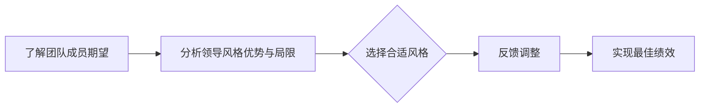
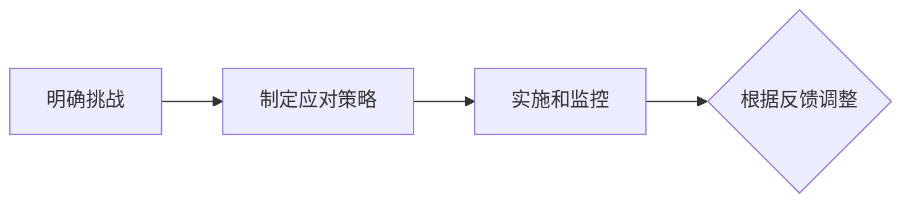
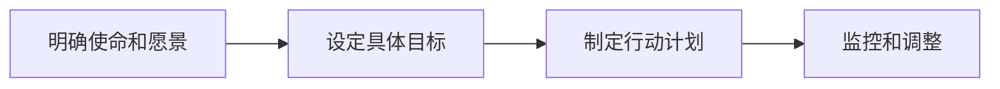
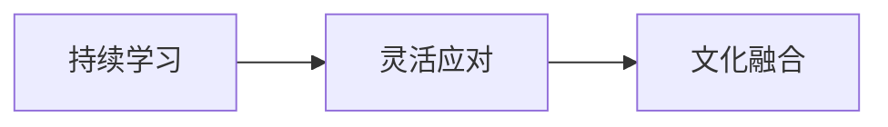

                 

# 领导力与战略思维：长远规划团队发展

## 关键词
- 领导力
- 战略思维
- 团队发展
- 愿景
- 目标
- 长远规划

## 摘要
在当今快速变化的技术和企业环境中，领导力和战略思维成为团队成功的关键。本文探讨了领导力的定义、核心要素及其在团队发展中的应用，战略思维的过程及其在长远规划中的重要性，以及团队成长和愿景设定的策略。通过深入分析这些核心概念，本文为企业管理者提供了实用的指导，以提升团队的整体绩效和竞争力。

### 引言
在技术迅猛发展和市场竞争日益激烈的背景下，企业的成功不再仅仅依赖于技术创新或市场拓展，更重要的是团队的能力和领导力。有效的领导力能够激励团队成员，推动团队创新，提高团队执行力，从而实现企业的长远发展目标。而战略思维则是领导者在面对复杂问题时，能够进行全局思考、预见未来趋势、制定科学规划的重要能力。本文旨在探讨领导力与战略思维在团队发展中的重要性，并提供实用的方法，帮助团队领导者提升团队绩效，实现长远规划。

### 第一部分：领导力的基础

#### 第1章 领导力：定义与核心要素

**背景介绍**
领导力是一个广泛讨论但定义多样的概念。在不同的学科和领域，领导力的含义和侧重点有所不同。在管理学中，领导力通常被定义为影响他人以实现共同目标的能力。而心理学则更关注领导者的个人特质和领导风格。

**核心概念与联系**
- **定义**：领导力是指引导、激励和影响团队成员，以实现共同目标的能力。
- **核心要素**：领导力的核心要素包括愿景、沟通、决策力、激励和自我管理。

**概念属性特征对比表格**

| 要素       | 描述                                                         | 对比 |
|------------|--------------------------------------------------------------|-----|
| 愿景       | 明确团队未来的方向和目标。                                     |     |
| 沟通       | 建立有效的沟通机制，确保信息流畅。                             |     |
| 决策力     | 快速而准确地做出决策，并在不确定的情况下做出最佳选择。         |     |
| 激励       | 激发团队成员的积极性和创造力，以实现团队目标。                 |     |
| 自我管理     | 高度自律，持续自我提升，以适应不断变化的环境。                 |     |

**ER实体关系图架构**

```mermaid
erDiagram
  TeamMember ||--|{ Leader : manages }
  Leader ||--|{ Vision : sets }
  Leader ||--|{ Communication : ensures }
  Leader ||--|{ DecisionMaking : makes }
  Leader ||--|{ Motivation : inspires }
  Leader ||--|{ SelfManagement : practices }
```

#### 第2章 领导风格与团队动力

**背景介绍**
领导风格是领导者管理团队的方式和风格。不同的领导风格会影响团队成员的行为和团队的整体氛围。了解和适应不同的领导风格对于提升团队绩效至关重要。

**核心概念与联系**
- **领导风格的类型**：包括民主型、专制型、参与型和教练型等。
- **领导风格与团队动力**：不同的领导风格会激发不同的团队动力。

**概念属性特征对比表格**

| 风格       | 描述                                                         | 动力 |
|------------|--------------------------------------------------------------|------|
| 民主型     | 允许团队成员参与决策，鼓励创新和自主性。                         | 高   |
| 专制型     | 领导者做出所有决策，团队成员执行命令。                           | 中   |
| 参与型     | 领导者与团队成员共同参与决策，重视团队反馈。                     | 高   |
| 教练型     | 领导者通过指导和辅导，帮助团队成员成长和提升能力。                 | 高   |

**ER实体关系图架构**

```mermaid
erDiagram
  Leader ||--|{ LeadershipStyle : adopts }
  Team ||--|{ LeadershipStyle : experiences }
  LeaderStyle ||--|{ TeamDynamics : influences }
```

**问题解决**
如何适应不同的领导风格？

**边界与外延**
领导风格并不是固定的，领导者可以根据不同的情境和团队需求调整自己的风格。

**算法原理讲解**
在团队管理中，领导者可以通过以下步骤来适应不同的领导风格：
1. 了解团队成员的期望和需求。
2. 分析不同领导风格的优势和局限。
3. 根据具体情况选择合适的领导风格。
4. 反馈和调整，以实现最佳团队绩效。

**数学模型和公式**
无特定的数学模型，但可以采用以下流程图来解释：



**系统分析与架构设计方案**
在团队管理系统中，可以通过以下架构设计来实现领导风格适应：
- **项目介绍**：团队管理系统
- **系统功能设计**：包括领导风格评估、团队成员需求分析、风格匹配建议等
- **系统架构设计**：前后端分离，前端展示分析结果，后端处理数据，实现自动匹配建议
- **系统接口设计**：API接口，支持数据导入和导出
- **系统交互**：通过序列图展示系统交互过程

**项目实战**
- **环境安装**：安装开发环境和依赖库
- **系统核心实现**：
  ```python
  # Python 代码示例
  class LeaderStyleAdapter:
      def __init__(self, team_members, leader_style):
          self.team_members = team_members
          self.leader_style = leader_style
          
      def adapt_style(self):
          # 根据团队成员需求调整领导风格
          # ...
  ```

- **代码应用解读与分析**：通过代码实现领导风格的适应，分析每个步骤的具体作用。
- **实际案例分析和详细讲解剖析**：通过实际案例，分析如何在不同情境下适应不同领导风格。
- **项目小结**：总结项目实现的关键点和经验，为未来项目提供参考。

**最佳实践 tips**
- 定期与团队成员沟通，了解他们的期望和需求。
- 根据团队的具体情况选择合适的领导风格。
- 实施后，通过反馈进行调整，以实现最佳团队绩效。

### 第二部分：战略思维与规划

#### 第3章 战略思维：核心概念与实践

**背景介绍**
战略思维是领导者进行决策和创新的重要能力。它涉及到对未来趋势的预见、竞争分析、资源整合等。

**核心概念与联系**
- **战略思维的定义**：战略思维是一种全局性、前瞻性和创新性的思考方式，用于解决复杂问题、制定长远规划。
- **战略思维的过程**：包括信息收集、问题分析、目标设定、方案制定和决策执行。

**概念属性特征对比表格**

| 过程       | 描述                                                         | 对比 |
|------------|--------------------------------------------------------------|-----|
| 信息收集   | 收集和分析内外部信息，为决策提供依据。                         |     |
| 问题分析   | 深入理解问题的本质，找出关键因素。                             |     |
| 目标设定   | 设定明确、可衡量的长远目标。                                   |     |
| 方案制定   | 制定多种实现目标的方案，进行评估和选择。                         |     |
| 决策执行   | 实施决策，跟踪进度，及时调整。                                 |     |

**ER实体关系图架构**

```mermaid
erDiagram
  StrategicThinking ||--|{ InformationGathering : collects }
  StrategicThinking ||--|{ ProblemAnalysis : analyzes }
  StrategicThinking ||--|{ GoalSetting : sets }
  StrategicThinking ||--|{ SolutionDevelopment : develops }
  StrategicThinking ||--|{ DecisionExecution : executes }
```

#### 第4章 战略规划：制定与执行

**背景介绍**
战略规划是组织实现长远目标的重要步骤。它涉及到资源的配置、目标的设定和执行的监控。

**核心概念与联系**
- **战略规划的重要性**：确保组织在复杂环境中保持竞争力。
- **战略规划的步骤**：包括愿景设定、目标制定、策略选择、资源分配和执行监控。

**概念属性特征对比表格**

| 步骤       | 描述                                                         | 对比 |
|------------|--------------------------------------------------------------|-----|
| 愿景设定   | 确定组织的长远发展方向和目标。                                 |     |
| 目标制定   | 设定具体、可衡量的短期和长期目标。                             |     |
| 策略选择   | 选择实现目标的最佳策略和方法。                                 |     |
| 资源分配   | 合理配置人力资源、财务资源和技术资源。                           |     |
| 执行监控   | 跟踪执行进度，及时调整。                                       |     |

**ER实体关系图架构**

```mermaid
erDiagram
  StrategicPlanning ||--|{ VisionSetting : sets }
  StrategicPlanning ||--|{ GoalSetting : sets }
  StrategicPlanning ||--|{ StrategySelection : selects }
  StrategicPlanning ||--|{ ResourceAllocation : allocates }
  StrategicPlanning ||--|{ ExecutionMonitoring : monitors }
```

**问题解决**
如何应对战略规划中的挑战？

**边界与外延**
战略规划是一个动态的过程，需要根据实际情况进行不断调整。

**算法原理讲解**
在战略规划中，领导者可以通过以下步骤应对挑战：
1. **明确挑战**：识别战略规划过程中可能遇到的挑战。
2. **制定应对策略**：针对每个挑战，制定具体的应对策略。
3. **实施和监控**：执行策略，并持续监控效果，根据反馈进行调整。

**数学模型和公式**
无特定的数学模型，但可以采用以下流程图来解释：



**系统分析与架构设计方案**
在战略规划系统中，可以通过以下架构设计来应对挑战：
- **项目介绍**：战略规划系统
- **系统功能设计**：包括挑战识别、策略制定、执行监控和反馈调整等
- **系统架构设计**：前后端分离，前端展示分析结果，后端处理数据，实现动态调整
- **系统接口设计**：API接口，支持数据导入和导出
- **系统交互**：通过序列图展示系统交互过程

**项目实战**
- **环境安装**：安装开发环境和依赖库
- **系统核心实现**：
  ```python
  # Python 代码示例
  class StrategicPlanner:
      def __init__(self, challenges):
          self.challenges = challenges
          
      def address_challenges(self):
          # 根据挑战制定应对策略
          # ...
  ```

- **代码应用解读与分析**：通过代码实现战略规划的应对策略，分析每个步骤的具体作用。
- **实际案例分析和详细讲解剖析**：通过实际案例，分析如何应对战略规划中的挑战。
- **项目小结**：总结项目实现的关键点和经验，为未来项目提供参考。

**最佳实践 tips**
- 定期评估和更新战略规划，以适应环境变化。
- 建立有效的反馈机制，及时调整策略。

### 第三部分：团队发展与长远规划

#### 第5章 团队发展：团队建设与成长

**背景介绍**
团队发展是组织成功的关键。一个高效的团队能够更好地应对挑战，实现组织目标。

**核心概念与联系**
- **团队发展的阶段**：包括形成期、激荡期、规范化期和执行期。
- **团队建设的策略**：包括建立信任、明确目标、提供支持和激励。

**概念属性特征对比表格**

| 阶段       | 描述                                                         | 对比 |
|------------|--------------------------------------------------------------|-----|
| 形成期     | 成员相互认识，建立初步信任。                                   |     |
| 激荡期     | 成员间冲突和竞争，团队开始形成凝聚力。                           |     |
| 规范化期   | 团队开始协同工作，形成明确的目标和规范。                         |     |
| 执行期     | 团队高效运作，实现既定目标。                                     |     |

**ER实体关系图架构**

```mermaid
erDiagram
  TeamDevelopment ||--|{ Formation : forms }
  TeamDevelopment ||--|{ Storming : storms }
  TeamDevelopment ||--|{ Norming : norms }
  TeamDevelopment ||--|{ Performing : performs }
```

#### 第6章 长远规划：愿景与目标设定

**背景介绍**
长远规划是确保团队持续发展和成功的关键。设定清晰的愿景和目标是长远规划的核心。

**核心概念与联系**
- **长远规划的定义**：长远规划是指为组织设定的长期发展目标和策略。
- **愿景与目标的设定**：包括设定具有挑战性的愿景和具体的可衡量目标。

**概念属性特征对比表格**

| 概念       | 描述                                                         | 对比 |
|------------|--------------------------------------------------------------|-----|
| 愿景       | 组织长期的愿景和使命，指导团队发展方向。                         |     |
| 目标       | 实现愿景的具体步骤，包括短期和长期目标。                         |     |

**ER实体关系图架构**

```mermaid
erDiagram
  LongTermPlanning ||--|{ Vision : sets }
  LongTermPlanning ||--|{ Goals : sets }
```

**问题解决**
如何设定清晰的愿景和目标？

**边界与外延**
愿景和目标应具有挑战性，同时要符合组织的实际情况。

**算法原理讲解**
在设定愿景和目标时，领导者可以通过以下步骤：
1. **明确组织使命和愿景**：确定组织长期的发展方向。
2. **设定具体目标**：根据愿景，设定短期和长期目标。
3. **制定行动计划**：为实现目标，制定具体的行动计划和资源分配。
4. **监控和调整**：定期评估目标的实现情况，根据反馈进行调整。

**数学模型和公式**
无特定的数学模型，但可以采用以下流程图来解释：



**系统分析与架构设计方案**
在团队长远规划系统中，可以通过以下架构设计来设定清晰的愿景和目标：
- **项目介绍**：团队长远规划系统
- **系统功能设计**：包括愿景设定、目标设定、行动计划制定和监控调整等
- **系统架构设计**：前后端分离，前端展示分析结果，后端处理数据，实现动态调整
- **系统接口设计**：API接口，支持数据导入和导出
- **系统交互**：通过序列图展示系统交互过程

**项目实战**
- **环境安装**：安装开发环境和依赖库
- **系统核心实现**：
  ```python
  # Python 代码示例
  class LongTermPlanner:
      def __init__(self, vision, goals):
          self.vision = vision
          self.goals = goals
          
      def set_action_plan(self):
          # 根据愿景和目标制定行动计划
          # ...
  ```

- **代码应用解读与分析**：通过代码实现长远规划的设定，分析每个步骤的具体作用。
- **实际案例分析和详细讲解剖析**：通过实际案例，分析如何设定清晰的愿景和目标。
- **项目小结**：总结项目实现的关键点和经验，为未来项目提供参考。

**最佳实践 tips**
- 定期与团队成员沟通，确保愿景和目标的共识。
- 目标要具体、可衡量，并设置明确的完成时间。

### 第四部分：实践与案例分析

#### 第7章 实践案例：成功领导力与战略思维的运用

**背景介绍**
通过实际案例，我们可以更好地理解领导力和战略思维在团队发展中的具体应用。

**核心概念与联系**
- **案例一**：领导力在团队变革中的运用
- **案例二**：战略思维在企业扩张中的应用
- **案例三**：团队发展与长远规划的实际案例

**案例一：领导力在团队变革中的运用**

**问题描述**：
一家传统制造企业面临激烈的市场竞争，需要进行数字化转型。然而，数字化转型涉及到组织结构、工作流程、技术基础设施等多方面的变革，对团队成员提出了新的要求。

**问题解决**：
1. **领导力**：企业领导层明确表达了对数字化转型的承诺，并通过激励和培训，帮助员工适应新的工作环境。
2. **战略思维**：企业高层领导进行了市场分析，确定了数字化转型的主要目标和实施步骤，并制定了详细的资源分配和监控计划。

**案例分析**：
通过领导力的激励和战略思维的指导，企业成功实现了数字化转型，提高了生产效率和产品质量，增强了市场竞争力。

**案例二：战略思维在企业扩张中的应用**

**问题描述**：
一家互联网公司希望在短时间内实现快速扩张，抢占市场份额。

**问题解决**：
1. **战略思维**：公司领导层进行了市场调研，分析了潜在客户的需求和市场趋势，制定了详细的扩张计划和策略。
2. **领导力**：通过有效的沟通和协调，领导层确保了各个部门之间的协作，同时激励员工积极参与扩张计划。

**案例分析**：
通过战略思维的指导和领导力的协作，公司成功实现了快速扩张，市场份额大幅提升，实现了业务的持续增长。

**案例三：团队发展与长远规划的实际案例**

**问题描述**：
一家初创公司希望在短时间内从初创阶段进入规模化运营。

**问题解决**：
1. **领导力**：公司领导层明确了公司的愿景和目标，并通过培训和激励，帮助团队成员提升能力和技能。
2. **战略思维**：公司领导层进行了市场分析，制定了详细的业务发展计划，包括产品开发、市场推广、团队扩展等。

**案例分析**：
通过领导力的激励和战略思维的指导，公司成功从初创阶段进入了规模化运营，实现了业务的快速增长。

### 第五部分：领导力与战略思维的未来

#### 第8章 未来领导力：挑战与趋势

**背景介绍**
随着技术和社会的快速发展，领导力也将面临新的挑战和趋势。

**核心概念与联系**
- **领导力的未来趋势**：包括数字化领导、远程领导、敏捷领导和多元文化领导。
- **战略思维的未来发展**：包括更加注重创新和灵活性的战略规划。

**概念属性特征对比表格**

| 趋势       | 描述                                                         | 对比 |
|------------|--------------------------------------------------------------|-----|
| 数字化领导 | 利用数字化工具和平台，提高领导效率。                           |     |
| 远程领导   | 应对远程工作趋势，提高远程团队的领导能力。                     |     |
| 敏捷领导   | 倡导快速响应和持续改进，提高团队的敏捷性。                     |     |
| 多元文化领导 | 管理多元文化团队，促进文化融合和创新。                         |     |

**ER实体关系图架构**

```mermaid
erDiagram
  FutureLeadership ||--|{ DigitalLeadership : utilizes }
  FutureLeadership ||--|{ RemoteLeadership : manages }
  FutureLeadership ||--|{ AgileLeadership : advocates }
  FutureLeadership ||--|{ MulticulturalLeadership : manages }
```

**问题解决**
如何应对未来领导力的挑战？

**边界与外延**
未来领导力的挑战不仅涉及技术层面，还包括组织和文化的变革。

**算法原理讲解**
在应对未来领导力的挑战时，领导者可以通过以下步骤：
1. **持续学习**：跟上技术和社会的发展趋势，提升自己的知识和技能。
2. **灵活应对**：根据不同的情境和团队需求，灵活调整领导策略。
3. **文化融合**：建立包容性的文化，促进多元文化的融合和创新。

**数学模型和公式**
无特定的数学模型，但可以采用以下流程图来解释：



**系统分析与架构设计方案**
在未来领导力系统中，可以通过以下架构设计来应对挑战：
- **项目介绍**：未来领导力系统
- **系统功能设计**：包括持续学习、灵活应对和文化融合等
- **系统架构设计**：前后端分离，前端展示分析结果，后端处理数据，实现动态调整
- **系统接口设计**：API接口，支持数据导入和导出
- **系统交互**：通过序列图展示系统交互过程

**项目实战**
- **环境安装**：安装开发环境和依赖库
- **系统核心实现**：
  ```python
  # Python 代码示例
  class FutureLeadershipSystem:
      def __init__(self, learning_strategy, flexibility_strategy, cultural_integration_strategy):
          self.learning_strategy = learning_strategy
          self.flexibility_strategy = flexibility_strategy
          self.cultural_integration_strategy = cultural_integration_strategy
          
      def implement_strategies(self):
          # 实施学习、灵活应对和文化融合策略
          # ...
  ```

- **代码应用解读与分析**：通过代码实现未来领导力的应对策略，分析每个步骤的具体作用。
- **实际案例分析和详细讲解剖析**：通过实际案例，分析如何应对未来领导力的挑战。
- **项目小结**：总结项目实现的关键点和经验，为未来项目提供参考。

**最佳实践 tips**
- 定期进行自我反思和自我提升，以适应未来领导力的要求。
- 建立灵活的团队结构和文化，促进多元文化的融合和创新。

### 结论
领导力和战略思维是团队成功的关键。通过本文的探讨，我们深入了解了领导力的核心要素、领导风格、战略思维的过程和长远规划的步骤。同时，通过实际案例的分析，我们看到了这些概念在实际应用中的效果。未来，领导者和团队需要不断学习和适应新的挑战，以保持竞争力。领导力与战略思维的整合，将助力团队在复杂环境中实现长远发展。

### 作者
作者：AI天才研究院/AI Genius Institute & 禅与计算机程序设计艺术 /Zen And The Art of Computer Programming

### 最佳实践 tips、小结、注意事项、拓展阅读等内容
**最佳实践 tips**：
- 定期进行团队建设活动，增强团队凝聚力。
- 建立有效的沟通机制，确保信息流畅。
- 在战略规划中，注重风险管理和资源分配。

**小结**：
本文探讨了领导力和战略思维在团队发展中的重要性，提供了实用的方法和实际案例，帮助领导者提升团队绩效和竞争力。

**注意事项**：
- 领导力的发展需要持续的学习和实践。
- 战略思维的应用需要灵活应对实际情况。

**拓展阅读**：
- 《领导力：如何成为领导者》
- 《战略规划：从理论到实践》
- 《团队建设：打造高效团队》

通过不断学习和实践，领导者可以不断提升自己的领导力和战略思维，带领团队实现长远发展。

