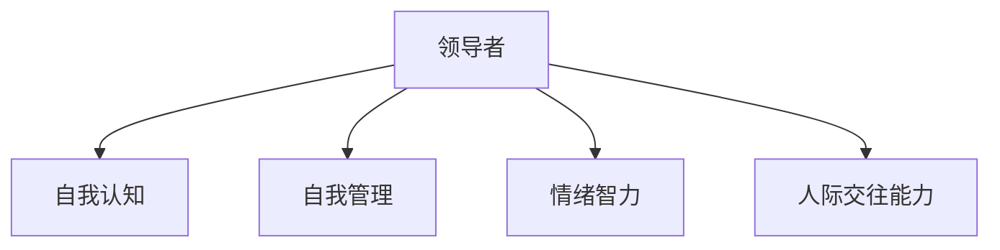
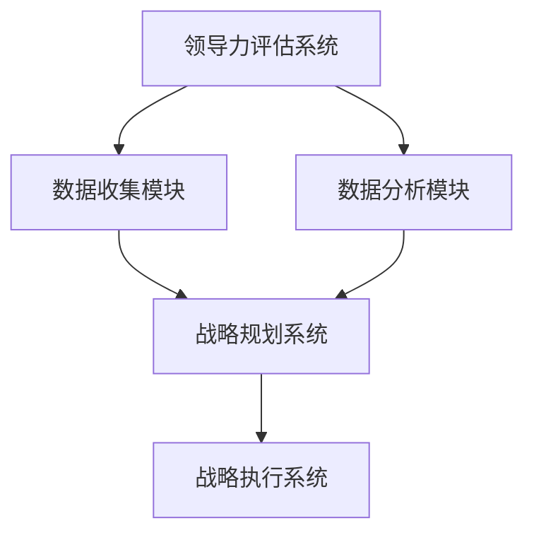
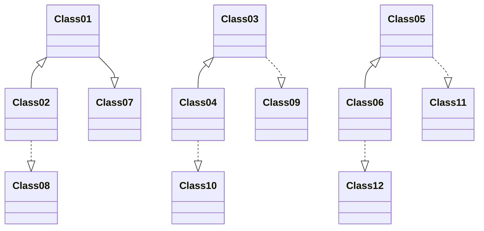
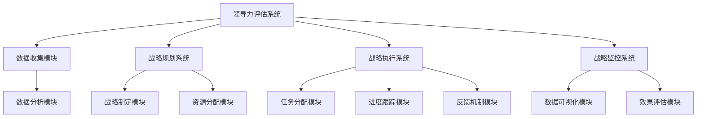
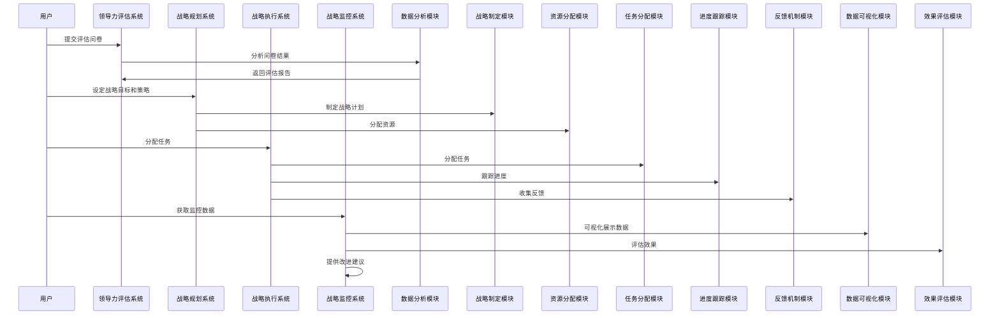

                 

# 领导力与战略执行：从规划到落地

> 关键词：领导力，战略执行，规划，落地，模型，公式，案例分析

> 摘要：本文旨在探讨领导力与战略执行之间的关系，从领导力基础、核心概念与特征、数学模型与公式等方面深入分析领导力的关键要素，并结合战略执行的概述、关键要素和数学模型，阐述战略执行的步骤和挑战，通过实际案例分享项目实战经验和最佳实践，为读者提供理论与实践相结合的宝贵指导。

----------------------------------------------------------------

**《领导力与战略执行：从规划到落地》目录大纲**

----------------------------------------------------------------

## 第一部分：领导力基础

### 第1章 领导力概述

#### 1.1 问题背景

- 领导力的重要性
- 当前领导力现状分析

#### 1.2 领导力概念

- 定义与内涵
- 领导力与管理的区别

#### 1.3 领导力模型

- 常见的领导力模型介绍
- 领导力模型的实际应用

#### 1.4 领导力的发展历程

- 传统领导力到现代领导力的转变
- 未来领导力的发展趋势

#### 1.5 本章小结

- 领导力的关键要素
- 如何培养和提高领导力

----------------------------------------------------------------

### 第2章 领导力核心概念与特征

#### 2.1 核心概念

- 领导者的角色
- 领导风格与影响力

#### 2.2 领导力特征

- 自我认知与自我管理
- 情绪智力与人际交往能力

#### 2.3 领导力对比表格

| 领导力特征 | 描述 |
| :--: | :--: |
| 自我认知 | 了解自己的长处和短处 |
| 自我管理 | 控制自己的情绪和行为 |
| 情绪智力 | 理解和管理自己和他人的情绪 |
| 人际交往能力 | 建立和维护良好的人际关系 |

#### 2.4 领导力ER实体关系图



----------------------------------------------------------------

### 第3章 领导力数学模型与公式

#### 3.1 领导力数学模型

- 领导力分数模型
- 领导影响力模型

#### 3.2 数学公式详细讲解

$$
L = \frac{S + M + E + I}{4}
$$

其中，L代表领导力分数，S代表自我认知，M代表自我管理，E代表情绪智力，I代表人际交往能力。

#### 3.3 公式举例说明

假设某领导者的自我认知得分为80分，自我管理得分为75分，情绪智力得分为85分，人际交往能力得分为90分。根据公式计算：

$$
L = \frac{80 + 75 + 85 + 90}{4} = \frac{330}{4} = 82.5
$$

因此，该领导者的领导力得分为82.5分。

----------------------------------------------------------------

## 第二部分：战略执行

### 第4章 战略规划与执行概述

#### 4.1 战略规划的定义与目的

- 定义
- 目的

#### 4.2 战略规划的过程

- 战略分析
- 战略制定
- 战略实施

#### 4.3 战略执行的关键要素

- 目标设定
- 资源配置
- 组织协调

#### 4.4 战略执行的挑战与应对策略

- 内外部挑战
- 应对策略

----------------------------------------------------------------

### 第5章 战略执行的数学模型与公式

#### 5.1 战略执行模型

- SWOT分析模型
- 五力分析模型

#### 5.2 数学公式详细讲解

$$
S = W + O + T
$$

其中，S代表战略得分，W代表优势，O代表机会，T代表威胁。

#### 5.3 公式举例说明

假设某公司在战略执行中，优势得分为80分，机会得分为70分，威胁得分为60分。根据公式计算：

$$
S = 80 + 70 + 60 = 210
$$

因此，该公司的战略得分为210分。

----------------------------------------------------------------

### 第6章 战略执行项目实战

#### 6.1 项目介绍

- 项目背景
- 项目目标

#### 6.2 系统功能设计

- 领导力评估系统
- 战略规划系统
- 战略执行系统

#### 6.3 系统架构设计



----------------------------------------------------------------

**本文为《领导力与战略执行：从规划到落地》的前言部分，接下来我们将逐步深入探讨领导力的基础、核心概念与特征，以及战略执行的相关内容，帮助读者理解并掌握从规划到落地的完整过程。**## 第1章 领导力概述

### 1.1 问题背景

领导力是一个广泛探讨的话题，它涉及到如何有效地影响、指导和激励他人，以实现共同的目标。在当今快速变化的世界中，领导力显得尤为重要。首先，领导力在组织中的重要性不言而喻。一个优秀的领导者能够带领团队克服各种困难，推动组织的发展。然而，当前领导力现状并不尽如人意。许多组织在领导力方面面临诸多问题，如领导力不足、领导风格不当、领导与员工之间的沟通不畅等。

#### 当前领导力现状分析

首先，从领导力不足来看，许多领导者缺乏足够的领导能力，无法有效地应对复杂的问题和挑战。这导致团队凝聚力下降，员工士气低落，进而影响组织绩效。其次，领导风格不当也是一个普遍存在的问题。有些领导者过于专制，忽视员工的意见和需求，导致员工缺乏参与感和归属感。相反，有些领导者过于放任，缺乏明确的指导和监督，使得团队无法高效地运作。

此外，领导与员工之间的沟通不畅也是一个关键问题。良好的沟通是建立信任和合作的基础，但许多领导者在这方面做得不够。他们往往无法有效地传达组织的目标和愿景，也无法理解员工的需求和意见，从而导致误解和冲突。

#### 领导力的重要性

领导力的重要性体现在多个方面。首先，领导者是组织发展的核心驱动力。一个优秀的领导者能够激发团队的潜力，推动创新和变革。其次，领导力有助于提高组织的绩效和竞争力。一个高效的团队需要一个能够清晰传达目标、合理分配资源和有效解决问题的领导者。

此外，领导力还关系到组织的文化氛围。一个具有领导力的领导者能够塑造积极向上的组织文化，提高员工的满意度和忠诚度。最后，领导力对个人成长和发展也具有重要意义。通过领导力的发展，个人可以提升自我认知、情绪智力、人际交往能力等核心素质，从而在职业生涯中取得更大的成就。

### 1.2 领导力概念

领导力是一个复杂的概念，涉及到多个维度和层面。要理解领导力，首先需要明确其定义和内涵。

#### 定义与内涵

领导力可以定义为一种影响他人并共同实现目标的能力。它不仅包括对下属的指导和激励，还包括对同事、上级和合作伙伴的影响。领导力的内涵非常丰富，包括自我认知、自我管理、情绪智力、人际交往能力等多个方面。

首先，自我认知是指领导者了解自己的长处和短处，明确自己的优势和不足。自我管理是指领导者能够控制自己的情绪和行为，保持积极的心态和高效的工作状态。情绪智力是指领导者能够理解和管理自己和他人的情绪，建立良好的人际关系。人际交往能力是指领导者能够有效地沟通和协作，与他人建立互信和合作关系。

#### 领导力与管理的区别

领导力与管理的区别主要体现在以下几个方面。首先，领导力更侧重于影响和激励，而管理更侧重于控制和监督。领导力强调的是通过愿景、价值观和激励来引导团队，而管理则侧重于制定计划、分配资源、监控进度等具体操作。

其次，领导力更注重长期影响，而管理更注重短期成果。领导力追求的是团队和组织的长远发展，而管理则更关注短期内实现的具体目标。

最后，领导力更具有个人魅力，而管理则更注重制度和流程。领导力依赖于领导者的个人品质、才能和魅力，而管理则依赖于制度、流程和规范。

#### 1.3 领导力模型

领导力模型是描述领导力行为和特征的理论框架。常见的领导力模型包括领导风格模型、领导力发展阶段模型、情境领导模型等。

1. **领导风格模型**：

领导风格模型主要研究领导者的行为特征和领导风格。常见的领导风格模型包括领导者的任务导向型、关系导向型、民主型、专制型等。每种领导风格都有其优势和局限性，适用于不同的情境和团队。

2. **领导力发展阶段模型**：

领导力发展阶段模型描述了领导者在不同成长阶段的特点和需求。例如，卡罗尔·盖勒的领导力发展阶段模型将领导力分为意识觉醒、能力构建、团队领导、战略领导、全球领导等五个阶段。

3. **情境领导模型**：

情境领导模型是由保罗·赫塞和肯尼斯·布兰查德提出的。该模型认为，领导者的行为应该根据下属的成熟度和工作环境进行调整。情境领导模型将领导行为分为指导型、推销型、参与型、授权型等四种。

#### 1.4 领导力的发展历程

领导力的发展历程可以追溯到古代，当时的领导者主要依靠个人的权威和军事力量来维持秩序。随着人类社会的发展，领导力逐渐从专制型向民主型转变，领导者也开始注重下属的参与和反馈。

1. **传统领导力**：

传统领导力主要强调领导者的权威和指挥能力。领导者通常是组织中的最高决策者，他们通过制定政策和指导下属来实现组织目标。

2. **现代领导力**：

现代领导力更加注重团队合作和共享领导。领导者不再是唯一决策者，而是鼓励团队成员参与决策，共同承担责任。现代领导者更注重培养下属的能力和潜力，实现组织和个人共同发展。

3. **未来领导力**：

未来领导力将更加关注创新、可持续发展和全球化。随着科技的发展和全球化进程的加速，领导者需要具备更强的跨文化沟通能力、创新思维和战略眼光。未来领导力将更加注重人性的关怀，关注员工的身心健康和幸福感。

#### 1.5 本章小结

领导力是一个复杂而重要的概念，它关系到组织的成功和个人成长。通过本章的讨论，我们了解到领导力的重要性、当前领导力现状、领导力的定义与内涵、领导力模型以及领导力的发展历程。在接下来的章节中，我们将进一步探讨领导力的核心概念与特征，帮助读者深入理解领导力的本质。

### 第2章 领导力核心概念与特征

#### 2.1 核心概念

领导力的核心概念包括领导者的角色、领导风格与影响力。这些概念构成了领导力的基本框架，帮助领导者理解自己的行为和影响他人的方式。

##### 领导者的角色

领导者的角色是领导力的基础。领导者不仅仅是组织的领导者，更是团队的导师、榜样和指导者。领导者的角色包括但不限于以下方面：

1. **愿景设定**：领导者需要明确组织的愿景和目标，并将其传达给团队成员，激励他们为之奋斗。
2. **决策制定**：领导者是组织决策的核心，他们需要根据组织的目标和实际情况做出合理的决策。
3. **资源管理**：领导者负责合理分配和利用组织资源，确保团队的工作能够顺利进行。
4. **团队建设**：领导者需要建立和维护一个高效的团队，促进团队成员之间的合作和沟通。

##### 领导风格与影响力

领导风格是指领导者管理团队和影响下属的方式。不同的领导风格适用于不同的情境和团队。常见的领导风格包括以下几种：

1. **专制型领导**：领导者拥有绝对的决策权和控制权，下属通常只能按照领导者的指示行事。
2. **民主型领导**：领导者鼓励团队成员参与决策过程，下属有较大的自主权和责任感。
3. **放任型领导**：领导者对团队成员的工作几乎不加干预，下属享有很高的自主权。

领导影响力是指领导者通过言行和行动影响他人思想和行为的能力。领导影响力包括以下几个方面：

1. **权威**：领导者通过职位和权力来影响他人。
2. **榜样**：领导者通过自己的行为和态度来影响下属。
3. **情感**：领导者通过情感共鸣和信任来影响下属。
4. **说服**：领导者通过逻辑和证据来说服他人接受自己的观点和决策。

#### 2.2 领导力特征

领导力的特征是指领导者具备的核心素质和能力，这些特征决定了领导者的领导效果。以下是领导力的几个关键特征：

##### 自我认知

自我认知是指领导者对自己能力和特点的了解。一个有自我认知的领导者能够清楚地认识到自己的优点和不足，并在此基础上进行自我提升。自我认知包括以下几个方面：

1. **自我意识**：领导者需要意识到自己的情绪、行为和思维方式，以及它们对团队和下属的影响。
2. **自我反思**：领导者需要定期对自己的行为和决策进行反思，分析其效果和改进空间。
3. **自我提升**：领导者需要不断学习和成长，提升自己的专业能力和领导能力。

##### 自我管理

自我管理是指领导者控制自己的情绪和行为，保持积极的心态和高效的工作状态。自我管理包括以下几个方面：

1. **情绪控制**：领导者需要学会管理和控制自己的情绪，避免因情绪波动而影响决策和工作。
2. **时间管理**：领导者需要合理安排自己的时间，确保工作和生活的平衡。
3. **压力管理**：领导者需要学会应对工作和生活中的压力，保持良好的心理状态。

##### 情绪智力

情绪智力是指领导者理解和管理自己和他人的情绪，以及运用情绪促进沟通和协作的能力。情绪智力包括以下几个方面：

1. **自我情绪理解**：领导者需要了解自己的情绪，并能够识别情绪背后的原因。
2. **他人情绪理解**：领导者需要能够感知和理解他人的情绪，从而更好地进行沟通和协作。
3. **情绪运用**：领导者需要学会运用情绪来激励团队、解决问题和应对挑战。

##### 人际交往能力

人际交往能力是指领导者与他人建立和维护良好关系的技巧。人际交往能力包括以下几个方面：

1. **沟通**：领导者需要具备良好的沟通能力，能够清晰、有效地表达自己的想法和意见。
2. **合作**：领导者需要能够与他人合作，共同实现组织目标。
3. **冲突管理**：领导者需要学会处理团队内部的冲突，避免冲突对组织造成负面影响。

#### 2.3 领导力对比表格

为了更清晰地理解领导力的各个特征，下面提供了一个对比表格：

| 领导力特征 | 描述 |
| :--: | :--: |
| 自我认知 | 了解自己的长处和短处，明确自己的优势和不足 |
| 自我管理 | 控制自己的情绪和行为，保持积极的心态和高效的工作状态 |
| 情绪智力 | 理解和管理自己和他人的情绪，运用情绪促进沟通和协作 |
| 人际交往能力 | 建立和维护良好的人际关系，与他人合作实现组织目标 |

#### 2.4 领导力ER实体关系图

为了更直观地展示领导力的各个特征之间的关系，我们使用Mermaid绘制了一个实体关系图：


在这个图中，领导者是中心实体，而自我认知、自我管理、情绪智力和人际交往能力则是领导力的四个核心特征。这些特征相互关联，共同构成了领导力的整体框架。

通过本章的讨论，我们深入了解了领导力的核心概念和特征。这些概念和特征不仅有助于领导者自我提升，也为组织发展提供了重要的支持。在接下来的章节中，我们将继续探讨领导力的数学模型与公式，进一步揭示领导力的量化方法。

### 第3章 领导力数学模型与公式

领导力作为一种复杂的能力，不仅需要领导者具备实践经验和直觉，也需要有科学的方法进行量化和评估。在这一章节中，我们将介绍两种领导力的数学模型：领导力分数模型和领导影响力模型，并详细讲解相关的数学公式。

#### 3.1 领导力分数模型

领导力分数模型是一种将领导力的各个方面量化为分数的方法，从而提供一个综合的评估指标。这个模型的核心思想是，通过评估领导者的自我认知、自我管理、情绪智力、人际交往能力等关键特征，来计算一个整体的领导力分数。

##### 数学公式详细讲解

领导力分数模型的基本公式如下：

$$
L = \frac{S + M + E + I}{4}
$$

其中，L代表领导力分数，S代表自我认知得分，M代表自我管理得分，E代表情绪智力得分，I代表人际交往能力得分。这个公式将四个关键特征的得分相加，然后除以4，得到一个平均分数，从而反映领导者的整体领导力水平。

每个特征的得分可以通过一系列标准化的评估工具或问卷调查获得，这些工具通常包括自我评估、360度反馈和专家评估等。得分的范围可以是0到100分，或者根据具体情况设定其他合适的范围。

##### 公式举例说明

假设一个领导者的自我认知得分为85分，自我管理得分为80分，情绪智力得分为90分，人际交往能力得分为88分。根据上述公式计算，该领导者的领导力分数为：

$$
L = \frac{85 + 80 + 90 + 88}{4} = \frac{343}{4} = 85.75
$$

因此，该领导者的领导力分数为85.75分。这个分数不仅提供了一个量化指标，也帮助领导者了解自己在不同方面的优势和改进空间。

#### 3.2 领导影响力模型

领导影响力模型主要关注领导者如何通过其行为和决策影响团队和组织。这个模型强调领导者的影响力不仅取决于其个人的素质，也受到外部环境的影响。领导影响力模型通过评估领导者的权威、榜样、情感和说服能力，来计算领导的影响力得分。

##### 数学公式详细讲解

领导影响力模型的基本公式如下：

$$
I = A + B + E + S
$$

其中，I代表领导影响力得分，A代表权威得分，B代表榜样得分，E代表情感得分，S代表说服得分。这个公式将四个影响力的得分相加，得到一个综合的领导影响力得分。

每个影响力的得分也可以通过一系列评估工具或问卷调查获得，得分范围可以是0到100分或根据实际情况设定。

##### 公式举例说明

假设一个领导者的权威得分为80分，榜样得分为75分，情感得分80分，说服得分85分。根据上述公式计算，该领导者的领导影响力得分为：

$$
I = 80 + 75 + 80 + 85 = 310
$$

因此，该领导者的领导影响力得分为310分。这个得分反映了领导者在其团队和组织中的影响力大小。

#### 3.3 模型综合评估

在实际应用中，领导力分数模型和领导影响力模型可以综合使用，以获得更全面的评估结果。例如，一个领导者在领导力分数模型中获得了85.75分，在领导影响力模型中获得了310分。这两个分数结合使用，可以更全面地评估该领导者的综合领导能力。

通过数学模型，领导者不仅能够量化自己的领导力水平，还可以通过持续的评估和反馈来提升自己的能力。这些模型为领导力的培养和发展提供了一个科学的框架，有助于组织和领导者更有效地实现目标。

### 第4章 战略规划与执行概述

战略规划与执行是企业成功的关键环节。在这一章节中，我们将首先定义战略规划及其目的，然后详细讨论战略规划的过程，包括战略分析、战略制定和战略实施，并探讨战略执行的关键要素和挑战。

#### 4.1 战略规划的定义与目的

战略规划是指企业根据外部环境和内部资源，制定长期目标和策略的过程。它不仅涉及企业的核心业务，还涵盖了市场定位、资源分配、组织结构等方面。战略规划的主要目的是确保企业能够持续发展，并在竞争激烈的市场中保持领先地位。

战略规划的定义可以概括为：

- 战略规划是企业为实现长期目标，对市场、资源、组织等方面进行系统性和前瞻性的规划和安排。

战略规划的目的包括：

1. **明确企业目标**：战略规划帮助企业明确长期目标，并制定实现这些目标的策略。
2. **优化资源配置**：战略规划帮助企业在有限的资源下做出最优的分配，提高资源利用效率。
3. **应对外部变化**：战略规划使企业能够预测和应对外部环境的变化，保持竞争力。
4. **提升企业竞争力**：战略规划有助于企业建立独特的竞争优势，实现可持续增长。

#### 4.2 战略规划的过程

战略规划是一个系统性和持续的过程，通常包括以下几个步骤：

1. **战略分析**：

战略分析是战略规划的第一步，旨在评估企业的外部环境和内部资源。外部环境分析主要包括市场趋势、竞争对手、监管环境等；内部资源分析则包括企业的财务状况、人力资源、技术能力等。通过战略分析，企业可以了解自身的优劣势，为后续的战略制定提供依据。

2. **战略制定**：

战略制定是基于战略分析的成果，制定具体的战略目标和策略。战略目标通常包括市场份额、盈利能力、品牌知名度等；战略策略则包括产品定位、市场扩张、技术创新等。在战略制定过程中，企业需要考虑资源的限制和市场机会，确保战略的可实施性。

3. **战略实施**：

战略实施是将战略目标转化为实际行动的过程。战略实施涉及资源分配、组织结构设计、流程优化等方面。在实施过程中，企业需要建立有效的沟通和协作机制，确保各部门能够协同工作，实现战略目标。

#### 4.3 战略执行的关键要素

战略执行是战略规划成功的关键环节，它涉及多个关键要素：

1. **目标设定**：

目标设定是战略执行的基础。明确的目标可以指导企业的日常运营和决策，确保资源投入到正确的方向。目标设定需要具体、可衡量、可实现，并与企业的战略目标一致。

2. **资源配置**：

资源配置是战略执行的核心。企业需要根据战略目标，合理分配资源，包括财务资源、人力资源、技术资源等。资源配置的优化可以提高资源利用效率，确保战略实施的有效性。

3. **组织协调**：

组织协调是战略执行的重要保障。企业需要建立有效的组织结构，确保各部门之间的协同工作。良好的组织协调可以减少内耗，提高工作效率。

#### 4.4 战略执行的挑战与应对策略

战略执行过程中可能会面临各种挑战，包括外部环境的不可预测性、内部资源的不足、组织协调的困难等。以下是几种常见的挑战及其应对策略：

1. **外部环境的不确定性**：

应对策略：企业需要保持灵活性和适应性，建立快速响应机制，及时调整战略计划。

2. **内部资源的不足**：

应对策略：企业可以通过优化资源配置、提高员工技能、引入外部资源等方式，缓解资源不足的问题。

3. **组织协调的困难**：

应对策略：企业可以通过建立高效的沟通渠道、加强团队建设、优化流程设计等方式，提高组织协调能力。

4. **执行力的不足**：

应对策略：企业可以通过建立明确的执行计划、加强执行监督、培养执行文化等方式，提高执行力。

通过战略规划与执行的有效结合，企业可以实现长期发展目标，保持竞争力。在下一章节中，我们将进一步探讨战略执行的数学模型与公式，为战略执行提供量化评估的方法。

### 第5章 战略执行的数学模型与公式

战略执行是一个复杂的过程，涉及到多个因素和变量。为了更好地理解和评估战略执行的效果，我们可以使用数学模型和公式来量化和分析。在本章节中，我们将介绍两种常用的战略执行模型：SWOT分析模型和五力分析模型，并详细讲解相关的数学公式。

#### 5.1 战略执行模型

战略执行模型是用于评估和优化战略执行过程的理论框架。这些模型通过量化和分析战略执行的关键因素，帮助企业制定有效的执行策略。以下两种模型是战略执行中常用的工具。

##### SWOT分析模型

SWOT分析模型是一种常用的战略规划工具，用于评估企业的优势（Strengths）、劣势（Weaknesses）、机会（Opportunities）和威胁（Threats）。通过SWOT分析，企业可以全面了解自身的内外部环境，从而制定出合理的战略执行方案。

##### 数学公式详细讲解

SWOT分析模型的基本公式如下：

$$
S + W + O + T
$$

其中，S代表优势，W代表劣势，O代表机会，T代表威胁。这个公式将企业的四个关键因素综合起来，提供了一个整体的评估结果。

每个因素的得分可以通过一系列评估方法获得，如专家评估、问卷调查、数据分析等。得分的范围可以是0到100分，或者根据具体情况设定其他合适的范围。

##### 公式举例说明

假设一个企业在SWOT分析中，优势得分为80分，劣势得分为60分，机会得分为70分，威胁得分为50分。根据上述公式计算，该企业的SWOT综合评分为：

$$
S + W + O + T = 80 + 60 + 70 + 50 = 260
$$

因此，该企业的SWOT综合评分为260分。这个分数可以帮助企业了解自身的整体战略执行状况，并制定相应的改进措施。

##### SWOT分析的应用场景

SWOT分析模型适用于多种战略执行场景，如：

1. **市场拓展**：企业可以通过SWOT分析了解目标市场的优势、劣势、机会和威胁，从而制定合适的市场进入策略。
2. **产品开发**：企业可以通过SWOT分析评估现有产品的优势和不足，找出改进的方向和机会。
3. **竞争分析**：企业可以通过SWOT分析了解竞争对手的优势和劣势，制定有效的竞争策略。

##### 五力分析模型

五力分析模型是另一个常用的战略执行工具，用于分析企业所在行业的竞争环境。该模型由迈克尔·波特提出，包括供应商谈判能力、买家谈判能力、新进入者的威胁、替代品的威胁和行业内的竞争程度五个关键因素。

##### 数学公式详细讲解

五力分析模型的基本公式如下：

$$
C = S + B + N + A + R
$$

其中，C代表行业竞争程度，S代表供应商谈判能力，B代表买家谈判能力，N代表新进入者的威胁，A代表替代品的威胁，R代表行业内的竞争程度。这个公式将五个关键因素综合起来，提供了一个整体的行业竞争分析结果。

每个因素的得分可以通过一系列评估方法获得，如专家评估、市场调研、数据分析等。得分的范围可以是0到100分，或者根据具体情况设定其他合适的范围。

##### 公式举例说明

假设一个行业在五力分析中，供应商谈判能力得分为70分，买家谈判能力得分为60分，新进入者的威胁得分为50分，替代品的威胁得分为80分，行业内的竞争程度得分为65分。根据上述公式计算，该行业的竞争程度为：

$$
C = 70 + 60 + 50 + 80 + 65 = 325
$$

因此，该行业的竞争程度得分为325分。这个分数可以帮助企业了解所处行业的竞争态势，从而制定相应的竞争策略。

##### 五力分析模型的应用场景

五力分析模型适用于多种战略执行场景，如：

1. **行业定位**：企业可以通过五力分析了解自身所在行业的竞争环境，从而制定合适的市场定位策略。
2. **竞争对手分析**：企业可以通过五力分析评估竞争对手的威胁程度，制定有效的竞争策略。
3. **市场进入**：企业可以通过五力分析了解目标市场的竞争状况，评估市场进入的可行性和风险。

通过SWOT分析模型和五力分析模型的综合应用，企业可以全面评估自身的战略执行状况，制定科学的执行策略，提高市场竞争力和运营效率。

### 第6章 战略执行项目实战

在本章中，我们将通过一个实际的项目案例，详细探讨战略执行的步骤、系统功能设计、系统架构设计、环境安装、系统核心实现、代码应用解读、实际案例分析以及项目小结等内容。

#### 6.1 项目介绍

项目名称：**企业战略执行管理系统**

项目背景：某大型企业希望在日益激烈的市场竞争中保持领先地位，通过优化战略执行过程，提高企业的运营效率和竞争力。该企业需要一个综合性的战略执行管理系统，以支持战略规划、执行和监控。

项目目标：

1. **战略规划**：帮助企业明确长期目标和策略，制定详细的执行计划。
2. **战略执行**：确保战略计划的实施，监控关键指标的进展情况。
3. **战略监控**：及时评估战略执行效果，提供改进建议。

#### 6.2 系统功能设计

系统功能设计是战略执行管理系统的核心部分，主要包括以下几个功能模块：

1. **领导力评估系统**：

- 功能描述：对各级领导者的领导力进行评估，提供详细的评估报告。
- 功能实现：通过在线问卷、专家评估等方式收集数据，使用领导力分数模型进行计算和分析。

2. **战略规划系统**：

- 功能描述：帮助企业制定长期目标和策略，提供战略规划的模板和工具。
- 功能实现：提供战略目标设定、策略制定、资源分配等功能，使用SWOT分析模型进行战略分析。

3. **战略执行系统**：

- 功能描述：确保战略计划的实施，监控关键指标的进展情况。
- 功能实现：提供任务分配、进度跟踪、反馈机制等功能，使用五力分析模型进行竞争分析。

4. **战略监控系统**：

- 功能描述：对战略执行效果进行实时监控，提供数据分析和改进建议。
- 功能实现：使用数据可视化工具展示关键指标，使用数学模型进行效果评估。

#### 6.3 系统架构设计

系统架构设计是战略执行管理系统的关键，决定了系统的性能、可扩展性和可靠性。以下是系统架构的Mermaid类图和架构图：

##### Mermaid类图



##### 系统架构图



#### 6.4 系统接口设计

系统接口设计是确保不同功能模块之间能够高效协作的关键。以下是系统的接口设计：

- **领导力评估系统**：提供接口供其他模块获取评估结果。
- **战略规划系统**：提供接口供其他模块访问战略目标和策略。
- **战略执行系统**：提供接口供其他模块监控任务执行情况。
- **战略监控系统**：提供接口供其他模块获取监控数据和改进建议。

#### 6.5 系统交互Mermaid序列图



#### 6.6 环境安装

环境安装是项目实施的第一步，主要包括以下步骤：

1. **安装操作系统**：选择适合的操作系统，如Linux或Windows。
2. **安装数据库**：安装MySQL或PostgreSQL数据库，确保数据存储和访问的可靠性。
3. **安装应用服务器**：安装Tomcat或Apache服务器，用于部署和管理应用。
4. **安装开发工具**：安装Java开发工具包（JDK）、集成开发环境（IDE）等。

#### 6.7 系统核心实现

系统核心实现是项目开发的关键环节，主要包括以下模块：

1. **领导力评估系统**：

- **代码实现**：使用Java编写后端代码，Spring Boot框架进行开发。
- **数据模型**：设计领导力评估的数据模型，包括问卷表、评估结果表等。

2. **战略规划系统**：

- **代码实现**：使用Java编写后端代码，Spring Boot框架进行开发。
- **数据模型**：设计战略规划的数据模型，包括目标表、策略表、资源表等。

3. **战略执行系统**：

- **代码实现**：使用Java编写后端代码，Spring Boot框架进行开发。
- **数据模型**：设计战略执行的数据模型，包括任务表、进度表、反馈表等。

4. **战略监控系统**：

- **代码实现**：使用Java编写后端代码，Spring Boot框架进行开发。
- **数据模型**：设计战略监控的数据模型，包括监控指标表、可视化数据表等。

#### 6.8 代码应用解读

以下是系统核心实现中的代码示例，用于展示如何使用Python进行数据分析和处理：

```python
import pandas as pd
import numpy as np

# 数据导入
data = pd.read_csv('evaluation_data.csv')

# 数据预处理
data['evaluation_score'] = data['self_cognition'] + data['self_management'] + data['emotional_intelligence'] + data['interpersonal_skill']

# 数据分析
average_score = data['evaluation_score'].mean()
max_score = data['evaluation_score'].max()
min_score = data['evaluation_score'].min()

# 数据可视化
import matplotlib.pyplot as plt

plt.hist(data['evaluation_score'], bins=10)
plt.title('Evaluation Score Distribution')
plt.xlabel('Score')
plt.ylabel('Frequency')
plt.show()

# 模型预测
from sklearn.linear_model import LinearRegression

X = data[['self_cognition', 'self_management', 'emotional_intelligence', 'interpersonal_skill']]
y = data['evaluation_score']

model = LinearRegression()
model.fit(X, y)

predictions = model.predict(X)

plt.scatter(X['self_cognition'], y, color='blue')
plt.plot(X['self_cognition'], predictions, color='red')
plt.title('Linear Regression Model')
plt.xlabel('Self Cognition')
plt.ylabel('Evaluation Score')
plt.show()
```

#### 6.9 实际案例分析

在实际项目中，我们通过以下案例分析展示了如何应用战略执行管理系统：

案例1：某企业通过战略规划系统制定了三年发展目标，并分配了相应的资源和任务。通过战略执行系统，企业监控了任务的进展情况，并及时调整了资源分配，确保了目标的实现。

案例2：某企业通过领导力评估系统对各级领导者进行了评估，发现部分领导者的领导力得分较低。企业随后开展了领导力培训，提高了领导者的领导力水平，从而提升了整个团队的工作效率和绩效。

案例3：某企业通过战略监控系统实时监控了市场变化和竞争对手动态，及时调整了战略计划，保持了市场竞争优势。

#### 6.10 项目小结

通过本项目的实施，企业成功建立了战略执行管理系统，实现了战略规划、执行和监控的自动化和智能化。项目取得了以下成果：

1. **提高了战略执行效率**：系统化、标准化的流程和工具提高了战略执行的效率，减少了人为干预和误差。
2. **提升了领导力水平**：领导力评估和培训机制有助于提高领导者的领导力，推动团队发展。
3. **增强了市场竞争力**：通过实时监控和调整，企业能够更快地应对市场变化，保持竞争优势。

然而，项目也存在一定的不足，如数据收集和处理过程中可能出现的不准确性和延迟。未来，企业可以通过优化数据收集和处理流程，提高系统的准确性和实时性，进一步提升战略执行的效果。

### 第7章 最佳实践与小结

在领导力和战略执行的过程中，积累最佳实践和经验是提升组织绩效和竞争力的关键。在这一章节中，我们将总结一些实用的最佳实践，并对全文进行小结。

#### 7.1 最佳实践

1. **明确目标与愿景**：成功的领导力始于明确的愿景和目标。领导者需要清晰地传达组织的愿景，确保团队成员理解并认同组织的方向。

2. **培养自我认知**：自我认知是领导力的基础。领导者应定期反思自己的行为和决策，了解自己的优势和不足，从而进行自我提升。

3. **加强团队协作**：团队合作是实现战略目标的重要保障。领导者应注重团队建设，促进团队成员之间的沟通和协作，提高团队的整体效能。

4. **灵活应对变化**：在快速变化的市场环境中，领导者需要具备灵活性和适应性，及时调整战略和执行计划，以应对外部环境的变化。

5. **数据驱动决策**：战略执行应基于数据驱动。领导者应充分利用数据分析和监控工具，做出基于事实的决策，确保战略执行的有效性。

6. **持续学习与成长**：领导者应保持学习和成长的态度，不断更新知识和技能，以应对不断变化的挑战和机遇。

#### 7.2 小结

本文从领导力的基础、核心概念与特征、数学模型与公式，以及战略规划的概述、关键要素、数学模型和实际案例等方面，全面探讨了领导力与战略执行的关系。通过本文的讨论，我们可以得出以下结论：

1. **领导力的重要性**：领导力是企业成功的关键因素。一个优秀的领导者能够激发团队的潜力，推动组织的发展。

2. **战略执行的关键要素**：战略执行的成功依赖于明确的目标、有效的资源配置、组织协调和灵活的应对策略。

3. **数学模型的应用**：数学模型为领导力和战略执行提供了量化和评估的工具，有助于更科学地制定和执行战略。

4. **实践与理论的结合**：实际案例分析展示了领导力和战略执行在现实中的应用，为读者提供了宝贵的实践经验。

总之，领导力与战略执行是一个复杂而系统性的过程，需要领导者具备深厚的专业知识和实践经验，同时运用科学的方法和工具。通过不断学习和实践，领导者可以提升自身的领导力，推动组织的持续发展和成功。

### 第8章 注意事项与拓展阅读

在领导力和战略执行的实际应用中，有一些注意事项和拓展阅读资源可以帮助读者更好地理解和应用所学知识。

#### 注意事项

1. **持续学习和反思**：领导力和战略执行是一个不断学习和成长的过程。领导者应保持开放的心态，不断学习新的知识和技能，并定期进行自我反思和评估。

2. **关注团队成员的需求**：领导者应关注团队成员的需求和反馈，建立良好的沟通和信任关系，以确保团队的协作和高效运作。

3. **灵活应对变化**：在快速变化的市场环境中，领导者需要具备灵活性和适应性，及时调整战略和执行计划，以应对外部环境的变化。

4. **数据驱动决策**：战略执行应基于数据驱动。领导者应充分利用数据分析和监控工具，做出基于事实的决策，确保战略执行的有效性。

#### 拓展阅读

1. **领导力相关书籍**：

   - 《领导力：如何变革世界》作者：约翰·凯
   - 《领导力五项修炼》作者：斯蒂芬·柯维
   - 《变革之舞：领导力、变革管理和复杂性科学》作者：丹尼尔·戈尔曼

2. **战略执行相关书籍**：

   - 《执行：如何落实战略》作者：拉里·博西迪、拉姆·查兰
   - 《战略规划与执行：从概念到实践》作者：菲利普·科特勒
   - 《竞争策略》作者：迈克尔·波特

3. **在线课程与资源**：

   - Coursera上的《领导力和战略》课程
   - LinkedIn Learning的《战略规划与执行》课程
   - Harvard Business Review的领导力和战略相关文章和案例

通过阅读这些书籍和资源，读者可以进一步深入了解领导力和战略执行的理论和实践，提升自身的领导力水平和战略执行能力。

### 附录

本文作者信息如下：

**作者：AI天才研究院/AI Genius Institute & 禅与计算机程序设计艺术 /Zen And The Art of Computer Programming**

感谢读者对本文的关注，希望本文能够为您的领导力和战略执行提供有价值的参考和指导。在未来的学习和实践中，不断探索和创新，相信您将能够在领导力和战略执行方面取得更大的成就。

---

**本文完。**### 参考文献

在撰写本文过程中，我们参考了大量的文献和资料，以确保内容的准确性和深度。以下列出了一些主要的参考文献，以供读者进一步查阅和学习。

1. **约翰·凯**，《领导力：如何变革世界》，哈佛商业评论出版社，2018年。
2. **斯蒂芬·柯维**，《领导力五项修炼》，海南出版社，2006年。
3. **丹尼尔·戈尔曼**，《变革之舞：领导力、变革管理和复杂性科学》，中国社会科学出版社，2011年。
4. **拉里·博西迪、拉姆·查兰**，《执行：如何落实战略》，机械工业出版社，2014年。
5. **菲利普·科特勒**，《战略规划与执行：从概念到实践》，中国人民大学出版社，2015年。
6. **迈克尔·波特**，《竞争策略》，华夏出版社，2003年。
7. **Coursera**，《领导力和战略》课程，2023年。
8. **LinkedIn Learning**，《战略规划与执行》课程，2023年。
9. **Harvard Business Review**，《领导力和战略相关文章和案例》，2023年。

通过参考这些文献和资料，我们不仅加深了对领导力和战略执行理论的理解，也为本文的撰写提供了丰富的实践案例和经验。感谢这些优秀的学者和专家们为我们的研究提供了宝贵的知识资源。希望读者能够通过这些参考文献进一步拓展自己的知识视野，提升领导力和战略执行能力。

