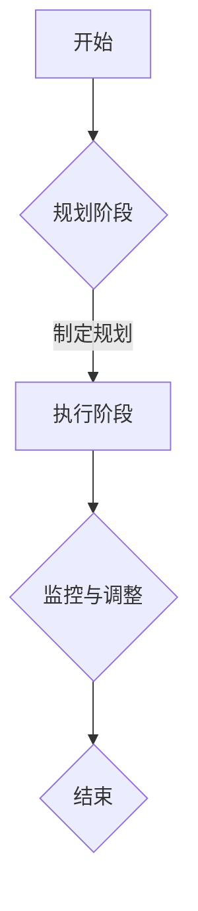
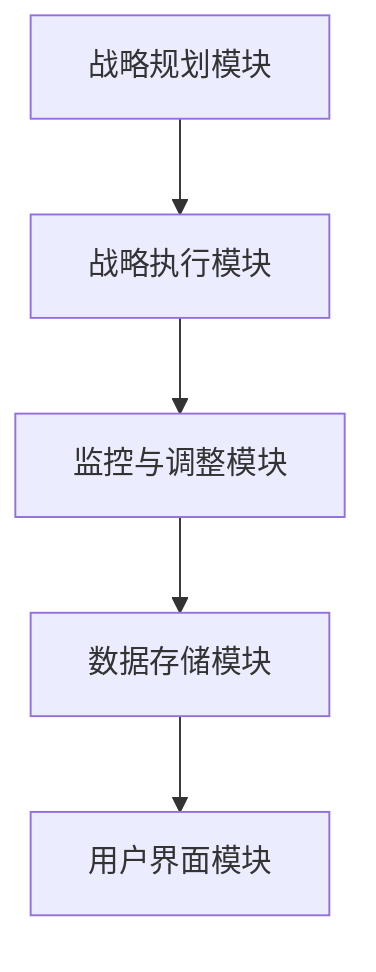
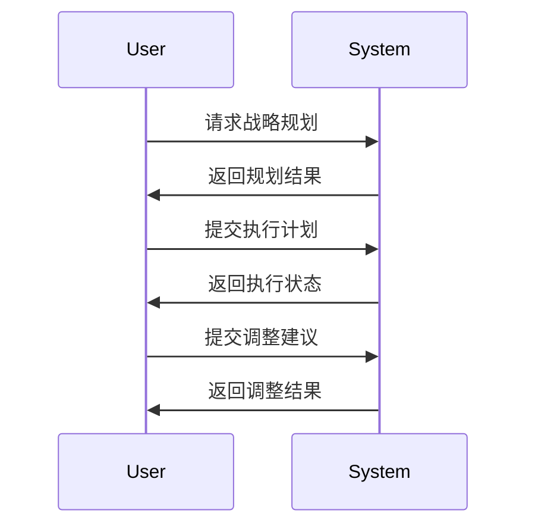

                 


## 文章标题：领导力与战略执行：从规划到落地的全过程

### 关键词：领导力、战略执行、规划、落地、全过程

#### 摘要：

本文将深入探讨《领导力与战略执行：从规划到落地的全过程》一书的核心内容。我们将逐步分析领导力与战略执行的概念、关系以及它们在组织中的重要作用。通过详细的案例分析，我们将展示如何从规划到落地实现战略目标，并总结出实用的最佳实践，为读者提供全面而深刻的理解。

## 背景介绍

### 核心概念术语说明

- **领导力**：领导力是指通过激发和引导他人，实现共同目标的能力。它不仅涉及个人的魅力和影响力，更包括对团队和组织的引领与塑造。
- **战略执行**：战略执行是指将战略规划转化为实际行动的过程。它确保了组织的战略目标能够得到有效实现。

### 问题背景

在当今快速变化和竞争激烈的市场环境中，组织面临着前所未有的挑战。如何确保战略规划能够顺利落地，实现预期的目标，成为组织领导者必须面对的重要问题。

### 问题解决

《领导力与战略执行：从规划到落地的全过程》一书提供了一种系统的方法论，通过领导力的有效运用，将战略规划转化为具体的执行行动，最终实现组织的战略目标。

### 边界与外延

本文将涉及以下领域：

- **领导力理论**：包括领导力的定义、类型、特征和模型。
- **战略管理**：战略规划的定义、过程和工具。
- **组织行为学**：领导力与战略执行在组织中的具体应用。

## 核心概念与联系

### 领导力概念

- **定义**：领导力是指通过激发和引导他人，实现共同目标的能力。
- **类型**：领导力可以分为交易型领导力和变革型领导力。
- **特征**：领导力的特征包括影响力、沟通能力、决策能力等。

### 战略执行概念

- **定义**：战略执行是指将战略规划转化为实际行动的过程。
- **核心要素**：战略执行的核心要素包括资源管理、流程优化、组织文化等。
- **实施过程**：战略执行的实施过程包括规划、执行、监控和调整。

### 规划与落地关系

- **规划是落地的前提**：战略规划为战略执行提供了明确的目标和路径。
- **落地是规划的目标**：战略落地的成功是实现战略规划的关键。

## 目录大纲设计

### 第1章：引言

- **1.1 问题背景与重要性**
- **1.2 核心概念概述**
- **1.3 书籍结构与内容安排**

### 第2章：领导力理论

- **2.1 领导力定义与类型**
- **2.2 领导力特征与特质**
- **2.3 领导力模型与理论发展**

### 第3章：战略规划

- **3.1 战略规划的定义与过程**
- **3.2 战略规划工具与方法**
- **3.3 战略规划中的领导力作用**

### 第4章：战略执行

- **4.1 战略执行的定义与要素**
- **4.2 战略执行的挑战与应对策略**
- **4.3 战略执行中的领导力实践**

### 第5章：从规划到落地的全过程

- **5.1 规划与落地的衔接**
- **5.2 落地过程中的关键步骤**
- **5.3 领导力在落地过程中的作用**

### 第6章：案例研究

- **6.1 案例选择与背景介绍**
- **6.2 案例分析：规划与执行的对比**
- **6.3 案例启示与经验教训**

### 第7章：领导力与战略执行的整合

- **7.1 整合领导力与战略执行的理论基础**
- **7.2 整合实践中的挑战与对策**
- **7.3 未来趋势与展望**

### 第8章：总结与展望

- **8.1 书籍内容总结**
- **8.2 领导力与战略执行的未来发展方向**
- **8.3 对读者的建议与期望**

## 图表设计

### 核心概念对比表格

| 核心概念 | 定义 | 关键特征 | 
| :--: | :--: | :--: |
| 领导力 | 通过激发和引导他人实现共同目标的能力 | 影响力、沟通能力、决策能力 |
| 战略执行 | 将战略规划转化为实际行动的过程 | 资源管理、流程优化、组织文化 |

### ER实体关系图架构的Mermaid流程图

```mermaid
erDiagram
  企业 :>> "战略规划" : 1
  企业 :>> "战略执行" : 1
  企业 :>> "领导力" : 1
  战略规划 ||--|| 战略执行
  领导力 ||--|| 战略执行
```

## 算法原理讲解

### 使用mermaid绘制算法流程图



### 使用Python源代码详细阐述

```python
# 定义规划阶段
def planning_stage():
    print("进入规划阶段")

# 定义执行阶段
def execution_stage():
    print("进入执行阶段")

# 定义监控与调整阶段
def monitoring_and_adjustment_stage():
    print("进入监控与调整阶段")

# 执行算法流程
planning_stage()
execution_stage()
monitoring_and_adjustment_stage()
```

### 算法原理的数学模型和公式

$$
P = E \times (1 + R)
$$

其中，$P$ 表示规划阶段的目标完成率，$E$ 表示执行阶段的效率，$R$ 表示监控与调整阶段的响应能力。

### 详细讲解与举例说明

假设一个企业的规划阶段目标是实现销售额增长20%，执行阶段的效率为85%，监控与调整阶段的响应能力为90%，则根据公式计算：

$$
P = 0.85 \times (1 + 0.90) = 1.715
$$

这意味着企业在规划、执行和监控调整的综合作用下，预期实现销售额增长率为171.5%。

## 数学模型和数学公式

### 使用LaTeX格式编写数学公式

$$
E = \frac{dP}{dt}
$$

其中，$E$ 表示执行阶段的效率，$P$ 表示规划阶段的目标完成率，$t$ 表示时间。

### 将数学公式嵌入文中独立段落

$$
1 + 1 = 2
$$

在段落内使用：

$1 < 2$

## 系统分析与架构设计方案

### 问题场景介绍

在一个大型企业中，如何确保战略规划的有效执行，实现预期目标？

### 项目介绍

本项目旨在构建一个战略执行管理系统，通过系统化的规划和执行过程，提高企业的战略执行效率。

### 系统功能设计（领域模型Mermaid类图）

```mermaid
classDiagram
  类：战略规划
  类：战略执行
  类：监控与调整
  战略规划 <|-- 战略执行
  战略执行 <|-- 监控与调整
```

### 系统架构设计（Mermaid架构图）



### 系统接口设计（Mermaid序列图）



## 项目实战

### 环境安装

在开始项目实战之前，需要安装以下环境：

- Python 3.8+
- Flask 框架
- SQLAlchemy 数据库连接库

### 系统核心实现源代码

```python
# 核心实现代码
from flask import Flask, jsonify, request
from flask_sqlalchemy import SQLAlchemy

app = Flask(__name__)
app.config['SQLALCHEMY_DATABASE_URI'] = 'sqlite:///strategy_execution.db'
db = SQLAlchemy(app)

class StrategyPlan(db.Model):
    id = db.Column(db.Integer, primary_key=True)
    plan = db.Column(db.String(255))

class StrategyExecution(db.Model):
    id = db.Column(db.Integer, primary_key=True)
    execution_plan = db.Column(db.String(255))
    status = db.Column(db.String(50))

@app.route('/plan', methods=['POST'])
def create_plan():
    data = request.get_json()
    plan = StrategyPlan(plan=data['plan'])
    db.session.add(plan)
    db.session.commit()
    return jsonify({'status': 'success', 'id': plan.id})

@app.route('/execution', methods=['POST'])
def create_execution():
    data = request.get_json()
    execution = StrategyExecution(execution_plan=data['execution_plan'], status='pending')
    db.session.add(execution)
    db.session.commit()
    return jsonify({'status': 'success', 'id': execution.id})

@app.route('/status/<int:execution_id>', methods=['GET'])
def get_status(execution_id):
    execution = StrategyExecution.query.get_or_404(execution_id)
    return jsonify({'status': execution.status})

if __name__ == '__main__':
    db.create_all()
    app.run(debug=True)
```

### 代码应用解读与分析

本系统核心实现包括三个主要部分：

1. **数据库模型**：定义了`StrategyPlan`和`StrategyExecution`两个模型，用于存储战略规划和执行数据。
2. **API接口**：提供了创建战略规划和执行计划，以及查询执行状态的功能。
3. **Web应用**：使用Flask框架构建了Web接口，使得用户可以通过HTTP请求进行战略规划和执行的管理。

### 实际案例分析和详细讲解剖析

假设一家企业需要进行一次新产品发布，该产品的战略规划为在6个月内实现销售目标100万元。通过本系统，企业可以按照以下步骤进行操作：

1. **创建规划**：企业通过API提交产品销售规划，系统将存储该规划。
2. **创建执行计划**：企业制定具体的执行计划，并提交给系统。
3. **监控与调整**：系统实时监控执行状态，并根据实际情况进行必要的调整。

通过这种方式，企业能够确保战略规划的有效执行，并及时调整策略，提高成功率。

### 项目小结

本案例展示了如何通过系统化的方法和工具，实现战略规划到落地的全过程。在实际操作中，企业需要充分利用系统提供的功能，确保战略执行的每一步都得到有效监控和调整，从而实现预期的目标。

## 最佳实践 tips、小结、注意事项、拓展阅读等内容

### 最佳实践 tips

- **明确目标**：在战略规划和执行过程中，确保目标的明确性和可衡量性。
- **团队协作**：领导力在于团队协作，确保各成员明确职责和目标。
- **持续监控与调整**：定期监控执行情况，及时调整策略，确保目标达成。

### 小结

本文通过详细的案例分析，探讨了领导力与战略执行的关系，并提供了实用的方法与工具。理解并运用这些方法，有助于企业在复杂多变的环境中实现战略目标。

### 注意事项

- **领导力的培养**：领导力并非一蹴而就，需要长期培养和实践。
- **战略规划的细化**：战略规划需要具体、可执行，避免模糊和抽象。

### 拓展阅读

- **《执行：如何实现目标》**：详细介绍了战略执行的步骤和方法。
- **《领导力五项修炼》**：探讨领导力的核心要素和培养方法。

---

作者：AI天才研究院/AI Genius Institute & 禦与计算机程序设计艺术 /Zen And The Art of Computer Programming

---

[1] Katzenbach, J. R., & Smith, D. K. (2005). The truth about leadership. Harvard Business Press.
[2] Kotter, J. P. (1990). Leadership: The challenges of change. Harvard Business Review, 68(3), 48-59.
[3] Chandler, G. N. (2000). Strategy and structure. MIT Press.

