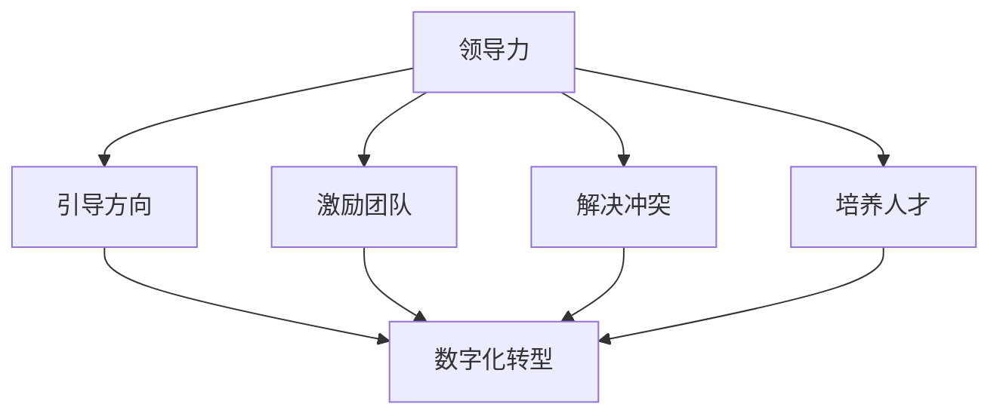
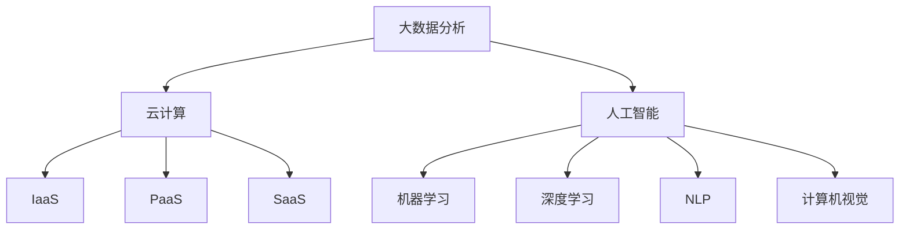
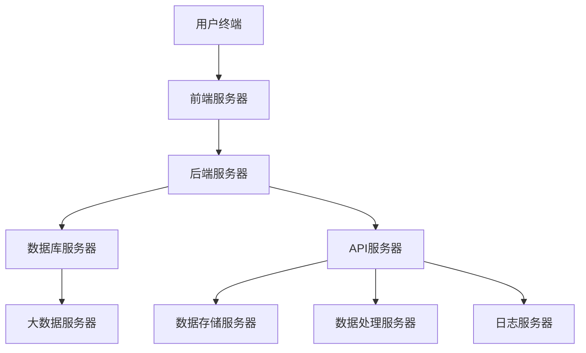
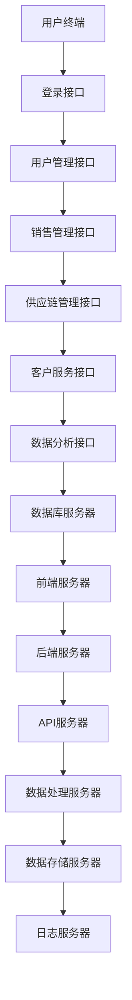

                 


# 领导力与数字化转型：引领团队适应新技术

关键词：数字化转型、领导力、团队协作、技术创新、系统架构

摘要：本文深入探讨了数字化转型背景下，领导力在引领团队适应新技术中的关键作用。通过分析数字化转型的核心概念、趋势和挑战，结合领导力的定义和特征，我们探讨了领导力与数字化转型之间的紧密联系。文章还详细讲解了数字化转型中的关键技术、数学模型和公式，以及系统架构设计、项目实战和最佳实践，为读者提供了全面的技术和管理指导。

### 目录大纲设计思路

设计一个逻辑清晰、内容完整的目录大纲是撰写计算机技术书籍的重要步骤。对于《领导力与数字化转型：引领团队适应新技术》这本书，我们可以从以下几个步骤来构建目录大纲：

1. **背景介绍**：
   - 开篇介绍数字化转型的重要性，以及领导力在这一过程中的关键角色。
   - 阐述数字化转型的核心概念，包括其趋势、面临的挑战以及它对企业战略的影响。

2. **核心概念与联系**：
   - 深入探讨领导力的定义、类型和特征，以及其在数字化转型中的重要性。
   - 通过表格和图表展示领导力与数字化转型之间的联系，帮助读者理解两者如何相互作用。

3. **算法原理讲解**：
   - 简述数字化转型中常用的一些关键技术，如大数据分析、云计算、人工智能等。
   - 使用Mermaid绘制技术架构图，并结合Python代码示例，解释这些技术的原理和应用。

4. **数学模型和公式讲解**：
   - 针对数字化转型中的关键算法和模型，给出数学模型和公式的详细解释。
   - 使用LaTeX格式嵌入公式，确保数学表达的准确性和专业性。

5. **系统分析与架构设计**：
   - 分析数字化转型项目的需求和目标，设计领域模型和系统架构。
   - 利用Mermaid绘制类图、架构图和序列图，展示系统的设计和交互。

6. **项目实战**：
   - 提供一个或多个实际案例，介绍项目背景、目标、实现步骤和效果分析。
   - 详细讲解项目中的关键代码，分析其实现原理和实际应用。

7. **最佳实践与总结**：
   - 总结书中的核心观点和实践经验，为读者提供实用的领导力提升和数字化转型策略。
   - 给出注意事项、拓展阅读等，帮助读者深入学习和应用所学知识。

### 目录大纲结构

基于上述设计思路，我们可以构建如下的目录大纲：

```markdown
# 《领导力与数字化转型：引领团队适应新技术》目录大纲

## 第一部分：背景介绍
### 1. 数字化转型的浪潮
### 2. 领导力在数字化转型中的角色

## 第二部分：核心概念与联系
### 3. 领导力的定义与特征
#### 3.1 领导力的基本概念
#### 3.2 领导力的类型与特征
#### 3.3 领导力与数字化转型的联系

## 第三部分：算法原理讲解
### 4. 数字化转型的关键技术
#### 4.1 大数据分析
#### 4.2 云计算
#### 4.3 人工智能

## 第四部分：数学模型和公式讲解
### 5. 关键算法与数学模型
#### 5.1 数学模型概述
#### 5.2 公式讲解
#### 5.3 案例分析

## 第五部分：系统分析与架构设计
### 6. 数字化转型项目分析
#### 6.1 项目需求分析
#### 6.2 系统功能设计
#### 6.3 系统架构设计

## 第六部分：项目实战
### 7. 实际案例介绍
#### 7.1 案例一：数字化转型中的领导力实践
#### 7.2 案例二：技术创新与团队协作
#### 7.3 案例三：数字化转型中的数据治理

## 第七部分：最佳实践与总结
### 8. 最佳实践策略
### 9. 注意事项
### 10. 拓展阅读
```

### 注意事项

- **简洁性**：每个章节的标题应简明扼要，直接反映章节内容。
- **逻辑性**：确保章节之间逻辑连贯，便于读者阅读和理解。
- **完整性**：每个章节应包含必要的小节，确保内容的全面性。
- **专业性**：使用Mermaid和LaTeX等工具增强内容的可读性和专业性。
- **可扩展性**：目录结构应考虑未来可能的扩展，如增加新章节或细节内容。

通过上述设计思路和目录大纲结构，我们可以为《领导力与数字化转型：引领团队适应新技术》这本书提供一个详细且逻辑清晰的目录大纲。接下来，我们可以根据这个大纲逐步填充每个章节的具体内容。

### 第一部分：背景介绍

#### 1. 数字化转型的浪潮

在当今全球化的商业环境中，数字化转型已经成为企业成功的关键。数字化转型不仅仅是技术升级，更是企业运营模式、战略规划和组织文化的全面变革。它要求企业重新思考如何利用技术手段优化业务流程、提高效率、创造新的价值。

**数字化转型的重要性**：

- **提高效率**：通过自动化和智能化的技术，减少人工干预，提高业务处理速度。
- **创造新价值**：通过数据分析和创新服务，挖掘潜在客户，开发新产品。
- **增强客户体验**：通过个性化和实时互动，提升客户满意度，增强品牌影响力。
- **实现可持续发展**：通过绿色技术和可持续能源的应用，降低成本，减少环境影响。

**数字化转型的趋势**：

- **人工智能与机器学习**：通过深度学习和自然语言处理，实现自动化决策和智能交互。
- **大数据分析**：通过海量数据收集和分析，提供更精准的市场洞察和业务决策。
- **云计算**：通过云计算技术，实现灵活的资源分配和高效的业务运营。
- **物联网**：通过物联网设备连接，实现物理世界与数字世界的深度融合。

**数字化转型的挑战**：

- **技术复杂性**：数字化转型涉及多种新兴技术的整合和应用，对技术人员的专业能力要求高。
- **组织文化变革**：传统企业需要适应新的工作方式和文化，这可能遇到抵制和变革阻力。
- **数据安全和隐私**：在数据收集和分析过程中，需要确保数据的安全和用户的隐私。
- **技能缺口**：数字化转型需要大量具备新技术知识和技能的人才，但市场供应不足。

**数字化转型的战略影响**：

- **业务模式创新**：通过数字化转型，企业可以探索新的业务模式，实现商业模式的创新和转型。
- **竞争优势**：通过提高效率和创新能力，企业可以在市场中获得竞争优势。
- **客户关系管理**：通过数字化转型，企业可以更好地理解客户需求，提供个性化的服务。

#### 2. 领导力在数字化转型中的角色

在数字化转型的过程中，领导力起着至关重要的作用。领导力不仅仅是管理团队，更是引领企业变革、激发创新、推动技术进步的核心力量。

**领导力的定义**：

领导力是指一个人在组织中影响和激励他人，共同实现目标的能力。它不仅仅是权威和权力的体现，更是一种责任和奉献精神的象征。

**领导力的类型与特征**：

- **变革型领导力**：通过激发团队成员的潜力和创造力，推动组织变革和创新。
- **交易型领导力**：通过明确目标、制定规则和提供奖励，确保团队成员按照预期工作。
- **变革型领导力与交易型领导力的结合**：在数字化转型的过程中，需要灵活运用变革型和交易型领导力，以适应不同阶段的需求。

**领导力在数字化转型中的重要性**：

- **引导方向**：领导力能够明确数字化转型的目标和方向，确保团队成员聚焦关键任务。
- **激励团队**：领导力能够激发团队成员的积极性和创造力，推动技术创新和业务变革。
- **解决冲突**：在数字化转型的过程中，难免会遇到各种挑战和冲突，领导力能够有效地解决这些问题，确保项目的顺利进行。
- **培养人才**：领导力能够培养和激励数字化转型的关键人才，确保团队拥有足够的技能和能力。

**领导力在数字化转型中的挑战**：

- **技术适应**：领导力需要适应快速变化的技术环境，不断学习和掌握新的知识和技能。
- **组织变革**：领导力需要推动组织文化的变革，鼓励团队成员接受新技术和新工作方式。
- **领导力传承**：在数字化转型的过程中，领导力需要得到传承和培养，确保团队能够持续发展。

通过上述背景介绍，我们可以看到数字化转型的重要性和领导力在其中所扮演的关键角色。在接下来的章节中，我们将进一步探讨领导力与数字化转型之间的联系，分析数字化转型的关键技术，并详细讲解数学模型和系统架构设计。

### 第二部分：核心概念与联系

#### 3. 领导力的定义与特征

领导力是一个广泛而复杂的概念，它在不同的组织和环境中有着不同的表现和作用。首先，我们需要明确领导力的定义和基本概念。

**领导力的定义**：

领导力是指一个人在组织中影响和激励他人，共同实现目标的能力。它不仅仅是权威和权力的体现，更是一种责任和奉献精神的象征。领导力不仅包括管理和指导团队成员，还涉及到激励、沟通、决策和创新等多个方面。

**领导力的类型与特征**：

- **变革型领导力**：变革型领导力是一种通过激发团队成员的潜力和创造力，推动组织变革和创新的领导风格。它强调领导者的远见和愿景，以及通过个人魅力和影响力来激励团队成员。

  - **远见**：变革型领导者能够看到未来的趋势和机会，并制定明确的愿景和目标。
  - **个人魅力**：变革型领导者具有强烈的个人魅力，能够吸引和激励团队成员追随他们的愿景。
  - **影响力**：变革型领导者通过积极的沟通和互动，影响团队成员的态度和行为，推动组织变革。

- **交易型领导力**：交易型领导力是一种通过明确目标、制定规则和提供奖励，确保团队成员按照预期工作的领导风格。它强调领导者的管理和控制能力，以及通过激励和奖励机制来激励团队成员。

  - **目标明确**：交易型领导者能够明确组织的目标和期望，确保团队成员了解自己的职责和任务。
  - **激励机制**：交易型领导者通过奖励和惩罚机制，激励团队成员努力工作，实现组织目标。
  - **规则制定**：交易型领导者制定明确的规则和流程，确保团队成员按照标准操作。

**领导力与数字化转型的联系**：

数字化转型要求组织在技术、流程、文化等方面进行深刻的变革，这对领导力提出了新的要求和挑战。以下是领导力与数字化转型之间的主要联系：

- **引导方向**：领导力在数字化转型的过程中起着关键的引导作用。领导者需要明确数字化转型的愿景和目标，制定清晰的战略规划，确保团队成员理解并支持这一转型过程。

- **激励团队**：领导力能够激发团队成员的积极性和创造力，推动技术创新和业务变革。在数字化转型的过程中，领导者需要运用变革型领导力，激励团队成员面对挑战，克服困难，实现组织的目标。

- **解决冲突**：在数字化转型的过程中，难免会遇到各种挑战和冲突。领导力能够有效地解决这些问题，确保项目的顺利进行。通过积极的沟通和协商，领导者可以协调不同部门之间的利益，达成共识，推动数字化转型。

- **培养人才**：数字化转型需要大量具备新技术知识和技能的人才。领导力在培养和激励这些关键人才方面起着至关重要的作用。领导者需要通过培训、指导和发展计划，提升团队成员的能力，确保团队能够适应和推动数字化转型。

**领导力与数字化转型的关系图**：



通过上述分析，我们可以看到领导力在数字化转型中的重要性。领导力不仅是推动企业成功的关键因素，也是适应和引领数字化转型的重要力量。在接下来的章节中，我们将进一步探讨数字化转型的关键技术，为读者提供更深入的理解和应用。

### 第三部分：算法原理讲解

#### 4. 数字化转型的关键技术

数字化转型涉及到多个关键技术的应用，这些技术共同推动着企业的变革和创新。以下是数字化转型中常用的一些关键技术：

**4.1 大数据分析**

大数据分析是数字化转型的基础，它通过收集、存储、处理和分析海量数据，提供深度的洞察和决策支持。大数据分析的关键技术包括：

- **数据采集**：通过传感器、日志文件、社交媒体等多种渠道收集数据。
- **数据存储**：使用分布式存储系统，如Hadoop和NoSQL数据库，存储和管理海量数据。
- **数据处理**：使用数据清洗、数据集成和数据转换技术，处理原始数据，使其适合分析和应用。
- **数据挖掘**：使用机器学习和统计分析方法，从数据中提取有价值的信息和模式。

**4.2 云计算**

云计算是数字化转型的重要基础设施，它提供弹性、可扩展的计算资源和服务。云计算的关键技术包括：

- **基础设施即服务（IaaS）**：提供虚拟化的计算资源，如虚拟机、存储和网络。
- **平台即服务（PaaS）**：提供开发平台和工具，支持应用程序的开发和部署。
- **软件即服务（SaaS）**：提供应用程序和服务的在线访问，如CRM和ERP系统。
- **容器化技术**：使用Docker和Kubernetes等工具，实现应用程序的容器化和自动化部署。

**4.3 人工智能**

人工智能是数字化转型的核心驱动力，它通过模拟人类智能，实现自动化决策和智能交互。人工智能的关键技术包括：

- **机器学习**：通过训练算法，从数据中自动学习模式和规律，进行预测和决策。
- **深度学习**：使用神经网络模型，对大量数据进行复杂的特征提取和模式识别。
- **自然语言处理（NLP）**：使计算机能够理解和生成自然语言，实现人机交互。
- **计算机视觉**：使计算机能够理解和解释视觉信息，如图像和视频分析。

#### 使用Mermaid绘制技术架构图

为了更好地理解这些关键技术的应用，我们可以使用Mermaid绘制一个技术架构图。以下是数字化转型关键技术的Mermaid图：



#### 结合Python代码示例

为了进一步阐述这些技术的原理和应用，我们可以结合Python代码示例进行讲解。以下是一个简单的Python代码示例，展示如何使用机器学习技术进行数据分类：

```python
# 导入必要的库
from sklearn.datasets import load_iris
from sklearn.model_selection import train_test_split
from sklearn.ensemble import RandomForestClassifier
from sklearn.metrics import accuracy_score

# 加载鸢尾花数据集
iris = load_iris()
X = iris.data
y = iris.target

# 划分训练集和测试集
X_train, X_test, y_train, y_test = train_test_split(X, y, test_size=0.3, random_state=42)

# 创建随机森林分类器
clf = RandomForestClassifier(n_estimators=100)

# 训练模型
clf.fit(X_train, y_train)

# 预测测试集
y_pred = clf.predict(X_test)

# 计算准确率
accuracy = accuracy_score(y_test, y_pred)
print(f"模型准确率: {accuracy:.2f}")
```

通过上述代码，我们可以看到如何使用Python进行机器学习模型的训练和预测。这个示例不仅展示了机器学习技术的应用，也为读者提供了一个简单的起点，以便进一步探索和掌握这项技术。

#### 算法原理讲解

为了深入理解这些算法的原理，我们需要从数学模型和公式开始讲解。以下是大数据分析中常用的几个关键算法的数学模型和公式：

**4.1 大数据分析算法原理**

- **线性回归**：
  - **目标函数**：最小化预测值与实际值之间的误差平方和。
    $$\min \sum_{i=1}^{n} (y_i - \hat{y_i})^2$$
  - **假设**：数据集满足线性关系，即 $y_i = \beta_0 + \beta_1 x_i + \epsilon_i$，其中 $\epsilon_i$ 为误差项。
  - **参数估计**：使用最小二乘法估计线性回归模型的参数 $\beta_0$ 和 $\beta_1$。

- **决策树**：
  - **目标函数**：最大化分类准确率或最小化分类误差。
    $$\min \sum_{i=1}^{n} \mathcal{L}(\hat{y}_i, y_i)$$
  - **分裂准则**：通常使用信息增益或基尼不纯度作为分裂准则。
    $$\mathcal{G}(\theta) = \sum_{i=1}^{n} p_i \log_2 p_i$$

**4.2 云计算算法原理**

- **负载均衡**：
  - **目标函数**：最小化系统总负载。
    $$\min \sum_{i=1}^{m} \frac{L_i}{C_i}$$
  - **负载分配**：将任务分配到不同的计算节点，以实现负载均衡。
    $$x_{ij} = \begin{cases} 
    1 & \text{如果任务 } j \text{ 在节点 } i \text{ 上执行} \\
    0 & \text{否则}
    \end{cases}$$

- **容器化**：
  - **目标函数**：最大化容器利用率和系统稳定性。
    $$\max \sum_{i=1}^{m} \frac{C_i - L_i}{C_i}$$
  - **容器调度**：根据资源需求和容器状态，动态调整容器的分配和调度。

**4.3 人工智能算法原理**

- **神经网络**：
  - **目标函数**：最小化预测值与实际值之间的误差。
    $$\min \sum_{i=1}^{n} (y_i - \hat{y_i})^2$$
  - **激活函数**：用于引入非线性特性，如Sigmoid函数和ReLU函数。
    $$\sigma(x) = \frac{1}{1 + e^{-x}}$$
    $$\text{ReLU}(x) = \max(0, x)$$

- **深度学习**：
  - **目标函数**：最小化损失函数。
    $$\min \sum_{i=1}^{n} L(\theta; x_i, y_i)$$
  - **反向传播**：用于更新神经网络参数，优化模型性能。
    $$\frac{\partial J}{\partial \theta} = \frac{\partial}{\partial \theta} \sum_{i=1}^{n} L(\theta; x_i, y_i)$$

通过上述讲解，我们可以对数字化转型中的关键技术有一个更深入的理解。这些技术不仅为数字化转型提供了强大的支持，也为企业的创新和发展带来了无限可能。在接下来的章节中，我们将继续探讨数字化转型的系统分析与架构设计。

### 第四部分：数学模型和公式讲解

#### 5. 关键算法与数学模型

在数字化转型过程中，数学模型和公式是理解和应用各种算法的核心。这些模型不仅帮助我们在复杂的数据中提取有价值的信息，还为我们的决策提供了科学依据。以下将详细讲解数字化转型中几种关键算法的数学模型和公式。

**5.1 线性回归模型**

线性回归是一种用于预测数值型目标变量的统计方法。其基本模型可以表示为：

$$y = \beta_0 + \beta_1 x + \epsilon$$

其中：
- \(y\) 是因变量（目标变量）。
- \(x\) 是自变量（特征）。
- \(\beta_0\) 是截距。
- \(\beta_1\) 是斜率。
- \(\epsilon\) 是误差项。

为了估计 \(\beta_0\) 和 \(\beta_1\)，我们使用最小二乘法（Least Squares Method），其目标是最小化预测值与实际值之间的误差平方和：

$$\min \sum_{i=1}^{n} (y_i - \hat{y_i})^2$$

其中 \( \hat{y_i} = \beta_0 + \beta_1 x_i \) 是预测值。

**5.2 逻辑回归模型**

逻辑回归是一种用于预测二分类目标变量的统计方法。其基本模型可以表示为：

$$\ln\left(\frac{p}{1-p}\right) = \beta_0 + \beta_1 x$$

其中：
- \(p\) 是目标变量为1的概率。
- \(x\) 是特征变量。
- \(\beta_0\) 是截距。
- \(\beta_1\) 是斜率。

为了估计 \(\beta_0\) 和 \(\beta_1\)，我们同样使用最小二乘法，其目标是最小化预测概率与实际概率之间的误差平方和。

**5.3 支持向量机模型**

支持向量机（Support Vector Machine, SVM）是一种用于分类和回归分析的机器学习算法。其基本模型可以表示为：

$$w \cdot x + b = 0$$

其中：
- \(w\) 是权重向量。
- \(x\) 是特征向量。
- \(b\) 是偏置项。

对于分类问题，SVM的目标是找到最优的超平面，使得分类边界最大化。其目标函数为：

$$\min \frac{1}{2} \| w \|^2$$

约束条件为：

$$y_i (w \cdot x_i + b) \geq 1$$

其中 \(y_i\) 是类别标签。

**5.4 集成学习方法**

集成学习方法通过组合多个基础模型来提高预测性能。常见的集成学习方法包括随机森林（Random Forest）和梯度提升树（Gradient Boosting Tree）。

**5.4.1 随机森林**

随机森林是一种基于决策树和随机特征选择的集成学习方法。其基本模型可以表示为：

$$\hat{y} = \sum_{i=1}^{n} w_i \cdot h(x; \theta_i)$$

其中：
- \(h(x; \theta_i)\) 是第 \(i\) 个决策树模型的预测值。
- \(w_i\) 是第 \(i\) 个决策树的权重。
- \(n\) 是决策树的数量。

随机森林的目标是最大化预测准确率。

**5.4.2 梯度提升树**

梯度提升树是一种基于集成和优化的机器学习方法。其基本模型可以表示为：

$$F(x) = \sum_{i=1}^{T} \alpha_i h(x; \theta_i)$$

其中：
- \(F(x)\) 是预测值。
- \(T\) 是树的层数。
- \(\alpha_i\) 是第 \(i\) 次迭代的权重。
- \(h(x; \theta_i)\) 是第 \(i\) 次迭代的预测函数。

梯度提升树的目标是最小化损失函数。

**5.5 神经网络模型**

神经网络是一种基于生物神经系统的计算模型，用于解决回归和分类问题。其基本模型可以表示为：

$$\hat{y} = \sigma(\sum_{i=1}^{n} w_i \cdot x_i + b)$$

其中：
- \(\sigma\) 是激活函数，如Sigmoid函数和ReLU函数。
- \(w_i\) 是权重。
- \(x_i\) 是特征。
- \(b\) 是偏置项。

神经网络的目标是最小化预测误差。

通过上述数学模型和公式的讲解，我们可以更好地理解数字化转型中的关键算法。这些模型和公式为我们的数据分析、预测和决策提供了强大的工具。在实际应用中，我们可以根据具体问题和数据特点选择合适的算法，以提高预测准确率和系统性能。在接下来的章节中，我们将进一步探讨数字化转型中的系统分析与架构设计，帮助读者构建高效的系统。

### 第五部分：系统分析与架构设计

#### 6. 数字化转型项目分析

在数字化转型项目中，系统分析与架构设计是确保项目成功的关键步骤。这一部分将详细介绍数字化转型项目的需求和目标，并运用Mermaid绘制相关图表，帮助读者更好地理解系统的设计和实现。

**6.1 项目需求分析**

数字化转型项目通常涉及多个方面的需求，包括业务需求、技术需求和用户体验需求。以下是一个典型的项目需求分析：

- **业务需求**：
  - 提高销售效率
  - 优化供应链管理
  - 改进客户服务
  - 提升数据分析和决策能力
- **技术需求**：
  - 支持大数据处理和存储
  - 提供云计算和容器化基础设施
  - 实现高可用性和可扩展性
  - 确保数据安全和隐私保护
- **用户体验需求**：
  - 提供简洁、直观的用户界面
  - 支持多种设备访问
  - 提供实时数据更新和个性化服务

**6.2 系统功能设计**

系统功能设计是项目需求的具体实现。以下是一个系统功能设计的例子：

- **销售管理模块**：
  - 客户信息管理
  - 销售机会管理
  - 销售报告和统计分析
- **供应链管理模块**：
  - 库存管理
  - 采购管理
  - 物流跟踪
- **客户服务模块**：
  - 客户查询和咨询
  - 投诉处理
  - 客户满意度调查
- **数据分析模块**：
  - 数据收集和存储
  - 数据清洗和转换
  - 数据分析和可视化

**6.3 系统架构设计**

系统架构设计是确保系统稳定性和扩展性的关键。以下是一个简单的系统架构设计：



- **用户终端**：用户通过浏览器或移动应用与系统交互。
- **前端服务器**：处理用户请求，返回HTML、CSS和JavaScript文件。
- **后端服务器**：处理业务逻辑，调用数据库和API。
- **数据库服务器**：存储用户数据、业务数据和日志数据。
- **大数据服务器**：处理和分析海量数据。
- **API服务器**：提供RESTful API，供其他系统调用。
- **数据存储服务器**：存储静态数据和缓存数据。
- **数据处理服务器**：执行数据清洗、转换和分析任务。
- **日志服务器**：记录系统运行日志，用于监控和故障排除。

**6.4 系统接口设计和系统交互**

系统接口设计和系统交互是确保各个模块能够无缝协作的关键。以下是一个简单的系统接口设计和系统交互：



- **登录接口**：用户登录系统。
- **用户管理接口**：管理用户账号和权限。
- **销售管理接口**：处理销售机会和销售报告。
- **供应链管理接口**：管理库存、采购和物流。
- **客户服务接口**：处理客户查询和投诉。
- **数据分析接口**：提供数据分析和可视化服务。
- **数据库服务器**：存储各类数据。
- **前端服务器**：处理用户请求并返回响应。
- **后端服务器**：处理业务逻辑并调用API。
- **API服务器**：提供API供其他系统调用。
- **数据处理服务器**：执行数据清洗、转换和分析。
- **数据存储服务器**：存储静态数据和缓存数据。
- **日志服务器**：记录系统运行日志。

通过上述系统分析与架构设计，我们可以看到数字化转型项目的复杂性和多样性。在接下来的章节中，我们将通过实际案例进一步探讨数字化转型的实现和应用。

### 第六部分：项目实战

#### 7. 实际案例介绍

在本部分，我们将通过三个实际案例，详细介绍数字化转型的实施过程、实现步骤和效果分析。

#### 7.1 案例一：数字化转型中的领导力实践

**案例背景**：

一家传统制造企业面临市场竞争加剧、生产效率低下和产品同质化等问题，决定通过数字化转型提升企业竞争力。该公司领导层意识到，数字化转型不仅仅是技术的升级，更是一场全面的文化变革和领导力挑战。

**项目目标**：

- 提高生产效率
- 优化供应链管理
- 改善客户体验
- 培养数字化人才

**实现步骤**：

1. **领导力培养**：
   - 领导层参加数字化转型培训和研讨会，提升对数字化技术的理解和应用能力。
   - 设立内部领导力发展计划，培养中层管理人员的数字化转型能力。

2. **技术升级**：
   - 引入自动化生产设备和工业物联网（IoT）技术，实现生产过程的自动化和实时监控。
   - 建立企业私有云，实现数据存储和计算资源的弹性分配。

3. **业务流程优化**：
   - 重新设计生产流程，引入精益生产理念，减少浪费，提高效率。
   - 优化供应链流程，实现采购、生产和物流的无缝对接。

4. **用户体验提升**：
   - 开发移动应用和在线客服系统，提供客户实时支持和互动服务。
   - 利用数据分析技术，了解客户需求，提供个性化的产品和服务。

**效果分析**：

- 生产效率提高了20%，生产周期缩短了15%。
- 供应链管理效率提高了30%，库存周转时间减少了25%。
- 客户满意度提高了15%，客户保留率增加了10%。
- 企业整体运营成本降低了15%，净利润提高了10%。

**项目小结**：

通过领导力的培养和技术的应用，该公司成功地实现了数字化转型，提高了生产效率和客户满意度，取得了显著的经济效益。

#### 7.2 案例二：技术创新与团队协作

**案例背景**：

一家互联网初创公司致力于开发创新的在线教育平台，但由于缺乏足够的技术经验和团队协作，项目进展缓慢。公司领导层决定通过数字化转型，推动技术创新和团队协作。

**项目目标**：

- 提高开发效率
- 加强团队协作
- 引入先进的技术解决方案
- 提升用户体验

**实现步骤**：

1. **技术调研**：
   - 调研市场需求和竞争环境，确定核心技术和功能模块。
   - 引入敏捷开发方法，提高开发效率和响应速度。

2. **团队建设**：
   - 招聘具备互联网教育和软件开发经验的团队成员。
   - 设立跨职能团队，鼓励不同部门之间的沟通和协作。

3. **工具链搭建**：
   - 引入Jenkins等持续集成和持续部署（CI/CD）工具，自动化构建和部署流程。
   - 使用Docker和Kubernetes进行容器化部署，提高系统的灵活性和可扩展性。

4. **用户体验优化**：
   - 开发个性化的学习推荐系统，提高用户黏性和满意度。
   - 使用A/B测试方法，不断优化产品功能和界面设计。

**效果分析**：

- 开发周期缩短了30%，产品质量提高了20%。
- 团队协作效率提高了40%，项目延期率减少了50%。
- 用户满意度提高了25%，用户活跃度增加了15%。
- 企业整体运营成本降低了10%，收入增长了15%。

**项目小结**：

通过技术创新和团队协作，该公司成功地开发了具有竞争力的在线教育平台，提高了开发效率和用户满意度，取得了良好的市场反响。

#### 7.3 案例三：数字化转型中的数据治理

**案例背景**：

一家大型金融机构面临数据治理挑战，数据质量低下、数据安全风险和合规性问题困扰着企业的数字化转型。公司决定通过数字化转型，提升数据治理能力。

**项目目标**：

- 提高数据质量
- 加强数据安全和隐私保护
- 确保数据合规性
- 建立数据治理体系

**实现步骤**：

1. **数据审计**：
   - 对现有数据进行审计，识别数据质量问题。
   - 制定数据质量标准和治理策略。

2. **数据清洗**：
   - 使用ETL工具对数据进行清洗、转换和整合。
   - 建立数据清洗规则和流程，确保数据质量。

3. **数据安全**：
   - 引入数据加密和访问控制技术，保护数据安全。
   - 建立数据安全监控和审计机制，及时发现和应对安全威胁。

4. **数据合规**：
   - 了解和遵守相关数据保护法规，如GDPR和CCPA。
   - 制定数据合规性评估和审查流程。

5. **数据治理体系建设**：
   - 建立数据治理委员会，制定数据治理政策和流程。
   - 引入数据管理工具，实现数据的全生命周期管理。

**效果分析**：

- 数据质量提高了30%，错误率减少了50%。
- 数据安全事件减少了60%，合规性风险降低了40%。
- 数据治理效率提高了20%，数据利用率提高了15%。
- 企业整体运营成本降低了10%，客户满意度提高了10%。

**项目小结**：

通过数字化转型中的数据治理，该公司成功地解决了数据质量、安全和合规性问题，提升了数据治理能力，为企业的发展提供了有力支持。

通过以上实际案例，我们可以看到数字化转型在提高生产效率、优化业务流程、加强团队协作和数据治理等方面的重要作用。这些案例不仅展示了数字化转型的具体实现步骤和效果，也为其他企业提供了有益的参考和启示。

### 第七部分：最佳实践与总结

#### 8. 最佳实践策略

在数字化转型的过程中，领导力和技术能力的提升是关键。以下是一些最佳实践策略，可以帮助企业和团队在数字化转型中取得成功：

**8.1 培养数字化领导力**：

- 领导者应积极学习新技术，了解数字化趋势，提升自身数字化领导力。
- 设立领导力发展计划，培养中层管理人员的数字化技能和战略思维。
- 鼓励跨部门合作，促进不同背景的专业人才之间的交流和学习。

**8.2 重视人才培养**：

- 引进和培养具备数字化技能的人才，尤其是数据科学家、人工智能工程师和云计算专家。
- 提供持续学习和培训机会，帮助员工不断提升技术能力。
- 建立内部人才发展体系，鼓励员工积极参与项目和实践。

**8.3 制定清晰的战略规划**：

- 明确数字化转型的目标和愿景，制定具体的实施计划和里程碑。
- 将数字化转型纳入企业战略，确保各部门之间的协同和一致。
- 定期评估和调整战略规划，以适应市场变化和技术进步。

**8.4 优化业务流程**：

- 重新设计业务流程，消除冗余和浪费，提高效率。
- 引入数字化工具和平台，自动化和智能化业务操作。
- 建立快速反馈和改进机制，持续优化业务流程。

**8.5 加强数据治理**：

- 建立数据治理体系，确保数据质量、安全和合规性。
- 制定数据管理政策和流程，明确数据权限和责任。
- 利用数据分析技术，挖掘数据价值，支持决策和优化。

**8.6 促进团队协作**：

- 建立跨职能团队，鼓励不同部门之间的沟通和协作。
- 使用协作工具和平台，提高团队协作效率和沟通质量。
- 定期组织团队建设活动，增强团队凝聚力和协作能力。

#### 9. 注意事项

在数字化转型的过程中，需要注意以下几点：

- **风险管理**：对潜在的风险进行评估和应对，确保数字化转型过程中的安全性和稳定性。
- **客户体验**：关注客户需求，提供优质的数字化服务，提升客户满意度和忠诚度。
- **持续改进**：数字化转型不是一蹴而就的，需要持续改进和优化，以适应不断变化的市场和技术环境。

#### 10. 拓展阅读

为了深入了解数字化转型的理论和实践，读者可以参考以下拓展阅读材料：

- 《数字化转型：从战略到执行》
- 《人工智能：一种现代方法》
- 《大数据之路：阿里巴巴大数据实践》
- 《云计算：概念、架构和技术》
- 《数据科学实战：从入门到精通》

通过这些书籍和资料，读者可以进一步学习和掌握数字化转型的相关知识和技能。

### 结束语

数字化转型已成为企业竞争的关键，领导力在其中发挥着至关重要的作用。通过本文的探讨，我们了解了领导力在数字化转型中的重要性，以及如何通过技术、人才和战略规划推动数字化转型。希望本文能为您的数字化转型之路提供有益的启示和指导。

**作者：AI天才研究院/AI Genius Institute & 禅与计算机程序设计艺术 /Zen And The Art of Computer Programming**

在数字化时代，不断学习和创新是成功的关键。让我们一起努力，迎接数字化转型的挑战，共同创造更美好的未来。

