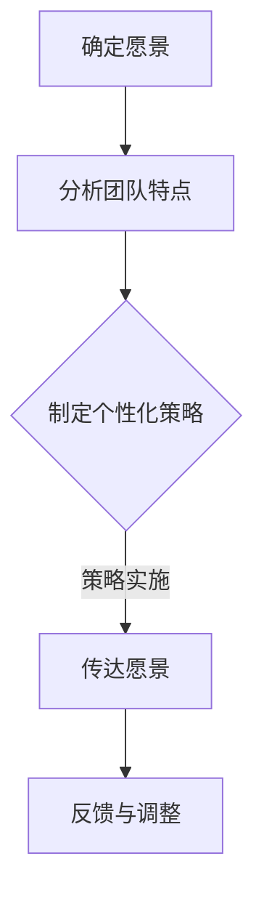
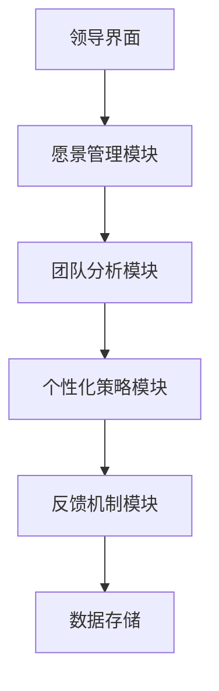
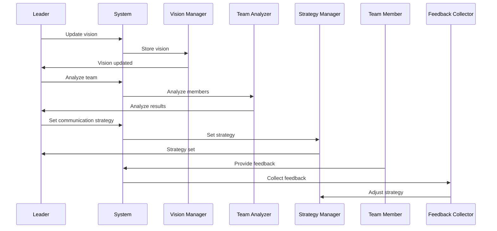

                 


## 领导力与沟通艺术：传达愿景的能力

### 关键词
- 领导力
- 沟通艺术
- 愿景传达
- 团队激励
- 持续发展

### 摘要
本文深入探讨领导力与沟通艺术的融合，特别是传达愿景的能力。通过剖析领导力的核心原则、沟通艺术的基础技巧，以及传达愿景的策略，文章旨在为IT领域的领导者提供一套实用的指导框架，以实现团队的高效协同和组织的持续成长。

## 目录大纲

### 第一部分：领导力基础
- **第1章 领导力概述**
  - 1.1 领导力的定义与类型
  - 1.2 领导力的重要性
  - 1.3 个人与组织的领导力需求

- **第2章 领导力的核心原则**
  - 2.1 领导力的价值观
  - 2.2 领导力的心理学基础
  - 2.3 领导力的道德与社会责任

### 第二部分：沟通艺术
- **第3章 沟通的基础**
  - 3.1 沟通的定义与模型
  - 3.2 有效沟通的要素
  - 3.3 沟通的障碍与克服方法

- **第4章 沟通技巧**
  - 4.1 听说读写技巧
  - 4.2 非语言沟通
  - 4.3 情绪智能在沟通中的应用

- **第5章 团队沟通**
  - 5.1 团队沟通的重要性
  - 5.2 团队沟通的障碍
  - 5.3 高效团队沟通的策略

### 第三部分：传达愿景的能力
- **第6章 愿景的重要性**
  - 6.1 愿景的定义与作用
  - 6.2 愿景与目标的关系
  - 6.3 个人愿景与组织愿景

- **第7章 传达愿景的策略**
  - 7.1 个性化沟通策略
  - 7.2 情境领导力
  - 7.3 激励与授权

- **第8章 愿景的实践与评估**
  - 8.1 实践愿景的方法
  - 8.2 评估愿景的影响
  - 8.3 持续改进与反馈

### 附录与参考文献

---

## 背景介绍

### 核心概念术语说明
- **领导力**：在组织或团队中，通过影响他人来实现共同目标的能力。
- **沟通艺术**：在人际交往中，通过语言、非语言和情绪表达来传递信息的技巧。
- **愿景**：组织或个人期望达到的长期目标，为团队提供方向和动力。

### 问题背景
在现代信息技术领域，随着项目复杂度的增加和团队成员多样性的提升，领导者需要具备卓越的领导力和沟通能力，以便有效地传达愿景，激励团队，推动项目成功。

### 问题描述
领导者在传达愿景时可能面临以下问题：
1. 愿景不够清晰，团队成员难以理解。
2. 沟通技巧不足，导致信息传递偏差。
3. 缺乏情境领导力，无法根据团队成员的特点进行有效激励。

### 问题解决
通过掌握领导力的核心原则、沟通艺术的基础技巧，以及传达愿景的策略，领导者可以解决上述问题，实现高效的团队协作和项目的成功。

### 边界与外延
- 领导力不仅限于组织内部，也适用于个人发展。
- 沟通艺术涵盖了多种沟通方式和情境。
- 愿景的传达需要根据团队成员的特点和情境进行个性化调整。

### 概念结构与核心要素组成
- **领导力**：价值观、心理学基础、道德与社会责任。
- **沟通艺术**：基础定义与模型、要素、技巧、障碍与克服方法。
- **愿景传达**：定义、作用、与目标的关系、个性化策略、情境领导力、激励与授权。

---

## 核心概念与联系

### 核心概念原理

领导力、沟通艺术和愿景传达是三位一体的，它们相互依赖，共同推动组织的发展。

- **领导力**：领导者通过影响他人，将愿景转化为具体的行动和目标。
- **沟通艺术**：领导者通过有效的沟通，确保团队成员理解并支持愿景。
- **愿景传达**：领导者需要将愿景清晰、准确地传达给团队成员。

### 概念属性特征对比表格

| 特征         | 领导力 | 沟通艺术 | 愿景传达 |
| ------------ | ------- | --------- | -------- |
| 定义         | 影响他人实现目标 | 传递信息 | 长期目标 |
| 目标         | 成功领导团队 | 有效沟通 | 愿景实现 |
| 方式         | 影响、激励、引导 | 语言、非语言、情绪表达 | 口头、书面、互动 |
| 关系         | 与团队、组织 | 与他人 | 与未来 |
| 影响范围     | 组织内部 | 组织内部 | 组织外部 |

### ER实体关系图架构

```mermaid
erDiagram
  A[领导力] ||--|{ B[沟通艺术] } | B
  A ||--|{ C[愿景传达] } | C
```

在ER图（实体关系图）中，领导力作为核心实体，与沟通艺术和愿景传达形成关联，共同构建一个有效的领导框架。

---

## 算法原理讲解

### 算法mermaid流程图



### 算法原理

领导力与沟通艺术的融合，核心在于“个性化策略”的实施，以下为详细讲解：

1. **确定愿景**：愿景是团队追求的长期目标，需要明确且具有吸引力。
2. **分析团队特点**：了解团队成员的能力、需求和期望，为个性化策略提供基础。
3. **制定个性化策略**：根据团队特点，制定适应不同成员的沟通和激励策略。
4. **传达愿景**：采用个性化策略，将愿景清晰传达给团队成员。
5. **反馈与调整**：收集团队成员的反馈，根据实际情况调整沟通和激励策略。

### 算法原理的数学模型和公式

$$
\text{愿景传达效率} = f(\text{愿景清晰度}, \text{团队适应性}, \text{沟通效果})
$$

- **愿景清晰度**：衡量愿景表述的明确性和具体性。
- **团队适应性**：衡量策略与团队成员特点的匹配度。
- **沟通效果**：衡量信息传递的准确性和有效性。

### 举例说明

假设一个IT团队正在开发一款新的软件产品，愿景是“打造市场上最具竞争力的产品”。领导者首先需要明确这个愿景，并分析团队成员的技术能力和期望。根据分析结果，领导者可以制定个性化的沟通策略，例如对于技术骨干，强调技术挑战和创新点；对于新成员，则强调团队文化和合作机会。通过这种个性化的策略，愿景得以清晰传达，团队成员也受到了有效激励。

---

## 系统分析与架构设计方案

### 问题场景介绍
在现代IT企业中，领导者的职责不仅仅是管理团队，还要确保团队朝着共同的目标前进。传达愿景是领导者的重要任务，它关系到团队的动力和执行力。

### 项目介绍
本项目旨在构建一个基于领导力与沟通艺术的IT团队管理系统，帮助领导者更有效地传达愿景，激励团队成员。

### 系统功能设计
- **愿景管理**：记录、更新和共享愿景。
- **团队分析**：分析团队成员的能力和期望。
- **个性化策略**：为团队成员制定适应其特点的沟通策略。
- **反馈机制**：收集团队成员的反馈，并自动调整沟通策略。

### 系统架构设计


### 系统接口设计
- **愿景管理接口**：允许领导者更新和共享愿景。
- **团队分析接口**：允许领导者分析团队成员的能力和期望。
- **个性化策略接口**：允许领导者制定和调整沟通策略。
- **反馈接口**：允许团队成员提供反馈。

### 系统交互mermaid序列图


---

## 项目实战

### 环境安装
1. 安装Python 3.8及以上版本。
2. 安装Django框架：`pip install django`
3. 创建Django项目：`django-admin startproject leadership_communication`
4. 进入项目目录：`cd leadership_communication`
5. 创建应用：`python manage.py startapp vision_management`

### 系统核心实现源代码

#### models.py
```python
from django.db import models

class Vision(models.Model):
    title = models.CharField(max_length=255)
    description = models.TextField()

class TeamMember(models.Model):
    name = models.CharField(max_length=255)
    role = models.CharField(max_length=255)
    expected_goals = models.TextField()

class CommunicationStrategy(models.Model):
    member = models.ForeignKey(TeamMember, on_delete=models.CASCADE)
    strategy = models.TextField()
```

#### views.py
```python
from django.shortcuts import render
from .models import Vision, TeamMember, CommunicationStrategy

def update_vision(request):
    if request.method == 'POST':
        title = request.POST['title']
        description = request.POST['description']
        Vision.objects.create(title=title, description=description)
    return render(request, 'update_vision.html')

def analyze_team(request):
    members = TeamMember.objects.all()
    return render(request, 'analyze_team.html', {'members': members})

def set_communication_strategy(request):
    if request.method == 'POST':
        member_id = request.POST['member_id']
        strategy = request.POST['strategy']
        member = TeamMember.objects.get(id=member_id)
        CommunicationStrategy.objects.create(member=member, strategy=strategy)
    return render(request, 'set_communication_strategy.html')
```

### 代码应用解读与分析

#### 愿景管理
- **功能**：允许领导者更新和共享愿景。
- **实现**：使用Django的ORM（对象关系映射）来创建、读取和更新愿景。

#### 团队分析
- **功能**：分析团队成员的能力和期望。
- **实现**：通过Django后台界面，领导者可以查看和编辑团队成员的信息。

#### 个性化策略
- **功能**：为团队成员制定适应其特点的沟通策略。
- **实现**：根据团队成员的期望，领导者可以设置个性化的沟通策略。

### 实际案例分析和详细讲解剖析

#### 案例一：更新愿景
- **场景**：领导者在一次团队会议后，决定更新团队的愿景。
- **操作**：在愿景管理页面，领导者输入新的愿景标题和描述，并提交。
- **结果**：系统更新愿景记录，所有团队成员可以通过内部通讯工具收到通知。

#### 案例二：团队分析
- **场景**：领导者需要分析团队成员的能力和期望。
- **操作**：在团队分析页面，领导者查看团队成员的信息，并根据他们的角色和期望制定沟通策略。
- **结果**：领导者为每个成员制定了个性化的沟通策略，并记录在系统中。

### 项目小结
本项目通过构建一个简单的IT团队管理系统，实现了愿景管理、团队分析和个性化策略制定。领导者可以根据实际情况，灵活调整沟通策略，确保团队成员理解和支持团队的愿景。

---

## 最佳实践 tips

1. **定期更新愿景**：确保愿景的时效性和准确性。
2. **个性化沟通**：针对不同团队成员的特点，制定相应的沟通策略。
3. **积极反馈**：鼓励团队成员提供反馈，并定期评估沟通策略的有效性。
4. **持续学习**：领导者应不断学习新的领导力和沟通技巧，以适应不断变化的环境。

## 小结

领导力与沟通艺术的融合，是传达愿景的关键。通过掌握领导力的核心原则、沟通艺术的基础技巧，以及传达愿景的策略，领导者可以更好地激励团队，实现组织的持续发展。

## 注意事项

1. **避免愿景过于模糊**：确保愿景具体、明确，便于团队成员理解和执行。
2. **注重沟通细节**：关注团队成员的反馈，及时调整沟通策略。
3. **平衡领导力与沟通**：避免过度依赖某一方面的技巧，而是要综合运用。

## 拓展阅读

1. **《领导力》(Leadership) - 彼得·德鲁克**
2. **《沟通的艺术》(The Art of Communication) - 迈克尔·哈特**
3. **《愿景的力量》(The Power of Vision) - 斯图尔特·哈格蒂**

---

### 作者信息

作者：AI天才研究院/AI Genius Institute & 禅与计算机程序设计艺术 /Zen And The Art of Computer Programming

