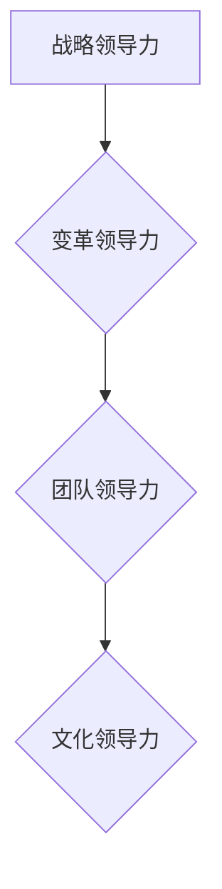
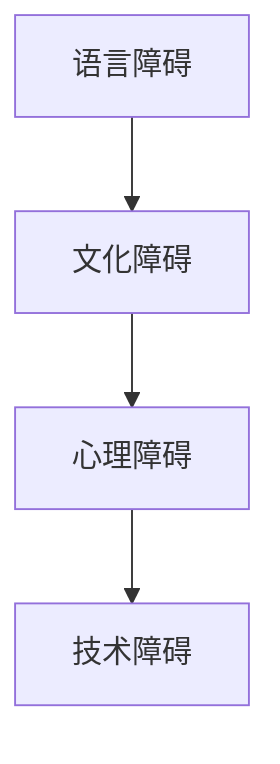
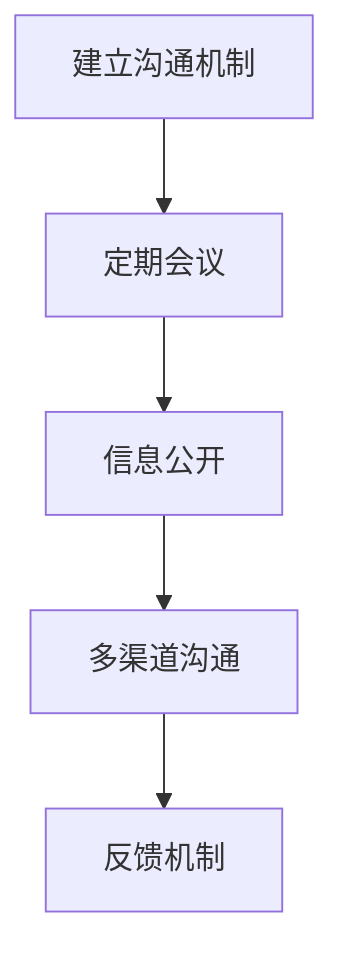

                 


### 引言

在当今快速变化和高度互联的世界中，领导力和沟通艺术成为了组织成功的关键要素。有效的领导力能够激发团队的潜能，推动创新和实现目标；而卓越的沟通艺术则是确保信息准确传达、减少误解和增强团队合作的重要手段。本篇文章将深入探讨领导力与沟通艺术，通过分步分析，揭示其核心概念、原理和实践方法，为读者提供一套实用且具有前瞻性的策略。

我们将首先介绍领导力的基本定义和重要性，探讨其发展历史和领导者的角色与职责。接着，我们将转向沟通艺术，分析其重要性、基本原理以及如何克服沟通障碍。随后，我们将讨论领导力与沟通艺术的结合，探讨领导者如何通过有效的信息传达提升团队效能。本文还将涉及沟通艺术在团队管理中的应用，以及领导者如何建立有效的沟通机制。

在第四部分，我们将探讨领导力与沟通艺术在企业、项目管理和危机管理中的实践。最后，我们将展望领导力与沟通艺术的未来发展，提出培养和提升这些关键能力的方法。通过逐步思考，我们将为读者提供一套全面且实用的领导力与沟通艺术指南。

### 第一部分：领导力基础

#### 1.1 领导力的定义与重要性

**领导力的定义**

领导力是一种复杂的能力，它涉及激励、影响和引导他人朝着共同目标努力的过程。根据不同的理论和研究，领导力可以被定义为一系列行为、技能和特质，这些特质能够促使个体或团队实现卓越表现。在技术领域，领导力不仅仅是管理资源，更重要的是激发创新、促进合作和引领变革。

**领导力的重要性**

领导力在组织中的作用不可忽视。首先，它能够激发团队成员的潜力，提高整体绩效。其次，领导者通过有效的沟通和协调，能够确保团队目标与组织战略的一致性。此外，领导力还能够塑造组织文化，促进企业创新和持续发展。

**领导力与管理的区别**

领导力和管理虽然密切相关，但二者有明显的区别。管理侧重于规划、组织和控制，确保组织目标的实现；而领导力则更注重激励和影响，推动组织变革和发展。一个优秀的领导者不仅能够进行有效的管理，还能够激发团队潜力，引领组织迈向更高的目标。

#### 1.2 领导力的发展历史与演变

**传统领导理论**

传统的领导理论主要关注领导者的个人特质和行为模式。例如，特质理论强调领导者天生具备某些特质，如自信、决断力和魅力。行为理论则关注领导者如何影响他人，研究其行为风格和决策过程。

**当代领导理论**

随着组织环境的变迁，当代领导理论更加注重领导者的适应能力和变革能力。情境理论强调领导者应根据不同情境采取不同的领导风格。领导力发展理论则关注领导者如何通过学习和成长提升自己的能力。

**领导力的发展趋势**

当前，领导力的发展趋势呈现出以下几个特点：首先，领导者需要具备跨文化和跨领域的领导能力，能够适应全球化背景下的复杂环境。其次，领导者需要具备创新和变革能力，能够引领组织迎接未来挑战。最后，领导者需要具备可持续发展思维，注重企业的社会责任和环境保护。

#### 1.3 领导者的角色与职责

**领导者的角色**

领导者的角色是多方面的，包括愿景设定者、团队激励者、资源协调者和变革推动者。领导者需要具备前瞻性思维，能够为团队设定清晰的目标和愿景，同时通过激励和鼓励激发团队成员的潜力。

**领导者的职责**

领导者的职责包括制定战略、管理团队、处理冲突和推动创新。领导者需要确保团队目标的实现，同时关注团队成员的职业发展和个人成长。此外，领导者还需要具备处理冲突和解决问题的能力，确保团队的稳定和高效运作。

**领导者的素养要求**

领导者的素养要求包括道德品质、专业能力和人际关系能力。道德品质是领导者的基础，包括诚信、公正和责任感。专业能力包括战略思维、决策能力和创新思维。人际关系能力则涉及沟通技巧、团队合作和领导风格。

#### 1.4 领导力与团队管理

**团队概述**

团队是由一群具有不同技能和专长的个体组成的，共同为实现某个目标而努力的组织形式。团队管理的关键在于如何协调团队成员的个体差异，发挥团队的整体效能。

**团队建设**

团队建设是领导力的重要实践之一，包括团队目标的设定、团队结构的优化、团队文化的塑造和团队协作的促进。一个成功的团队需要具备共同的目标、良好的沟通机制和积极的团队文化。

**团队领导策略**

团队领导策略包括激励策略、沟通策略和变革策略。领导者需要通过激励措施激发团队成员的积极性和创造力，通过有效沟通确保信息的准确传达，通过变革推动团队的创新和发展。

#### 1.5 本章小结

领导力是组织成功的关键要素，有效的领导力能够推动组织实现卓越表现。本章节介绍了领导力的定义、重要性、发展历史、领导者的角色与职责以及团队管理。通过这些内容，读者可以初步了解领导力的核心概念和实践方法，为后续章节的学习打下坚实基础。

### 第二部分：沟通艺术

#### 2.1 沟通的重要性与基本原理

**沟通的重要性**

沟通是任何组织和个人成功的基石。在信息技术快速发展的今天，沟通的重要性更加凸显。有效的沟通能够确保信息的准确传达，减少误解和冲突，提高团队效率和合作水平。在技术领域，良好的沟通能力更是确保项目顺利进行、技术突破和创新实现的关键。

**沟通的基本原理**

沟通是一个复杂的过程，涉及信息的发送、传递、接收和反馈。沟通的基本原理包括以下几个方面：

1. **信息发送**：信息发送者需要明确沟通的目标和内容，选择合适的沟通渠道和方式。
2. **信息传递**：信息在发送过程中可能受到噪音干扰，影响信息的准确性和完整性。
3. **信息接收**：信息接收者需要理解发送者的意图，通过解码信息获得准确的信息。
4. **信息反馈**：信息反馈是沟通的重要环节，能够确保信息发送者了解信息接收者的理解程度。

**沟通的有效性评估**

评估沟通的有效性可以从以下几个方面进行：

1. **信息准确度**：信息是否被准确地理解和传达。
2. **沟通效率**：信息传递的速度和及时性。
3. **沟通效果**：信息传递后是否达到了预期的目标。
4. **沟通满意度**：信息发送者和接收者对沟通过程和结果的满意度。

#### 2.2 沟通障碍与解决策略

**沟通障碍的类型**

沟通障碍可以分为以下几类：

1. **语言障碍**：由于语言差异导致的沟通困难。
2. **文化障碍**：不同文化背景下的价值观、习俗和沟通方式的差异。
3. **心理障碍**：个人情感、心理状态和信任度对沟通的影响。
4. **技术障碍**：信息传输过程中可能出现的故障和干扰。

**沟通障碍的原因**

沟通障碍的原因包括以下几个方面：

1. **信息发送者**：信息发送者可能因不清晰的表达或选择错误的沟通方式导致信息误解。
2. **信息传递**：信息在传递过程中可能因噪音、干扰等原因导致信息失真。
3. **信息接收者**：信息接收者可能因理解能力不足、心理状态不佳等原因导致信息接收不完整。

**沟通障碍的解决策略**

为了克服沟通障碍，可以采取以下策略：

1. **明确沟通目标**：确保信息发送者明确沟通的目标和内容。
2. **选择合适的沟通渠道**：根据沟通内容、对象和情境选择合适的沟通渠道。
3. **提高沟通技巧**：通过培训和实践提高沟通者的语言表达能力、倾听能力和反馈能力。
4. **建立信任**：通过建立信任关系，减少心理障碍和误解。
5. **使用可视化工具**：使用图表、图像和视频等可视化工具，提高信息的准确性和易懂性。
6. **加强反馈机制**：通过定期反馈，确保信息接收者对信息的理解程度和满意度。

#### 2.3 沟通技巧与策略

**非语言沟通技巧**

非语言沟通技巧在沟通中起到非常重要的作用。以下是一些常见的非语言沟通技巧：

1. **身体语言**：通过姿势、手势和面部表情等身体语言传递信息。
2. **视觉沟通**：通过图表、图像和视频等视觉元素提高信息的直观性和易懂性。
3. **声音语言**：通过语调、语速和音量等声音语言增强信息的表达效果。

**语言沟通技巧**

语言沟通技巧是有效沟通的关键。以下是一些常见的语言沟通技巧：

1. **明确表达**：使用简单、清晰的词语和句子表达信息。
2. **倾听**：通过积极的倾听，理解对方的观点和需求。
3. **提问**：通过提问引导对话，获取更多信息。
4. **反馈**：通过及时反馈，确保信息传达的准确性和完整性。

**沟通策略的选择与应用**

选择和应用合适的沟通策略能够提高沟通的有效性。以下是一些常见的沟通策略：

1. **面对面沟通**：适用于需要详细讨论和深入交流的情况。
2. **书面沟通**：适用于需要正式记录和长期保存的情况。
3. **远程沟通**：适用于团队成员分布在不同的地理位置。
4. **团队会议**：适用于需要集体讨论和决策的情况。

#### 2.4 高效沟通的实践

**沟通前的准备**

在进行沟通前，需要进行充分的准备，包括：

1. **明确沟通目标**：确保沟通有明确的目标和内容。
2. **了解受众**：了解沟通对象的背景、需求和期望。
3. **准备材料**：准备必要的图表、文档和演示材料。
4. **制定沟通计划**：制定详细的沟通计划和时间表。

**沟通中的注意事项**

在沟通过程中，需要注意以下几点：

1. **保持专注**：集中注意力，避免分心。
2. **控制情绪**：保持冷静，避免情绪波动影响沟通效果。
3. **积极倾听**：认真倾听对方的意见和需求。
4. **及时反馈**：及时反馈，确保信息的准确传达。
5. **控制时间**：确保沟通在预定的时间内完成，避免拖延。

**沟通后的反馈与调整**

在沟通结束后，需要进行反馈和调整，包括：

1. **收集反馈**：收集沟通对象的反馈，了解沟通的效果。
2. **总结经验**：总结沟通的经验和教训，为下一次沟通做好准备。
3. **调整沟通策略**：根据反馈结果调整沟通策略，提高沟通的有效性。

#### 2.5 本章小结

沟通艺术是领导力的重要组成部分，有效的沟通能够确保信息的准确传达，提高团队效率和合作水平。本章节介绍了沟通的重要性、基本原理、沟通障碍、沟通技巧与策略以及高效沟通的实践方法。通过这些内容，读者可以掌握沟通艺术的核心知识和实践技巧，为提升个人和团队的能力打下坚实基础。

### 第三部分：领导力与沟通艺术的结合

#### 3.1 领导力与沟通艺术的相互影响

**领导力对沟通艺术的影响**

领导力是沟通艺术的基础。一个优秀的领导者不仅需要具备管理和决策的能力，还需要具备卓越的沟通技巧。领导者的领导风格和沟通方式直接影响团队的合作和沟通效果。例如，一个鼓励开放的领导者能够促进团队成员之间的沟通，提高团队的整体效能。

**沟通艺术对领导力的影响**

沟通艺术是领导力的关键组成部分。有效的沟通能够确保领导者的意图和战略目标被团队成员准确理解和执行。同时，通过倾听和反馈，领导者能够了解团队成员的需求和意见，从而更好地调整领导策略，提高领导力。

**领导力与沟通艺术的协同效应**

领导力和沟通艺术相互促进，形成协同效应。优秀的领导者通过有效的沟通艺术能够更好地传达信息、激发团队潜力，推动组织实现目标。同时，卓越的沟通艺术有助于领导者理解团队成员的需求和意见，提高领导力的适应性和变革能力。

#### 3.2 领导者如何有效传达信息

**信息传达的原则**

领导者有效传达信息需要遵循以下原则：

1. **明确性**：信息传达要清晰、明确，避免歧义和误解。
2. **针对性**：根据不同的受众和情境选择合适的传达方式和内容。
3. **及时性**：及时传达信息，确保信息传达的时效性和准确性。
4. **一致性**：信息传达应保持一致性，避免信息冲突和混乱。
5. **反馈性**：通过反馈机制确保信息的准确理解和执行。

**信息传达的技巧**

领导者有效传达信息需要掌握以下技巧：

1. **使用简单语言**：使用简单、易懂的语言表达信息，避免使用过于复杂的术语和句子。
2. **视觉辅助**：使用图表、图像和视频等视觉元素提高信息的直观性和易懂性。
3. **倾听与反馈**：积极倾听团队成员的意见和反馈，确保信息的准确传达和理解。
4. **适应不同受众**：根据受众的背景、需求和认知水平调整传达方式和内容。
5. **建立信任**：通过建立信任关系，提高信息的可信度和接受度。

**信息传达的案例分析**

以下是一个信息传达的案例分析：

**案例背景**：某科技公司的项目经理需要在项目进展中向团队成员传达一个重要的决策。

**案例分析**：

1. **明确传达目标**：项目经理需要明确传达的信息是关于项目进度调整和资源分配。
2. **选择传达方式**：由于团队成员分布在不同的地理位置，项目经理选择了召开在线会议的形式进行传达。
3. **准备传达内容**：项目经理准备了详细的会议议程、项目进度图表和资源分配计划。
4. **会议中传达**：项目经理在会议中使用了简单明了的语言，通过图表和幻灯片展示了项目调整的细节，并留出时间回答团队成员的问题。
5. **会议后反馈**：会议结束后，项目经理收集了团队成员的反馈，确保每个人都理解了传达的信息。

通过这个案例，我们可以看到，领导者通过明确传达目标、选择合适的方式、准备详细的传达内容以及倾听和反馈，能够有效地传达信息，确保团队成员对信息的准确理解和执行。

#### 3.3 沟通艺术在团队管理中的应用

**团队沟通的目标**

团队沟通的目标是确保团队成员之间的信息流畅，促进团队合作和共同目标的实现。具体目标包括：

1. **信息共享**：确保团队成员能够及时、准确地共享信息，提高整体工作效率。
2. **意见交流**：提供平台供团队成员表达观点和意见，促进团队创新和决策。
3. **协调合作**：确保团队成员之间的协调和合作，提高团队整体效能。
4. **冲突解决**：通过沟通解决团队成员之间的冲突，维护团队的稳定和和谐。

**团队沟通的策略**

团队沟通的策略包括以下几个方面：

1. **建立沟通机制**：制定明确的沟通流程和规则，确保沟通的有序进行。
2. **定期会议**：定期召开团队会议，讨论项目进展、问题和解决方案。
3. **信息公开**：确保关键信息的公开透明，避免信息孤岛和误解。
4. **多渠道沟通**：利用多种沟通渠道，如面对面会议、邮件、即时通讯工具等，提高沟通效率。
5. **反馈机制**：建立反馈机制，确保团队成员能够及时了解自己的工作表现和团队的整体进展。

**团队沟通的实践**

以下是一个团队沟通的实践案例：

**案例背景**：某软件开发团队需要在项目开发过程中确保团队成员之间的有效沟通。

**实践步骤**：

1. **制定沟通计划**：项目经理制定了详细的沟通计划，包括会议安排、沟通渠道和反馈机制。
2. **定期团队会议**：每周召开一次团队会议，讨论项目进展、问题和解决方案。
3. **使用即时通讯工具**：团队成员使用即时通讯工具（如Slack）进行日常沟通，确保信息的实时传递。
4. **项目进度报告**：每周发布项目进度报告，确保团队成员对项目进展有清晰的认识。
5. **定期反馈**：项目经理定期收集团队成员的反馈，了解沟通的效果和存在的问题，及时调整沟通策略。

通过这个案例，我们可以看到，团队沟通的有效实践能够提高团队的工作效率和项目成功率。

#### 3.4 领导者如何建立有效的沟通机制

**沟通机制的构建**

建立有效的沟通机制需要考虑以下几个方面：

1. **明确沟通目标**：确保沟通机制的目标与组织目标一致，提高沟通的有效性。
2. **确定沟通渠道**：选择合适的沟通渠道，如会议、邮件、即时通讯工具等，确保沟通的畅通。
3. **制定沟通规则**：制定明确的沟通规则，如沟通时间、沟通方式、信息共享原则等，确保沟通的有序进行。
4. **分配沟通责任**：明确各层级和各部门的沟通责任，确保沟通的全面性和高效性。

**沟通机制的运行**

沟通机制的运行需要持续优化和改进，包括以下几个方面：

1. **定期评估**：定期评估沟通机制的有效性，了解存在的问题和改进空间。
2. **反馈机制**：建立反馈机制，及时收集团队成员的反馈，改进沟通方式和内容。
3. **培训与支持**：为团队成员提供沟通培训和支持，提高其沟通能力和技巧。
4. **技术支持**：利用先进的技术工具，提高沟通的效率和质量。

**沟通机制的优化**

沟通机制的优化是一个持续的过程，包括以下几个方面：

1. **简化流程**：简化沟通流程，减少不必要的环节和步骤，提高沟通效率。
2. **提升透明度**：提高信息的透明度，确保团队成员能够及时、全面地了解组织信息和决策。
3. **加强互动**：通过增加互动环节，促进团队成员之间的交流和合作。
4. **技术升级**：引入新的技术工具，提高沟通的效率和效果。

#### 3.5 本章小结

领导力与沟通艺术相辅相成，领导者通过有效的沟通艺术能够更好地传达信息、激发团队潜力，提高团队效率和项目成功率。本章节介绍了领导力与沟通艺术的相互影响、领导者如何有效传达信息、沟通艺术在团队管理中的应用以及如何建立有效的沟通机制。通过这些内容，读者可以深入理解领导力与沟通艺术的结合，为提升个人和团队的领导力与沟通能力提供有力支持。

### 第四部分：领导力与沟通艺术的综合应用

#### 4.1 领导力与沟通艺术在企业中的实践

**企业领导力模型**

在企业中，领导力模型是指导领导者行为和决策的重要工具。一个有效的企业领导力模型应包括以下几个方面：

1. **战略领导力**：领导者需要具备制定企业战略和愿景的能力，确保企业朝着正确的方向前进。
2. **变革领导力**：领导者需要能够引领企业适应市场变化和技术革新，推动企业持续发展。
3. **团队领导力**：领导者需要能够激励和培养团队成员，提高团队整体绩效。
4. **文化领导力**：领导者需要塑造积极的企业文化，促进团队合作和员工满意度。

**企业沟通机制建设**

有效的沟通机制是企业成功运营的关键。企业沟通机制建设应考虑以下几个方面：

1. **信息共享**：确保企业内部信息畅通，提高决策效率。
2. **反馈机制**：建立有效的反馈机制，确保员工能够表达意见和建议，促进企业改进。
3. **跨部门沟通**：加强不同部门之间的沟通，促进信息共享和资源整合。
4. **沟通培训**：定期为员工提供沟通培训，提高其沟通能力和技巧。

**企业领导力与沟通艺术的结合**

企业领导力与沟通艺术的结合能够提高企业的整体效能。具体措施包括：

1. **领导者的示范作用**：领导者应通过自己的行为树立良好的沟通榜样，推动企业内部沟通的健康发展。
2. **激励机制**：通过激励机制鼓励员工积极参与沟通，提高沟通的主动性和积极性。
3. **跨文化沟通**：在全球化背景下，企业需要注重跨文化沟通，促进不同文化背景员工之间的理解和合作。

**案例分析**

以下是一个企业领导力与沟通艺术结合的案例分析：

**案例背景**：某大型科技公司为了提高员工满意度和工作效率，决定加强领导力与沟通艺术的实践。

**案例分析**：

1. **制定领导力发展计划**：公司制定了领导力发展计划，包括领导力培训、领导力认证和领导力研讨会等，提升领导者的领导力和沟通艺术。
2. **建立员工反馈机制**：公司建立了员工反馈机制，定期收集员工意见和建议，及时解决员工问题，提高员工满意度。
3. **跨部门合作项目**：公司开展了跨部门合作项目，通过项目合作促进不同部门之间的沟通和合作。
4. **文化塑造**：公司通过文化活动、团队建设等方式塑造积极的企业文化，鼓励员工之间的沟通和合作。

通过这个案例，我们可以看到，企业通过领导力与沟通艺术的结合，能够提高员工满意度、工作效率和企业整体效能。

#### 4.2 领导力与沟通艺术在项目管理中的应用

**项目管理中的领导力要素**

在项目管理中，领导力是确保项目成功的关键要素。以下是在项目管理中领导力的一些重要要素：

1. **目标设定**：领导者需要明确项目的目标，确保项目团队理解并致力于实现这些目标。
2. **团队建设**：领导者需要通过激励、培训和支持团队，提高团队的整体效能。
3. **决策制定**：领导者需要能够快速、准确地做出决策，确保项目的顺利进行。
4. **风险管理**：领导者需要识别和应对项目风险，确保项目在可控范围内进行。
5. **沟通协调**：领导者需要确保项目团队成员之间的有效沟通和协作，提高项目效率。

**项目管理中的沟通技巧**

在项目管理中，有效的沟通技巧对于项目成功至关重要。以下是一些在项目管理中常用的沟通技巧：

1. **清晰表达**：领导者需要清晰、准确地表达项目目标和期望，避免歧义和误解。
2. **积极倾听**：领导者需要积极倾听团队成员的意见和建议，了解他们的需求和问题。
3. **及时反馈**：领导者需要及时给予团队成员反馈，确保他们对项目的理解和执行。
4. **透明沟通**：领导者需要确保项目信息的透明，使团队成员能够及时了解项目进展和决策。
5. **会议管理**：领导者需要有效管理项目会议，确保会议的效率和效果。

**项目管理中的领导力与沟通艺术的实践**

以下是在项目管理中领导力与沟通艺术结合的实践方法：

1. **建立项目沟通计划**：在项目启动时，领导者应制定详细的沟通计划，包括沟通频率、渠道和内容。
2. **定期项目会议**：定期召开项目会议，讨论项目进展、问题和解决方案，确保团队成员之间的信息共享和协作。
3. **问题反馈机制**：建立问题反馈机制，鼓励团队成员报告问题和提供建议，及时解决问题，确保项目顺利进行。
4. **团队建设活动**：通过团队建设活动，增强团队成员之间的信任和合作，提高项目团队的整体效能。

**案例分析**

以下是一个项目管理中领导力与沟通艺术结合的案例分析：

**案例背景**：某IT公司在开发一个大型项目时，遇到了沟通不畅和团队协作问题，影响了项目的进度和质量。

**案例分析**：

1. **制定项目沟通计划**：项目经理制定了详细的沟通计划，包括每周的项目进度会议、日常沟通渠道和问题反馈机制。
2. **开展团队建设活动**：项目经理组织了团队建设活动，如团队拓展训练和团队聚餐，增强团队成员之间的信任和合作。
3. **定期项目会议**：每周召开项目进度会议，讨论项目进展、问题和解决方案，确保团队成员之间的信息共享和协作。
4. **问题反馈机制**：建立了问题反馈机制，鼓励团队成员报告问题和提供建议，及时解决问题，确保项目顺利进行。

通过这个案例，我们可以看到，通过领导力与沟通艺术的实践，可以有效解决项目管理中的沟通不畅和协作问题，提高项目的成功率和质量。

#### 4.3 领导力与沟通艺术在危机管理中的应用

**危机管理的领导力要素**

在危机管理中，领导力是关键要素。以下是在危机管理中领导力的一些重要要素：

1. **快速反应**：领导者需要能够迅速识别危机，并采取行动应对。
2. **决策能力**：领导者需要能够在压力下做出明智的决策，确保危机得到有效控制。
3. **沟通协调**：领导者需要确保危机管理团队之间的有效沟通和协作，提高危机应对的效率。
4. **心理素质**：领导者需要具备良好的心理素质，保持冷静和理智，确保危机管理顺利进行。

**危机管理的沟通策略**

在危机管理中，有效的沟通策略对于危机的应对至关重要。以下是一些在危机管理中常用的沟通策略：

1. **及时沟通**：领导者需要及时与危机管理团队和外部利益相关者沟通，确保信息畅通。
2. **透明沟通**：领导者需要确保危机信息的透明，避免信息封锁和隐瞒，增强公众信任。
3. **情感沟通**：领导者需要通过情感沟通，安抚受危机影响的员工和公众，减少恐慌和不满。
4. **媒体沟通**：领导者需要积极与媒体沟通，确保危机管理的正面形象，避免负面舆论的扩散。

**危机管理的领导力与沟通艺术的实践**

以下是在危机管理中领导力与沟通艺术结合的实践方法：

1. **制定危机管理计划**：在危机发生前，领导者应制定详细的危机管理计划，包括危机应对步骤、沟通策略和资源调配。
2. **建立危机管理团队**：领导者需要建立专门的危机管理团队，负责危机的应对和沟通工作。
3. **定期危机演练**：领导者应定期进行危机演练，提高团队应对危机的能力和沟通技巧。
4. **信息共享**：在危机管理过程中，领导者需要确保信息在危机管理团队和利益相关者之间的共享，提高应对效率。

**案例分析**

以下是一个危机管理中领导力与沟通艺术结合的案例分析：

**案例背景**：某航空公司因为技术故障导致航班延误，引起了乘客的不满和媒体的关注。

**案例分析**：

1. **快速反应**：公司高层领导立即成立了危机管理团队，迅速应对航班延误问题。
2. **透明沟通**：公司通过官方渠道及时向乘客和媒体通报航班延误的原因和处理措施，确保信息的透明。
3. **情感沟通**：公司高层领导亲自向受影响的乘客道歉，并通过媒体安抚公众，减少恐慌和不满。
4. **媒体沟通**：公司积极与媒体沟通，确保危机管理的正面形象，避免负面舆论的扩散。

通过这个案例，我们可以看到，通过领导力与沟通艺术的实践，航空公司有效地应对了危机，维护了企业形象，减少了危机带来的负面影响。

#### 4.4 本章小结

领导力与沟通艺术在企业、项目管理和危机管理中的综合应用，能够显著提高组织的整体效能和应对能力。通过有效的领导力和沟通艺术，企业能够更好地实现战略目标，提高员工满意度和工作效率；在项目管理中，能够确保项目顺利进行，提高项目成功率和质量；在危机管理中，能够迅速应对危机，减少负面影响。本章节通过实际案例的分析，展示了领导力与沟通艺术在各个领域的具体应用和实践方法。

### 第五部分：领导力与沟通艺术的未来发展

#### 5.1 新时代领导力与沟通艺术的发展趋势

随着全球化、数字化和知识经济的发展，领导力与沟通艺术正面临新的挑战和机遇。以下是新时代领导力与沟通艺术的发展趋势：

**数字化转型对领导力与沟通艺术的影响**

数字化转型已经成为企业发展的关键驱动因素。领导者需要具备数字化思维，能够把握数字化趋势，引领组织进行数字化转型。数字化转型要求领导者具备以下能力：

1. **技术创新能力**：领导者需要熟悉和掌握最新的数字技术，如人工智能、大数据和云计算等。
2. **变革管理能力**：领导者需要能够推动组织变革，适应数字化环境下的新要求。
3. **跨部门协作能力**：数字化转型需要跨部门的协作和整合，领导者需要具备协调不同部门的能力。

**知识经济对领导力与沟通艺术的影响**

知识经济强调知识的创造、传播和应用，对领导力与沟通艺术提出了新的要求。以下是知识经济对领导力与沟通艺术的影响：

1. **创新能力**：知识经济要求领导者具备创新能力，能够推动组织进行创新和持续发展。
2. **学习型组织**：知识经济要求组织成为一个学习型组织，领导者需要鼓励和支持员工持续学习和成长。
3. **知识共享**：知识经济强调知识的共享和传播，领导者需要建立有效的知识共享机制，促进知识的流动和应用。

**全球化背景下的领导力与沟通艺术**

全球化使组织面临更复杂的国际环境和跨文化挑战，对领导力与沟通艺术提出了新的要求。以下是全球化对领导力与沟通艺术的影响：

1. **跨文化领导力**：领导者需要具备跨文化领导力，能够理解和尊重不同文化的差异，促进跨文化合作。
2. **国际化视野**：领导者需要具备国际化视野，能够把握全球市场趋势和机遇。
3. **全球团队合作**：领导者需要能够有效管理和协调全球团队，确保团队之间的协同合作。

#### 5.2 未来领导力与沟通艺术的核心能力

在未来，领导力与沟通艺术的核心能力将包括以下几个方面：

**创新能力**

创新能力是未来领导力的重要组成部分。领导者需要具备创新能力，能够推动组织进行创新和持续发展。这包括：

1. **愿景和战略规划**：领导者需要具备清晰的愿景和战略规划，能够为组织指引方向。
2. **风险管理**：领导者需要具备承担风险的能力，敢于尝试新的想法和方法。
3. **资源整合**：领导者需要能够整合内部和外部资源，为创新提供支持。

**协作能力**

协作能力是未来领导力的重要体现。领导者需要具备协作能力，能够有效管理和协调团队，实现共同目标。这包括：

1. **跨部门协作**：领导者需要能够跨部门协作，促进不同部门之间的合作和整合。
2. **团队建设**：领导者需要能够建立高效的团队，提高团队的整体效能。
3. **沟通协调**：领导者需要具备良好的沟通协调能力，确保团队成员之间的信息畅通。

**变革能力**

变革能力是未来领导力的重要要求。领导者需要具备变革能力，能够引领组织适应外部环境的变化和内部结构的调整。这包括：

1. **适应变化**：领导者需要能够适应快速变化的环境，灵活调整策略和行动。
2. **组织变革**：领导者需要能够推动组织变革，促进组织的创新和持续发展。
3. **员工发展**：领导者需要关注员工的发展，为员工提供成长和发展的机会。

#### 5.3 领导力与沟通艺术的教育与培养

**领导力与沟通艺术教育的现状**

当前，领导力与沟通艺术教育已经成为高等教育和继续教育的重要领域。以下是领导力与沟通艺术教育的现状：

1. **课程设置**：许多高校和培训机构开设了领导力与沟通艺术相关课程，包括领导力理论、沟通技巧、团队建设等。
2. **培训项目**：许多企业和管理咨询公司提供领导力与沟通艺术的培训项目，帮助领导者提升能力和技能。
3. **在线学习**：随着在线教育的兴起，越来越多的领导力与沟通艺术课程通过在线平台提供，方便学习者灵活学习。

**领导力与沟通艺术教育的目标**

领导力与沟通艺术教育的目标包括：

1. **知识传授**：通过教育，传授领导力与沟通艺术的基本理论和知识。
2. **能力培养**：通过实践和案例学习，培养领导者的实践能力和应对复杂问题的能力。
3. **素养提升**：通过教育，提升领导者的道德品质、人际关系能力和职业素养。

**领导力与沟通艺术教育的未来方向**

未来，领导力与沟通艺术教育将朝着以下几个方向发展：

1. **跨学科融合**：领导力与沟通艺术教育将融合心理学、管理学、社会学等多学科知识，提供更全面的教育体系。
2. **实战导向**：教育将更加注重实战导向，通过模拟演练和实际案例分析，提高领导者的实际操作能力。
3. **持续学习**：教育将鼓励持续学习，为领导者提供终身学习的机会，以适应快速变化的环境。

#### 5.4 本章小结

未来，领导力与沟通艺术将面临新的挑战和机遇。数字化转型、知识经济和全球化趋势对领导者提出了更高的要求。未来领导力与沟通艺术的核心能力将包括创新能力、协作能力和变革能力。同时，领导力与沟通艺术的教育与培养将朝着跨学科融合、实战导向和持续学习的方向发展。通过不断提升领导力与沟通艺术的能力，领导者将能够更好地应对未来挑战，推动组织的持续发展和成功。

### 总结

在本篇文章中，我们深入探讨了领导力与沟通艺术的核心概念、原理和实践方法。从领导力的定义和重要性，到沟通艺术的技巧和策略，再到领导力与沟通艺术的结合，我们逐步揭示了其在现代组织中的关键作用。通过具体的案例分析，我们看到了领导力与沟通艺术在企业、项目管理和危机管理中的成功应用。同时，我们也展望了未来领导力与沟通艺术的发展趋势和核心能力。

领导力和沟通艺术并非一蹴而就，而是需要通过不断学习和实践来提升。希望读者能够将本文中的知识和方法应用到实际工作中，不断提升自己的领导力和沟通能力，为个人和组织的成功奠定坚实基础。

### 作者信息

**作者：** AI天才研究院/AI Genius Institute & 禅与计算机程序设计艺术 /Zen And The Art of Computer Programming

AI天才研究院致力于推动人工智能技术的发展和应用，为全球企业提供人工智能解决方案。同时，我们专注于培养下一代人工智能科学家和工程师，推动人工智能领域的创新和进步。

禅与计算机程序设计艺术则强调在计算机编程中融入禅意，通过冥想、思考和编程的融合，提高程序员的编程技能和思维品质。我们相信，通过禅与编程的结合，可以培养出更具有创造力和洞察力的程序员，为技术领域带来新的突破。

### 最佳实践 tips

1. **定期反思**：定期反思自己的领导力和沟通实践，了解自己的优势和不足，不断调整和改进。

2. **建立反馈机制**：建立有效的反馈机制，鼓励团队成员提供意见和建议，及时改进领导方式和沟通策略。

3. **跨部门协作**：促进跨部门协作，建立跨部门沟通渠道，提高整体工作效能。

4. **持续学习**：不断学习新的领导力和沟通技巧，通过阅读、培训和实践，提升自己的能力。

5. **积极倾听**：倾听是有效沟通的关键，积极倾听团队成员的意见和需求，增强团队凝聚力。

### 小结

本文通过系统性的分析和具体的案例分析，全面阐述了领导力与沟通艺术的核心概念和实践方法。我们强调了领导力在组织中的作用，以及如何通过有效的沟通艺术提升团队效能。希望本文能为读者提供有价值的参考和指导，帮助其在领导力和沟通艺术方面取得更大的进步。

### 注意事项

1. **明确目标**：在进行沟通和领导时，确保明确目标，避免盲目行动。

2. **倾听与反馈**：倾听是有效沟通的基础，及时给予反馈，确保信息的准确传达。

3. **文化差异**：在跨文化沟通中，注意尊重和理解不同文化的差异，避免误解和冲突。

4. **持续改进**：领导力和沟通艺术需要持续改进，通过实践和反思，不断提升自己的能力和水平。

### 拓展阅读

1. **《领导力：实战手册》**：本书提供了丰富的领导力实战案例，帮助读者理解领导力的核心概念和实践方法。

2. **《沟通的艺术》**：这本书详细介绍了沟通的技巧和策略，对提高沟通能力具有很大的指导意义。

3. **《创新者的基因》**：这本书探讨了创新能力的培养和实践，为领导者提供了创新思维和策略。

4. **《变革之心》**：这本书讲述了如何推动组织变革，帮助领导者理解变革的过程和策略。

### 附录

**附录A：领导力模型图**



**附录B：沟通障碍类型图**



**附录C：团队沟通策略图**



**附录D：项目管理沟通计划模板**

```markdown
# 项目沟通计划

## 一、沟通目标
- 确保项目团队成员之间的信息共享和协作。
- 提高项目决策的透明度和效率。

## 二、沟通渠道
- 定期项目会议
- 项目进展报告
- 即时通讯工具

## 三、沟通频率
- 每周一次项目会议
- 每日一次项目进展汇报

## 四、沟通内容
- 项目进展情况
- 遇到的问题和解决方案
- 下一周的工作计划和目标

## 五、反馈机制
- 项目团队成员每周提供一次工作反馈
- 项目经理每月进行一次项目评估和总结
```

通过这些附录，读者可以更直观地理解本文中的核心概念和实践方法，为实际应用提供参考。希望这些工具和模板能够帮助读者在领导力与沟通艺术的道路上取得更大的进步。

