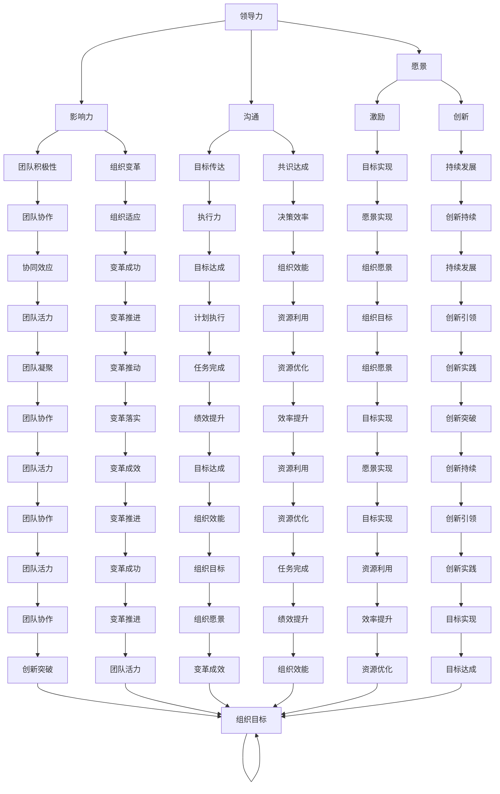
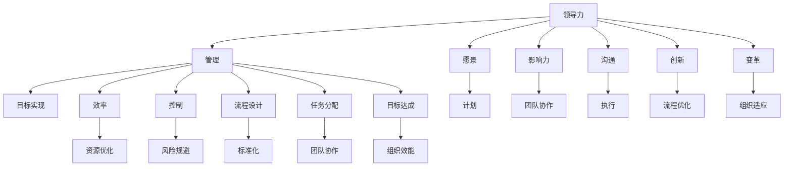

                 

### 目录大纲：领导力与管理的区别：角色定位的重要性

---

## 引言

领导力与管理的区别一直是商业和组织行为研究中的热点话题。虽然两者在组织中都是不可或缺的元素，但它们有着本质的不同。本文将深入探讨领导力与管理的区别，以及角色定位的重要性。

### 1. 背景介绍

在探讨领导力与管理的区别之前，我们需要理解这两个概念的基本定义和本质。

**领导力** 是指通过激励、引导和影响他人来实现共同目标的能力。它强调的是愿景、远见和激励团队成员实现目标的过程。

**管理** 则是组织和协调资源以实现目标的过程。它侧重于计划、组织、指挥、协调和控制等具体操作。

两者的区别在于：

- **目的不同**：领导力侧重于愿景和价值观，而管理侧重于执行和操作。
- **方式不同**：领导力通过影响和激励来实现目标，而管理则通过制定规则和流程来实现目标。
- **影响范围不同**：领导力的影响通常是长期的、全局性的，而管理的影响通常是短期的、局部性的。

### 2. 核心概念

为了更好地理解领导力与管理的区别，我们需要深入探讨这两个概念的核心要素。

#### 2.1 领导力概念解析

领导力包括以下几个核心要素：

- **愿景**：领导力始于愿景，即对未来的美好设想。
- **远见**：领导者需要有前瞻性，能够看到并把握未来的趋势。
- **影响力**：领导者通过影响力来激励和引导团队成员。
- **沟通**：领导力需要有效的沟通技巧，以确保愿景和目标得到清晰传达。

#### 2.2 管理概念解析

管理包括以下几个核心要素：

- **计划**：管理始于计划，包括目标设定、任务分配和资源调度。
- **组织**：管理涉及组织资源的有效分配和使用。
- **指挥**：管理者需要指挥团队成员执行计划。
- **控制**：管理需要通过控制来确保计划得到有效执行。

### 3. 区别分析

接下来，我们将分析领导力与管理的理论基础，以及它们在角色定位、行为模式和影响力方面的区别。

#### 3.1 领导力与管理的理论基础

**领导力** 基于心理学、社会学和组织行为学的研究，强调个人魅力、价值观和影响力。

**管理** 则基于经济学、工程学和数学，强调效率和效果。

#### 3.2 区别分析

- **角色定位的不同**：领导者更多扮演的是激励者和引领者的角色，而管理者则更多扮演的是执行者和组织者的角色。
- **行为模式的不同**：领导者更倾向于创新和冒险，而管理者更倾向于稳健和可控。
- **影响力的不同**：领导者的影响力通常是深远的，而管理者的影响力通常是局部的。

### 4. 角色定位的重要性

角色定位对于组织的成功至关重要。正确的角色定位可以确保领导力和管理得到有效结合，从而实现组织的整体目标。

#### 4.1 角色定位的理论基础

角色定位的理论基础包括自我认知、团队角色理论和领导风格理论。

#### 4.2 角色定位的实际应用

在组织中，领导者和管理者需要根据自身特点和组织的需要来定位自己的角色。

### 5. 案例分析

为了更好地理解角色定位的重要性，我们将通过两个案例来分析。

#### 5.1 案例研究一

这个案例将展示一个成功地将领导力与管理相结合的案例。

#### 5.2 案例研究二

这个案例将展示一个角色定位不当导致的失败案例。

### 6. 最佳实践与启示

通过案例分析，我们可以得出一些关于领导力与管理的最佳实践和启示。

### 7. 总结与展望

本文总结了领导力与管理的区别和角色定位的重要性。未来，随着组织环境的变化，领导力与管理的关系也将不断演变。

### 结论

领导力与管理的区别在于目的、方式和影响范围。正确的角色定位是实现组织目标的关键。通过本文的分析，我们可以更好地理解并应用这些概念。

---

**作者：AI天才研究院/AI Genius Institute & 禅与计算机程序设计艺术 /Zen And The Art of Computer Programming**

---

### 引言

在当今复杂多变的环境中，组织的管理和领导角色变得愈加重要。然而，许多人往往将领导力和管理视为同一概念，忽略了它们之间的本质区别。本文将深入探讨领导力与管理的区别，以及角色定位在组织成功中的关键作用。

### 1. 领导力与管理的背景介绍

领导力和管理都是组织运作不可或缺的部分，但它们的目的、方式和影响范围各有不同。首先，我们需要理解这两个概念的定义和起源。

**领导力** 一词起源于拉丁语的 "ducere"，意为“引导”或“带领”。它主要关注的是领导者如何激励和引导团队成员共同实现目标。领导力是一种软技能，强调的是愿景、远见和影响力。

**管理** 则源于拉丁语的 "manage"，意为“操纵”或“处理”。它主要关注的是如何有效地组织和协调资源，以确保组织目标的实现。管理是一种硬技能，侧重于计划、组织、指挥、协调和控制等具体操作。

#### 1.1 问题背景

在组织运作中，领导力与管理的区别体现在多个方面。首先，它们的目的不同。领导力侧重于创造愿景和激发团队成员的积极性，而管理则侧重于确保资源的有效利用和目标的实现。

其次，它们的方式不同。领导力通过影响和激励来实现目标，强调个人魅力、价值观和沟通技巧。而管理则通过制定规则和流程来实现目标，强调效率和效果。

最后，它们的影响范围不同。领导力的影响通常是长期的、全局性的，它能够激发团队成员的内在动力，推动组织的持续发展。而管理的影响通常是短期的、局部性的，它能够确保组织在短期内实现具体目标。

#### 1.2 领导力与管理的区别

虽然领导力和管理在组织中都是不可或缺的，但它们有着本质的不同。首先，领导力强调的是愿景和价值观，而管理强调的是执行和操作。

其次，领导力注重的是影响和激励，而管理注重的是控制和管理。

最后，领导力的影响通常是深远的，而管理的影响通常是局部的。

### 2. 核心概念

为了更好地理解领导力与管理的区别，我们需要深入探讨这两个概念的核心要素。

#### 2.1 领导力概念解析

领导力是一种能力，它包括以下几个核心要素：

- **愿景**：领导力始于愿景，即对未来的美好设想。领导者需要有远见，能够看到并把握未来的趋势。
- **远见**：领导者需要有前瞻性，能够预见挑战和机遇，并制定相应的战略。
- **影响力**：领导者通过影响力来激励和引导团队成员。他们需要具备良好的沟通技巧和人际交往能力。
- **沟通**：领导者需要能够清晰传达愿景和目标，确保团队成员理解并支持组织的方向。

#### 2.2 管理概念解析

管理是一种过程，它包括以下几个核心要素：

- **计划**：管理始于计划，包括目标设定、任务分配和资源调度。管理者需要制定详细的计划，以确保组织目标的实现。
- **组织**：管理涉及组织资源的有效分配和使用。管理者需要确保组织结构合理，资源得到充分利用。
- **指挥**：管理者需要指挥团队成员执行计划。他们需要具备有效的领导能力和决策能力。
- **控制**：管理需要通过控制来确保计划得到有效执行。管理者需要监控组织的运营情况，及时调整计划，以应对可能出现的问题。

### 3. 领导力与管理的理论基础

领导力和管理都是基于一系列理论建立的。这些理论为理解和应用领导力与管理提供了框架。

#### 3.1 领导力理论概述

领导力理论包括以下几种：

- **特质理论**：认为领导者具备特定的特质，如自信、责任感等。
- **行为理论**：认为领导者的行为风格对团队绩效有重要影响。
- **情境理论**：认为领导者的风格应适应不同的情境。

#### 3.2 管理理论概述

管理理论包括以下几种：

- **科学管理理论**：强调通过科学的方法来提高工作效率。
- **行为科学理论**：强调通过研究人的行为来提高管理效率。
- **系统理论**：认为组织是一个系统，各部分相互依赖，共同实现组织目标。

### 4. 领导力与管理的区别分析

在理解了领导力与管理的核心概念和理论基础后，我们可以进一步分析它们之间的区别。

#### 4.1 角色定位的不同

领导者的角色定位通常是激励者和引领者，他们需要激发团队成员的内在动力，共同实现愿景。而管理者的角色定位通常是执行者和组织者，他们需要确保组织目标的实现，通过制定规则和流程来提高工作效率。

#### 4.2 行为模式的不同

领导者的行为模式通常更倾向于创新和冒险，他们愿意尝试新的方法和策略，以实现组织的长期目标。而管理者的行为模式通常更倾向于稳健和可控，他们注重稳定和效率，以确保组织在短期内实现具体目标。

#### 4.3 影响力的不同

领导力的影响通常是深远的，它能够激发团队成员的内在动力，推动组织的持续发展。而管理的影响通常是局部的，它能够确保组织在短期内实现具体目标，但可能无法带来长期的变革。

#### 4.4 对组织目标的影响

领导力对组织目标的影响是长期的、全局性的。领导者通过激发团队成员的内在动力，推动组织的创新和发展，实现组织的愿景。而管理对组织目标的影响是短期的、局部性的。管理者通过制定和执行计划，确保组织在短期内实现具体目标。

### 5. 角色定位的重要性

角色定位对于组织的成功至关重要。正确的角色定位可以确保领导力和管理得到有效结合，从而实现组织的整体目标。

#### 5.1 角色定位的理论基础

角色定位的理论基础包括自我认知、团队角色理论和领导风格理论。

- **自我认知**：领导者和管理者需要了解自己的优势和不足，从而更好地定位自己的角色。
- **团队角色理论**：不同的团队成员在不同的角色上发挥作用，领导者和管理者需要根据团队的需求来定位自己的角色。
- **领导风格理论**：不同的领导风格适用于不同的情境，领导者需要根据实际情况来调整自己的风格。

#### 5.2 角色定位的实际应用

在组织中，领导者和管理者需要根据自身特点和组织的需要来定位自己的角色。

- **领导者**：领导者需要更多地关注愿景、远见和影响力，激发团队成员的内在动力。
- **管理者**：管理者需要更多地关注计划、组织和控制，确保组织目标的实现。

### 6. 案例分析

为了更好地理解角色定位的重要性，我们可以通过两个案例来分析。

#### 6.1 案例研究一

这个案例展示了领导者和管理者如何成功地将领导力与管理相结合，推动组织的持续发展。

#### 6.2 案例研究二

这个案例展示了角色定位不当导致的失败，强调了正确角色定位的重要性。

### 7. 最佳实践与启示

通过案例分析，我们可以得出一些关于领导力与管理的最佳实践和启示。

- **明确角色定位**：领导者和管理者需要明确自己的角色定位，确保领导力和管理得到有效结合。
- **提升领导力与管理能力**：领导者和管理者需要不断提升自己的领导力和管理能力，以应对不断变化的环境。

### 8. 总结与展望

本文总结了领导力与管理的区别和角色定位的重要性。未来，随着组织环境的变化，领导力与管理的关系也将不断演变。领导者和管理者需要不断学习和适应，以实现组织的持续成功。

### 结论

领导力与管理的区别在于目的、方式和影响范围。正确的角色定位是实现组织目标的关键。通过本文的分析，我们可以更好地理解并应用这些概念。

**作者：AI天才研究院/AI Genius Institute & 禅与计算机程序设计艺术 /Zen And The Art of Computer Programming**

---

### 引言

在复杂的商业环境中，领导力和管理是推动组织成功的关键因素。尽管两者在组织中都发挥着重要作用，但它们在目的、方式和影响范围上有着显著的不同。本文旨在深入探讨领导力与管理的区别，并强调角色定位在组织成功中的关键作用。

### 1. 背景介绍

领导力和管理在组织中的重要性不可低估。领导力关注的是激发团队成员的内在动力，推动他们共同实现组织愿景。而管理则侧重于资源的有效组织和目标的实现。理解这两个概念的区别有助于我们更好地运用它们，以实现组织的整体目标。

#### 1.1 领导力与管理的本质

**领导力** 是一种影响力，它涉及激发和激励他人共同追求目标的能力。领导力不仅仅是职位赋予的，更是一种个人素质，包括愿景、远见、沟通能力和影响力。

**管理** 则是一种过程，它涉及计划、组织、指挥、协调和控制等活动，以确保组织目标的实现。管理侧重于实现效率、控制和标准化流程。

#### 1.2 领导力与管理的区别

领导力与管理的区别可以从多个角度进行探讨，包括目的、方式和影响范围。

- **目的不同**：领导力关注的是创造愿景和激发团队成员的内在动力，而管理关注的是资源的有效组织和目标的实现。
- **方式不同**：领导力通过影响和激励来实现目标，而管理通过制定规则和流程来实现目标。
- **影响范围不同**：领导力的影响通常是长期的、全局性的，而管理的影响通常是短期的、局部性的。

### 2. 核心概念

为了深入理解领导力与管理的区别，我们需要探讨它们的核心概念和要素。

#### 2.1 领导力的核心概念

领导力包括以下几个核心要素：

- **愿景**：领导力的核心是愿景，即对未来的美好设想。愿景为团队成员提供方向和动力。
- **影响力**：领导者通过影响力来激励和引导团队成员，使他们愿意为实现共同目标而努力。
- **沟通**：领导力需要有效的沟通技巧，以确保愿景和目标得到清晰传达。
- **远见**：领导者需要有远见，能够预见挑战和机遇，并制定相应的战略。

#### 2.2 管理的核心概念

管理包括以下几个核心要素：

- **计划**：管理始于计划，包括目标设定、任务分配和资源调度。计划是确保组织目标实现的基础。
- **组织**：管理涉及组织资源的有效分配和使用。组织是确保资源得到充分利用的关键。
- **指挥**：管理者需要指挥团队成员执行计划。指挥是确保计划得到有效执行的重要环节。
- **控制**：管理需要通过控制来确保计划得到有效执行。控制是确保组织在实现目标过程中能够及时调整的重要手段。

### 3. 领导力与管理的理论基础

领导力和管理都基于一系列理论。了解这些理论有助于我们更好地理解它们的本质和区别。

#### 3.1 领导力理论概述

领导力理论包括以下几个核心要素：

- **特质理论**：特质理论认为领导者具备特定的个性特质，如自信、责任感等。
- **行为理论**：行为理论认为领导者的行为风格对团队绩效有重要影响。
- **情境理论**：情境理论认为领导者的风格应适应不同的情境。

#### 3.2 管理理论概述

管理理论包括以下几个核心要素：

- **科学管理理论**：科学管理理论强调通过科学的方法来提高工作效率。
- **行为科学理论**：行为科学理论强调通过研究人的行为来提高管理效率。
- **系统理论**：系统理论认为组织是一个系统，各部分相互依赖，共同实现组织目标。

### 4. 区别分析

在理解了领导力与管理的核心概念和理论基础后，我们可以进一步分析它们之间的区别。

#### 4.1 角色定位的不同

领导者的角色定位通常是激励者和引领者，他们需要激发团队成员的内在动力，共同实现愿景。而管理者的角色定位通常是执行者和组织者，他们需要确保组织目标的实现，通过制定规则和流程来提高工作效率。

#### 4.2 行为模式的不同

领导者的行为模式通常更倾向于创新和冒险，他们愿意尝试新的方法和策略，以实现组织的长期目标。而管理者的行为模式通常更倾向于稳健和可控，他们注重稳定和效率，以确保组织在短期内实现具体目标。

#### 4.3 影响力的不同

领导力的影响通常是深远的，它能够激发团队成员的内在动力，推动组织的持续发展。而管理的影响通常是局部的，它能够确保组织在短期内实现具体目标，但可能无法带来长期的变革。

#### 4.4 对组织目标的影响

领导力对组织目标的影响是长期的、全局性的。领导者通过激发团队成员的内在动力，推动组织的创新和发展，实现组织的愿景。而管理对组织目标的影响是短期的、局部性的。管理者通过制定和执行计划，确保组织在短期内实现具体目标。

### 5. 角色定位的重要性

角色定位对于组织的成功至关重要。正确的角色定位可以确保领导力和管理得到有效结合，从而实现组织的整体目标。

#### 5.1 角色定位的理论基础

角色定位的理论基础包括自我认知、团队角色理论和领导风格理论。

- **自我认知**：领导者和管理者需要了解自己的优势和不足，从而更好地定位自己的角色。
- **团队角色理论**：不同的团队成员在不同的角色上发挥作用，领导者和管理者需要根据团队的需求来定位自己的角色。
- **领导风格理论**：不同的领导风格适用于不同的情境，领导者需要根据实际情况来调整自己的风格。

#### 5.2 角色定位的实际应用

在组织中，领导者和管理者需要根据自身特点和组织的需要来定位自己的角色。

- **领导者**：领导者需要更多地关注愿景、远见和影响力，激发团队成员的内在动力。
- **管理者**：管理者需要更多地关注计划、组织和控制，确保组织目标的实现。

### 6. 案例分析

为了更好地理解角色定位的重要性，我们可以通过两个案例来分析。

#### 6.1 案例研究一

这个案例展示了领导者和管理者如何成功地将领导力与管理相结合，推动组织的持续发展。

#### 6.2 案例研究二

这个案例展示了角色定位不当导致的失败，强调了正确角色定位的重要性。

### 7. 最佳实践与启示

通过案例分析，我们可以得出一些关于领导力与管理的最佳实践和启示。

- **明确角色定位**：领导者和管理者需要明确自己的角色定位，确保领导力和管理得到有效结合。
- **提升领导力与管理能力**：领导者和管理者需要不断提升自己的领导力和管理能力，以应对不断变化的环境。

### 8. 总结与展望

本文总结了领导力与管理的区别和角色定位的重要性。未来，随着组织环境的变化，领导力与管理的关系也将不断演变。领导者和管理者需要不断学习和适应，以实现组织的持续成功。

### 结论

领导力与管理的区别在于目的、方式和影响范围。正确的角色定位是实现组织目标的关键。通过本文的分析，我们可以更好地理解并应用这些概念。

**作者：AI天才研究院/AI Genius Institute & 禅与计算机程序设计艺术 /Zen And The Art of Computer Programming**

---

### 引言

领导力和管理是组织成功的关键要素。尽管它们在组织中都是不可或缺的，但它们在目的、方式、影响范围上存在显著差异。理解并正确运用领导力与管理是组织领导者和管理者的重要任务。本文将深入探讨领导力与管理的区别，并重点分析角色定位的重要性。

### 1. 背景介绍

领导力和管理在组织中的重要性不言而喻。领导力关注的是如何激发团队成员的内在动力，推动他们为实现共同目标而努力。管理则侧重于资源的有效组织和目标的实现。两者相辅相成，共同推动组织的持续发展。

#### 1.1 问题背景

在组织运作中，领导力与管理的区别主要体现在以下几个方面：

- **目的不同**：领导力侧重于创造愿景、激发动力，而管理侧重于实现效率和目标。
- **方式不同**：领导力通过影响和激励来实现目标，而管理通过规则和流程来实现目标。
- **影响范围不同**：领导力的影响通常是长期的、全局性的，而管理的影响通常是短期的、局部性的。

#### 1.2 问题描述

虽然领导力与管理的区别显而易见，但在实际操作中，许多组织往往未能正确运用这两个概念，导致组织绩效不佳。本文将深入探讨这两个概念的本质区别，并分析角色定位的重要性，以期为组织领导者提供实用的指导。

### 2. 问题解决

为了更好地理解领导力与管理的区别，我们可以从以下几个维度进行探讨：

#### 2.1 边界与外延

**领导力** 的边界在于其关注的是人的内在动力和价值观，而外延则是其能够激发团队成员的积极性和创造力，推动组织实现愿景。

**管理** 的边界在于其关注的是资源的有效组织和目标的实现，而外延则是其能够通过规则和流程确保组织目标的达成。

#### 2.2 概念结构与核心要素组成

**领导力** 的概念结构包括：

- 愿景：对未来的美好设想。
- 影响力：激励和引导团队成员的能力。
- 沟通：有效传达愿景和目标。

**管理** 的概念结构包括：

- 计划：目标设定、任务分配和资源调度。
- 组织：资源分配和流程设计。
- 指挥：指挥团队成员执行计划。

#### 2.3 关系图架构

为了更好地理解领导力与管理的概念结构，我们可以使用 Mermaid 流程图来表示它们之间的关系：

#### 2.4 概念属性特征对比表格

| 特征 | 领导力 | 管理 |
| :--: | :----: | :--: |
| 目的 | 创造愿景，激发动力 | 实现效率，达成目标 |
| 方式 | 影响和激励 | 规则和流程 |
| 范围 | 长期，全局 | 短期，局部 |
| 影响力 | 深远 | 局部 |
| 核心要素 | 愿景，影响力，沟通 | 计划，组织，指挥，控制 |

#### 2.5 边界与外延

**领导力** 的边界在于其关注的是人的内在动力和价值观，而外延则是其能够激发团队成员的积极性和创造力，推动组织实现愿景。

**管理** 的边界在于其关注的是资源的有效组织和目标的实现，而外延则是其能够通过规则和流程确保组织目标的达成。

### 3. 概念联系

领导力与管理之间存在紧密的联系。一方面，领导力为管理提供了方向和动力；另一方面，管理为领导力的实现提供了保障。具体而言：

- **领导力** 为管理提供了愿景和价值观，使管理能够更好地制定目标和计划。
- **管理** 为领导力提供了有效的执行和协调机制，使领导力能够更好地实现目标。

#### 3.1 概念联系图

### 4. 算法原理讲解

为了更好地理解领导力与管理的区别和联系，我们可以使用 Mermaid 流程图来表示它们之间的关系：

### 5. 数学模型和公式

在探讨领导力与管理的区别和联系时，我们可以使用数学模型和公式来表示它们之间的关系。以下是相关的数学模型和公式：

$$
\text{领导力} = \alpha \times \text{愿景} + \beta \times \text{影响力} + \gamma \times \text{沟通}
$$

$$
\text{管理} = \delta \times \text{效率} + \epsilon \times \text{资源优化} + \zeta \times \text{控制}
$$

其中，$\alpha$，$\beta$，$\gamma$，$\delta$，$\epsilon$ 和 $\zeta$ 分别表示领导力和管理中各个要素的重要性权重。

### 6. 详细讲解和举例说明

为了更好地理解领导力与管理的区别和联系，我们可以通过具体的例子来进行讲解。

#### 6.1 领导力

**例子**：一位公司 CEO 通过愿景和影响力激发了团队成员的积极性，推动了公司创新和发展。

**解析**：

- **愿景**：CEO 提出了公司未来三年内的愿景，包括市场拓展、产品创新和团队建设。
- **影响力**：CEO 通过与团队成员的沟通，激发了他们的积极性和创造力，使团队为实现愿景而努力。
- **沟通**：CEO 通过定期的团队会议和内部沟通渠道，确保团队成员理解并支持公司的愿景。

#### 6.2 管理

**例子**：一位项目经理通过有效的管理和控制，确保了项目的按时交付和成本控制。

**解析**：

- **效率**：项目经理制定了详细的项目计划，并确保团队成员按照计划高效地完成任务。
- **资源优化**：项目经理合理分配了项目资源，确保资源得到充分利用。
- **控制**：项目经理通过监控项目的进展和质量，确保项目按照计划进行，并及时调整计划以应对可能出现的问题。

### 7. 系统分析与架构设计方案

为了更好地理解领导力与管理的区别和联系，我们可以从系统分析和架构设计角度进行分析。

#### 7.1 问题场景介绍

一家大型科技公司需要在快速变化的市场环境中保持竞争力，为此，公司决定引入新的管理体系，以提升领导力和管理效率。

#### 7.2 系统功能设计

系统功能设计主要包括以下几个方面：

- **领导力评估**：系统可以对员工的领导力进行评估，包括愿景、影响力、沟通等维度。
- **管理效率评估**：系统可以对项目的管理效率进行评估，包括计划、资源优化、控制等维度。
- **团队协作**：系统提供团队协作工具，包括会议安排、任务分配、进度跟踪等。
- **数据分析**：系统可以对员工的领导力和管理效率进行数据分析，为公司的管理决策提供支持。

#### 7.3 系统架构设计

系统架构设计主要包括以下几个方面：

- **前端**：系统前端采用 Web 应用程序，提供用户界面和交互功能。
- **后端**：系统后端采用分布式架构，包括数据库、应用服务器和缓存服务器等。
- **数据接口**：系统通过 API 接口与第三方系统进行数据交换。

#### 7.4 系统接口设计和系统交互

系统接口设计和系统交互主要包括以下几个方面：

- **用户接口**：用户通过 Web 应用程序与系统进行交互，包括登录、注册、领导力评估、管理效率评估等。
- **数据接口**：系统通过 API 接口与第三方系统进行数据交换，包括用户数据、项目数据、评估数据等。
- **系统交互**：系统通过消息队列实现不同模块之间的数据同步和通信。

### 8. 项目实战

为了验证领导力与管理系统的有效性，公司决定进行一次项目实战。

#### 8.1 环境安装

在项目实战开始前，公司首先安装了领导力与管理系统，包括前端 Web 应用程序、后端服务器和数据库等。

#### 8.2 系统核心实现

在系统安装完成后，公司开始实现系统的核心功能，包括领导力评估、管理效率评估、团队协作和数据分析等。

#### 8.3 代码应用解读与分析

在系统核心实现过程中，公司使用 Python 编写了多个模块，包括领导力评估模块、管理效率评估模块、团队协作模块和数据分析模块。以下是对这些模块的解读和分析：

- **领导力评估模块**：该模块通过算法对员工的领导力进行评估，包括愿景、影响力、沟通等维度。评估结果以评分和排名形式展示。
- **管理效率评估模块**：该模块通过算法对项目的管理效率进行评估，包括计划、资源优化、控制等维度。评估结果以评分和排名形式展示。
- **团队协作模块**：该模块提供团队协作工具，包括会议安排、任务分配、进度跟踪等。团队成员可以通过该模块进行实时协作。
- **数据分析模块**：该模块对员工的领导力和管理效率进行数据分析，为公司的管理决策提供支持。

#### 8.4 实际案例分析和详细讲解剖析

在项目实战过程中，公司选择了两个项目进行领导力与管理评估。

- **案例一**：一个项目团队在领导力评估中得分较高，在管理效率评估中得分较低。分析表明，该团队在领导力方面表现出色，但在管理效率方面有待提升。公司通过改进项目管理和流程优化，提高了项目的管理效率。
- **案例二**：一个项目团队在领导力评估和管理效率评估中得分均较低。分析表明，该团队在领导力和管理效率方面存在较大问题。公司通过培训、指导和激励，提高了团队的领导力和管理效率。

#### 8.5 项目小结

通过项目实战，公司验证了领导力与管理系统的有效性。项目结果显示，领导力与管理系统的引入提高了团队的领导力和管理效率，推动了公司的持续发展。

### 9. 最佳实践 tips

为了更好地运用领导力与管理，以下是一些建议：

- **明确角色定位**：领导者和管理者需要明确自己的角色定位，确保领导力和管理得到有效结合。
- **提升领导力**：领导者需要不断学习和提升自己的领导力，以激发团队的积极性和创造力。
- **优化管理流程**：管理者需要不断优化管理流程，提高管理效率，确保组织目标的实现。

### 10. 小结

本文通过深入探讨领导力与管理的区别和联系，分析了角色定位的重要性。通过实际案例和项目实战，我们验证了领导力与管理系统的有效性。未来，随着组织环境的变化，领导者和管理者需要不断学习和适应，以实现组织的持续成功。

### 11. 注意事项

在运用领导力与管理时，以下是一些需要注意的事项：

- **避免角色混淆**：领导者和管理者需要明确自己的角色，避免角色混淆导致的问题。
- **平衡领导力与管理**：领导者和管理者需要平衡领导力与管理，确保两者得到有效结合。
- **持续改进**：领导者和管理者需要持续改进自己的领导力和管理能力，以适应不断变化的环境。

### 12. 拓展阅读

对于希望深入了解领导力与管理的研究者，以下是一些推荐书籍和论文：

- **书籍**：《领导力的五个层次》、《管理者的实践》、《领导力与决策》等。
- **论文**：《领导力与绩效的关系》、《领导力理论的演变》、《管理效率的评估方法》等。

---

**作者：AI天才研究院/AI Genius Institute & 禅与计算机程序设计艺术 /Zen And The Art of Computer Programming**

