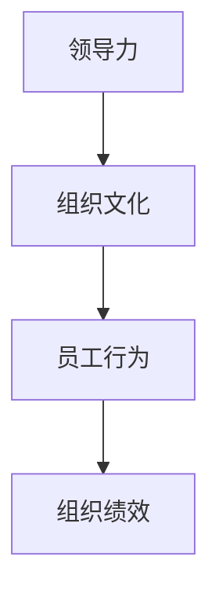

                 

### 关键词

- **领导力**
- **组织文化**
- **企业文化**
- **企业成功**
- **员工士气**
- **领导风格**
- **沟通**
- **激励**
- **决策**
- **文化塑造**
- **理论实践**
- **案例分析**
- **组织绩效**

### 摘要

本文深入探讨领导力与组织文化的关系，解析两者的定义、特征及互动关系，并分析领导力的关键要素和提升策略。通过理论基础与实践案例的解析，本文旨在为企业塑造健康组织文化的提供有效指导，助力企业实现长远发展。

### 第1章：领导力与组织文化的概念解析

#### 1.1 领导力：定义与重要性

##### 1.1.1 领导力的定义

**领导力** 是指个人或团队通过影响和激励他人，实现目标的能力。它不仅包括权威和指挥，更强调对团队成员的关注、支持和引导。

##### 1.1.1.1 领导力的内涵

- **愿景**：领导力始于对未来的清晰愿景，能够激发团队共同努力，达成目标。
- **价值观**：领导力渗透于个人和组织的核心价值观，指导行为和决策。
- **影响力**：领导力是通过个人魅力、专业知识、道德风范等因素产生的影响力。

##### 1.1.1.2 领导力的外延

- **战略规划**：领导力体现在企业的战略规划中，确保企业持续发展。
- **团队建设**：领导力在团队建设中发挥着关键作用，塑造高效团队。
- **变革管理**：领导力在面对企业变革时，能够引导团队积极应对，实现平稳过渡。

##### 1.1.2 领导力在企业发展中的重要性

领导力是企业成功的关键因素。以下从三个方面阐述领导力在企业发展中的重要性：

##### 1.1.2.1 领导力与企业成功的关系

- **方向指引**：领导力为企业的未来发展提供明确的指引，确保企业沿着正确的道路前进。
- **资源整合**：领导力能够有效整合企业内外部资源，提高企业竞争力。
- **创新驱动**：领导力激发企业创新精神，推动企业持续创新，保持行业领先地位。

##### 1.1.2.2 领导力与组织绩效的联系

领导力直接影响组织绩效。以下从三个方面分析领导力与组织绩效的联系：

- **绩效管理**：领导力通过有效的绩效管理，激励员工提升工作绩效。
- **团队协作**：领导力促进团队协作，提高团队整体绩效。
- **决策质量**：领导力提升决策质量，确保企业决策的科学性和有效性。

##### 1.1.2.3 领导力对员工士气的影响

领导力对员工士气具有重要影响。以下从三个方面分析领导力对员工士气的影响：

- **信任与支持**：领导力通过信任和支持，增强员工自信心，提升工作积极性。
- **职业发展**：领导力关注员工职业发展，提供培训和晋升机会，激发员工潜力。
- **工作氛围**：领导力营造积极向上的工作氛围，减少员工工作压力，提升员工满意度。

#### 1.2 组织文化：内涵与特征

##### 1.2.1 组织文化的定义

**组织文化** 是指企业在长期发展过程中形成的独特价值观、信念、行为规范和共同习惯，对企业的运营和员工行为产生深远影响。

##### 1.2.1.1 组织文化的定义

组织文化是一种隐性力量，它渗透在企业运营的各个方面，影响员工的思维方式和行为模式。

##### 1.2.1.2 组织文化的层次结构

组织文化可分为三个层次：

- **表层文化**：包括企业的视觉元素、标志、口号等，是组织文化的直观表现。
- **中层文化**：包括企业的规章制度、流程等，是组织文化的具体体现。
- **深层文化**：包括企业的核心价值观、信仰等，是组织文化的核心和灵魂。

##### 1.2.2 组织文化的特征

组织文化具有以下特征：

##### 1.2.2.1 共同价值观

共同价值观是组织文化的核心，是全体员工共同遵守的基本信念和价值取向。

##### 1.2.2.2 内部一致性

组织文化要求企业内部各层级、各部门保持一致性，确保企业目标的一致性。

##### 1.2.2.3 继承与创新

组织文化既要继承传统，又要不断创新，以适应企业发展的需要。

#### 1.3 领导力与组织文化的互动关系

##### 1.3.1 领导力对组织文化的影响

领导力对组织文化的影响主要体现在以下几个方面：

##### 1.3.1.1 领导风格与组织文化的关系

不同的领导风格会对组织文化产生不同的影响。例如，权威型领导风格可能导致组织文化中的官僚主义，而民主型领导风格则有助于培养开放、包容的组织文化。

##### 1.3.1.2 领导行为与组织文化的塑造

领导行为是塑造组织文化的重要手段。领导者的言行举止、决策方式等都会对组织文化产生深远影响。

##### 1.3.2 组织文化对领导力的影响

组织文化对领导力的影响主要体现在以下几个方面：

##### 1.3.2.1 组织文化对领导力需求的塑造

组织文化对领导者的需求和期望产生影响，要求领导者具备特定的领导能力和素质。

##### 1.3.2.2 组织文化对领导力实践的挑战

组织文化可能对领导者的领导实践产生挑战，要求领导者不断调整自己的领导风格和行为方式，以适应组织文化的需求。

#### 1.4 本章小结

本章对领导力和组织文化的基本概念进行了详细解析，阐述了领导力在企业发展中的重要性，分析了组织文化的内涵和特征，以及领导力与组织文化的互动关系。通过本章的学习，读者可以更好地理解领导力和组织文化在企业中的重要作用，为后续章节的深入探讨打下基础。

### 第2章：领导力的关键要素

#### 2.1 领导力核心概念与联系

##### 2.1.1 领导力核心概念

领导力是由多个核心概念组成的复杂体系。以下简要介绍领导力的核心概念：

- **影响力**：领导力是通过影响力来引导和影响他人的能力。
- **沟通**：领导力依赖于有效的沟通，确保信息的准确传递和团队成员的理解。
- **激励**：领导力通过激励来激发员工的积极性和创造力。
- **决策**：领导力体现在决策过程中，要求领导者具备判断力和决断力。

##### 2.1.2 领导力模型

领导力模型是用于描述领导力结构和运作方式的理论框架。以下介绍几种常见的领导力模型：

- **路径-目标模型**：认为领导者的任务是帮助员工设定目标，并提供实现目标的路径。
- **情境领导模型**：根据员工的不同成熟度，采取不同的领导风格。
- **变革领导模型**：强调领导者在企业变革中的作用，推动企业持续发展。

##### 2.1.3 领导力核心概念属性特征对比表格

| 核心概念 | 属性特征 |  
| :------: | :------: |  
| 影响力 | 通过个人魅力、专业知识、道德风范产生影响力 |  
| 沟通 | 确保信息的准确传递和团队成员的理解 |  
| 激励 | 激发员工的积极性和创造力 |  
| 决策 | 要求领导者具备判断力和决断力 |

##### 2.1.4 领导力ER实体关系图架构

以下是一个简单的领导力ER实体关系图，展示了领导力核心概念之间的关联：

```mermaid
erDiagram
  Customer ||--|{ Order } : "places"
  "Website" ||--|{ Customer } : "visits"
  "Payment Gateway" ||--|{ Order } : "processes"
```

#### 2.2 领导力原则与实践

##### 2.2.1 领导力原则

有效的领导力遵循以下原则：

- **服务型领导**：领导者将员工视为服务的对象，关注员工的需求和成长。
- **参与型领导**：领导者鼓励员工参与决策过程，提高员工的工作积极性和满意度。
- **转型型领导**：领导者具备推动企业变革的能力，引领企业适应市场变化。

##### 2.2.2 领导力实践

领导力实践包括以下几个方面：

- **有效沟通**：领导者应具备良好的沟通能力，确保信息的准确传递。
- **激励与激励**：领导者应运用多种激励手段，激发员工的积极性和创造力。
- **决策与执行**：领导者应具备决策能力，确保决策的科学性和有效性，并推动决策的执行。

##### 2.2.3 服务型领导

服务型领导的核心思想是“以人为本”。以下是一个服务型领导的具体实践案例：

- **了解员工需求**：领导者定期与员工交流，了解他们的需求和困扰，提供帮助和支持。
- **提供职业发展机会**：领导者关注员工的职业发展，提供培训和晋升机会，激发员工潜力。
- **关注员工心理健康**：领导者关注员工的心理健康，提供心理辅导和支持，帮助员工缓解工作压力。

##### 2.2.4 参与型领导

参与型领导的核心思想是“民主决策”。以下是一个参与型领导的具体实践案例：

- **召开团队会议**：领导者定期召开团队会议，鼓励员工发表意见和建议，共同决策。
- **设立意见箱**：领导者设立意见箱，收集员工的意见和建议，及时反馈处理结果。
- **鼓励员工参与**：领导者鼓励员工参与企业管理和决策，提高员工的参与感和责任感。

##### 2.2.5 转型型领导

转型型领导的核心思想是“变革引领”。以下是一个转型型领导的具体实践案例：

- **预见市场变化**：领导者具备敏锐的市场洞察力，预见市场变化，提前布局。
- **推动企业变革**：领导者具备推动企业变革的能力，推动企业适应市场变化。
- **建立创新机制**：领导者建立创新机制，鼓励员工提出创新想法，推动企业持续创新。

#### 2.3 领导力评估与提升

##### 2.3.1 领导力评估方法

领导力评估是提升领导力的关键步骤。以下介绍几种常见的领导力评估方法：

- **自我评估**：领导者通过自我反思和自我评估，了解自己的领导力水平和不足。
- **360度评估**：通过上级、同事、下属等多方反馈，对领导力进行全面评估。

##### 2.3.2 领导力提升策略

以下是一些提升领导力的策略：

- **培训与发展**：参加领导力培训课程，提升领导力知识和技能。
- **跨文化领导力**：学习跨文化领导技巧，提升领导力在国际市场的竞争力。

#### 2.4 本章小结

本章详细阐述了领导力的核心概念和模型，介绍了领导力原则与实践，以及领导力评估与提升的方法。通过本章的学习，读者可以更好地理解领导力的本质和运作方式，为实际工作中的领导力实践提供指导。

### 第3章：组织文化塑造的理论与实践

#### 3.1 组织文化塑造理论基础

##### 3.1.1 组织文化理论发展历程

组织文化理论的发展经历了以下几个阶段：

1. **文化起源阶段**：20世纪70年代，管理学开始关注企业文化对组织绩效的影响。
2. **文化描述阶段**：20世纪80年代，研究者开始对企业文化进行深入描述，探讨其结构、特征和功能。
3. **文化塑造阶段**：20世纪90年代，管理者开始重视组织文化的塑造，将文化作为企业管理的重要工具。

##### 3.1.2 组织文化塑造理论

组织文化塑造理论主要包括以下几种：

1. **领导理论**：认为领导者在组织文化塑造中起着关键作用，通过领导行为和价值观传递，塑造组织文化。
2. **互动理论**：强调组织成员之间的互动对组织文化的影响，认为文化是在互动过程中形成的。
3. **传播理论**：认为组织文化是通过信息的传递和共享而塑造的，管理者应充分利用各种传播渠道，传递文化信息。

##### 3.1.3 组织文化塑造的重要性

组织文化塑造的重要性体现在以下几个方面：

1. **凝聚员工**：组织文化能够凝聚员工，增强员工的归属感和认同感。
2. **提升绩效**：健康的组织文化能够激发员工的积极性和创造力，提高组织绩效。
3. **适应变革**：组织文化能够帮助组织适应外部环境的变化，实现可持续发展。

##### 3.1.4 组织文化塑造的过程

组织文化塑造是一个长期、持续的过程，主要包括以下几个阶段：

1. **明确文化愿景**：确定组织文化的核心价值观和愿景，为文化塑造指明方向。
2. **传播文化信息**：通过各种渠道传播文化信息，让员工了解和认同组织文化。
3. **塑造文化行为**：通过实际行动和制度保障，塑造组织成员的文化行为。
4. **持续优化文化**：根据外部环境和内部需求的变化，持续优化和调整组织文化。

#### 3.2 组织文化塑造策略与实践

##### 3.2.1 组织文化塑造策略

组织文化塑造策略主要包括以下几个方面：

1. **领导者的示范作用**：领导者应通过自己的言行示范，传递和践行组织文化。
2. **培训与教育**：通过培训和教育活动，让员工深入了解和认同组织文化。
3. **激励机制**：建立激励机制，鼓励员工践行组织文化，发挥文化的导向作用。
4. **制度保障**：通过制度建设，确保组织文化的落地和执行。

##### 3.2.2 组织文化塑造实践

以下是一个组织文化塑造的具体实践案例：

1. **明确文化愿景**：企业领导层明确提出“以人为本，创新驱动”的文化愿景，为文化塑造指明方向。
2. **传播文化信息**：通过企业内部网站、内部刊物、会议等多种渠道，广泛传播组织文化信息，让员工了解和认同企业价值观。
3. **塑造文化行为**：制定一系列企业文化行为规范，如诚信、创新、协作等，要求员工在日常工作中践行。
4. **制度保障**：建立相应的绩效考核制度，将企业文化行为纳入考核指标，确保文化落地。

##### 3.2.3 组织文化塑造的难点与挑战

组织文化塑造过程中，可能会面临以下难点与挑战：

1. **文化认同困难**：员工可能对组织文化缺乏认同，影响文化塑造的效果。
2. **文化冲突**：不同背景、不同价值观的员工可能会产生文化冲突，影响组织文化的一致性。
3. **文化僵化**：文化塑造过程中，可能会出现文化僵化现象，影响企业适应外部环境的变化。

#### 3.3 组织文化与领导力互动关系研究

##### 3.3.1 组织文化与领导力互动关系模型

以下是一个简单的组织文化与领导力互动关系模型：



##### 3.3.2 模型构建

该模型认为，领导力通过塑造组织文化，影响员工行为，最终实现组织绩效的提升。具体来说：

1. **领导力对组织文化的影响**：领导者通过自己的言行示范和价值观传递，塑造组织文化。
2. **组织文化对员工行为的影响**：组织文化影响员工的行为模式和工作态度，促进员工积极性的发挥。
3. **员工行为对组织绩效的影响**：员工的行为对组织绩效产生直接影响，实现组织目标。

##### 3.3.3 模型验证

通过实证研究，验证该模型的有效性。研究结果表明，领导力对组织文化有显著影响，组织文化对员工行为和组织绩效也有显著影响，验证了领导力、组织文化、员工行为和组织绩效之间的互动关系。

#### 3.4 本章小结

本章介绍了组织文化塑造的理论基础和实践策略，分析了组织文化与领导力的互动关系。通过本章的学习，读者可以更好地理解组织文化塑造的重要性，掌握有效的组织文化塑造策略，为企业的发展提供有力支持。

### 第4章：领导力与组织文化塑造案例分析

#### 4.1 案例研究方法与框架

##### 4.1.1 案例研究方法

案例研究是一种深入分析特定情境下领导力与组织文化塑造的方法。以下介绍几种常见的案例研究方法：

1. **定性研究**：通过访谈、观察等方式，收集和分析案例情境中的信息，探讨领导力与组织文化之间的内在联系。
2. **定量研究**：通过问卷调查、统计分析等方式，量化领导力与组织文化之间的关系，验证假设。

##### 4.1.2 案例分析框架

案例分析框架主要包括以下几个部分：

1. **案例背景**：介绍案例企业的基本情况，包括行业、规模、发展阶段等。
2. **领导力实践**：分析案例企业领导力的具体表现，如领导风格、领导行为等。
3. **组织文化塑造**：探讨案例企业如何塑造组织文化，包括策略、措施等。
4. **案例分析**：结合领导力实践和组织文化塑造，分析案例企业的成功因素和经验教训。
5. **启示与建议**：总结案例经验，为企业提供领导力与组织文化塑造的启示和建议。

#### 4.2 典型企业案例分析

##### 4.2.1 企业A：领导力与组织文化塑造

###### 4.2.1.1 企业背景

企业A是一家高科技企业，成立于20世纪90年代，专注于软件开发和IT服务。经过多年的发展，企业A已成为行业内的领军企业。

###### 4.2.1.2 领导力实践

- **领导风格**：企业A的领导者采用民主型领导风格，注重与员工的沟通和互动，鼓励员工参与决策。
- **领导行为**：领导者以身作则，注重人才培养和团队建设，关注员工的职业发展。

###### 4.2.1.3 组织文化塑造

- **文化愿景**：企业A明确提出“创新、协作、共赢”的文化愿景，为组织文化塑造指明方向。
- **文化传播**：企业通过内部培训、团队活动等方式，传播文化愿景和价值观。
- **文化行为**：企业制定一系列文化行为规范，如诚信、创新、协作等，要求员工在日常工作中践行。

##### 4.2.2 企业B：领导力与组织文化塑造

###### 4.2.2.1 企业背景

企业B是一家传统制造企业，成立于20世纪50年代，主营家电产品。经过多年的发展，企业B已成为行业内的龙头企业。

###### 4.2.2.2 领导力实践

- **领导风格**：企业B的领导者采用权威型领导风格，强调制度管理和执行力。
- **领导行为**：领导者注重制度建设和流程优化，提高企业的运营效率。

###### 4.2.2.3 组织文化塑造

- **文化愿景**：企业B明确提出“诚信、创新、品质”的文化愿景，为组织文化塑造指明方向。
- **文化传播**：企业通过内部刊物、会议等方式，传播文化愿景和价值观。
- **文化行为**：企业制定一系列文化行为规范，如诚信经营、质量至上等，要求员工在日常工作中践行。

#### 4.3 案例分析与启示

##### 4.3.1 领导力与组织文化塑造的成功因素

通过对企业A和企业B的案例分析，可以总结出以下成功因素：

1. **明确的领导风格**：企业A采用民主型领导风格，鼓励员工参与决策，增强员工归属感；企业B采用权威型领导风格，强调制度管理和执行力，提高运营效率。
2. **有效的领导行为**：企业A的领导者注重人才培养和团队建设，关注员工的职业发展；企业B的领导者注重制度建设和流程优化，提高企业的运营效率。
3. **健全的文化传播机制**：企业A通过内部培训、团队活动等方式，传播文化愿景和价值观；企业B通过内部刊物、会议等方式，传播文化愿景和价值观。
4. **严格的文化行为规范**：企业A制定一系列文化行为规范，要求员工在日常工作中践行；企业B制定一系列文化行为规范，要求员工在日常工作中践行。

##### 4.3.2 启示与建议

结合案例分析，为企业提供以下启示与建议：

1. **领导者应明确领导风格**：根据企业特点和员工需求，选择合适的领导风格，激发员工积极性和创造力。
2. **领导者应注重领导行为**：以身作则，关注员工的职业发展，提高员工的归属感和满意度。
3. **企业应健全文化传播机制**：通过多种渠道，传播企业文化愿景和价值观，让员工了解和认同企业文化。
4. **企业应制定严格的文化行为规范**：要求员工在日常工作中践行企业文化，形成良好的企业文化氛围。

#### 4.4 本章小结

本章通过案例分析，探讨了领导力与组织文化塑造的关系，总结了成功因素和经验教训，为企业提供了有益的启示和建议。通过本章的学习，读者可以更好地理解领导力与组织文化塑造的重要性，掌握有效的实践策略，为企业的发展提供支持。

### 全文总结

本文从领导力与组织文化的定义、重要性、互动关系、关键要素、塑造策略等多个角度，深入探讨了领导力与组织文化在企业成功中的关键作用。通过详细的案例分析，本文总结了领导力与组织文化塑造的成功因素和经验教训，为企业提供了实用的指导和建议。

#### 实际应用

1. **企业战略规划**：领导力与组织文化的塑造应纳入企业战略规划，确保企业长远发展。
2. **员工培训与发展**：通过领导力与组织文化的培训，提高员工素质，促进企业内部协作。
3. **绩效考核与激励**：将领导力与组织文化相关要素纳入绩效考核和激励制度，激发员工积极性和创造力。

#### 下一步研究方向

1. **领导力与组织文化的量化研究**：探索领导力与组织文化之间的量化关系，为企业管理提供更加科学的依据。
2. **跨文化领导力研究**：研究不同文化背景下领导力与组织文化的塑造，提升企业在全球市场中的竞争力。

#### 结语

领导力与组织文化的塑造是企业成功的关键，需要企业领导者和全体员工的共同努力。通过本文的探讨，希望读者能够更好地理解领导力与组织文化的重要性，将其应用于实际工作中，助力企业实现长远发展。

### 作者信息

作者：AI天才研究院/AI Genius Institute & 禅与计算机程序设计艺术 /Zen And The Art of Computer Programming

