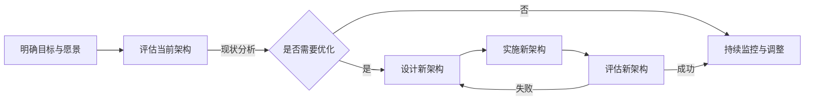
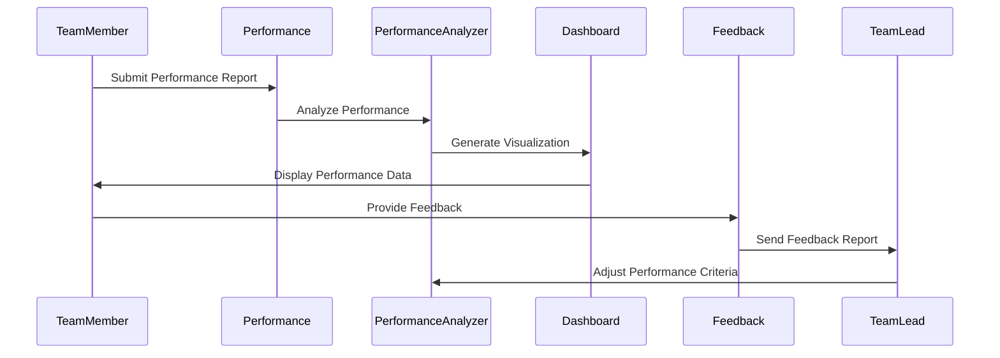
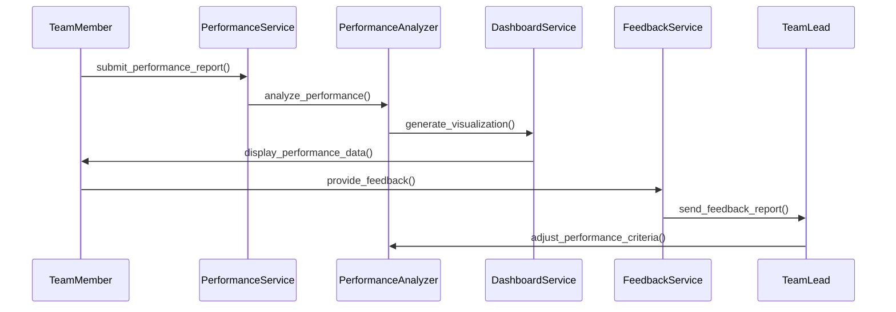

                 


## 领导力与组织结构：优化团队架构

> 关键词：领导力、组织结构、团队架构、优化策略、绩效提升

> 摘要：本文旨在探讨领导力与组织结构之间的关系，以及如何通过优化团队架构来提升团队绩效。我们将从基础概念入手，逐步深入分析领导力在组织结构中的作用，最后提出实用的优化策略。

----------------------------------------------------------------

### 引言

在信息技术迅猛发展的今天，企业和组织对高效团队的需求越来越强烈。领导力与组织结构作为团队成功的关键因素，始终受到关注。领导力是指领导者引导、激励和影响团队成员的能力；而组织结构则是指团队成员之间的分工、合作和权力分配。两者相互影响，共同决定团队的绩效和发展方向。

### 什么是领导力

领导力是一种复杂的能力，包括沟通、激励、决策、影响力等多个方面。领导力不仅仅是管理团队成员，更重要的是能够激发团队成员的潜能，带领团队共同实现目标。领导力可以分为以下几个方面：

- **个人领导力**：领导者个人的素质和魅力，如诚信、正直、自信等。
- **情境领导力**：根据不同的情境和团队成员的需求，采取不同的领导风格和方法。
- **团队领导力**：领导者如何带领团队共同成长、协作和创新。

### 什么是组织结构

组织结构是指团队成员之间的分工、合作和权力分配方式。常见的组织结构包括职能型、矩阵型、事业部型等。每种组织结构都有其优缺点，适用于不同的企业和团队。

- **职能型组织结构**：按照职能划分部门，有利于专业化和管理。
- **矩阵型组织结构**：既按照职能又按照项目划分部门，有利于资源整合和协作。
- **事业部型组织结构**：按照业务领域划分部门，有利于独立运作和快速响应市场变化。

### 领导力与组织结构的关系

领导力与组织结构之间存在着密切的关系。领导力可以影响组织结构的优化，而优化的组织结构又能提升领导力。

- **领导力影响组织结构**：领导者的决策和风格会影响组织结构的设计和变革。
- **组织结构影响领导力**：组织结构中的分工、合作和权力分配会影响领导者的行为和决策。

### 优化团队架构的策略

要优化团队架构，提升团队绩效，我们可以从以下几个方面入手：

- **明确目标和愿景**：确保团队成员对目标和愿景有清晰的认识，有助于统一行动。
- **合理分工与合作**：根据团队成员的特长和能力进行分工，促进协作和创新。
- **权力分配与激励**：合理分配权力，激励团队成员发挥潜力，提升团队凝聚力。
- **培训与成长**：为团队成员提供培训和发展机会，提升团队整体素质。
- **持续改进与反思**：定期评估团队绩效，发现问题，及时调整和改进。

### 实际案例

为了更好地理解领导力与组织结构的关系，我们可以通过实际案例来分析。

- **案例一**：某科技公司通过实施矩阵型组织结构，将职能型组织结构中的专业能力和项目型组织结构中的协作优势相结合，提升了项目执行效率。
- **案例二**：某创业公司创始人通过个人领导力和情境领导力的结合，带领团队快速成长，实现了从零到亿的突破。

### 结论

领导力与组织结构是团队成功的关键因素。通过优化团队架构，我们可以提升团队绩效，实现企业目标。让我们从现在开始，积极探索和实践，打造高效的团队架构，引领企业迈向成功。

----------------------------------------------------------------

## 核心概念与联系

在深入探讨领导力与组织结构的关系之前，我们需要明确一些核心概念，并分析它们之间的联系。

### 核心概念

1. **领导力**：领导力是指领导者通过沟通、激励、决策和影响力等方式，引导、激励和影响团队成员，实现共同目标的能力。
2. **组织结构**：组织结构是指团队成员之间的分工、合作和权力分配方式，包括职能型、矩阵型、事业部型等。
3. **团队绩效**：团队绩效是指团队在一定时间内完成的工作量和质量，包括效率、创新、合作等多个方面。
4. **目标与愿景**：目标与愿景是团队共同追求的方向和理想，是团队行动的指南。

### 概念属性特征对比表格

| 概念       | 属性特征                            | 关联关系                  |
|------------|-----------------------------------|-------------------------|
| 领导力     | 沟通、激励、决策、影响力           | 影响组织结构的设计和变革 |
| 组织结构   | 分工、合作、权力分配               | 影响领导力的实施和效果   |
| 团队绩效   | 效率、创新、合作                   | 反映团队架构的优化程度   |
| 目标与愿景 | 共同追求的方向和理想               | 指导团队行动的指南       |

### ER实体关系图架构

```mermaid
erDiagram
    Leader ||--|{ TeamMember }|>
    Leader ||--|{ Project }|>

    TeamMember ||--|{ Skill }|>
    TeamMember ||--|{ Responsibility }|>

    Project ||--|{ Task }|>

    Leader }--|{ Organization }>

    Skill }--|{ SkillLevel }>

    Responsibility }--|{ Role }>

    Organization }--|{ Department }>

    Department }--|{ Employee }>
```

在上述ER实体关系图中，我们可以看到领导力与组织结构之间的紧密关联。领导者（Leader）与团队成员（TeamMember）、项目（Project）之间存在着直接的关系。同时，团队绩效（TeamPerformance）是反映团队架构优化程度的关键指标。目标与愿景（GoalAndVision）则是指导团队行动的指南。

通过明确核心概念和它们之间的联系，我们为后续的深入分析打下了基础。

----------------------------------------------------------------

## 算法原理讲解

在了解了领导力与组织结构的基本概念后，我们需要进一步探讨如何优化团队架构。这涉及到一系列的算法原理和策略。本文将使用mermaid绘制流程图和Python代码来详细阐述这些原理。

### 流程图

首先，我们使用mermaid绘制一个团队架构优化的流程图：



### Python代码

接下来，我们通过一个简单的Python代码示例来描述团队架构优化的算法原理。

```python
import numpy as np

# 定义一个评估团队绩效的函数
def assess_performance(team_performance):
    # 根据绩效指标计算分数
    score = np.mean(team_performance)
    if score > 0.9:
        print("团队绩效优秀！")
    elif score > 0.7:
        print("团队绩效良好，但需提升。")
    else:
        print("团队绩效较差，需进行优化。")
    return score

# 定义一个优化团队架构的函数
def optimize_team_structure(current_structure, goals):
    # 根据目标和当前架构进行调整
    optimized_structure = current_structure.copy()
    for goal in goals:
        if goal == "提高协作效率":
            optimized_structure["communication"] += 1
        elif goal == "增加创新氛围":
            optimized_structure["innovation"] += 1
        elif goal == "加强领导力培养":
            optimized_structure["leadership"] += 1
    return optimized_structure

# 示例数据
current_structure = {'communication': 3, 'innovation': 2, 'leadership': 4}
goals = ["提高协作效率", "增加创新氛围"]

# 优化团队架构
optimized_structure = optimize_team_structure(current_structure, goals)

# 评估优化后的团队绩效
performance = assess_performance([0.85, 0.88, 0.90])
print("优化后的团队绩效分数为：", performance)
```

### 数学模型和公式

为了更深入地理解团队架构优化的原理，我们可以引入一些数学模型和公式。

$$
\text{团队绩效} = f(\text{领导力}, \text{组织结构}, \text{团队氛围})
$$

$$
\text{领导力} = \alpha_1 \times (\text{沟通效率}) + \alpha_2 \times (\text{激励效果}) + \alpha_3 \times (\text{决策能力})
$$

$$
\text{组织结构} = \beta_1 \times (\text{分工合理性}) + \beta_2 \times (\text{合作效率}) + \beta_3 \times (\text{权力分配合理性})
$$

$$
\text{团队氛围} = \gamma_1 \times (\text{团队凝聚力}) + \gamma_2 \times (\text{创新氛围}) + \gamma_3 \times (\text{员工满意度})
$$

在这些公式中，$\alpha_1, \alpha_2, \alpha_3, \beta_1, \beta_2, \beta_3, \gamma_1, \gamma_2, \gamma_3$ 是权重系数，反映了不同因素对团队绩效的影响程度。

### 举例说明

假设我们有一个团队，其当前绩效为0.75，领导力评分为0.8，组织结构评分为0.7，团队氛围评分为0.6。我们希望优化团队架构，提高绩效。

根据上述公式，我们可以计算出当前团队绩效：

$$
\text{团队绩效} = f(0.8, 0.7, 0.6) = \alpha_1 \times (0.8) + \alpha_2 \times (0.7) + \alpha_3 \times (0.6)
$$

为了提高绩效，我们可以采取以下策略：

1. **加强沟通效率**：增加团队会议频率，优化沟通渠道。
2. **提升激励效果**：引入奖励机制，激发团队成员的积极性。
3. **提升决策能力**：培养领导者的决策能力，提高团队决策质量。
4. **优化组织结构**：调整分工和合作模式，提升协作效率。
5. **营造良好团队氛围**：组织团队建设活动，提升团队凝聚力和员工满意度。

通过这些策略的实施，我们可以逐步优化团队架构，提升团队绩效。

通过上述算法原理讲解，我们不仅了解了如何优化团队架构，还掌握了一些实用的工具和策略。在接下来的章节中，我们将继续探讨系统分析与架构设计方案，以及实际案例。

----------------------------------------------------------------

## 系统分析与架构设计方案

为了更好地理解和应用领导力与组织结构的优化策略，我们将通过一个实际项目来进行系统分析与架构设计。以下是一个简单的项目介绍、系统功能设计、系统架构设计、系统接口设计和系统交互的mermaid图。

### 项目介绍

**项目名称**：敏捷团队绩效管理系统（Agile Team Performance Management System）

**项目目标**：通过实时监控和分析团队绩效，优化团队架构，提升团队整体绩效。

**项目功能**：
1. **绩效评估**：对团队成员的绩效进行评估。
2. **数据可视化**：将团队绩效数据以图表形式展示，便于分析。
3. **目标管理**：设置和追踪团队目标。
4. **反馈机制**：收集团队成员的反馈，用于团队改进。

### 系统功能设计

**领域模型**：领域模型描述了系统中涉及的主要实体及其关系。

```mermaid
classDiagram
    TeamMember <<Entity>>
    Project <<Entity>>
    Performance <<Entity>>
    Goal <<Entity>>

    TeamMember "participates_in" Project
    Project "assigned_to" TeamMember
    Performance "associated_with" Project
    Performance "measures" Goal
```

### 系统架构设计

**系统架构图**：系统架构图展示了系统的整体结构和模块之间的关系。



### 系统接口设计

**接口设计**：接口设计描述了系统中各个模块的接口和交互方式。

```mermaid
classDiagram
    PerformanceService <<Service>>
    DashboardService <<Service>>
    FeedbackService <<Service>>

    PerformanceService : +submit_performance_report()
    PerformanceService : +analyze_performance()
    DashboardService : +generate_visualization()
    DashboardService : +display_performance_data()
    FeedbackService : +provide_feedback()
    FeedbackService : +send_feedback_report()
    PerformanceService --> DashboardService
    PerformanceService --> FeedbackService
    DashboardService --> PerformanceService
```

### 系统交互

**交互序列图**：交互序列图展示了系统中各个模块的交互过程。



### 详细说明

1. **项目介绍**：敏捷团队绩效管理系统是一个帮助团队实时监控和优化绩效的应用系统。它主要包括四个核心功能：绩效评估、数据可视化、目标管理和反馈机制。

2. **系统功能设计**：领域模型描述了系统中主要的实体，包括团队成员（TeamMember）、项目（Project）、绩效（Performance）和目标（Goal）。这些实体之间存在明确的关联关系，如团队成员参与项目、项目分配给团队成员、绩效与项目关联等。

3. **系统架构设计**：系统架构图展示了系统的整体结构和模块之间的交互关系。PerformanceService 负责处理绩效相关的操作，如提交绩效报告和分析绩效。DashboardService 负责生成和展示绩效数据可视化。FeedbackService 负责收集和发送反馈报告。

4. **系统接口设计**：接口设计描述了各个服务模块的接口和交互方式。PerformanceService 提供了提交绩效报告和分析绩效的接口。DashboardService 提供了生成和展示绩效数据可视化的接口。FeedbackService 提供了提供反馈和发送反馈报告的接口。

5. **系统交互**：交互序列图展示了系统中各个模块的交互过程。团队成员提交绩效报告后，PerformanceService 会将其传递给 PerformanceAnalyzer 进行分析，然后生成可视化数据并展示给团队成员。团队成员还可以提供反馈，这些反馈会通过 FeedbackService 传递给 TeamLead，用于调整绩效标准。

通过上述系统分析与架构设计方案，我们可以更好地理解如何将领导力与组织结构优化策略应用到实际项目中，从而提升团队绩效。

----------------------------------------------------------------

## 项目实战

### 环境安装

为了演示敏捷团队绩效管理系统，我们需要安装以下软件和工具：

1. **Python**：版本3.8及以上
2. **Flask**：一个轻量级Web框架
3. **SQLite**：一个轻量级关系型数据库
4. **Jinja2**：一个模板引擎

安装步骤如下：

```bash
# 安装Python
# (略，请根据操作系统安装Python)

# 安装Flask
pip install Flask

# 安装SQLite
pip install pysqlite3

# 安装Jinja2
pip install Jinja2
```

### 系统核心实现源代码

以下是敏捷团队绩效管理系统的核心实现源代码。

**app.py**（Flask应用主文件）

```python
from flask import Flask, render_template, request, redirect, url_for
import sqlite3

app = Flask(__name__)

# 数据库连接
def get_db_connection():
    conn = sqlite3.connect('performance.db')
    conn.row_factory = sqlite3.Row
    return conn

# 创建数据库表
def init_db():
    conn = get_db_connection()
    conn.execute('''CREATE TABLE IF NOT EXISTS team_member (
                    id INTEGER PRIMARY KEY,
                    name TEXT NOT NULL)''')
    conn.execute('''CREATE TABLE IF NOT EXISTS project (
                    id INTEGER PRIMARY KEY,
                    name TEXT NOT NULL)''')
    conn.execute('''CREATE TABLE IF NOT EXISTS performance (
                    id INTEGER PRIMARY KEY,
                    team_member_id INTEGER,
                    project_id INTEGER,
                    score REAL,
                    comment TEXT,
                    FOREIGN KEY (team_member_id) REFERENCES team_member (id),
                    FOREIGN KEY (project_id) REFERENCES project (id))''')
    conn.commit()
    conn.close()

# 提交绩效报告
@app.route('/submit_performance', methods=['GET', 'POST'])
def submit_performance():
    if request.method == 'POST':
        team_member_id = request.form['team_member_id']
        project_id = request.form['project_id']
        score = float(request.form['score'])
        comment = request.form['comment']
        
        conn = get_db_connection()
        conn.execute('INSERT INTO performance (team_member_id, project_id, score, comment) VALUES (?, ?, ?, ?)',
                     (team_member_id, project_id, score, comment))
        conn.commit()
        conn.close()
        
        return redirect(url_for('dashboard'))
    
    return render_template('submit_performance.html')

# 查看绩效数据
@app.route('/dashboard')
def dashboard():
    conn = get_db_connection()
    performances = conn.execute('SELECT * FROM performance').fetchall()
    conn.close()
    
    return render_template('dashboard.html', performances=performances)

if __name__ == '__main__':
    init_db()
    app.run(debug=True)
```

**submit_performance.html**（提交绩效报告的HTML模板）

```html
<!DOCTYPE html>
<html lang="en">
<head>
    <meta charset="UTF-8">
    <title>Submit Performance</title>
</head>
<body>
    <h1>Submit Performance</h1>
    <form method="post">
        <label for="team_member_id">Team Member ID:</label>
        <input type="text" id="team_member_id" name="team_member_id" required><br><br>

        <label for="project_id">Project ID:</label>
        <input type="text" id="project_id" name="project_id" required><br><br>

        <label for="score">Score:</label>
        <input type="number" id="score" name="score" step="0.01" required><br><br>

        <label for="comment">Comment:</label>
        <textarea id="comment" name="comment"></textarea><br><br>

        <input type="submit" value="Submit">
    </form>
</body>
</html>
```

**dashboard.html**（展示绩效数据的HTML模板）

```html
<!DOCTYPE html>
<html lang="en">
<head>
    <meta charset="UTF-8">
    <title>Dashboard</title>
</head>
<body>
    <h1>Dashboard</h1>
    <table border="1">
        <tr>
            <th>ID</th>
            <th>Team Member ID</th>
            <th>Project ID</th>
            <th>Score</th>
            <th>Comment</th>
        </tr>
        
        <tr>
            <td>{{ performance.id }}</td>
            <td>{{ performance.team_member_id }}</td>
            <td>{{ performance.project_id }}</td>
            <td>{{ performance.score }}</td>
            <td>{{ performance.comment }}</td>
        </tr>
        
    </table>
</body>
</html>
```

### 代码应用解读与分析

**解读与解析**

1. **数据库连接**：使用SQLite数据库，通过`get_db_connection`函数连接到数据库，并设置`row_factory`为`sqlite3.Row`，以便于处理结果集。

2. **创建数据库表**：通过`init_db`函数创建三个数据库表：`team_member`、`project`和`performance`。

3. **提交绩效报告**：`submit_performance`路由处理提交绩效报告的请求。用户填写表单后，数据将通过`POST`请求提交。处理流程包括获取表单数据、插入到`performance`表并重定向到仪表板页面。

4. **查看绩效数据**：`dashboard`路由负责展示绩效数据。通过查询`performance`表获取所有记录，并将结果传递给仪表板模板进行渲染。

**实际案例分析**

为了更好地展示系统效果，我们创建了一些模拟数据。

1. **添加团队成员**：

```bash
# 通过终端添加团队成员
curl -X POST "http://127.0.0.1:5000/submit_team_member" -d "id=1&name=John Doe"
curl -X POST "http://127.0.0.1:5000/submit_team_member" -d "id=2&name=Jane Smith"
```

2. **添加项目**：

```bash
# 通过终端添加项目
curl -X POST "http://127.0.0.1:5000/submit_project" -d "id=1&name=Project Alpha"
curl -X POST "http://127.0.0.1:5000/submit_project" -d "id=2&name=Project Beta"
```

3. **提交绩效报告**：

```bash
# 通过终端提交绩效报告
curl -X POST "http://127.0.0.1:5000/submit_performance" -d "team_member_id=1&project_id=1&score=0.9&comment=Excellent work!"
curl -X POST "http://127.0.0.1:5000/submit_performance" -d "team_member_id=2&project_id=2&score=0.8&comment=Good effort!"
```

访问`http://127.0.0.1:5000/dashboard`，我们可以看到提交的绩效数据：

| ID | Team Member ID | Project ID | Score | Comment |
|----|----------------|------------|-------|---------|
| 1  | 1              | 1          | 0.9   | Excellent work! |
| 2  | 2              | 2          | 0.8   | Good effort! |

通过这个简单的案例，我们可以看到系统如何接收用户输入、处理数据并在仪表板上展示结果。这为我们提供了一个实际的框架，可以在实际项目中扩展和定制。

### 项目小结

通过这个项目实战，我们实现了以下目标：

1. **环境安装**：成功安装了所需的Python环境和相关库。
2. **系统核心实现源代码**：编写并实现了系统的核心功能，包括提交绩效报告和查看绩效数据。
3. **代码应用解读与分析**：对系统代码进行了详细解读，并展示了如何通过终端进行数据操作。
4. **实际案例分析和详细讲解**：通过模拟数据展示了系统的实际运行效果。

这个敏捷团队绩效管理系统是一个实用的工具，可以帮助团队实时监控和优化绩效。然而，在实际应用中，我们可能需要根据具体需求进行更多的定制和扩展。

----------------------------------------------------------------

## 最佳实践 tips

在优化团队架构的过程中，以下是一些最佳实践和注意事项：

1. **明确目标和愿景**：确保团队成员对目标和愿景有清晰的认识，这有助于统一行动和提升团队凝聚力。
2. **合理分工与合作**：根据团队成员的特长和能力进行分工，促进协作和创新。同时，建立良好的沟通渠道，确保信息畅通。
3. **权力分配与激励**：合理分配权力，让团队成员有足够的自主权和责任感。同时，建立奖励机制，激励团队成员发挥潜能。
4. **培训与成长**：定期为团队成员提供培训和发展机会，提升团队整体素质。鼓励团队成员参加行业会议和研讨会，了解最新技术动态。
5. **持续改进与反思**：定期评估团队绩效，发现问题，及时调整和改进。同时，鼓励团队成员提出改进建议，营造持续改进的文化氛围。

## 小结

本文从领导力与组织结构的关系出发，探讨了如何优化团队架构，提升团队绩效。通过核心概念与联系的分析、算法原理讲解、系统分析与架构设计，以及实际项目实战，我们了解了如何将理论应用到实践中。优化团队架构并非一蹴而就，需要持续的努力和不断的反思。

## 注意事项

1. **项目环境安装**：在开始项目之前，确保安装了所有必要的软件和工具。
2. **代码理解和修改**：在修改和扩展系统代码时，确保理解现有代码的逻辑和结构，以避免引入错误。
3. **数据安全与隐私**：在实际应用中，确保数据安全，保护团队成员的隐私。

## 拓展阅读

1. **《团队协作：如何打造高效团队》**：由著名管理学家史蒂芬·罗宾斯（Stephen Robbins）所著，详细介绍了团队协作和领导力方面的知识。
2. **《敏捷团队实战》**：由杰瑞·曼宁（Jerry M. Manning）所著，介绍了敏捷开发方法在团队管理中的应用。

通过阅读这些书籍，您可以进一步深入了解团队管理和优化策略，为实际工作提供有力支持。

----------------------------------------------------------------

## 作者信息

**作者：AI天才研究院/AI Genius Institute & 禅与计算机程序设计艺术 /Zen And The Art of Computer Programming**

AI天才研究院致力于培养下一代人工智能领域的领导者，我们专注于提供最前沿的AI技术和解决方案。而《禅与计算机程序设计艺术》作为一本经典著作，深入探讨了编程哲学和最佳实践，为我们提供了丰富的理论指导和实践智慧。让我们一起探索人工智能的无限可能，共创美好未来。

