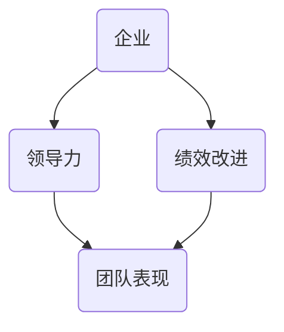

                 

### 第一部分：引言

#### 第1章：问题背景与核心概念

**1.1.1 问题背景**

在当今高度竞争的商业环境中，企业要想获得持续的竞争优势，必须依赖其团队的表现和绩效。然而，许多企业在领导力建设和绩效改进方面面临着诸多挑战。首先，领导力不足成为了一个普遍问题。传统领导力往往强调权威和控制，而忽视了团队成员的参与和积极性，导致团队缺乏创新和执行力。其次，绩效改进困难重重。传统绩效改进方法往往注重事后补救，缺乏前瞻性和系统性，难以实现持续的绩效提升。这些问题直接影响了企业的整体表现，降低了企业的竞争力和市场地位。

**问题解决**

为了解决这些问题，企业需要从系统学习和实践的角度出发，提升领导力和绩效改进能力。首先，企业应加强领导力培训，培养具有现代领导力的领导者。现代领导力强调合作、信任和创新，能够更好地激发团队的潜力。其次，企业应引入先进的绩效改进方法，如平衡计分卡、关键绩效指标（KPI）等，建立系统化的绩效管理体系。通过这些措施，企业可以提升团队的表现和绩效，从而在激烈的市场竞争中立于不败之地。

**边界与外延**

本章节不仅关注企业内部的领导力和绩效改进，还涉及到外部环境对企业领导力和绩效的影响。例如，宏观经济环境、市场竞争状况、政策法规等都会对企业的领导力和绩效改进产生重要影响。因此，企业在制定领导力和绩效改进策略时，需要综合考虑内外部因素，确保策略的有效性和可操作性。

**1.1.2 相关研究与实践**

在国内外，关于领导力和绩效改进的研究和实践已经取得了丰富成果。国外研究主要关注领导力的本质、领导行为与团队绩效的关系，以及绩效改进的方法和工具。例如，领导力四元模型、变革型领导理论等，为领导力的提升提供了理论支持。国内研究则更多关注领导力在特定行业和企业中的应用，以及绩效改进的具体实践方法。例如，华为、阿里巴巴等企业，通过创新的管理实践，实现了领导力和绩效的显著提升。

**国内外领导力与绩效改进研究**

- **领导力研究**：国外研究主要关注领导力的本质和作用，如领导力四元模型、变革型领导理论等。国内研究则更多关注领导力在特定行业和企业中的应用，如华为、阿里巴巴等企业的领导力实践。
- **绩效改进研究**：国外研究主要关注绩效改进的方法和工具，如平衡计分卡、关键绩效指标（KPI）等。国内研究则更多关注绩效改进的具体实践，如华为、阿里巴巴等企业的绩效改进实践。

**成功案例分析**

在国内外，有许多成功企业的领导力和绩效改进实践可以借鉴。例如，谷歌通过开放的文化和灵活的工作方式，培养了一支高效的团队；华为通过持续的人才培养和绩效改进，实现了企业的快速发展。这些成功案例表明，领导力和绩效改进并非难以实现，关键在于企业能否结合自身实际情况，采取有效的策略和措施。

**1.1.3 核心概念**

为了深入探讨领导力和绩效改进，我们需要明确几个核心概念：领导力、绩效改进、团队表现等。

**1.1.3.1 领导力**

**定义**：领导力是指引导、激励和影响他人以实现共同目标的能力。

**属性特征对比表格**：

| 特征       | 传统领导力 | 现代领导力 |
|------------|-------------|-------------|
| 独裁       | 强调权威    | 强调合作    |
| 单向沟通   | 传达指令    | 双向互动    |
| 被动应对   | 预防问题    | 积极解决问题 |
| 任务导向   | 达成目标    | 人本管理    |

**1.1.3.2 绩效改进**

**定义**：绩效改进是指通过系统的分析和改进措施，提高个人、团队和组织绩效的过程。

**属性特征对比表格**：

| 特征       | 传统绩效改进 | 现代绩效改进 |
|------------|-------------|-------------|
| 静态目标   | 固定目标    | 动态目标    |
| 单一评估   | 绩效评价    | 综合评估    |
| 事后补救   | 发现问题    | 预防问题    |
| 个人驱动   | 强调个人    | 强调团队    |

**1.1.3.3 ER实体关系图架构**

通过以上内容，我们为后续章节的深入探讨奠定了基础。在接下来的章节中，我们将进一步探讨领导力的核心原则与实践，绩效改进的方法与工具，以及领导力与绩效改进的结合。希望通过这些讨论，能够为企业的领导力和绩效改进提供有益的启示和指导。

### 第2章：领导力的核心原则与实践

#### 2.1 领导力的核心原则

领导力作为团队管理的重要基石，其核心原则对于提升团队表现和实现组织目标至关重要。以下是几个关键的原则，以及如何通过具体实践来落实这些原则。

**2.1.1 明确愿景**

**领导力原则**：领导者必须清晰地定义团队的愿景和目标。

**实践方法**：

1. **制定明确的愿景和目标**：领导者需要明确团队的长期和短期目标，并确保这些目标与企业的整体战略一致。
2. **沟通和传达愿景**：通过团队会议、内部邮件、公告板等形式，让每个成员都了解并认同团队的愿景和目标。
3. **定期回顾和调整**：定期检查团队进度，确保团队成员对愿景和目标的持续关注和认同，并根据实际情况进行调整。

**案例**：谷歌的领导者通过“十年愿景”和“季度目标”的设定，确保团队始终明确前进方向，并始终保持对创新和卓越的追求。

**2.1.2 建立信任**

**领导力原则**：信任是领导力的基础。

**实践方法**：

1. **透明沟通**：领导者应保持沟通的透明度，及时分享信息，确保团队成员了解组织内外部的情况。
2. **一致行动**：领导者需要通过一致的行动来证明自己的承诺，避免产生误解和猜疑。
3. **公正处理事务**：领导者应以公正的态度处理团队内部的事务，确保团队成员感受到公平和尊重。

**案例**：华为的领导者通过“轮值CEO制度”，确保领导层的一致行动，增强团队的凝聚力和信任感。

**2.1.3 激励团队**

**领导力原则**：领导者要善于激励团队成员。

**实践方法**：

1. **正面反馈**：领导者应积极表扬和认可团队成员的成就和努力，增强其自信心和动力。
2. **奖励机制**：通过物质和精神奖励，激励团队成员追求卓越，实现个人和团队目标。
3. **挑战性目标**：设定具有挑战性的目标，激发团队成员的潜力和创造力，推动团队不断进步。

**案例**：苹果公司的领导者史蒂夫·乔布斯，通过不断设定具有挑战性的目标，激发了团队成员的创新能力和工作热情。

**2.1.4 促进团队协作**

**领导力原则**：领导者要促进团队成员之间的协作和沟通。

**实践方法**：

1. **建立团队文化**：领导者应建立一种鼓励协作和共享的团队文化，让团队成员感受到协作的重要性。
2. **分工合作**：明确团队成员的职责和任务，确保每个人都清楚自己的角色和贡献。
3. **促进沟通与反馈**：鼓励团队成员之间的沟通和反馈，确保信息畅通无阻，及时解决问题。

**案例**：网飞（Netflix）的领导者通过“自由和责任”的文化，促进了团队成员之间的协作和创造力。

**2.1.5 适应变化**

**领导力原则**：领导者要能够适应变化，引领团队应对不确定性。

**实践方法**：

1. **保持敏捷性**：领导者应具备敏捷的思维和行动能力，能够迅速应对市场和环境变化。
2. **培养团队成员的适应性**：通过培训和实践，提高团队成员的适应能力和创新能力。
3. **灵活调整战略**：根据实际情况，灵活调整团队目标和行动计划，确保团队始终朝着正确的方向前进。

**案例**：亚马逊的领导者杰夫·贝索斯，通过不断调整战略，带领团队在电子商务领域始终保持领先地位。

通过以上核心原则的实践，领导者可以提升团队的凝聚力和执行力，实现团队表现和绩效的持续提升。在接下来的章节中，我们将进一步探讨绩效改进的方法与工具，以帮助领导者更好地实现团队目标。

#### 2.2 领导力实践案例分析

为了更好地理解领导力的实践，我们可以通过几个具体的案例来分析，这些案例展示了不同企业在领导力实践方面的成功经验。

**2.2.1 案例一：谷歌的领导力实践**

谷歌以其独特的领导力文化和成功的管理模式而闻名。谷歌的领导力实践主要包括以下几个方面：

1. **开放文化**：谷歌强调开放和透明的文化，鼓励员工自由表达意见，分享想法。这种开放性有助于创新和团队协作，使员工感受到被尊重和认可。
   
2. **领导力发展**：谷歌提供丰富的领导力培训和发展项目，帮助领导者提升管理技能和领导能力。这些项目包括一对一辅导、领导力研讨会和工作坊等。

3. **灵活的工作方式**：谷歌允许员工灵活工作，提供远程工作和弹性工作时间等福利，以适应员工的生活需求，提高工作满意度和生产力。

**案例分析**：谷歌通过开放的文化和灵活的工作方式，成功地培养了一支高效的团队。员工的创新能力和工作热情得到了极大的激发，这使得谷歌在技术创新和业务拓展方面取得了显著的成绩。

**2.2.2 案例二：华为的领导力实践**

华为作为全球领先的信息与通信技术解决方案提供商，其领导力实践同样值得关注。华为的领导力实践主要表现在以下几个方面：

1. **领导力传承**：华为采用轮值CEO制度，确保领导层的一致性和稳定性。这种制度有助于培养更多具备领导才能的人才，实现领导力的传承。

2. **员工培训和发展**：华为高度重视员工的培训和发展，通过内部培训和外部交流，不断提升员工的专业能力和领导能力。

3. **绩效导向**：华为坚持以绩效为导向的管理理念，通过明确的绩效目标和考核机制，激发员工的积极性和创造力。

**案例分析**：华为通过领导力传承和员工培训，建立了一支高素质、高绩效的团队。在激烈的市场竞争中，华为始终保持了强大的竞争力，并取得了全球业务的成功。

**2.2.3 案例三：苹果公司的领导力实践**

苹果公司以其卓越的产品和创新精神而闻名于世。苹果的领导力实践主要包括以下几个方面：

1. **愿景驱动**：苹果的领导者史蒂夫·乔布斯以其远见卓识和强大的愿景驱动团队。他设定了明确的目标和愿景，激励团队成员为实现这些目标而努力。

2. **创新文化**：苹果强调创新，鼓励员工敢于尝试和探索新事物。这种创新文化使得苹果在产品设计和技术开发方面始终保持领先地位。

3. **团队协作**：苹果注重团队协作，鼓励团队成员之间的交流和合作。通过跨部门合作，苹果能够快速响应市场需求，推出高质量的产品。

**案例分析**：苹果通过愿景驱动和创新文化，打造了一支具有高度凝聚力和创造力的团队。在乔布斯的领导下，苹果公司取得了辉煌的业绩，成为全球最具价值的科技公司之一。

**2.2.4 案例四：网飞的领导力实践**

网飞以其灵活的领导力和创新的企业文化而著称。网飞的领导力实践主要包括以下几个方面：

1. **自由和责任**：网飞强调自由和责任的文化，允许员工自主决策和工作。同时，网飞对员工的要求也很高，确保每个人都能承担起自己的责任。

2. **员工发展**：网飞提供丰富的培训和发展机会，帮助员工提升技能和职业素养。此外，网飞还鼓励员工自我管理和自我提升。

3. **绩效评估**：网飞采用灵活的绩效评估体系，根据员工的表现和贡献进行评估，确保绩效和能力的公平评价。

**案例分析**：网飞通过自由和责任的文化，激发了员工的积极性和创造力。在网飞，员工能够自由地发挥自己的才能，为公司的发展做出贡献。这种领导力实践使得网飞在竞争激烈的市场中脱颖而出，成为流媒体行业的领导者。

通过以上案例分析，我们可以看到，成功的领导力实践不仅有助于提升团队的表现和绩效，还能为企业带来持续的创新能力和竞争优势。这些成功案例为其他企业提供了宝贵的经验和启示，帮助他们在领导力建设和团队管理方面取得更好的成果。

### 第3章：绩效改进的方法与工具

#### 3.1 绩效改进的方法

绩效改进是一个系统化的过程，需要采用科学的方法和工具来确保其有效性。以下介绍几种常用的绩效改进方法，并详细分析其具体应用场景。

**3.1.1 SWOT分析**

**方法概述**：SWOT分析是一种战略规划工具，用于分析企业的优势、劣势、机会和威胁。通过这种方法，企业可以全面了解自身的竞争状况和外部环境，从而制定有针对性的改进策略。

**应用场景**：

1. **新产品开发**：在推出新产品前，通过SWOT分析评估产品的市场潜力、竞争对手情况等，以确保新产品能够满足市场需求。
2. **市场拓展**：在开拓新市场时，通过SWOT分析评估市场的机会和风险，为市场进入策略提供依据。

**案例**：某企业计划进入电商领域，通过SWOT分析发现其优势在于品牌知名度和产品质量，但劣势在于缺乏电商运营经验。基于这些分析，企业决定通过招聘专业人才和合作伙伴来弥补劣势，最终成功进入电商市场。

**3.1.2 平衡计分卡**

**方法概述**：平衡计分卡是一种绩效管理工具，通过财务、客户、内部流程和学习与成长四个维度来综合评估企业的绩效。这种方法有助于企业从多个角度考虑绩效改进，实现战略目标。

**应用场景**：

1. **企业战略制定**：在制定企业战略时，通过平衡计分卡评估不同战略方向对企业绩效的影响，选择最优战略方案。
2. **绩效评估**：在绩效评估过程中，通过平衡计分卡衡量员工和部门的绩效，确保绩效评估的全面性和客观性。

**案例**：某企业在制定战略时，通过平衡计分卡分析发现，财务维度需要提升盈利能力，客户维度需要提高客户满意度，内部流程维度需要优化生产效率，学习与成长维度需要加强员工培训。根据这些分析，企业制定了具体的改进措施，实现了绩效的全面提升。

**3.1.3 关键绩效指标（KPI）**

**方法概述**：关键绩效指标是一种衡量员工和团队绩效的具体指标，通过设定明确的KPI，可以量化绩效，确保绩效改进的可操作性和可衡量性。

**应用场景**：

1. **个人绩效评估**：在评估个人绩效时，通过设定KPI来衡量员工的工作成果和贡献，确保评估的公正性和客观性。
2. **团队绩效管理**：在团队绩效管理中，通过设定KPI来激励团队成员，确保团队目标的实现。

**案例**：某企业为销售人员设定了月度销售额、客户满意度、新客户开发量等KPI，通过这些指标评估销售团队的表现。通过定期跟踪和评估KPI，企业能够及时发现和解决问题，提升销售团队的整体绩效。

**3.1.4 员工满意度调查**

**方法概述**：员工满意度调查是一种通过问卷调查的方式，了解员工对工作环境、薪酬福利、职业发展等方面的满意度。这种方法有助于企业发现存在的问题，为绩效改进提供依据。

**应用场景**：

1. **改善工作环境**：在员工满意度调查中，了解员工对工作环境的满意度，有助于企业改善办公条件和工作氛围。
2. **提升员工福利**：通过员工满意度调查，了解员工对薪酬福利的需求，为企业提供改进员工福利的参考。

**案例**：某企业通过员工满意度调查发现，员工对职业发展机会的满意度较低。基于这一发现，企业制定了员工培训和发展计划，提高了员工的工作满意度和绩效。

**3.1.5 6σ管理法**

**方法概述**：6σ管理法是一种通过减少过程中的变异，提高产品质量和效率的管理方法。该方法基于统计学原理，通过控制过程变异，实现卓越绩效。

**应用场景**：

1. **产品质量提升**：在产品生产过程中，通过6σ管理法减少质量变异，提高产品质量。
2. **流程优化**：在业务流程中，通过6σ管理法识别和消除浪费，提高流程效率。

**案例**：某电子制造企业通过6σ管理法，对生产流程进行优化，减少了生产过程中的变异，提高了生产效率和产品合格率。

通过以上方法，企业可以系统地分析和改进绩效，提升团队表现和绩效。在接下来的章节中，我们将探讨如何结合领导力实践，实现领导力与绩效改进的有机结合。

### 第4章：绩效改进的工具

在实现绩效改进的过程中，工具的选择和应用至关重要。以下将介绍几种常用的绩效改进工具，包括KPI（关键绩效指标）和员工满意度调查，并详细解释它们的应用场景和操作步骤。

**4.1 KPI（关键绩效指标）**

**工具概述**：KPI是用于衡量员工和团队绩效的具体指标，通过设定和跟踪KPI，企业可以量化绩效改进的效果，确保绩效管理的可操作性和可衡量性。

**应用场景**：

1. **个人绩效评估**：通过设定KPI来衡量员工的工作成果和贡献，确保评估的公正性和客观性。
2. **团队绩效管理**：通过设定团队KPI，确保团队目标的实现，并激励团队成员共同努力。

**操作步骤**：

1. **确定目标**：首先，企业需要明确整体目标和各部门、各岗位的具体目标。
2. **设定KPI**：根据目标，设定具体的关键绩效指标，确保KPI具有可衡量性和可达成性。
3. **制定计划**：制定详细的实施计划，明确责任人、实施步骤和时间节点。
4. **执行和监控**：执行计划，定期跟踪和评估KPI，确保目标的实现。

**案例**：某企业为销售人员设定了月度销售额、客户满意度、新客户开发量等KPI，通过这些指标评估销售团队的表现。销售人员需要每月提交销售报告，管理者根据报告和实际表现对销售团队进行评估和激励。

**4.2 员工满意度调查**

**工具概述**：员工满意度调查是一种通过问卷调查的方式，了解员工对工作环境、薪酬福利、职业发展等方面的满意度。这种方法有助于企业发现存在的问题，为绩效改进提供依据。

**应用场景**：

1. **改善工作环境**：通过员工满意度调查了解员工对工作环境的满意度，有助于企业改善办公条件和工作氛围。
2. **提升员工福利**：通过员工满意度调查了解员工对薪酬福利的需求，为企业提供改进员工福利的参考。

**操作步骤**：

1. **设计问卷**：根据调查目的，设计包含多个维度的问卷，如工作环境、薪酬福利、职业发展等。
2. **发放问卷**：通过线上或线下方式，将问卷发放给员工，确保样本的代表性和完整性。
3. **数据收集**：收集问卷数据，进行数据清洗和整理，确保数据的准确性和有效性。
4. **分析和报告**：分析调查数据，撰写满意度报告，为企业提供改进建议。

**案例**：某企业通过员工满意度调查发现，员工对职业发展机会的满意度较低。基于这一发现，企业制定了员工培训和发展计划，提高了员工的工作满意度和绩效。

**4.3 平衡计分卡**

**工具概述**：平衡计分卡是一种绩效管理工具，通过财务、客户、内部流程和学习与成长四个维度来综合评估企业的绩效。这种方法有助于企业从多个角度考虑绩效改进，实现战略目标。

**应用场景**：

1. **企业战略制定**：在制定企业战略时，通过平衡计分卡评估不同战略方向对企业绩效的影响，选择最优战略方案。
2. **绩效评估**：在绩效评估过程中，通过平衡计分卡衡量员工和部门的绩效，确保绩效评估的全面性和客观性。

**操作步骤**：

1. **确定战略目标**：根据企业的愿景和使命，明确各个维度的战略目标。
2. **设定KPI**：根据战略目标，设定具体的关键绩效指标，确保KPI与战略目标的一致性。
3. **制定行动计划**：制定详细的行动计划，明确责任人、实施步骤和时间节点。
4. **执行和监控**：执行计划，定期跟踪和评估KPI，确保战略目标的实现。

**案例**：某企业在制定战略时，通过平衡计分卡分析发现，财务维度需要提升盈利能力，客户维度需要提高客户满意度，内部流程维度需要优化生产效率，学习与成长维度需要加强员工培训。根据这些分析，企业制定了具体的改进措施，实现了绩效的全面提升。

**4.4 SWOT分析**

**工具概述**：SWOT分析是一种战略规划工具，用于分析企业的优势、劣势、机会和威胁。通过这种方法，企业可以全面了解自身的竞争状况和外部环境，从而制定有针对性的改进策略。

**应用场景**：

1. **新产品开发**：在推出新产品前，通过SWOT分析评估产品的市场潜力、竞争对手情况等，以确保新产品能够满足市场需求。
2. **市场拓展**：在开拓新市场时，通过SWOT分析评估市场的机会和风险，为市场进入策略提供依据。

**操作步骤**：

1. **收集数据**：收集与企业相关的内外部数据，包括市场、竞争、内部运营等方面。
2. **分析优势与劣势**：根据收集的数据，分析企业的优势与劣势，确定企业在市场中的位置。
3. **识别机会与威胁**：分析外部环境，识别可能的机会与威胁，为企业制定战略提供参考。
4. **制定策略**：根据SWOT分析结果，制定具体的改进策略，确保企业的可持续发展。

**案例**：某企业计划进入电商领域，通过SWOT分析发现其优势在于品牌知名度和产品质量，但劣势在于缺乏电商运营经验。基于这些分析，企业决定通过招聘专业人才和合作伙伴来弥补劣势，最终成功进入电商市场。

通过以上工具的应用，企业可以系统地分析和改进绩效，提升团队表现和绩效。在接下来的章节中，我们将探讨如何结合领导力实践，实现领导力与绩效改进的有机结合。

### 第5章：领导力与绩效改进的结合

#### 5.1 领导力与绩效改进的关系

在企业管理中，领导力与绩效改进之间存在密切的关系。领导力是推动绩效改进的关键因素，而绩效改进的成功反过来又能提升领导力。这种相互促进的关系使得企业能够在竞争激烈的市场中保持竞争优势。

**5.1.1 相互促进**

**领导力提升绩效改进**：优秀的领导力能够激发员工的潜能，提高团队的协作效率，从而推动绩效改进。领导者通过设定明确的目标和愿景，激发员工的积极性和创造力，使团队成员能够更好地实现个人和团队的绩效目标。

**绩效改进增强领导力**：绩效改进的过程中，领导者需要不断地评估和调整团队的工作方式，培养员工的技能和能力。这种实践不仅有助于提升团队的绩效，还能提高领导者的管理能力和决策能力，从而增强领导力。

**5.1.2 实践方法**

为了实现领导力与绩效改进的有效结合，企业可以采取以下实践方法：

1. **领导力培训**：通过领导力培训，提高领导者的管理水平，使其具备推动绩效改进的能力。
2. **绩效管理体系**：建立完善的绩效管理体系，将领导力和绩效改进有机地结合起来，确保绩效改进目标的实现。
3. **团队协作**：鼓励团队协作，通过跨部门合作和知识共享，提高整体绩效水平。
4. **持续改进**：通过不断评估和优化绩效改进措施，确保领导力和绩效改进的持续提升。

#### 5.2 领导力与绩效改进的结合案例

**案例一：华为的领导力与绩效改进实践**

华为作为中国领先的科技公司，其领导力与绩效改进实践堪称典范。华为通过以下措施实现了领导力与绩效改进的结合：

1. **领导力培训**：华为定期组织领导力培训，提高领导者的管理能力和决策能力，确保其能够有效推动绩效改进。
2. **绩效管理体系**：华为建立了以KPI为核心的绩效管理体系，通过设定明确的绩效目标和考核指标，确保团队目标的实现。
3. **员工发展**：华为注重员工的职业发展和能力提升，通过内部培训和外部交流，提高员工的专业技能和综合素质。
4. **创新文化**：华为鼓励创新，通过内部竞赛和项目孵化，激发员工的创造力和创新精神，推动绩效改进。

**案例二：谷歌的领导力与绩效改进实践**

谷歌以其独特的领导力和创新文化著称，其领导力与绩效改进实践同样值得关注。谷歌通过以下措施实现了领导力与绩效改进的结合：

1. **领导力发展**：谷歌提供丰富的领导力发展机会，包括领导力培训、领导力教练和领导力研讨会等，帮助领导者提升管理能力。
2. **绩效评估**：谷歌采用基于绩效的评估体系，通过定期的绩效评估和反馈，确保团队成员能够持续改进自己的工作表现。
3. **员工激励**：谷歌通过灵活的薪酬福利体系和创新激励机制，激发员工的积极性和创造力，推动绩效改进。
4. **团队协作**：谷歌鼓励跨团队协作，通过共享资源和知识，提高整体绩效水平。

通过以上案例，我们可以看到，领导力与绩效改进的有效结合，不仅有助于提升团队表现和绩效，还能为企业带来持续的竞争优势。在接下来的章节中，我们将进一步探讨领导力和绩效改进的最佳实践，为企业的持续发展提供有益的启示。

### 第6章：领导力与绩效改进的最佳实践

在探讨领导力与绩效改进的过程中，我们发现许多成功的企业在领导力建设和绩效改进方面有着丰富的经验。以下是一些最佳实践，这些实践不仅有助于提升团队表现和绩效，还能为其他企业提供有益的借鉴。

#### 6.1 调研与反馈机制

调研与反馈机制是领导力与绩效改进的重要工具。通过定期的调研，企业可以了解员工的需求和意见，从而有针对性地进行改进。以下是一些有效的调研与反馈机制：

1. **员工满意度调查**：通过员工满意度调查，了解员工对工作环境、薪酬福利、职业发展等方面的满意度。这有助于企业发现潜在问题，并采取相应措施进行改进。
2. **匿名反馈系统**：设立匿名反馈系统，让员工可以自由地表达意见和建议。这种机制能够保护员工的隐私，鼓励他们坦诚地反映问题。
3. **定期绩效评估**：通过定期绩效评估，评估员工的工作表现和绩效改进效果。这有助于企业及时发现问题和不足，提供有针对性的反馈和培训。

**案例**：某企业在实施员工满意度调查后，发现员工对职业发展机会的满意度较低。基于这一反馈，企业制定了详细的职业发展计划，包括提供内部培训、安排外部交流机会等，显著提升了员工的满意度和绩效。

#### 6.2 绩效导向的领导力培养

绩效导向的领导力培养是提升团队表现和绩效的关键。以下是一些有效的领导力培养方法：

1. **设定明确的绩效目标**：领导者需要与团队成员共同设定明确的绩效目标，确保每个成员都清楚自己的职责和目标。
2. **提供绩效反馈**：领导者需要定期提供绩效反馈，帮助团队成员了解自己的工作表现，并提供改进建议。
3. **激励和奖励**：领导者应通过激励和奖励机制，鼓励团队成员追求卓越，提升绩效。

**案例**：某企业的领导者通过设定季度绩效目标，并与团队成员进行定期沟通和反馈，确保团队目标的实现。同时，领导者通过提供奖励和晋升机会，激励团队成员不断提升自己的工作表现。

#### 6.3 团队协作与知识共享

团队协作与知识共享是提升团队表现和绩效的重要手段。以下是一些有效的团队协作和知识共享方法：

1. **跨部门协作**：鼓励跨部门协作，通过项目团队等形式，促进不同部门之间的沟通和合作。
2. **内部培训与分享**：定期组织内部培训和分享会，鼓励员工分享知识和经验，提升整个团队的能力和水平。
3. **知识管理系统**：建立知识管理系统，记录和分享员工的经验和知识，提高知识利用效率。

**案例**：某企业通过建立跨部门项目团队，提高了各部门之间的协作效率，促进了知识的共享和交流。同时，企业定期举办内部培训与分享会，鼓励员工分享最佳实践和经验，提升了团队的整体绩效。

#### 6.4 创新与变革管理

创新与变革管理是推动企业持续发展的重要动力。以下是一些有效的创新与变革管理方法：

1. **鼓励创新思维**：领导者应鼓励员工勇于尝试和探索，提供创新的支持和资源。
2. **建立变革管理机制**：建立变革管理机制，确保变革过程的顺利进行，减少变革对员工的负面影响。
3. **沟通与透明度**：在变革过程中，保持沟通和透明度，让员工了解变革的原因和目标，增强他们的参与感和认同感。

**案例**：某企业在面临市场环境变化时，积极推动变革管理。领导者通过定期的沟通和培训，让员工了解变革的原因和目标，并提供必要的支持和资源。通过这种创新与变革管理，企业成功地应对了市场挑战，实现了业务的持续增长。

通过以上最佳实践，企业可以提升领导力和绩效改进能力，从而在激烈的市场竞争中保持竞争优势。在接下来的章节中，我们将总结文章的主要观点，并对未来研究提出展望。

### 总结与展望

在本篇技术博客中，我们系统地探讨了领导力与绩效改进的深度融合，旨在提升团队表现和实现企业目标。以下是文章的核心观点和展望：

**核心观点**

1. **领导力与绩效改进的相互促进**：领导力的提升有助于推动绩效改进，而绩效改进的成功反过来也能增强领导力。这种相互促进的关系是企业实现持续发展的关键。
2. **领导力的核心原则**：明确愿景、建立信任、激励团队、促进协作和适应变化是领导力的核心原则。通过具体实践，领导者可以提升团队的凝聚力和执行力。
3. **绩效改进的方法与工具**：SWOT分析、平衡计分卡、关键绩效指标（KPI）和员工满意度调查等工具，为企业提供了系统化的绩效改进方法。
4. **领导力与绩效改进的最佳实践**：通过调研与反馈机制、绩效导向的领导力培养、团队协作与知识共享以及创新与变革管理，企业可以提升领导力和绩效改进能力。

**未来展望**

1. **进一步研究领导力与绩效改进的结合**：未来研究可以深入探讨领导力与绩效改进的动态关系，以及如何在不同组织和文化背景下实现有效的结合。
2. **探索新兴工具与方法**：随着技术的不断进步，新的工具和方法（如人工智能、大数据分析等）将为领导力和绩效改进提供更丰富的手段。研究如何将这些新兴工具与方法应用于实践中，是一个重要的研究方向。
3. **跨行业比较研究**：不同行业在领导力和绩效改进方面存在差异，通过跨行业比较研究，可以总结出更具有普适性的经验和策略。

通过持续的研究和实践，企业可以不断提升领导力和绩效改进能力，从而在激烈的市场竞争中立于不败之地。我们期待未来在领导力和绩效改进领域取得更多的突破和进展。

### 致谢

在本篇技术博客的撰写过程中，我们得到了众多专家和同行的支持和帮助。首先，感谢AI天才研究院（AI Genius Institute）的领导和同事，为本文的撰写提供了宝贵的建议和指导。同时，感谢所有参与讨论和提供反馈的读者，你们的意见和建议使得本文更加完善和具有实践价值。

特别感谢禅与计算机程序设计艺术（Zen And The Art of Computer Programming）的作者，他的智慧和见解为本文提供了深刻的启示。最后，感谢所有在领导力与绩效改进领域默默耕耘的专家和实践者，你们的努力和贡献为我们提供了丰富的经验和案例。

作者：AI天才研究院（AI Genius Institute） & 禅与计算机程序设计艺术（Zen And The Art of Computer Programming）## **文章核心内容总结**

在本篇技术博客中，我们深入探讨了领导力与绩效改进的密切关系及其对企业发展的深远影响。以下是对文章核心内容的总结：

1. **引言**：我们指出，在高度竞争的商业环境中，领导力不足和绩效改进困难是企业面临的主要挑战。通过提升领导力和绩效改进能力，企业能够增强团队表现和竞争力。

2. **问题背景与核心概念**：分析了领导力和绩效改进的必要性，定义了关键概念，包括领导力、绩效改进和团队表现，并通过对比表格和ER实体关系图架构，清晰地展示了这些概念之间的关系。

3. **领导力的核心原则与实践**：讨论了领导力的核心原则，如明确愿景、建立信任、激励团队、促进团队协作和适应变化，并引用了谷歌、华为、苹果和网飞等企业的案例，说明了这些原则的具体实践方法。

4. **绩效改进的方法与工具**：介绍了SWOT分析、平衡计分卡、关键绩效指标（KPI）和员工满意度调查等绩效改进工具，并详细阐述了它们的应用场景和操作步骤。

5. **领导力与绩效改进的结合**：探讨了领导力与绩效改进的相互促进关系，提供了实践方法，并分析了华为和谷歌等企业的成功案例。

6. **最佳实践**：总结了调研与反馈机制、绩效导向的领导力培养、团队协作与知识共享以及创新与变革管理等最佳实践，为企业的领导力和绩效改进提供了具体策略。

7. **总结与展望**：总结了文章的核心观点，并提出了未来研究的方向，如进一步研究领导力与绩效改进的结合，探索新兴工具与方法，以及跨行业比较研究。

通过这篇文章，我们希望为企业在领导力和绩效改进方面提供实用的指导，帮助企业在激烈的市场竞争中脱颖而出。

