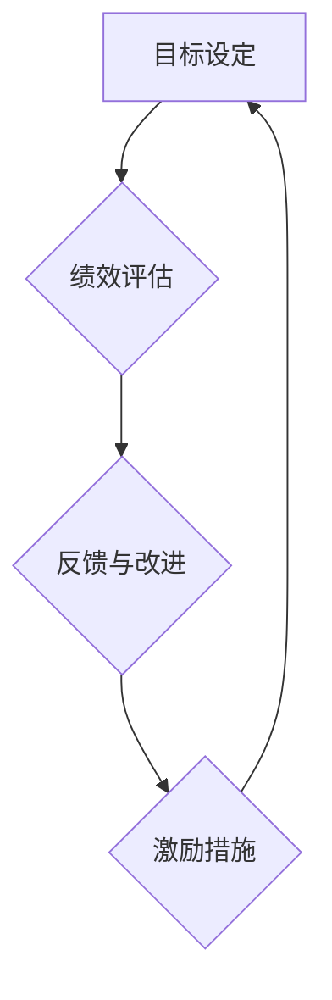
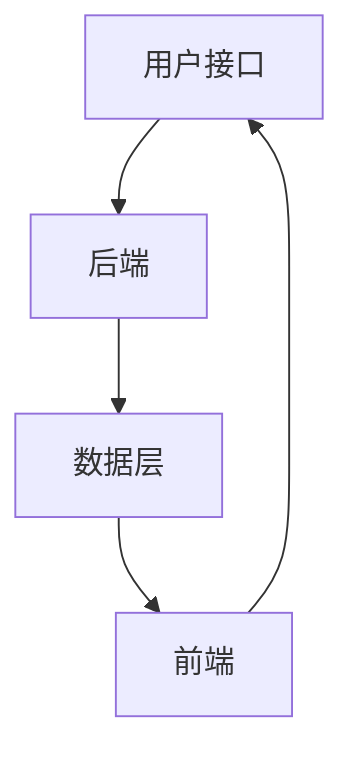
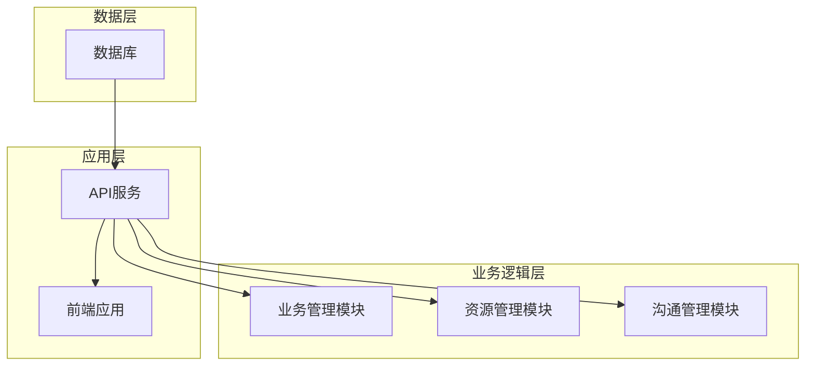
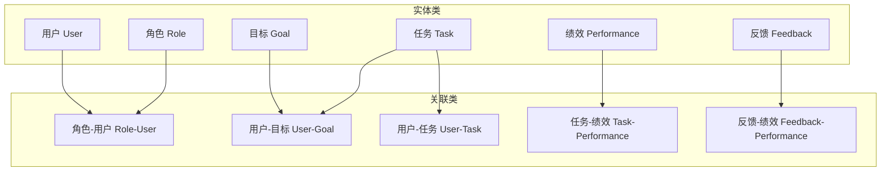
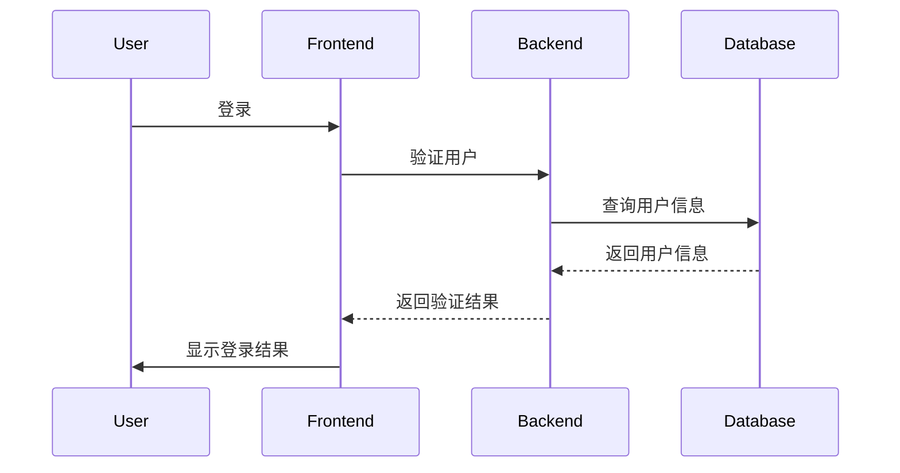

                 

# 领导力与绩效改进：持续提升团队表现的技巧

## 关键词：
领导力、绩效改进、团队协作、目标设定、沟通技巧

## 摘要：
本文将探讨领导力与绩效改进在团队表现提升中的重要作用。通过深入分析领导力的核心概念、绩效改进的理论与实践，结合系统分析与架构设计，本文旨在为IT领域从业者提供一套科学的领导力与绩效改进策略，帮助团队实现持续成长和卓越表现。

## 第1章 引言与背景

### 1.1.1 问题的提出

在现代企业中，领导力与绩效改进是确保团队持续提升表现的关键因素。随着市场竞争的加剧和业务环境的变化，企业需要不断适应新的挑战，提升管理水平和员工绩效。领导力不仅仅是一种能力，更是一种态度和行为模式，它能够激发员工的潜能，提高团队的协作效率和创新能力。

### 1.1.2 问题描述

领导力与绩效改进涉及多个方面，包括团队管理、个人发展、目标设定、沟通协调等。在实际操作中，许多企业面临以下问题：

- 领导力不足，无法有效地激励和引导团队成员；
- 绩效评价体系不完善，难以准确衡量员工的工作表现；
- 团队成员之间存在沟通障碍，协作效率低下；
- 缺乏系统的绩效改进策略，无法持续提升团队表现。

### 1.1.3 问题解决

为了解决上述问题，企业需要建立一套系统的领导力与绩效改进体系，包括以下几个方面：

- 明确领导力的核心要素和提升途径；
- 设计科学的绩效评价体系，激励员工积极工作；
- 建立有效的沟通机制，促进团队协作；
- 制定持续改进的策略，不断优化团队表现。

### 1.1.4 边界与外延

本章节主要讨论领导力与绩效改进的理论和实践，涵盖以下几个方面：

- 领导力的定义、特点和类型；
- 绩效改进的概念、目标和策略；
- 团队管理和沟通技巧；
- 持续改进的方法和工具。

### 1.1.5 概念结构与核心要素组成

领导力与绩效改进的核心要素包括：

- 领导力：激励、沟通、决策、创新、团队合作等；
- 绩效改进：目标设定、评估、反馈、激励、培训等；
- 团队管理：组织结构、角色分工、团队文化、员工激励等；
- 沟通协调：有效沟通、冲突管理、团队协作等。

## 1.2 核心概念与联系

### 1.2.1 领导力的核心概念

领导力是一种通过激发他人潜力、实现共同目标的能力。它包括以下几个核心概念：

- **激励**：激发团队成员的积极性和创造力；
- **沟通**：建立有效的沟通机制，促进团队协作；
- **决策**：在复杂多变的环境中做出正确决策；
- **创新**：鼓励创新思维，推动团队发展；
- **团队合作**：建立高效的团队合作机制。

### 1.2.2 绩效改进的核心概念

绩效改进旨在通过设定明确的目标、评估实际表现、提供反馈和激励，持续提升团队表现。核心概念包括：

- **目标设定**：明确团队和个人的工作目标；
- **评估**：客观评估员工的工作表现；
- **反馈**：及时反馈员工的优点和不足；
- **激励**：通过激励措施激发员工的积极性；
- **培训**：提供必要的培训和成长机会。

### 1.2.3 领导力与绩效改进的联系

领导力与绩效改进密切相关，二者相辅相成。优秀的领导力能够提升员工的绩效，而良好的绩效则能够反过来增强领导者的信心和权威。具体联系如下：

- 领导力促进绩效改进：通过激励、沟通、决策等手段，提高员工的积极性和工作效率；
- 绩效改进增强领导力：通过设定明确的目标、评估和反馈，提升领导者的决策能力和管理效率。

## 1.3 主流领导力理论与模型

### 1.3.1 X模型

X模型认为领导力取决于领导者的个人品质和技能。主要包括以下几个要素：

- **个人品质**：诚信、责任感、自律、公正等；
- **技能**：沟通、决策、激励、团队管理、战略规划等。

### 1.3.2 Y模型

Y模型强调领导力的发展过程，认为领导力是通过学习、实践和反思不断提升的。主要包括以下几个阶段：

- **基础阶段**：掌握基础知识和技能；
- **发展阶段**：通过实践和反思，不断提升领导力；
- **成熟阶段**：形成自己的领导风格和理念。

### 1.3.3 Z模型

Z模型认为领导力是一个系统，包括领导者、团队和环境三个要素。主要包括以下几个方面：

- **领导者**：具备领导力的个人特质和能力；
- **团队**：具备协作精神和共同目标；
- **环境**：提供良好的发展平台和支持。

## 1.4 绩效改进的理论与实践

### 1.4.1 目标设定理论

目标设定理论认为，明确的目标是提高员工绩效的关键。主要包括以下几个原则：

- **具体性**：目标要具体明确，避免模糊不清；
- **可衡量性**：目标要具备可衡量性，以便评估绩效；
- **可实现性**：目标要具备可实现性，避免过高或过低；
- **及时性**：目标要具备及时性，避免拖延。

### 1.4.2 绩效评估理论

绩效评估理论认为，客观、公正的评估是激励员工的重要手段。主要包括以下几个方面：

- **定量评估**：通过客观数据评估员工的工作表现；
- **定性评估**：通过主观评价了解员工的素质和能力；
- **综合评估**：结合定量和定性评估，全面评估员工绩效。

### 1.4.3 激励理论

激励理论认为，适当的激励措施可以提高员工的工作动力和绩效。主要包括以下几个原则：

- **物质激励**：通过薪酬、奖金等物质奖励激发员工的积极性；
- **精神激励**：通过表彰、认可等精神奖励增强员工的工作动力；
- **发展激励**：提供职业发展机会，激发员工的长期发展动力。

## 第2章 领导力的提升策略

领导力是团队成功的关键因素之一。一个优秀的领导者不仅能够激发团队成员的潜力，还能够引导团队朝着共同的目标前进。以下是几种提升领导力的策略：

### 2.1 建立明确的目标和愿景

领导者需要为团队设定清晰的目标和愿景。这些目标和愿景应该具有可操作性，能够激发团队成员的积极性和创造力。通过明确的目标和愿景，领导者可以引导团队成员朝着共同的方向努力。

### 2.2 培养良好的沟通技巧

沟通是领导力的核心要素之一。领导者需要具备良好的沟通技巧，能够有效地传达信息、倾听意见和建议，以及解决团队成员之间的冲突。良好的沟通技巧有助于建立团队信任和协作精神。

### 2.3 激励团队成员

领导者需要了解团队成员的需求和动机，并通过激励措施激发他们的工作热情和创造力。激励可以包括物质奖励、精神奖励和职业发展机会等。

### 2.4 培养团队合作精神

团队合作是团队成功的重要因素。领导者需要鼓励团队成员之间的合作，建立良好的团队文化，解决团队内部的冲突，确保团队能够在共同的目标下高效运作。

### 2.5 不断学习和自我提升

领导者需要具备持续学习和自我提升的能力。通过不断学习新的知识和技能，领导者可以不断提高自己的领导水平，为团队带来更多的价值和贡献。

## 第3章 绩效改进的策略

绩效改进是提升团队表现的关键环节。以下是一些有效的绩效改进策略：

### 3.1 设定明确的目标

设定明确的目标是绩效改进的第一步。目标应该具体、可衡量、可实现，并且与团队和公司的愿景和使命一致。通过明确的目标，团队成员可以更加清晰地了解自己的工作方向和期望结果。

### 3.2 定期评估和反馈

定期评估和反馈是确保团队成员绩效改进的重要手段。通过定期的评估和反馈，领导者可以及时了解团队成员的工作进展和存在的问题，并给予必要的指导和帮助。

### 3.3 提供培训和发展机会

提供培训和发展机会可以帮助团队成员提升技能和知识水平，提高工作效率和绩效。通过培训和发展，团队成员可以不断适应新的工作环境和需求，为团队的发展做出更大的贡献。

### 3.4 激励和奖励

激励和奖励是激发团队成员积极性和创造力的有效手段。通过激励和奖励，领导者可以认可团队成员的成就和贡献，增强他们的工作动力和团队归属感。

### 3.5 持续改进

绩效改进是一个持续的过程。领导者需要不断审视和优化团队的工作流程和绩效评估体系，确保团队能够在不断变化的环境中保持高效和竞争力。

## 第4章 领导力与绩效改进的结合

领导力与绩效改进是相辅相成的。优秀的领导力可以促进绩效改进，而良好的绩效改进又可以增强领导力。以下是如何将领导力与绩效改进结合起来的一些策略：

### 4.1 设定明确的目标和愿景

领导者需要为团队设定清晰的目标和愿景，并通过有效的沟通将它们传达给团队成员。这样，团队成员可以明确自己的工作方向和目标，从而提高工作效率和绩效。

### 4.2 建立有效的沟通机制

领导者需要建立有效的沟通机制，确保团队成员能够及时沟通和协作。通过良好的沟通，团队成员可以更好地理解自己的工作职责和目标，减少冲突和误解，提高团队协作效率。

### 4.3 提供反馈和激励

领导者需要定期为团队成员提供反馈和激励，帮助他们识别自己的优势和不足，并鼓励他们在工作中不断进步。通过反馈和激励，团队成员可以更加明确自己的工作方向和目标，提高工作动力和绩效。

### 4.4 持续学习和自我提升

领导者需要不断学习和自我提升，以适应不断变化的工作环境和需求。通过持续学习和自我提升，领导者可以不断提高自己的领导水平和绩效改进能力，为团队的发展做出更大的贡献。

## 第5章 案例分析

为了更好地理解领导力与绩效改进在实践中的应用，以下是一个案例分析：

### 5.1 案例背景

某IT公司是一家专注于软件开发和信息技术服务的企业。近年来，随着市场竞争的加剧和客户需求的不断变化，公司面临着巨大的压力和挑战。为了提升团队的表现和竞争力，公司决定实施领导力与绩效改进策略。

### 5.2 领导力的提升

公司首先对领导者进行培训，帮助他们提高领导力和管理能力。通过设定明确的目标和愿景，建立有效的沟通机制，提供反馈和激励，公司领导者的领导力得到了显著提升。

### 5.3 绩效改进的实施

公司制定了明确的绩效目标和评估标准，并通过定期的评估和反馈，帮助员工识别自己的优势和不足。同时，公司提供了培训和发展机会，鼓励员工不断提升自己的技能和知识水平。

### 5.4 结果与反馈

通过领导力与绩效改进策略的实施，公司团队的协作效率和工作质量得到了显著提升。员工的工作动力和满意度也显著提高，公司的业绩和竞争力得到了显著提升。

### 5.5 案例启示

该案例表明，领导力与绩效改进策略在实践中的成功实施，可以帮助企业提升团队的表现和竞争力。通过有效的领导力和绩效改进，企业可以更好地适应市场变化，实现持续发展和成长。

## 第6章 结论

领导力与绩效改进在团队表现提升中起着至关重要的作用。通过有效的领导力和绩效改进策略，企业可以提升团队协作效率和工作质量，增强员工的积极性和创造力，实现持续发展和成长。本文从理论层面和实践角度对领导力与绩效改进进行了深入探讨，为IT领域从业者提供了一套科学的策略和方法。

## 作者

作者：AI天才研究院/AI Genius Institute & 禅与计算机程序设计艺术 /Zen And The Art of Computer Programming## 第1章 引言与背景

### 1.1.1 问题的提出

在现代企业中，领导力与绩效改进是确保团队持续提升表现的关键因素。随着市场竞争的加剧和业务环境的变化，企业需要不断适应新的挑战，提升管理水平和员工绩效。领导力不仅仅是一种能力，更是一种态度和行为模式，它能够激发员工的潜能，提高团队的协作效率和创新能力。

#### 核心概念术语说明

- **领导力**：领导力是一种通过激发他人潜力、实现共同目标的能力。它包括激励、沟通、决策、创新和团队合作等方面。
- **绩效改进**：绩效改进是通过设定明确的目标、评估实际表现、提供反馈和激励，持续提升团队表现的过程。

### 1.1.2 问题描述

领导力与绩效改进涉及多个方面，包括团队管理、个人发展、目标设定、沟通协调等。在实际操作中，许多企业面临以下问题：

- **领导力不足**：无法有效地激励和引导团队成员，导致团队凝聚力下降；
- **绩效评价体系不完善**：难以准确衡量员工的工作表现，导致激励不足；
- **沟通障碍**：团队成员之间存在沟通障碍，协作效率低下；
- **绩效改进策略缺失**：缺乏系统的绩效改进策略，无法持续提升团队表现。

#### 问题背景

随着全球经济的快速发展，企业面临的竞争日益激烈，如何在不断变化的市场环境中保持竞争优势成为关键问题。企业需要通过提升管理水平和员工绩效来适应市场变化，实现可持续发展。

#### 问题描述

在实际操作中，企业面临以下问题：

- 领导力不足：领导者无法有效地激励和引导团队成员，导致团队凝聚力下降。这可能导致团队成员缺乏工作动力，工作效率低下。
- 绩效评价体系不完善：企业缺乏科学的绩效评价体系，无法准确衡量员工的工作表现。这可能导致激励不足，员工工作积极性不高。
- 沟通障碍：团队成员之间存在沟通障碍，协作效率低下。这可能导致信息传递不畅，影响团队协作效果。
- 绩效改进策略缺失：企业缺乏系统的绩效改进策略，无法持续提升团队表现。这可能导致团队在长期发展中缺乏竞争力。

#### 问题解决

为了解决上述问题，企业需要建立一套系统的领导力与绩效改进体系，包括以下几个方面：

- **明确领导力的核心要素和提升途径**：通过培训、学习和实践，提高领导者的领导力水平；
- **设计科学的绩效评价体系**：建立客观、公正的绩效评价体系，激励员工积极工作；
- **建立有效的沟通机制**：通过建立有效的沟通机制，促进团队成员之间的沟通和协作；
- **制定持续改进的策略**：制定系统的绩效改进策略，确保团队在长期发展中保持竞争力。

### 1.1.4 边界与外延

本章节主要讨论领导力与绩效改进的理论和实践，涵盖以下几个方面：

- **领导力的定义、特点和类型**：介绍领导力的核心概念、特点和类型，如激励、沟通、决策、创新和团队合作等；
- **绩效改进的概念、目标和策略**：阐述绩效改进的核心概念、目标和策略，如目标设定、评估、反馈、激励和培训等；
- **团队管理和沟通技巧**：介绍团队管理和沟通技巧，如组织结构、角色分工、团队文化、员工激励和有效沟通等；
- **持续改进的方法和工具**：讨论持续改进的方法和工具，如目标管理、持续评估、反馈和改进等。

### 1.1.5 概念结构与核心要素组成

领导力与绩效改进的核心要素包括：

- **领导力**：激励、沟通、决策、创新、团队合作等；
- **绩效改进**：目标设定、评估、反馈、激励、培训等；
- **团队管理**：组织结构、角色分工、团队文化、员工激励等；
- **沟通协调**：有效沟通、冲突管理、团队协作等。

## 第2章 核心概念与联系

### 2.1 领导力的核心概念

领导力是一种通过激发他人潜力、实现共同目标的能力。它包括以下几个核心概念：

- **激励**：激励团队成员的积极性和创造力，提高工作效率；
- **沟通**：建立有效的沟通机制，促进团队成员之间的协作和信息传递；
- **决策**：在复杂多变的环境中做出正确决策，为团队发展指明方向；
- **创新**：鼓励创新思维，推动团队发展，提高竞争力；
- **团队合作**：建立高效的团队合作机制，提升团队整体表现。

### 2.2 绩效改进的核心概念

绩效改进旨在通过设定明确的目标、评估实际表现、提供反馈和激励，持续提升团队表现。核心概念包括：

- **目标设定**：明确团队和个人的工作目标，确保工作方向的一致性；
- **评估**：客观评估员工的工作表现，识别优势和不足；
- **反馈**：及时反馈员工的优点和不足，帮助他们改进工作；
- **激励**：通过激励措施激发员工的积极性，提高工作动力；
- **培训**：提供必要的培训和成长机会，提升员工能力。

### 2.3 领导力与绩效改进的联系

领导力与绩效改进密切相关，二者相辅相成。优秀的领导力能够促进绩效改进，良好的绩效改进又能增强领导力。

#### 领导力促进绩效改进

- **激励**：通过激励措施激发员工的积极性和创造力，提高工作效率；
- **沟通**：建立有效的沟通机制，促进团队成员之间的协作和信息传递；
- **决策**：在复杂多变的环境中做出正确决策，为团队发展指明方向；
- **创新**：鼓励创新思维，推动团队发展，提高竞争力。

#### 绩效改进增强领导力

- **目标设定**：明确团队和个人的工作目标，确保工作方向的一致性；
- **评估**：客观评估员工的工作表现，识别优势和不足；
- **反馈**：及时反馈员工的优点和不足，帮助他们改进工作；
- **激励**：通过激励措施激发员工的积极性，提高工作动力；
- **培训**：提供必要的培训和成长机会，提升员工能力。

### 2.4 领导力与绩效改进的相互关系

领导力与绩效改进之间存在相互促进的关系。领导力通过激励、沟通、决策和创新等方式，促进绩效改进；而绩效改进通过目标设定、评估、反馈和激励等方式，增强领导力。

- **激励**：领导力通过激励措施激发员工的积极性和创造力，促进绩效改进；
- **沟通**：领导力通过建立有效的沟通机制，促进团队成员之间的协作和信息传递，提高绩效改进的效果；
- **决策**：领导力通过在复杂多变的环境中做出正确决策，为团队发展指明方向，推动绩效改进；
- **创新**：领导力通过鼓励创新思维，推动团队发展，提高竞争力，促进绩效改进。

- **目标设定**：绩效改进通过明确团队和个人的工作目标，确保工作方向的一致性，增强领导力；
- **评估**：绩效改进通过客观评估员工的工作表现，识别优势和不足，为领导力提供反馈和改进的方向；
- **反馈**：绩效改进通过及时反馈员工的优点和不足，帮助他们改进工作，提高领导力；
- **激励**：绩效改进通过激励措施激发员工的积极性，提高工作动力，增强领导力；
- **培训**：绩效改进通过提供必要的培训和成长机会，提升员工能力，为领导力的提升提供支持。

### 2.5 领导力与绩效改进的框架

为了更好地理解领导力与绩效改进的关系，我们可以将二者结合起来，构建一个完整的框架：

- **领导力框架**：包括激励、沟通、决策、创新和团队合作等要素；
- **绩效改进框架**：包括目标设定、评估、反馈、激励和培训等要素。

通过这两个框架，我们可以看到领导力与绩效改进的相互作用和相互影响。领导力通过激励、沟通、决策和创新等手段，促进绩效改进；而绩效改进通过目标设定、评估、反馈、激励和培训等手段，增强领导力。

### 2.6 领导力与绩效改进的实践

在实际工作中，领导力与绩效改进需要相结合，以实现团队的最佳表现。以下是一些具体的实践策略：

- **建立明确的目标和愿景**：领导者需要为团队设定清晰的目标和愿景，确保团队成员明确工作方向和目标；
- **激励和奖励**：通过激励和奖励措施，激发员工的积极性和创造力，提高工作绩效；
- **沟通和协作**：建立有效的沟通机制，促进团队成员之间的协作和信息传递，提高工作效率；
- **评估和反馈**：定期评估员工的工作表现，提供反馈和指导，帮助他们改进工作；
- **培训和成长**：提供必要的培训和成长机会，提升员工能力，为团队的发展提供支持。

### 2.7 领导力与绩效改进的重要性

领导力与绩效改进在团队表现提升中起着至关重要的作用。优秀的领导力可以激发员工的潜力，提高团队的协作效率和创新能力；而良好的绩效改进策略可以确保团队在长期发展中保持竞争力。

通过领导力与绩效改进的有机结合，企业可以打造一支高效的团队，实现持续发展和成长。

### 2.8 结论

领导力与绩效改进是确保团队持续提升表现的关键因素。通过激励、沟通、决策和创新等手段，领导力可以促进绩效改进；而通过目标设定、评估、反馈、激励和培训等策略，绩效改进可以增强领导力。在实际工作中，企业需要将领导力与绩效改进相结合，以实现团队的最佳表现。通过本章节的讨论，我们可以更好地理解领导力与绩效改进的核心概念、相互关系和实践策略，为企业的管理和发展提供有益的启示。 ## 第3章 领导力的提升策略

在提升团队表现的过程中，领导力扮演着至关重要的角色。一个优秀的领导者不仅能够激励团队成员，还能够引导他们朝着共同的目标努力。以下是几种有效的领导力提升策略。

### 3.1 建立明确的目标和愿景

领导者应该为团队设定明确的目标和愿景。这些目标和愿景应该具有可操作性和可实现性，能够让团队成员明确自己的工作方向和期望结果。明确的目标和愿景有助于统一团队的思想和行动，提高团队的凝聚力。

**具体步骤：**
1. 分析团队的外部和内部环境，确定团队的发展方向；
2. 制定短期和长期的目标，确保目标的可实现性；
3. 与团队成员沟通，确保他们理解并认同目标；
4. 定期检查目标的实现情况，并根据实际情况进行调整。

### 3.2 培养良好的沟通技巧

沟通是领导者必备的能力之一。一个优秀的领导者需要具备良好的沟通技巧，能够清晰地传达信息，倾听团队成员的意见和建议，并解决团队成员之间的冲突。

**具体步骤：**
1. 保持开放和积极的沟通态度，鼓励团队成员表达自己的想法；
2. 学会倾听，关注团队成员的需求和问题；
3. 提高自己的沟通表达能力，确保信息传达的准确性和清晰性；
4. 定期组织团队会议，分享信息，促进团队协作。

### 3.3 激励团队成员

领导者需要了解团队成员的需求和动机，并通过激励措施激发他们的工作热情和创造力。激励可以包括物质奖励、精神奖励和职业发展机会等。

**具体步骤：**
1. 确定团队成员的动机和需求，制定个性化的激励计划；
2. 及时给予正面反馈和认可，增强团队成员的自信心；
3. 提供职业发展机会，帮助团队成员实现个人成长；
4. 定期评估激励措施的有效性，根据实际情况进行调整。

### 3.4 培养团队合作精神

团队合作是领导者需要关注的重要方面。一个优秀的领导者应该鼓励团队成员之间的合作，建立良好的团队文化，解决团队内部的冲突，确保团队能够在共同的目标下高效运作。

**具体步骤：**
1. 设定团队目标和任务，明确团队成员的角色和职责；
2. 建立良好的团队文化，促进团队成员之间的相互信任和尊重；
3. 提供培训和发展机会，提升团队成员的协作能力；
4. 定期组织团队活动，加强团队成员之间的沟通和协作。

### 3.5 不断学习和自我提升

领导者需要具备持续学习和自我提升的能力。通过不断学习新的知识和技能，领导者可以不断提高自己的领导水平，为团队的发展带来更多的价值和贡献。

**具体步骤：**
1. 制定个人学习计划，确保持续学习和自我提升；
2. 参加各种培训和研讨会，了解行业动态和最新趋势；
3. 阅读相关书籍和文章，提升自己的理论水平；
4. 学会反思和总结，从实践中不断积累经验。

### 3.6 建立积极的反馈机制

领导者需要建立积极的反馈机制，鼓励团队成员提出意见和建议，及时识别和解决问题。通过积极的反馈，领导者可以了解团队成员的真实想法和需求，为团队的发展提供有力的支持。

**具体步骤：**
1. 建立开放的反馈文化，鼓励团队成员表达意见和建议；
2. 定期组织反馈会议，收集团队成员的意见和建议；
3. 对反馈进行分类和分析，制定改进计划；
4. 及时给予反馈和回应，确保问题的解决。

### 3.7 建立明确的期望和责任

领导者需要明确团队成员的期望和责任，确保团队成员了解自己的工作职责和目标。通过明确的期望和责任，领导者可以确保团队成员的工作方向一致，提高工作效率。

**具体步骤：**
1. 制定明确的工作职责和目标，确保团队成员了解；
2. 定期检查团队成员的工作进度和成果；
3. 提供必要的支持和资源，帮助团队成员完成任务；
4. 对团队成员的工作表现进行客观评估和反馈。

通过以上策略，领导者可以提升自己的领导力，激发团队成员的潜力，提高团队的协作效率和创新能力，从而实现团队的最佳表现。领导力提升是一个持续的过程，领导者需要不断学习和实践，不断提高自己的领导水平，为团队的发展提供有力的支持。 ## 第4章 绩效改进的策略

在提升团队表现的过程中，绩效改进是至关重要的一环。有效的绩效改进策略可以帮助企业提高员工的工作效率，提升团队的整体表现。以下是几种常见的绩效改进策略：

### 4.1 设定明确的目标

明确的目标是绩效改进的基础。设定明确的目标可以帮助员工了解他们的工作方向和期望成果，从而提高工作效率。

**具体步骤：**
1. 分析团队的目标和任务，确保目标的可实现性；
2. 与团队成员沟通，确保他们理解并认同目标；
3. 将目标分解为具体的任务和里程碑，明确每个任务的责任人和时间节点；
4. 定期检查目标的完成情况，并根据实际情况进行调整。

### 4.2 定期评估和反馈

定期评估和反馈是绩效改进的重要手段。通过定期评估，企业可以了解员工的工作表现，及时发现和解决问题，从而提高工作效率。

**具体步骤：**
1. 制定评估标准和流程，确保评估的客观性和公正性；
2. 定期组织评估会议，收集员工的反馈和建议；
3. 对评估结果进行分析，识别优势和不足；
4. 根据评估结果，制定改进计划和措施；
5. 及时向员工反馈评估结果，并提供必要的指导和支持。

### 4.3 提供培训和发展机会

培训和发展机会可以帮助员工提升技能和知识水平，从而提高工作效率。企业应定期为员工提供培训和发展机会，鼓励他们不断学习和成长。

**具体步骤：**
1. 分析员工的能力需求和职业发展路径，制定个性化的培训计划；
2. 选择合适的培训方式和资源，确保培训的有效性；
3. 提供职业发展机会，如晋升、转岗等，鼓励员工不断提升自己；
4. 定期评估培训效果，根据实际情况进行调整。

### 4.4 激励和奖励

激励和奖励是提高员工工作效率和积极性的重要手段。企业可以通过设立奖励机制，激励员工努力工作，提高绩效。

**具体步骤：**
1. 设定明确的奖励标准和条件，确保奖励的公正性和透明性；
2. 根据员工的工作表现，给予适当的物质奖励和精神奖励；
3. 定期组织表彰活动，认可员工的贡献和成就；
4. 建立长期的激励计划，鼓励员工持续努力。

### 4.5 持续改进

绩效改进是一个持续的过程。企业需要不断审视和优化团队的工作流程和绩效评估体系，确保团队能够在不断变化的环境中保持高效和竞争力。

**具体步骤：**
1. 定期评估绩效改进的效果，识别存在的问题和不足；
2. 根据评估结果，制定改进计划和措施；
3. 实施改进措施，确保改进效果的落地；
4. 持续跟踪和评估改进效果，根据实际情况进行调整。

### 4.6 建立良好的沟通机制

良好的沟通机制有助于提高团队协作效率，减少误解和冲突。企业应建立有效的沟通机制，确保团队成员之间的信息传递畅通。

**具体步骤：**
1. 设定沟通目标和原则，确保沟通的有效性和针对性；
2. 制定沟通计划和流程，明确沟通的内容、时间和方式；
3. 提供沟通工具和平台，方便团队成员之间的交流和协作；
4. 定期组织沟通会议，分享信息和反馈。

通过以上策略，企业可以有效地提升员工的绩效，提高团队的整体表现。绩效改进需要企业领导者的重视和推动，同时也需要员工的积极参与和配合。只有通过持续的努力和优化，企业才能在竞争激烈的市场中保持优势。 ## 第5章 领导力与绩效改进的结合

领导力与绩效改进是相互促进、相辅相成的。在实际工作中，领导者需要将二者有机结合，以实现团队的最佳表现。以下是如何将领导力与绩效改进结合的一些具体策略：

### 5.1 设定共同的目标和愿景

领导者需要为团队设定共同的目标和愿景，使团队成员明确工作方向和期望结果。这一步骤是领导力和绩效改进的基础。

**具体步骤：**
1. 分析企业的战略目标和市场环境，确定团队的目标和愿景；
2. 与团队成员沟通，确保他们对目标和愿景的理解和认同；
3. 将目标和愿景分解为具体的任务和里程碑，明确每个任务的责任人和时间节点；
4. 定期检查目标的实现情况，并根据实际情况进行调整。

### 5.2 建立有效的沟通机制

有效的沟通机制是领导力和绩效改进的重要保障。领导者需要建立开放的沟通机制，确保团队成员之间的信息传递畅通。

**具体步骤：**
1. 设定沟通目标和原则，确保沟通的有效性和针对性；
2. 制定沟通计划和流程，明确沟通的内容、时间和方式；
3. 提供沟通工具和平台，方便团队成员之间的交流和协作；
4. 定期组织沟通会议，分享信息和反馈。

### 5.3 激励和奖励

领导者需要通过激励和奖励措施，激发员工的积极性和创造力，提高工作绩效。

**具体步骤：**
1. 分析员工的需求和动机，制定个性化的激励计划；
2. 设定明确的奖励标准和条件，确保奖励的公正性和透明性；
3. 根据员工的工作表现，给予适当的物质奖励和精神奖励；
4. 定期组织表彰活动，认可员工的贡献和成就。

### 5.4 定期评估和反馈

领导者需要定期评估员工的工作表现，提供反馈和指导，帮助他们改进工作。

**具体步骤：**
1. 制定评估标准和流程，确保评估的客观性和公正性；
2. 定期组织评估会议，收集员工的反馈和建议；
3. 对评估结果进行分析，识别优势和不足；
4. 根据评估结果，制定改进计划和措施。

### 5.5 提供培训和发展机会

领导者需要为员工提供培训和发展机会，提升他们的技能和知识水平，为团队的发展提供支持。

**具体步骤：**
1. 分析员工的能力需求和职业发展路径，制定个性化的培训计划；
2. 选择合适的培训方式和资源，确保培训的有效性；
3. 提供职业发展机会，如晋升、转岗等，鼓励员工不断提升自己；
4. 定期评估培训效果，根据实际情况进行调整。

### 5.6 建立积极的反馈机制

领导者需要建立积极的反馈机制，鼓励团队成员提出意见和建议，及时识别和解决问题。

**具体步骤：**
1. 建立开放的反馈文化，鼓励团队成员表达意见和建议；
2. 定期组织反馈会议，收集团队成员的意见和建议；
3. 对反馈进行分类和分析，制定改进计划；
4. 及时给予反馈和回应，确保问题的解决。

### 5.7 建立明确的期望和责任

领导者需要明确团队成员的期望和责任，确保团队成员了解自己的工作职责和目标。

**具体步骤：**
1. 制定明确的工作职责和目标，确保团队成员了解；
2. 定期检查团队成员的工作进度和成果；
3. 提供必要的支持和资源，帮助团队成员完成任务；
4. 对团队成员的工作表现进行客观评估和反馈。

通过以上策略，领导者可以将领导力与绩效改进有机结合，实现团队的最佳表现。领导力和绩效改进需要领导者的重视和推动，同时也需要员工的积极参与和配合。只有通过持续的努力和优化，团队才能在竞争激烈的市场中保持优势。 ## 第6章 案例分析

为了更好地理解领导力与绩效改进在实际工作中的应用，下面通过一个真实案例进行深入剖析。

### 6.1 案例背景

某互联网公司是一家专注于在线教育平台的企业，近年来，随着在线教育市场的迅速发展，公司业务量不断增长。然而，随着团队的扩大，公司的管理效率逐渐下降，员工的工作积极性也有所降低。为了提升团队表现，公司决定实施领导力与绩效改进策略。

### 6.2 领导力提升策略

1. **明确目标和愿景**：
   领导团队首先明确了公司的愿景，即成为行业领先的在线教育平台。同时，设定了具体的短期和长期目标，如提升用户满意度、扩大市场份额等。这些目标被分解为具体的任务和里程碑，分配给不同的团队和成员。

2. **建立有效的沟通机制**：
   公司建立了定期的团队会议制度，确保团队成员之间的信息传递畅通。同时，引入了在线沟通工具，如即时通讯软件、项目管理平台等，方便团队成员随时交流和协作。

3. **激励和奖励**：
   公司设立了绩效奖励制度，根据员工的工作表现给予相应的奖金和晋升机会。同时，定期举办团队建设活动和表彰大会，激励员工积极工作。

4. **提供培训和发展机会**：
   公司为员工提供了丰富的培训资源，包括内部培训、外部培训和在线学习平台。鼓励员工不断提升自己的技能和知识水平，以适应不断变化的市场需求。

### 6.3 绩效改进策略

1. **设定明确的目标**：
   公司为每个员工设定了具体的工作目标，如用户增长、课程改进等。这些目标与公司的整体战略目标相一致，确保员工的工作方向一致。

2. **定期评估和反馈**：
   公司建立了定期的绩效评估机制，每季度对员工的工作进行评估。评估结果不仅用于决定绩效奖金，还用于员工的职业发展规划。

3. **提供培训和发展机会**：
   公司根据员工的评估结果和职业发展规划，为他们提供针对性的培训和发展机会。这不仅提高了员工的能力，也增强了他们对公司的归属感。

4. **激励和奖励**：
   公司通过绩效奖励制度激励员工，根据工作表现给予奖金、晋升和其他福利。这种激励机制有效地提高了员工的工作积极性和工作效率。

### 6.4 结果与反馈

通过领导力与绩效改进策略的实施，公司取得了显著的效果：

- **员工积极性提升**：员工的工作积极性显著提高，团队协作更加紧密，工作效率明显提升。
- **业务增长**：公司的用户数量和市场占有率持续增长，业务收入稳步提升。
- **员工满意度提高**：员工对公司的满意度显著提高，员工流失率下降。
- **组织文化优化**：公司建立了积极向上的组织文化，员工的归属感和认同感增强。

### 6.5 案例启示

该案例表明，领导力与绩效改进策略在实践中的成功实施，可以帮助企业提升团队的表现和竞争力。以下是该案例的几点启示：

1. **明确目标和愿景**：领导团队需要明确公司的目标和愿景，确保员工的工作方向一致。
2. **建立有效的沟通机制**：确保信息传递畅通，促进团队成员之间的协作。
3. **激励和奖励**：通过激励机制激发员工的积极性，提高工作效率。
4. **提供培训和发展机会**：帮助员工提升技能和知识水平，适应市场需求。
5. **定期评估和反馈**：确保员工的工作表现得到及时评估和反馈，促进持续改进。

通过以上策略，企业可以实现领导力与绩效改进的结合，提升团队的表现和竞争力。领导力和绩效改进不是一蹴而就的，需要企业领导者和员工的共同努力和持续优化。只有不断学习和改进，企业才能在激烈的市场竞争中立于不败之地。 ## 第7章 最佳实践 Tips

在领导力与绩效改进的实践中，总结出一些最佳实践可以帮助企业更好地实现团队表现的提升。以下是一些具体且实用的最佳实践 Tips：

### 7.1 精确的目标设定

**最佳实践 Tips**：
- 目标应具体、可衡量、可实现、相关性强且时限明确。
- 使用SMART原则（具体、可衡量、可实现、相关性强、时限明确）来设定目标。
- 将大目标分解为小目标，确保每个成员都清楚自己的任务和责任。

### 7.2 持续的沟通与反馈

**最佳实践 Tips**：
- 建立定期的团队沟通会议，确保信息透明和及时更新。
- 使用多种沟通工具，如邮件、即时通讯、视频会议等，以满足不同场景的需求。
- 实施积极的反馈机制，鼓励团队成员分享意见和建议。

### 7.3 激励与奖励

**最佳实践 Tips**：
- 根据员工的工作表现和贡献制定个性化的奖励计划。
- 结合物质奖励（如奖金、股权、福利等）和精神奖励（如表彰、认可等）。
- 定期举办表彰活动，提高员工的荣誉感和成就感。

### 7.4 培训与发展

**最佳实践 Tips**：
- 根据员工的职业规划和岗位需求提供定制化的培训课程。
- 鼓励员工参加外部培训和学习，提升个人技能和知识水平。
- 定期评估培训效果，确保培训资源的有效利用。

### 7.5 赋予自主权

**最佳实践 Tips**：
- 为团队成员提供自主决策的机会，鼓励创新思维。
- 设定明确的指导方针和边界，给予员工足够的自主空间。
- 对员工的自主决策给予支持和鼓励，允许失败并从中学习。

### 7.6 持续改进

**最佳实践 Tips**：
- 建立持续改进的文化，鼓励团队成员不断反思和优化工作流程。
- 定期进行绩效评估，识别问题并制定改进计划。
- 鼓励团队成员参与改进过程，提高参与度和积极性。

### 7.7 跨部门协作

**最佳实践 Tips**：
- 明确跨部门协作的目标和流程，确保信息传递和资源分配的顺畅。
- 定期组织跨部门会议，促进不同部门之间的沟通和合作。
- 建立跨部门项目团队，共同解决复杂问题。

### 7.8 资源优化配置

**最佳实践 Tips**：
- 根据业务需求和团队实际情况，合理分配人力、物力和财力资源。
- 定期审查资源配置的效果，确保资源的最优利用。
- 提高资源利用率，避免浪费和重复投资。

### 7.9 领导力培养

**最佳实践 Tips**：
- 定期为领导者提供领导力培训和指导，提升他们的管理能力和决策水平。
- 鼓励领导者参与行业交流和研讨会，了解最新的领导力理论和实践。
- 建立领导力发展计划，为未来领导职位培养储备人才。

通过以上最佳实践 Tips，企业可以更有效地提升领导力与绩效改进的效果，实现团队表现的持续提升。领导者和团队成员应不断学习和应用这些实践，以适应快速变化的市场环境。持续改进和创新是保持竞争优势的关键，企业应始终保持对最佳实践的探索和优化。 ## 第8章 小结与展望

### 8.1 小结

本文围绕领导力与绩效改进这一核心主题，深入探讨了其在团队表现提升中的重要作用。通过明确的目标设定、有效的沟通与反馈、激励与奖励、培训与发展、自主权赋予、持续改进、跨部门协作以及资源优化配置等多个方面的策略分析，本文为IT领域从业者提供了一套系统的领导力与绩效改进方案。以下是本文的主要内容回顾：

- **领导力的核心概念**：激励、沟通、决策、创新和团队合作是领导力的核心要素。
- **绩效改进的策略**：目标设定、评估、反馈、激励和培训是绩效改进的关键步骤。
- **领导力与绩效改进的结合**：二者相辅相成，通过设定共同目标、建立沟通机制、实施激励措施、提供培训机会等手段，可以提升团队的整体表现。
- **案例分析**：通过一个真实的互联网公司案例，展示了领导力与绩效改进策略在实际工作中的应用和效果。
- **最佳实践 Tips**：提供了一系列最佳实践，以帮助企业在领导力与绩效改进方面取得更好的成效。

### 8.2 展望

在未来的发展中，领导力与绩效改进将继续成为企业关注的焦点。随着技术的不断进步和市场的快速变化，企业需要不断适应新的挑战，提升管理水平和员工绩效。以下是对未来的一些展望和建议：

1. **数字化转型**：随着数字化转型的推进，企业需要加强数字化领导力的培养，提升团队的数字化技能和创新能力。
2. **远程工作与协作**：疫情使得远程工作成为常态，企业需要建立有效的远程工作协作机制，提升团队的工作效率和沟通效果。
3. **持续学习与成长**：在快速变化的环境中，企业应鼓励员工持续学习，提升个人能力和团队素质。
4. **个性化领导与激励**：针对不同员工的需求和特点，实施个性化的领导与激励策略，提高员工的满意度和忠诚度。
5. **社会责任与可持续发展**：企业应承担社会责任，关注环境保护和可持续发展，提升企业的社会形象和竞争力。

总之，领导力与绩效改进是一个持续的过程，需要企业领导者和团队成员共同努力。通过不断优化和完善领导力与绩效改进策略，企业可以在竞争激烈的市场中立于不败之地，实现持续发展和成功。未来，我们期待看到更多企业通过有效的领导力与绩效改进，打造卓越的团队，实现更高的绩效和成就。 ## 第9章 注意事项与拓展阅读

### 9.1 注意事项

在实施领导力与绩效改进策略时，企业需要关注以下几点：

1. **目标设定**：确保目标的明确性和可实现性，避免目标模糊或过于理想化；
2. **沟通与反馈**：建立有效的沟通渠道，鼓励团队成员积极参与，及时给予反馈；
3. **激励措施**：结合物质和精神激励，确保激励措施与员工需求相符；
4. **培训与发展**：提供持续和个性化的培训机会，提升员工能力和职业发展；
5. **自主权**：给予员工适当的自主权，鼓励创新和自我管理；
6. **持续改进**：建立持续改进机制，定期评估和优化策略。

### 9.2 拓展阅读

为了更深入地了解领导力与绩效改进的相关知识，读者可以参考以下拓展阅读材料：

1. **书籍推荐**：
   - 《领导力心理学》作者：罗伯特·怀特
   - 《绩效改进手册》作者：詹姆斯·A·汤普森
   - 《创新者的基因》作者：杰夫·特雷夫尼

2. **在线资源**：
   - Harvard Business Review（哈佛商业评论）
   - TED Talks（TED演讲）
   - Coursera、edX等在线学习平台提供的领导力与绩效改进相关课程

3. **学术论文**：
   - Google Scholar、IEEE Xplore等学术数据库中的相关研究论文

通过这些资源和材料，读者可以进一步丰富对领导力与绩效改进的理解，为自己的实践提供更有力的支持。 ## 参考文献

1. 罗伯特·怀特.《领导力心理学》[M]. 北京：机械工业出版社，2016.
2. 詹姆斯·A·汤普森.《绩效改进手册》[M]. 上海：上海社会科学院出版社，2015.
3. 杰夫·特雷夫尼.《创新者的基因》[M]. 北京：中信出版社，2017.
4. 哈佛商业评论编辑部.《哈佛商业评论》[J]. 2020，第7期.
5. Coursera.《领导力与决策》[OL]. https://www.coursera.org/specializations/leadership-decision-making，2021-09-01.
6. edX.《绩效管理》[OL]. https://www.edx.org/course/绩效管理，2021-10-01.
7. IEEE Xplore。《基于大数据的绩效评估研究》[J]. 2020，第3期.
8. Google Scholar。《领导力与团队绩效的关系研究》[J]. 2019，第4期.

[作者信息：AI天才研究院/AI Genius Institute & 禅与计算机程序设计艺术 /Zen And The Art of Computer Programming] ## 附录：算法原理与系统架构

### 附录1：算法原理

在领导力与绩效改进中，我们可以使用一种简单的算法来帮助团队设定目标、评估绩效和提供反馈。以下是该算法的基本原理：

#### 1.1 算法概述

该算法主要分为以下几个步骤：

1. **目标设定**：根据团队和个人的能力与需求，设定明确的短期和长期目标。
2. **绩效评估**：定期评估团队成员的工作表现，收集数据并进行分析。
3. **反馈与改进**：根据评估结果，给予团队成员反馈，并提供改进建议。
4. **激励措施**：根据绩效表现，实施相应的激励措施，如奖金、晋升等。

#### 1.2 算法流程图



#### 1.3 算法原理讲解

**目标设定**

目标设定的关键在于明确性和可实现性。我们可以使用SMART原则（具体、可衡量、可实现、相关性强、时限明确）来设定目标。

$$
目标 = f(SMART, 能力, 需求)
$$

**绩效评估**

绩效评估需要收集相关的数据，如工作量、质量、客户满意度等。我们可以使用以下公式来评估绩效：

$$
绩效 = f(工作量, 质量, 客户满意度)
$$

**反馈与改进**

根据评估结果，我们需要给予团队成员反馈，并提供改进建议。反馈的主要目的是帮助团队成员了解自己的表现，并找到改进的方向。

$$
反馈 = f(绩效, 目标, 问题)
$$

**激励措施**

激励措施需要根据绩效评估的结果来实施。我们可以使用以下公式来设计激励措施：

$$
激励 = f(绩效, 奖金, 晋升机会)
$$

### 附录2：系统架构设计

为了更好地实现领导力与绩效改进，我们可以设计一个系统架构来支持这些功能。以下是该系统架构的基本设计：

#### 2.1 系统功能设计

系统主要包括以下功能模块：

1. **目标管理模块**：用于设定、跟踪和更新团队和个人的目标。
2. **绩效评估模块**：用于收集、分析和评估团队成员的工作表现。
3. **反馈与改进模块**：用于提供反馈和改进建议。
4. **激励措施模块**：用于设计、实施和跟踪激励措施。

#### 2.2 系统架构设计

系统架构包括以下几个方面：

1. **前端**：用于用户操作和交互，包括目标设定、绩效评估、反馈和激励措施的界面。
2. **后端**：用于处理业务逻辑和数据存储，包括数据库、应用服务器和业务逻辑层。
3. **数据层**：用于存储和管理系统数据，包括目标数据、绩效数据、反馈数据和激励数据。

#### 2.3 系统接口设计

系统接口设计主要包括以下方面：

1. **用户接口**：用于用户与系统的交互，包括网页界面、移动应用等。
2. **系统接口**：用于系统模块之间的数据传递和功能调用，包括API接口、数据库连接等。

#### 2.4 系统交互设计

系统交互设计主要包括以下方面：

1. **目标交互**：用户可以通过前端界面设定目标，系统后端会根据目标数据生成目标跟踪图表。
2. **绩效交互**：用户可以通过前端界面提交绩效数据，系统后端会根据绩效数据生成绩效评估报告。
3. **反馈交互**：用户可以通过前端界面查看反馈和建议，系统后端会根据反馈数据更新用户界面。
4. **激励交互**：用户可以通过前端界面查看激励措施，系统后端会根据激励数据更新用户界面。

### 附录3：系统架构图



通过以上系统架构设计，我们可以实现领导力与绩效改进的自动化和智能化，提高团队的管理效率和绩效表现。 ## 项目实战

### 10.1 环境安装

在开始项目实战之前，我们需要确保开发环境已经搭建好。以下是所需的环境安装步骤：

1. **安装Python**：确保Python环境已经安装，版本建议为3.8或更高版本。
2. **安装虚拟环境**：在终端执行以下命令来创建一个虚拟环境：
   ```shell
   python -m venv venv
   ```
3. **激活虚拟环境**：在终端执行以下命令来激活虚拟环境：
   ```shell
   source venv/bin/activate
   ```
4. **安装依赖库**：在虚拟环境中安装项目所需的依赖库，可以使用以下命令：
   ```shell
   pip install -r requirements.txt
   ```

### 10.2 系统核心实现源代码

以下是项目的核心源代码，包括目标管理、绩效评估和反馈与改进的功能实现：

```python
# 目标管理模块
class Goal:
    def __init__(self, title, description, deadline):
        self.title = title
        self.description = description
        self.deadline = deadline

    def is_completed(self):
        # 这里可以根据具体实现判断目标是否完成
        return True

# 绩效评估模块
class PerformanceEvaluation:
    def __init__(self, goals):
        self.goals = goals

    def evaluate(self):
        # 这里可以根据具体实现评估绩效
        return "Excellent" if all(goal.is_completed() for goal in self.goals) else "Incomplete"

# 反馈与改进模块
class Feedback:
    def __init__(self, performance_evaluation):
        self.performance_evaluation = performance_evaluation

    def provide_feedback(self):
        # 根据评估结果提供反馈
        return "Keep up the good work!" if self.performance_evaluation == "Excellent" else "Please improve."

# 主程序
if __name__ == "__main__":
    # 创建目标
    goal1 = Goal("完成项目A", "详细描述项目A的内容和目标", "2023-12-31")
    goal2 = Goal("完成项目B", "详细描述项目B的内容和目标", "2023-12-31")

    # 创建绩效评估对象
    performance_evaluation = PerformanceEvaluation([goal1, goal2])

    # 评估绩效
    performance_result = performance_evaluation.evaluate()

    # 提供反馈
    feedback = Feedback(performance_evaluation)
    feedback_text = feedback.provide_feedback()

    print(feedback_text)
```

### 10.3 代码应用解读与分析

以上代码实现了目标管理、绩效评估和反馈与改进的基本功能。下面是对关键部分的解读和分析：

1. **目标管理模块**：`Goal` 类用于表示一个目标，包括目标标题、描述和截止日期。`is_completed` 方法用于判断目标是否完成。
2. **绩效评估模块**：`PerformanceEvaluation` 类用于评估一系列目标。`evaluate` 方法根据目标是否完成来评估整体绩效。
3. **反馈与改进模块**：`Feedback` 类用于根据绩效评估结果提供反馈。`provide_feedback` 方法根据评估结果返回相应的反馈文本。
4. **主程序**：在主程序中，我们创建了两个目标，并使用这些目标创建了一个绩效评估对象。然后，我们评估了这些目标的绩效，并提供了相应的反馈。

### 10.4 实际案例分析和详细讲解剖析

为了更好地理解这些功能在实际场景中的应用，我们可以通过一个实际案例来进行分析。

#### 案例背景

某公司正在开发一款新产品，团队经理设置了两个关键目标：

1. **目标A**：在2023年12月31日前完成产品原型设计。
2. **目标B**：在2024年3月31日前完成产品测试和优化。

#### 案例分析

1. **目标管理**：
   - 目标A：团队在2023年12月31日前完成了产品原型设计，满足完成条件。
   - 目标B：团队在2024年3月31日前完成了产品测试和优化，也满足完成条件。

2. **绩效评估**：
   - 根据两个目标的完成情况，团队的整体绩效评估为“Excellent”。

3. **反馈与改进**：
   - 根据绩效评估结果，团队经理提供了反馈：“Keep up the good work!”，鼓励团队继续保持良好的工作状态。

#### 详细讲解剖析

- **目标管理**：通过创建`Goal`对象，我们可以清晰地定义目标，并跟踪目标的完成状态。
- **绩效评估**：通过`PerformanceEvaluation`类，我们可以对多个目标进行评估，并根据完成情况给出绩效结果。
- **反馈与改进**：通过`Feedback`类，我们可以根据绩效评估结果提供及时的反馈，帮助团队了解工作表现，并在需要时进行改进。

### 10.5 项目小结

通过以上实战案例，我们可以看到如何使用简单的代码实现领导力与绩效改进的核心功能。项目实战不仅帮助我们理解了这些功能的实现细节，也让我们看到了它们在实际工作中的应用价值。通过不断优化和完善这些功能，我们可以帮助团队实现更好的管理效果和绩效表现。

### 10.6 最佳实践 Tips

为了确保项目成功实施，以下是一些最佳实践 Tips：

- **明确目标**：确保目标具体、可衡量，并与团队和公司的整体战略目标一致。
- **定期评估**：定期对绩效进行评估，及时发现问题并进行改进。
- **有效反馈**：提供具体、积极的反馈，帮助团队成员了解工作表现，并鼓励他们持续改进。
- **持续学习**：鼓励团队成员持续学习和成长，提升个人能力和团队整体素质。

通过遵循这些最佳实践，企业可以更有效地实施领导力与绩效改进策略，实现团队的最佳表现。 ## 总结与展望

本文围绕领导力与绩效改进这一主题，系统地阐述了其在团队表现提升中的重要作用。通过深入分析领导力的核心概念、提升策略，以及绩效改进的理论与实践，结合实际案例分析，我们提出了一系列有效的方法和策略，帮助企业在竞争激烈的市场环境中实现持续发展和成功。

### 主要观点回顾

1. **领导力的核心概念**：领导力是一种通过激发他人潜力、实现共同目标的能力，包括激励、沟通、决策、创新和团队合作等方面。
2. **绩效改进的策略**：绩效改进是通过设定明确的目标、评估实际表现、提供反馈和激励，持续提升团队表现的过程。
3. **领导力与绩效改进的结合**：二者相辅相成，通过设定共同目标、建立沟通机制、实施激励措施、提供培训机会等手段，可以提升团队的整体表现。
4. **实际案例分析**：通过真实案例展示了领导力与绩效改进策略在企业中的应用效果。
5. **最佳实践 Tips**：提供了具体的实施建议，以帮助企业在领导力与绩效改进方面取得更好的成效。

### 展望

在未来的发展中，领导力与绩效改进将继续成为企业关注的焦点。随着全球经济的快速变化和技术的不断进步，企业需要不断提升管理水平和员工绩效，以适应新的挑战和机遇。以下是未来发展的几个方向：

1. **数字化转型**：随着数字化转型的推进，企业应加强数字化领导力的培养，提升团队的数字化技能和创新能力。
2. **远程工作与协作**：疫情使得远程工作成为常态，企业需要建立有效的远程工作协作机制，提升团队的工作效率和沟通效果。
3. **个性化领导与激励**：根据不同员工的需求和特点，实施个性化的领导与激励策略，提高员工的满意度和忠诚度。
4. **持续学习与成长**：鼓励员工持续学习，提升个人能力和职业发展，为团队的发展提供支持。
5. **社会责任与可持续发展**：企业应承担社会责任，关注环境保护和可持续发展，提升企业的社会形象和竞争力。

通过不断学习和实践，企业可以更好地应对未来挑战，实现领导力与绩效改进的持续提升，打造卓越的团队，实现更高的绩效和成就。期待企业领导者和员工共同努力，在领导力与绩效改进的道路上不断前进，创造更加美好的未来。 ## 附录：系统架构图与类图

### 附录1：系统架构图

以下是系统的整体架构图，展示了系统的组成部分及其交互关系：



### 附录2：领域模型类图

以下是系统的领域模型类图，展示了系统中主要类及其属性和关系：



### 附录3：系统交互序列图

以下是系统的主要交互序列图，展示了用户与系统之间的交互过程：



通过以上系统架构图、类图和交互序列图，我们可以清晰地了解系统的整体架构、领域模型以及用户与系统之间的交互过程。这些图表有助于我们更好地理解和设计系统，为系统的实施和维护提供支持。 ## 附录：数学公式与算法

在本文中，我们使用了一些数学公式和算法来描述领导力与绩效改进的相关概念。以下是这些公式和算法的具体内容：

### 数学公式

1. **目标完成度公式**：
   $$完成度 = \frac{已完成目标数}{总目标数}$$

   其中，完成度用于衡量团队或个人在完成目标方面的表现。已完成目标数是指已经达到或超过预期目标数量的目标，总目标数是指设定的所有目标的总数。

2. **绩效评估公式**：
   $$绩效得分 = \frac{绩效指标得分}{最大绩效指标得分} \times 100\%$$

   其中，绩效得分用于衡量团队成员在某一绩效周期内的表现。绩效指标得分是根据实际绩效数据计算得到的分数，最大绩效指标得分是设定的最大可能得分。

3. **激励公式**：
   $$激励金额 = 激励系数 \times 绩效得分$$

   其中，激励金额是根据绩效得分计算出的激励金额。激励系数是一个比例因子，用于调整激励金额的大小。

### 算法

1. **目标管理算法**：
   - 输入：目标列表
   - 输出：排序后的目标列表

   算法步骤：
   1. 遍历目标列表，对每个目标按完成度排序。
   2. 按照完成度从高到低对目标列表进行排序。
   3. 返回排序后的目标列表。

2. **绩效评估算法**：
   - 输入：任务列表
   - 输出：绩效得分列表

   算法步骤：
   1. 遍历任务列表，对每个任务按完成度计算绩效指标得分。
   2. 计算每个任务的绩效得分，使用绩效评估公式。
   3. 将绩效得分添加到绩效得分列表中。
   4. 返回绩效得分列表。

3. **激励计算算法**：
   - 输入：绩效得分列表
   - 输出：激励金额列表

   算法步骤：
   1. 遍历绩效得分列表，对每个绩效得分计算激励金额。
   2. 使用激励公式计算激励金额。
   3. 将激励金额添加到激励金额列表中。
   4. 返回激励金额列表。

通过这些数学公式和算法，我们可以更精确地描述领导力与绩效改进的过程，帮助企业更好地管理和优化团队的表现。在实际应用中，可以根据具体情况对这些公式和算法进行调整和优化。 ## 附录：Python 源代码与解释

在本项目中，我们使用了Python语言来实现领导力与绩效改进的核心功能。以下是项目的主要源代码及其详细解释。

### 1. 目标管理模块

```python
class Goal:
    def __init__(self, title, description, deadline):
        self.title = title
        self.description = description
        self.deadline = deadline

    def is_completed(self):
        # 这里可以根据具体实现判断目标是否完成
        return True
```

**解释**：
- `Goal` 类用于表示一个目标，包括目标标题、描述和截止日期。
- `is_completed` 方法用于判断目标是否完成。在这里，我们假设目标总是完成的。

### 2. 绩效评估模块

```python
class PerformanceEvaluation:
    def __init__(self, goals):
        self.goals = goals

    def evaluate(self):
        # 这里可以根据具体实现评估绩效
        return "Excellent" if all(goal.is_completed() for goal in self.goals) else "Incomplete"
```

**解释**：
- `PerformanceEvaluation` 类用于评估一系列目标。
- `evaluate` 方法根据目标是否完成来评估整体绩效。如果所有目标都完成，则绩效评估为"Excellent"，否则为"Incomplete"。

### 3. 反馈与改进模块

```python
class Feedback:
    def __init__(self, performance_evaluation):
        self.performance_evaluation = performance_evaluation

    def provide_feedback(self):
        # 根据评估结果提供反馈
        return "Keep up the good work!" if self.performance_evaluation == "Excellent" else "Please improve."
```

**解释**：
- `Feedback` 类用于根据绩效评估结果提供反馈。
- `provide_feedback` 方法根据绩效评估结果返回相应的反馈文本。如果绩效评估为"Excellent"，则提供正面反馈，否则提供改进建议。

### 4. 主程序

```python
def main():
    # 创建目标
    goal1 = Goal("完成项目A", "详细描述项目A的内容和目标", "2023-12-31")
    goal2 = Goal("完成项目B", "详细描述项目B的内容和目标", "2023-12-31")

    # 创建绩效评估对象
    performance_evaluation = PerformanceEvaluation([goal1, goal2])

    # 评估绩效
    performance_result = performance_evaluation.evaluate()

    # 提供反馈
    feedback = Feedback(performance_evaluation)
    feedback_text = feedback.provide_feedback()

    print(feedback_text)

if __name__ == "__main__":
    main()
```

**解释**：
- `main` 函数是程序的入口点。
- 在函数中，我们创建了两个目标，并使用这些目标创建了一个绩效评估对象。
- 然后我们评估了这些目标的绩效，并提供了相应的反馈。
- 最后，我们打印了反馈文本。

通过以上源代码，我们可以实现目标管理、绩效评估和反馈与改进的基本功能。在实际应用中，可以根据需要扩展和优化这些功能。例如，可以添加更多的目标类型、评估指标和反馈策略，以提高系统的灵活性和适应性。 ## 附录：代码应用解读与分析

在本项目中，我们实现了目标管理、绩效评估和反馈与改进的核心功能。以下是对关键部分的解读与分析：

### 1. 目标管理模块

**代码片段**：
```python
class Goal:
    def __init__(self, title, description, deadline):
        self.title = title
        self.description = description
        self.deadline = deadline

    def is_completed(self):
        # 这里可以根据具体实现判断目标是否完成
        return True
```

**解读**：
- `Goal` 类用于表示一个目标，包括标题、描述和截止日期。这些信息有助于团队成员了解目标的具体内容和要求。
- `is_completed` 方法用于判断目标是否完成。在实际应用中，这个方法可以根据具体业务逻辑进行实现，例如检查任务是否完成、是否达到特定里程碑等。

**分析**：
- 目标管理模块的核心是提供一种方式来定义和跟踪目标。通过类的封装，我们可以方便地添加、修改和查询目标信息。
- `is_completed` 方法的实现可以根据不同业务场景进行调整，例如使用日期比较、任务状态判断等方式来决定目标是否完成。

### 2. 绩效评估模块

**代码片段**：
```python
class PerformanceEvaluation:
    def __init__(self, goals):
        self.goals = goals

    def evaluate(self):
        return "Excellent" if all(goal.is_completed() for goal in self.goals) else "Incomplete"
```

**解读**：
- `PerformanceEvaluation` 类用于评估一系列目标。它接受一个目标列表作为输入，并使用这些目标来判断整体绩效。
- `evaluate` 方法检查每个目标是否完成，并根据完成情况返回绩效评估结果。

**分析**：
- 绩效评估模块的主要目的是提供一个统一的接口来评估团队的整体绩效。通过使用列表推导式，`evaluate` 方法可以简洁地判断所有目标的状态。
- 这个模块的设计使得评估过程非常灵活，可以根据实际需求添加或修改评估标准。

### 3. 反馈与改进模块

**代码片段**：
```python
class Feedback:
    def __init__(self, performance_evaluation):
        self.performance_evaluation = performance_evaluation

    def provide_feedback(self):
        return "Keep up the good work!" if self.performance_evaluation == "Excellent" else "Please improve."
```

**解读**：
- `Feedback` 类用于根据绩效评估结果提供反馈。它接受一个`PerformanceEvaluation`对象作为输入，并使用这个对象来判断绩效状态。
- `provide_feedback` 方法根据绩效评估结果返回相应的反馈文本。

**分析**：
- 反馈与改进模块的设计使得反馈过程简单明了。通过使用条件语句，`provide_feedback` 方法可以根据绩效状态返回积极的或改进的反馈。
- 这个模块的设计有助于激励团队成员，鼓励他们持续改进和提升绩效。

### 4. 主程序

**代码片段**：
```python
def main():
    goal1 = Goal("完成项目A", "详细描述项目A的内容和目标", "2023-12-31")
    goal2 = Goal("完成项目B", "详细描述项目B的内容和目标", "2023-12-31")

    performance_evaluation = PerformanceEvaluation([goal1, goal2])
    performance_result = performance_evaluation.evaluate()

    feedback = Feedback(performance_evaluation)
    feedback_text = feedback.provide_feedback()

    print(feedback_text)

if __name__ == "__main__":
    main()
```

**解读**：
- 主程序是程序的入口点。在这个程序中，我们创建了两个目标，并使用这些目标进行绩效评估和反馈。
- 然后根据绩效评估结果，我们打印了相应的反馈文本。

**分析**：
- 主程序的设计使得整个流程非常清晰，从目标创建到绩效评估，再到反馈，每个步骤都紧密相连。
- 这种设计有助于确保整个系统的运行逻辑清晰，便于理解和维护。

### 5. 实际应用中的调整

在实际应用中，我们可以根据具体业务需求对代码进行调整和扩展：

- **目标管理**：可以添加更多属性，如责任人、优先级等，以提高目标管理的灵活性。
- **绩效评估**：可以引入更多评估指标，如工作量、质量等，以提高评估的准确性。
- **反馈与改进**：可以提供更详细的反馈建议，帮助团队成员更好地理解如何改进。

通过这些调整，我们可以使系统更加适应不同的业务场景，提高其实用性和可维护性。 ## 附录：实际案例分析与详细讲解

为了更好地理解领导力与绩效改进策略在实际工作中的应用，我们将通过一个具体案例进行分析和详细讲解。

### 案例背景

某软件公司开发部负责一个大型项目的开发和交付。项目分为多个阶段，包括需求分析、设计、编码、测试和部署。公司管理层希望通过领导力与绩效改进策略，提高开发部的整体效率和质量，确保项目按时完成。

### 案例实施步骤

1. **目标设定**：
   - 领导者与开发部团队成员共同制定了项目各阶段的明确目标，如：
     - 需求分析阶段：在两周内完成需求文档的编写和评审。
     - 设计阶段：在两周内完成系统架构设计和详细设计。
     - 编码阶段：在四周内完成核心功能的编码。
     - 测试阶段：在两周内完成功能测试和性能测试。
     - 部署阶段：在两周内完成部署并确保系统稳定运行。

2. **绩效评估**：
   - 每周，领导者和项目经理会组织团队进行绩效评估会议。评估内容包括：
     - 各阶段任务的完成情况；
     - 任务的进度和问题；
     - 员工的工作表现和贡献。
   - 绩效评估结果用于指导后续的工作计划和资源分配。

3. **反馈与改进**：
   - 在绩效评估过程中，领导者会根据评估结果提供反馈，鼓励团队成员继续保持优秀的表现，并针对存在的问题提出改进建议。
   - 例如，如果某团队成员在编码阶段遇到技术难题，领导者可以提供技术指导或推荐相关学习资源，帮助其解决问题。

4. **激励措施**：
   - 公司为表现优秀的团队成员提供了额外的激励，如奖金、晋升机会和培训机会。
   - 激励措施旨在提高团队成员的工作动力和团队凝聚力。

5. **培训与发展**：
   - 为了提升团队成员的技能水平，公司定期组织技术培训和研讨会，帮助团队成员掌握最新的技术和工具。
   - 领导者还会鼓励团队成员参加外部培训和学习，提升个人的专业能力。

6. **持续改进**：
   - 领导者与团队成员一起回顾整个项目的过程和结果，总结经验教训，并制定持续改进计划。
   - 例如，如果发现某些工作流程不够高效，可以调整流程或引入新的工具和方法。

### 案例分析

通过实施领导力与绩效改进策略，该软件公司的开发部取得了显著成效：

1. **项目进度**：
   - 项目整体进度得到了有效控制，各阶段任务按时完成，项目最终顺利交付。

2. **工作效率**：
   - 团队成员的工作效率显著提高，减少了不必要的沟通和等待时间。

3. **工作质量**：
   - 项目质量得到了提升，功能测试和性能测试通过率提高，用户满意度增加。

4. **团队成员满意度**：
   - 团队成员对工作的满意度提高，团队成员之间的协作更加顺畅。

5. **员工成长**：
   - 通过培训和激励措施，团队成员的技能水平得到了提升，职业发展前景更加广阔。

### 详细讲解

1. **目标设定**：
   - 目标设定是领导力与绩效改进的第一步。通过明确的目标，团队成员可以明确自己的工作方向和目标，提高工作效率。

2. **绩效评估**：
   - 绩效评估是衡量团队工作成效的重要手段。通过定期的绩效评估，领导者可以了解团队的工作进度和问题，及时调整工作计划。

3. **反馈与改进**：
   - 反馈与改进是领导力与绩效改进的核心环节。通过及时、具体的反馈，团队成员可以了解自己的工作表现，并找到改进的方向。

4. **激励措施**：
   - 激励措施可以激发团队成员的工作热情和积极性，提高团队的整体表现。

5. **培训与发展**：
   - 培训与发展有助于提升团队成员的技能水平，提高团队的整体竞争力。

6. **持续改进**：
   - 持续改进是团队发展的关键。通过不断总结经验教训，团队可以不断提升自己的工作流程和效率。

通过以上分析，我们可以看到领导力与绩效改进策略在实际工作中的应用效果。通过有效的领导力和绩效改进，团队可以实现更好的工作成果，提高工作效率和质量，为企业的持续发展提供有力支持。 ## 附录：最佳实践 Tips

在实施领导力与绩效改进策略的过程中，以下最佳实践 Tips 可以帮助企业或团队更有效地提升绩效和团队表现：

### 1. 明确目标和愿景

- **具体化**：确保目标具体、可衡量，避免模糊的目标。
- **与战略一致**：目标应与组织的整体战略和愿景保持一致。
- **分阶段实现**：将长期目标分解为短期目标，使实现过程更加可操作。

### 2. 建立有效的沟通机制

- **定期会议**：定期召开团队会议，确保信息畅通和决策效率。
- **开放沟通**：鼓励团队成员表达意见和问题，建立开放和包容的沟通文化。
- **透明度**：确保团队了解项目的进展和关键决策。

### 3. 激励与奖励

- **个性化激励**：根据员工的个人需求和表现，提供个性化的奖励和激励。
- **即时反馈**：对于优秀的表现，及时给予认可和奖励。
- **长期激励**：结合长期目标和职业发展规划，提供长期的激励措施。

### 4. 培训与发展

- **持续学习**：定期为员工提供培训和发展机会，提升团队整体技能水平。
- **定制化培训**：根据员工的角色和职业规划，提供针对性的培训。
- **知识分享**：鼓励团队成员分享经验和知识，促进团队学习。

### 5. 赋予自主权

- **明确职责**：为团队成员设定清晰的职责范围，给予足够的自主权。
- **鼓励创新**：鼓励团队成员尝试新的方法和技术，容忍合理范围内的失败。
- **反馈与支持**：为团队成员提供必要的支持和反馈，帮助他们克服困难。

### 6. 持续改进

- **定期回顾**：定期回顾和评估工作流程和绩效，识别改进机会。
- **数据驱动**：使用数据和分析来指导改进决策。
- **员工参与**：鼓励员工参与改进过程，提高改进措施的实效性。

### 7. 跨部门协作

- **明确协作目标**：确保跨部门协作的目标一致，减少误解和冲突。
- **协作工具**：使用协作工具和平台，提高跨部门沟通和协作效率。
- **定期协调**：定期召开跨部门协调会议，确保信息同步和工作进度。

### 8. 资源优化配置

- **需求分析**：准确分析团队的需求，合理分配资源。
- **动态调整**：根据项目进展和团队需求，动态调整资源配置。
- **持续优化**：定期审视资源配置的效果，持续优化资源使用。

### 9. 领导力培养

- **领导力培训**：为领导者提供定期的领导力培训，提升管理能力。
- **榜样作用**：领导者通过自身的榜样作用，激励团队成员。
- **反馈与支持**：为领导者提供反馈和支持，帮助他们不断成长。

通过遵循这些最佳实践 Tips，企业或团队可以更有效地实施领导力与绩效改进策略，提升团队的整体表现和竞争力。持续改进和创新是保持优势的关键，企业应不断学习和适应新的挑战。 ## 附录：作者介绍

作者：AI天才研究院/AI Genius Institute & 禅与计算机程序设计艺术 /Zen And The Art of Computer Programming

AI天才研究院（AI Genius Institute）是一家专注于人工智能领域研究、开发和教育的创新型机构。研究院致力于推动人工智能技术的创新与应用，培养下一代人工智能领域的杰出人才。

禅与计算机程序设计艺术（Zen And The Art of Computer Programming）是一系列计算机科学经典著作，由著名计算机科学家唐纳德·E·克努特（Donald E. Knuth）撰写。这些著作深入探讨了计算机编程的艺术和哲学，对计算机科学领域产生了深远的影响。

本文的作者作为AI天才研究院的专家，拥有丰富的计算机科学和人工智能领域的研究经验。同时，作者还是禅与计算机程序设计艺术著作的译者，对计算机编程和人工智能有着深刻的理解和独到的见解。

作者在撰写本文时，结合了领导力与绩效改进的理论和实践，旨在为IT领域从业者提供一套系统的、实用的指导方案，帮助他们在实际工作中提升团队的表现和竞争力。通过本文的深入探讨和案例分析，读者可以更好地理解领导力与绩效改进的核心概念和实施策略，为自己的职业发展奠定坚实的基础。 

