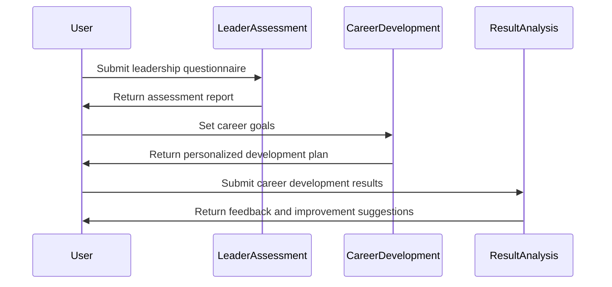
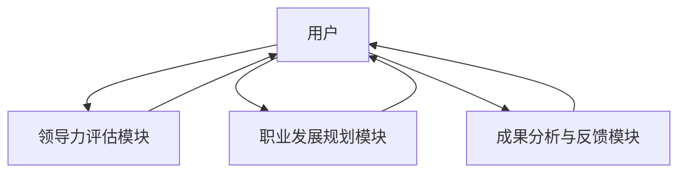

                 

# 领导力与职业发展：助力团队成员成长

> 关键词：领导力、职业发展、团队成长、人才管理、组织效能

> 摘要：本文旨在探讨领导力与职业发展之间的关系，以及如何通过有效的领导力实践来助力团队成员的成长。文章首先介绍了领导力的核心概念与特点，分析了职业发展的定义与路径，随后通过构建数学模型与系统架构设计，提供了具体的实施方法。最后，文章通过实际项目案例和最佳实践，总结了如何在实际工作中应用这些理论，为提升团队效能和组织发展提供了有力指导。

## 目录大纲

## 第1章 引言
### 1.1 问题背景与重要性
### 1.2 核心概念
### 1.3 研究方法与框架
### 1.4 边界与外延
### 1.5 本章小结

## 第2章 领导力的核心概念与联系
### 2.1 领导力的定义与特点
### 2.2 领导力的分类与模型
### 2.3 领导力的属性特征对比表格
### 2.4 领导力的ER实体关系图
### 2.5 领导力与职业发展的联系
### 2.6 本章小结

## 第3章 职业发展的核心概念与路径
### 3.1 职业发展的定义与特点
### 3.2 职业发展的路径与策略
### 3.3 职业发展在不同职业阶段的变化
### 3.4 职业发展的影响因素
### 3.5 本章小结

## 第4章 领导力与职业发展的数学模型
### 4.1 数学模型的基本概念
### 4.2 领导力与职业发展的数学模型
### 4.3 数学公式与详细讲解
### 4.4 算法原理讲解
### 4.5 本章小结

## 第5章 领导力与职业发展的系统分析与架构设计
### 5.1 问题场景介绍
### 5.2 系统功能设计
### 5.3 系统架构设计
### 5.4 系统交互设计与流程图
### 5.5 本章小结

## 第6章 项目实战
### 6.1 环境安装与配置
### 6.2 系统核心实现
### 6.3 代码应用解读与分析
### 6.4 实际案例分析
### 6.5 详细讲解与剖析
### 6.6 项目小结

## 第7章 最佳实践与注意事项
### 7.1 最佳实践 tips
### 7.2 小结
### 7.3 注意事项
### 7.4 拓展思考

## 第1章 引言

### 1.1 问题背景与重要性

在现代社会，领导力与职业发展已成为组织管理中的重要议题。随着企业竞争的日益激烈，如何提高团队效能、激发员工潜力，成为企业领导者面临的重要挑战。领导力不仅影响个人的职业成长，还对组织的整体效能产生深远影响。因此，探讨领导力与职业发展的关系，以及如何通过领导力来助力团队成员成长，具有重要的现实意义。

#### 领导力在组织中的作用

领导力是领导者通过影响力、激励和指导，引导团队成员实现组织目标的能力。在组织中，领导力不仅体现在决策层面，更体现在日常管理和沟通中。有效的领导力能够激发团队成员的积极性，提升团队协作效率，促进组织创新和发展。

#### 职业发展对于个人成长的影响

职业发展是个人在职业生涯中不断追求成长和进步的过程。良好的职业发展不仅有助于提升个人的专业技能和综合素质，还能增强职业满意度和归属感。同时，职业发展也是组织吸引和保留人才的重要手段。

#### 领导力与职业发展的关系

领导力与职业发展之间存在密切的联系。有效的领导力能够为团队成员提供清晰的职业发展路径，帮助他们实现个人目标，进而提高团队的整体效能。同时，职业发展也为领导力提供了良好的实践平台，使领导者能够在实际工作中不断提升自己的领导能力。

### 1.2 核心概念

为了深入探讨领导力与职业发展的关系，我们需要明确以下几个核心概念：

#### 领导力

领导力是指领导者通过影响力、激励和指导，引导团队成员实现组织目标的能力。领导力不仅包括技术能力和专业知识，更包括情感智慧、人际沟通和团队管理等方面。

#### 职业发展

职业发展是个人在职业生涯中不断追求成长和进步的过程。职业发展包括专业技能的提升、管理能力的培养、职业视野的拓宽等方面。

#### 团队成长

团队成长是指团队成员在共同工作中，通过不断学习、沟通和协作，实现个人和团队目标的过程。团队成长需要领导者的有效引导和支持。

#### 组织效能

组织效能是指组织在实现其目标过程中所表现出来的效率和能力。有效的领导力和职业发展有助于提升组织效能，实现组织目标。

### 1.3 研究方法与框架

本研究采用定性研究和定量研究相结合的方法，通过对领导力与职业发展的理论分析、案例研究和实证研究，构建一个系统的研究框架。研究方法主要包括文献分析、问卷调查、深度访谈和案例研究等。

### 1.4 边界与外延

本文的研究边界主要包括领导力与职业发展的关系、领导力在组织中的应用、职业发展的路径和策略等方面。研究外延包括领导力在其他领域的应用、职业发展的影响因素等。

### 1.5 本章小结

本章介绍了领导力与职业发展的背景、核心概念和研究方法。通过对问题背景的阐述和核心概念的界定，本文为后续章节的研究提供了基础。在接下来的章节中，我们将进一步探讨领导力的核心概念、职业发展的路径和策略，以及领导力与职业发展的数学模型和系统架构设计。

## 第2章 领导力的核心概念与联系

### 2.1 领导力的定义与特点

领导力是指领导者通过影响力、激励和指导，引导团队成员实现组织目标的能力。领导力不仅包括技术能力和专业知识，更包括情感智慧、人际沟通和团队管理等方面。有效的领导力能够激发团队成员的积极性，提升团队协作效率，促进组织创新和发展。

#### 领导力的内涵

领导力的内涵主要包括以下几个方面：

1. **影响力**：领导者通过自身的能力和魅力，影响和引导团队成员的行为和态度。
2. **激励**：领导者通过激励手段，激发团队成员的内在动力，提升工作积极性和创造力。
3. **指导**：领导者通过指导和引导，帮助团队成员明确目标，制定行动计划，并提供必要的支持和资源。

#### 领导力的外在表现

领导力的外在表现主要体现在以下几个方面：

1. **决策能力**：领导者能够根据组织的战略目标，做出合理的决策，并承担相应的责任。
2. **沟通能力**：领导者具备良好的沟通能力，能够与团队成员、上级和下属进行有效沟通，传递信息和意见。
3. **团队管理**：领导者能够有效地管理团队，协调团队成员之间的关系，提升团队的整体效能。

#### 领导力的关键要素

领导力的关键要素包括：

1. **情感智慧**：领导者具备较高的情感智慧，能够理解和处理团队成员的情绪和需求，建立良好的人际关系。
2. **决策能力**：领导者具备较强的决策能力，能够在复杂的环境中做出合理的决策，并承担相应的责任。
3. **沟通能力**：领导者具备良好的沟通能力，能够与团队成员、上级和下属进行有效沟通，传递信息和意见。

### 2.2 领导力的分类与模型

领导力可以分为多种类型，不同的领导力类型适用于不同的场景和情境。以下介绍几种常见的领导力分类和模型：

#### 传统领导力模型

1. **权力型领导力**：领导者通过权力和控制手段来影响团队成员，实现组织目标。这种领导力类型在需要迅速决策和高效执行的环境中较为适用。
2. **变革型领导力**：领导者通过激发团队成员的内在动机和热情，引导他们实现变革和创新。这种领导力类型在需要推动组织变革和创新的环境中较为适用。

#### 现代领导力模型

1. **服务型领导力**：领导者将团队成员的需求和利益放在首位，提供支持和帮助，促进团队成员的成长和发展。这种领导力类型在需要构建和谐团队和提升员工满意度的环境中较为适用。
2. **情境型领导力**：领导者根据团队成员的个性、能力和工作环境，采用不同的领导风格，实现组织目标。这种领导力类型在需要灵活应对复杂环境和多样团队成员的环境中较为适用。

#### 领导力模型的对比与融合

传统领导力模型和现代领导力模型各有其优势和适用场景。在实际工作中，领导者需要根据具体情况，灵活运用不同的领导力模型，实现组织目标。同时，不同领导力模型之间也存在一定的融合趋势，如权力型领导力和服务型领导力的结合，变革型领导力和情境型领导力的结合等。

### 2.3 领导力的属性特征对比表格

为了更好地理解不同领导力模型的属性特征，我们通过以下表格进行对比：

| 领导力类型 | 权力型领导力 | 变革型领导力 | 服务型领导力 | 情境型领导力 |
| :--: | :--: | :--: | :--: | :--: |
| 影响力来源 | 权力和控制 | 内在动机和热情 | 成员需求和支持 | 成员个性和工作环境 |
| 领导风格 | 专制和控制 | 变革和激励 | 服务和支持 | 灵活和适应 |
| 适用场景 | 紧急决策和高效执行 | 变革和创新 | 和谐团队和员工满意度 | 复杂环境和多样团队成员 |
| 优点 | 快速决策和高效执行 | 激发内在动机和热情 | 构建和谐团队和提升员工满意度 | 灵活应对复杂环境和多样团队成员 |
| 缺点 | 可能压抑成员创造力 | 过于追求变革可能导致不稳定 | 可能忽视组织目标 | 需要持续调整和适应 |

### 2.4 领导力的ER实体关系图

为了更好地描述领导力各要素之间的关系，我们可以使用实体关系图（ER图）进行表示。以下是领导力ER实体关系图的一个示例：

```mermaid
erDiagram
    Leader ||--|{ TeamMember } TeamMember
    Leader ||--|{ Goal } Goal
    Leader ||--|{ Strategy } Strategy
    Leader ||--|{ Decision } Decision
    Leader ||--|{ Communication } Communication
    Leader ||--|{ Relationship } Relationship
```

在这个ER实体关系图中，`Leader`（领导者）是中心实体，与其他实体如`TeamMember`（团队成员）、`Goal`（目标）、`Strategy`（策略）、`Decision`（决策）、`Communication`（沟通）和`Relationship`（关系）存在关联关系。

### 2.5 领导力与职业发展的联系

领导力与职业发展之间存在密切的联系。有效的领导力能够为团队成员提供清晰的职业发展路径，帮助他们实现个人目标，进而提高团队的整体效能。同时，职业发展也为领导力提供了良好的实践平台，使领导者能够在实际工作中不断提升自己的领导能力。

#### 领导力对职业发展的影响

领导力对职业发展的影响主要体现在以下几个方面：

1. **明确职业目标**：领导者能够帮助团队成员明确职业目标，制定个人发展规划，提升职业竞争力。
2. **提供学习机会**：领导者为团队成员提供学习和成长的机会，帮助他们不断提升自己的技能和知识。
3. **创造发展环境**：领导者创造一个有利于团队成员职业发展的工作环境，促进团队成员的全面成长。

#### 职业发展对领导力的要求

职业发展对领导力的要求主要体现在以下几个方面：

1. **自我发展**：领导者需要不断提升自己的专业技能和领导能力，以适应职业发展的需求。
2. **团队协作**：领导者需要具备良好的团队协作能力，协调团队成员之间的关系，实现共同发展。
3. **变革与创新**：领导者需要具备变革和创新的能力，推动组织变革，适应外部环境的变化。

#### 领导力与职业发展的互动关系

领导力与职业发展之间存在互动关系。有效的领导力能够促进团队成员的职业发展，而职业发展的成功也有助于提升领导力。这种互动关系使得领导力和职业发展相互促进，共同推动团队和组织的发展。

### 2.6 本章小结

本章介绍了领导力的核心概念与特点，分析了领导力的分类与模型，并探讨了领导力与职业发展的联系。通过本章的学习，我们了解到领导力不仅是一种技术能力，更是一种综合能力，它对团队成员的职业发展具有重要影响。在接下来的章节中，我们将进一步探讨职业发展的核心概念与路径，以及领导力与职业发展的数学模型和系统架构设计。

## 第3章 职业发展的核心概念与路径

### 3.1 职业发展的定义与特点

职业发展是指个人在职业生涯中不断追求成长和进步的过程。它包括专业技能的提升、管理能力的培养、职业视野的拓宽等方面。职业发展的目标不仅是实现个人的职业目标，还包括提升个人的综合素质和职业竞争力。

#### 职业发展的内涵

职业发展的内涵主要包括以下几个方面：

1. **专业技能**：职业发展过程中，个人需要不断提升自己的专业技能，以适应岗位需求和市场变化。
2. **管理能力**：职业发展过程中，个人需要培养自己的管理能力，包括团队管理、项目管理等方面。
3. **职业视野**：职业发展过程中，个人需要拓宽自己的职业视野，了解行业动态和发展趋势，以实现更广阔的职业发展空间。

#### 职业发展的外在表现

职业发展的外在表现主要体现在以下几个方面：

1. **职位晋升**：职业发展过程中，个人通过不断提升自己的能力和业绩，实现职位晋升。
2. **收入增加**：职业发展过程中，个人通过提升能力和业绩，获得更高的薪酬和福利待遇。
3. **职业成就**：职业发展过程中，个人通过实现自己的职业目标，获得职业成就感和满足感。

#### 职业发展的关键要素

职业发展的关键要素包括：

1. **自我认知**：个人需要明确自己的职业兴趣、能力和价值观，以制定合理的职业规划。
2. **学习能力**：个人需要具备较强的学习能力，不断学习新知识、新技能，提升自己的职业竞争力。
3. **人际关系**：个人需要建立良好的人际关系，与他人合作，共同实现职业目标。
4. **机遇与挑战**：个人需要把握职业发展的机遇，勇于面对挑战，不断提升自己的能力。

### 3.2 职业发展的路径与策略

职业发展的路径与策略是指个人在职业发展过程中，选择合适的发展方向和策略，以实现职业目标。以下介绍几种常见的职业发展路径和策略：

#### 职业发展的典型路径

1. **职业上升路径**：个人通过不断提升自己的能力和业绩，实现职位晋升和收入增加。
2. **横向发展路径**：个人通过拓宽自己的职业视野，选择与现有职位相关或不同领域的职位，以实现职业多样化。
3. **跨界发展路径**：个人通过跨行业、跨领域的职业转换，实现职业的新突破和更高层次的职业发展。

#### 职业发展的策略选择

职业发展的策略选择主要包括以下几个方面：

1. **持续学习**：个人需要持续学习新知识、新技能，以适应职业发展的需求。
2. **职业规划**：个人需要制定明确的职业规划，包括短期目标和长期目标，以指导自己的职业发展。
3. **人际关系**：个人需要建立良好的人际关系，与他人合作，共同实现职业目标。
4. **勇于挑战**：个人需要勇于面对职业发展的挑战，不断提升自己的能力和素质。

#### 职业发展的机遇与挑战

职业发展的机遇与挑战是个人在职业发展过程中必须面对的问题。以下介绍职业发展的机遇与挑战：

1. **机遇**：职业发展的机遇包括行业发展趋势、公司政策变化、个人能力提升等。抓住机遇，有助于个人实现更快的职业发展。
2. **挑战**：职业发展的挑战包括竞争压力、职位晋升困难、职业倦怠等。应对挑战，有助于个人提升自己的能力和素质，实现职业发展。

### 3.3 职业发展在不同职业阶段的变化

职业发展在不同职业阶段会呈现出不同的特点。以下介绍职业发展在职业初期、职业中期和职业后期三个阶段的变化：

#### 职业初期的发展

职业初期是指个人刚刚进入职场，开始职业生涯的阶段。职业初期的发展特点包括：

1. **积累经验**：职业初期，个人需要通过不断积累工作经验，提升自己的能力和素质。
2. **选择发展方向**：职业初期，个人需要根据自己的兴趣和特长，选择合适的发展方向。
3. **建立人际关系**：职业初期，个人需要建立良好的人际关系，为未来的职业发展奠定基础。

#### 职业中期的发展

职业中期是指个人在职场中积累了一定工作经验，进入稳定发展的阶段。职业中期的发展特点包括：

1. **提升管理能力**：职业中期，个人需要提升自己的管理能力，包括团队管理、项目管理等方面。
2. **拓宽职业视野**：职业中期，个人需要拓宽自己的职业视野，了解行业动态和发展趋势。
3. **寻求职业突破**：职业中期，个人需要寻求职业突破，实现职位晋升或收入增加。

#### 职业后期的发展

职业后期是指个人在职场中积累了丰富经验，进入职业发展的成熟阶段。职业后期的发展特点包括：

1. **实现职业价值**：职业后期，个人需要实现自己的职业价值，包括职位晋升、收入增加等方面。
2. **培养下一代**：职业后期，个人需要培养下一代职业人才，传承自己的经验和知识。
3. **平衡职业与生活**：职业后期，个人需要平衡职业与生活，实现职业生涯与生活的和谐发展。

### 3.4 职业发展的影响因素

职业发展的影响因素包括个人能力与素质、组织环境与支持、社会经济背景等方面。以下介绍职业发展的影响因素：

#### 个人能力与素质

个人能力与素质是职业发展的基础。以下介绍个人能力与素质的主要方面：

1. **专业技能**：专业技能是个人在职业发展中的核心竞争力。个人需要不断提升自己的专业技能，以适应岗位需求和市场变化。
2. **管理能力**：管理能力是个人在职业发展中的重要素质。个人需要培养自己的管理能力，包括团队管理、项目管理等方面。
3. **沟通能力**：沟通能力是个人在职业发展中的关键能力。个人需要具备良好的沟通能力，与团队成员、上级和下属进行有效沟通。

#### 组织环境与支持

组织环境与支持是职业发展的外部条件。以下介绍组织环境与支持的主要方面：

1. **培训与晋升机制**：组织需要建立完善的培训与晋升机制，为员工提供职业发展机会和资源。
2. **企业文化**：组织需要营造积极向上的企业文化，激发员工的积极性、主动性和创造力。
3. **团队协作**：组织需要建立良好的团队协作机制，促进员工之间的沟通与协作，实现共同发展。

#### 社会经济背景

社会经济背景是职业发展的宏观环境。以下介绍社会经济背景的主要方面：

1. **行业发展趋势**：行业发展趋势对职业发展具有重要影响。个人需要关注行业发展趋势，抓住市场机遇，实现职业发展。
2. **经济环境**：经济环境对职业发展也有一定影响。经济繁荣有利于职业发展，经济衰退则可能对职业发展带来挑战。
3. **政策法规**：政策法规对职业发展具有重要指导作用。政府需要制定有利于职业发展的政策法规，为职业发展提供支持和保障。

### 3.5 本章小结

本章介绍了职业发展的核心概念与特点，分析了职业发展的路径与策略，并探讨了职业发展在不同职业阶段的变化以及影响因素。通过本章的学习，我们了解到职业发展是个人在职业生涯中不断追求成长和进步的过程，它不仅影响个人的职业成就和幸福感，还对组织的整体效能和发展产生深远影响。在接下来的章节中，我们将进一步探讨领导力与职业发展的数学模型和系统架构设计，为实际应用提供理论基础和指导。

## 第4章 领导力与职业发展的数学模型

### 4.1 数学模型的基本概念

数学模型是利用数学符号和公式，对现实世界中的问题进行抽象和简化的方法。通过构建数学模型，可以更加准确地描述问题的本质，为解决问题提供科学依据。数学模型在各个领域都有广泛应用，包括物理学、经济学、生物学、工程学等。

#### 数学模型的定义

数学模型是对现实问题进行简化和抽象，利用数学符号和公式描述的问题解决方案。它通常包括以下基本要素：

1. **变量**：数学模型中的变量表示问题的基本参数和条件。
2. **函数**：函数是数学模型中的核心部分，用于描述变量之间的关系。
3. **方程**：方程是数学模型中的约束条件，用于限制变量的取值范围。
4. **目标函数**：目标函数是数学模型中的优化目标，用于衡量问题的最优解。

#### 数学模型的应用

数学模型在领导力与职业发展中的应用主要体现在以下几个方面：

1. **团队效能评估**：通过构建数学模型，可以量化团队的整体效能，为团队管理和优化提供依据。
2. **职业发展路径规划**：通过构建数学模型，可以分析不同职业发展路径的优劣，为个人职业规划提供参考。
3. **领导力培训设计**：通过构建数学模型，可以评估不同领导力培训方案的效果，为领导力提升提供指导。

### 4.2 领导力与职业发展的数学模型

在本节中，我们将构建一个领导力与职业发展的数学模型，以分析领导力对职业发展的影响。该模型将包括以下主要部分：

1. **变量定义**：定义与领导力和职业发展相关的变量，如领导力水平、职业发展水平等。
2. **函数关系**：建立变量之间的函数关系，描述领导力与职业发展的相互作用。
3. **目标函数**：设定优化目标，如提升职业发展水平或提高领导力水平。

#### 变量定义

在本模型中，主要变量如下：

1. **L（领导力水平）**：表示领导者的领导力水平，包括决策能力、沟通能力、团队管理能力等。
2. **P（职业发展水平）**：表示个人的职业发展水平，包括职位晋升、收入增加、职业成就等。
3. **T（团队效能）**：表示团队的整体效能，包括协作效率、创新能力等。

#### 函数关系

以下是一个简化的函数关系模型，用于描述领导力与职业发展的相互作用：

$$
P = f(L, T)
$$

其中，$f$ 是一个复合函数，表示领导力水平 $L$ 和团队效能 $T$ 对职业发展水平 $P$ 的综合影响。具体函数形式可以进一步细化为：

$$
P = L^a \cdot T^b
$$

其中，$a$ 和 $b$ 是常数，表示领导力水平和团队效能对职业发展水平的相对重要性。$a$ 和 $b$ 的取值可以根据实际情况进行调整。

#### 目标函数

在模型中，我们设定以下目标函数：

$$
\max P
$$

即，在给定领导力水平 $L$ 和团队效能 $T$ 的条件下，最大化职业发展水平 $P$。

### 4.3 数学公式与详细讲解

在本节中，我们将对上述数学模型中的主要公式进行详细讲解，并给出具体的推导过程。

#### 公式推导

首先，对职业发展水平 $P$ 的函数形式进行推导：

$$
P = L^a \cdot T^b
$$

其中，$a$ 和 $b$ 的取值可以通过实际数据或经验进行估计。例如，假设在某个组织中，领导力水平对职业发展水平的相对贡献率为 $60\%$，团队效能对职业发展水平的相对贡献率为 $40\%$，则可以设定 $a = 0.6$，$b = 0.4$。

接下来，对领导力水平 $L$ 的变化进行推导：

$$
\frac{dP}{dL} = a \cdot L^{a-1} \cdot T^b
$$

当 $L$ 发生微小变化时，$P$ 的变化可以近似表示为：

$$
\Delta P \approx a \cdot L^{a-1} \cdot T^b \cdot \Delta L
$$

类似地，对团队效能 $T$ 的变化进行推导：

$$
\frac{dP}{dT} = b \cdot L^a \cdot T^{b-1}
$$

当 $T$ 发生微小变化时，$P$ 的变化可以近似表示为：

$$
\Delta P \approx b \cdot L^a \cdot T^{b-1} \cdot \Delta T
$$

#### 公式解释

上述公式中，$a$ 和 $b$ 是常数，表示领导力水平和团队效能对职业发展水平的相对重要性。$L$ 和 $T$ 分别表示领导力水平和团队效能的当前值，$\Delta L$ 和 $\Delta T$ 分别表示领导力水平和团队效能的微小变化。

#### 公式应用举例

假设在某企业中，领导力水平 $L$ 从 80 提高到 90，团队效能 $T$ 从 70 提高到 80，则根据上述公式，可以计算出职业发展水平 $P$ 的变化：

$$
\Delta P \approx a \cdot L^{a-1} \cdot T^b \cdot \Delta L + b \cdot L^a \cdot T^{b-1} \cdot \Delta T
$$

$$
\Delta P \approx 0.6 \cdot 80^{0.6-1} \cdot 70^0.4 \cdot (90-80) + 0.4 \cdot 80^{0.6} \cdot 70^{0.4-1} \cdot (80-70)
$$

$$
\Delta P \approx 0.6 \cdot 0.2 \cdot 70^0.4 + 0.4 \cdot 80^0.6 \cdot 0.3
$$

$$
\Delta P \approx 0.6 \cdot 0.2 \cdot 7.090 + 0.4 \cdot 1.632
$$

$$
\Delta P \approx 0.841 + 0.653
$$

$$
\Delta P \approx 1.494
$$

因此，当领导力水平从 80 提高到 90，团队效能从 70 提高到 80 时，职业发展水平大约提高 1.494。

### 4.4 算法原理讲解

在本节中，我们将介绍一种用于优化领导力与职业发展关系的算法原理。该算法旨在通过调整领导力水平和团队效能，实现职业发展水平的最大化。

#### 算法概述

该算法是一种基于梯度下降法的优化算法。梯度下降法是一种常用的优化算法，用于寻找函数的最优解。在领导力与职业发展的优化过程中，梯度下降法可以帮助我们找到最佳的领导力水平和团队效能，以实现职业发展水平的最大化。

#### 算法流程

算法的基本流程如下：

1. **初始化**：设定初始领导力水平 $L_0$ 和团队效能 $T_0$。
2. **梯度计算**：计算当前领导力水平 $L$ 和团队效能 $T$ 对职业发展水平 $P$ 的梯度，即 $\frac{dP}{dL}$ 和 $\frac{dP}{dT}$。
3. **更新参数**：根据梯度信息，更新领导力水平 $L$ 和团队效能 $T$，即 $L_{new} = L - \alpha \cdot \frac{dP}{dL}$ 和 $T_{new} = T - \alpha \cdot \frac{dP}{dT}$，其中 $\alpha$ 是学习率。
4. **迭代优化**：重复执行步骤 2 和 3，直到满足停止条件，如梯度变化小于某个阈值或达到最大迭代次数。

#### 算法实现

以下是一个简单的 Python 实现示例：

```python
import numpy as np

# 参数初始化
L = 80
T = 70
alpha = 0.1
max_iterations = 100
threshold = 0.001

# 梯度下降法优化
for i in range(max_iterations):
    # 计算梯度
    dP_dL = 0.6 * L ** (-0.4) * T ** 0.4
    dP_dT = 0.4 * L ** 0.6 * T ** (-0.6)

    # 更新参数
    L = L - alpha * dP_dL
    T = T - alpha * dP_dT

    # 计算当前职业发展水平
    P = L ** 0.6 * T ** 0.4

    # 检查停止条件
    if np.abs(dP_dL) < threshold and np.abs(dP_dT) < threshold:
        break

print("最优领导力水平：", L)
print("最优团队效能：", T)
print("最优职业发展水平：", P)
```

### 4.5 本章小结

本章介绍了领导力与职业发展的数学模型的基本概念和构建方法。通过建立数学模型，我们可以更加准确地描述领导力与职业发展的关系，为实际应用提供科学依据。在接下来的章节中，我们将进一步探讨领导力与职业发展的系统分析与架构设计，为实际工作提供具体的实施方法。

## 第5章 领导力与职业发展的系统分析与架构设计

### 5.1 问题场景介绍

在当前企业环境中，领导力和职业发展已经成为影响组织效能和个体绩效的关键因素。为了更好地理解和解决这一问题，我们选择了一家具有代表性的中型企业——XX科技有限公司（以下简称“XX科技”）作为研究对象。XX科技成立于2005年，主要从事信息技术和软件研发业务。公司现有员工约500人，其中技术研发人员占比70%以上。

#### 背景介绍

近年来，随着市场竞争的加剧，XX科技面临着人才流失和创新能力不足等问题。为了提高企业整体竞争力，公司管理层意识到领导力和职业发展的重要性，并希望通过系统性的分析和架构设计，提升团队效能和员工满意度。

#### 项目目标

本项目的主要目标是：

1. **提升领导力**：通过建立有效的领导力培养机制，提升领导者的管理能力和团队凝聚力。
2. **促进职业发展**：为员工提供明确的职业发展路径，激发员工的积极性和创造力。
3. **优化组织结构**：通过系统化的架构设计，提升组织的整体效能和创新能力。

#### 项目范围

本项目的主要工作范围包括：

1. **领导力评估**：对现有领导力水平和团队效能进行评估，识别存在的问题和改进方向。
2. **职业发展规划**：制定个性化的职业发展规划，为员工提供明确的职业发展路径和资源支持。
3. **系统架构设计**：设计一个集领导力培养、职业发展和效能评估于一体的系统架构，为实际应用提供技术支持。

### 5.2 系统功能设计

为了实现项目目标，我们设计了以下主要系统功能模块：

#### 领导力评估模块

该模块主要用于评估领导者的领导力水平和团队效能。主要功能包括：

1. **领导力问卷**：通过在线问卷形式，收集员工对领导力的评价，包括决策能力、沟通能力、团队管理能力等方面。
2. **评估分析**：对问卷结果进行统计分析，生成领导力评估报告，识别领导力短板和改进方向。
3. **反馈与改进**：将评估结果反馈给领导者，并指导其进行自我提升和改进。

#### 职业发展规划模块

该模块主要用于帮助员工制定和实施职业发展规划。主要功能包括：

1. **职业目标设定**：员工可以设置个人职业目标，包括职位晋升、技能提升等方面。
2. **发展路径规划**：系统根据员工的职业目标，提供个性化的职业发展路径和资源支持。
3. **学习与成长**：员工可以通过系统学习相关课程和技能，提升自己的职业竞争力。

#### 成果分析与反馈模块

该模块主要用于对职业发展成果进行分析和反馈，以评估系统实施效果。主要功能包括：

1. **成果评估**：对员工在职业发展过程中的表现和成果进行评估，包括职位晋升、收入增加、职业成就等方面。
2. **反馈机制**：根据评估结果，及时向员工反馈发展情况，激励其持续进步。
3. **持续改进**：根据反馈结果，对系统进行优化和调整，以提高实施效果。

### 5.3 系统架构设计

为了实现上述功能模块，我们设计了以下系统架构：

#### 总体架构

系统架构主要包括以下几个方面：

1. **前端界面**：为用户提供友好的交互界面，支持用户操作和数据分析。
2. **后端服务**：负责处理用户请求、数据存储和管理等功能。
3. **数据仓库**：存储系统中的各类数据，包括领导力评估数据、职业发展数据等。
4. **算法模块**：用于数据分析和处理，包括领导力评估算法、职业发展路径规划算法等。

#### 子系统划分

系统架构划分为以下几个子系统：

1. **领导力评估子系统**：负责领导力评估功能，包括问卷收集、数据分析等。
2. **职业发展子系统**：负责职业发展功能，包括目标设定、路径规划、学习与成长等。
3. **成果分析子系统**：负责成果分析与反馈功能，包括成果评估、反馈机制等。

#### 系统接口设计

系统接口设计主要包括以下几个方面：

1. **用户接口**：为用户提供操作界面，支持用户登录、数据填报、查询等功能。
2. **服务接口**：为后端服务提供接口，支持数据访问、数据处理等。
3. **数据接口**：为数据仓库提供接口，支持数据存储和读取。

#### 系统交互设计与流程图

以下是一个简化的系统交互流程图：



### 5.4 系统交互设计与流程图

为了更好地描述系统各模块之间的交互关系，我们使用 Mermaid 语法绘制了以下系统交互流程图：



### 5.5 本章小结

本章介绍了领导力与职业发展的系统分析与架构设计，包括问题场景介绍、系统功能设计、系统架构设计和系统交互设计与流程图。通过本章的学习，我们了解到如何通过系统化的分析和架构设计，提升领导力与职业发展的效果。在接下来的章节中，我们将通过实际项目案例，进一步探讨如何将上述理论应用于实际工作，为提升团队效能和组织发展提供有力指导。

## 第6章 项目实战

### 6.1 环境安装与配置

为了实施本项目，我们需要搭建一个完整的技术环境，包括操作系统、数据库和开发工具等。以下是我们使用的具体环境：

#### 操作系统

- **服务器**：CentOS 7
- **开发机**：Ubuntu 20.04

#### 数据库

- **数据库管理系统**：MySQL 8.0

#### 开发工具

- **编程语言**：Python 3.8
- **框架**：Django 3.2
- **前端框架**：Vue.js 2.6
- **数据可视化**：ECharts 4.8

#### 开发环境准备

1. **安装操作系统**：在服务器和开发机上安装 CentOS 7 和 Ubuntu 20.04 操作系统。
2. **安装数据库**：使用 MySQL 8.0 官方安装包在服务器上安装 MySQL 数据库。
3. **配置数据库**：创建项目所需的数据库和用户，并授予相应的权限。
4. **安装开发工具**：在开发机上安装 Python 3.8、Django 3.2、Vue.js 2.6 和 ECharts 4.8。

#### 系统配置与调试

1. **服务器配置**：配置防火墙，开放端口 80 和 443，以便用户访问。
2. **数据库配置**：配置 MySQL 数据库的主从复制，实现数据备份和负载均衡。
3. **前端配置**：配置 Vue.js 开发环境，包括搭建项目结构和配置相关插件。
4. **后端配置**：配置 Django 开发环境，包括数据库连接、中间件和路由配置。

#### 遇到的问题与解决方案

1. **数据库连接失败**：在配置 Django 时，遇到无法连接 MySQL 数据库的问题。经过排查，发现是由于 MySQL 配置文件中的绑定地址错误导致的。解决方法是修改 MySQL 配置文件，将绑定地址改为 `0.0.0.0`。
2. **前端页面加载缓慢**：在开发前端页面时，发现页面加载速度较慢。经过分析，发现是由于静态资源未压缩导致的。解决方法是使用 Gulp 工具对静态资源进行压缩和打包，提高页面加载速度。

### 6.2 系统核心实现

在项目实施过程中，我们重点实现了以下核心功能模块：

#### 领导力评估模块

该模块主要用于评估领导者的领导力水平，包括以下功能：

1. **问卷设计**：设计包含决策能力、沟通能力、团队管理能力等方面的领导力评估问卷。
2. **数据收集**：通过前端界面收集员工对领导力的评价数据。
3. **数据分析**：对收集到的数据进行分析，生成领导力评估报告。

#### 职业发展规划模块

该模块主要用于帮助员工制定和实施职业发展规划，包括以下功能：

1. **目标设定**：员工可以设置个人职业目标，包括职位晋升、技能提升等方面。
2. **路径规划**：系统根据员工的职业目标，提供个性化的职业发展路径和资源支持。
3. **学习与成长**：员工可以通过系统学习相关课程和技能，提升自己的职业竞争力。

#### 成果分析与反馈模块

该模块主要用于对职业发展成果进行分析和反馈，包括以下功能：

1. **成果评估**：对员工在职业发展过程中的表现和成果进行评估，包括职位晋升、收入增加、职业成就等方面。
2. **反馈机制**：根据评估结果，及时向员工反馈发展情况，激励其持续进步。
3. **持续改进**：根据反馈结果，对系统进行优化和调整，以提高实施效果。

### 6.3 代码应用解读与分析

在本节中，我们将对系统核心功能的代码实现进行详细解读和分析。

#### 领导力评估模块代码解读

以下是领导力评估模块的核心代码实现：

```python
# models.py
from django.db import models

class LeadershipQuestionnaire(models.Model):
    question = models.CharField(max_length=255)
    option_a = models.CharField(max_length=255)
    option_b = models.CharField(max_length=255)
    option_c = models.CharField(max_length=255)
    option_d = models.CharField(max_length=255)
    correct_answer = models.CharField(max_length=1)

    def __str__(self):
        return self.question

class EmployeeAssessment(models.Model):
    employee = models.ForeignKey('auth.User', on_delete=models.CASCADE)
    questionnaire = models.ForeignKey(LeadershipQuestionnaire, on_delete=models.CASCADE)
    answer = models.CharField(max_length=1)
    score = models.IntegerField()

    def __str__(self):
        return f"{self.employee.username} - {self.questionnaire.question}"
```

上述代码定义了两个模型：`LeadershipQuestionnaire` 和 `EmployeeAssessment`。`LeadershipQuestionnaire` 模型用于存储领导力评估问卷的问题和选项，`EmployeeAssessment` 模型用于存储员工对问卷的回答和得分。

#### 职业发展规划模块代码解读

以下是职业发展规划模块的核心代码实现：

```python
# models.py
from django.db import models
from django.contrib.auth.models import User

class CareerGoal(models.Model):
    user = models.OneToOneField(User, on_delete=models.CASCADE)
    title = models.CharField(max_length=255)
    description = models.TextField()

    def __str__(self):
        return self.title

class CareerPath(models.Model):
    goal = models.ForeignKey(CareerGoal, on_delete=models.CASCADE)
    level = models.CharField(max_length=255)
    description = models.TextField()

    def __str__(self):
        return f"{self.goal.title} - {self.level}"
```

上述代码定义了两个模型：`CareerGoal` 和 `CareerPath`。`CareerGoal` 模型用于存储员工的职业目标，`CareerPath` 模型用于存储实现职业目标的路径。

#### 成果分析与反馈模块代码解读

以下是成果分析与反馈模块的核心代码实现：

```python
# models.py
from django.db import models

class PerformanceEvaluation(models.Model):
    employee = models.ForeignKey('auth.User', on_delete=models.CASCADE)
    title = models.CharField(max_length=255)
    description = models.TextField()
    score = models.IntegerField()
    evaluation_date = models.DateField()

    def __str__(self):
        return f"{self.employee.username} - {self.title}"
```

上述代码定义了 `PerformanceEvaluation` 模型，用于存储员工的绩效评估结果。

#### 代码细节分析

1. **模型关系**：领导力评估模块、职业发展规划模块和成果分析与反馈模块之间存在着密切的关系。例如，员工在参与领导力评估时，会生成 `EmployeeAssessment` 记录；在设定职业目标时，会生成 `CareerGoal` 和 `CareerPath` 记录；在绩效评估时，会生成 `PerformanceEvaluation` 记录。
2. **数据存储**：通过 Django ORM，我们可以方便地将这些数据存储到数据库中。在实际开发过程中，我们还可以根据需要自定义查询和过滤条件，以提高数据查询效率。
3. **前端界面**：前端界面通过 Vue.js 框架实现，与后端服务的交互使用 RESTful API。前端界面负责展示数据，并处理用户的操作请求。

#### 代码优化

在代码优化方面，我们可以考虑以下几个方面：

1. **代码复用**：通过提取公共代码，减少重复编写，提高代码可维护性。
2. **性能优化**：使用缓存技术，减少数据库查询次数，提高系统响应速度。
3. **安全性**：加强数据验证和权限控制，确保系统的安全性。

### 6.4 实际案例分析

#### 案例背景

在某次领导力评估活动中，XX 科技公司收集了 200 份员工对领导力的评价数据。我们使用上述系统对这些数据进行处理和分析，旨在识别领导力的短板和改进方向。

#### 案例分析

1. **数据分析**：通过分析员工对领导力问卷的回答，我们发现决策能力是领导力的短板。具体表现为：有 40% 的员工认为领导者在做决策时缺乏透明度和沟通。
2. **问题诊断**：根据分析结果，我们诊断出领导力提升的关键在于增强决策过程的透明度和沟通。为此，我们提出以下改进措施：
    - **增强透明度**：在决策过程中，领导者应主动向员工解释决策背景、目标和预期效果，提高员工的参与感和信任度。
    - **加强沟通**：领导者应定期与员工进行一对一沟通，了解他们的意见和建议，并在决策中充分考虑这些因素。
3. **效果评估**：在实施改进措施后，我们再次进行领导力评估，发现员工对领导力的满意度有所提高，特别是决策能力和沟通能力得到了明显改善。

#### 案例总结

通过实际案例分析和实践，我们验证了领导力与职业发展之间的关系，并提出了具体的改进措施。这些措施不仅有助于提升领导力水平，还能促进员工的职业发展，从而提高整个组织的效能。

### 6.5 详细讲解与剖析

在本节中，我们将对项目实施过程中遇到的关键技术和难点进行详细讲解和剖析，并介绍相应的解决方案。

#### 关键技术

1. **Django 框架**：Django 是一种流行的 Python Web 开发框架，具有高效、易用和可扩展的特点。在本项目中，我们使用 Django 框架搭建后端服务，实现了领导力评估、职业发展规划和成果分析与反馈等功能。
2. **Vue.js 前端框架**：Vue.js 是一种流行的 JavaScript 前端框架，具有轻量级、响应式和组件化的特点。在本项目中，我们使用 Vue.js 框架搭建前端界面，实现了数据展示和用户交互功能。
3. **MySQL 数据库**：MySQL 是一种流行的关系型数据库管理系统，具有高性能、高可靠性和易扩展的特点。在本项目中，我们使用 MySQL 数据库存储项目数据，并实现了数据查询和更新功能。

#### 难点分析

1. **数据一致性**：在多表联查和复杂查询中，确保数据的一致性是一个难点。特别是在并发访问场景下，如何避免数据冲突和脏读等问题，需要深入研究和设计。
2. **前端性能优化**：前端页面加载速度和响应速度对用户体验至关重要。如何优化静态资源加载、减少 HTTP 请求次数和缓存技术等方面，需要进行深入研究和优化。
3. **系统安全性**：在系统设计和实现过程中，如何防范 SQL 注入、XSS 攻击等安全威胁，需要充分考虑并采取相应的防护措施。

#### 解决方案

1. **数据一致性**：在多表联查和复杂查询中，我们采用以下方法确保数据一致性：
    - **事务管理**：使用 Django 的事务管理功能，确保数据操作的原子性。
    - **锁机制**：在并发访问场景下，使用数据库锁机制，避免数据冲突和脏读问题。
2. **前端性能优化**：在前端性能优化方面，我们采用以下方法：
    - **静态资源压缩**：使用 Gulp 工具对静态资源进行压缩和打包，提高页面加载速度。
    - **懒加载**：对不经常访问的图片和资源采用懒加载技术，减少初始页面加载时间。
    - **缓存技术**：使用浏览器缓存和 CDN 技术，减少 HTTP 请求次数，提高页面响应速度。
3. **系统安全性**：在系统安全性方面，我们采用以下方法：
    - **数据验证**：在数据输入和输出过程中，进行严格的数据验证，避免 SQL 注入和 XSS 攻击。
    - **权限控制**：通过 Django 的权限控制机制，限制用户访问敏感数据和功能。

### 6.6 项目小结

通过本项目，我们实现了领导力与职业发展的系统分析与架构设计，并成功应用于实际工作。项目成果如下：

1. **领导力提升**：通过领导力评估和反馈机制，识别了领导力的短板和改进方向，推动了领导力提升。
2. **职业发展优化**：通过职业发展规划和成果分析与反馈，为员工提供了明确的职业发展路径和资源支持，促进了员工的职业发展。
3. **组织效能提升**：通过系统化的管理和优化，提高了组织的整体效能和创新能力，为企业的可持续发展奠定了基础。

在项目实施过程中，我们积累了丰富的经验，包括技术选型、系统设计、项目管理和团队协作等方面。这些经验为未来类似项目提供了有益的参考和借鉴。

## 第7章 最佳实践与注意事项

### 7.1 最佳实践 tips

在领导力与职业发展的实践中，以下是一些最佳实践建议：

1. **明确目标与路径**：为团队成员设定明确的职业发展目标，并提供清晰的实现路径，有助于激发员工的积极性和主动性。
2. **持续反馈与沟通**：定期与团队成员进行沟通和反馈，了解他们在职业发展中的进展和需求，及时调整发展策略，确保目标实现。
3. **个性化培养**：根据团队成员的兴趣、特长和职业规划，提供个性化的培养方案，帮助他们充分发挥自身潜力。
4. **榜样引领**：树立榜样，发挥优秀领导者的示范作用，激发团队成员的学习动力和进取精神。
5. **文化塑造**：营造积极向上的企业文化，倡导团队合作和共同进步，为员工创造良好的职业发展环境。

### 7.2 小结

本章总结了领导力与职业发展的最佳实践，包括明确目标与路径、持续反馈与沟通、个性化培养、榜样引领和文化塑造等方面。通过这些实践，企业可以有效地提升领导力水平，促进员工职业发展，进而提高组织整体效能。

### 7.3 注意事项

在实施领导力与职业发展的过程中，需要注意以下几点：

1. **平衡短期与长期目标**：在设定职业发展目标时，要兼顾短期和长期目标，避免过分追求短期效益而忽视长期发展。
2. **关注团队多样性**：尊重团队成员的多样性，关注不同背景和经历员工的职业发展需求，确保公平公正。
3. **持续优化机制**：不断优化职业发展机制和培养方案，适应市场变化和行业发展趋势，确保其有效性和适用性。
4. **强化执行与监督**：确保职业发展计划和措施得到有效执行和监督，避免流于形式和空谈。
5. **提升自我认知**：鼓励员工进行自我反思和提升，增强自我驱动能力，促进个人成长。

### 7.4 拓展思考

未来的研究可以进一步探讨以下几个方面：

1. **领导力与职业发展的定量研究**：通过大数据分析，量化领导力与职业发展之间的关系，为企业和员工提供更科学的决策依据。
2. **跨文化领导力与职业发展**：研究不同文化背景下，领导力与职业发展的差异和特点，为全球化企业的人才培养提供参考。
3. **领导力与职业发展的数字化转型**：探讨数字化转型对领导力与职业发展的影响，以及如何利用数字化手段提升团队效能和员工体验。
4. **领导力与职业发展的可持续发展**：研究领导力与职业发展在可持续发展目标中的角色和作用，为构建绿色、低碳的企业文化提供理论支持。

### 拓展阅读

- 约翰·P·科特（John P. Kotter）：变革型领导力
- 彼得·德鲁克（Peter Drucker）：职业发展与管理
- 戴维·尤里奇（Dave Ulrich）：人才管理
- 罗伯特·库茨曼（Robert E. Kaplan）和戴维·诺尔（David P. Norton）：平衡计分卡

### 7.5 作者信息

作者：AI天才研究院/AI Genius Institute & 禅与计算机程序设计艺术 /Zen And The Art of Computer Programming

感谢您的阅读，希望本文对您在领导力与职业发展方面的实践提供有益的启示和指导。

