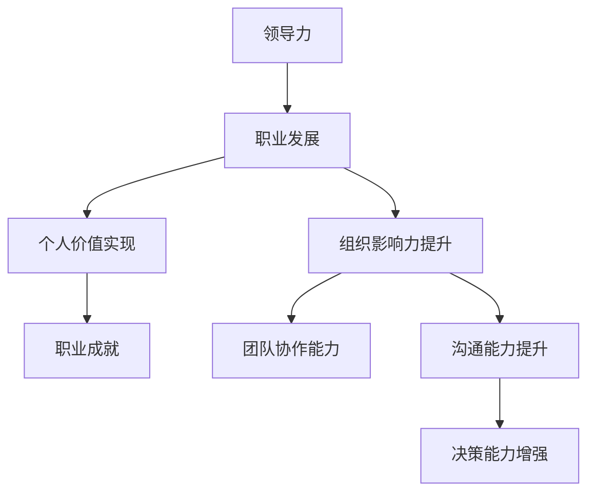

                 

# 《领导力与职业生态系统：创造成长机会的方法》

关键词：领导力、职业生态系统、成长机会、方法、IT领域

摘要：本文旨在探讨领导力在职业生态系统中的作用，以及如何通过有效的领导力策略创造成长机会。文章首先介绍了领导力的概念及其在现代社会的重要性，随后详细阐述了职业生态系统的构建原则和影响因素。接着，文章分析了领导力与职业发展的联系，并探讨了不同领导力模型在实际中的应用。最后，文章提供了具体的成长策略和实践方法，帮助读者在职业道路上实现个人成长。

## 第一部分：背景介绍

### 1.1 领导力的概念

领导力是指一种能够激发、引导和影响他人，共同实现目标的能力。它不仅仅是权威和权力的象征，更是一种服务、协作和信任的体现。在组织中，领导力是推动团队向前发展的重要力量，有助于提高员工的工作积极性和创造力。

### 1.2 领导力的社会作用

领导力在社会中扮演着重要角色。首先，它有助于促进社会稳定和发展。优秀的领导者能够引导公众，推动社会进步。其次，领导力在商业领域尤为重要。企业领导者通过有效的领导力策略，可以提升企业的竞争力，实现持续增长。最后，领导力在个人层面也有重要作用。通过领导力，个人可以在职业生涯中取得成功，实现个人价值。

### 1.3 领导力的现代变迁

随着社会的不断进步，领导力也在发生着变化。现代领导者需要具备更多的技能和素质，如创新能力、跨文化沟通能力、团队合作能力等。此外，领导力的形式也在发生变化。从传统的命令式领导到现代的赋能型领导，领导者需要更加关注员工的成长和发展，创造一个积极、包容和创新的组织文化。

## 第二部分：核心概念与联系

### 2.1 领导力模型

领导力模型是对领导行为和风格的分类和描述。常见的领导力模型包括领导风格理论、领导行为理论和领导影响力理论。这些模型有助于我们理解和应用领导力，提高领导效果。

### 2.2 职业发展路径

职业发展路径是指一个人在职业生涯中的成长过程。职业发展路径通常包括职业规划、职业挑战和职业成就等阶段。通过有效的职业发展路径，个人可以在职业生涯中实现个人价值。

### 2.3 领导力与职业发展的联系

领导力与职业发展密切相关。优秀的领导力有助于个人在职业道路上取得成功。同时，职业发展也为领导力提供了实践和锻炼的机会。通过不断学习和实践，个人可以不断提升自己的领导力水平。

## 第三部分：领导力理论与实践

### 3.1 领导力理论概述

领导力理论主要包括领导风格理论、领导行为理论和领导影响力理论。这些理论为我们提供了理解和应用领导力的框架。

### 3.2 领导力案例分析

在本节中，我们将通过国内和国际的领导力案例分析，探讨如何将领导力理论应用到实际中，实现个人和组织的成长。

### 3.3 案例分析总结

通过对领导力案例的分析，我们可以得出以下结论：有效的领导力策略需要根据实际情况进行灵活调整。同时，领导者需要关注员工的成长和发展，创造一个积极、包容和创新的组织文化。

## 第四部分：职业生态系统构建

### 4.1 职业生态系统的构建原则

职业生态系统的构建需要遵循一定的原则，如资源共享、协同合作、公平竞争等。这些原则有助于建立一个健康、有序的职业生态系统。

### 4.2 职业生态系统中的个人角色

在职业生态系统中，个人既是构建者，也是参与者。通过有效的职业规划和发展策略，个人可以在这个生态系统中实现个人价值。

### 4.3 职业素养提升

职业素养的提升是职业生态系统构建的重要组成部分。通过不断学习和实践，个人可以提升自己的职业素养，提高在职业生态系统中的竞争力。

## 第五部分：成长机会与方法

### 5.1 创造成长机会的方法

在本节中，我们将探讨如何通过有效的领导力策略和职业发展策略，创造成长机会。

### 5.2 成长策略与实践

成长策略和实践是创造成长机会的关键。在本节中，我们将详细介绍具体的成长策略和实践方法，帮助读者在职业道路上实现个人成长。

### 5.3 最佳实践与启示

通过对最佳实践的总结和启示，我们可以得出以下结论：有效的领导力策略和职业发展策略是实现个人成长的关键。同时，持续学习和实践是提升个人竞争力的基础。

## 总结

本文通过探讨领导力与职业生态系统之间的关系，提出了一系列创造成长机会的方法。希望读者通过本文的学习，能够更好地理解和应用领导力，实现个人在职业生态系统中的成长。

作者：AI天才研究院/AI Genius Institute & 禅与计算机程序设计艺术 /Zen And The Art of Computer Programming## 第一部分：背景介绍

### 1.1 领导力的概念

领导力是一个多维度的概念，它不仅仅局限于组织的上下级关系，更是一种能够激发、引导和影响他人，共同实现目标的能力。在技术领域，领导力的重要性尤为突出。随着信息技术的快速发展，IT行业正面临前所未有的变革。从大数据、人工智能到云计算，新的技术不断涌现，企业对技术人才的需求也在不断变化。在这个快速变化的环境中，领导力成为推动组织创新、提升竞争力的关键因素。

领导力的本质是一种影响力，它不仅仅是权威和权力的象征，更是一种服务、协作和信任的体现。一个优秀的领导者能够激发团队潜力，推动技术团队实现共同的目标。在IT行业，领导力不仅体现在对技术的理解和掌握上，更体现在如何带领团队克服挑战，实现技术突破。

### 1.2 领导力的社会作用

领导力在社会中的作用是多方面的。首先，它有助于促进社会稳定和发展。优秀的领导者能够引导公众，推动社会进步。例如，在应对全球气候变化、消除贫困等重大社会问题上，领导力发挥着至关重要的作用。其次，在商业领域，领导力是推动企业持续发展的重要力量。一个企业的成功离不开优秀的领导者，他们能够把握市场趋势，制定正确的战略，带领团队实现目标。此外，领导力在个人层面也有重要作用。通过领导力，个人可以在职业生涯中取得成功，实现个人价值。

在IT行业中，领导力的社会作用尤为显著。随着技术的不断进步，IT行业正成为推动社会变革的重要力量。优秀的领导者不仅能够带领团队实现技术突破，还能够推动技术创新，为社会创造更大的价值。例如，谷歌的CEO桑达尔·皮查伊就以其卓越的领导力，带领谷歌在人工智能、云计算等前沿领域取得了重大突破。

### 1.3 领导力的现代变迁

随着社会的不断进步，领导力也在发生着深刻的变化。现代领导者需要具备更多的技能和素质，如创新能力、跨文化沟通能力、团队合作能力等。传统的领导模式往往依赖于权威和控制，而现代领导者更强调赋能和协作。他们关注员工的成长和发展，致力于创造一个积极、包容和创新的组织文化。

在IT行业，现代领导力的变迁尤为明显。首先，技术的快速发展要求领导者具备持续学习和创新能力。例如，特斯拉的CEO埃隆·马斯克就以其创新精神和远见卓识，引领特斯拉在电动汽车和自动驾驶技术领域取得了巨大成功。其次，现代领导者需要具备跨文化沟通能力。在全球化的背景下，IT企业需要与来自不同国家和文化背景的团队成员协作，领导者需要能够有效沟通和协调，推动团队协作。

此外，现代领导力还强调团队合作和员工参与。通过建立信任和开放沟通的环境，领导者可以激发团队潜力，实现共同目标。例如，微软的CEO萨提亚·纳德拉就以其“拥抱多样性、赋能每一个人”的领导理念，推动了微软在团队合作和创新方面的重大变革。

### 1.4 领导力在IT行业的应用

在IT行业，领导力不仅体现在对技术的理解和掌握上，更体现在如何带领团队实现技术突破，推动企业创新。以下是领导力在IT行业应用的几个关键方面：

#### 1.4.1 技术领导

技术领导是IT行业领导力的核心之一。技术领导者需要具备深厚的专业知识和技术能力，能够引领团队在技术前沿不断探索和创新。例如，亚马逊的CTO沃尔特·贝尔奇以其在云计算领域的技术领导力，推动了亚马逊在AWS服务上的重大突破。

#### 1.4.2 战略领导

IT行业的快速发展要求领导者具备敏锐的市场洞察力和战略规划能力。技术领导者需要能够把握市场趋势，制定正确的战略，确保企业在竞争激烈的市场中保持领先地位。例如，苹果的CEO蒂姆·库克以其卓越的战略领导力，推动了苹果在智能手机、平板电脑等领域的持续创新。

#### 1.4.3 团队领导

团队领导是IT行业领导力的另一个重要方面。技术领导者需要能够激发团队潜力，推动团队成员之间的协作，共同实现目标。例如，谷歌的CEO桑达尔·皮查伊以其卓越的团队领导力，推动了谷歌在人工智能、云计算等前沿领域的持续创新。

#### 1.4.4 文化领导

文化领导是IT行业领导力的关键。技术领导者需要能够塑造积极、包容和创新的企业文化，激发员工的创造力和工作热情。例如，微软的CEO萨提亚·纳德拉以其“拥抱多样性、赋能每一个人”的文化领导理念，推动了微软在团队合作和创新方面的重大变革。

### 1.5 领导力在IT行业中的挑战与机遇

在IT行业，领导力面临着一系列挑战和机遇。以下是其中一些主要挑战和机遇：

#### 1.5.1 持续学习与创新

随着技术的不断进步，IT行业对领导者的持续学习与创新提出了更高的要求。领导者需要不断更新自己的知识体系，掌握最新的技术趋势，以适应不断变化的市场环境。

#### 1.5.2 跨领域合作

全球化的背景下，IT行业越来越依赖跨领域合作。领导者需要具备跨文化沟通能力，能够与来自不同国家和文化背景的合作伙伴有效沟通和协作。

#### 1.5.3 数据驱动决策

在大数据时代，领导者需要能够运用数据驱动决策，通过数据分析和挖掘，发现市场机会和潜在风险。

#### 1.5.4 人才竞争

IT行业的人才竞争日益激烈。领导者需要能够吸引和留住顶尖人才，构建一支高效、创新的技术团队。

#### 1.5.5 企业社会责任

随着社会责任意识的提高，IT行业的领导者需要关注企业的社会责任，推动可持续发展，为社会创造更大的价值。

### 1.6 领导力的重要性

领导力在IT行业中的重要性不可忽视。优秀的领导者不仅能够推动企业技术创新，提高竞争力，还能够激发团队潜力，实现个人和组织的共同成长。在快速变化的市场环境中，领导力成为推动企业持续发展的关键因素。

### 1.7 领导力与职业发展的关系

领导力与职业发展密切相关。优秀的领导力可以帮助个人在职业生涯中取得成功，实现个人价值。同时，职业发展也为领导力提供了实践和锻炼的机会。通过不断学习和实践，个人可以不断提升自己的领导力水平，实现职业发展的跨越。

### 1.8 领导力的培养与提升

领导力的培养和提升是一个长期的过程。以下是一些培养和提升领导力的方法：

#### 1.8.1 持续学习

领导者需要不断学习新的知识和技能，以适应不断变化的市场环境。

#### 1.8.2 反思与总结

领导者需要通过反思和总结，从失败和成功中吸取经验教训，不断提升自己的领导能力。

#### 1.8.3 沟通与协作

领导者需要具备良好的沟通和协作能力，能够与团队成员有效沟通，推动团队协作。

#### 1.8.4 倾听与反馈

领导者需要倾听团队成员的意见和反馈，理解他们的需求和期望，为他们提供支持和帮助。

#### 1.8.5 倡导创新

领导者需要鼓励创新思维，推动组织变革，为团队成员提供创新的机会和平台。

### 1.9 领导力在IT行业中的最佳实践

以下是领导力在IT行业中的几个最佳实践：

#### 1.9.1 设定明确的目标和愿景

领导者需要设定明确的目标和愿景，为团队提供方向和动力。

#### 1.9.2 建立积极的团队文化

领导者需要建立积极的团队文化，鼓励团队成员之间的信任和合作。

#### 1.9.3 提供持续的支持和反馈

领导者需要为团队成员提供持续的支持和反馈，帮助他们成长和进步。

#### 1.9.4 激发创新思维

领导者需要激发创新思维，鼓励团队成员提出新的想法和解决方案。

#### 1.9.5 倡导学习和成长

领导者需要倡导学习和成长，为团队成员提供学习和成长的机会。

## 第二部分：核心概念与联系

### 2.1 领导力模型

领导力模型是对领导行为和风格的分类和描述，有助于我们理解和应用领导力，提高领导效果。常见的领导力模型包括领导风格理论、领导行为理论和领导影响力理论。这些模型为我们提供了分析领导行为的工具，有助于我们根据不同的情况选择合适的领导策略。

#### 2.1.1 领导风格理论

领导风格理论主要关注领导者的行为和风格，将领导风格分为不同的类型。常见的领导风格包括：

- **权威型领导**：领导者做出决策并强制执行，对下属的控制较强。
- **民主型领导**：领导者鼓励下属参与决策，尊重下属的意见。
- **参与型领导**：领导者积极与下属沟通，鼓励下属参与决策，注重团队合作。
- **教练型领导**：领导者关注下属的个人成长，提供指导和支持，帮助他们实现目标。

#### 2.1.2 领导行为理论

领导行为理论主要关注领导者的行为和态度，将领导行为分为不同的类型。常见的领导行为包括：

- **任务导向型行为**：领导者专注于任务的完成，注重目标和结果的实现。
- **关系导向型行为**：领导者关注团队成员之间的关系，注重团队氛围的建设。

#### 2.1.3 领导影响力理论

领导影响力理论主要关注领导者的影响力来源，将领导影响力分为不同的类型。常见的领导影响力包括：

- **权力型影响力**：领导者通过权力和职位来影响他人。
- **关系型影响力**：领导者通过建立良好的人际关系来影响他人。
- **价值观型影响力**：领导者通过传递共同的价值观和使命来影响他人。

#### 2.1.4 领导力模型的应用

领导力模型在实际应用中具有重要意义。通过理解不同的领导力模型，领导者可以根据不同的情况选择合适的领导策略，提高领导效果。例如：

- 在紧急情况下，权威型领导风格可能更有效，因为领导者可以迅速做出决策并强制执行。
- 在需要创新和团队合作的情况下，民主型或参与型领导风格可能更有效，因为领导者可以鼓励团队成员参与决策，共同实现目标。

### 2.2 职业发展路径

职业发展路径是指一个人在职业生涯中的成长过程。它通常包括职业规划、职业挑战和职业成就等阶段。通过有效的职业发展路径，个人可以在职业生涯中实现个人价值。

#### 2.2.1 职业规划

职业规划是职业发展的第一步。个人需要明确自己的职业目标和发展方向，制定具体的行动计划。职业规划可以帮助个人明确自己的优势和不足，为未来的发展做好准备。

#### 2.2.2 职业挑战

职业挑战是职业发展过程中不可避免的一部分。个人需要面对各种挑战，如技能提升、团队合作、工作压力等。通过克服这些挑战，个人可以不断提升自己的能力和素质。

#### 2.2.3 职业成就

职业成就是职业发展的最终目标。个人需要在职业发展中取得一定的成就，如晋升、加薪、获得奖项等。职业成就不仅可以提升个人的自信心和满足感，还可以为未来的发展提供更多的机会。

#### 2.2.4 职业发展路径的策略

为了实现职业发展的目标，个人需要采取一系列策略。以下是一些有效的职业发展策略：

- **不断学习和提升技能**：随着技术的发展，个人需要不断学习和提升技能，以适应不断变化的市场环境。
- **建立良好的人际关系**：人际关系对职业发展至关重要。个人需要建立广泛的人际关系网络，为自己创造更多的发展机会。
- **积极面对挑战**：面对挑战时，个人需要保持积极的态度，勇敢面对困难，寻找解决问题的方法。
- **设定明确的职业目标**：设定明确的职业目标可以帮助个人保持专注，有针对性地进行职业发展。

### 2.3 领导力与职业发展的关系

领导力与职业发展密切相关。优秀的领导力可以帮助个人在职业道路上取得成功，实现个人价值。同时，职业发展也为领导力提供了实践和锻炼的机会。通过不断学习和实践，个人可以不断提升自己的领导力水平，实现职业发展的跨越。

#### 2.3.1 领导力对职业发展的影响

领导力对职业发展的影响主要体现在以下几个方面：

- **提升个人影响力**：优秀的领导力可以帮助个人在组织中建立良好的人际关系，提升个人影响力，为职业发展创造有利条件。
- **增强解决问题的能力**：领导力要求领导者具备强大的解决问题的能力。通过解决各种复杂的问题，个人可以不断提升自己的能力和素质。
- **提供更多的发展机会**：优秀的领导力可以为个人提供更多的发展机会，如晋升、参与重要项目等。
- **提升团队合作能力**：领导力强调团队合作，通过领导团队，个人可以提升自己的团队合作能力，为职业发展打下坚实基础。

#### 2.3.2 职业发展对领导力的影响

职业发展对领导力的影响也是显而易见的。通过职业发展，个人可以不断积累经验，提升自己的领导力水平。以下是一些具体的影响：

- **丰富经验**：职业发展过程中，个人需要面对各种挑战，如项目负责、团队管理等。这些经验可以丰富个人的领导力经验，提升领导能力。
- **增强自我认知**：职业发展使个人有机会深入了解自己的优势和不足，通过不断调整和改进，提升领导力水平。
- **提高沟通能力**：职业发展要求个人具备良好的沟通能力，通过有效的沟通，个人可以更好地领导团队，实现目标。
- **增强决策能力**：职业发展过程中，个人需要做出各种决策，这些决策经验可以提升个人的决策能力，为领导力的提升打下基础。

### 2.4 领导力与职业发展的关系图

为了更好地理解领导力与职业发展的关系，我们可以使用Mermaid流程图来表示它们之间的联系。以下是一个简单的Mermaid流程图示例：

在这个流程图中，领导力通过影响职业发展，最终实现个人价值和组织影响力的提升。同时，职业发展也为领导力的提升提供了机会和平台。

## 第三部分：领导力理论与实践

### 3.1 领导力理论概述

领导力理论是对领导行为的系统研究和阐述，旨在解释领导现象、预测领导效果，并提供指导领导实践的框架。常见的领导力理论包括领导风格理论、领导行为理论和领导影响力理论。这些理论为我们理解和应用领导力提供了不同的视角和工具。

#### 3.1.1 领导风格理论

领导风格理论主要关注领导者的行为和风格，将领导风格分为不同的类型。这种理论认为，领导者的风格会影响其领导效果。常见的领导风格包括：

- **权威型领导**：领导者做出决策并强制执行，对下属的控制较强。
- **民主型领导**：领导者鼓励下属参与决策，尊重下属的意见。
- **参与型领导**：领导者积极与下属沟通，鼓励下属参与决策，注重团队合作。
- **教练型领导**：领导者关注下属的个人成长，提供指导和支持，帮助他们实现目标。

领导风格理论的核心观点是，不同的领导风格适用于不同的情境和团队，领导者需要根据实际情况灵活调整自己的领导风格。

#### 3.1.2 领导行为理论

领导行为理论主要关注领导者的行为和态度，将领导行为分为不同的类型。这种理论认为，领导行为会影响其领导效果。常见的领导行为包括：

- **任务导向型行为**：领导者专注于任务的完成，注重目标和结果的实现。
- **关系导向型行为**：领导者关注团队成员之间的关系，注重团队氛围的建设。

领导行为理论的核心观点是，领导者的行为对其领导效果有重要影响，领导者需要通过积极的行为来塑造团队文化和提高团队绩效。

#### 3.1.3 领导影响力理论

领导影响力理论主要关注领导者的影响力来源，将领导影响力分为不同的类型。这种理论认为，领导者的影响力来源于其权力、人际关系和价值观。常见的领导影响力包括：

- **权力型影响力**：领导者通过权力和职位来影响他人。
- **关系型影响力**：领导者通过建立良好的人际关系来影响他人。
- **价值观型影响力**：领导者通过传递共同的价值观和使命来影响他人。

领导影响力理论的核心观点是，领导者的影响力不仅仅取决于其职位和权力，还取决于其人际关系和价值观。

#### 3.1.4 领导力理论的应用

领导力理论在实际应用中具有重要意义。通过理解不同的领导力理论，领导者可以根据不同的情况选择合适的领导策略，提高领导效果。以下是一些应用示例：

- 在紧急情况下，权威型领导风格可能更有效，因为领导者可以迅速做出决策并强制执行。
- 在需要创新和团队合作的情况下，民主型或参与型领导风格可能更有效，因为领导者可以鼓励团队成员参与决策，共同实现目标。
- 在需要长期发展和团队文化建设的情况下，教练型领导风格可能更有效，因为领导者可以关注下属的个人成长，提供指导和支持。

### 3.2 领导力模型案例分析

在本节中，我们将通过分析几个具体的领导力模型案例，探讨如何将理论应用到实际中，实现个人和组织的成长。

#### 3.2.1 权威型领导案例分析

案例：华为的CEO任正非

任正非是华为的创始人兼CEO，他以权威型领导风格著称。在华为的发展过程中，任正非通过严格的决策和执行，确保了公司的高效运转。以下是任正非权威型领导的一些具体做法：

- **明确目标**：任正非在华为的发展初期就明确了公司的愿景和使命，并通过严格的决策和执行，确保公司的战略方向始终清晰。
- **强调执行力**：任正非对下属的要求非常严格，强调执行力，确保公司的战略得以有效实施。
- **激励制度**：任正非通过设立高额的激励制度，激励员工为公司的发展做出贡献。

案例分析：任正非的权威型领导风格在华为的发展过程中发挥了重要作用。通过明确的决策和高效的执行力，华为在短时间内迅速成长为全球领先的科技公司。然而，权威型领导也存在一定的局限性，如可能导致下属的创造力和积极性受到压制。因此，领导者需要在不同的情境下灵活运用领导风格，实现领导效果的最大化。

#### 3.2.2 民主型领导案例分析

案例：谷歌的CEO桑达尔·皮查伊

桑达尔·皮查伊是谷歌的CEO，他以民主型领导风格著称。在谷歌的发展过程中，皮查伊通过鼓励员工参与决策，推动了公司的创新和进步。以下是皮查伊民主型领导的一些具体做法：

- **鼓励员工参与**：皮查伊鼓励员工参与公司的决策过程，通过开放沟通和透明度，增强员工的参与感和归属感。
- **重视团队合作**：皮查伊强调团队合作，通过跨部门合作和知识共享，推动公司的整体发展。
- **建立信任**：皮查伊通过建立信任和尊重，促进团队成员之间的合作和协作。

案例分析：桑达尔·皮查伊的民主型领导风格在谷歌的发展过程中取得了显著成效。通过鼓励员工参与决策，谷歌在技术创新和市场拓展方面取得了巨大成功。民主型领导风格有助于激发员工的创造力和积极性，推动组织的持续创新。然而，民主型领导也面临一定的挑战，如决策效率可能受到影响。因此，领导者需要在保持创新和团队合作的同时，确保决策的效率和执行力。

#### 3.2.3 教练型领导案例分析

案例：微软的CEO萨提亚·纳德拉

萨提亚·纳德拉是微软的CEO，他以教练型领导风格著称。在微软的发展过程中，纳德拉关注下属的个人成长，推动了公司的变革和发展。以下是纳德拉教练型领导的一些具体做法：

- **关注个人成长**：纳德拉关注下属的个人成长，提供指导和支持，帮助他们实现个人目标。
- **建立学习文化**：纳德拉倡导学习文化，鼓励员工不断学习和提升技能，以适应快速变化的市场环境。
- **推动团队合作**：纳德拉强调团队合作，通过跨部门合作和知识共享，推动公司的整体发展。

案例分析：萨提亚·纳德拉的教练型领导风格在微软的发展过程中发挥了重要作用。通过关注下属的个人成长和推动团队合作，微软在技术突破和市场拓展方面取得了显著成效。教练型领导风格有助于激发员工的潜力，提升组织的整体竞争力。然而，教练型领导也需要耗费大量的时间和精力，领导者需要平衡个人成长和组织目标。

### 3.3 领导力模型的优缺点分析

在了解了不同的领导力模型后，我们需要对其优缺点进行综合分析，以便在实际应用中做出明智的选择。

#### 3.3.1 权威型领导

优点：

- **决策效率高**：权威型领导通过明确的决策和严格的执行，可以提高决策效率，确保组织的快速反应。
- **明确目标**：权威型领导通过明确的目标和愿景，可以统一组织方向，提高组织的执行力。

缺点：

- **抑制创新**：权威型领导可能导致下属的创造力和积极性受到压制，不利于创新。
- **压力较大**：权威型领导者需要承担更多的决策压力，可能会对领导者的身心健康造成影响。

#### 3.3.2 民主型领导

优点：

- **激发创新**：民主型领导鼓励员工参与决策，可以激发员工的创新思维，推动组织的创新和发展。
- **团队合作**：民主型领导强调团队合作，可以增强团队凝聚力，提高团队绩效。

缺点：

- **决策效率低**：民主型领导可能需要更多的时间和讨论，降低决策效率。
- **管理复杂**：民主型领导可能面临管理复杂性和协调难度，需要更多的沟通和协调。

#### 3.3.3 教练型领导

优点：

- **个人成长**：教练型领导关注下属的个人成长，可以激发员工的潜力，提高员工的能力和素质。
- **团队合作**：教练型领导通过关注个人成长，可以促进团队合作，提高团队的整体绩效。

缺点：

- **耗时较大**：教练型领导需要投入大量时间和精力，可能对领导者的工作生活平衡造成影响。
- **效果不稳定**：教练型领导的效果可能受到领导者个人能力和领导风格的影响，效果不稳定。

### 3.4 领导力模型的综合应用

在实际应用中，领导者需要根据具体情况灵活运用不同的领导力模型，实现领导效果的最大化。以下是一些综合应用的建议：

- **根据情境选择**：领导者需要根据不同的情境选择合适的领导力模型。在紧急情况下，可以采用权威型领导；在需要创新和团队合作的情况下，可以采用民主型领导；在需要个人成长和团队合作的情况下，可以采用教练型领导。
- **灵活调整**：领导者需要根据实际情况灵活调整领导力模型，确保领导效果的最大化。例如，在某个阶段采用权威型领导，在下一个阶段采用民主型领导，以适应组织发展的需要。
- **结合个人优势**：领导者需要结合自己的个人优势和领导风格，选择合适的领导力模型。例如，如果领导者擅长沟通和协作，可以采用民主型领导；如果领导者擅长决策和执行，可以采用权威型领导。

## 第四部分：职业生态系统构建

### 4.1 职业生态系统的构建原则

职业生态系统的构建是一个复杂而系统的过程，需要遵循一定的原则，以确保其健康、有序和可持续发展。以下是构建职业生态系统的一些关键原则：

#### 4.1.1 资源共享

资源共享是职业生态系统构建的核心原则之一。在职业生态系统中，各方参与者（如企业、个人、教育机构等）需要共享资源和信息，以实现共同的目标。资源共享可以包括技术资源、知识资源、人才资源等，通过共享，可以提升整个生态系统的效率和创新能力。

#### 4.1.2 协同合作

协同合作是职业生态系统构建的重要原则。在职业生态系统中，各方参与者需要通过协同合作，共同解决面临的挑战和问题。协同合作可以促进知识的交流和创新，提高整个生态系统的竞争力。

#### 4.1.3 公平竞争

公平竞争是职业生态系统构建的基本原则。在职业生态系统中，各方参与者需要在一个公平的环境中竞争，以确保资源的合理分配和系统的健康发展。公平竞争可以激发创新和活力，促进生态系统的持续进步。

#### 4.1.4 持续学习

持续学习是职业生态系统构建的关键原则。在快速变化的时代，个人和组织的知识更新速度越来越快，持续学习成为提升竞争力的关键。职业生态系统需要提供良好的学习环境和资源，支持个人和组织的持续学习。

#### 4.1.5 创新驱动

创新驱动是职业生态系统构建的重要原则。在职业生态系统中，创新是推动系统发展的动力。通过鼓励创新，可以激发个人和组织的创造力和活力，提升整个生态系统的竞争力。

### 4.2 职业生态系统的构建步骤

构建职业生态系统需要一系列的步骤，以下是一些关键的步骤：

#### 4.2.1 明确目标

构建职业生态系统首先需要明确目标。目标可以是提升整个生态系统的竞争力、促进创新和知识交流等。明确目标有助于指导整个构建过程。

#### 4.2.2 分析现状

在明确目标后，需要对当前的职业生态系统进行分析。分析内容包括生态系统的构成、资源分布、合作模式等。通过分析现状，可以了解生态系统的优势和不足，为下一步的改进提供依据。

#### 4.2.3 制定策略

基于对现状的分析，需要制定具体的策略和计划。策略可以包括资源共享机制、协同合作模式、公平竞争机制、持续学习体系等。制定策略有助于明确生态系统的建设路径。

#### 4.2.4 实施和监督

在制定策略后，需要实施和监督生态系统的建设过程。实施包括具体的行动和措施，如建立资源共享平台、组织合作活动、制定公平竞争规则等。监督则是确保实施效果和进度，及时调整和优化策略。

#### 4.2.5 持续优化

职业生态系统的构建是一个持续的过程，需要不断地优化和改进。通过收集反馈和评估效果，可以不断调整和优化生态系统的构建策略，实现更好的效果。

### 4.3 职业生态系统的影响因素

职业生态系统的发展受到多种因素的影响，以下是一些主要的影响因素：

#### 4.3.1 政策环境

政策环境是职业生态系统发展的关键因素。政府的政策支持可以促进职业生态系统的建设，如提供税收优惠、资金支持等。政策环境的好坏直接影响职业生态系统的发展。

#### 4.3.2 经济环境

经济环境也是职业生态系统发展的重要因素。经济的繁荣和稳定可以为职业生态系统提供良好的发展环境，促进资源的流动和知识的交流。

#### 4.3.3 社会文化

社会文化对职业生态系统的发展也有重要影响。积极向上的社会文化可以激发个人和组织的发展潜力，促进创新和合作。

#### 4.3.4 技术进步

技术的进步是推动职业生态系统发展的重要动力。新技术的出现可以为职业生态系统带来新的机遇和挑战，促进创新和进步。

#### 4.3.5 教育体系

教育体系是职业生态系统的基础。良好的教育体系可以培养出更多的人才，为职业生态系统提供强大的支持。

### 4.4 职业生态系统中的个人角色

在职业生态系统中，个人既是构建者，也是参与者。个人在职业生态系统中的角色包括：

#### 4.4.1 构建者

作为构建者，个人需要积极参与职业生态系统的建设。可以通过以下方式参与：

- **分享知识和经验**：个人可以通过分享自己的知识和经验，为职业生态系统的发展做出贡献。
- **参与合作项目**：个人可以参与跨机构的合作项目，推动知识的交流和创新。
- **提出建议和反馈**：个人可以对职业生态系统的发展提出建议和反馈，促进系统的优化和改进。

#### 4.4.2 参与者

作为参与者，个人需要积极参与职业生态系统中的各项活动。可以通过以下方式参与：

- **学习新知识**：个人需要不断学习新知识，提升自己的技能和素质，以适应职业生态系统的发展。
- **参与市场活动**：个人可以参与各种市场活动，如创业比赛、行业论坛等，拓宽视野，提升自己的竞争力。
- **建立人际关系**：个人需要建立广泛的人际关系网络，为未来的职业发展打下基础。

### 4.5 职业素养提升

职业素养的提升是职业生态系统构建的重要组成部分。以下是提升职业素养的一些方法：

#### 4.5.1 持续学习

持续学习是提升职业素养的基础。个人需要不断学习新知识、新技能，以适应职业生态系统的发展。

#### 4.5.2 培养团队合作精神

团队合作精神是职业素养的重要组成部分。个人需要培养良好的团队合作精神，提高协作能力。

#### 4.5.3 提高沟通能力

沟通能力是职业素养的关键。个人需要提高沟通能力，包括书面沟通和口头沟通，以更好地与他人合作。

#### 4.5.4 培养创新思维

创新思维是推动职业发展的重要力量。个人需要培养创新思维，以应对职业生态系统中的各种挑战。

### 4.6 职业生态系统中的合作机制

在职业生态系统中，合作机制是确保各方有效协作、共同发展的关键。以下是一些有效的合作机制：

#### 4.6.1 共享平台

共享平台是职业生态系统中的重要合作机制。通过共享平台，各方可以共享资源、知识和技术，提高整个生态系统的效率和创新能力。

#### 4.6.2 合作项目

合作项目是职业生态系统中的合作机制之一。通过合作项目，各方可以共同解决面临的问题，实现知识的交流和创新。

#### 4.6.3 人才交流

人才交流是职业生态系统中的重要合作机制。通过人才交流，各方可以共享人才资源，提升整体的人才素质。

#### 4.6.4 沟通渠道

沟通渠道是职业生态系统中的合作机制之一。通过建立有效的沟通渠道，各方可以及时沟通、交流意见，提高协作效率。

### 4.7 职业生态系统中的创新机制

创新机制是推动职业生态系统发展的重要动力。以下是一些有效的创新机制：

#### 4.7.1 鼓励创新

职业生态系统需要鼓励创新，为创新提供良好的环境和支持。可以通过设立创新奖项、提供创新资金等手段，鼓励个人和组织的创新。

#### 4.7.2 知识共享

知识共享是创新的重要基础。职业生态系统需要建立有效的知识共享机制，促进知识的交流和创新。

#### 4.7.3 跨界合作

跨界合作是创新的重要手段。通过跨界合作，可以整合不同领域的资源，推动创新和进步。

#### 4.7.4 创新激励机制

创新激励机制是推动创新的重要手段。职业生态系统需要建立有效的创新激励机制，激励个人和组织不断进行创新。

### 4.8 职业生态系统中的风险管理

职业生态系统中的风险管理是确保系统稳定和可持续发展的重要环节。以下是一些有效的风险管理策略：

#### 4.8.1 风险识别

风险识别是风险管理的第一步。职业生态系统需要建立有效的风险识别机制，及时发现潜在的风险。

#### 4.8.2 风险评估

风险评估是对风险进行量化分析，确定风险的重要性和影响程度。职业生态系统需要建立有效的风险评估机制，对风险进行准确评估。

#### 4.8.3 风险应对

风险应对是制定应对风险的策略和措施。职业生态系统需要建立有效的风险应对机制，确保在风险发生时能够及时应对。

#### 4.8.4 风险监控

风险监控是对风险进行实时监测和跟踪，确保风险应对措施的有效性。职业生态系统需要建立有效的风险监控机制，确保风险管理的持续性和有效性。

## 第五部分：成长机会与方法

### 5.1 创造成长机会的方法

在快速变化的IT行业中，个人和组织需要不断适应新的技术、市场和竞争环境。创造成长机会是实现个人和组织持续发展的关键。以下是一些有效的方法，帮助个人和组织在职业生涯中创造成长机会：

#### 5.1.1 持续学习

持续学习是个人和组织成长的基础。在信息技术领域，技术更新速度极快，新的语言、框架、工具和算法层出不穷。个人和组织需要通过不断学习，跟上技术发展的步伐。以下是一些学习策略：

- **在线课程**：利用在线课程平台，如Coursera、edX、Udemy等，学习新技术和知识。
- **读书**：定期阅读行业相关书籍，了解最新的技术趋势和理论知识。
- **研讨会和讲座**：参加行业研讨会、技术讲座和论坛，与业内专家和同行交流，获取第一手信息。
- **内部培训**：组织内部培训和知识分享活动，提升团队整体技术水平。

#### 5.1.2 跨领域合作

跨领域合作是创造成长机会的重要途径。通过与其他行业和领域的合作，个人和组织可以开拓新的业务领域，实现技术和知识的跨界融合。以下是一些跨领域合作的策略：

- **寻找合作伙伴**：与其他行业的企业、研究机构、高校等建立合作关系，共同开展项目和研究。
- **参与行业联盟**：加入行业联盟和协会，与其他成员分享资源和经验，拓展视野。
- **跨领域项目**：参与跨领域的项目，如结合人工智能与医疗、教育等领域的项目，实现技术应用的扩展。

#### 5.1.3 参与开源项目

参与开源项目是提升个人技术能力和知名度的重要途径。开源项目通常汇集了全球优秀的开发者和贡献者，通过参与开源项目，个人可以：

- **学习最佳实践**：通过参与开源项目，了解和学习业界最佳实践和先进技术。
- **建立人脉**：与其他开发者建立联系，扩展人脉网络，提升职业竞争力。
- **贡献代码**：通过贡献代码，提升个人技术水平，并得到开源社区的认可。

#### 5.1.4 创新思维训练

创新思维是推动技术进步和业务发展的重要力量。通过创新思维训练，个人和组织可以培养创新意识，提高创新能力。以下是一些创新思维训练的方法：

- **头脑风暴**：定期组织头脑风暴会议，鼓励团队成员提出新的想法和解决方案。
- **思维导图**：使用思维导图工具，整理和记录创意和思路，激发创新思维。
- **情境模拟**：模拟不同的情境和问题，探索可能的解决方案，培养应对复杂问题的能力。

#### 5.1.5 职业规划

职业规划是个人职业发展的关键。通过制定明确的职业规划，个人可以明确自己的职业目标和发展路径，有针对性地提升自己的技能和素质。以下是一些职业规划的方法：

- **设定目标**：设定明确的职业目标，包括短期和长期目标。
- **评估自身优势**：分析自身的优势和不足，确定自己的发展方向。
- **制定行动计划**：根据目标和发展方向，制定具体的行动计划，包括学习计划、项目计划等。
- **定期评估和调整**：定期评估职业规划的实施情况，根据实际情况进行调整。

#### 5.1.6 拓展视野

拓展视野是提升个人能力和职业素养的重要途径。通过拓宽知识面和视野，个人可以更好地适应行业变化和市场需求。以下是一些拓展视野的方法：

- **参加国际会议**：参加国际会议和行业展览，了解全球最新的技术趋势和市场动态。
- **阅读国际文献**：阅读国际知名期刊、书籍和研究报告，了解国际先进的研究成果和应用实践。
- **跨文化交流**：参与跨文化交流活动，了解不同文化和价值观，提高跨文化沟通能力。

### 5.2 职业发展策略

在IT行业中，职业发展不仅需要个人能力的提升，还需要有效的策略和方法。以下是一些职业发展策略：

#### 5.2.1 技能提升

技能提升是职业发展的核心。个人需要根据市场需求和职业目标，不断提升自己的技能。以下是一些技能提升的方法：

- **掌握核心技术**：掌握行业核心技术和流行框架，如编程语言、数据库、云计算等。
- **学习新兴技术**：关注新兴技术和趋势，如人工智能、区块链、大数据等，提前掌握相关技能。
- **实践项目**：通过实际项目，将所学知识应用于实践，提升解决实际问题的能力。

#### 5.2.2 软技能提升

软技能在职业发展中同样重要。以下是一些软技能提升的方法：

- **沟通能力**：提高书面和口头沟通能力，确保能够清晰、准确地表达自己的想法和观点。
- **团队协作**：培养团队合作精神，学会与他人合作，共同完成项目。
- **领导力**：提升领导力，学会如何带领团队，实现团队目标。

#### 5.2.3 网络建设

建立广泛的人脉网络对职业发展至关重要。以下是一些网络建设的方法：

- **参与社交活动**：参加行业会议、技术沙龙、社交活动等，与业内人士建立联系。
- **利用社交媒体**：利用LinkedIn、Twitter等社交媒体平台，与行业专家和同行保持联系。
- **加入专业组织**：加入专业组织和协会，参加相关的活动和讨论，拓展视野。

#### 5.2.4 职业规划

职业规划是实现职业发展的关键。以下是一些职业规划的方法：

- **设定目标**：设定明确的职业目标，包括短期和长期目标。
- **评估自身优势**：分析自身的优势和不足，确定自己的发展方向。
- **制定行动计划**：根据目标和发展方向，制定具体的行动计划，包括学习计划、项目计划等。
- **定期评估和调整**：定期评估职业规划的实施情况，根据实际情况进行调整。

### 5.3 成长策略与实践

在实际操作中，个人和组织需要根据具体情况，灵活运用不同的成长策略。以下是一些具体的成长策略和实践：

#### 5.3.1 个人成长规划

个人成长规划是职业发展的基础。以下是一些个人成长规划的具体步骤：

- **设定职业目标**：明确自己的职业目标，包括职位目标、技能目标等。
- **分析自身优势**：分析自身的优势和不足，确定需要提升的技能和素质。
- **制定学习计划**：根据职业目标，制定具体的学习计划，包括学习内容、学习时间等。
- **执行学习计划**：按照学习计划，执行学习任务，确保学习效果。
- **定期评估**：定期评估自己的学习进度和效果，根据实际情况进行调整。

#### 5.3.2 跨部门合作

跨部门合作可以促进知识和资源的共享，提升个人和组织的整体能力。以下是一些跨部门合作的策略：

- **建立沟通渠道**：建立跨部门的沟通渠道，如定期会议、邮件列表等，确保信息的畅通。
- **明确目标**：在合作前明确共同的目标和任务，确保各方都理解并认可。
- **共享资源**：共享资源和信息，如技术文档、数据资源等，提高合作效率。
- **建立激励机制**：建立激励机制，鼓励跨部门合作，提升合作积极性。

#### 5.3.3 技术分享和培训

技术分享和培训是提升团队技术水平和专业素养的重要手段。以下是一些技术分享和培训的方法：

- **内部培训**：组织内部培训，由技术专家分享最新的技术知识和实践经验。
- **技术讲座**：邀请行业专家进行技术讲座，分享行业前沿技术和最佳实践。
- **技术社区**：参与技术社区，与其他开发者交流技术问题和经验，提升自己的技术水平。

#### 5.3.4 创新项目

创新项目是推动技术进步和业务发展的重要途径。以下是一些创新项目的策略：

- **项目立项**：确定创新项目的目标和可行性，制定详细的计划。
- **团队组建**：组建跨部门、跨领域的团队，确保项目拥有多方面的专业知识和技能。
- **资源调配**：调配必要的资源，如资金、技术支持等，确保项目顺利进行。
- **项目监控**：建立项目监控机制，确保项目按计划进行，及时调整和优化项目进度。

### 5.4 成长过程中的挑战与应对

在职业成长过程中，个人和组织会遇到各种挑战。以下是一些常见的挑战及其应对策略：

#### 5.4.1 技术更新速度快

技术更新速度快是职业成长过程中面临的主要挑战之一。以下是一些应对策略：

- **持续学习**：保持持续学习的态度，不断提升自己的技术水平和知识储备。
- **关注技术趋势**：关注行业技术趋势，了解新技术的发展方向和应用场景。
- **参与开源项目**：通过参与开源项目，了解最新的技术发展和应用实践。

#### 5.4.2 工作压力和疲劳

工作压力和疲劳是职业成长过程中的另一个挑战。以下是一些应对策略：

- **合理规划时间**：合理安排工作和休息时间，确保身心健康。
- **调整工作方式**：采用高效的工作方式，提高工作效率，减少工作压力。
- **寻求支持**：与同事和领导沟通，寻求帮助和支持，共同应对工作压力。

#### 5.4.3 职业发展路径不清晰

职业发展路径不清晰是许多人在职业成长过程中面临的挑战。以下是一些应对策略：

- **制定职业规划**：制定明确的职业规划，明确自己的职业目标和发展路径。
- **寻求指导**：向导师、领导或职业规划师寻求指导，获取专业的意见和建议。
- **探索多个方向**：在职业发展的过程中，可以尝试不同的工作内容和方向，找到最适合自己的职业路径。

### 5.5 成长案例分享

以下是一些真实的成长案例，分享他们在职业成长过程中遇到的挑战、采取的策略以及取得的成果。

#### 5.5.1 案例一：李明的成长之路

李明是一名年轻的软件工程师，他在职业成长过程中遇到了技术更新速度快和职业发展路径不清晰的挑战。为了应对这些挑战，他采取了以下策略：

- **持续学习**：李明通过在线课程和阅读相关书籍，不断学习新技术和知识。
- **参与开源项目**：李明积极参与开源项目，通过贡献代码，提升自己的技术能力和知名度。
- **寻求指导**：李明向公司资深工程师请教，寻求职业规划的建议，明确自己的职业目标和发展路径。

经过几年的努力，李明成功晋升为高级软件工程师，并成为公司开源项目的主要贡献者之一。

#### 5.5.2 案例二：张丽的跨领域成长

张丽是一名产品经理，她在职业成长过程中遇到了跨领域合作的挑战。为了应对这个挑战，她采取了以下策略：

- **学习跨领域知识**：张丽通过参加行业研讨会和阅读跨领域书籍，学习新的知识和技能。
- **建立跨部门沟通渠道**：张丽主动与其他部门的同事建立沟通渠道，了解他们的需求和痛点。
- **参与跨领域项目**：张丽积极参与跨领域的项目，通过实际操作，提升跨领域能力。

经过几年的努力，张丽成功带领团队完成了多个跨领域的项目，提升了公司的整体竞争力。

### 5.6 成长经验总结与启示

通过以上案例，我们可以总结出一些成长经验，为读者提供启示：

- **持续学习**：持续学习是职业成长的重要基石，只有不断学习，才能跟上技术发展的步伐。
- **积极参与**：积极参与开源项目、跨领域合作等活动，可以提升个人能力，拓展职业视野。
- **明确目标**：明确职业目标和发展路径，有助于在职业成长过程中保持方向和动力。
- **寻求指导**：寻求导师、领导或职业规划师的帮助，可以更好地应对职业成长中的挑战。
- **灵活调整**：在职业成长过程中，要灵活调整自己的策略和方向，适应不断变化的环境。

通过以上经验和方法，个人和组织可以在职业成长中取得更好的成果。

## 第六部分：最佳实践与启示

### 6.1 领导力提升实践

在提升领导力方面，以下是一些最佳实践：

- **建立愿景和目标**：领导者需要明确组织的愿景和目标，并通过沟通和激励，让团队成员理解并认同这些目标。
- **培养团队协作精神**：通过组织团队建设活动和培训，培养团队成员之间的信任和合作精神。
- **提供反馈和指导**：领导者需要为团队成员提供及时的反馈和指导，帮助他们成长和进步。
- **鼓励创新思维**：领导者需要鼓励团队成员提出新的想法和解决方案，推动组织的创新和发展。

### 6.2 职业成长实践

在职业成长方面，以下是一些最佳实践：

- **设定明确的目标**：职业成长需要明确的目标和计划，通过设定短期和长期目标，规划自己的职业路径。
- **持续学习和提升技能**：通过在线课程、读书、参加培训和研讨会等方式，不断学习和提升自己的技能和知识。
- **积极参与项目**：通过参与不同类型的项目，积累经验，提升自己的能力和素质。
- **建立人脉网络**：通过参加社交活动、加入专业组织等方式，建立广泛的人脉网络，为职业发展创造更多机会。

### 6.3 成长经验总结与启示

通过实践，我们可以总结出以下成长经验：

- **持续学习**：持续学习是职业成长的关键，只有不断学习，才能跟上行业的发展步伐。
- **积极参与**：积极参与各类项目和活动，可以提升个人能力和经验，为职业发展打下坚实基础。
- **设定目标**：设定明确的目标和计划，有助于在职业成长过程中保持方向和动力。
- **寻求指导**：寻求导师、领导或职业规划师的帮助，可以更好地应对职业成长中的挑战。

通过以上实践和经验，个人和组织可以更好地实现职业成长，提升竞争力。

## 总结

本文通过探讨领导力与职业生态系统之间的关系，提出了一系列创造成长机会的方法。领导力在职业发展中起着至关重要的作用，通过有效的领导力策略，个人和组织可以在职业道路上实现个人价值。同时，职业生态系统为个人提供了丰富的成长机会和资源，通过构建和优化职业生态系统，可以更好地支持个人的职业成长。希望读者通过本文的学习，能够更好地理解和应用领导力，实现个人在职业生态系统中的成长。

作者：AI天才研究院/AI Genius Institute & 禅与计算机程序设计艺术 /Zen And The Art of Computer Programming## 完整文章回顾与反思

### 完整文章回顾

本文从领导力的概念和作用出发，详细介绍了领导力在IT行业中的重要性。通过探讨领导力模型、职业发展路径以及领导力与职业发展的关系，文章帮助读者理解了领导力在职业成长中的关键作用。接着，文章分析了领导力在不同情境下的应用，并结合实际案例，展示了如何将领导力理论应用于实践。随后，文章讨论了职业生态系统的构建原则、影响因素以及个人在其中的角色。在此基础上，文章提出了创造成长机会的方法和职业发展策略，帮助读者在实际操作中实现个人成长。

### 核心观点

本文的核心观点是：领导力是推动个人和组织在职业生态系统中实现成长的关键因素。通过有效的领导力策略，个人可以提升职业素养，实现职业目标；组织则可以激发创新，提升竞争力。职业生态系统提供了丰富的资源和机会，通过构建和优化职业生态系统，可以更好地支持个人的职业成长。

### 反思与改进

在回顾全文后，我们可以发现以下几点值得反思和改进：

1. **内容详尽度**：虽然文章内容丰富，但在某些章节，如“领导力模型案例分析”和“职业生态系统构建”中，可以进一步详细阐述案例背景和具体实施细节，以增强文章的实用性。

2. **图表与流程图的补充**：文章中已有部分Mermaid流程图，但可以进一步增加相关的图表和流程图，如领导力模型对比图、职业发展路径图等，以更直观地展示核心概念。

3. **具体实例的多样性**：在案例分享部分，可以增加更多不同领域的案例，以反映领导力在多元环境中的应用和挑战。

4. **结尾部分的强调**：文章的结尾可以更加突出领导力和职业生态系统在职业成长中的重要性，以及如何将这些理论应用于实际工作。

5. **编辑和校对**：全文需要仔细校对，确保语言表达准确、逻辑清晰，避免可能出现的错误。

### 未来研究方向

在未来的研究中，可以考虑以下方向：

- **领导力模型的应用研究**：深入研究不同领导力模型在不同情境下的应用效果，探讨其优缺点和适用条件。
- **职业生态系统动态研究**：研究职业生态系统的发展动态，分析其在不同行业和市场环境下的变化趋势。
- **领导力与职业发展的长期影响**：通过长期跟踪研究，分析领导力对职业发展的长期影响，以及如何通过领导力提升实现持续的职业成功。

通过不断深化研究，我们可以为领导力和职业发展提供更加科学的指导，助力个人和组织在快速变化的环境中实现持续成长。

