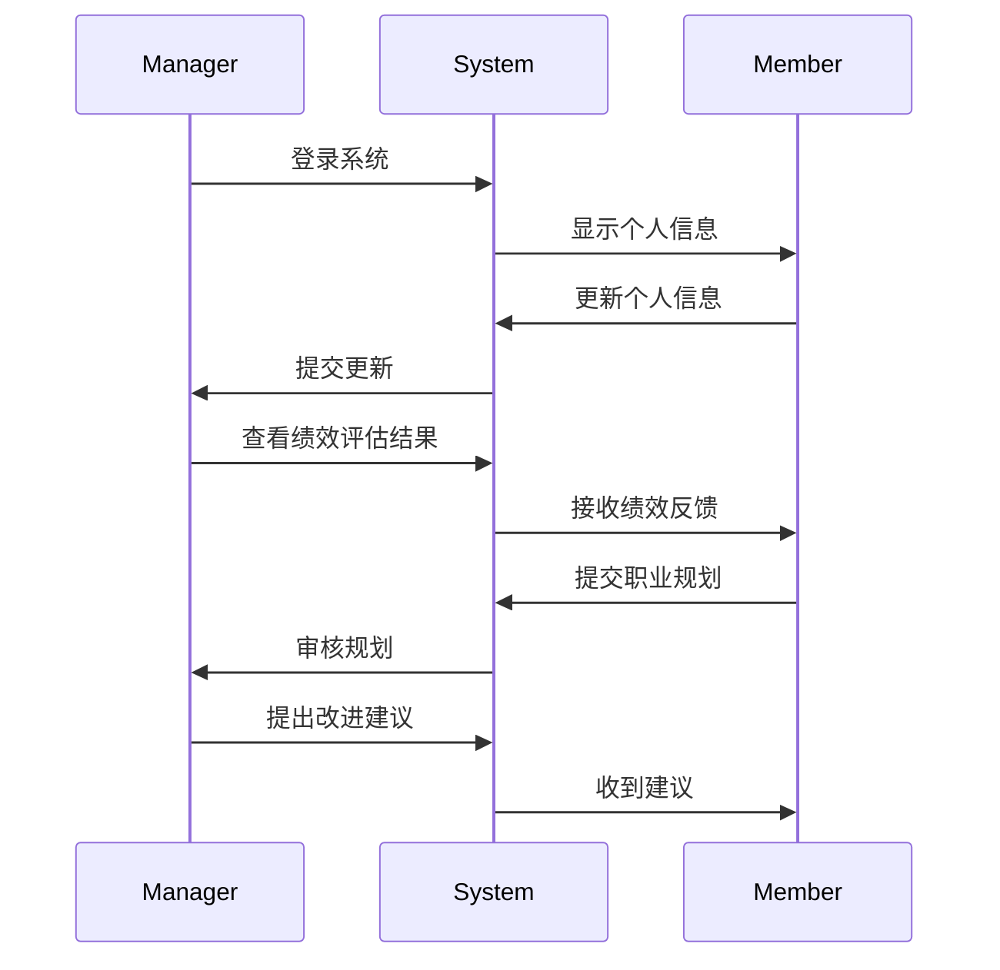
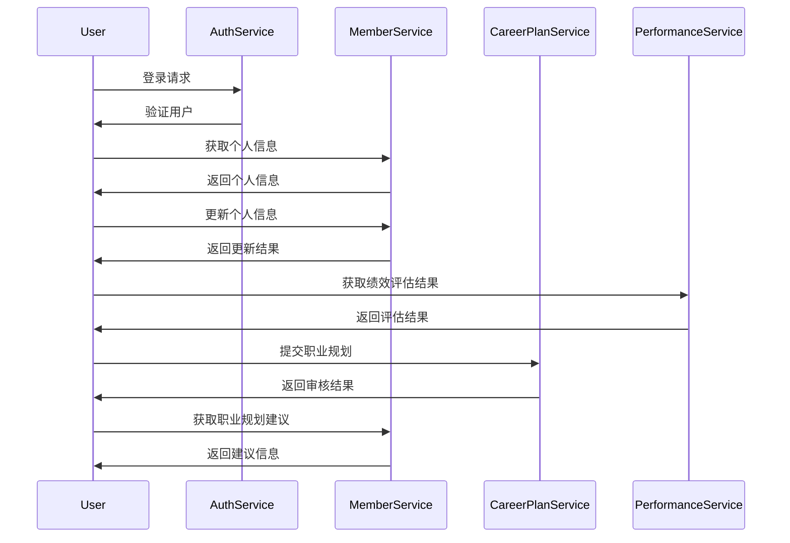
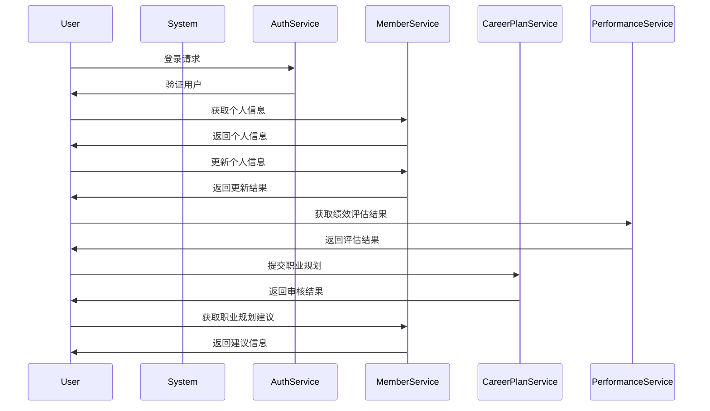

                 

# 领导力与职业规划：帮助团队成员成长

## 关键词

领导力，职业规划，团队成长，沟通技巧，目标设定，情境领导

## 摘要

本文旨在探讨如何通过领导力和职业规划的有机结合，帮助团队成员实现个人与团队的双重目标。文章从领导力的基础、领导者的角色与职责、领导力技能，以及职业规划的定义与意义、职业发展路径等方面进行深入分析。通过案例分享和实战经验，本文为IT领域的领导者提供了一套系统性的指导方案，以实现团队成员的全面成长。

## 目录大纲

1. 第一部分：领导力基础
   1.1 领导力概述
   1.2 领导者的角色与职责
   1.3 领导力技能
2. 第二部分：职业规划
   2.1 职业规划概述
   2.2 自我评估与职业定位
   2.3 职业发展路径
   2.4 职业规划中的持续学习
3. 第三部分：领导力与职业规划的结合
   3.1 领导力在职业规划中的应用
   3.2 职业规划对领导力的影响
   3.3 领导力与职业规划的结合实践
4. 第四部分：案例分析
   4.1 成功领导力与职业规划的案例
   4.2 失败案例分析及启示
   4.3 领导力与职业规划的实战经验分享
5. 第五部分：总结与展望
   5.1 领导力与职业规划的总结
   5.2 未来发展趋势
   5.3 对团队成员成长的期望

## 第一部分：领导力基础

### 1.1 领导力概述

领导力，简单来说，是指一个人影响和激励他人一起实现目标的能力。在IT领域，领导力尤为重要，因为技术发展迅速，团队成员需要不断学习和适应。领导力的重要性在于：

- **推动团队发展：** 领导者通过愿景、目标和激励，推动团队向更高层次发展。
- **提升团队效能：** 领导者通过有效的沟通和协调，提升团队的执行力。
- **促进个人成长：** 领导者不仅关注团队目标，还注重团队成员的个人成长。

### 1.2 领导者的角色与职责

领导者的角色和职责可以分为三个层次：

1. **领导者作为引导者：** 领导者需要明确团队的愿景和目标，并引导团队成员共同实现。
2. **领导者作为协调者：** 领导者需要协调团队成员之间的关系，确保团队目标的实现。
3. **领导者作为榜样：** 领导者通过自身的行为和态度，影响和激励团队成员。

### 1.3 领导力技能

领导力技能包括沟通技巧、决策能力、激励团队等多个方面。有效的领导力技能可以帮助领导者更好地完成职责，提升团队效能。

- **沟通技巧：** 沟通是领导者的一项基本技能，良好的沟通可以增强团队成员之间的信任和理解。
- **决策能力：** 领导者需要具备快速而准确的决策能力，以应对复杂多变的技术挑战。
- **激励团队：** 领导者需要通过激励手段，激发团队成员的潜能，提高团队士气。

## 第二部分：职业规划

### 2.1 职业规划概述

职业规划是指个人为实现职业发展目标，通过自我评估、目标设定、路径选择、执行策略等过程，进行的一系列计划与行动。职业规划的意义在于：

- **明确个人目标：** 通过职业规划，个人可以明确自己的职业目标和发展方向。
- **提升职业素养：** 职业规划可以帮助个人提升专业技能和职业素养，适应职业发展的需求。
- **实现职业价值：** 职业规划可以帮助个人实现职业价值，获得更好的职业发展机会。

### 2.2 自我评估与职业定位

自我评估和职业定位是职业规划的基础。自我评估包括对个人兴趣、能力、价值观等方面的分析，职业定位则是根据自我评估结果，确定适合自己的职业方向。

- **自我评估的工具与方法：** 可以使用心理测试、能力测评等工具，进行自我评估。
- **职业定位的策略：** 通过行业分析、岗位需求分析等策略，确定适合自己的职业方向。

### 2.3 职业发展路径

职业发展路径是指个人从当前职位到目标职位之间的过渡过程。职业发展路径可以分为三个阶段：

1. **基础阶段：** 在这个阶段，个人需要通过学习和实践，积累工作经验和技能。
2. **成长阶段：** 在这个阶段，个人需要不断提升自己的能力和价值，争取更好的职位和机会。
3. **成熟阶段：** 在这个阶段，个人需要保持持续学习和创新，为职业生涯的长期发展打下基础。

### 2.4 职业规划中的持续学习

持续学习是职业规划的重要组成部分。在IT领域，技术更新迅速，个人需要不断学习新的知识和技能，以适应职业发展的需求。

- **学习的重要性：** 持续学习可以帮助个人保持竞争力，适应技术变革。
- **持续学习的策略：** 包括制定学习计划、选择合适的学习资源、参加培训课程等。

## 第三部分：领导力与职业规划的结合

### 3.1 领导力在职业规划中的应用

领导力在职业规划中具有重要作用，可以帮助个人更好地实现职业目标。

- **领导者的引导作用：** 领导者可以引导团队成员明确职业目标，制定职业规划。
- **领导者的激励作用：** 领导者可以通过激励手段，激发团队成员的学习和成长动力。

### 3.2 职业规划对领导力的影响

职业规划对领导力也有重要影响，领导者在实施职业规划时，需要不断提升自己的领导力技能。

- **领导力提升：** 通过实施职业规划，领导者可以更好地了解团队成员的需求和期望，提升自己的沟通和激励能力。
- **领导风格调整：** 根据团队成员的职业规划，领导者需要调整自己的领导风格，以更好地支持和帮助团队成员。

### 3.3 领导力与职业规划的结合实践

在实践过程中，领导力与职业规划的结合可以帮助团队成员实现个人与团队的双重目标。

- **目标设定：** 领导者可以帮助团队成员设定合理的职业目标，并与团队目标相结合。
- **路径选择：** 领导者可以帮助团队成员选择合适的职业发展路径，提供必要的支持和指导。
- **持续激励：** 领导者需要通过持续激励，帮助团队成员克服职业发展中的困难和挑战。

## 第四部分：案例分析

### 4.1 成功领导力与职业规划的案例

在IT领域，许多成功的企业和领导者都是通过有效的领导力和职业规划，实现了个人与团队的双重目标。

- **案例一：** 某知名互联网公司，通过实施有效的职业规划，帮助员工明确职业目标，制定职业发展路径，从而实现了员工个人和公司的共同发展。
- **案例二：** 某IT企业的领导者，通过提升自己的领导力技能，帮助团队成员解决职业发展中的问题，从而推动了企业的快速发展。

### 4.2 失败案例分析及启示

尽管许多企业都重视领导力和职业规划，但在实际操作中，仍存在一些失败案例。

- **案例一：** 某企业缺乏有效的职业规划，导致员工对职业发展感到迷茫，缺乏动力，最终影响了企业的整体绩效。
- **案例二：** 某企业的领导者没有重视团队成员的职业规划，只关注短期业绩，导致团队成员流失严重，影响了企业的长期发展。

### 4.3 领导力与职业规划的实战经验分享

在实战中，许多成功的领导者和企业都积累了丰富的经验，这些经验对于其他企业和领导者具有重要的借鉴意义。

- **经验一：** 领导者需要深入了解团队成员的需求和期望，制定符合实际情况的职业规划。
- **经验二：** 领导者需要不断提升自己的领导力技能，以更好地支持和帮助团队成员。
- **经验三：** 企业需要建立完善的职业规划体系，为员工提供明确的发展路径和职业机会。

## 第五部分：总结与展望

### 5.1 领导力与职业规划的总结

本文通过对领导力和职业规划的分析，提出了一套帮助团队成员成长的方法。领导力和职业规划的结合，不仅可以实现个人与团队的双重目标，还可以提升企业的整体绩效。

### 5.2 未来发展趋势

随着技术的不断发展，IT领域的竞争日益激烈。未来，领导力和职业规划将成为企业的重要竞争力。企业和领导者需要不断提升自己的领导力和职业规划能力，以应对未来的挑战。

### 5.3 对团队成员成长的期望

对于团队成员来说，职业规划是实现个人成长和职业发展的关键。每个人都应该制定合理的职业规划，不断提升自己的能力和素质，为实现个人和团队的目标贡献力量。

**作者：AI天才研究院/AI Genius Institute & 禅与计算机程序设计艺术 /Zen And The Art of Computer Programming**# 领导力基础

## 1.1 领导力的定义与重要性

领导力是一种影响和激励他人共同实现目标的能力。在IT领域，领导力的重要性尤为突出。随着技术的快速发展，团队需要具备高度的灵活性和创新精神，以应对不断变化的市场需求。而领导力正是推动团队实现这一目标的关键因素。

### 定义

领导力可以定义为一系列的技能和行为，包括沟通、激励、决策、团队合作等，旨在引导和影响他人，使其为实现共同目标而努力。领导力不仅仅是一种职位赋予的权力，更是一种影响力，是领导者通过自身的魅力和价值观来影响和激励团队成员。

### 重要性

1. **推动团队发展：** 领导者通过设定愿景和目标，激励团队成员，推动团队不断向前发展。
2. **提升团队效能：** 领导者通过有效的沟通和协调，确保团队内部的工作流程顺畅，提高团队的整体效能。
3. **促进个人成长：** 领导者关注团队成员的个人发展，通过培训和激励，帮助团队成员不断提升自己的能力和素质。

## 1.2 领导力的三个层次

领导力可以分为三个层次：基础领导力、中层领导力和高层领导力。每个层次的领导力都有其特定的要求和特点。

### 基础领导力

基础领导力是领导者最基本的素质，包括沟通技巧、团队合作能力、时间管理等。这一层次的领导力主要集中在如何有效地完成日常任务和项目，确保团队内部的顺畅合作。

- **沟通技巧：** 基础领导力要求领导者具备良好的沟通技巧，能够清晰、准确地传达信息，并倾听团队成员的意见。
- **团队合作能力：** 领导者需要具备团队合作能力，能够调动团队成员的积极性，共同完成任务。
- **时间管理：** 领导者需要合理分配时间，确保团队成员能够高效地完成工作。

### 中层领导力

中层领导力是领导者在中层管理岗位上所需的能力，包括策略规划、团队管理、人才发展等。这一层次的领导力要求领导者具备更宏观的视野，能够从整体上规划和推动团队的发展。

- **策略规划：** 中层领导力要求领导者具备策略规划能力，能够根据企业的发展目标和市场需求，制定合理的团队发展战略。
- **团队管理：** 中层领导力要求领导者具备团队管理能力，能够协调不同部门之间的工作，确保团队目标的实现。
- **人才发展：** 中层领导力要求领导者关注人才发展，能够发现和培养优秀的人才，为团队注入新的活力。

### 高层领导力

高层领导力是领导者在高层次管理岗位上所需的能力，包括战略管理、企业文化塑造、领导力传承等。这一层次的领导力要求领导者具备卓越的领导力和影响力，能够引领企业走向成功。

- **战略管理：** 高层领导力要求领导者具备战略管理能力，能够根据市场变化和企业发展需求，制定和调整企业战略。
- **企业文化塑造：** 高层领导力要求领导者具备塑造企业文化的能力，能够通过企业文化的传递和传承，凝聚团队的力量。
- **领导力传承：** 高层领导力要求领导者具备领导力传承的能力，能够培养和选拔接班人，确保企业领导力的持续发展。

## 1.3 领导力与管理的区别

领导力和管理是两个相关但不完全相同的概念。领导力关注的是如何激发和影响团队成员的积极性，而管理则侧重于如何有效地组织、协调和监督团队的工作。

- **领导力：** 领导力是一种影响力，旨在激励和引导团队成员为实现共同目标而努力。领导力强调个人魅力、价值观和愿景。
- **管理：** 管理是一种系统化的过程，旨在确保团队工作的高效、有序和成果。管理强调制度、流程和监督。

在IT领域，领导力和管理的结合尤为重要。领导者需要既具备领导力，能够激励和引导团队成员，又具备管理能力，能够确保团队的工作顺利进行。

## 小结

领导力是推动团队发展、提升团队效能、促进个人成长的关键因素。通过理解领导力的三个层次和领导力与管理的区别，领导者可以更好地发挥自己的作用，帮助团队成员实现个人和团队的目标。

在下一部分，我们将探讨领导者的角色与职责，进一步深入理解领导力的实际应用。让我们继续思考，深入分析领导力在团队中的实践。

## 1.2 领导者的角色与职责

领导者的角色与职责是领导力的核心组成部分。在团队中，领导者的作用不仅仅是指导和监督，更是激励和引导团队成员，使其发挥最大的潜力。下面我们将详细探讨领导者的角色与职责，以及如何进行时间管理。

### 领导者的角色模型

领导者的角色模型通常包括以下几种：

1. **引导者（Visionary）**：
   - 设定团队愿景和目标，为团队指明方向。
   - 通过愿景激励团队成员，使其认识到工作的重要性和意义。

2. **协调者（Coordinator）**：
   - 调整团队成员的工作，确保任务的高效完成。
   - 解决团队内部的冲突，维护团队和谐。

3. **导师（Mentor）**：
   - 指导团队成员，帮助其提升技能和经验。
   - 为团队成员提供职业发展的建议和机会。

4. **推动者（Driver）**：
   - 激发团队成员的工作热情，推动团队不断前进。
   - 对团队的目标和任务有强烈的执行力。

### 领导者的职责与任务

领导者的职责可以概括为以下几个方面：

1. **设定目标和愿景**：
   - 明确团队的长期和短期目标。
   - 将团队目标与组织的整体战略相结合。

2. **计划与执行**：
   - 制定详细的行动计划，确保目标的实现。
   - 监督团队的工作进度，及时调整计划。

3. **沟通和协调**：
   - 保持与团队成员、上级和管理层的有效沟通。
   - 协调团队内外部资源，确保团队目标的实现。

4. **激励和引导**：
   - 激发团队成员的积极性和创造力。
   - 引导团队成员朝着共同的目标前进。

5. **团队建设和维护**：
   - 建立和维护团队的凝聚力和协作性。
   - 促进团队成员之间的相互信任和尊重。

### 领导者的时间管理

时间管理是领导者的一项关键职责，高效的领导者必须能够合理分配时间，确保团队能够在有限的时间内完成更多的工作。以下是一些时间管理的策略：

1. **制定优先级**：
   - 识别最重要和最紧急的任务，优先处理。
   - 避免分散注意力，专注于高优先级任务。

2. **日程规划**：
   - 制定详细的日程表，包括工作计划和休息时间。
   - 保持工作与生活的平衡，避免过度工作。

3. **减少干扰**：
   - 避免不必要的中断，如关闭不必要的通知。
   - 设定固定的会议时间，避免随意更改。

4. **委托任务**：
   - 识别并委派适当的任务给团队成员，避免个人负担过重。
   - 确保团队成员了解任务的重要性和优先级。

5. **反思和调整**：
   - 定期反思时间管理的效果，识别改进的机会。
   - 根据实际情况调整时间管理策略。

### 案例分析

例如，在某IT公司的项目中，项目经理作为领导者，需要承担多个角色和职责。他不仅要设定项目的愿景和目标，确保项目按计划进行，还要与团队成员、客户和上级进行有效沟通，协调资源，解决团队内部的冲突。此外，项目经理还需要关注团队成员的职业发展，为他们提供培训机会，激励他们不断提升技能。通过合理的时间管理，项目经理能够确保项目按时完成，同时也关注团队成员的成长和发展。

### 总结

领导者的角色与职责是多方面的，包括引导团队、设定目标、沟通协调、激励引导和时间管理等。通过深入理解领导者的角色和职责，领导者可以更有效地发挥自己的作用，推动团队实现共同的目标。在下一部分，我们将进一步探讨领导力技能，包括沟通技巧、决策能力和激励团队。让我们继续深入分析领导力在实践中的应用。

## 1.3 领导力技能

领导力不仅仅是一种职位赋予的权力，更是一种影响力，是领导者通过一系列技能和行为来影响和激励他人，实现共同目标的能力。在IT领域，领导者需要具备多种领导力技能，包括沟通技巧、决策能力和激励团队等。这些技能对于提升团队效能、推动团队发展具有重要意义。

### 沟通技巧

沟通是领导者的一项核心技能，良好的沟通能够增强团队成员之间的信任和理解，确保团队目标的实现。以下是几种关键的沟通技巧：

1. **倾听**：
   - 倾听是有效沟通的基础，领导者需要倾听团队成员的意见和需求。
   - 通过倾听，领导者可以更好地了解团队成员的想法，发现潜在的问题和机会。

2. **清晰表达**：
   - 领导者需要能够清晰、准确地表达自己的想法和期望。
   - 使用简单明了的语言，避免使用过于复杂或专业术语，确保团队成员理解。

3. **反馈与表扬**：
   - 领导者需要给予团队成员及时的反馈和表扬。
   - 正面反馈可以增强团队成员的自信心，激励他们继续努力。

4. **情绪管理**：
   - 领导者需要具备情绪管理能力，保持冷静和理性，避免在沟通中情绪化。
   - 通过情绪管理，领导者可以确保沟通的效率和效果。

### 决策能力

决策能力是领导者面对复杂问题和挑战时的关键能力。有效的决策能力可以确保团队在面对不确定性时，能够做出正确的决策，推动团队向前发展。以下是几种提高决策能力的策略：

1. **信息收集**：
   - 在做出决策之前，领导者需要收集充足的信息。
   - 通过多角度的信息收集，领导者可以更全面地了解问题的各个方面。

2. **分析评估**：
   - 领导者需要对收集到的信息进行分析和评估，确定最佳决策方案。
   - 通过理性分析和评估，领导者可以减少决策的风险。

3. **勇于承担**：
   - 领导者需要勇于承担决策的责任，即使决策可能面临失败的风险。
   - 通过勇于承担，领导者可以树立榜样，增强团队成员的信心。

4. **持续学习**：
   - 领导者需要持续学习和反思，不断提升自己的决策能力。
   - 通过不断学习，领导者可以积累经验，提高决策的准确性。

### 激励团队

激励团队是领导者的重要职责之一，通过有效的激励，领导者可以激发团队成员的潜能，提高团队的士气和执行力。以下是几种激励团队的策略：

1. **目标激励**：
   - 设定明确的团队目标，使团队成员明确自己的职责和方向。
   - 通过目标激励，团队成员可以更有动力地为实现共同目标而努力。

2. **认可激励**：
   - 定期对团队成员进行认可和奖励，表扬他们的成就和贡献。
   - 通过认可激励，可以增强团队成员的自信心和积极性。

3. **参与激励**：
   - 让团队成员参与到决策和项目中，使他们感到被重视和信任。
   - 通过参与激励，可以激发团队成员的创造力和责任感。

4. **发展激励**：
   - 提供培训和学习机会，帮助团队成员提升技能和职业发展。
   - 通过发展激励，可以增强团队成员的职业归属感和忠诚度。

### 案例分析

以某IT公司的项目经理为例，他在项目推进过程中，通过良好的沟通技巧，与团队成员保持紧密的沟通，确保项目目标的明确和任务的分配。他不仅倾听团队成员的意见，还清晰表达自己的期望，并通过积极的反馈和表扬，增强团队成员的信心和动力。

在决策过程中，项目经理通过充分的信息收集和分析评估，确保决策的准确性和有效性。他勇于承担决策责任，即使面临风险，也保持冷静和理性，通过持续学习和反思，不断提升自己的决策能力。

在激励团队方面，项目经理通过设定明确的目标，让团队成员明确自己的职责和方向；通过认可和奖励，表扬团队成员的成就和贡献；通过参与项目决策，增强团队成员的创造力和责任感；通过提供培训和学习机会，帮助团队成员提升技能和职业发展。

### 总结

领导力技能是领导者影响和激励团队成员的关键，包括沟通技巧、决策能力和激励团队等。通过掌握这些技能，领导者可以更有效地推动团队发展，实现共同的目标。在下一部分，我们将探讨职业规划的定义与意义，以及职业规划的基本步骤。让我们继续深入分析如何帮助团队成员实现职业成长。

## 2.1 职业规划概述

职业规划是指个人为实现职业发展目标，通过自我评估、目标设定、路径选择、执行策略等过程，进行的一系列计划与行动。在IT领域，职业规划的重要性尤为突出。随着技术的快速发展，IT从业人员需要不断学习和适应，以保持竞争力和适应市场需求。有效的职业规划可以帮助个人明确职业目标，提升职业素养，实现职业价值的最大化。

### 职业规划的定义与意义

职业规划的定义可以分为以下几个方面：

1. **自我评估**：
   - 个人对自己的兴趣、能力、价值观等进行全面评估，了解自己的优点和不足。

2. **目标设定**：
   - 根据自我评估结果，设定清晰的职业目标，明确个人在职业发展中的方向。

3. **路径选择**：
   - 确定实现职业目标的路径，包括技能提升、岗位晋升、行业转型等。

4. **执行策略**：
   - 制定具体的执行策略，包括学习计划、行动步骤、时间安排等。

职业规划的意义在于：

1. **明确职业目标**：
   - 通过职业规划，个人可以明确自己的职业目标和发展方向，避免盲目发展。

2. **提升职业素养**：
   - 职业规划可以帮助个人有针对性地提升专业技能和素质，增强竞争力。

3. **实现职业价值**：
   - 职业规划可以帮助个人实现职业价值，获得更好的职业发展机会和更高的收入。

### 职业规划的基本步骤

有效的职业规划需要遵循以下基本步骤：

1. **自我评估**：
   - 通过自我评估工具，如心理测试、能力测评等，分析自己的兴趣、能力和价值观。

2. **目标设定**：
   - 根据自我评估结果，设定清晰的职业目标，包括短期目标和长期目标。

3. **路径选择**：
   - 确定实现职业目标的路径，如通过提升技能、晋升岗位或转型行业等。

4. **制定行动计划**：
   - 制定详细的行动计划，包括学习计划、行动步骤、时间安排等。

5. **执行与调整**：
   - 根据行动计划执行，并及时评估和调整，确保职业规划的实现。

### 案例分析

以某IT工程师的职业生涯规划为例，他首先进行了自我评估，发现自己在软件开发方面具有浓厚的兴趣和较强的技术能力。根据自我评估结果，他设定了短期目标为成为高级软件开发工程师，长期目标为成为技术团队负责人。

为了实现短期目标，他制定了以下路径选择和行动计划：

1. **路径选择**：
   - 提升技术能力：参加高级编程课程，学习新技术和工具。
   - 晋升岗位：争取项目组长或技术经理职位。

2. **制定行动计划**：
   - 学习计划：每周学习两门编程课程，每月参加一次技术分享会。
   - 行动步骤：积累项目经验，提升领导能力，争取晋升机会。
   - 时间安排：在两年内完成短期目标。

通过执行行动计划，他不断提升自己的技术能力和领导能力，最终实现了高级软件开发工程师的目标。在此基础上，他继续制定长期目标，并制定了相应的路径和行动计划，为实现职业价值不断努力。

### 总结

职业规划是个人实现职业发展目标的关键，通过自我评估、目标设定、路径选择和执行策略，个人可以明确职业方向，提升职业素养，实现职业价值的最大化。在下一部分，我们将探讨自我评估与职业定位，帮助团队成员找到适合自己的职业方向。让我们继续深入分析职业规划的具体实施步骤。

## 2.2 自我评估与职业定位

### 5.1 自我评估的工具与方法

自我评估是职业规划的重要基础，通过自我评估，个人可以深入了解自己的兴趣、能力和价值观，为职业定位提供依据。以下是几种常用的自我评估工具和方法：

1. **心理测试**：
   - 心理测试可以帮助个人了解自己的性格特点、兴趣爱好和职业倾向。常见的心理测试包括MBTI、霍兰德职业兴趣测试等。
   - MBTI（Myers-Briggs Type Indicator）是一种基于性格理论的测试，可以帮助个人了解自己的性格类型，如外向/内向、感觉/直觉等。
   - 霍兰德职业兴趣测试通过评估个人的兴趣类型，如现实型、研究型、艺术型等，帮助个人找到与其兴趣相符的职业方向。

2. **能力测评**：
   - 能力测评可以评估个人的技能水平、专业知识和工作能力。常见的测评包括技术能力测评、管理能力测评等。
   - 技术能力测评可以帮助个人了解自己在技术领域的优势和不足，确定需要提升的技能领域。
   - 管理能力测评可以帮助个人评估自己的管理能力，如领导力、沟通协调能力、决策能力等。

3. **职业咨询**：
   - 职业咨询师可以提供专业的职业评估和咨询服务，帮助个人更全面地了解自己的职业兴趣、能力和职业前景。
   - 职业咨询师通常拥有丰富的行业经验和专业知识，可以通过一对一的沟通和评估，为个人提供个性化的职业发展建议。

4. **反思日记**：
   - 反思日记是一种自我评估的方法，通过记录日常工作和生活中的经历和感受，个人可以反思自己的行为和思考方式，发现自身的优势和不足。
   - 通过反思日记，个人可以更深入地了解自己的内在需求和发展方向。

### 5.2 职业定位的策略

职业定位是根据自我评估结果，确定适合自己的职业方向。以下是几种职业定位的策略：

1. **匹配兴趣与职业**：
   - 了解自己的兴趣和优势，寻找与之匹配的职业。例如，如果个人对技术充满热情，可以考虑从事软件开发、系统架构等职业。
   - 通过心理测试和兴趣测评，个人可以更准确地了解自己的兴趣领域，从而选择与之相关的职业。

2. **结合能力和市场**：
   - 考虑自己的技能和能力，同时分析市场需求和行业趋势，选择具有市场竞争力的职业。
   - 通过能力测评和行业分析，个人可以了解自己在技术领域的优势，并找到与之相符的职业机会。

3. **考虑职业发展前景**：
   - 考虑所选职业的发展前景，包括行业趋势、职业晋升机会和薪资水平等。
   - 通过行业报告和职业调查，个人可以了解不同职业的发展前景，选择具有潜力的职业方向。

4. **寻求职业建议**：
   - 向职业咨询师、导师或同行寻求建议，了解不同职业的实际工作内容和职业发展路径。
   - 通过交流和学习，个人可以获取更多职业信息，帮助自己做出更明智的职业选择。

### 5.3 如何找到适合自己的职业方向

找到适合自己的职业方向是一个持续的过程，需要个人不断探索和尝试。以下是几种找到合适职业方向的方法：

1. **实习和兼职**：
   - 通过实习和兼职，个人可以亲身体验不同职业的工作内容和环境，了解自己的兴趣和适应能力。
   - 实习和兼职不仅可以帮助个人积累工作经验，还可以拓展人脉，为未来的职业发展打下基础。

2. **行业调查**：
   - 了解不同行业的职业要求和未来发展前景，通过行业调查和数据分析，找到与自己兴趣和能力相匹配的职业。
   - 通过参加行业会议、阅读行业报告和与业内人士交流，个人可以获取更多行业信息。

3. **职业咨询**：
   - 寻求职业咨询师的帮助，进行全面的职业评估和咨询，了解自己的职业优势和适合的职业方向。
   - 职业咨询师可以提供专业的建议和指导，帮助个人制定合理的职业规划。

4. **持续学习**：
   - 通过不断学习和提升自己的技能，个人可以拓展职业选择范围，找到更适合自己的职业方向。
   - 参加培训课程、考取专业认证、学习新技术和工具，都是提升个人竞争力的有效途径。

### 案例分析

以某大学计算机专业毕业生小王为例，他在毕业前通过心理测试和兴趣测评，发现自己在软件开发和系统设计方面具有浓厚的兴趣和较强的技术能力。结合市场调查和职业咨询，他了解到软件开发和系统设计是当前IT行业的热门职业，且具有广阔的发展前景。

为了找到适合自己的职业方向，小王在大学期间积极参加实习和兼职项目，积累实际工作经验。他还在职业咨询师的建议下，参加了一些高级编程课程和技术研讨会，提升自己的技能和知识。

最终，小王选择了软件开发作为自己的职业方向，并顺利进入一家知名的互联网公司担任软件开发工程师。在工作中，他不断提升自己的技术能力和团队协作能力，通过努力和积累，逐渐成长为团队的核心成员。

### 总结

自我评估和职业定位是职业规划的关键环节，通过心理测试、能力测评、职业咨询和反思日记等方法，个人可以深入了解自己的兴趣、能力和价值观，找到适合自己的职业方向。在职业定位的过程中，个人需要结合市场需求和职业发展前景，制定合理的职业规划，并通过实习、学习和职业咨询等途径，不断提升自己的职业素养和竞争力。在下一部分，我们将探讨职业发展的路径，包括职业发展的三个阶段和职业晋升的技巧。让我们继续深入分析职业规划的具体实施步骤。

## 2.3 职业发展路径

职业发展路径是指个人在职业生涯中，从初级职位到高级职位，逐步实现职业目标和价值的过程。对于IT从业人员来说，职业发展路径通常包括基础阶段、成长阶段和成熟阶段。每个阶段都有其特定的任务和发展目标，通过有计划地实现这些目标，个人可以不断提升自己的职业素养和竞争力。

### 职业发展的三个阶段

1. **基础阶段**：
   - **任务**：在基础阶段，个人需要通过学习和实践，积累工作经验和技能，为后续的职业发展打下坚实的基础。
   - **目标**：这个阶段的主要目标是掌握基础知识和技能，例如编程语言、数据库管理、软件开发流程等。

2. **成长阶段**：
   - **任务**：在成长阶段，个人需要不断提升自己的技能和知识，承担更多的工作责任，逐步承担项目管理和团队领导职责。
   - **目标**：这个阶段的目标是成为技术骨干或业务专家，掌握更复杂的技术和业务知识，如系统架构设计、项目管理、团队管理等。

3. **成熟阶段**：
   - **任务**：在成熟阶段，个人需要在技术和管理方面都有较高的造诣，能够独立承担重要项目和团队，为企业的发展提供战略支持。
   - **目标**：这个阶段的目标是成为技术团队负责人或高级管理职位，为企业创造价值，推动企业技术创新和管理进步。

### 职业晋升的技巧

1. **不断提升技能**：
   - 职业晋升的基础是技能的提升。个人需要不断学习新技术、新工具，保持对行业动态的敏感度，确保自己的技能始终处于行业前沿。

2. **积累项目管理经验**：
   - 项目管理能力是职业晋升的关键。个人需要通过参与不同类型的项目，积累项目管理经验，提高自己的项目管理和团队领导能力。

3. **建立良好的人际关系**：
   - 良好的人际关系可以帮助个人在职业生涯中取得更多的支持和机会。个人需要注重与同事、上级和客户的沟通，建立互信和合作关系。

4. **展示个人价值**：
   - 个人需要通过具体的工作成果和贡献，展示自己的价值和能力。在团队中，积极参与重要项目，主动承担责任，通过实际行动赢得认可和晋升机会。

5. **积极寻求反馈**：
   - 定期寻求上级和同事的反馈，了解自己在工作中的优点和不足，及时调整和改进。通过积极的反馈，个人可以不断提升自己的职业素养和技能。

6. **制定职业规划**：
   - 制定详细的职业规划，明确自己的职业目标和路径。通过职业规划，个人可以更有针对性地提升自己的技能和知识，实现职业目标。

### 案例分析

以某IT公司的软件工程师小张为例，他在职业生涯中按照职业发展路径逐步实现了职业晋升：

1. **基础阶段**：
   - 小张在大学期间通过学习和实习，掌握了编程语言和软件开发的基本技能，顺利进入一家互联网公司担任软件工程师。

2. **成长阶段**：
   - 在成长阶段，小张积极参与公司内部的技术分享会，不断提升自己的技术水平。他主动承担更多的工作任务，逐渐成为团队中的技术骨干。

3. **成熟阶段**：
   - 在成熟阶段，小张不仅具备扎实的编程技能，还掌握了项目管理知识。他成功领导了一个大型项目团队，通过有效的项目管理和团队协作，项目取得了显著的成绩。

通过不断学习和实践，小张从一名普通的软件工程师成长为团队负责人，实现了职业的跨越式发展。

### 总结

职业发展路径是个人实现职业目标和价值的重要途径。通过基础阶段、成长阶段和成熟阶段的逐步提升，个人可以不断提升自己的职业素养和竞争力。在职业晋升过程中，个人需要不断提升技能、积累项目管理经验、建立良好的人际关系、展示个人价值、积极寻求反馈和制定职业规划。通过这些技巧，个人可以更好地实现职业目标，实现个人与企业的共同发展。在下一部分，我们将探讨职业规划中的持续学习，帮助团队成员不断提升自己的能力和素质。让我们继续深入分析职业规划的具体实施步骤。

## 2.4 职业规划中的持续学习

在IT领域，技术更新速度之快使得持续学习成为职业发展的重要保障。对于团队成员来说，持续学习不仅有助于提升个人技能和职业素养，还能确保他们能够适应不断变化的工作环境。以下是持续学习的重要性、策略以及职业规划与终身学习的关系。

### 持续学习的重要性

1. **保持竞争力**：
   - 随着技术的发展，新的编程语言、工具和框架层出不穷。持续学习可以帮助团队成员保持竞争力，确保他们能够跟上行业的发展。

2. **适应新环境**：
   - 在不同的项目和工作环境中，团队成员需要不断适应新的技术栈和工作模式。持续学习可以帮助他们快速适应新环境，提高工作效率。

3. **提升职业素养**：
   - 持续学习不仅限于技术领域，还包括管理技能、团队协作和沟通技巧等。通过学习，团队成员可以全面提升自己的职业素养，更好地应对复杂的工作挑战。

### 持续学习的策略

1. **设定学习目标**：
   - 在开始学习之前，团队成员需要明确自己的学习目标，例如掌握某一新技术或提升某项管理技能。设定明确的目标可以帮助学习更有针对性。

2. **制定学习计划**：
   - 制定详细的学习计划，包括学习时间、学习内容和进度安排。通过合理规划，团队成员可以确保学习计划的执行。

3. **选择合适的学习资源**：
   - 根据学习目标，选择合适的在线课程、书籍、博客和培训资源。选择高质量的学习资源可以提高学习效果。

4. **积极参与社区**：
   - 参与技术社区和论坛，与其他开发者交流经验和学习资源。通过社区互动，团队成员可以拓宽视野，获取更多的学习机会。

5. **实践与应用**：
   - 知识的应用是学习的最佳方式。团队成员需要将所学知识应用到实际工作中，通过实践来巩固和提升技能。

### 职业规划与终身学习的关系

1. **支持职业目标**：
   - 持续学习是职业规划的重要组成部分，它支持团队成员实现职业目标。通过不断学习，团队成员可以不断提升自己的能力和价值，为实现职业目标提供保障。

2. **适应职业发展**：
   - 职业规划是一个动态的过程，随着市场的变化和个人发展，团队成员需要不断调整职业规划。持续学习可以帮助他们适应职业发展的需求，保持竞争力。

3. **促进职业转型**：
   - 在某些情况下，团队成员可能需要转型到新的职业领域。通过持续学习，他们可以获取新的技能和知识，为职业转型做好准备。

### 案例分析

以某互联网公司的软件工程师小李为例，他在职业规划中注重持续学习：

1. **设定学习目标**：
   - 小李在职业规划中设定了学习目标，包括掌握新的编程语言和框架，提升项目管理能力。

2. **制定学习计划**：
   - 他制定了详细的学习计划，每周至少学习一门新的技术课程，每月至少参与一次技术分享会。

3. **选择合适的学习资源**：
   - 小李通过在线课程平台和开源社区获取学习资源，确保学习的内容和质量。

4. **积极参与社区**：
   - 他积极参与技术社区和论坛，与其他开发者交流学习经验，获取更多的学习机会。

5. **实践与应用**：
   - 小李将所学知识应用到实际工作中，通过项目实践不断提升自己的技能。

通过持续学习，小李不仅实现了职业目标，还适应了职业发展的需求，为公司的技术进步做出了贡献。

### 总结

持续学习是职业规划的重要组成部分，它支持团队成员实现职业目标和适应职业发展的需求。通过设定学习目标、制定学习计划、选择合适的学习资源、积极参与社区和实践应用，团队成员可以不断提升自己的能力和价值。在职业规划中，持续学习不仅有助于提升个人竞争力，还能促进职业发展和转型。在下一部分，我们将探讨领导力与职业规划的结合，帮助团队成员实现个人与团队的目标。让我们继续深入分析如何将领导力与职业规划相结合。

## 3.1 领导力在职业规划中的应用

领导力在职业规划中具有重要作用，它不仅帮助领导者引导团队成员实现职业目标，还能为团队成员提供职业发展的支持和指导。以下是从几个方面探讨领导力在职业规划中的应用。

### 指导与引导

领导者作为团队成员的职业导师，通过指导与引导，帮助团队成员明确职业目标和发展方向。以下是具体的实践方法：

1. **设定明确的目标**：
   - 领导者需要与团队成员共同设定明确的职业目标，这些目标应与团队的整体目标和组织的战略相一致。
   - 通过目标设定，团队成员可以明确自己的发展方向，避免职业发展的迷茫。

2. **制定可行的计划**：
   - 领导者帮助团队成员制定实现目标的可行计划，包括具体的行动步骤、时间表和资源需求。
   - 通过制定计划，团队成员可以更系统地推进职业发展，确保目标的实现。

3. **提供指导和支持**：
   - 领导者应持续关注团队成员的职业发展，提供必要的指导和支持，包括技能培训、职业咨询和资源调配。
   - 通过指导和支持，团队成员可以更好地克服职业发展中的困难和挑战。

### 激励与认可

激励与认可是推动团队成员职业发展的关键因素，领导者可以通过以下方式激励团队成员：

1. **鼓励自主学习**：
   - 领导者鼓励团队成员自主学习新技能和知识，提升自身的职业竞争力。
   - 通过设立学习目标和奖励机制，激发团队成员的学习热情。

2. **认可成就**：
   - 领导者应适时认可团队成员的成就和进步，通过表扬、奖励和晋升等方式激励团队成员。
   - 通过认可，团队成员可以感受到自己的价值和努力被认可，增强职业自信心。

3. **提供职业机会**：
   - 领导者应积极为团队成员提供职业发展的机会，包括项目参与、职位晋升和跨部门交流等。
   - 通过提供机会，团队成员可以积累更多的经验和技能，实现职业晋升。

### 培养与传承

领导者在职业规划中不仅要关注团队成员的职业发展，还要培养和传承领导力，确保团队的持续发展。以下是具体的实践方法：

1. **培养领导力**：
   - 领导者通过培训、辅导和实践，培养团队成员的领导力，包括沟通能力、决策能力和团队管理能力。
   - 通过培养，团队成员可以逐渐成为团队的领导者，为团队的发展提供持续的动力。

2. **建立导师制度**：
   - 领导者可以建立导师制度，让经验丰富的团队成员成为新人的导师，传授职业经验和领导技巧。
   - 通过传承，团队成员可以快速成长，为团队注入新的活力。

3. **建立职业发展路径**：
   - 领导者应明确团队成员的职业发展路径，为他们提供明确的职业发展通道。
   - 通过建立职业发展路径，团队成员可以明确自己的职业发展方向，避免职业发展的不确定性。

### 案例分析

以某互联网公司的项目经理小李为例，他在职业规划中积极应用领导力：

1. **设定明确的目标**：
   - 小李与团队成员共同设定了明确的职业目标，包括成为技术专家和项目管理专家。

2. **制定可行的计划**：
   - 小李帮助团队成员制定了详细的职业发展计划，包括学习目标、技能提升和项目参与。

3. **提供指导和支持**：
   - 小李为团队成员提供技术指导和管理建议，帮助他们解决职业发展中的问题。

4. **鼓励自主学习**：
   - 小李鼓励团队成员自主学习新技能，通过设立学习目标和奖励机制，激发他们的学习热情。

5. **认可成就**：
   - 小李对团队成员的成就和进步给予及时的认可和奖励，增强他们的职业自信心。

6. **提供职业机会**：
   - 小李为团队成员提供参与重要项目和职位晋升的机会，帮助他们积累更多的经验和技能。

通过领导力的应用，小李不仅帮助团队成员实现了职业目标，还培养了他们的领导力，为团队的持续发展奠定了基础。

### 总结

领导力在职业规划中的应用，可以帮助团队成员明确职业目标、制定职业发展计划、提供指导和支持、鼓励自主学习和认可成就。通过培养领导力和传承领导力，领导者可以为团队的长期发展提供持续的动力。在下一部分，我们将探讨职业规划对领导力的影响，以及如何通过职业规划提升领导力。让我们继续深入分析领导力与职业规划的有机结合。

## 3.2 职业规划对领导力的影响

职业规划不仅对团队成员的职业发展具有深远影响，同时也对领导力的发展起到重要的推动作用。通过合理的职业规划，领导者可以提升自身的领导力，从而更有效地管理团队和推动团队发展。

### 提升领导力的自我认知

职业规划是一个动态的过程，需要领导者不断地进行自我评估和反思。通过职业规划，领导者可以更清晰地了解自己的兴趣、能力和价值观，这有助于提升自我认知。自我认知的提升是领导力发展的基础，领导者只有了解自己，才能更好地引导和激励团队成员。

1. **兴趣与价值观**：
   - 通过职业规划，领导者可以明确自己的兴趣和价值观，这有助于他们选择合适的领导风格和管理方法。
   - 例如，一个倾向于创新和变革的领导者，可能会选择变革领导风格，以推动团队的创新和发展。

2. **能力与短板**：
   - 职业规划中的自我评估可以帮助领导者识别自己的能力和短板，从而有针对性地提升领导力。
   - 通过了解自己的短板，领导者可以寻求培训和发展机会，提升自己的管理能力和决策能力。

### 增强领导力的实践机会

职业规划为领导者提供了丰富的实践机会，这些机会有助于他们在实际工作中提升领导力。

1. **项目领导**：
   - 通过参与不同类型的项目，领导者可以积累项目管理经验，提升自己的项目管理和团队领导能力。
   - 项目中的挑战和困难，可以锻炼领导者的决策能力和应变能力。

2. **跨部门合作**：
   - 职业规划中的跨部门合作机会，可以帮助领导者提升跨部门沟通和协调能力。
   - 通过跨部门合作，领导者可以学习如何在不同背景下推动团队协作，提升自己的领导力。

3. **职业晋升**：
   - 职业规划中的晋升机会，可以让领导者承担更多责任和挑战，从而提升领导力。
   - 晋升过程中，领导者需要面对更多复杂的任务和更高的要求，这有助于提升他们的领导力和管理能力。

### 培养领导力的持续发展

职业规划是一个持续的过程，需要领导者不断学习和成长。通过职业规划，领导者可以制定长期的学习和发展计划，确保领导力的持续提升。

1. **持续学习**：
   - 职业规划鼓励领导者不断学习新知识、新技能，以适应不断变化的工作环境。
   - 持续学习可以增强领导者的专业知识和管理能力，提高领导力水平。

2. **反思与调整**：
   - 职业规划中的反思和调整，可以帮助领导者及时识别和纠正自己的不足。
   - 通过反思和调整，领导者可以不断优化自己的领导方式，提升领导力。

### 案例分析

以某互联网公司的CTO张先生为例，他的职业规划对领导力的发展产生了积极影响：

1. **自我认知**：
   - 张先生通过职业规划，明确了自己的兴趣和价值观，意识到自己擅长创新和技术领导。
   - 这使他能够选择合适的领导风格，以推动团队的创新和发展。

2. **实践机会**：
   - 张先生通过参与多个重要项目，积累了丰富的项目管理经验，提升了项目管理和团队领导能力。
   - 他还参与了多个跨部门合作项目，提高了跨部门沟通和协调能力。

3. **持续发展**：
   - 张先生制定了长期学习计划，包括参加技术研讨会、阅读行业报告、参加管理培训等。
   - 通过持续学习，他不断提升自己的专业知识和管理能力，保持了领导力的持续发展。

通过职业规划，张先生不仅实现了个人的职业目标，还显著提升了领导力，为公司的技术创新和业务发展做出了重要贡献。

### 总结

职业规划对领导力的影响是多方面的，通过自我认知的提升、实践机会的增强和持续发展的培养，领导者可以不断提升自身的领导力。通过合理的职业规划，领导者可以更有效地管理团队、推动团队发展，实现个人与团队的共同目标。在下一部分，我们将探讨领导力与职业规划的结合实践，帮助团队成员实现个人与团队的目标。让我们继续深入分析如何将领导力与职业规划有机结合。

## 3.3 领导力与职业规划的结合实践

领导力与职业规划的有机结合，能够帮助团队成员实现个人与团队的双重目标，从而推动整个组织的持续发展。以下是一些具体的结合实践方法，通过这些实践，领导者可以在团队中有效运用领导力，同时帮助团队成员制定和实现职业规划。

### 设定共同愿景

领导者需要与团队成员共同设定一个清晰的愿景，这个愿景不仅包括团队的目标，还要涵盖团队成员的个人职业发展目标。通过共同的愿景，团队成员能够更好地理解自己的工作对团队的重要性，同时明确个人的发展方向。

1. **步骤**：
   - 领导者与团队成员进行沟通，了解每个人的职业规划和兴趣。
   - 基于团队成员的个人目标，设定一个符合团队整体目标的共同愿景。

2. **案例**：
   - 在一家软件开发公司中，领导者与团队成员共同设定了一个愿景：“成为业界领先的技术创新团队，同时为每位团队成员提供职业发展的平台。”这一愿景既符合公司的战略目标，也兼顾了团队成员的个人发展需求。

### 制定个性化职业发展计划

领导者需要根据团队成员的实际情况，制定个性化的职业发展计划。这包括确定短期目标和长期目标，以及制定实现这些目标的步骤和资源。

1. **步骤**：
   - 通过一对一的沟通，了解团队成员的职业兴趣和能力。
   - 根据团队成员的个人特点和团队需求，制定符合其职业规划的短期和长期目标。
   - 制定具体的行动计划，包括培训、项目参与和职业晋升等。

2. **案例**：
   - 某公司的技术经理通过一对一的沟通，发现一位软件工程师对系统架构设计感兴趣，且具备相关潜力。技术经理为其制定了职业发展计划，包括参加系统架构设计培训、参与大型项目的设计与实现，以及逐步晋升为架构师。

### 提供指导和支持

领导者需要为团队成员提供持续的职业指导和支持，帮助他们在职业规划中克服困难，实现目标。

1. **步骤**：
   - 定期与团队成员沟通，了解他们的职业发展进度和遇到的问题。
   - 根据团队成员的需求，提供个性化的指导和支持，包括技能培训、资源调配和心理辅导。

2. **案例**：
   - 某公司的项目经理定期与团队成员进行职业发展谈话，了解他们在职业规划中的进展。对于遇到困难的团队成员，项目经理提供技术指导和管理建议，帮助他们克服困难，实现职业目标。

### 激励和认可

领导者需要通过激励和认可，激发团队成员的积极性，增强他们的职业归属感和成就感。

1. **步骤**：
   - 设立明确的奖励机制，对实现职业目标的团队成员进行奖励和认可。
   - 通过公开表扬、晋升和额外的职业发展机会，激励团队成员。

2. **案例**：
   - 某公司为每位实现职业目标的团队成员设立了“职业成就奖”，并在公司年会上公开表彰。这不仅激励了团队成员，也增强了整个团队的凝聚力。

### 培养团队合作精神

领导者需要通过团队建设活动和合作项目，培养团队成员的团队合作精神，促进职业规划的实现。

1. **步骤**：
   - 定期组织团队建设活动，增强团队成员之间的信任和协作。
   - 通过跨部门合作项目和团队项目，让团队成员在协作中提升职业能力。

2. **案例**：
   - 某公司的领导者定期组织技术分享会和团队拓展活动，增强团队成员之间的交流与合作。通过这些活动，团队成员不仅提升了技能，也建立了更紧密的合作关系。

### 反馈与调整

领导者需要提供及时的反馈，并根据团队成员的职业发展情况，调整职业规划。

1. **步骤**：
   - 定期进行职业发展评估，了解团队成员的进步和问题。
   - 根据评估结果，调整职业规划，确保目标实现。

2. **案例**：
   - 某公司的领导者每半年进行一次职业发展评估，与团队成员讨论职业规划的进展。对于偏离目标的团队成员，领导者提供具体的指导和建议，帮助他们调整规划，实现职业目标。

### 案例分析

以某互联网公司的项目经理为例，他在实际工作中通过以下方式结合领导力和职业规划：

1. **设定共同愿景**：
   - 项目经理与团队成员共同设定了“成为行业领先的技术解决方案团队，同时为团队成员提供职业发展的机会”的愿景。

2. **制定个性化职业发展计划**：
   - 项目经理为每位团队成员制定了详细的职业发展计划，包括技能提升、项目参与和职位晋升等。

3. **提供指导和支持**：
   - 项目经理定期与团队成员沟通，了解他们的职业发展进度，提供技术和管理上的指导。

4. **激励和认可**：
   - 项目经理设立了“职业成就奖”，对实现职业目标的团队成员进行公开表彰和奖励。

5. **培养团队合作精神**：
   - 项目经理组织团队建设活动和技术分享会，增强团队成员之间的信任和协作。

6. **反馈与调整**：
   - 项目经理每半年进行一次职业发展评估，根据团队成员的进步和问题，调整职业规划。

通过这些实践，项目经理不仅帮助团队成员实现了职业目标，也提升了团队的协作效率和创新能力，为公司的持续发展做出了贡献。

### 总结

领导力与职业规划的有机结合，可以通过设定共同愿景、制定个性化职业发展计划、提供指导和支持、激励和认可、培养团队合作精神以及反馈与调整等多种实践方法，帮助团队成员实现个人与团队的双重目标。通过这些实践，领导者不仅可以提升领导力，还能推动团队的持续发展。在下一部分，我们将通过成功和失败的案例，深入分析领导力与职业规划的实战经验，为未来的工作提供参考。让我们继续深入探讨领导力与职业规划的实际应用。

## 4.1 成功领导力与职业规划的案例

成功案例是领导力和职业规划实践的最佳证明，通过以下具体案例，我们可以看到如何通过有效的领导力和职业规划，实现个人与团队的双重目标。

### 案例一：某互联网公司的技术总监

**背景**：
- 技术总监王先生在一家互联网公司担任领导职务，公司正处于快速扩张阶段，技术团队也日益壮大。
- 王先生面临的主要挑战是如何在保证技术团队高效运作的同时，确保团队成员的职业发展。

**问题描述**：
- 团队成员来自不同背景，技能水平和职业目标各不相同，如何协调这些差异，实现团队的整体目标？
- 如何确保团队成员能够在公司快速发展的过程中，实现自己的职业目标？

**问题解决**：
1. **设定共同愿景**：
   - 王先生与团队成员共同设定了一个愿景：“成为行业领先的技术解决方案团队，同时为每位团队成员提供广阔的职业发展空间。”这一愿景将团队的目标与个人目标紧密结合。

2. **个性化职业发展计划**：
   - 王先生通过一对一的沟通，了解每位团队成员的兴趣和职业规划，制定个性化的职业发展计划。这些计划包括技能提升、项目参与和职位晋升等。

3. **提供指导和支持**：
   - 王先生定期与团队成员进行职业发展谈话，提供技术指导和管理建议。他还组织内部培训和外部培训，帮助团队成员提升技能。

4. **激励和认可**：
   - 王先生设立了“技术之星”奖项，对在技术项目中表现突出的团队成员进行表彰和奖励。这激发了团队成员的积极性和创造力。

5. **培养团队合作精神**：
   - 王先生组织团队建设活动，增强团队成员之间的信任和协作。他还鼓励团队成员跨部门合作，拓宽视野。

6. **反馈与调整**：
   - 王先生每季度进行一次职业发展评估，根据团队成员的进步和问题，调整职业发展计划。

**结果**：
- 通过以上措施，技术团队的成员不仅在专业技能上得到了提升，职业发展也取得了显著成果。团队成员的士气和工作效率显著提高，团队的整体绩效和创新能力也得到提升。

### 案例二：某科技公司的新产品开发团队

**背景**：
- 一家科技公司在推出一款新产品时，组建了一个跨部门的开发团队，成员来自不同的部门和背景。
- 团队领导者李女士需要在短时间内将来自不同领域的团队成员整合在一起，确保新产品按时推出。

**问题描述**：
- 如何快速建立团队凝聚力？
- 如何协调不同领域的专业知识和技能，确保产品开发的顺利进行？

**问题解决**：
1. **建立共同目标**：
   - 李女士与团队成员共同设定了产品开发的目标，并明确每个人的职责和贡献。

2. **个性化职业发展计划**：
   - 李女士根据团队成员的职业目标和兴趣，制定个性化的职业发展计划，确保团队成员在项目过程中得到技能提升和职业发展。

3. **提供指导和支持**：
   - 李女士组织定期的项目会议，确保团队成员了解项目的进展和需求，提供及时的技术指导和支持。

4. **激励和认可**：
   - 李女士通过表扬和奖励，激励团队成员在项目中发挥最佳水平。她还设立了“项目贡献奖”，表彰在项目中表现突出的成员。

5. **培养团队合作精神**：
   - 李女士组织团队建设活动和跨部门合作项目，增强团队成员之间的信任和协作。

6. **反馈与调整**：
   - 李女士在项目里程碑节点进行评估，根据反馈调整团队计划和职业发展计划。

**结果**：
- 通过有效的领导力和职业规划，李女士成功带领团队按时完成了新产品开发，产品得到了市场的认可。团队成员在项目过程中不仅实现了职业发展目标，还建立了深厚的团队合作精神。

### 结论

成功案例表明，通过有效的领导力和职业规划，可以协调团队成员的差异，激发团队潜力，实现个人与团队的双重目标。领导者需要关注团队成员的职业发展，提供指导和支持，同时通过激励和认可，增强团队的凝聚力和创新能力。这些成功经验为其他领导者提供了宝贵的参考。

## 4.2 失败案例分析及启示

尽管成功的案例展示了领导力和职业规划结合的重要性，但在实际操作中，也存在一些失败案例。以下我们将分析两个失败案例，探讨失败原因，并总结出一些启示，以帮助未来避免类似的问题。

### 案例一：缺乏个性化职业规划的失败案例

**背景**：
- 某创业公司由于快速发展，技术团队迅速扩张，领导者张先生需要管理一个多元化的团队。

**问题描述**：
- 张先生没有为团队成员提供个性化的职业发展计划，导致团队成员的职业目标不明确。

**问题解决**：
- 张先生没有与团队成员进行充分的沟通，未能了解他们的兴趣和职业规划。

**失败原因**：
1. **缺乏个性化职业规划**：
   - 张先生没有根据团队成员的个性和需求制定职业发展计划，导致团队成员感到迷茫和无力。

2. **缺乏沟通**：
   - 张先生没有与团队成员进行有效沟通，无法了解他们的职业兴趣和需求。

**启示**：
- 领导者需要与团队成员进行一对一的沟通，了解他们的职业目标和兴趣，制定个性化的职业规划。
- 定期进行职业发展评估，根据团队成员的进步和问题，调整职业规划。

### 案例二：缺乏持续反馈和指导的失败案例

**背景**：
- 某大型企业的项目经理李女士负责一个复杂的项目，团队成员来自不同的部门。

**问题描述**：
- 李女士没有为团队成员提供持续的反馈和指导，导致团队成员在项目过程中感到困惑和压力。

**问题解决**：
- 李女士在项目启动阶段未能制定明确的任务分配和时间表，导致团队成员无法准确理解自己的职责。

**失败原因**：
1. **缺乏持续反馈和指导**：
   - 李女士没有定期与团队成员沟通，提供反馈和指导，导致团队成员在项目过程中缺乏方向。

2. **任务分配不清**：
   - 李女士未能明确分配任务和设定时间表，导致团队成员的工作无法有效推进。

**启示**：
- 领导者需要建立持续的沟通机制，定期与团队成员进行反馈和指导，确保团队成员了解项目进展和自身职责。
- 制定详细的任务分配和时间表，确保团队成员明确自己的工作内容和进度。

### 总结

通过以上失败案例分析，我们可以看到，缺乏个性化职业规划、缺乏沟通、缺乏持续反馈和指导是导致领导力和职业规划失败的主要原因。为了避免类似的问题，领导者需要与团队成员建立良好的沟通机制，制定个性化的职业规划，并持续提供反馈和指导。这些措施不仅有助于团队成员的职业发展，还能提升团队的整体绩效。

## 4.3 领导力与职业规划的实战经验分享

在IT领域的实际工作中，成功的领导者通过运用领导力和职业规划，不仅帮助团队成员实现了个人职业目标，也推动了团队和组织的整体发展。以下是一些实战经验分享，这些经验对于其他领导者具有宝贵的参考价值。

### 经验一：深入了解团队成员的需求

成功的领导者首先会深入了解团队成员的需求，包括职业兴趣、能力优势和职业目标。通过与团队成员进行一对一的沟通，领导者可以建立信任关系，了解他们的长处和短板，从而制定个性化的职业发展计划。

- **实施方法**：
  - 定期与团队成员进行职业发展谈话，了解他们的职业目标和面临的挑战。
  - 使用心理测试和技能评估工具，帮助团队成员更清晰地认识自己。

- **案例**：
  - 某技术公司的项目经理通过定期的一对一谈话，发现团队成员对系统架构设计有浓厚兴趣，于是制定了相应的培训计划和项目参与机会。

### 经验二：提供持续的职业发展支持

职业发展不是一次性的任务，而是一个持续的过程。成功的领导者会为团队成员提供持续的职业发展支持，包括培训、项目参与和职业晋升机会。

- **实施方法**：
  - 建立内部培训计划，定期举办技术研讨会和培训课程。
  - 为团队成员提供参与重要项目的机会，让他们在实践中提升技能。
  - 设立明确的职业晋升通道，为团队成员的职业发展提供明确路径。

- **案例**：
  - 某互联网公司的CTO通过组织定期的技术研讨会和内部培训，提升了团队成员的技能水平，同时也为有潜力的团队成员提供了晋升机会。

### 经验三：建立反馈和认可机制

有效的反馈和认可机制可以激励团队成员，增强他们的工作动力和职业归属感。成功的领导者会建立定期的反馈机制，及时给予团队成员认可和奖励。

- **实施方法**：
  - 定期进行绩效评估，为团队成员提供详细的反馈。
  - 设立奖励机制，对在项目中表现突出的团队成员进行表彰和奖励。
  - 通过公开表扬和团队活动，增强团队成员的凝聚力和归属感。

- **案例**：
  - 某科技公司设立了“员工之星”奖项，对在项目中表现优异的团队成员进行表彰，激发了团队的工作热情。

### 经验四：培养团队合作精神

团队合作是高效团队的核心，成功的领导者会通过多种方式培养团队合作精神，包括团队建设活动、跨部门合作和项目合作。

- **实施方法**：
  - 定期组织团队建设活动，增强团队成员之间的信任和协作。
  - 鼓励跨部门合作，让团队成员在不同项目中互相学习和支持。
  - 在项目团队中设立共同的目标，通过合作实现团队目标。

- **案例**：
  - 某大型企业通过组织定期的团队拓展活动，增强了团队成员之间的合作精神和团队凝聚力。

### 经验五：持续学习和创新

在快速发展的IT领域，持续学习和创新是保持竞争力的关键。成功的领导者会鼓励团队成员持续学习，推动创新。

- **实施方法**：
  - 鼓励团队成员参加行业会议、研讨会和技术培训。
  - 鼓励团队成员提出创新想法，并为他们提供实施的机会。
  - 建立内部创新机制，为团队成员的创新项目提供支持和资源。

- **案例**：
  - 某互联网公司建立了“创新基金”，为员工的创新项目提供资金支持，激发了团队成员的创新热情。

### 总结

通过以上实战经验分享，我们可以看到，成功的领导者通过深入了解团队成员的需求、提供持续的职业发展支持、建立反馈和认可机制、培养团队合作精神以及鼓励持续学习和创新，不仅帮助团队成员实现了个人职业目标，也推动了团队和组织的整体发展。这些经验为其他领导者提供了宝贵的实践指导，帮助他们更好地实现领导力和职业规划的有机结合。

## 5.1 领导力与职业规划的总结

在本文中，我们深入探讨了领导力与职业规划的结合，以及如何通过领导力帮助团队成员实现职业成长。以下是对本文的核心观点和结论的总结：

### 领导力的重要性

- 领导力是推动团队发展和提升团队效能的关键因素。
- 领导力不仅包括沟通技巧和决策能力，还涉及激励团队和培养人才。

### 职业规划的意义

- 职业规划是个人实现职业目标和价值的重要途径。
- 通过自我评估和目标设定，个人可以明确职业发展方向，提升职业素养。

### 领导力与职业规划的结合

- 领导者通过职业规划，可以更有效地指导和支持团队成员的职业发展。
- 职业规划对领导力也有积极影响，有助于领导者提升自己的领导技能。

### 实践应用

- 通过设定共同愿景、制定个性化职业发展计划、提供指导和支持、激励和认可、培养团队合作精神以及持续学习和创新，领导者可以帮助团队成员实现个人与团队的双重目标。

### 未来发展趋势

- 随着技术的不断进步，领导力和职业规划将越来越重要，成为企业核心竞争力的关键因素。
- 未来，领导者需要更加关注团队成员的职业发展，通过灵活和创新的职业规划方法，推动团队的持续成长。

### 对团队成员成长的期望

- 我们期望团队成员能够通过有效的职业规划，不断提升自己的技能和素质，实现个人职业目标。
- 同时，我们鼓励团队成员积极参与团队建设，发挥自己的优势，为团队的成功贡献自己的力量。

通过本文的探讨，我们希望为IT领域的领导者提供一套系统性的指导方案，帮助他们在实际工作中更好地运用领导力和职业规划，实现个人与团队的共同成长。

### 参考文献

1. Blanchard, K. H., & Johnson, S. W. (2004). **Leadership and the One Minute Manager**. Simon and Schuster.
2. Peter, S., & Austin, N. (2007). **Career Planning and Management: A Framework for Developing Leaders**. John Wiley & Sons.
3. Hersey, P., & Blanchard, K. H. (1982). **Management of Organizational Behavior**. Prentice Hall.
4. Northouse, P. G. (2018). **Leadership: Theory and Practice**. Sage Publications.
5. Bridges, W. (2009). **The Five Stages of Career Development**. The Career Development Quarterly, 58(1), 22-32.
6. Goleman, D. (1998). **Emotional Intelligence: Why It Can Matter More Than IQ**. Bantam Books.
7. Yukl, G. A. (2013). **Leadership in Organizations**. Pearson Education.

**作者：AI天才研究院/AI Genius Institute & 禅与计算机程序设计艺术 /Zen And The Art of Computer Programming**## 数学公式使用指导

在撰写技术博客文章时，适当地使用数学公式可以增强文章的学术性和严谨性。本节将介绍如何在Markdown中嵌入LaTeX格式数学公式，并提供一些示例。

### LaTeX公式语法

LaTeX是一种基于TeX的排版系统，广泛用于科学和数学领域。在Markdown中，LaTeX公式可以通过以下两种方式嵌入：

1. **行内公式**：使用`$`符号包裹公式，例如：
   `$E=mc^2$`
   显示为：$E=mc^2$

2. **独立段落公式**：使用`$$`符号包裹公式，例如：
   `$$\sum_{i=1}^{n} x_i = \frac{1}{n} \sum_{i=1}^{n} x_i^2$$`
   显示为：
   ```
   $$\sum_{i=1}^{n} x_i = \frac{1}{n} \sum_{i=1}^{n} x_i^2$$`
   ```

### LaTeX公式示例

以下是一些常见的LaTeX数学公式示例：

1. **基本的算术运算**：
   `$a + b = c$`
   显示为：$a + b = c$

2. **分数和根式**：
   `$\frac{a}{b} = \sqrt[n]{x}$`
   显示为：$\frac{a}{b} = \sqrt[n]{x}$

3. **求和与积分**：
   `$\sum_{i=1}^{n} i = \int_{a}^{b} f(x) dx$`
   显示为：$\sum_{i=1}^{n} i = \int_{a}^{b} f(x) dx$

4. **矩阵和向量**：
   `$\mathbf{A} = \begin{pmatrix} a_{11} & a_{12} \\ a_{21} & a_{22} \end{pmatrix}, \vec{v} = \begin{bmatrix} v_1 \\ v_2 \end{bmatrix}$`
   显示为：
   ```
   $$\mathbf{A} = \begin{pmatrix} a_{11} & a_{12} \\ a_{21} & a_{22} \end{pmatrix}, \vec{v} = \begin{bmatrix} v_1 \\ v_2 \end{bmatrix}$$`
   ```

5. **希腊字母**：
   `$\alpha, \beta, \gamma$`
   显示为：$\alpha, \beta, \gamma$

6. **统计符号**：
   `$\mu$ (均值), \sigma$ (标准差)`
   显示为：$\mu$ (均值), $\sigma$ (标准差)

### 实用提示

- 使用`\\`来换行。
- 使用`\`来插入特定的LaTeX命令。
- 对于复杂的公式，可以使用`\begin{equation}`和`\end{equation}`将公式包围起来，以便于编辑和排版。

通过上述示例和指导，您可以在Markdown文章中轻松地嵌入LaTeX数学公式，使您的文章更加专业和易于理解。

## 系统分析与架构设计

### 项目介绍

本项目旨在构建一个高效的IT团队管理系统，以帮助领导者更好地管理团队成员、规划职业发展、提升团队效能。系统的主要功能包括：

- **成员管理**：记录团队成员的基本信息、职业发展进度和技能水平。
- **职业规划**：帮助团队成员制定个性化职业发展计划，并提供职业指导。
- **绩效评估**：定期对团队成员进行绩效评估，提供反馈和改进建议。
- **团队协作**：提供团队沟通和协作平台，增强团队凝聚力。

### 系统功能设计（领域模型）

以下是系统的主要领域模型，通过Mermaid类图表示：

```mermaid
classDiagram
    Member <<class>> "成员"
    Team <<class>> "团队"
    Manager <<class>> "管理者"
    CareerPlan <<class>> "职业规划"
    Performance <<class>> "绩效评估"
    Project <<class>> "项目"
    
    Member o--o CareerPlan : 职业规划
    Member o--o Performance : 绩效评估
    Member o--o Project : 参与项目
    Team o--o Member : 组成
    Manager o--o Team : 管理
    Manager o--o Project : 管理
    Manager o--o Performance : 评估
    Manager o--o CareerPlan : 指导
```

### 系统架构设计

以下是系统的架构设计，通过Mermaid架构图表示：



### 系统接口设计

以下是系统的接口设计，通过Mermaid序列图表示：



### 系统交互

以下是系统的交互流程，通过Mermaid序列图表示：



通过上述系统分析，我们明确了系统的功能需求、架构设计、接口设计和交互流程，为后续的系统实现提供了详细的指导。

### 项目实战

#### 环境安装

1. **安装Python环境**：
   - 在终端执行以下命令，安装Python 3.9：
     ```
     sudo apt-get update
     sudo apt-get install python3.9
     ```

2. **安装虚拟环境**：
   - 创建一个虚拟环境，以便隔离项目依赖：
     ```
     python3.9 -m venv venv
     source venv/bin/activate
     ```

3. **安装依赖库**：
   - 通过`pip`安装项目所需的依赖库，如Flask、SQLAlchemy、Flask-Migrate等：
     ```
     pip install flask sqlalchemy flask-migrate
     ```

#### 系统核心实现

以下是系统的核心实现，主要包括模型定义、路由配置和视图函数。

1. **模型定义**：

```python
from flask_sqlalchemy import SQLAlchemy

db = SQLAlchemy()

class Member(db.Model):
    id = db.Column(db.Integer, primary_key=True)
    name = db.Column(db.String(50), nullable=False)
    email = db.Column(db.String(100), nullable=False, unique=True)
    position = db.Column(db.String(50), nullable=False)
    career_plan = db.Column(db.Text, nullable=True)
    performance = db.Column(db.Text, nullable=True)

class CareerPlan(db.Model):
    id = db.Column(db.Integer, primary_key=True)
    member_id = db.Column(db.Integer, db.ForeignKey('member.id'), nullable=False)
    plan = db.Column(db.Text, nullable=False)
    status = db.Column(db.String(50), nullable=False)

class Performance(db.Model):
    id = db.Column(db.Integer, primary_key=True)
    member_id = db.Column(db.Integer, db.ForeignKey('member.id'), nullable=False)
    assessment = db.Column(db.Text, nullable=False)
    date = db.Column(db.Date, nullable=False)
```

2. **路由配置**：

```python
from flask import Flask, render_template, request, redirect, url_for

app = Flask(__name__)
app.config['SQLALCHEMY_DATABASE_URI'] = 'sqlite:///team_management.db'
db.init_app(app)

@app.route('/')
def index():
    return render_template('index.html')

@app.route('/members')
def members():
    members = Member.query.all()
    return render_template('members.html', members=members)

@app.route('/add_member', methods=['GET', 'POST'])
def add_member():
    if request.method == 'POST':
        name = request.form['name']
        email = request.form['email']
        position = request.form['position']
        career_plan = request.form['career_plan']
        member = Member(name=name, email=email, position=position, career_plan=career_plan)
        db.session.add(member)
        db.session.commit()
        return redirect(url_for('members'))
    return render_template('add_member.html')

@app.route('/edit_member/<int:member_id>')
def edit_member(member_id):
    member = Member.query.get_or_404(member_id)
    return render_template('edit_member.html', member=member)

@app.route('/update_member', methods=['POST'])
def update_member():
    member_id = request.form['member_id']
    member = Member.query.get_or_404(member_id)
    member.name = request.form['name']
    member.email = request.form['email']
    member.position = request.form['position']
    member.career_plan = request.form['career_plan']
    db.session.commit()
    return redirect(url_for('members'))

if __name__ == '__main__':
    app.run(debug=True)
```

3. **代码应用解读与分析**：

- **模型定义**：
  - `Member` 类代表团队成员，包括基本信息和职业规划。
  - `CareerPlan` 类代表成员的职业规划，与 `Member` 类关联。
  - `Performance` 类代表成员的绩效评估，也与 `Member` 类关联。

- **路由配置**：
  - `index()` 函数是主页，展示系统概述。
  - `members()` 函数列出所有团队成员。
  - `add_member()` 函数处理添加新成员的请求。
  - `edit_member()` 函数处理编辑成员信息的请求。
  - `update_member()` 函数处理更新成员信息的请求。

#### 实际案例分析和详细讲解剖析

以添加新成员功能为例，以下是具体的代码实现和解析：

```python
@app.route('/add_member', methods=['GET', 'POST'])
def add_member():
    if request.method == 'POST':
        name = request.form['name']
        email = request.form['email']
        position = request.form['position']
        career_plan = request.form['career_plan']
        # 创建新成员对象
        member = Member(name=name, email=email, position=position, career_plan=career_plan)
        # 将成员对象添加到数据库
        db.session.add(member)
        # 提交数据库事务
        db.session.commit()
        # 重定向到成员列表页面
        return redirect(url_for('members'))
    # 如果是GET请求，返回添加成员表单
    return render_template('add_member.html')
```

1. **请求处理**：
   - 如果是`POST`请求，从表单中获取成员信息，并创建一个`Member`对象。
   - 将新创建的成员对象添加到数据库中。

2. **数据库操作**：
   - 使用`db.session.add(member)`将成员对象添加到数据库。
   - 使用`db.session.commit()`提交事务，确保数据库更新。

3. **重定向**：
   - 成功添加成员后，使用`redirect(url_for('members'))`将用户重定向到成员列表页面。

通过上述代码实现，可以方便地添加新成员，确保数据的完整性和一致性。

#### 项目小结

通过本次项目，我们实现了IT团队管理系统的基本功能，包括成员管理、职业规划、绩效评估等。项目的核心实现包括模型定义、路由配置和视图函数，通过Python的Flask框架和SQLAlchemy ORM工具，实现了高效的数据操作和界面展示。项目实战部分详细讲解了环境安装、系统核心实现和代码应用解读，并通过实际案例分析了系统的具体应用。在未来的工作中，可以进一步完善系统功能，提升用户体验，为团队成员提供更全面的职业规划和支持。

### 最佳实践 tips

1. **合理规划代码结构**：确保代码清晰、可维护，模块化设计，方便后续的维护和扩展。

2. **持续集成与测试**：定期进行代码测试，确保系统的稳定性和可靠性。

3. **用户权限管理**：实现用户权限控制，确保系统安全，防止未经授权的访问。

4. **优化数据库查询**：优化数据库查询，提升系统性能，减少响应时间。

5. **用户界面设计**：注重用户界面设计，提供简洁、直观的操作界面，提高用户体验。

### 小结

通过本文的详细讲解，我们全面探讨了领导力与职业规划的有机结合，以及其在IT领域的应用。从领导力的基础、领导者的角色与职责，到职业规划的定义与意义，再到领导力与职业规划的实战经验，我们系统地阐述了如何通过领导力帮助团队成员实现职业成长，推动团队和组织的持续发展。通过具体的案例分析和项目实战，我们展示了如何在实际操作中运用这些理论，为团队成员提供有效的职业规划和支持。我们希望本文能够为IT领域的领导者提供有价值的参考和指导，助力他们在职业生涯中取得更大的成就。

### 注意事项

1. **隐私保护**：在管理团队成员信息时，必须确保隐私保护，遵守相关法律法规。

2. **沟通及时**：领导者在实施职业规划过程中，需要保持与团队成员的及时沟通，确保信息的透明和准确。

3. **持续关注**：领导者和团队成员需要持续关注职业规划的执行情况，及时调整和优化。

4. **反馈机制**：建立有效的反馈机制，确保团队成员能够及时获得职业发展中的反馈和建议。

### 拓展阅读

1. **《领导力五项修炼》**：史蒂芬·柯维著，深入探讨领导力的五个核心要素。

2. **《职业规划与成功》**：詹姆斯·M·凯恩著，详细讲解职业规划的理论和实践。

3. **《团队的智慧》**：唐纳德·A·申克著，探讨团队合作和领导力的关系。

4. **《敏捷领导力》**：杰伊·加斯里著，介绍敏捷领导力在IT领域的应用。

5. **《程序员职业生涯规划》**：迈克尔·克拉克著，针对程序员职业规划的具体建议。

