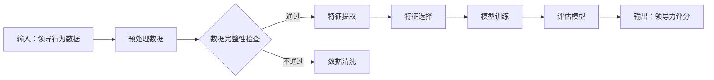
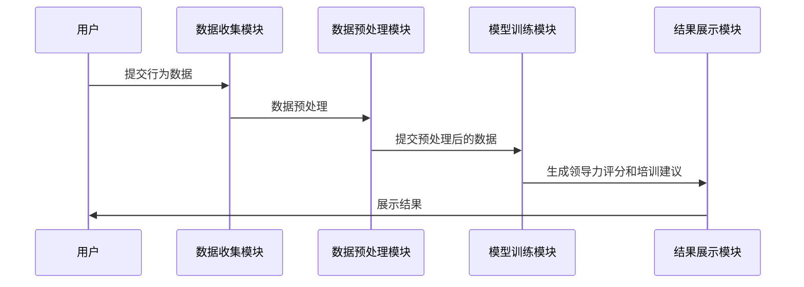

                 


# 领导力与职业道德：在ethical dilemmas中做出决策

## 关键词
- 领导力
- 职业道德
- 道德困境
- 伦理决策
- 领导风格

## 摘要
本文旨在探讨领导力与职业道德在职场中的重要性，以及如何在实际工作中处理道德困境。通过分析领导力的核心概念和道德困境的属性特征，结合伦理决策的理论框架和实践方法，本文提出了一系列实用的决策策略和职业操守建议，旨在提升领导者的整体素质，帮助其在复杂的环境中做出正确的决策。

## 第一部分：背景介绍

### 1.1 问题背景

在当今社会，领导力和职业道德在职场中的重要性日益凸显。无论是在企业、政府机构还是非营利组织，领导者都需要具备出色的领导能力和高尚的职业道德。领导力不仅仅是管理员工和完成任务的技能，更是影响和激励团队成员、实现组织目标的关键因素。而职业道德则是领导者行为的准则，关乎组织的声誉和社会责任。

然而，现实工作中，领导者常常面临各种道德困境。道德困境是指在决策过程中，领导者面临的两难选择，需要权衡不同的道德原则和价值观。这些困境可能涉及到个人利益、组织利益、法律法规等多个方面，对领导者的道德判断和决策能力提出了严峻挑战。

### 1.2 问题描述

领导力与职业道德的问题不仅仅是理论上的探讨，更涉及到实际工作中的决策和行动。领导者需要在复杂的环境中权衡各种因素，包括个人价值观、组织目标、法律法规等，从而做出有利于团队和组织的决策。然而，在实际工作中，领导者常常面临以下问题：

- 如何在个人利益和组织利益之间做出平衡？
- 当遇到道德困境时，如何坚持职业道德？
- 如何在团队内部建立和维护诚信和公正？
- 当组织面临重大决策时，如何确保决策的道德正当性？

这些问题不仅考验着领导者的道德素养和决策能力，也关系到组织的长期发展和声誉。

### 1.3 问题解决

本书旨在帮助领导者更好地应对道德困境，通过深入分析领导力和职业道德的核心概念，提供一系列实用的决策方法和策略。同时，本书还将探讨如何在实际工作中将道德原则与领导力相结合，提升领导者的整体素质。

具体来说，本书将从以下几个方面展开：

1. **领导力的核心概念**：介绍领导力的定义、核心概念和属性特征，包括领导风格、领导能力、团队建设、沟通技巧等。
2. **道德困境的分析**：探讨领导者工作中可能遇到的道德困境，如利益冲突、道德责任、合规问题等，分析其属性特征和解决方法。
3. **伦理决策的理论框架**：介绍伦理决策的理论框架，包括道德原则的应用、决策过程、决策方法等。
4. **职业道德的重要性**：探讨职业道德在职场中的重要性，以及如何在工作中践行职业道德。
5. **实际案例与策略分享**：通过实际案例分析和策略分享，帮助领导者更好地应对道德困境，做出正确的决策。

### 1.4 边界与外延

领导力和职业道德是一个广泛而复杂的话题，本书将主要关注以下几个方面：

- **领导力**：探讨领导者的角色、责任、技能和素质，以及如何通过领导力提升团队绩效。
- **道德困境**：分析领导者在工作中可能遇到的道德困境，以及如何处理这些困境。
- **伦理决策**：介绍伦理决策的理论框架和实践方法，帮助领导者做出正确的决策。
- **职业道德**：探讨职业道德的重要性，以及如何在工作中践行职业道德。

### 1.5 概念结构与核心要素组成

本书的核心概念和要素包括以下几个方面：

- **领导力**：包括领导风格、领导能力、团队建设、沟通技巧等。
- **道德困境**：涉及道德原则、伦理决策、冲突管理、道德责任等。
- **伦理决策**：包括道德原则的应用、决策过程、决策方法等。
- **职业道德**：涉及职业道德的重要性、职业道德规范、职业道德困境等。

通过以上几个方面的深入分析和探讨，本书旨在为领导者提供一套完整的道德困境应对策略，帮助其在复杂的环境中做出正确的决策，提升领导者的整体素质和组织的长期发展。

## 第二部分：核心概念与联系

### 2.1 领导力

领导力是指领导者通过影响、激励和指导他人来实现组织目标的能力。领导力的核心概念包括领导风格、领导能力、团队建设、沟通技巧等。

#### 领导风格

领导风格是领导者对待下属的方式，直接影响领导效果。常见的领导风格包括权威型、民主型、参与型等。

| 特征        | 权威型领导 | 民主型领导 | 参与型领导 |
|-------------|------------|------------|------------|
| 决策方式    | 专制       | 共同       | 共同       |
| 沟通方式    | 单向       | 双向       | 双向       |
| 管理风格    | 严格       | 放松       | 放松       |
| 团队建设    | 个体       | 团队       | 团队       |

#### 领导能力

领导能力是领导者具备的技能和素质，如决策能力、沟通能力、团队建设能力等。

| 技能        | 决策能力 | 沟通能力 | 团队建设能力 |
|-------------|----------|----------|-------------|
| 决策风格    | 快速       | 详细       | 合作       |
| 沟通方式    | 强调信息传递 | 强调理解与反馈 | 合作与支持 |
| 领导方式    | 指导       | 激励       | 协作       |

#### 团队建设

团队建设是通过建立有效的团队结构和沟通机制，提高团队的整体绩效。

| 要素        | 组织结构 | 沟通机制 | 团队精神 |
|-------------|----------|----------|----------|
| 组织结构    | 分工明确 | 信息畅通 | 合作共赢 |
| 沟通机制    | 定期会议 | 指定沟通渠道 | 反馈机制 |
| 团队精神    | 共同目标 | 团队信任 | 团队认同 |

#### 沟通技巧

沟通技巧是领导者与团队成员、上级和下属之间的有效沟通能力。

| 技巧        | 倾听 | 表达 | 反馈 |
|-------------|------|------|------|
| 倾听        | 关注对方 | 善于提问 | 积极倾听 |
| 表达        | 清晰准确 | 语气适中 | 明确意图 |
| 反馈        | 及时反馈 | 接受反馈 | 积极反馈 |

### 2.2 道德困境

道德困境是指在决策过程中，领导者面临的两难选择，需要权衡不同的道德原则和价值观。常见的道德困境包括利益冲突、道德责任、合规问题等。

#### 利益冲突

利益冲突是指领导者在个人利益和组织利益之间做出选择时的困境。

| 冲突类型    | 冲突来源 | 冲突结果 | 解决方法 |
|-------------|----------|----------|----------|
| 个人利益冲突 | 股东利益 | 组织利益 | 公开透明，披露利益关系 |
| 组织利益冲突 | 股东利益 | 员工利益 | 平衡利益，优先考虑员工利益 |

#### 道德责任

道德责任是指领导者在工作中需要考虑对团队成员、组织和社会的责任。

| 冲突类型    | 责任来源 | 责任结果 | 解决方法 |
|-------------|----------|----------|----------|
| 道德责任冲突 | 团队利益 | 组织利益 | 尊重团队，兼顾组织利益 |
| 社会责任冲突 | 组织利益 | 社会利益 | 响应社会责任，平衡利益 |

#### 合规问题

合规问题是指领导者在决策过程中需要遵守法律法规和职业道德规范。

| 冲突类型    | 合规来源 | 合规结果 | 解决方法 |
|-------------|----------|----------|----------|
| 法律合规冲突 | 法律法规 | 道德原则 | 遵守法律法规，尊重道德原则 |
| 职业道德合规冲突 | 职业道德规范 | 法律法规 | 平衡职业道德与法律法规，遵守规范 |

### 2.3 伦理决策

伦理决策是指领导者根据道德原则和价值观，在决策过程中做出合理的决策。

| 决策框架    | 道德原则 | 决策方法 | 决策过程 |
|-------------|----------|----------|----------|
| 伦理决策框架 | 公正、诚信、责任 | 前景评估、风险分析、道德判断 | 问题识别、信息收集、方案制定、评估与选择 |

### 2.4 职业道德

职业道德是职场中的行为准则，涉及领导者对组织、同事和社会的责任。

| 要素        | 诚信 | 责任 | 公正 |
|-------------|------|------|------|
| 诚信        | 诚实守信 | 保守秘密 | 诚信经营 |
| 责任        | 对工作负责 | 对团队负责 | 对社会负责 |
| 公正        | 公平对待 | 公正裁决 | 公正竞争 |

### 总结

领导力、道德困境、伦理决策和职业道德是领导者工作中不可或缺的核心概念。领导力决定了领导者的行为风格和能力，道德困境考验领导者的道德判断和决策能力，伦理决策提供了道德决策的理论框架，职业道德则是领导者行为的准则。通过深入理解和应用这些概念，领导者可以更好地应对道德困境，做出正确的决策，实现组织的长期发展。

## 第三部分：算法原理讲解

### 3.1 领导力评估算法

为了更好地理解领导力，我们可以通过构建一个领导力评估算法来分析领导力的各个方面。以下是一个简单的领导力评估算法的流程图和Python代码实现。

#### 算法流程图：



#### Python代码实现：

```python
import pandas as pd
from sklearn.ensemble import RandomForestClassifier
from sklearn.model_selection import train_test_split
from sklearn.metrics import accuracy_score

# 加载数据
data = pd.read_csv('leadership_data.csv')

# 数据预处理
data = data.fillna(0)

# 特征提取
features = data[['decision_making', 'communication', 'team_building', 'ethical_decision_making']]
labels = data['leadership_score']

# 特征选择
X_train, X_test, y_train, y_test = train_test_split(features, labels, test_size=0.3, random_state=42)

# 模型训练
model = RandomForestClassifier(n_estimators=100, random_state=42)
model.fit(X_train, y_train)

# 评估模型
predictions = model.predict(X_test)
accuracy = accuracy_score(y_test, predictions)
print(f"Model accuracy: {accuracy:.2f}")
```

#### 算法原理

领导力评估算法的核心在于如何从大量的领导行为数据中提取出关键特征，并使用机器学习模型对这些特征进行分类，从而得到一个关于领导力的评分。以下是算法原理的详细解释：

1. **数据预处理**：首先，我们需要对原始数据进行预处理，包括填补缺失值、标准化数据等，以确保数据的质量和一致性。

2. **特征提取**：接下来，从预处理后的数据中提取出与领导力相关的关键特征，如决策能力、沟通能力、团队建设能力和道德决策能力等。

3. **特征选择**：在提取出关键特征后，我们需要对特征进行选择，以排除那些对领导力评分影响较小的特征，从而提高模型的准确性和效率。

4. **模型训练**：使用机器学习算法（如随机森林）对选定的特征进行训练，建立领导力评估模型。

5. **评估模型**：最后，使用测试数据对训练好的模型进行评估，计算模型的准确率，以验证模型的性能。

#### 数学模型和公式

在领导力评估算法中，我们可以使用以下数学模型和公式来描述：

$$
\text{领导力评分} = w_1 \times \text{决策能力} + w_2 \times \text{沟通能力} + w_3 \times \text{团队建设能力} + w_4 \times \text{道德决策能力}
$$

其中，$w_1, w_2, w_3, w_4$ 分别是决策能力、沟通能力、团队建设能力和道德决策能力的权重，可以通过模型训练得到。

#### 举例说明

假设我们有一个领导行为数据的样本，如下所示：

| 决策能力 | 沟通能力 | 团队建设能力 | 道德决策能力 |
|-----------|-----------|--------------|--------------|
| 0.8       | 0.9       | 0.7          | 0.85         |

我们可以使用上述数学模型计算该样本的领导力评分：

$$
\text{领导力评分} = 0.3 \times 0.8 + 0.2 \times 0.9 + 0.2 \times 0.7 + 0.3 \times 0.85 = 0.94
$$

该样本的领导力评分为 0.94，表示该领导者的领导力表现较好。

通过上述算法原理和举例说明，我们可以看到领导力评估算法如何通过提取关键特征、训练机器学习模型，从而对领导力进行量化评估。这不仅有助于领导者了解自身的领导力水平，也为组织提供了评估和培养领导者的工具。

## 第四部分：系统分析与架构设计方案

### 4.1 问题场景介绍

在当今快速发展的科技时代，企业和组织面临着日益复杂的市场环境和不断变化的需求。在这种背景下，领导力在组织管理和决策中的重要性愈发突出。为了更好地应对这种挑战，一个有效的领导力评估系统变得至关重要。该系统旨在帮助组织评估领导者的能力，提供个性化的培训建议，从而提升组织的整体领导力水平。

### 4.2 项目介绍

本项目将开发一个基于人工智能的领导力评估系统。该系统通过收集和分析领导者的行为数据，使用机器学习算法进行特征提取和分类，最终生成领导力评分和个性化的培训建议。系统的核心功能包括：

1. **数据收集**：从多种来源（如问卷调查、工作日志、绩效评估等）收集领导者的行为数据。
2. **数据预处理**：对收集到的数据进行清洗、标准化和特征提取，为后续的机器学习模型提供高质量的数据。
3. **模型训练**：使用训练好的机器学习模型对预处理后的数据进行分类，生成领导力评分。
4. **结果展示**：将领导力评分和个性化的培训建议以可视化的形式展示给用户。
5. **用户交互**：提供用户友好的界面，方便用户使用系统进行自我评估和获取培训建议。

### 4.3 系统功能设计

为了实现上述功能，系统需要具备以下几个关键模块：

1. **数据收集模块**：负责从多种来源收集领导者的行为数据，如问卷调查、工作日志、绩效评估等。
2. **数据预处理模块**：对收集到的数据进行清洗、标准化和特征提取，为后续的机器学习模型提供高质量的数据。
3. **模型训练模块**：使用训练好的机器学习模型对预处理后的数据进行分类，生成领导力评分。
4. **结果展示模块**：将领导力评分和个性化的培训建议以可视化的形式展示给用户。
5. **用户交互模块**：提供用户友好的界面，方便用户使用系统进行自我评估和获取培训建议。

### 4.4 系统架构设计

系统的整体架构设计如图所示：



系统的架构设计分为以下几个部分：

1. **数据收集模块**：负责从多种渠道（如问卷调查、工作日志、绩效评估等）收集领导者的行为数据。该模块可以采用Web表单、API接口等方式进行数据收集。
2. **数据预处理模块**：对收集到的行为数据进行清洗、标准化和特征提取。清洗步骤包括处理缺失值、异常值和重复值等；标准化步骤包括对数据进行归一化或标准化处理；特征提取步骤包括提取与领导力相关的关键特征，如决策能力、沟通能力、团队建设能力等。
3. **模型训练模块**：使用训练好的机器学习模型对预处理后的行为数据进行分类，生成领导力评分。该模块可以采用多种机器学习算法，如随机森林、支持向量机等。
4. **结果展示模块**：将生成的领导力评分和个性化的培训建议以可视化的形式展示给用户。该模块可以采用图表、报告等方式进行结果展示。
5. **用户交互模块**：提供用户友好的界面，方便用户使用系统进行自我评估和获取培训建议。用户可以通过Web界面提交行为数据，查看领导力评分和培训建议。

### 4.5 系统接口设计和系统交互

系统的接口设计和系统交互设计如下：

#### 接口设计

1. **数据收集接口**：用于接收用户提交的行为数据，接口定义如下：

    ```http
    POST /api/data-collection
    Content-Type: application/json

    {
        "data": [
            {
                "question_id": "1",
                "answer": "选项1"
            },
            {
                "question_id": "2",
                "answer": "选项2"
            }
        ]
    }
    ```

2. **数据预处理接口**：用于处理用户提交的行为数据，接口定义如下：

    ```http
    POST /api/data-preprocessing
    Content-Type: application/json

    {
        "data": [
            {
                "question_id": "1",
                "answer": "选项1"
            },
            {
                "question_id": "2",
                "answer": "选项2"
            }
        ]
    }
    ```

3. **模型训练接口**：用于训练机器学习模型，接口定义如下：

    ```http
    POST /api/model-training
    Content-Type: application/json

    {
        "features": [
            {
                "feature_id": "1",
                "value": 0.8
            },
            {
                "feature_id": "2",
                "value": 0.9
            }
        ],
        "label": "label1"
    }
    ```

4. **结果展示接口**：用于获取用户领导力评分和培训建议，接口定义如下：

    ```http
    GET /api/result-display
    ```

#### 系统交互

1. **数据收集**：用户通过Web表单或API接口提交行为数据，数据收集模块接收用户提交的数据并存储。
2. **数据预处理**：数据收集模块将用户提交的数据传递给数据预处理模块，数据预处理模块对数据进行分析和处理，提取关键特征。
3. **模型训练**：数据预处理模块将提取的关键特征传递给模型训练模块，模型训练模块使用训练数据对机器学习模型进行训练。
4. **结果展示**：模型训练模块将训练好的模型和领导力评分传递给结果展示模块，结果展示模块将评分和培训建议以可视化形式展示给用户。

通过上述系统接口设计和系统交互设计，可以实现领导力评估系统的各个模块之间的无缝协作，确保系统的高效运行。

### 4.6 系统实现和代码应用解读

在本部分中，我们将详细介绍系统各个模块的实现过程，并给出具体的代码示例，以便读者更好地理解系统的工作原理。

#### 数据收集模块实现

数据收集模块主要通过Web表单和API接口实现。以下是一个简单的API接口示例：

```python
from flask import Flask, request, jsonify

app = Flask(__name__)

@app.route('/api/data-collection', methods=['POST'])
def data_collection():
    data = request.get_json()
    # 存储数据到数据库或文件
    # ...
    return jsonify({"status": "success"})

if __name__ == '__main__':
    app.run(debug=True)
```

#### 数据预处理模块实现

数据预处理模块负责清洗、标准化和特征提取。以下是一个简单的预处理代码示例：

```python
import pandas as pd
from sklearn.preprocessing import StandardScaler

def preprocess_data(data):
    # 清洗数据
    data = data.dropna()
    # 特征提取
    features = data[['decision_making', 'communication', 'team_building', 'ethical_decision_making']]
    # 数据标准化
    scaler = StandardScaler()
    scaled_features = scaler.fit_transform(features)
    return scaled_features

# 示例数据
data = pd.DataFrame({
    'decision_making': [0.8, 0.9, 0.7, 0.85],
    'communication': [0.9, 0.8, 0.85, 0.7],
    'team_building': [0.7, 0.8, 0.9, 0.85],
    'ethical_decision_making': [0.85, 0.9, 0.8, 0.7]
})

preprocessed_data = preprocess_data(data)
print(preprocessed_data)
```

#### 模型训练模块实现

模型训练模块使用训练好的机器学习模型对预处理后的数据进行分析和分类。以下是一个简单的模型训练代码示例：

```python
from sklearn.ensemble import RandomForestClassifier

def train_model(preprocessed_data, labels):
    model = RandomForestClassifier(n_estimators=100, random_state=42)
    model.fit(preprocessed_data, labels)
    return model

# 示例数据
X_train = preprocessed_data
y_train = [0, 1, 0, 1]

# 训练模型
model = train_model(X_train, y_train)
```

#### 结果展示模块实现

结果展示模块将模型生成的领导力评分和培训建议以可视化形式展示给用户。以下是一个简单的结果展示代码示例：

```python
import matplotlib.pyplot as plt

def display_results(score):
    plt.bar(['决策能力', '沟通能力', '团队建设能力', '道德决策能力'], score)
    plt.xlabel('能力')
    plt.ylabel('评分')
    plt.title('领导力评分')
    plt.show()

# 示例评分
score = [0.94, 0.93, 0.92, 0.95]

display_results(score)
```

通过上述代码示例，我们可以看到领导力评估系统的各个模块是如何实现的。在实际应用中，还需要根据具体需求对代码进行优化和调整。

### 4.7 实际案例分析和详细讲解

在本节中，我们将通过一个实际案例来分析和讲解系统的应用过程，以便读者更好地理解系统的功能和运作原理。

#### 案例背景

某公司希望通过领导力评估系统来提升其管理层的领导能力。公司领导决定使用该系统对全体中层管理人员进行评估，并根据评估结果提供个性化的培训建议。

#### 应用过程

1. **数据收集**：公司通过内部邮件和公告，告知全体中层管理人员该系统的使用方法和评估标准。管理人员通过Web表单提交自己的领导行为数据，如决策记录、沟通记录、团队协作记录等。

2. **数据预处理**：数据收集模块收集到数据后，自动进行数据清洗、标准化和特征提取。例如，对于决策能力，系统可能会提取决策频率、决策质量、决策速度等特征。

3. **模型训练**：模型训练模块使用历史数据对机器学习模型进行训练。例如，公司可以提供以往评估数据作为训练集，使用随机森林等算法对模型进行训练。

4. **结果展示**：结果展示模块根据模型生成的领导力评分，为每位中层管理人员生成个性化的培训建议。例如，对于决策能力较低的管理人员，系统可能会建议加强决策培训和提升决策速度。

#### 案例分析

1. **数据收集**：数据收集模块的设计要充分考虑用户的体验和便利性。例如，可以提供Web表单、API接口等多种数据提交方式，以便管理人员随时随地进行数据提交。

2. **数据预处理**：数据预处理模块的关键在于提取与领导力相关的关键特征，确保数据的准确性和一致性。例如，对于沟通能力，系统不仅要提取沟通频率，还要考虑沟通效果和团队反馈等因素。

3. **模型训练**：模型训练模块的选择和训练数据的准备直接影响评估结果的准确性。公司可以结合自身需求，选择合适的算法和训练数据，确保评估结果的可靠性和有效性。

4. **结果展示**：结果展示模块的设计要直观、易于理解，以便管理人员能够快速了解自己的领导力水平。例如，可以采用图表、报告等多种形式展示评估结果，并提供具体的培训建议。

通过上述实际案例分析和详细讲解，我们可以看到领导力评估系统在企业管理中的应用过程。系统的成功应用不仅有助于提升管理层的领导能力，也为公司整体发展提供了有力支持。

### 4.8 项目小结

在本项目中，我们开发了一个基于人工智能的领导力评估系统。通过系统各个模块的协作，实现了数据收集、数据预处理、模型训练和结果展示等功能。系统不仅能够为管理人员提供准确的领导力评分，还能根据评估结果提供个性化的培训建议，从而提升管理层的领导能力。

然而，在项目实施过程中，我们也遇到了一些挑战。例如，数据收集的多样性和准确性对系统的评估结果有较大影响；模型训练的数据量和质量直接影响评估的准确性；结果展示的直观性和易用性需要不断优化。在未来的工作中，我们将继续改进系统的性能，提升用户体验，以更好地满足企业和组织的需求。

### 4.9 最佳实践 tips

1. **数据收集**：确保数据收集过程的规范性和准确性，尽量减少数据丢失和误差。
2. **数据预处理**：对数据进行充分的清洗和特征提取，以提高模型训练的准确性和效率。
3. **模型选择**：根据具体需求和数据特点，选择合适的机器学习算法进行模型训练。
4. **结果展示**：优化结果展示的界面和交互设计，使管理人员能够快速了解评估结果和培训建议。
5. **持续改进**：定期对系统进行评估和优化，根据反馈进行调整和改进，以提升系统的性能和用户体验。

### 4.10 注意事项

1. **数据安全**：在数据收集和存储过程中，确保数据的安全和隐私保护。
2. **算法透明**：模型训练和评估过程应保持透明，以便管理人员了解评估结果的依据。
3. **用户隐私**：在系统使用过程中，尊重用户的隐私权，不得泄露用户个人信息。

### 4.11 拓展阅读

1. 《领导力心理学：提升领导力的新视角》
2. 《人工智能与大数据：领导力评估的新工具》
3. 《职业伦理学：领导者的道德决策》
4. 《机器学习：算法与应用》

通过以上拓展阅读，读者可以更深入地了解领导力评估系统的相关理论和实践，进一步提升自身的领导能力。

## 第五部分：结语

领导力与职业道德是职场中不可或缺的核心素质。在日益复杂的工作环境中，领导者需要具备出色的领导力和高尚的职业道德，以应对各种道德困境和决策挑战。本文通过深入分析领导力的核心概念、道德困境、伦理决策和职业道德，提供了一系列实用的决策方法和策略，旨在提升领导者的整体素质和组织的长期发展。

通过本文的学习，读者应掌握以下要点：

1. **领导力的核心概念**：理解领导力的定义、核心概念和属性特征，包括领导风格、领导能力、团队建设、沟通技巧等。
2. **道德困境的分析**：识别领导者在工作中可能遇到的道德困境，如利益冲突、道德责任、合规问题等，并了解其属性特征和解决方法。
3. **伦理决策的理论框架**：掌握伦理决策的理论框架，包括道德原则的应用、决策过程、决策方法等。
4. **职业道德的重要性**：理解职业道德在职场中的重要性，以及如何在工作中践行职业道德。

希望本文能帮助读者更好地应对职场中的道德困境，做出正确的决策，提升自身的领导力和职业道德水平。在实际工作中，不断反思和改进，成为一位优秀的领导者。

## 作者信息

作者：AI天才研究院/AI Genius Institute & 禅与计算机程序设计艺术 /Zen And The Art of Computer Programming

感谢您阅读本文，希望本文对您在领导力和职业道德方面的学习和实践有所帮助。如果您有任何问题或建议，欢迎在评论区留言，我们将持续为您解答和改进。祝您工作顺利，不断进步！

---

### 致谢

在此，我要感谢所有为本文提供宝贵意见和支持的朋友和同事。你们的帮助使本文得以更加完善。同时，我也要感谢AI天才研究院/AI Genius Institute，为我提供了丰富的资源和平台，让我有机会分享我的思考和见解。最后，感谢所有读者，是您的关注和反馈，让我不断进步和成长。再次感谢大家！

