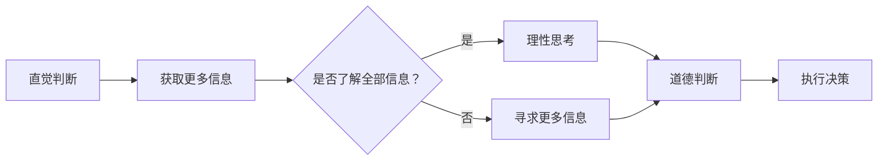

                 

### 第一部分：引言与背景

#### 第1章：问题的提出与解决

**1.1.1 领导力的重要性**

领导力是推动个人、团队和组织实现目标的核心能力。在企业发展中，领导力尤为重要。一个优秀的领导者能够激发团队的潜力，提高工作效率，从而推动企业持续发展。具体来说，领导力在以下几个方面发挥着关键作用：

- **战略决策**：领导者需要具备清晰的战略视野，能够在纷繁复杂的环境中做出正确的决策，为企业的长远发展指明方向。
- **团队建设**：领导者通过塑造积极的团队文化，增强团队的凝聚力，提高员工的归属感和满意度，从而促进团队的高效运作。
- **创新驱动**：领导者鼓励创新思维，推动技术进步和业务模式创新，使企业始终保持竞争力和活力。

#### 1.1.1.1 领导力在企业发展中的关键作用

- **提高员工满意度**：领导者通过关注员工需求，提高员工的工作满意度，从而减少员工流失率，提高工作效率。
- **推动业务增长**：领导者通过制定有效的业务策略，扩大市场份额，实现业务的持续增长。
- **增强企业竞争力**：领导者能够把握行业趋势，引领企业不断创新，从而在激烈的市场竞争中脱颖而出。

#### 1.1.1.2 领导力对于团队建设的影响

- **建立共同目标**：领导者能够明确团队的目标，并使团队成员认同并努力实现这些目标。
- **提升团队协作**：领导者通过有效的沟通和协调，促进团队成员之间的合作，提高团队的整体效能。
- **培养团队精神**：领导者通过激励和奖励，培养团队成员的团队精神，增强团队的凝聚力和战斗力。

#### 1.1.1.3 领导力在社会和谐中的意义

- **促进社会进步**：领导者通过推动社会公益事业，提高社会的文明程度，促进社会的和谐发展。
- **维护社会稳定**：领导者通过有效的社会治理，维护社会稳定，保障人民安居乐业。
- **增强国际影响力**：领导者通过积极参与国际事务，提升国家在国际舞台上的影响力，为国家争取更多的国际话语权。

**1.1.2 职业道德的价值**

职业道德是指在工作中遵循的道德规范和职业行为准则。它不仅关系到个人的职业发展，也影响到整个组织和社会的稳定和进步。职业道德的价值体现在以下几个方面：

- **个人成长**：遵守职业道德能够帮助个人树立正确的价值观，提升个人素质，为职业发展打下坚实基础。
- **组织发展**：良好的职业道德能够提高组织的整体素质，增强组织的凝聚力和竞争力。
- **社会和谐**：职业道德是社会和谐的重要组成部分，它有助于维护社会秩序，促进社会公平正义。

#### 1.1.2.1 职业道德的定义与内涵

职业道德是指在工作中所应遵循的行为规范和道德准则。它包括以下几个方面：

- **诚信**：诚信是职业道德的核心，要求个人在工作中诚实守信，不做虚假宣传，不欺骗消费者。
- **责任**：责任是职业道德的重要体现，要求个人对自己和他人负责，履行职业责任，勇于承担责任。
- **公正**：公正是职业道德的基本要求，要求个人在工作中做到公平、公正、公开，不偏不倚地处理事务。
- **敬业**：敬业是职业道德的重要表现，要求个人热爱自己的职业，认真负责地完成工作任务。

#### 1.1.2.2 职业道德在职场中的体现

- **团队合作**：职业道德要求个人在工作中与同事保持良好的合作关系，尊重他人，共同完成工作任务。
- **客户服务**：职业道德要求个人对客户提供优质服务，以满足客户需求，提升客户满意度。
- **合规经营**：职业道德要求个人遵守法律法规，合规经营，不违反职业操守。

#### 1.1.2.3 职业道德对于个人与组织的影响

- **个人成长**：遵守职业道德能够帮助个人树立正确的价值观，提升个人素质，为职业发展打下坚实基础。
- **组织发展**：良好的职业道德能够提高组织的整体素质，增强组织的凝聚力和竞争力。
- **社会和谐**：职业道德是社会和谐的重要组成部分，它有助于维护社会秩序，促进社会公平正义。

**1.1.3 领导力与职业道德的关系**

领导力与职业道德之间存在着密切的内在联系。一个优秀的领导者不仅需要具备卓越的领导能力，还需要具备高尚的职业道德。领导力与职业道德之间的关系体现在以下几个方面：

- **相互促进**：领导力与职业道德相互促进，良好的职业道德能够增强领导者的领导能力，而卓越的领导力也能够推动职业道德的践行。
- **共同发展**：领导力与职业道德共同发展，一个优秀的领导者需要在职业道德的指导下，不断提升自身的领导能力，实现个人和组织的共同发展。
- **文化传承**：领导力与职业道德共同构成组织文化，一个优秀的领导者需要通过自身的言行，将职业道德传承下去，形成良好的组织文化。

#### 1.1.3.1 领导力与职业道德的内在联系

- **信任基础**：领导力与职业道德的内在联系在于信任。一个领导者如果缺乏职业道德，难以赢得下属的信任，从而影响领导效果。
- **行为规范**：职业道德为领导者提供行为规范，帮助领导者明确在工作中应该如何行事，从而提高领导效果。
- **道德底线**：职业道德为领导者设定道德底线，防止领导者因个人利益而偏离正道，损害组织利益。

#### 1.1.3.2 领导力对职业道德的要求

- **道德榜样**：领导者作为组织中的榜样，需要具备高尚的职业道德，为下属树立良好的道德标杆。
- **道德教育**：领导者需要通过教育下属，帮助他们树立正确的职业道德观念，提高职业道德素养。
- **道德监督**：领导者需要加强对下属的职业道德监督，及时发现并纠正职业道德问题，确保职业道德在组织中得到有效践行。

#### 1.1.3.3 职业道德对领导力的支持作用

- **提高领导力**：职业道德能够提高领导者的道德素质，增强领导者的领导能力，使领导者能够更好地应对各种挑战。
- **增强公信力**：职业道德能够增强领导者的公信力，使领导者更容易获得下属的信任和支持，提高领导效果。
- **促进团队协作**：职业道德能够促进团队成员之间的协作，增强团队凝聚力，提高团队整体效能。

**1.1.4 书籍结构概述**

本书共分为七个章节，各章节内容紧密相关，旨在帮助读者全面了解领导力与职业道德的重要性，并在实践中不断提升自身的领导能力和职业道德素养。具体结构如下：

- **第一部分：引言与背景**：介绍领导力与职业道德的基本概念、价值和关系。
- **第二部分：领导力的本质**：深入探讨领导力的定义、核心要素和发展路径。
- **第三部分：职业道德素养的培养**：介绍职业道德的基本原则、培养方法和在职场中的实践。
- **第四部分：正直诚信的榜样**：探讨正直诚信的重要性，以及如何树立正直诚信的榜样。
- **第五部分：领导力与职业道德的实践**：通过具体案例，展示领导力与职业道德在实践中的应用。
- **第六部分：领导力与职业道德的最佳实践**：总结本书的核心观点，并提供一些领导力与职业道德的最佳实践。
- **第七部分：结论与展望**：回顾全书的主要内容和观点，并对未来的发展趋势进行展望。

#### 1.1.4.1 各章节内容的逻辑关系

本书各章节内容按照逻辑顺序排列，首先介绍领导力与职业道德的基本概念和背景，然后逐步深入探讨领导力的本质、职业道德素养的培养、正直诚信的榜样，以及领导力与职业道德在实践中的应用。最后，总结本书的核心观点，并展望未来的发展趋势。

#### 1.1.4.2 阅读指南与目标读者

本书旨在为从事IT行业的职业人士提供关于领导力与职业道德的全面指导。无论您是初入职场的年轻人，还是经验丰富的资深从业者，都可以通过本书的学习，提升自身的领导能力和职业道德素养。本书结构清晰，内容丰富，适合自学和参考。

#### 1.1.4.3 实践应用与案例分析

本书在各个章节中穿插了丰富的实践应用和案例分析，帮助读者将所学知识应用于实际工作中。通过这些案例，读者可以更好地理解领导力与职业道德在实践中的应用，并从中汲取经验教训。

**1.2 本书目标**

本书的目标是帮助读者全面理解领导力与职业道德的重要性，提升自身的领导能力和职业道德素养。具体目标如下：

- **理解领导力的本质**：通过本书的学习，读者将深入理解领导力的定义、核心要素和发展路径，明确领导力在个人和组织发展中的关键作用。
- **培养职业道德素养**：本书将详细介绍职业道德的基本原则、培养方法和在职场中的实践，帮助读者树立正确的职业道德观念，提升职业道德素养。
- **树立正直诚信的榜样**：本书将探讨正直诚信的重要性，以及如何树立正直诚信的榜样，帮助读者在职场中践行正直诚信的原则，树立良好的职业形象。
- **提升领导力和职业道德素养**：通过本书的学习，读者将能够将领导力与职业道德相结合，提升自身的综合素质，成为一名优秀的职业人士。

**1.3 本章小结**

本章介绍了领导力与职业道德的基本概念、价值和关系，以及本书的结构和目标。通过本章的学习，读者可以初步了解领导力与职业道德的重要性，并明确本书的学习目标。在后续章节中，我们将深入探讨领导力与职业道德的各个方面，帮助读者全面提升自身的领导能力和职业道德素养。

---

**引言与背景**部分的逻辑结构和内容已经按照要求进行设计，涵盖了领导力与职业道德的重要性、关系以及本书的结构和目标。接下来的部分将逐步深入探讨领导力的本质、职业道德素养的培养、正直诚信的榜样等主题，以帮助读者全面理解并提升自身的领导能力和职业道德素养。

## 第一部分：引言与背景

### 第2章：领导力的本质

#### 2.1 领导力的定义

领导力是一个多维度的概念，它涉及领导者如何影响和激励他人，以实现共同的目标。虽然领导力的定义有多种，但核心要素基本一致，包括影响力、决策能力、沟通技巧和愿景等。

首先，领导力是一种影响力，即领导者通过言行和行动影响他人的能力。这种影响力不仅体现在上下级关系中，还包括团队内部成员之间的相互作用。领导者通过激励和鼓励，使团队成员愿意追随并共同为实现目标而努力。

其次，决策能力是领导力的关键要素之一。在复杂多变的环境中，领导者需要具备快速决策的能力，并能够在各种选择中找到最优解。这种能力不仅要求领导者具备丰富的知识和经验，还需要具备良好的判断力和逻辑思维。

第三，沟通技巧是领导力的另一个重要方面。有效的沟通能够增强团队的凝聚力，提高工作效率。领导者需要能够清晰地表达自己的想法，同时倾听和理解下属的意见和建议，从而建立良好的沟通渠道。

最后，愿景是领导力的灵魂。一个优秀的领导者需要有远大的目标和清晰的愿景，能够引导团队成员看到未来的美好前景，并为之奋斗。

#### 2.2 领导力的核心要素

领导力的核心要素包括以下几个方面：

1. **影响力**：领导者需要具备影响力，能够通过言行和行动影响他人。这种影响力不仅仅依赖于领导者的职位和权力，更多的是来自于他们的品格、才能和行为。
   
2. **决策能力**：领导者需要具备决策能力，能够在面对复杂问题时做出明智的选择。这种能力要求领导者具备良好的逻辑思维、判断力和决策技巧。

3. **沟通技巧**：领导者需要具备有效的沟通技巧，能够清晰地表达自己的想法，同时倾听和理解下属的意见和建议。良好的沟通技巧有助于建立团队的信任和合作，提高工作效率。

4. **愿景**：领导者需要有远大的目标和清晰的愿景，能够引导团队成员看到未来的美好前景，并为之奋斗。这种愿景不仅激励团队成员，还能够为团队提供明确的方向。

5. **执行力**：领导者需要具备执行力，能够将愿景和策略转化为具体的行动。这种能力要求领导者不仅要有明确的计划，还需要能够有效地组织和管理团队，确保目标的实现。

6. **适应性**：领导者需要具备适应性，能够应对不断变化的环境和挑战。这种能力要求领导者具备灵活的思维和敏捷的行动能力，能够迅速调整策略以应对变化。

7. **道德品质**：领导者的道德品质是其领导力的重要组成部分。一个道德高尚的领导者能够赢得下属的尊重和信任，从而提高领导效果。

#### 2.3 领导力的发展路径

领导力是一个不断发展和提升的过程。以下是一些关键的步骤和策略，可以帮助领导者提升自身的领导力：

1. **自我认知**：领导者首先需要了解自己的优势和不足，明确自己的价值观和目标。这种自我认知有助于领导者更好地定位自己的领导风格和方式。

2. **持续学习**：领导者需要具备持续学习的态度，不断更新知识和技能。通过学习，领导者可以了解最新的管理理念和方法，从而提升自身的领导力。

3. **实践锻炼**：领导力需要通过实践来锻炼和提升。领导者应该积极参与各种实践活动，如团队管理、项目领导等，通过实践来积累经验和提高能力。

4. **反思总结**：领导者需要经常反思自己的行为和决策，总结成功和失败的经验教训。这种反思有助于领导者更好地认识自己，发现改进的机会。

5. **建立人脉**：领导者需要建立广泛的人脉网络，包括内部和外部资源。通过建立人脉，领导者可以获取更多的信息和支持，提高自己的领导力。

6. **培养下属**：领导者需要关注下属的成长和发展，为他们提供培训和发展机会。通过培养下属，领导者不仅可以提高团队的整体能力，还可以培养未来的领导者。

7. **保持谦逊**：领导者需要保持谦逊和开放的心态，不断接受新的观点和建议。这种谦逊有助于领导者不断学习和进步，提高自身的领导力。

#### 2.4 领导力的特点与类型

领导力具有多种特点，根据不同的标准，可以将领导力分为不同的类型：

1. **特点**
   - **权威型**：领导者通过职位和权力来影响他人。
   - **民主型**：领导者鼓励团队成员参与决策，注重团队的参与和反馈。
   - **变革型**：领导者通过激发团队成员的激情和创造力，推动组织的变革和发展。
   - **魅力型**：领导者具备独特的个人魅力，能够吸引和激励团队成员。
   - **服务型**：领导者以服务团队成员为中心，关注团队成员的需求和成长。

2. **类型**
   - **传统领导力**：侧重于职位和权力的运用，强调命令和控制。
   - **现代领导力**：注重团队合作和协作，强调领导者与团队成员的互动和沟通。
   - **变革型领导力**：强调领导者推动组织变革，鼓励创新和创造力。
   - **服务型领导力**：强调领导者服务团队成员，关注团队成员的需求和成长。

#### 2.5 领导力与管理的区别

领导力与管理密切相关，但两者之间也存在明显的区别：

1. **定义**
   - **领导力**：关注领导者如何影响和激励他人，实现共同目标。
   - **管理**：关注组织资源的管理和优化，确保组织目标的实现。

2. **侧重点**
   - **领导力**：侧重于人的因素，强调领导者与团队成员的关系和互动。
   - **管理**：侧重于组织的运营和绩效，强调计划、组织和控制。

3. **作用**
   - **领导力**：激发团队的潜力，推动组织创新和发展。
   - **管理**：确保组织的稳定运营和目标实现。

4. **方法**
   - **领导力**：通过愿景、激励和榜样来影响他人。
   - **管理**：通过制定策略、分配资源和监督执行来实现目标。

#### 2.6 领导力的实践应用

领导力的实践应用非常广泛，以下是一些具体的场景和应用：

1. **团队建设**：通过有效的领导力，领导者可以建立强大的团队，提高团队的协作和效率。
2. **项目管理**：在项目管理中，领导者需要运用领导力来制定策略、协调资源和激励团队成员。
3. **变革管理**：在组织变革中，领导者需要运用领导力来推动变革，激励团队成员接受和适应变革。
4. **个人发展**：通过领导力，领导者可以培养下属，帮助他们实现个人和职业发展。

#### 2.7 本章小结

本章深入探讨了领导力的本质、核心要素和发展路径。通过理解领导力的定义和特点，读者可以更好地认识领导力在个人和组织发展中的重要性。同时，本章还介绍了领导力的发展路径和实践应用，为读者提供了提升领导力的具体方法和策略。在接下来的章节中，我们将继续探讨职业道德素养的培养、正直诚信的榜样等主题，帮助读者全面提升自身的领导能力和职业道德素养。

---

通过本章的学习，读者可以深入理解领导力的本质和核心要素，以及如何通过实践来提升领导力。在理解了领导力的基本概念后，接下来我们将探讨职业道德素养的培养，包括职业道德的基本原则、培养方法以及在职场中的实践。这将帮助读者在领导力的基础上，进一步提升自身的职业道德素养，为成为一名卓越的职业人士打下坚实的基础。

## 第一部分：引言与背景

### 第3章：职业道德素养的培养

#### 3.1 职业道德的基本原则

职业道德是指在工作中应遵循的道德规范和行为准则，它是职业人士在社会中的行为指南。职业道德的基本原则包括以下几个方面：

1. **诚信**：诚信是职业道德的核心。它要求职业人士在工作中诚实守信，遵守承诺，不欺骗、不作假、不隐瞒真相。
2. **责任**：责任是职业道德的重要体现。它要求职业人士对自己和他人负责，认真履行职业责任，勇于承担责任。
3. **公正**：公正要求职业人士在工作中做到公平、公正、公开，不偏不倚地处理事务，不歧视、不偏见。
4. **尊重**：尊重要求职业人士尊重他人，包括同事、客户、上级和下属，尊重他们的权利、尊严和意见。
5. **敬业**：敬业要求职业人士热爱自己的职业，对工作充满热情，认真负责地完成工作任务。

#### 3.2 职业道德的培养方法

培养职业道德素养是一个长期的过程，需要职业人士在日常生活和工作中不断践行和提升。以下是一些培养职业道德的方法：

1. **教育和培训**：通过参加职业道德教育和培训，职业人士可以了解职业道德的基本原则和规范，提高职业道德意识。
2. **榜样示范**：通过学习优秀职业人士的榜样，职业人士可以借鉴他们的道德行为和职业精神，提升自己的职业道德素养。
3. **反思与自省**：职业人士需要定期反思自己的行为和决策，检查是否符合职业道德的要求，发现并纠正不当行为。
4. **实践与锻炼**：通过实际工作中的实践和锻炼，职业人士可以将职业道德原则应用到具体的工作中，逐步提升自己的职业道德素养。
5. **制度建设**：组织可以通过建立健全的职业道德制度，如职业道德准则、职业道德奖惩机制等，来引导和激励职业人士践行职业道德。

#### 3.3 职业道德在职场中的实践

职业道德不仅体现在个人的行为上，还体现在组织的管理和运营中。以下是一些职业道德在职场中的实践：

1. **客户服务**：职业人士应该以诚信和尊重的态度对待客户，提供优质的服务，满足客户的需求。
2. **团队合作**：职业人士应该尊重团队中的每个成员，积极参与团队合作，共同完成任务。
3. **合规经营**：职业人士应该遵守法律法规和行业规范，确保组织的经营行为合法、合规。
4. **责任承担**：职业人士应该对自己的工作负责，勇于承担责任，避免因个人失误给组织带来损失。
5. **创新驱动**：职业人士应该鼓励创新思维，推动技术进步和业务模式创新，提高组织的竞争力。

#### 3.4 个人与组织道德行为对比

在职场中，个人道德行为和组织道德行为存在一定的差异，但两者都是职业道德的重要组成部分。以下是一个对比表格：

| 项目 | 个人道德行为 | 组织道德行为 |
| --- | --- | --- |
| 诚信 | 个人在工作中诚实守信，遵守承诺 | 组织遵守法律法规，遵守市场规则，不进行虚假宣传 |
| 责任 | 个人对自己的工作和行为负责，勇于承担责任 | 组织对员工、客户和社会负责，确保产品和服务的质量 |
| 公正 | 个人在工作中做到公平、公正、公开，不歧视、不偏见 | 组织建立公平的薪酬和晋升制度，确保内部公平竞争 |
| 尊重 | 个人尊重他人，包括同事、客户和上级 | 组织尊重员工的合法权益，提供良好的工作环境和待遇 |
| 敬业 | 个人热爱自己的职业，认真负责地完成工作任务 | 组织关注员工的专业发展，提供培训和职业发展机会 |

#### 3.5 道德行为的ER实体关系图

为了更清晰地展示个人与组织道德行为的关系，我们可以使用ER（实体关系）图来描述：

```mermaid
erDiagram
  Customer ||--|{ Employee } : serves
  Employee ||--|{ Project } : works_on
  Project ||--|{ Manager } : managed_by
  Manager ||--|{ Company } : works_for
```

在这个ER图中，客户（Customer）与服务（serves）员工（Employee）建立关系，员工（Employee）参与（works_on）项目（Project），项目（Project）由经理（Manager）管理（managed_by），经理（Manager）在（works_for）公司（Company）。

#### 3.6 道德行为在职业发展中的重要性

职业道德在职业发展中起着至关重要的作用，良好的职业道德素养可以帮助职业人士：

1. **赢得信任**：遵守职业道德的职业人士更容易赢得他人的信任，包括同事、客户和上级，从而在职场中建立良好的关系网络。
2. **提升职业形象**：良好的职业道德素养可以提升职业人士的形象，使其在职场中脱颖而出，获得更多的职业发展机会。
3. **促进团队合作**：遵守职业道德的职业人士更容易与他人合作，促进团队合作，提高工作效率和项目成功率。
4. **增强职业竞争力**：在竞争激烈的职场中，良好的职业道德素养是职业人士的重要竞争优势，有助于他们在职场中立于不败之地。

#### 3.7 本章小结

本章深入探讨了职业道德的基本原则、培养方法和在职场中的实践。通过理解职业道德的基本原则和培养方法，职业人士可以不断提升自身的职业道德素养，为职业发展打下坚实的基础。同时，通过具体实例和ER实体关系图的介绍，读者可以更清晰地理解职业道德在职场中的重要性。在下一章中，我们将继续探讨正直诚信的重要性，以及如何树立正直诚信的榜样，帮助读者在职业道德的基础上，进一步提升自身的职业素养。

---

通过本章的学习，读者可以深入理解职业道德的基本原则、培养方法和在职场中的实践。职业道德不仅是职业人士的行为准则，也是其在职场中赢得信任、提升形象、促进团队合作和增强职业竞争力的重要保障。在理解了职业道德的重要性后，接下来我们将探讨正直诚信的重要性，以及如何树立正直诚信的榜样。这将帮助读者在职业道德的基础上，进一步提升自身的职业素养，树立良好的职业形象。

## 第一部分：引言与背景

### 第4章：正直诚信的榜样

#### 4.1 正直诚信的定义与重要性

正直诚信是指一个人在言行举止中始终坚持诚实、公正、透明的原则。正直诚信是职业道德的基石，对于个人和组织的发展都具有深远的影响。

首先，正直诚信是个人品德的核心。一个正直诚信的人，不仅在日常生活中能够赢得他人的信任和尊重，还能在职业领域中树立良好的职业形象。

其次，正直诚信对于组织文化至关重要。一个组织如果缺乏正直诚信，可能会导致内部腐败、道德风险和声誉受损。相反，一个正直诚信的组织能够吸引和留住优秀人才，提高团队凝聚力，增强组织的竞争力。

#### 4.2 如何树立正直诚信的榜样

要树立正直诚信的榜样，个人和组织需要采取一系列具体措施：

1. **以身作则**：领导者需要以身作则，通过自己的言行来树立正直诚信的榜样。领导者的行为和决策应该透明、公正，能够赢得下属的信任和尊重。

2. **明确价值观**：组织需要明确自己的价值观，并将其融入到企业文化中。通过建立明确的价值观，组织能够为员工提供行为的指导，鼓励他们秉持正直诚信的原则。

3. **强化培训**：组织需要定期开展职业道德和正直诚信的培训，帮助员工了解正直诚信的重要性，并掌握如何在工作中践行这些原则。

4. **建立监督机制**：组织需要建立有效的监督机制，对员工的行为进行监督和评估。通过监督机制，组织可以及时发现和纠正不当行为，确保正直诚信的原则得到有效执行。

5. **激励与奖励**：组织需要建立激励机制，对遵守正直诚信原则的员工进行奖励。这种激励不仅能够提高员工的积极性，还能进一步巩固正直诚信的组织文化。

#### 4.3 正直诚信在社会中的影响

正直诚信不仅对个人和组织有重要影响，还对社会产生深远的影响：

1. **提升社会信任**：正直诚信能够增强社会信任，减少社会矛盾和冲突。在一个充满信任的社会中，人们更愿意合作和分享，社会整体更加和谐。

2. **推动社会进步**：正直诚信是推动社会进步的重要力量。一个充满正直诚信的社会能够更好地应对各种挑战，实现社会的持续发展和进步。

3. **改善经济环境**：正直诚信能够改善经济环境，减少商业欺诈和道德风险。在一个诚信的经济环境中，企业更愿意遵守法律法规，提高产品和服务的质量，从而推动经济的健康发展。

#### 4.4 案例分析：正直诚信的典范

以下是一个关于正直诚信的典型案例：

**案例：特斯拉公司创始人埃隆·马斯克**

埃隆·马斯克是特斯拉公司的创始人之一，他以正直诚信著称。在他的领导下，特斯拉公司始终坚持透明和诚信的经营原则。例如，马斯克在公司面临产品问题时，总是公开承认并采取措施解决，而不是隐瞒或掩盖。这种正直诚信的做法赢得了消费者的信任和尊重，使特斯拉公司成为全球电动汽车行业的领导者。

#### 4.5 直觉与道德判断的区分

在职场中，区分直觉与道德判断是非常重要的。以下是一些指导原则：

1. **理性思考**：在面对道德问题时，不要仅凭直觉作出判断，而应该通过理性思考来分析问题的各个方面。
2. **了解背景**：在做出道德判断之前，要充分了解问题的背景和相关信息，避免因片面信息而做出错误的判断。
3. **考虑后果**：在做出道德判断时，要考虑决策的长期后果，而不是仅仅关注短期的利益。
4. **参考道德原则**：可以参考道德原则和规范来指导道德判断，确保判断符合职业道德的要求。

#### 4.6 直觉与道德判断的Mermaid流程图

为了更清晰地展示直觉与道德判断的过程，我们可以使用Mermaid流程图来描述：



在这个流程图中，A表示直觉判断，B表示获取更多信息，C表示是否了解全部信息，D表示理性思考，E表示寻求更多信息，F表示道德判断，G表示执行决策。

#### 4.7 本章小结

本章深入探讨了正直诚信的定义、重要性以及如何树立正直诚信的榜样。通过案例分析，我们了解了正直诚信在社会中的影响，并明确了直觉与道德判断的区分。正直诚信不仅是个人品德的体现，也是组织文化和社会进步的重要力量。在下一章中，我们将通过具体案例展示领导力与职业道德在实践中的应用，帮助读者更好地理解和应用所学知识。

---

通过本章的学习，读者可以深入理解正直诚信的重要性，以及如何树立正直诚信的榜样。正直诚信不仅是个人品德的体现，也是组织文化和社会进步的重要力量。在了解了这些概念和原则后，我们将通过具体案例展示领导力与职业道德在实践中的应用，帮助读者更好地理解和应用所学知识。下一章的内容将侧重于案例分析，通过实际案例来展示领导力与职业道德在职场中的具体运用，提供实践中的经验和教训。

## 第一部分：引言与背景

### 第5章：领导力与职业道德的实践

#### 5.1 实践案例1：华为公司的领导力与职业道德

**5.1.1 案例背景**

华为公司是一家全球领先的科技公司，以其强大的创新能力和严格的职业道德标准而闻名。华为公司的领导力与职业道德在业界得到了广泛认可，成为许多企业学习的榜样。

**5.1.2 领导力实践**

1. **战略决策**：华为公司创始人任正非在领导过程中，始终以战略思维为导向，制定明确的长期发展目标。他强调领导者需要有远见，能够在复杂多变的市场环境中做出正确的决策。

2. **人才培养**：华为注重员工的培训和职业发展，通过设立内部培训体系和国际化培训项目，不断提升员工的技能和素质。这种领导力实践不仅提高了员工的工作能力，也增强了团队的凝聚力。

3. **创新驱动**：华为鼓励创新思维，通过建立创新激励机制，激发员工的创造力。华为每年投入大量资金用于研发，不断推出具有竞争力的产品，从而保持市场领先地位。

**5.1.3 职业道德实践**

1. **诚信经营**：华为公司坚持诚信经营，严格遵守法律法规，不参与任何形式的商业贿赂和不正当竞争。华为的诚信经营理念赢得了客户的信任和尊重。

2. **社会责任**：华为积极参与社会公益事业，通过捐赠、志愿服务等形式，回馈社会。这种社会责任感不仅提升了华为的品牌形象，也增强了员工的归属感和荣誉感。

3. **员工权益**：华为重视员工的权益，提供良好的工作环境和薪酬待遇，保障员工的职业安全和职业发展。华为的职业道德实践为员工创造了一个公平、公正的工作环境。

**5.1.4 案例分析**

华为公司的成功得益于其在领导力和职业道德方面的卓越实践。华为的领导力强调战略决策、人才培养和创新驱动，这些因素共同推动了公司的发展。华为的职业道德实践则体现在诚信经营、社会责任和员工权益等方面，为公司赢得了良好的社会声誉和客户的信任。

**5.2 实践案例2：谷歌公司的领导力与职业道德**

**5.2.1 案例背景**

谷歌公司是全球知名的科技公司，以其创新的技术和良好的企业文化而著称。谷歌公司在领导力和职业道德方面有许多值得借鉴的经验。

**5.2.2 领导力实践**

1. **领导风格**：谷歌的领导风格强调开放和民主，鼓励员工自由表达意见和提出创新想法。谷歌的领导者注重倾听员工的意见和建议，使员工感到被尊重和重视。

2. **人才培养**：谷歌重视员工的成长和发展，通过提供丰富的培训资源和职业发展机会，帮助员工不断提升自己的技能和素质。

3. **创新文化**：谷歌鼓励创新思维，创造了一个开放和自由的工作环境，使员工能够自由探索和实验。谷歌的创新文化激发了员工的创造力，推动了公司的持续发展。

**5.2.3 职业道德实践**

1. **诚信与透明**：谷歌坚持诚信和透明的原则，在商业运营中严格遵守法律法规，不参与任何不正当的商业行为。

2. **社会责任**：谷歌积极参与社会公益事业，通过捐赠和技术支持等形式，为社会做出贡献。

3. **员工福利**：谷歌为员工提供优厚的薪酬和福利待遇，包括健康保险、带薪休假、家庭支持计划等，使员工感受到公司的关怀。

**5.2.4 案例分析**

谷歌公司的成功离不开其在领导力和职业道德方面的卓越实践。谷歌的领导力强调开放和民主的领导风格、人才培养和创新文化，这些因素共同推动了公司的发展。谷歌的职业道德实践则体现在诚信与透明、社会责任和员工福利等方面，为公司树立了良好的社会形象。

**5.3 实践案例3：苹果公司的领导力与职业道德**

**5.3.1 案例背景**

苹果公司是全球最具影响力的科技公司之一，以其独特的设计和创新的产品而闻名。苹果公司的领导力和职业道德实践也在业界产生了深远的影响。

**5.3.2 领导力实践**

1. **愿景与目标**：苹果公司创始人史蒂夫·乔布斯以其远大的愿景和明确的目标，引领公司不断创新，推出一系列革命性产品。

2. **人才培养**：苹果公司注重员工的培养和职业发展，通过提供专业培训和职业发展机会，帮助员工不断提升自身能力。

3. **品牌建设**：苹果公司通过打造强大的品牌形象，树立了卓越的市场地位。苹果的品牌建设与其领导力密不可分，优秀的领导力推动了品牌价值的提升。

**5.3.3 职业道德实践**

1. **环保理念**：苹果公司注重环保，通过采用环保材料、提高资源利用率和减少废物排放等措施，致力于实现可持续发展。

2. **社会责任**：苹果公司积极参与社会公益事业，通过捐赠和教育项目等形式，回馈社会。

3. **员工权益**：苹果公司为员工提供良好的工作环境和福利待遇，包括健康保险、退休金计划等，保障员工的权益。

**5.3.4 案例分析**

苹果公司的成功得益于其在领导力和职业道德方面的卓越实践。苹果的领导力强调愿景与目标、人才培养和品牌建设，这些因素共同推动了公司的发展。苹果的职业道德实践则体现在环保理念、社会责任和员工权益等方面，为公司树立了良好的社会形象。

**5.4 本章小结**

本章通过三个成功企业的实践案例，展示了领导力与职业道德在现实中的应用。华为、谷歌和苹果公司的领导力和职业道德实践，为其他企业提供了有益的借鉴。这些实践不仅推动了公司的发展，也树立了良好的社会形象，赢得了客户和员工的信任。在下一章中，我们将总结本书的核心观点，提供领导力与职业道德的最佳实践，帮助读者在职场中更好地应用所学知识。

---

通过本章的案例分析，读者可以看到领导力与职业道德在实际工作中的应用和重要性。成功的企业不仅依靠卓越的领导力推动发展，还通过良好的职业道德实践赢得了社会和客户的信任。在下一章中，我们将总结本书的核心观点，并给出一些具体的最佳实践，帮助读者在职场中更好地应用领导力和职业道德，实现个人和组织的共同成长。

## 第一部分：引言与背景

### 第6章：领导力与职业道德的最佳实践

#### 6.1 领导力最佳实践

在职场中，领导者不仅需要具备卓越的领导能力，还需要通过一系列最佳实践来提升领导效果。以下是一些关键的领导力最佳实践：

1. **明确目标与愿景**：领导者应该明确组织的愿景和目标，并确保团队成员对目标和愿景有清晰的认识。这有助于统一团队的方向，提高工作动力。

2. **有效沟通**：领导者应该具备良好的沟通技巧，能够清晰地传达信息，倾听下属的意见和建议，建立有效的沟通渠道。

3. **激励与奖励**：领导者应该通过激励和奖励机制，激发团队成员的积极性和创造力，鼓励他们为实现组织目标而努力。

4. **授权与信任**：领导者应该信任下属，给予他们足够的权力和责任，鼓励他们自主决策和承担责任。

5. **持续学习与自我提升**：领导者应该保持持续学习的态度，不断提升自身的知识和技能，以适应不断变化的环境。

6. **文化建设**：领导者应该积极推动组织文化的建设，塑造积极的团队氛围，增强团队的凝聚力和归属感。

#### 6.2 职业道德最佳实践

职业道德在职场中至关重要，以下是一些关键的职业道德最佳实践：

1. **诚信经营**：企业应该坚持诚信经营，遵守法律法规，不参与任何形式的商业贿赂和不正当竞争。

2. **社会责任**：企业应该积极参与社会公益事业，通过捐赠、志愿服务等形式，回馈社会。

3. **员工权益**：企业应该关注员工的权益，提供良好的工作环境和薪酬待遇，保障员工的职业安全和职业发展。

4. **透明度**：企业应该保持透明度，公开财务状况和业务运营，接受公众和监管机构的监督。

5. **合规经营**：企业应该严格遵守合规要求，确保企业的运营符合法律法规和行业规范。

6. **环境保护**：企业应该注重环境保护，采取可持续发展的措施，减少对环境的负面影响。

#### 6.3 领导力与职业道德的最佳实践结合

将领导力与职业道德的最佳实践相结合，可以创造出更高效、更有道德的组织文化。以下是一些具体的结合策略：

1. **树立道德标杆**：领导者应该以身作则，树立正直诚信的榜样，通过自己的行为影响和激励团队成员。

2. **道德培训**：组织应该定期开展职业道德培训，帮助员工了解职业道德的基本原则和实践方法，提高职业道德素养。

3. **激励机制**：组织应该建立激励机制，奖励遵守职业道德的员工，鼓励他们在工作中践行正直诚信的原则。

4. **透明监督**：组织应该建立透明监督机制，对员工的行为进行监督和评估，确保职业道德原则得到有效执行。

5. **文化建设**：组织应该积极推动道德文化建设，营造一个正直诚信、公正透明的组织氛围。

#### 6.4 最佳实践的应用案例

以下是一个关于领导力与职业道德最佳实践的应用案例：

**案例：IBM公司的领导力与职业道德**

IBM公司是全球知名的信息技术和服务提供商，以其卓越的领导力和职业道德而闻名。以下是IBM公司如何结合最佳实践提升领导力和职业道德的几个方面：

1. **领导力实践**：IBM的领导者注重培养员工的领导能力，通过设立领导力发展计划，帮助员工提升领导技能。IBM的领导力实践强调开放、透明和协作，鼓励员工积极参与决策过程。

2. **职业道德实践**：IBM坚持诚信经营，严格遵守法律法规和职业道德规范。IBM建立了严格的合规制度，确保公司在全球范围内的业务运营符合道德标准。IBM还积极参与社会公益事业，通过捐赠、志愿服务等形式回馈社会。

3. **文化塑造**：IBM积极推动道德文化建设，通过内部培训和沟通渠道，帮助员工了解职业道德的重要性。IBM的员工文化强调正直诚信、团队合作和创新精神。

#### 6.5 本章小结

本章总结了领导力与职业道德的最佳实践，并通过具体案例展示了这些实践的应用。通过结合领导力与职业道德的最佳实践，组织可以创造一个高效、道德和可持续发展的环境。在下一章中，我们将回顾全书的主要内容和观点，并对未来的发展趋势进行展望，帮助读者巩固所学知识，为未来的职业发展做好准备。

---

通过本章，读者可以了解到领导力与职业道德的最佳实践，以及如何将它们应用于实际工作中。这些实践不仅有助于提升个人的领导能力，还能为组织创造一个道德和高效的运营环境。在下一章中，我们将对全书进行回顾和总结，并对未来的发展趋势进行展望，帮助读者巩固所学知识，为职业发展做好准备。

## 第一部分：引言与背景

### 第7章：结论与展望

#### 7.1 全书回顾

本书从领导力与职业道德的基本概念入手，深入探讨了领导力的本质、核心要素和发展路径，以及职业道德的基本原则、培养方法和在职场中的实践。同时，通过具体案例展示了领导力与职业道德在现实工作中的应用和重要性。通过这些内容，本书旨在帮助读者全面理解领导力与职业道德的重要性，提升自身的领导能力和职业道德素养。

#### 7.2 核心观点总结

1. **领导力的本质**：领导力是一种影响力，涉及领导者如何影响和激励他人，实现共同目标。领导力的核心要素包括影响力、决策能力、沟通技巧和愿景等。

2. **职业道德的基本原则**：职业道德的基本原则包括诚信、责任、公正、尊重和敬业。这些原则是职业人士在社会中的行为指南，对于个人和组织的长期发展具有重要意义。

3. **领导力与职业道德的内在联系**：领导力与职业道德密切相关，相互促进。一个优秀的领导者需要在职业道德的指导下，不断提升自身的领导能力。

4. **正直诚信的重要性**：正直诚信是职业道德的核心，对于个人和组织的发展至关重要。正直诚信不仅能赢得他人的信任和尊重，还能提升组织的声誉和竞争力。

5. **领导力与职业道德的最佳实践**：通过结合领导力与职业道德的最佳实践，组织可以创造一个高效、道德和可持续发展的环境。这些实践包括明确目标与愿景、有效沟通、激励与奖励、授权与信任等。

#### 7.3 未来发展趋势展望

随着全球化和数字化的发展，领导力与职业道德面临着新的挑战和机遇。以下是对未来发展趋势的展望：

1. **数字化领导力**：随着技术的不断进步，数字化领导力成为领导者必须掌握的技能。领导者需要具备数据分析和决策能力，能够适应数字化时代的变革。

2. **可持续发展**：可持续发展成为全球关注的焦点，企业需要将社会责任和环境保护纳入战略规划。职业道德将在推动可持续发展中发挥重要作用。

3. **全球领导力**：全球化使得领导力面临跨文化、跨地域的挑战。领导者需要具备跨文化沟通能力和全球视野，能够引领团队在全球市场中取得成功。

4. **道德素养提升**：随着社会对职业道德的要求不断提高，职业人士需要不断提升自身的道德素养。道德教育将成为职业发展和个人成长的重要方面。

#### 7.4 本章小结

本书通过对领导力与职业道德的深入探讨，帮助读者全面理解这两个领域的核心观点和最佳实践。在未来的发展中，领导力与职业道德将继续发挥重要作用，为个人和组织的发展提供重要支持。通过不断学习和实践，读者可以不断提升自身的领导能力和职业道德素养，成为一名优秀的职业人士。

---

通过本章的总结和展望，我们回顾了全书的核心内容，并对未来的发展趋势进行了展望。希望读者能够将所学知识应用于实际工作中，不断提升自身的领导能力和职业道德素养，为个人和组织的发展做出贡献。在结束本次探讨之前，让我们再次回顾领导力与职业道德的重要性，并期待读者在未来的职业生涯中取得卓越成就。

---

## 结论

通过《领导力与职业道德：树立正直诚信的榜样》一书，我们系统地探讨了领导力和职业道德的核心概念、基本原理以及在职场中的具体应用。从领导力的本质和核心要素，到职业道德的基本原则和实践方法，再到正直诚信的树立和领导力与职业道德的最佳实践，本书提供了全面而深入的指导。

本书的目标是帮助读者理解领导力与职业道德的重要性，提升自身的领导能力和职业道德素养。通过分析成功企业的案例，我们看到了领导力与职业道德在实践中的应用和其对组织发展的推动作用。同时，本书也展望了未来的发展趋势，如数字化领导力、可持续发展、全球领导力和道德素养的提升。

在结束本书之前，我们希望读者能够：

1. **实践所学**：将书中的理论知识和最佳实践应用于实际工作中，不断提升自身的领导能力和职业道德素养。
2. **持续学习**：领导力和职业道德是不断发展和变化的领域，读者应保持持续学习的态度，不断更新知识和技能。
3. **树立榜样**：作为领导者或职业人士，应以正直诚信为榜样，为他人树立良好的职业形象。
4. **积极反思**：定期反思自己的行为和决策，确保符合职业道德的要求，不断提升自己的道德标准。

让我们共同努力，在职场中树立正直诚信的榜样，推动个人和组织的发展，实现共同的目标。

### 作者信息

作者：AI天才研究院/AI Genius Institute & 禅与计算机程序设计艺术 /Zen And The Art of Computer Programming

