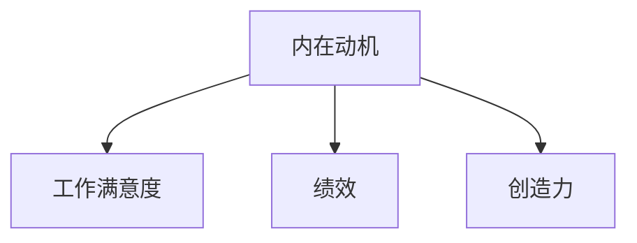

                 

# 领导力与职场心理学：深入理解团队行为

## 关键词

- 领导力
- 职场心理学
- 团队行为
- 领导风格
- 心理学效应

## 摘要

本文将深入探讨领导力与职场心理学在团队行为中的作用。首先，我们将定义并解释职场心理学和领导力的核心概念，并探讨团队动力的本质。接着，我们将分析领导力的基础理论，包括特质理论、行为理论和权变理论，并结合职场心理学原理，如人格心理学和动机心理学。通过团队行为的分析，我们将了解团队建设、团队沟通的障碍与技巧，以及领导力与团队行为的互动。最后，我们将讨论领导力与职场心理学的实际应用，并提供个人发展、团队建设和领导力提升的最佳实践。通过本文的探讨，读者将能够更好地理解领导力与职场心理学在提升团队效率和绩效中的关键作用。

### 目录大纲

----------------------------------------------------------------

## 第1章：引言

### 1.1 问题背景

#### 1.1.1 职场心理学的定义与重要性

- 定义：职场心理学是研究职场中人的行为、心理状态及其相互关系的学科。
- 重要性：理解职场心理学有助于提高个人工作效率、增强团队协作能力以及促进组织发展。

#### 1.1.2 职场心理问题的现状

- 现状：职场压力、工作与生活的平衡、职业倦怠等问题普遍存在，对个人和团队产生负面影响。

#### 1.1.3 领导力在解决职场心理问题中的作用

- 作用：领导者通过有效的领导力可以缓解职场压力，提升员工满意度和绩效。

### 1.2 核心概念

#### 1.2.1 领导力

- 定义：领导力是指引导和影响他人实现共同目标的能力。
- 属性：领导力包括技术技能、人际技能和概念技能。

#### 1.2.2 职场心理学

- 定义：职场心理学是研究职场中人的行为、心理状态及其相互关系的学科。
- 内容：包括人格心理学、动机心理学、群体心理学等。

### 1.3 团队行为

#### 1.3.1 团队动力的定义与特点

- 定义：团队动力是指团队内部成员之间的相互作用和相互影响。
- 特点：包括协同合作、竞争、冲突、归属感等。

#### 1.3.2 团队行为对组织绩效的影响

- 影响：团队行为对组织目标的实现、工作效率、创新能力等方面具有重要影响。

### 1.4 边界与外延

#### 1.4.1 职场情境中的领导力与团队行为

- 场景：不同类型的工作环境、不同层次的领导角色。
- 外延：领导力与团队行为在组织、行业、文化背景下的差异性。

----------------------------------------------------------------

## 第1章：引言

### 1.1 问题背景

#### 1.1.1 职场心理学的定义与重要性

职场心理学是研究职场中人的行为、心理状态及其相互关系的学科。它关注个体在工作环境中的行为表现、心理需求和心理问题。理解职场心理学对于提高个人工作效率、增强团队协作能力以及促进组织发展具有重要意义。通过研究职场心理学，我们可以更好地了解员工的心理状态和行为特征，从而制定有效的管理策略和人力资源政策。

在现代社会中，职场心理问题日益突出。例如，职场压力、工作与生活的平衡、职业倦怠等问题普遍存在，对个人和团队产生负面影响。职场心理学提供了分析这些问题的理论框架和方法，帮助我们更好地理解和应对这些挑战。

#### 1.1.2 职场心理问题的现状

职场心理问题的现状表现在多个方面。首先，职场压力是普遍存在的。现代工作环境竞争激烈，员工面临着来自工作、晋升、绩效等方面的压力。这种压力可能导致焦虑、抑郁等心理问题，影响员工的工作表现和生活质量。

其次，工作与生活的平衡问题也是一个重要的职场心理问题。在快节奏的现代社会中，很多人面临着工作与家庭、个人生活的冲突。长时间的工作可能导致身心疲惫，影响家庭关系和个人幸福感。

此外，职业倦怠也是一个突出的职场心理问题。长时间处于高压力、高负荷的工作环境中，员工可能会感到身心疲惫，对工作失去兴趣和动力，影响工作质量和绩效。

#### 1.1.3 领导力在解决职场心理问题中的作用

领导力在解决职场心理问题中发挥着重要作用。首先，领导者可以通过有效的领导力缓解职场压力。领导者可以创造一个积极、支持性的工作环境，关注员工的心理需求，提供心理支持和辅导。

其次，领导力可以帮助员工实现工作与生活的平衡。领导者可以鼓励员工合理安排工作时间，提供灵活的工作制度，帮助员工更好地管理工作和个人生活。

此外，领导力还可以预防和缓解职业倦怠。领导者可以通过激励和认可，激发员工的内在动力，帮助员工找到工作的意义和成就感，从而减少职业倦怠的发生。

总之，领导力在解决职场心理问题中发挥着关键作用。通过理解职场心理学，领导者可以更好地应对职场心理挑战，提升员工的满意度和绩效，促进组织的可持续发展。

### 1.2 核心概念

#### 1.2.1 领导力

领导力是指引导和影响他人实现共同目标的能力。它不仅仅是一种技术技能，更是一种人际技能和概念技能。领导力不仅关注任务的完成，更注重团队的协作和员工的成长。

**属性：**

1. **技术技能**：包括沟通能力、决策能力、团队建设等。
2. **人际技能**：包括激励员工、冲突管理、团队合作等。
3. **概念技能**：包括战略思考、组织变革、文化塑造等。

**类型：**

1. **任务导向型领导**：侧重于任务完成，关注效率和目标。
2. **关系导向型领导**：侧重于人际关系，关注员工的满意度和幸福感。
3. **变革型领导**：通过激发员工的潜力和创造力，推动组织的创新和变革。

#### 1.2.2 职场心理学

职场心理学是研究职场中人的行为、心理状态及其相互关系的学科。它涵盖了多个子领域，如人格心理学、动机心理学、组织心理学等。

**定义：**

职场心理学是应用心理学的一种，旨在理解员工的行为和心理需求，以提高工作效率、提升员工满意度和促进组织发展。

**内容：**

1. **人格心理学**：研究个体在职场中的行为特征和心理需求。
2. **动机心理学**：研究个体在工作中的内在驱动力和动机来源。
3. **组织心理学**：研究组织内部的人际关系、团队行为和组织文化。

#### 1.2.3 团队行为

团队行为是指团队成员在共同完成任务过程中所表现出的相互作用和相互影响。团队行为对团队绩效和组织发展具有重大影响。

**定义：**

团队行为是团队成员在相互合作、沟通和协调中表现出的行为模式。

**特点：**

1. **协同合作**：团队成员相互支持，共同努力实现共同目标。
2. **竞争**：团队成员之间可能存在竞争关系，推动个人和团队进步。
3. **冲突**：团队成员之间可能存在意见分歧，需要通过沟通和协商解决。
4. **归属感**：团队成员对团队有强烈的认同感和归属感。

#### 1.2.4 领导力与职场心理学的交叉

领导力与职场心理学密切相关。有效的领导力需要理解职场心理学原理，如动机、人格、群体行为等。同样，职场心理学研究的结果可以为领导力提供理论基础和实践指导。

**交叉领域：**

1. **激励理论**：结合领导力和动机心理学，研究如何激发员工的内在动力。
2. **团队建设**：结合领导力和群体心理学，研究如何建立高效团队。
3. **冲突管理**：结合领导力和人际关系心理学，研究如何解决团队冲突。

通过理解领导力和职场心理学的核心概念，我们可以更好地应对职场中的各种挑战，提升个人和团队的表现。

### 1.3 团队行为

#### 1.3.1 团队动力的定义与特点

团队动力是指团队内部成员之间的相互作用和相互影响，它决定了团队的凝聚力和工作效率。团队动力不仅仅是团队成员的个人特质和技能，还包括团队内部的沟通、信任和共同目标。

**定义：**

团队动力是团队内部成员之间相互作用的动态过程，它涉及到沟通、信任、合作和共同目标的实现。

**特点：**

1. **协同合作**：团队成员相互依赖，共同努力实现团队目标。
2. **竞争与激励**：团队成员之间可能存在竞争，但竞争有助于激发个人和团队的潜力。
3. **冲突与协商**：团队成员之间可能存在意见分歧，但通过有效的沟通和协商可以解决冲突。
4. **归属感**：团队成员对团队有强烈的认同感和归属感，愿意为团队的成功付出努力。

#### 1.3.2 团队行为对组织绩效的影响

团队行为对组织绩效具有显著影响。一个高效的团队可以显著提升组织的工作效率、创新能力和员工满意度。

**影响：**

1. **工作效率**：团队协作可以优化工作流程，减少重复劳动，提高工作效率。
2. **创新能力**：团队成员之间的互动和交流可以激发创新思维，推动组织创新发展。
3. **员工满意度**：一个充满活力和信任的团队可以提高员工的归属感和工作满意度，减少员工流失。
4. **组织文化**：团队行为反映了组织文化和价值观，对组织文化的塑造具有重要作用。

#### 1.3.3 团队行为分析的方法

为了更好地理解和分析团队行为，我们可以采用以下几种方法：

1. **问卷调查**：通过设计问卷，收集团队成员的心理需求、工作态度和行为特征，从而了解团队的整体状态。
2. **访谈**：与团队成员进行深度访谈，了解他们的内心感受、工作体验和团队互动情况。
3. **观察**：在自然工作环境中观察团队成员的行为，分析团队协作和沟通的方式。
4. **行为事件访谈（BEI）**：通过回顾和分析团队成员在特定工作事件中的行为，了解他们在面对挑战时的表现和团队互动。

通过这些方法，我们可以全面了解团队行为，发现团队中的优势和问题，从而制定针对性的改进措施。

### 1.4 边界与外延

#### 1.4.1 职场情境中的领导力与团队行为

领导力与团队行为在不同职场情境中表现出不同的特点和影响。以下是一些典型的职场情境及其特点：

1. **初创公司**：在初创公司中，领导力需要具备创业精神、创新能力和市场敏感性。团队行为通常以快速响应变化、灵活调整策略为特点。
2. **大型企业**：在大型企业中，领导力需要具备战略规划、组织管理和跨部门协调能力。团队行为通常注重流程优化、规范化和团队协作。
3. **跨国公司**：在跨国公司中，领导力需要具备跨文化管理能力、全球视野和国际沟通能力。团队行为需要适应多元文化和国际化工作环境。
4. **项目团队**：在项目团队中，领导力需要具备项目管理、资源协调和问题解决能力。团队行为注重项目目标的实现、任务分配和进度控制。

#### 1.4.2 领导力与团队行为在组织、行业、文化背景下的差异性

领导力与团队行为在不同组织、行业和文化背景下也表现出差异性：

1. **组织背景**：不同类型的组织（如国有企业、民营企业、跨国公司）对领导力和团队行为的要求不同。例如，国有企业可能更注重政治敏感性和稳定性，而跨国公司则更注重国际化视野和创新能力。
2. **行业背景**：不同行业（如IT、金融、医疗）对领导力和团队行为的要求也有所不同。例如，IT行业更注重创新和快速变化，而金融行业则更注重风险控制和合规性。
3. **文化背景**：不同文化背景下，领导力和团队行为的理念和实践方式也有所差异。例如，在一些强调集体主义和等级文化的国家，领导力可能更注重权威和服从，而在一些强调个人主义和自由表达的国家，领导力可能更注重民主和参与。

理解这些差异有助于领导者更好地适应不同职场情境，制定适合组织发展和团队建设的管理策略。

### 第2章：领导力的基础理论

#### 2.1 领导风格理论

领导风格理论是领导力研究的一个重要领域，旨在探索不同领导风格对团队行为和绩效的影响。领导风格理论主要包括特质理论、行为理论和权变理论。

##### 2.1.1 特质理论

特质理论认为领导力是由个人特质决定的。这些特质包括自信、决断力、沟通能力等。特质理论的主要观点是，某些人天生具有领导潜力，而另一些人则不具备。特质理论的研究成果主要包括以下方面：

1. **个性特质**：研究表明，领导者的个性特质如自信、决断力和沟通能力对领导力有重要影响。
2. **能力特质**：领导者需要具备一定的能力特质，如战略思考、决策能力和执行能力。
3. **情感特质**：领导者需要具备积极的情感特质，如乐观、抗压能力等。

然而，特质理论也存在一些局限性。首先，它忽视了情境因素对领导力的影响。其次，特质理论难以解释为什么有些领导者在不同情境下表现不同。因此，特质理论在解释领导力时存在一定的局限性。

##### 2.1.2 行为理论

行为理论认为领导力是可以通过行为学训练获得的。行为理论关注领导者的具体行为，如沟通、决策、激励等，而不是领导者的个人特质。行为理论的主要观点包括：

1. **领导行为**：领导者通过特定的行为来影响团队，如提供反馈、设定目标、激励员工等。
2. **领导行为分类**：行为理论将领导行为分为任务导向型和关系导向型。任务导向型领导注重任务的完成和目标的实现，而关系导向型领导注重员工的需求和情感。
3. **领导行为效果**：研究表明，不同的领导行为对团队绩效和员工满意度有不同的影响。例如，任务导向型领导可以提高团队的工作效率，而关系导向型领导可以提高员工的满意度和忠诚度。

行为理论的优点在于它强调了领导行为的可训练性，为领导者提供了具体的改进方向。然而，行为理论也面临一些挑战，如难以全面解释领导力的复杂性和多样性。

##### 2.1.3 权变理论

权变理论认为领导力应根据具体情况灵活调整。权变理论认为没有一种固定的领导风格能够适用于所有情境，领导者需要根据团队特点、任务性质和环境因素来选择合适的领导风格。权变理论的主要观点包括：

1. **情境因素**：领导力的有效性取决于情境因素，如团队的成熟度、任务的复杂性和环境的稳定性。
2. **领导风格选择**：领导者需要根据不同情境选择合适的领导风格。例如，在团队成熟度低、任务复杂度高的情境下，领导者可能需要采用参与式领导风格，而在团队成熟度高、任务复杂度低的情境下，领导者可能需要采用任务导向型领导风格。
3. **领导风格转换**：领导者需要具备灵活调整领导风格的能力，以适应不断变化的环境和情境。

权变理论的优点在于它为领导者提供了灵活应对不同情境的指导，有助于提高领导力的适应性和有效性。然而，权变理论也面临一些挑战，如情境因素的复杂性和主观性，使得领导风格的选择和调整变得困难。

综上所述，领导风格理论从不同角度探讨了领导力的本质和影响因素。特质理论关注领导者的个人特质，行为理论关注领导者的具体行为，而权变理论关注领导力与情境的互动。理解这些理论有助于领导者更好地认识自己的领导风格，提升领导力水平。

#### 2.1.4 领导风格理论的应用

领导风格理论在组织管理实践中具有广泛的应用。以下是一些具体的案例和应用场景：

1. **团队建设**：领导风格理论可以帮助领导者了解不同团队的需求，选择合适的领导风格来促进团队建设。例如，在初创公司中，领导者可能需要采用参与式领导风格，激发团队成员的创新精神和合作意识；而在大型企业中，领导者可能需要采用任务导向型领导风格，确保团队高效完成任务。

2. **员工激励**：领导风格理论可以帮助领导者了解员工的动机和需求，采用有效的激励策略。例如，对于追求成就感的员工，领导者可以采用目标导向型领导风格，设定明确的任务目标和奖励机制；对于注重人际关系和沟通的员工，领导者可以采用关系导向型领导风格，关注员工的情感需求和工作体验。

3. **组织变革**：领导风格理论可以帮助领导者推动组织变革，选择合适的领导风格来应对变革的挑战。例如，在组织变革初期，领导者可能需要采用变革导向型领导风格，积极沟通变革目标、意义和期望，激发员工的变革意识和参与度；在变革过程中，领导者可能需要采用参与式领导风格，鼓励员工提出建议和反馈，共同推进变革。

4. **跨文化管理**：领导风格理论可以帮助领导者理解和适应不同文化背景下的领导行为。例如，在跨国公司中，领导者需要具备跨文化管理能力，了解不同文化背景下员工的价值观和行为习惯，选择合适的领导风格来促进团队协作和沟通。

通过应用领导风格理论，领导者可以更好地应对组织管理和领导过程中的各种挑战，提升团队绩效和员工满意度，实现组织的可持续发展。

#### 2.1.5 特质理论、行为理论与权变理论的对比

特质理论、行为理论和权变理论是领导力研究中的三大主要理论，它们分别从不同角度探讨了领导力的本质和影响因素。以下是对这三种理论的对比分析：

1. **研究视角**：
   - 特质理论从领导者的个人特质和性格特点出发，认为领导力是与生俱来的特质。
   - 行为理论关注领导者的具体行为和领导方式，认为领导力是通过学习和实践获得的。
   - 权变理论将领导力置于特定情境中，强调领导力应根据情境变化灵活调整。

2. **核心观点**：
   - 特质理论认为某些人天生具有领导潜力，这些特质包括自信、决断力、沟通能力等。
   - 行为理论认为领导者的行为对团队和绩效有直接影响，不同的领导行为会导致不同的团队表现。
   - 权变理论认为领导力没有统一的模式，领导者应根据具体情境选择最合适的领导风格。

3. **优缺点**：
   - 特质理论的优点在于简单直观，便于理解和传播，缺点在于忽视了情境因素，无法解释为什么同一特质在不同情境下表现不同。
   - 行为理论的优点在于强调领导行为的可学习性和可塑性，缺点在于忽视了领导者的个性特质和情境因素。
   - 权变理论的优点在于强调情境因素，提供灵活的领导风格选择，缺点在于情境因素复杂，具体操作难度较大。

4. **实际应用**：
   - 特质理论适用于领导者自我认知和选拔，帮助领导者了解自己的优势和劣势，提高领导力水平。
   - 行为理论适用于领导者的培训和实践，通过学习不同领导行为，提高领导效果。
   - 权变理论适用于领导者应对复杂多变的工作环境，根据不同情境灵活调整领导风格，提高领导适应性。

通过对特质理论、行为理论和权变理论的对比分析，领导者可以更全面地理解领导力，结合实际情况选择合适的理论和方法，提高领导力水平。

### 第3章：职场心理学原理

#### 3.1 心理学基础

职场心理学的基础理论主要包括人格心理学和动机心理学。这些理论为我们理解职场行为提供了深刻的理论框架。

##### 3.1.1 人格心理学

人格心理学研究个体心理特征的构成，包括性格、价值观、情绪等。在职场中，人格特征对个体的行为模式、人际关系和工作表现有重要影响。

**定义：**
人格心理学是研究个体在行为、思维和情感上的稳定特征的学科。

**要素：**
1. **外向性**：外向性人格倾向于寻求社交活动，表现出开朗、活跃和热情的特点。
2. **神经质**：神经质人格表现出情绪不稳定、焦虑和易怒的特点。
3. **宜人性**：宜人性人格倾向于友好、合作和善良，具有良好的人际关系。
4. **责任心**：责任心人格表现出责任感、可靠性和自律的特点。
5. **开放性**：开放性人格倾向于接受新观念、冒险和创意。

**特征对比表格：**

| 特质         | 特点                                                     |
| ------------ | -------------------------------------------------------- |
| 外向性       | 开朗、活跃、热情、社交性高                             |
| 神经质       | 情绪不稳定、焦虑、易怒                                 |
| 宜人性       | 友好、合作、善良、人际关系良好                         |
| 责任性       | 责任感强、可靠、自律                                   |
| 开放性       | 接受新观念、冒险、创意                                 |

**ER实体关系图架构：**

```mermaid
erDiagram
  Person ||--|{ PersonalityTrait }|--| Person
  Person ||--|{ EmotionalTrait }|--| Person
  PersonalityTrait ||--|{ Extraversion }|--| PersonalityTrait
  PersonalityTrait ||--|{ Neuroticism }|--| PersonalityTrait
  PersonalityTrait ||--|{ Agreeableness }|--| PersonalityTrait
  PersonalityTrait ||--|{ Conscientiousness }|--| PersonalityTrait
  PersonalityTrait ||--|{ Openness }|--| PersonalityTrait
  EmotionalTrait ||--|{ Anxiety }|--| EmotionalTrait
  EmotionalTrait ||--|{ Anger }|--| EmotionalTrait
```

##### 3.1.2 动机心理学

动机心理学研究个体行为的内在驱动力，探讨为什么人们会做出特定行为以及这些行为背后的动机。

**定义：**
动机心理学是研究个体行为内在驱动力和动机来源的学科。

**类型：**
1. **内在动机**：内在动机是指个体因内在兴趣、成就感或自我实现而驱动的行为。
2. **外在动机**：外在动机是指个体因外部奖励、惩罚或社会期望而驱动的行为。

**影响：**
1. **工作满意度**：内在动机与工作满意度呈正相关，个体因内在兴趣和成就感而感到满足。
2. **绩效**：内在动机与工作绩效呈正相关，个体因内在兴趣而投入更多努力。
3. **创造力**：内在动机与创造力呈正相关，个体因内在兴趣和自我实现而更有创意。

**图示：**



通过理解人格心理学和动机心理学，我们可以更好地理解职场行为背后的心理机制，从而制定更有效的管理策略，提高员工满意度和绩效。

#### 3.2 职场心理效应

在职场环境中，多种心理效应影响着员工的行为和团队的表现。以下是几个重要的职场心理效应及其对领导力和团队行为的影响。

##### 3.2.1 期望效应

期望效应是指个体对他人行为产生预期，并影响其实际行为的现象。期望效应可分为自我实现的预言和皮格马利翁效应。

**定义：**
期望效应是领导者或同事对员工的行为产生预期，并通过对员工的态度和行为的影响，使得预期成为现实的效应。

**表现：**
1. **自我实现的预言**：当领导者对员工有积极的预期时，员工可能会通过自己的行为来满足这些预期，最终实现领导者的期望。
2. **皮格马利翁效应**：类似于自我实现的预言，这种效应强调领导者或权威人物对员工的积极期待可以激发员工的潜力，提升绩效。

**影响：**
1. **团队动力**：积极的期望效应可以提高团队动力，激发员工的潜力和积极性。
2. **领导风格**：领导者可以通过积极的期望效应来影响团队成员的行为，推动团队目标的实现。
3. **员工满意度**：积极的期望效应可以提高员工的满意度和工作热情，减少员工流失。

##### 3.2.2 群体动力学

群体动力学研究群体成员之间的相互作用和相互影响，包括认同感、凝聚力、群体压力等。

**定义：**
群体动力学是研究群体内部成员之间的相互作用、互动过程以及这些互动如何影响群体行为和个体行为的学科。

**特点：**
1. **认同感**：群体成员对群体价值观和目标的认同，有助于形成团队凝聚力和归属感。
2. **凝聚力**：群体成员之间的紧密联系和相互支持，是团队高效协作的基础。
3. **群体压力**：群体成员可能会受到群体规范和期望的影响，从而调整自己的行为。

**影响：**
1. **团队协作**：群体动力学有助于建立积极的团队协作氛围，提高团队整体绩效。
2. **领导决策**：领导者需要了解群体动力学的原理，以便更好地制定决策和引导团队。
3. **员工行为**：群体动力学影响员工的工作态度和行为，如群体中的榜样效应和从众行为。

##### 3.2.3 群体心理效应的其他例子

除了期望效应和群体动力学，以下是一些其他的职场心理效应：

1. **赫洛克效应**：即奖励和惩罚对个体行为的长期影响。奖励可以提高个体积极性，而惩罚可能会降低个体动机。
2. **赫尔曼效应**：即个体在群体中的行为受到群体成员行为的影响，如从众行为和模仿行为。
3. **暗示效应**：领导者或同事的暗示可能影响员工的行为和态度，如积极的暗示可以提升员工的工作效率。

通过理解这些职场心理效应，领导者可以更好地应对团队中的挑战，提升团队绩效和员工满意度。

### 第4章：团队行为分析

#### 4.1 团队建设

团队建设是指通过一系列策略和活动来增强团队成员之间的协作能力、沟通效率和团队凝聚力。成功的团队建设可以提升团队绩效、促进创新和减少冲突。

##### 4.1.1 团队发展阶段

团队建设的过程可以分为几个阶段，每个阶段都有其独特的特点和目标。

1. **形成期**：团队成员刚刚组建，彼此不熟悉，主要任务是建立基本关系和明确团队目标。
2. **激荡期**：团队成员开始展现个人特点，团队内部可能出现冲突和分歧，需要通过有效的沟通和冲突管理来协调。
3. **规范期**：团队开始形成共同的行为规范和价值观，团队成员之间的信任和合作逐渐增强。
4. **执行期**：团队进入高效运作阶段，成员之间默契合作，共同实现团队目标。
5. **休整期**：团队完成一项重要任务后，可能需要休整和反思，为下一阶段的工作做好准备。

##### 4.1.2 团队角色

在团队中，每个成员都扮演着特定的角色，这些角色有助于团队的有效运作。以下是几种常见的团队角色：

1. **领导者**：负责制定团队目标、规划任务分配和提供指导。
2. **执行者**：负责具体任务的执行，确保工作按时完成。
3. **协调者**：负责协调团队成员之间的工作，解决冲突和问题。
4. **资源提供者**：负责提供团队所需的资源和支持。
5. **沟通者**：负责团队内部和外部的沟通，确保信息的畅通。

每个角色都承担着重要的职责，共同推动团队的发展。

#### 4.2 团队沟通

团队沟通是团队运作的核心，有效的沟通可以增强团队成员之间的协作、提高工作效率和减少误解。然而，团队沟通中常常存在各种障碍，如语义障碍、心理障碍和组织障碍。

##### 4.2.1 沟通障碍

沟通障碍是指信息传递过程中的阻碍，可以分为以下几种类型：

1. **语义障碍**：由于语言和表达方式的差异，信息在传递过程中可能被误解或失真。
2. **心理障碍**：团队成员的心理状态，如焦虑、压力和抵触情绪，会影响沟通的效果。
3. **组织障碍**：组织结构、文化和政策等外部因素也可能影响沟通的顺畅。

为了克服沟通障碍，团队需要采取以下措施：

- **明确沟通目标**：在沟通前明确要传达的信息和目标，确保信息传递的准确性和针对性。
- **倾听**：倾听是有效沟通的关键，团队成员需要学会倾听对方的意见和观点。
- **反馈**：及时给予反馈，确保信息接收者理解并确认接收到的信息。
- **透明沟通**：建立透明、开放和包容的沟通环境，鼓励团队成员表达自己的观点和疑问。

##### 4.2.2 沟通技巧

有效的沟通技巧可以帮助团队成员更好地传递和接收信息，提高沟通效果。以下是几种常见的沟通技巧：

1. **倾听**：倾听是有效沟通的基础，团队成员需要学会倾听对方的意见和观点，避免打断或中途插话。
2. **反馈**：及时给予反馈，确保信息接收者理解并确认接收到的信息。反馈可以是积极的，也可以是建设性的，但应避免负面攻击。
3. **非语言沟通**：非语言沟通，如肢体语言、面部表情和语调，也可以传达重要的信息。团队成员需要注意自己的非语言沟通，以增强信息传递的效果。
4. **表达清晰**：表达清晰、简洁明了，避免使用复杂的术语和模糊的表述，确保信息容易被理解和接收。
5. **适应听众**：根据不同的听众和情境，调整沟通的方式和内容，确保信息能够被有效传达。

通过掌握这些沟通技巧，团队成员可以更好地协作，提高团队的工作效率和绩效。

#### 4.3 团队协作案例分析

为了更好地理解团队行为分析的实际应用，以下是一个团队协作案例的分析。

**案例背景：** 
一家科技公司的新产品开发团队在开发一款移动应用时遇到了沟通不畅的问题，导致项目进度延迟和团队成员之间的矛盾。

**分析过程：**
1. **识别问题**：通过问卷调查和访谈，发现团队沟通障碍主要表现为语义障碍和心理障碍。团队成员在项目初期对任务理解不一致，导致工作重复和资源浪费。此外，团队成员在遇到问题时，缺乏有效的沟通和解决方案，导致心理压力增加。
2. **解决方案**：为了解决沟通问题，团队采取以下措施：
   - 明确任务分配和责任，确保每个团队成员对任务目标有清晰的理解。
   - 定期召开团队会议，讨论项目进度和问题，鼓励团队成员表达意见和建议。
   - 建立透明的沟通渠道，如即时通讯工具和项目管理软件，方便团队成员随时交流和分享信息。
   - 提供心理辅导和培训，帮助团队成员缓解压力，提高沟通和协作能力。
3. **实施效果**：通过采取上述措施，团队沟通效果显著改善。团队成员之间的理解更加一致，工作重复和资源浪费减少。同时，团队成员在遇到问题时能够及时沟通和解决，心理压力得到缓解。项目最终按时完成，并获得了用户好评。

**案例分析总结：**
通过该案例的分析，我们可以看到团队沟通不畅对项目进度和团队士气的影响。有效的团队行为分析可以帮助团队识别问题并采取针对性的措施，提高团队协作效率和工作质量。同时，团队建设和管理的重要性也得到了体现，领导者需要关注团队成员的需求，提供必要的支持和资源，促进团队的长远发展。

### 第5章：领导力与团队行为的互动

#### 5.1 领导力对团队行为的影响

领导力在团队行为中起着至关重要的作用，有效的领导力可以激励团队成员、提高团队绩效并促进团队发展。以下是领导力对团队行为的具体影响：

**5.1.1 领导风格与团队动力**

领导风格直接影响团队动力的形成和发展。不同的领导风格会导致不同的团队动力表现。

1. **任务导向型领导**：任务导向型领导注重任务的完成和目标的实现，通过明确的任务分配和严格的监督来推动团队工作。这种领导风格可以提高团队的效率和生产力，但在长期可能会降低团队成员的满意度和创新能力。
2. **关系导向型领导**：关系导向型领导注重团队成员之间的关系和情感需求，通过建立信任和支持来促进团队合作。这种领导风格可以提高团队成员的满意度和归属感，增强团队的凝聚力和创新能力。
3. **变革导向型领导**：变革导向型领导注重推动组织的变革和创新，通过激励团队成员追求卓越和挑战现状来推动团队发展。这种领导风格可以激发团队的创造力和创新精神，提高团队的整体绩效。

**5.1.2 领导行为与团队绩效**

领导行为对团队绩效有着直接的影响。有效的领导行为可以提高团队的绩效和工作效率。

1. **激励行为**：领导者通过激励行为来激发团队成员的积极性和动力。例如，领导者可以设定明确的目标、提供奖励和认可，以及关注团队成员的成长和发展。
2. **沟通行为**：领导者通过有效的沟通行为来确保信息的畅通和团队的协同工作。例如，领导者可以定期召开会议、进行一对一沟通，以及建立开放的沟通渠道，鼓励团队成员分享意见和建议。
3. **辅导行为**：领导者通过辅导行为来帮助团队成员解决问题和提升能力。例如，领导者可以提供专业的指导和反馈、进行技能培训，以及帮助团队成员建立有效的工作习惯。

**5.1.3 领导力对团队发展的推动作用**

领导力不仅影响团队的短期绩效，还对团队的长远发展有着重要的推动作用。

1. **愿景塑造**：领导者通过塑造清晰的愿景和目标，引导团队朝着共同的目标努力。有效的愿景可以激发团队成员的激情和动力，推动团队持续发展。
2. **团队建设**：领导者通过团队建设活动来增强团队成员之间的信任和合作。例如，领导者可以组织团队建设活动、进行团队培训，以及推动团队成员之间的交流和互动。
3. **文化塑造**：领导者通过塑造积极的企业文化来促进团队的长期发展。例如，领导者可以倡导诚信、尊重和团队合作的企业价值观，建立开放、包容和创新的团队氛围。

总之，领导力对团队行为和绩效有着重要的影响。通过选择合适的领导风格、实施有效的领导行为，并推动团队的发展，领导者可以激发团队成员的潜力，提高团队的绩效和创新能力，推动组织的持续成功。

#### 5.2 团队行为对领导力的反馈

团队行为对领导力的反馈是领导力发展的重要环节。有效的团队反馈机制不仅可以帮助领导者了解自己的领导风格和行为对团队的影响，还可以促进领导力的改进和团队关系的优化。

**5.2.1 团队反馈机制的定义与作用**

团队反馈机制是指团队成员对领导者的行为和工作表现提供反馈的机制。这种机制可以通过定期的团队会议、一对一交流、匿名问卷等形式进行。团队反馈机制的作用包括：

1. **了解领导力效果**：通过团队反馈，领导者可以了解自己的领导风格和行为在团队中的实际效果，发现存在的问题和不足。
2. **改进领导力**：团队反馈为领导者提供了改进的方向和建议，帮助领导者调整领导策略，提高领导力水平。
3. **促进团队关系**：团队反馈机制有助于建立开放、透明和信任的团队氛围，增强团队成员之间的沟通和协作。

**5.2.2 反馈对领导力发展的影响**

团队反馈对领导力的发展有着深远的影响。以下是具体的影响方面：

1. **自我认知**：通过团队反馈，领导者可以更客观地认识自己的优点和不足，了解自己在团队中的角色和影响力。
2. **学习与成长**：领导者可以根据团队反馈进行学习和反思，不断提升自己的知识和技能，增强领导力。
3. **决策优化**：团队反馈可以帮助领导者更好地理解团队成员的需求和期望，从而做出更合理和有效的决策。
4. **关系改善**：团队反馈有助于领导者与团队成员之间建立更紧密的关系，增强团队的凝聚力和合作精神。

**5.2.3 团队反馈的实施方法**

为了确保团队反馈的有效性，领导者可以采取以下实施方法：

1. **定期反馈**：领导者应定期与团队成员进行一对一的沟通，了解他们的意见和建议。
2. **匿名反馈**：为了鼓励团队成员坦诚反馈，可以设置匿名反馈渠道，确保团队成员的隐私和安全感。
3. **开放式对话**：领导者应鼓励团队成员积极参与反馈，建立开放、包容的对话氛围，避免批评和指责。
4. **反馈跟进**：领导者应将反馈意见进行记录和总结，制定改进计划并跟踪执行情况。

通过实施有效的团队反馈机制，领导者可以不断改进自己的领导力，提高团队绩效和员工满意度，促进组织的可持续发展。

### 第6章：领导力与职场心理学的应用

#### 6.1 个人发展

个人发展是每个职场人士追求的目标，通过有效的领导力和职场心理学原理，我们可以更好地理解自己，提升自我认知，实现职业成长。

**6.1.1 自我认知的重要性**

自我认知是指个体对自己性格、能力、价值观和需求的了解。有效的自我认知有助于个人发展，提升工作效率和职业满意度。

1. **优势识别**：通过自我认知，个体可以识别自己的优势和特长，从而在职业选择和发展中发挥自身优势。
2. **能力提升**：自我认知可以帮助个体明确自己的能力和知识缺口，有针对性地进行学习和提升。
3. **职业规划**：自我认知有助于个体制定明确的职业目标和发展路径，实现职业的长期发展。

**6.1.2 自我认知的方法**

为了提高自我认知，我们可以采取以下几种方法：

1. **反思日记**：每天花时间反思自己的行为、想法和感受，记录自己的成长和变化。
2. **反馈收集**：主动寻求同事、上司和下属的反馈，了解他人对我们的看法和建议。
3. **心理测试**：参加各种心理测试，如MBTI、DISC等，了解自己的性格特点和优势。

**6.1.3 成长与领导力的关系**

个人成长与领导力密切相关。一个成熟的领导者不仅具备专业知识和技能，还具备自我认知和自我管理能力。

1. **自我管理**：领导者需要具备良好的自我管理能力，包括时间管理、情绪管理和行为管理。
2. **自我提升**：领导者应不断学习和成长，提升自己的专业能力和领导力水平。
3. **影响力**：一个成熟、自信的领导者能够影响和激励团队成员，推动团队的发展和进步。

通过自我认知和个人成长，我们可以更好地发挥自己的潜力，实现职业目标，同时为团队和组织的发展做出贡献。

#### 6.2 团队建设

团队建设是领导者的重要职责，通过有效的团队建设策略，可以提高团队的凝聚力和工作效率，促进团队目标的实现。

**6.2.1 团队建设的目标**

团队建设的核心目标是建立高效的团队，使团队成员能够相互支持、协作无间，共同实现团队目标。

1. **增强团队凝聚力**：通过建立共同的目标和价值观，增强团队成员之间的信任和归属感。
2. **提高工作效率**：通过优化工作流程和资源配置，提高团队的工作效率和生产力。
3. **促进创新与合作**：鼓励团队成员发挥创意，共同解决问题，实现创新和突破。

**6.2.2 团队建设的方法**

为了实现团队建设的目标，领导者可以采取以下方法：

1. **团队活动**：组织定期的团队活动，如团队建设训练、团队拓展活动等，增强团队成员之间的互动和了解。
2. **共同目标**：明确团队的目标和愿景，确保每个成员都了解自己的角色和责任，共同为团队的成功努力。
3. **激励与认可**：通过激励和认可机制，鼓励团队成员的积极行为和贡献，提升团队士气。
4. **沟通与反馈**：建立开放的沟通渠道，鼓励团队成员表达意见和建议，及时反馈和解决问题。

**6.2.3 团队建设的挑战与解决方案**

在团队建设过程中，领导者可能会面临以下挑战：

1. **文化差异**：团队成员来自不同的背景和文化，可能存在沟通障碍和价值观差异。
   - **解决方案**：领导者应建立多元文化团队的理念，促进文化融合，尊重和包容团队成员的差异。
2. **任务分配**：团队成员的任务分配可能不均衡，导致部分成员工作负担过重，部分成员缺乏挑战。
   - **解决方案**：领导者应合理分配任务，确保每个成员都有适当的挑战和责任，避免工作失衡。

通过有效的团队建设策略，领导者可以建立高效、和谐的团队，提升团队的整体绩效和创新能力，实现组织的长期发展。

#### 6.3 领导力提升

领导力提升是每个领导者的重要任务，通过不断学习和实践，领导者可以提升自己的领导能力，更好地应对职场挑战。

**6.3.1 领导力提升的重要性**

有效的领导力对组织的成功至关重要。提升领导力可以帮助领导者：

1. **提高团队绩效**：通过有效的领导，提升团队的工作效率、创新能力和员工满意度。
2. **促进组织发展**：领导者具备战略思考和创新能力，能够推动组织的持续发展。
3. **建立良好的人际关系**：通过提升领导力，领导者可以建立积极、健康的人际关系，提升团队凝聚力和合作精神。

**6.3.2 领导力提升的方法**

为了提升领导力，领导者可以采取以下方法：

1. **自我反思**：定期进行自我反思，了解自己的领导风格、优势和不足，制定改进计划。
2. **学习与培训**：参加领导力培训课程，学习领导理论、技能和最佳实践，提升自己的专业素养。
3. **实践与经验**：通过实际工作经历，积累领导经验，不断调整和优化领导方式。
4. **求助与导师**：寻找导师或教练，寻求他们的指导和反馈，提升领导力水平。
5. **建立反馈机制**：建立有效的团队反馈机制，了解团队成员对领导者的看法和建议，持续改进自己的领导能力。

**6.3.3 领导力提升的最佳实践**

以下是一些领导力提升的最佳实践：

1. **明确目标**：设定清晰的团队目标和愿景，确保团队成员了解自己的角色和责任。
2. **激励与认可**：通过激励和认可，鼓励团队成员的积极行为和贡献，提升团队士气。
3. **沟通与倾听**：建立开放的沟通渠道，倾听团队成员的意见和建议，促进团队的协作和发展。
4. **培养团队文化**：建立积极、健康、包容的团队文化，鼓励创新和合作，提升团队的凝聚力。
5. **持续学习**：保持学习和成长的态度，不断提升自己的知识和技能，适应不断变化的职场环境。

通过有效的领导力提升策略，领导者可以更好地应对职场挑战，提升团队绩效和员工满意度，推动组织的可持续发展。

### 总结

本文深入探讨了领导力与职场心理学在团队行为中的重要作用。通过分析领导力的基础理论、职场心理学原理以及团队行为的特点，我们理解了领导力对团队行为和绩效的影响。同时，团队行为对领导力的反馈也为领导者提供了改进的方向。为了提升个人发展、团队建设和领导力，领导者应关注自我认知、团队建设以及领导力提升。通过有效的领导力和职场心理学应用，我们可以建立一个高效、和谐、有动力的团队，推动组织的长期发展。希望本文能对读者在职场中提升领导力和团队管理能力提供有益的启示。

### 作者

**作者：** AI天才研究院/AI Genius Institute & 禅与计算机程序设计艺术 /Zen And The Art of Computer Programming

AI天才研究院致力于推动人工智能领域的研究和应用，培养具备前沿技术和创新能力的下一代AI专家。同时，我们推崇禅与计算机程序设计艺术的理念，追求在技术中融入智慧和宁静。本文旨在通过深入分析领导力与职场心理学，为读者提供具有实践价值的见解和指导。希望读者在阅读本文后能够更好地理解团队行为，提升个人和团队的绩效。

