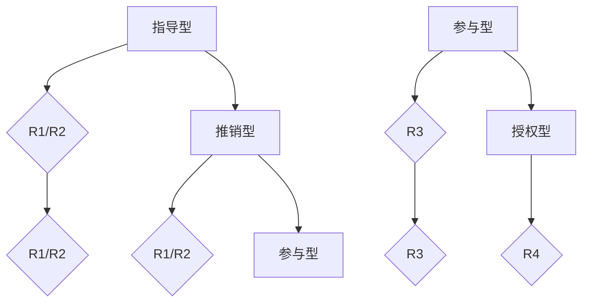
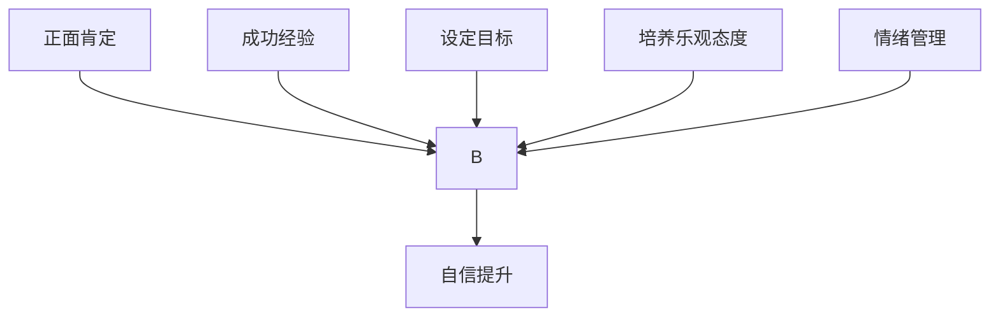
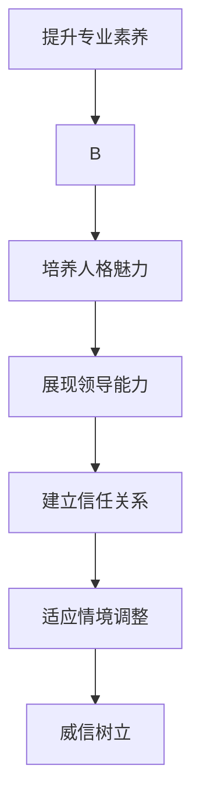

                 


# 领导力与自信：树立威信的关键因素

## 关键词
- **领导力**、**自信**、**威信**、**领导风格**、**自我效能感**、**情境领导模型**、**心理技巧**、**实战案例**

## 摘要
本文深入探讨领导力与自信在树立威信中的关键作用。通过详细解析领导力的本质、自信的培养方法以及威信树立的策略，结合实际案例分析，旨在帮助读者理解并掌握提升领导力、培养自信和树立威信的有效途径，为个人和组织发展提供指导。

## 目录大纲

### 第1章：背景介绍
#### 1.1 问题背景
#### 1.2 威信的重要性
#### 1.3 领导力与自信概述

### 第2章：核心概念与联系
#### 2.1 领导力的核心概念
#### 2.2 自信的概念与特征
#### 2.3 威信的属性特征对比
#### 2.4 领导力、自信与威信的ER实体关系图

### 第3章：领导力原理讲解
#### 3.1 领导力的本质
#### 3.2 领导风格与领导力提升
#### 3.3 领导力模型解析
#### 3.4 领导力模型mermaid图

### 第4章：自信培养方法
#### 4.1 自信心理学基础
#### 4.2 自信与自我效能感的关系
#### 4.3 提升自信的具体技巧
#### 4.4 自信培养流程图

### 第5章：威信树立策略
#### 5.1 威信建立的理论基础
#### 5.2 影响威信的因素
#### 5.3 威信树立策略
#### 5.4 威信树立流程图

### 第6章：领导力与自信实践
#### 6.1 实际案例分析
#### 6.2 个人成长故事分享
#### 6.3 实战技巧与应用

### 第7章：综合应用与案例分析
#### 7.1 综合案例分析
#### 7.2 领导力与自信在具体领域的应用
#### 7.3 拓展阅读与反思

## 第1章：背景介绍

### 1.1 问题背景

在现代组织中，领导者的威信对于组织的成功至关重要。然而，许多领导者常常面临领导力不足和自信缺乏的挑战。领导力与自信不仅影响个人领导效果，还关系到整个团队或组织的绩效和发展。本文旨在探讨领导力与自信在树立威信中的关键因素，帮助领导者提升自身能力，增强团队凝聚力，从而实现组织的长远发展。

### 1.2 威信的重要性

威信是指领导者通过自身的专业知识、能力和人格魅力赢得他人尊重和信任的能力。威信对领导效果有重要影响，主要体现在以下几个方面：

1. **团队凝聚力**：领导者拥有威信，团队成员更愿意跟随和信任，形成强大的团队凝聚力。
2. **决策执行**：领导者拥有威信，团队成员更愿意接受和执行决策，提高决策的执行效率。
3. **创新氛围**：领导者拥有威信，能够激发团队成员的创新意识，形成积极向上的创新氛围。
4. **个人发展**：领导者拥有威信，个人职业发展空间更广阔，能够获得更多的成长机会。

### 1.3 领导力与自信概述

领导力是指领导者通过影响、激励和引导他人，实现共同目标的能力。自信是指个体对自己能力的信任和信心，是心理素质的重要体现。领导力与自信在树立威信中具有密切关系，具体表现为：

1. **领导力增强自信**：领导力的提升使领导者对自己和团队有更清晰的认识，增强自信。
2. **自信提升领导力**：自信使领导者更敢于承担风险和挑战，提升领导效果。
3. **共同发展**：领导力和自信相互促进，共同助力领导者树立威信。

## 第2章：核心概念与联系

### 2.1 领导力的核心概念

领导力是一种综合能力，包括但不限于以下几个方面：

1. **影响力**：领导者能够通过自身的行为和决策影响他人，使其朝着共同目标努力。
2. **决策能力**：领导者能够在复杂情境中做出合理、有效的决策。
3. **沟通能力**：领导者能够有效地与团队成员沟通，传达信息，获取反馈。
4. **激励能力**：领导者能够激发团队成员的潜力，提高其工作积极性和创造力。
5. **团队建设**：领导者能够建立和谐的团队氛围，促进团队协作和共同发展。

### 2.2 自信的概念与特征

自信是指个体对自己的能力、价值和决策的信任和信心。自信具有以下特征：

1. **自我认可**：自信的人对自己的能力有清晰的认识，认可自己的价值。
2. **决策果断**：自信的人在面对挑战时能够迅速做出决策，不犹豫。
3. **适应性强**：自信的人能够适应不同的环境和情境，保持心理平衡。
4. **敢于面对失败**：自信的人能够从失败中汲取教训，不断提升自己。

### 2.3 威信的属性特征对比

威信是指领导者通过自身的专业素养、人格魅力和领导能力赢得他人尊重和信任的能力。威信的属性特征主要包括：

1. **专业素养**：领导者拥有丰富的专业知识和技能，能够为团队提供有效的指导和支持。
2. **人格魅力**：领导者具备高尚的品质和人格魅力，能够赢得他人的信任和尊重。
3. **领导能力**：领导者具备卓越的领导能力，能够有效地管理团队，实现组织目标。
4. **信任度**：领导者赢得团队成员的信任，使其愿意跟随和信任领导者。

| 属性特征 | 领导力 | 自信 | 威信 |
| :------: | :----: | :--: | :--: |
| 专业素养 |   是   |  是  |   是  |
| 人格魅力 |   是   |  是  |   是  |
| 领导能力 |   是   |  是  |   是  |
| 信任度   |   是   |  是  |   是  |

### 2.4 领导力、自信与威信的ER实体关系图

```mermaid
erDiagram
    Leader ||--|{ Confidence } : has
    Leader ||--|{ Leadership } : has
    Confidence ||--|{ Trust } : has
    Leadership ||--|{ Ability } : has
```

在ER实体关系图中，领导力（Leadership）和自信（Confidence）是领导者的属性，它们共同决定了领导者的威信（Trust）。领导力包括专业素养和领导能力，自信则包括自我认可和决策果断等特征。通过这个关系图，我们可以更清晰地理解领导力、自信与威信之间的联系。

## 第3章：领导力原理讲解

### 3.1 领导力的本质

领导力是一种综合能力，包括影响力、决策能力、沟通能力、激励能力和团队建设等方面。其本质在于领导者通过影响、激励和引导他人，实现共同目标的能力。领导力的本质可以概括为以下几个方面：

1. **影响他人**：领导者能够通过自身的行为和决策影响他人，使其朝着共同目标努力。
2. **决策能力**：领导者能够在复杂情境中做出合理、有效的决策，为团队指明方向。
3. **沟通能力**：领导者能够有效地与团队成员沟通，传达信息，获取反馈。
4. **激励能力**：领导者能够激发团队成员的潜力，提高其工作积极性和创造力。
5. **团队建设**：领导者能够建立和谐的团队氛围，促进团队协作和共同发展。

### 3.2 领导风格与领导力提升

领导风格是指领导者处理团队事务和与团队成员互动的方式。不同的领导风格会对领导效果产生不同的影响。以下是几种常见的领导风格及其特点：

1. **专制型**：领导者独自做出决策，团队成员没有参与权。这种风格适用于紧急情况和需要快速决策的场景。
2. **民主型**：领导者鼓励团队成员参与决策，充分听取各方意见。这种风格有助于提高团队成员的积极性和参与感。
3. **放任型**：领导者给予团队成员充分的自由度，让其自主决策。这种风格适用于团队成员高度专业化和高度信任的场景。

要提高领导力，领导者需要根据实际情况选择合适的领导风格，并在实践中不断调整和优化。以下是一些建议：

1. **了解团队成员**：领导者需要了解团队成员的个性、能力和需求，从而制定合适的领导策略。
2. **培养沟通能力**：领导者需要具备良好的沟通能力，确保信息的有效传递和反馈。
3. **增强决策能力**：领导者需要通过学习和实践，提高自己在复杂情境中做出决策的能力。
4. **关注团队建设**：领导者需要关注团队氛围，建立和谐的团队关系，提高团队的凝聚力和战斗力。

### 3.3 领导力模型解析

领导力模型是描述领导者如何影响团队的理论框架。其中，情境领导模型（Hersey-Blanchard Model）是一种广泛应用的领导力模型。该模型认为，领导风格应该根据团队成员的成熟度（Maturity Level）进行调整。团队成员的成熟度分为四个等级：

1. **R1：不成熟**：团队成员缺乏能力和意愿，需要领导者的指导。
2. **R2：较不成熟**：团队成员有能力完成任务，但缺乏意愿，需要领导者的激励。
3. **R3：较成熟**：团队成员既有能力也有意愿完成任务，但需要领导者的支持。
4. **R4：成熟**：团队成员具备高度的能力和意愿，能够自主完成任务。

情境领导模型将领导风格分为四种：

1. **指导型（S1）**：领导者为团队成员提供明确的指导和监督，适用于R1和R2。
2. **推销型（S2）**：领导者不仅提供指导，还通过激励和说服来提高团队成员的积极性，适用于R1和R2。
3. **参与型（S3）**：领导者鼓励团队成员参与决策，提高其责任感和积极性，适用于R3。
4. **授权型（S4）**：领导者给予团队成员充分的自主权，使其自主决策和完成任务，适用于R4。

### 3.4 领导力模型mermaid图



通过这个mermaid图，我们可以更直观地了解情境领导模型的基本原理和适用场景。

## 第4章：自信培养方法

### 4.1 自信心理学基础

自信是一种心理状态，反映了个体对自己能力的信任和信心。从心理学的角度来看，自信的培养与以下几个方面密切相关：

1. **自我效能感**：自我效能感是指个体对自己完成特定任务的信心。高自我效能感的人更容易表现出自信。
2. **归因理论**：归因理论是指个体如何解释自己的行为结果。积极的归因方式有助于提高自信。
3. **情感调节**：情感调节是指个体如何管理和调整自己的情绪。有效的情感调节有助于保持积极的情绪状态，从而提高自信。

### 4.2 自信与自我效能感的关系

自信与自我效能感密切相关。自我效能感是指个体对自己完成特定任务的信心，而自信则是在这种信心基础上形成的心理状态。具体来说，自我效能感对自信的影响体现在以下几个方面：

1. **影响自信水平**：高自我效能感的人通常更自信，因为他们相信自己能够应对挑战。
2. **决定行为选择**：高自我效能感的人更愿意接受挑战，尝试新事物，这有助于进一步培养自信。
3. **增强心理韧性**：高自我效能感的人在面对挫折时能够更快地恢复，这有助于提高自信。

### 4.3 提升自信的具体技巧

要提升自信，个体可以从以下几个方面入手：

1. **正面肯定**：通过积极的自我暗示和肯定，提高对自己的认同和信心。
2. **成功经验**：回顾过去的成功经验，从中汲取信心和动力。
3. **设定目标**：设定清晰、可实现的短期和长期目标，逐步实现，积累成就感。
4. **培养乐观态度**：积极看待生活中的困难和挑战，相信困难是成长的机会。
5. **情绪管理**：学会管理自己的情绪，避免情绪波动对自信的负面影响。

### 4.4 自信培养流程图



通过这个流程图，我们可以清晰地看到自信培养的各个步骤及其相互关系。

## 第5章：威信树立策略

### 5.1 威信建立的理论基础

威信的建立依赖于领导者的专业素养、人格魅力和领导能力。以下是几个关键的理论基础：

1. **领导替代理论**：该理论认为，领导者的威信不仅取决于其个人能力，还取决于团队成员的替代性。如果团队成员觉得其他人也能胜任领导者角色，那么领导者的影响力会降低。
2. **期望理论**：期望理论认为，领导者通过提高团队成员的期望值，可以增强其努力工作的动力，从而提高领导者的威信。
3. **魅力领导理论**：魅力领导理论强调领导者的个人魅力和影响力，认为领导者通过展现非凡的领导力，可以赢得团队成员的信任和尊重，从而树立威信。

### 5.2 影响威信的因素

威信的树立受到多种因素的影响，主要包括以下几个方面：

1. **专业素养**：领导者需要具备丰富的专业知识和技能，以提供有效的指导和支持。
2. **人格魅力**：领导者需要具备高尚的品质和人格魅力，以赢得他人的信任和尊重。
3. **领导能力**：领导者需要具备卓越的领导能力，包括影响力、决策能力、沟通能力、激励能力和团队建设能力。
4. **信任度**：领导者需要赢得团队成员的信任，使其愿意跟随和信任领导者。
5. **情境适应性**：领导者需要根据不同情境和团队特点，灵活调整自己的领导风格，以增强领导效果。

### 5.3 威信树立策略

要树立威信，领导者可以采取以下策略：

1. **提升专业素养**：通过不断学习和实践，提高自己的专业知识和技能，为团队提供有效的指导和支持。
2. **培养人格魅力**：通过积极的生活态度、高尚的品质和优秀的人格魅力，赢得他人的信任和尊重。
3. **展现领导能力**：在实际工作中，通过展现卓越的领导能力，赢得团队成员的认可和尊重。
4. **建立信任关系**：通过真诚、透明的沟通，建立与团队成员的信任关系，提高领导者的威信。
5. **适应情境调整**：根据不同情境和团队特点，灵活调整自己的领导风格，提高领导效果。

### 5.4 威信树立流程图



通过这个流程图，我们可以清晰地看到威信树立的各个步骤及其相互关系。

## 第6章：领导力与自信实践

### 6.1 实际案例分析

在实际工作中，许多成功领导者通过提升领导力和自信，树立了威信。以下是几个典型案例：

1. **案例一：马云的领导力与自信**

马云作为阿里巴巴的创始人，以其卓越的领导力和自信赢得了全球范围的认可。他通过敏锐的市场洞察力、卓越的决策能力和强大的沟通能力，成功地带领阿里巴巴成为全球知名企业。他的自信和坚持使他在面对挑战时始终保持积极的心态，从而树立了威信。

2. **案例二：乔布斯的领导力与自信**

乔布斯作为苹果公司的创始人，以其独特的领导力和自信改变了世界。他通过卓越的设计能力、创新思维和强大的执行力，推出了众多革命性的产品，如iPhone、iPad等。他的自信和领导力使他在团队中具有极高的影响力，从而树立了威信。

3. **案例三：李开复的领导力与自信**

李开复作为微软亚洲研究院的首席研究员和院长，以其卓越的领导力和自信赢得了业界的高度认可。他通过丰富的专业知识、敏锐的洞察力和强大的执行力，成功地推动了多个研究项目的进展。他的自信和领导力使他在团队中具有极高的威信。

### 6.2 个人成长故事分享

在个人成长过程中，许多人通过提升领导力和自信，实现了自我突破和成长。以下是几位成功人士的个人成长故事：

1. **故事一：李娜的职业转型**

李娜是一位成功的企业家，她在职业转型过程中通过不断学习和实践，提升了自己的领导力和自信。她从一名普通员工成长为公司的领导者，期间经历了许多挑战和困难。但她始终保持积极的心态，通过不断提升自己的能力和素质，最终成功转型。

2. **故事二：张强的创业之路**

张强是一位年轻的创业者，他在创业过程中通过不断学习和实践，提升了自己的领导力和自信。他面对市场的变化和竞争的挑战，始终保持冷静和坚定的信心。他的自信和领导力使他在团队中具有极高的影响力，从而带领团队取得了成功。

3. **故事三：王丽的职场成长**

王丽是一名职场女性，她在职场中通过不断学习和实践，提升了自己的领导力和自信。她在面对工作中的挑战和压力时，始终保持积极的心态，通过提升自己的能力和素质，逐步实现了职业上的突破。

### 6.3 实战技巧与应用

要提升领导力和自信，以下是一些建议：

1. **明确目标**：设定清晰、可实现的短期和长期目标，逐步实现，积累成就感。
2. **积极学习**：不断学习新知识、新技能，提升自己的专业素养和领导能力。
3. **有效沟通**：通过有效的沟通，建立与团队成员的信任关系，提高领导效果。
4. **积极心态**：保持积极的心态，面对挑战和困难时，相信自己的能力，坚定信心。
5. **自我反思**：定期进行自我反思，总结经验教训，不断提升自己的能力和素质。

## 第7章：综合应用与案例分析

### 7.1 综合案例分析

在实际应用中，领导力与自信在多个领域都发挥着重要作用。以下是一个综合案例分析：

**案例背景**：某创业公司在市场竞争激烈的环境中，需要提升领导力和自信，以实现公司的发展目标。

**解决方案**：
1. **提升专业素养**：公司领导层通过参加培训、学习新知识，提升自身的专业素养，为团队提供有效的指导和支持。
2. **培养自信**：公司领导层通过成功案例的分享、积极的自我暗示等方式，培养团队成员的自信。
3. **建立信任关系**：公司领导层通过透明、真诚的沟通，建立与团队成员的信任关系，提高领导效果。
4. **灵活调整领导风格**：根据不同情境和团队特点，公司领导层灵活调整自己的领导风格，提高领导效果。

**效果评估**：通过以上措施，公司领导力和团队自信得到显著提升，团队凝聚力增强，公司业绩稳步增长。

### 7.2 领导力与自信在具体领域的应用

领导力与自信在各个领域都有广泛应用，以下是几个具体领域的应用：

1. **企业管理**：领导者通过提升领导力和自信，能够更好地管理团队，提高企业竞争力。
2. **教育培训**：教师通过提升领导力和自信，能够更好地引导学生，提高教学效果。
3. **医疗行业**：医生通过提升领导力和自信，能够更好地处理医疗事务，提高医疗质量。
4. **科研领域**：科研人员通过提升领导力和自信，能够更好地管理科研团队，推动科研进步。

### 7.3 拓展阅读与反思

领导力与自信是领导者成功的关键因素。为了进一步提升领导力和自信，以下是一些建议：

1. **阅读相关书籍**：《领导力与影响力》、《自信的法则》等书籍提供了丰富的理论和实践指导。
2. **参加培训课程**：参加领导力与自信相关的培训课程，提升自身能力和素质。
3. **寻求导师指导**：寻求经验丰富的导师指导，借鉴其成功经验和教训。
4. **自我反思**：定期进行自我反思，总结经验教训，不断提升自己的能力和素质。

通过不断学习和实践，领导者可以提升领导力和自信，树立威信，为个人和组织的发展创造更多价值。

## 作者信息

**作者：** AI天才研究院/AI Genius Institute & 禅与计算机程序设计艺术 /Zen And The Art of Computer Programming

本文从领导力、自信和威信三个角度出发，深入探讨了领导者如何提升自身能力，树立威信。通过实际案例分析和实战技巧分享，为读者提供了实用的指导。希望本文能对读者在领导力培养和自信提升方面有所启发，助力个人和组织的发展。在未来的实践中，持续学习和反思，不断提升领导力和自信，将是每一位领导者应努力追求的目标。

