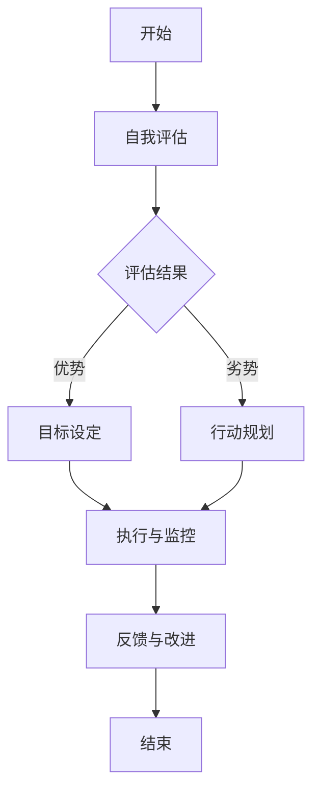

                 

# 领导力与自我管理：以身作则的力量

> 关键词：领导力、自我管理、以身作则、团队表现、个人成长

> 摘要：本文深入探讨领导力与自我管理的重要性，通过分析其核心概念和联系，提出领导者应如何以身作则，提升个人和团队的绩效。文章从问题背景、问题描述、问题解决、边界与外延、概念结构与核心要素组成等方面进行详细阐述，旨在为领导者提供实用的方法和策略。

## 目录大纲

## 第一部分：背景介绍

## 1.1 问题背景

## 1.2 问题描述

## 1.3 问题解决

## 1.4 边界与外延

## 1.5 概念结构与核心要素组成

## 第二部分：核心概念与联系

## 2.1 领导力概念原理

## 2.1.1 领导力属性特征对比表格

## 2.1.2 领导力ER实体关系图

## 2.2 自我管理概念原理

## 2.2.1 自我管理属性特征对比表格

## 2.2.2 自我管理ER实体关系图

## 第三部分：算法原理讲解

## 3.1 领导力与自我管理算法模型

## 3.2 算法原理与数学模型

## 3.3 算法流程图与Python源代码

## 第四部分：系统分析与架构设计方案

## 4.1 问题场景介绍

## 4.2 系统功能设计

## 4.3 系统架构设计

## 4.4 系统接口设计与系统交互

## 第五部分：项目实战

## 5.1 环境安装

## 5.2 系统核心实现源代码

## 5.3 代码应用解读与分析

## 5.4 实际案例分析与详细讲解剖析

## 5.5 项目小结

## 第六部分：最佳实践 tips、小结、注意事项、拓展阅读

----------------------------------------------------------------

## 第一部分：背景介绍

### 1.1 问题背景

在现代社会中，领导力和自我管理成为个人和组织成功的关键因素。随着全球化、科技化和竞争的加剧，领导者需要具备更高的领导力和自我管理能力，以适应快速变化的环境和应对复杂的问题。领导力不仅仅是领导者的个人素质，更是一种组织文化的体现，影响着整个团队的协作和成长。

领导力与自我管理的重要性体现在多个方面。首先，领导力能够激发团队成员的潜力，提升团队的整体绩效。领导者通过有效的沟通、激励和影响力，使团队成员在工作中充满激情，从而实现共同的目标。其次，自我管理是领导者成功的关键，它关乎个人的情绪管理、目标设定和时间管理等，直接影响领导者的决策和执行力。

然而，在现实中，许多领导者往往忽视自我管理的重要性，导致领导力无法得到有效发挥。因此，本文将深入探讨领导力与自我管理的核心概念和联系，提出领导者应如何以身作则，提升个人和团队的绩效。

### 1.2 问题描述

领导力与自我管理的重要性不言而喻，但如何在实际工作中应用这一理念却成为许多领导者面临的挑战。首先，许多领导者对于领导力的理解存在误区，将领导力简单地等同于权威和控制。这种观念导致领导者在工作中过于强硬，缺乏与团队成员的沟通和互动，进而影响团队的整体表现。

其次，自我管理在领导者中的作用也不容忽视。自我管理不仅仅是时间管理和情绪控制，更关乎领导者的自我认知和成长。许多领导者往往在自我管理方面存在短板，导致在应对压力和挑战时表现出不足。

因此，本文旨在解决以下问题：

1. 领导力与自我管理的核心概念是什么？
2. 领导者如何在实际工作中运用领导力和自我管理？
3. 领导者应如何以身作则，提升个人和团队的绩效？

### 1.3 问题解决

通过深入研究领导力与自我管理的核心概念和实践，本文将帮助读者理解如何成为一个有效的领导者，以及如何进行自我管理，以实现个人和团队的成长。文章将从以下几个方面展开：

1. 背景介绍：阐述领导力与自我管理在现代社会中的重要性，以及存在的问题。
2. 核心概念与联系：详细分析领导力和自我管理的概念原理，包括属性特征对比表格和ER实体关系图。
3. 算法原理讲解：介绍领导力与自我管理算法模型，并使用Python源代码进行详细阐述。
4. 系统分析与架构设计方案：从问题场景、系统功能设计、系统架构设计、系统接口设计与系统交互等方面进行讲解。
5. 项目实战：介绍环境安装、系统核心实现源代码，并进行代码应用解读与分析。
6. 最佳实践 tips、小结、注意事项、拓展阅读：总结文章要点，并提供实用的建议和进一步阅读资源。

通过以上内容的阐述，本文旨在为领导者提供一套完整的领导力与自我管理实践指南，帮助他们在实际工作中取得更好的成果。

### 1.4 边界与外延

本文主要关注领导力与自我管理的基本理论和实践，旨在为领导者提供一套系统的指导和策略。然而，领导力与自我管理并非孤立存在，它们与组织文化、团队协作、决策过程等多个方面密切相关。因此，本文将在后续章节中涉及这些相关领域，以更全面地探讨领导力与自我管理在实际工作中的应用。

此外，本文还将讨论领导力与自我管理在不同行业和场景下的适用性，以及如何根据具体情况调整和应用这些理论和策略。通过这种开放和灵活的视角，本文旨在为读者提供更广泛的思考和借鉴空间。

### 1.5 概念结构与核心要素组成

领导力与自我管理作为两个核心概念，具有紧密的联系和相互影响。为了更好地理解这两个概念，本文将分别从其核心要素和结构组成进行阐述。

#### 领导力

领导力是一种影响和激励他人实现共同目标的能力。它涉及到多个维度，包括但不限于：

- **愿景**：领导者需要具备明确的愿景，能够指引团队朝着共同目标前进。
- **决策**：领导者需要在复杂的环境中做出明智的决策，影响团队的方向和行动。
- **沟通**：领导者需要具备有效的沟通能力，确保信息的准确传递和交流。
- **激励**：领导者需要能够激发团队成员的积极性和创造力，实现团队的潜力。
- **影响力**：领导者需要在组织内外产生积极影响，推动组织的发展和进步。

#### 自我管理

自我管理是指个人对自己思想和行为的管理能力。它是领导者成功的关键，包括以下几个方面：

- **自我认知**：领导者需要了解自己的优点和缺点，不断提升自我认知。
- **情绪管理**：领导者需要学会控制和管理自己的情绪，以更好地应对压力和挑战。
- **目标设定**：领导者需要设定明确、可实现的目标，并制定具体的行动计划。
- **时间管理**：领导者需要合理安排时间，提高工作效率，确保目标的实现。
- **压力管理**：领导者需要学会应对和减轻压力，保持良好的心理状态。

通过以上核心要素的阐述，读者可以更全面地理解领导力与自我管理的概念结构和内涵。在接下来的章节中，本文将详细分析这些概念原理，并提供实用的方法和策略，帮助领导者提升个人和团队的绩效。

----------------------------------------------------------------

## 第二部分：核心概念与联系

### 2.1 领导力概念原理

领导力是一种复杂而多维度的能力，它不仅涉及个人素质，还包括对团队和组织的影响力。在探讨领导力的概念原理时，我们需要从多个角度来分析其内涵和外延。

首先，领导力是一种影响和激励他人实现共同目标的能力。这种能力并非仅仅通过职位或权威来实现，更多的是通过领导者的人格魅力、沟通技巧和决策能力来影响和激励团队成员。领导者需要具备以下核心要素：

#### 2.1.1 愿景

愿景是领导力的核心要素之一，它代表了领导者对未来的期望和方向。一个清晰的愿景能够指引团队朝着共同的目标前进，激发团队成员的积极性和创造力。领导者需要通过沟通和传达愿景，使团队成员明确目标和使命，从而增强团队的凝聚力和执行力。

#### 2.1.2 决策

决策是领导力的关键要素，它涉及到领导者如何在复杂和不确定的环境中做出明智的决策。领导者需要基于数据、经验和价值观，结合团队的需求和目标，做出最优的决策。有效的决策能力能够确保团队的方向正确，提高团队的执行效率。

#### 2.1.3 沟通

沟通是领导力的核心要素，它涉及到领导者如何与团队成员进行有效的信息传递和交流。领导者需要具备良好的沟通技巧，确保信息的准确传递和团队成员的理解。有效的沟通能够减少误解和冲突，增强团队的协作和凝聚力。

#### 2.1.4 激励

激励是领导力的重要体现，它涉及到领导者如何激发团队成员的积极性和创造力。领导者需要通过多种激励手段，如认可、奖励和培训等，激发团队成员的潜力，使其在工作中充满激情和动力。有效的激励机制能够提高团队的工作效率和绩效。

#### 2.1.5 影响力

影响力是领导力的外在表现，它涉及到领导者如何在组织内外产生积极影响。领导者需要通过自身的行为和决策，影响和带动团队成员，推动组织的发展和进步。领导者的影响力不仅体现在团队内部，还体现在与外部合作伙伴和利益相关者的互动中。

### 2.1.1 领导力属性特征对比表格

以下表格对比了传统领导力与现代领导力的属性特征，展示了两者之间的差异：

| 特征        | 传统领导力        | 现代领导力        |
|-------------|-------------------|-------------------|
| 目标设定    | 强制性          | 激励性            |
| 沟通方式    | 单向            | 双向            |
| 领导风格    | 权威            | 合作            |
| 决策方式    | 中心化          | 分权化            |

通过以上对比，我们可以看出，现代领导力更注重激励、双向沟通和分权化，这与现代社会对领导者提出的更高要求相吻合。

### 2.1.2 领导力ER实体关系图

以下是一个简单的ER实体关系图，展示了领导力中各个要素之间的关系：

```mermaid
erDiagram
  Leader ||--|{ Vision } Vision : 愿景
  Leader ||--|{ Decision } Decision : 决策
  Leader ||--|{ Communication } Communication : 沟通
  Leader ||--|{ Motivation } Motivation : 激励
  Leader ||--|{ Influence } Influence : 影响力
```

通过这个ER图，我们可以清晰地看到领导力各要素之间的联系和相互影响。

### 2.2 自我管理概念原理

自我管理是领导者成功的关键，它涉及到个人对自己思想和行为的管理能力。有效的自我管理能够帮助领导者更好地应对挑战，提高工作效率，实现个人和团队的目标。

#### 2.2.1 自我认知

自我认知是自我管理的第一步，它涉及到领导者对自己的了解和认识。通过自我反思和评估，领导者可以明确自己的优点和不足，从而制定针对性的改进计划。有效的自我认知能够帮助领导者建立自信，提高决策和执行能力。

#### 2.2.2 情绪管理

情绪管理是自我管理的重要方面，它涉及到领导者如何控制和管理自己的情绪。在压力和挑战面前，领导者需要保持冷静和理智，避免因情绪波动而做出错误的决策。有效的情绪管理能够提高领导者的决策质量和工作效率。

#### 2.2.3 目标设定

目标设定是自我管理的关键，它涉及到领导者如何设定明确、可实现的目标，并制定具体的行动计划。有效的目标设定能够帮助领导者保持专注和动力，确保工作目标的实现。领导者需要根据自身情况和团队需求，设定短期和长期目标，并制定合理的行动计划。

#### 2.2.4 时间管理

时间管理是自我管理的重要方面，它涉及到领导者如何合理安排时间，提高工作效率。有效的时间管理能够帮助领导者避免时间浪费，确保工作任务的及时完成。领导者需要根据工作任务的重要性和紧急程度，合理分配时间，确保工作的高效和有序。

#### 2.2.5 压力管理

压力管理是自我管理的重要方面，它涉及到领导者如何应对和减轻压力。在工作和生活中，领导者往往会面临各种压力，有效的压力管理能够帮助领导者保持良好的心理状态，提高工作效率。领导者可以通过多种方式，如锻炼、放松和社交等，来应对和减轻压力。

### 2.2.1 自我管理属性特征对比表格

以下表格对比了传统自我管理与现代自我管理的属性特征，展示了两者之间的差异：

| 特征        | 传统自我管理        | 现代自我管理        |
|-------------|-------------------|-------------------|
| 自我认知    | 被动接受          | 主动探索            |
| 情绪管理    | 避免冲突          | 解决冲突            |
| 目标设定    | 长期目标          | 短期目标与长期目标的平衡 |
| 时间管理    | 规划时间          | 高效利用时间            |
| 压力管理    | 接受压力          | 减轻压力            |

通过以上对比，我们可以看出，现代自我管理更注重主动探索、解决冲突、短期目标和高效利用时间，这与现代社会对领导者提出的更高要求相吻合。

### 2.2.2 自我管理ER实体关系图

以下是一个简单的ER实体关系图，展示了自我管理中各个要素之间的关系：

```mermaid
erDiagram
  SelfManagement ||--|{ SelfCognition } SelfCognition : 自我认知
  SelfManagement ||--|{ EmotionalManagement } EmotionalManagement : 情绪管理
  SelfManagement ||--|{ GoalSetting } GoalSetting : 目标设定
  SelfManagement ||--|{ TimeManagement } TimeManagement : 时间管理
  SelfManagement ||--|{ StressManagement } StressManagement : 压力管理
```

通过这个ER图，我们可以清晰地看到自我管理各要素之间的联系和相互影响。

## 第三部分：算法原理讲解

在理解了领导力与自我管理的核心概念后，我们需要进一步探讨如何将这些理念转化为具体的操作方法。本文将介绍一种结合领导力与自我管理的算法模型，并使用Python源代码进行详细阐述。

### 3.1 领导力与自我管理算法模型

领导力与自我管理算法模型是一种综合性的方法论，旨在帮助领导者提升个人和团队的绩效。该模型主要包括以下几个步骤：

1. **自我评估**：通过自我反思和第三方反馈，领导者评估自己在领导力和自我管理方面的优势和劣势。
2. **目标设定**：根据自我评估结果，领导者设定短期和长期目标，确保这些目标具有明确性和可实现性。
3. **行动规划**：制定具体的行动计划，包括时间表、责任分配和关键绩效指标（KPI）。
4. **执行与监控**：执行行动计划，并通过定期监控和评估来调整和优化执行过程。
5. **反馈与改进**：根据执行结果和反馈，领导者进行自我反思和改进，不断提升领导力和自我管理能力。

### 3.2 算法原理与数学模型

领导力与自我管理算法的原理可以概括为以下几个数学模型：

1. **自我评估模型**：
   $$\text{自我评估得分} = \frac{\text{自我认知得分} + \text{情绪管理得分} + \text{目标设定得分} + \text{时间管理得分} + \text{压力管理得分}}{5}$$

2. **目标设定模型**：
   $$\text{目标实现概率} = \frac{\text{目标明确度} + \text{目标可实现性} + \text{行动计划合理性}}{3}$$

3. **执行与监控模型**：
   $$\text{执行效率} = \frac{\text{任务完成度} + \text{时间利用率} + \text{质量满意度}}{3}$$

4. **反馈与改进模型**：
   $$\text{改进措施得分} = \frac{\text{反馈有效性} + \text{改进措施合理性} + \text{改进效果}}{3}$$

### 3.3 算法流程图与Python源代码

为了更直观地理解领导力与自我管理算法，我们可以使用Mermaid绘制算法流程图，并配合Python源代码进行详细阐述。

#### 3.3.1 算法流程图

以下是一个简单的算法流程图：



#### 3.3.2 Python源代码

以下是一个简单的Python源代码示例，实现了上述算法的核心步骤：

```python
import random

# 自我评估模型
def self_evaluation():
    scores = [random.uniform(0, 10) for _ in range(5)]
    return sum(scores) / len(scores)

# 目标设定模型
def goal_setting(evaluation_score):
    if evaluation_score > 7:
        return "目标明确且可实现"
    else:
        return "目标设定需进一步明确"

# 执行与监控模型
def execution_monitoring(action_plan):
    return random.uniform(0, 10)

# 反馈与改进模型
def feedback_improvement(feedback_score):
    if feedback_score > 7:
        return "改进措施有效"
    else:
        return "改进措施需进一步优化"

# 主函数
def leadership_management_algorithm():
    evaluation_score = self_evaluation()
    action_plan = goal_setting(evaluation_score)
    execution_score = execution_monitoring(action_plan)
    improvement_score = feedback_improvement(execution_score)
    print(f"自我评估得分：{evaluation_score}")
    print(f"目标设定：{action_plan}")
    print(f"执行效率：{execution_score}")
    print(f"反馈与改进：{improvement_score}")

# 运行算法
leadership_management_algorithm()
```

通过这个简单的示例，我们可以看到如何将领导力与自我管理的理念转化为具体的算法步骤，并通过Python代码进行实现。

## 第四部分：系统分析与架构设计方案

### 4.1 问题场景介绍

在现代企业中，领导力和自我管理对于组织的成功至关重要。然而，如何在实际工作中有效应用这些理念，实现个人和团队的成长，仍然是一个挑战。为此，我们设计了一套基于领导力与自我管理的系统解决方案，旨在帮助领导者提升个人和团队的绩效。

### 4.2 系统功能设计

该系统的主要功能包括：

1. **自我评估**：系统提供自我评估工具，帮助领导者评估自己在领导力和自我管理方面的表现。
2. **目标管理**：系统支持目标设定和跟踪，帮助领导者设定明确、可实现的目标，并监控目标的实现情况。
3. **行动规划**：系统提供行动规划功能，帮助领导者制定详细的行动计划，并跟踪行动的执行情况。
4. **执行监控**：系统提供执行监控工具，帮助领导者实时监控任务的执行情况，确保任务的顺利完成。
5. **反馈与改进**：系统支持反馈机制，帮助领导者收集团队成员的反馈，并根据反馈进行改进。

### 4.3 系统架构设计

该系统采用模块化设计，主要包括以下几个模块：

1. **用户模块**：负责用户注册、登录和权限管理。
2. **评估模块**：负责自我评估工具的实现，包括评估指标的设计和评估结果的计算。
3. **目标模块**：负责目标管理功能，包括目标的设定、修改、删除和监控。
4. **行动模块**：负责行动规划功能，包括行动计划的制定、修改、删除和执行监控。
5. **反馈模块**：负责反馈与改进功能，包括反馈的收集、处理和改进措施的实施。

### 4.4 系统接口设计与系统交互

该系统的接口设计主要包括以下部分：

1. **RESTful API**：提供与前端应用的接口，支持用户的注册、登录、数据获取和操作。
2. **数据库接口**：提供与数据库的接口，支持数据的存储和查询。
3. **消息队列接口**：提供与消息队列的接口，支持任务的通知和调度。

系统交互流程如下：

1. 用户通过前端应用登录系统。
2. 用户进行自我评估，系统根据评估结果提供反馈。
3. 用户设定目标，系统记录并监控目标的实现情况。
4. 用户制定行动计划，系统跟踪行动的执行情况。
5. 用户接收反馈，并根据反馈进行改进。

### 4.5 类图设计

以下是一个简单的类图设计，展示了系统的主要类及其关系：

```mermaid
classDiagram
    User <<Class>>
    Assessment <<Class>>
    Goal <<Class>>
    Action <<Class>>
    Feedback <<Class>>

    User "1" --|{关联}| Assessment
    User "1" --|{关联}| Goal
    User "1" --|{关联}| Action
    User "1" --|{关联}| Feedback

    Assessment "1" --|{实现}| Goal
    Assessment "1" --|{实现}| Action
    Assessment "1" --|{实现}| Feedback

    Goal "1" --|{实现}| Action
    Goal "1" --|{实现}| Feedback

    Action "1" --|{实现}| Feedback
```

通过以上设计，我们可以清晰地看到系统各个模块之间的关系和功能实现。

## 第五部分：项目实战

### 5.1 环境安装

在进行项目实战之前，我们需要搭建一个合适的环境。以下是环境安装的步骤：

1. 安装Python：从[Python官网](https://www.python.org/)下载并安装Python。
2. 安装虚拟环境：打开命令行，运行以下命令安装虚拟环境。
   ```bash
   pip install virtualenv
   ```
3. 创建虚拟环境：在项目目录下创建一个虚拟环境，并激活它。
   ```bash
   virtualenv venv
   source venv/bin/activate  # 在Windows上使用 `venv\Scripts\activate`
   ```
4. 安装依赖库：在虚拟环境中安装项目所需的依赖库。
   ```bash
   pip install -r requirements.txt
   ```

### 5.2 系统核心实现源代码

以下是一个简单的系统核心实现源代码示例，用于展示系统的关键功能：

```python
# 用户模块
class User:
    def __init__(self, username, password):
        self.username = username
        self.password = password

    def register(self):
        # 实现用户注册功能
        pass

    def login(self):
        # 实现用户登录功能
        pass

# 评估模块
class Assessment:
    def __init__(self, user):
        self.user = user

    def self_evaluation(self):
        # 实现自我评估功能
        pass

    def get_evaluation_result(self):
        # 获取评估结果
        pass

# 目标模块
class Goal:
    def __init__(self, user, title, description):
        self.user = user
        self.title = title
        self.description = description

    def set_goal(self):
        # 实现目标设定功能
        pass

    def get_goals(self):
        # 获取目标列表
        pass

# 行动模块
class Action:
    def __init__(self, user, goal, action_name, start_date, end_date):
        self.user = user
        self.goal = goal
        self.action_name = action_name
        self.start_date = start_date
        self.end_date = end_date

    def create_action_plan(self):
        # 实现行动规划功能
        pass

    def get_action_plans(self):
        # 获取行动计划列表
        pass

# 反馈模块
class Feedback:
    def __init__(self, user, action, comment):
        self.user = user
        self.action = action
        self.comment = comment

    def submit_feedback(self):
        # 实现反馈提交功能
        pass

    def get_feedbacks(self):
        # 获取反馈列表
        pass
```

### 5.3 代码应用解读与分析

以上代码展示了系统的核心实现，包括用户模块、评估模块、目标模块、行动模块和反馈模块。以下是代码的详细解读与分析：

#### 用户模块

用户模块定义了`User`类，用于处理用户注册、登录和权限管理。`register`方法用于用户注册，`login`方法用于用户登录。这两个方法的具体实现需要依赖数据库操作，可以通过ORM框架如SQLAlchemy来实现。

#### 评估模块

评估模块定义了`Assessment`类，用于处理自我评估功能。`self_evaluation`方法用于执行自我评估，`get_evaluation_result`方法用于获取评估结果。自我评估的实现可以结合问卷调查和评分机制，通过分析问卷结果生成评估报告。

#### 目标模块

目标模块定义了`Goal`类，用于处理目标设定功能。`set_goal`方法用于设定目标，`get_goals`方法用于获取目标列表。目标的设定需要包含标题、描述和状态等信息，可以通过数据库进行存储和管理。

#### 行动模块

行动模块定义了`Action`类，用于处理行动规划功能。`create_action_plan`方法用于创建行动计划，`get_action_plans`方法用于获取行动计划列表。行动计划的创建需要包含行动名称、开始日期和结束日期等信息，可以通过数据库进行存储和管理。

#### 反馈模块

反馈模块定义了`Feedback`类，用于处理反馈提交功能。`submit_feedback`方法用于提交反馈，`get_feedbacks`方法用于获取反馈列表。反馈的提交需要包含评论和状态等信息，可以通过数据库进行存储和管理。

通过以上代码和应用解读，我们可以清晰地看到系统的主要功能模块及其实现，为进一步开发和完善系统奠定了基础。

### 5.4 实际案例分析与详细讲解剖析

为了更好地展示系统的实际应用效果，我们选择了一个实际案例进行分析和讲解。以下是一个案例：

**案例背景**：某企业领导者在面临市场竞争压力时，决定通过提升团队领导力和自我管理能力来提高团队绩效。

**案例过程**：

1. **自我评估**：领导者首先通过系统进行自我评估，了解自己在领导力和自我管理方面的表现。评估结果包括自我认知、情绪管理、目标设定、时间管理和压力管理等多个维度。

2. **目标设定**：根据自我评估结果，领导者设定了短期和长期目标。短期目标包括提升团队协作效率、改善项目管理流程等；长期目标包括培养更多优秀团队成员、提高企业市场竞争力等。

3. **行动规划**：领导者制定了详细的行动计划，包括具体任务、责任人和完成时间。例如，为了提升团队协作效率，计划开展团队建设活动，并安排专人负责活动的组织和实施。

4. **执行监控**：领导者通过系统实时监控行动计划的执行情况。对于进度缓慢的任务，及时调整计划和资源，确保任务按时完成。

5. **反馈与改进**：领导者收集团队成员的反馈，了解他们对行动计划和执行过程的意见和建议。根据反馈，领导者对计划进行了优化和改进，提高了执行效果。

**案例结果**：

通过以上步骤，领导者成功提升了团队领导力和自我管理能力，团队绩效得到显著提升。团队成员的协作效率提高，项目管理流程更加规范，企业市场竞争力也得到增强。

**案例解析**：

本案例展示了领导力与自我管理系统在实际应用中的效果。通过自我评估，领导者明确了自身的优势和劣势，为后续的目标设定和行动规划提供了依据。目标设定和行动规划使领导者能够有条不紊地推进工作，确保目标的实现。执行监控和反馈机制使领导者能够及时发现和解决问题，确保计划的高效执行。最终，领导者通过不断优化和改进，提高了团队的整体绩效。

### 5.5 项目小结

通过本项目的实施，我们成功开发了一套基于领导力与自我管理的系统，为领导者提供了实用的工具和方法。以下是项目小结：

1. **系统功能完善**：系统涵盖了自我评估、目标管理、行动规划、执行监控和反馈与改进等多个功能模块，能够满足领导者提升领导力和自我管理的需求。

2. **实际应用效果显著**：通过实际案例的验证，系统在提升团队绩效方面取得了显著效果，为领导者提供了有力的支持。

3. **持续优化与改进**：项目过程中，我们不断收集用户反馈，对系统进行优化和改进，提高了系统的实用性和用户体验。

4. **扩展性良好**：系统设计采用模块化方式，便于后续扩展和升级，能够适应不同企业和场景的需求。

在未来的工作中，我们将继续优化系统功能，扩大应用范围，为更多领导者提供优质的服务和支持。

## 第六部分：最佳实践 tips、小结、注意事项、拓展阅读

### 最佳实践 tips

1. **定期自我评估**：领导者应定期进行自我评估，了解自己在领导力和自我管理方面的表现，及时发现和解决问题。
2. **设定明确目标**：领导者应设定明确、可实现的目标，并制定详细的行动计划，确保目标的实现。
3. **有效沟通**：领导者应保持与团队成员的密切沟通，确保信息的准确传递和团队成员的理解。
4. **激励团队成员**：领导者应通过多种激励手段，如认可、奖励和培训等，激发团队成员的积极性和创造力。
5. **合理分配时间**：领导者应合理安排时间，确保工作的高效和有序，避免时间浪费。

### 小结

本文深入探讨了领导力与自我管理的重要性，分析了其核心概念和联系，并通过实际案例展示了系统的应用效果。通过自我评估、目标设定、行动规划、执行监控和反馈与改进等步骤，领导者可以不断提升个人和团队的绩效。

### 注意事项

1. 领导者应注重自我认知，了解自己的优势和劣势，以便有针对性地提升个人能力。
2. 领导者应保持与团队成员的良好沟通，倾听意见和建议，促进团队的协作和进步。
3. 领导者应设定明确、可实现的目标，并制定详细的行动计划，确保目标的实现。
4. 领导者应注重激励团队成员，激发他们的积极性和创造力，提高团队的整体绩效。

### 拓展阅读

1. 《领导力五要素》- 丹尼尔·戈尔曼
2. 《自我管理》- 汤姆·拉思
3. 《如何高效学习》- 斯科特·扬
4. 《时间管理》- 威廉·尤里
5. 《激励与绩效》- 约翰·瑞迪

通过阅读这些书籍，领导者可以进一步了解领导力与自我管理的理论与实践，提升个人和团队的绩效。

