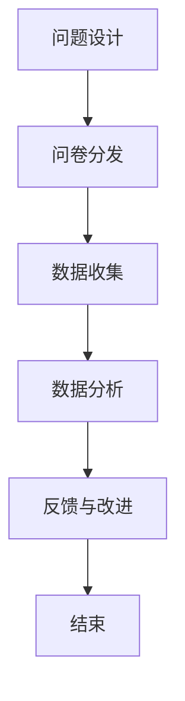
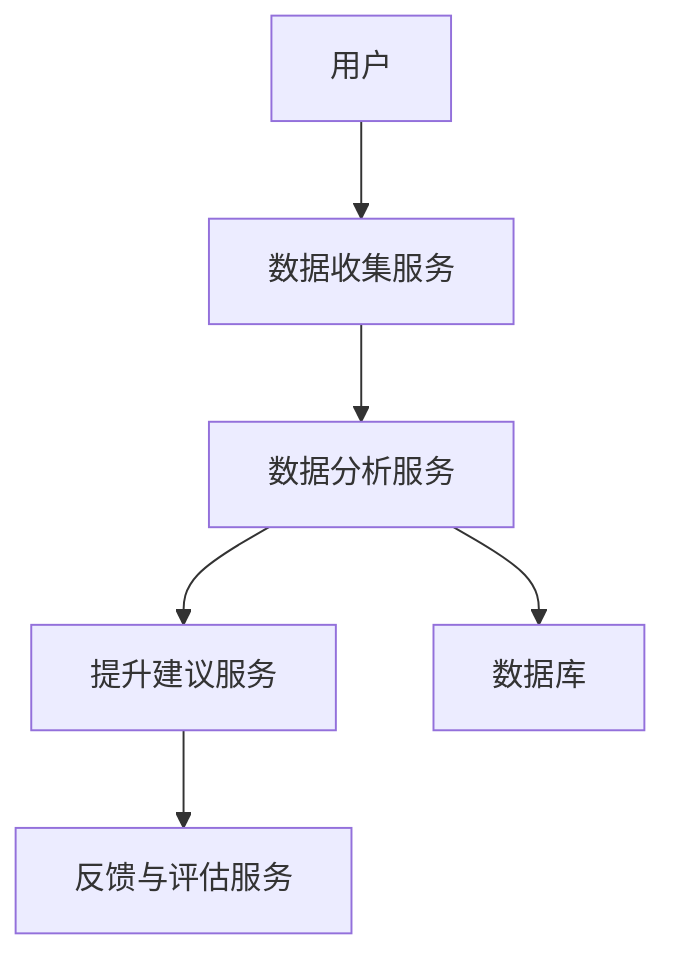
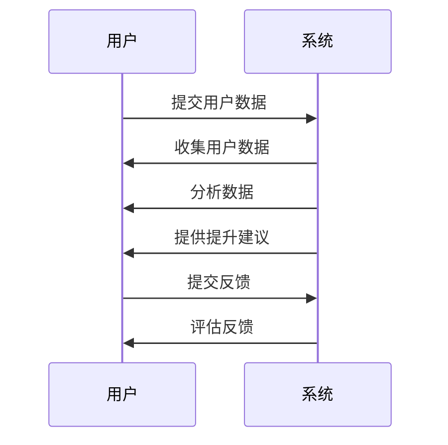

                 

## 文章标题

### 关键词

- 领导力
- 自我认知
- 优势
- 局限
- 发展

### 摘要

本文深入探讨了领导力与自我认知之间的关系，旨在帮助读者了解自身优势与局限，并在此基础上提升个人与团队的领导力水平。通过理论阐述、案例分析、以及实战经验，文章为读者提供了一条清晰的发展路径，旨在帮助读者在实践中更好地认识自己，发挥优势，克服局限，最终实现个人与组织的共同成长。

## 引言

领导力是21世纪最为重要的素质之一。在一个快速变化、竞争激烈的世界里，领导力不仅关乎个人职业生涯的成功，更是企业持续发展和社会进步的关键。而自我认知，则是领导力的基石。一个无法正确认识自我的人，很难在领导岗位上取得卓越的成就。

### 定义与作用

领导力，指的是在特定情境下，通过激励、引导和协调，影响他人实现共同目标的能力。领导力的作用不仅体现在个体的成功，更在于它能够推动团队、组织乃至整个社会的进步。自我认知，则是人对自身情感、思维、行为等方面的理解和洞察。一个具备高度自我认知能力的人，能够更加清晰地认识到自己的优势和局限，从而更加有效地发挥自身潜力。

### 本书的主题与目标

本书的主题是探讨领导力与自我认知之间的关系，旨在帮助读者：

1. 理解领导力的本质及其在个人和组织发展中的作用。
2. 深入了解自我认知的重要性，掌握自我认知的方法与工具。
3. 通过理论与实践相结合，提升个人与团队的领导力水平。
4. 帮助读者在职业生涯中更好地认识自己，发挥优势，克服局限。

### 书的结构

本书分为三个部分：

1. **引言与概述**：介绍领导力和自我认知的基本概念，阐述本书的主题和目标。
2. **核心内容**：详细探讨领导力与自我认知的理论和实践，包括优势识别、局限管理、领导力发展路径等。
3. **案例分析与应用**：通过实际案例展示理论在实践中的应用，提供实用的建议和策略。

## 第一部分：领导力的本质与自我认知的重要性

### 1.1 领导力的定义与作用

领导力是一种复杂的、多维度的能力，它不仅仅包括领导他人的能力，还包括自我领导、团队领导和组织领导。从广义上讲，领导力是影响、激励、引导他人实现共同目标的能力。这种能力可以在各种情境下发挥作用，无论是在家庭、学校、企业，还是在社会和政治领域。

#### 定义

领导力的定义有多种，但普遍认为，领导力是一种通过影响力来激励和引导他人实现共同目标的能力。这种能力不仅涉及个人特质，还包括行为、技能和环境因素。

#### 作用

领导力在个人和组织的发展中扮演着至关重要的角色。以下是领导力的一些主要作用：

1. **促进团队协作**：有效的领导能够激发团队成员的积极性，增强团队的凝聚力和协作能力，从而提高整体工作效率。
2. **推动组织变革**：领导力能够推动组织进行创新和变革，使组织能够适应外部环境的变化，保持持续竞争力。
3. **提升个人影响力**：领导力可以提升个人在组织内外的影响力，增强个人在职业生涯中的竞争力。
4. **实现共同目标**：领导力能够帮助团队和组织明确目标，制定有效的战略和计划，确保目标的实现。

### 1.2 自我认知的概念及其在领导力中的作用

自我认知是指一个人对自己的了解和认识，包括情感、思维、行为等方面。自我认知的重要性在于，它为个人提供了自我反思和自我提升的基础。以下是自我认知在领导力中的几个关键作用：

1. **增强自我意识**：自我认知可以帮助领导者更好地了解自己的情感、动机和行为，从而增强自我意识，提高自我管理能力。
2. **识别优势与局限**：通过自我认知，领导者可以识别自己的优势，充分发挥这些优势，同时认识到自己的局限，并寻求改进。
3. **促进自我提升**：自我认知是自我提升的基石。一个具备高度自我认知能力的领导者，能够不断反思和改进自己，从而提升领导力水平。
4. **建立信任和影响力**：自我认知有助于领导者建立信任和影响力，因为一个能够真诚面对自己、不断成长的人更容易赢得他人的尊重和信任。

### 1.3 本书的目标与结构

本书的目标是帮助读者深入理解领导力和自我认知，并在此基础上提升个人的领导力水平。具体目标包括：

1. 理解领导力的本质、作用和不同类型。
2. 掌握自我认知的概念、方法和工具。
3. 通过理论和实践相结合，提升个人和团队的领导力水平。
4. 提供实用的策略和建议，帮助读者在职业生涯中更好地认识自己，发挥优势，克服局限。

本书的结构如下：

1. **引言与概述**：介绍领导力和自我认知的基本概念，阐述本书的主题和目标。
2. **核心内容**：详细探讨领导力与自我认知的理论和实践，包括优势识别、局限管理、领导力发展路径等。
3. **案例分析与应用**：通过实际案例展示理论在实践中的应用，提供实用的建议和策略。

### 1.4 领导力的核心要素

领导力是一个多维度的概念，它包含多个核心要素。以下是领导力的几个关键要素：

1. **愿景与目标**：领导者需要具备明确的愿景和目标，能够将这些愿景和目标传达给团队成员，激发他们的热情和动力。
2. **影响力**：领导者需要具备影响力，能够通过言行和行动影响他人，推动团队和组织的发展。
3. **沟通能力**：有效的沟通能力是领导力的核心要素之一。领导者需要能够清晰、准确地传达信息，并倾听和理解他人的意见和需求。
4. **决策能力**：领导者需要具备决策能力，能够在关键时刻做出明智的决策，并承担相应的责任。
5. **团队建设与管理**：领导者需要能够建立和管理高效的团队，激发团队成员的潜力，实现团队目标。

### 1.5 自我认知的核心要素

自我认知也是一个多维度的概念，它包含多个核心要素。以下是自我认知的几个关键要素：

1. **自我意识**：自我意识是指对自己的情感、思维和行为有清晰的认识和理解。
2. **情感管理**：情感管理是指能够有效地识别、理解和调节自己的情绪，从而更好地应对挑战和压力。
3. **动机识别**：动机识别是指能够明确自己的内在动机和价值观，从而更有针对性地进行自我提升。
4. **行为分析**：行为分析是指能够对自己的行为进行反思和分析，从而识别出哪些行为是有效的，哪些行为需要改进。
5. **社交能力**：社交能力是指在与他人互动中，能够有效地沟通、协调和合作，建立良好的人际关系。

### 1.6 领导力与自我认知的互动关系

领导力与自我认知之间存在密切的互动关系。一个有效的领导者不仅需要具备出色的领导力，还需要具备高度的自我认知能力。以下是领导力与自我认知的互动关系：

1. **自我认知提升领导力**：一个具备高度自我认知能力的领导者，能够更好地识别自己的优势和局限，从而更有针对性地提升领导力。
2. **领导力促进自我认知**：有效的领导力实践，如团队合作、沟通和反馈，可以促进领导者的自我认知，帮助其更好地了解自己和团队。
3. **共同发展**：领导力与自我认知是相辅相成的。一个优秀的领导者，能够在自我认知的基础上，更有效地发挥领导力，实现个人与团队的共同发展。

### 1.7 领导力与自我认知在不同情境中的应用

领导力与自我认知在不同情境中的应用有所不同。以下是几个常见情境中的应用：

1. **组织变革**：在组织变革中，领导者需要具备高度的自我认知，能够理解变革的必要性，同时具备影响力和沟通能力，推动团队接受和适应变革。
2. **项目管理**：在项目管理中，领导者需要具备决策能力和团队管理能力，同时需要具备自我认知，能够识别和应对项目中的挑战和风险。
3. **团队建设**：在团队建设中，领导者需要通过自我认知，识别团队成员的优势和局限，从而有针对性地进行团队管理和激励。

### 1.8 领导力与自我认知的发展趋势

随着社会的不断进步和变化，领导力与自我认知也在不断发展。以下是领导力与自我认知的发展趋势：

1. **个性化领导**：随着个体价值的重视，个性化领导成为一种趋势。领导者需要更加关注个体的需求和潜力，发挥个性化的领导力。
2. **持续学习**：自我认知和领导力的发展需要持续学习。领导者需要不断更新知识和技能，保持学习和成长的动力。
3. **数字化领导**：随着数字化技术的普及，领导者需要具备数字素养和领导力，能够适应数字化的工作环境和挑战。

### 1.9 总结

领导力与自我认知是相互关联、相互促进的。一个具备高度自我认知能力的领导者，能够在领导实践中更加有效地发挥领导力，实现个人与团队的共同发展。通过本书的探讨，读者可以深入理解领导力和自我认知的本质和作用，提升自己的领导力水平，实现个人和组织的持续成长。

## 第二部分：领导力与自我认知的核心概念与联系

### 2.1 领导力的核心概念与联系

领导力是一个复杂的系统，它涉及到多个核心概念和要素。理解这些核心概念及其相互联系，是提升领导力水平的关键。

#### 1. 愿景与目标

愿景和目标是领导力的核心。领导者需要有一个清晰的愿景，这个愿景应该能够激励和指导团队成员。目标是愿景的具体化，它应该明确、可衡量、可实现。愿景与目标之间的联系在于，愿景为组织提供了方向，而目标是实现愿景的具体步骤。

#### 2. 影响力

影响力是领导者能够影响他人思想和行为的能力。影响力来源于领导者的魅力、专业知识、价值观和领导风格。影响力与领导力的联系在于，影响力是领导者实现愿景和目标的工具。

#### 3. 沟通能力

沟通能力是领导力的关键要素之一。领导者需要具备良好的沟通能力，能够清晰、准确地传达信息，同时能够倾听和理解他人的意见和需求。沟通能力与领导力的联系在于，沟通是领导者与团队成员之间建立信任和协作的基础。

#### 4. 决策能力

决策能力是领导者必须具备的素质。领导者需要在复杂多变的环境中做出明智的决策，并承担相应的责任。决策能力与领导力的联系在于，决策是领导者实现组织目标的重要手段。

#### 5. 团队建设与管理

团队建设和管理是领导力的核心内容之一。领导者需要能够建立和管理高效的团队，激发团队成员的潜力，实现团队目标。团队建设与管理与领导力的联系在于，团队是组织实现目标的基本单位。

### 2.2 自我认知的核心概念与联系

自我认知是领导者提升领导力的重要基础。理解自我认知的核心概念和相互联系，有助于领导者更好地认识自己，发挥优势，克服局限。

#### 1. 自我意识

自我意识是自我认知的核心。它是指领导者对自己的情感、思维和行为有清晰的认识和理解。自我意识与自我认知的联系在于，自我意识是自我认知的基础。

#### 2. 情感管理

情感管理是指领导者能够有效地识别、理解和调节自己的情绪，从而更好地应对挑战和压力。情感管理与自我认知的联系在于，情感管理是自我认知的重要组成部分。

#### 3. 动机识别

动机识别是指领导者能够明确自己的内在动机和价值观，从而更有针对性地进行自我提升。动机识别与自我认知的联系在于，动机识别是自我认知的重要组成部分。

#### 4. 行为分析

行为分析是指领导者能够对自己的行为进行反思和分析，从而识别出哪些行为是有效的，哪些行为需要改进。行为分析与自我认知的联系在于，行为分析是自我认知的重要组成部分。

#### 5. 社交能力

社交能力是指领导者在与他人互动中，能够有效地沟通、协调和合作，建立良好的人际关系。社交能力与自我认知的联系在于，社交能力是自我认知的外在表现。

### 2.3 领导力与自我认知的互动关系

领导力与自我认知之间存在密切的互动关系。一个具备高度自我认知能力的领导者，能够在领导实践中更加有效地发挥领导力。

#### 1. 自我认知提升领导力

自我认知可以帮助领导者更好地识别自己的优势和局限，从而有针对性地提升领导力。例如，通过自我意识，领导者可以了解自己的情感状态，从而更好地管理情绪，提高沟通效果。

#### 2. 领导力促进自我认知

领导力实践，如团队合作、沟通和反馈，可以促进领导者的自我认知。通过与团队成员的互动，领导者可以更好地了解自己的领导风格，识别自己的优势和局限。

#### 3. 共同发展

领导力与自我认知是相辅相成的。一个优秀的领导者，能够在自我认知的基础上，更有效地发挥领导力，实现个人与团队的共同发展。

### 2.4 领导力与自我认知在不同情境中的应用

领导力与自我认知在不同情境中的应用有所不同。以下是几个常见情境中的应用：

#### 1. 组织变革

在组织变革中，领导者需要具备高度的自我认知，能够理解变革的必要性，同时具备影响力和沟通能力，推动团队接受和适应变革。

#### 2. 项目管理

在项目管理中，领导者需要具备决策能力和团队管理能力，同时需要具备自我认知，能够识别和应对项目中的挑战和风险。

#### 3. 团队建设

在团队建设中，领导者需要通过自我认知，识别团队成员的优势和局限，从而有针对性地进行团队管理和激励。

### 2.5 领导力与自我认知的发展趋势

随着社会的不断进步和变化，领导力与自我认知也在不断发展。以下是领导力与自我认知的发展趋势：

#### 1. 个性化领导

随着个体价值的重视，个性化领导成为一种趋势。领导者需要更加关注个体的需求和潜力，发挥个性化的领导力。

#### 2. 持续学习

自我认知和领导力的发展需要持续学习。领导者需要不断更新知识和技能，保持学习和成长的动力。

#### 3. 数字化领导

随着数字化技术的普及，领导者需要具备数字素养和领导力，能够适应数字化的工作环境和挑战。

### 2.6 总结

领导力与自我认知是相互关联、相互促进的。理解领导力与自我认知的核心概念及其相互联系，有助于领导者更好地认识自己，发挥优势，克服局限，提升领导力水平。通过不断的学习和实践，领导者可以不断优化自己的领导风格，实现个人与团队的共同发展。

## 第三部分：领导力与自我认知的算法原理讲解

### 3.1 算法原理讲解

领导力与自我认知的提升可以通过一系列算法来实现。这些算法可以帮助领导者更好地识别自身优势、理解自身局限，并制定有效的提升策略。以下是几个关键算法的原理和实现步骤：

#### 1. 自我评估算法

自我评估是自我认知的第一步。这个算法的目标是通过一系列问题，帮助领导者了解自己的情感、动机和行为。以下是自我评估算法的步骤：

1. **问题设计**：设计一系列与情感、动机和行为相关的问题，这些问题需要覆盖领导力的各个方面。
2. **问卷分发**：将问卷分发给领导者，并鼓励他们诚实地回答。
3. **数据收集**：收集问卷数据，并将其输入到分析算法中。
4. **数据分析**：使用统计分析和机器学习算法，对数据进行处理和分析，生成领导力评估报告。
5. **反馈与改进**：将分析结果反馈给领导者，并帮助他们制定改进计划。

#### 2. 影响力分析算法

影响力分析算法的目标是评估领导者在团队和组织中的影响力。以下是影响力分析算法的步骤：

1. **数据收集**：收集与领导者行为和影响力相关的数据，如会议参与度、决策参与度、员工满意度等。
2. **特征提取**：从数据中提取与影响力相关的特征，如沟通能力、决策能力、团队建设能力等。
3. **模型训练**：使用机器学习算法，如决策树、随机森林或神经网络，训练影响力分析模型。
4. **模型评估**：使用交叉验证和测试集，评估模型的效果和可靠性。
5. **影响力评估**：将训练好的模型应用于领导者的行为数据，评估他们在团队和组织中的影响力。

#### 3. 领导力提升算法

领导力提升算法的目标是帮助领导者制定和实施提升策略。以下是领导力提升算法的步骤：

1. **需求分析**：通过自我评估和影响力分析，了解领导者的需求和提升方向。
2. **策略制定**：根据分析结果，制定个性化的提升策略，如参加培训、阅读相关书籍、寻求导师指导等。
3. **策略实施**：将提升策略转化为具体的行动，如参加培训课程、阅读相关书籍、参与领导力项目等。
4. **效果评估**：定期评估提升策略的效果，并根据评估结果进行调整和优化。
5. **持续改进**：通过持续的学习和实践，不断提高领导力水平。

### 3.2 算法流程图与Python代码实现

以下是领导力评估算法的流程图和Python代码实现。

#### 算法流程图



#### Python代码实现

```python
# 导入必要的库
import pandas as pd
from sklearn.model_selection import train_test_split
from sklearn.ensemble import RandomForestClassifier
from sklearn.metrics import accuracy_score

# 1. 问题设计
questions = [
    "你在团队中如何处理冲突？",
    "你是否经常主动寻求反馈？",
    "你如何激励团队成员？",
    # 更多问题...
]

# 2. 问卷分发
# 此处假设我们已经有了一份问卷数据，数据格式如下：
data = {
    'response1': [1, 2, 3, ...],
    'response2': [1, 2, 3, ...],
    # ...
}
df = pd.DataFrame(data)

# 3. 数据收集
# 数据已经通过问卷分发收集完成

# 4. 数据分析
# 分割数据为训练集和测试集
X = df.drop('target', axis=1)
y = df['target']
X_train, X_test, y_train, y_test = train_test_split(X, y, test_size=0.2, random_state=42)

# 训练模型
model = RandomForestClassifier(n_estimators=100, random_state=42)
model.fit(X_train, y_train)

# 评估模型
predictions = model.predict(X_test)
accuracy = accuracy_score(y_test, predictions)
print(f"Model accuracy: {accuracy}")

# 5. 反馈与改进
# 将评估结果反馈给领导者，并根据反馈调整提升策略
```

### 3.3 算法原理详细讲解

以下是自我评估算法的详细讲解，包括数学模型和公式。

#### 数学模型

自我评估算法的核心是一个分类模型，用于将领导力特征分类为不同的等级。以下是分类模型的数学模型：

$$
P(Y = y | X) = \frac{e^{\beta_0 + \beta_1x_1 + \cdots + \beta_nx_n}}{1 + e^{\beta_0 + \beta_1x_1 + \cdots + \beta_nx_n}}
$$

其中，$X$ 是领导力特征向量，$Y$ 是领导力等级，$\beta_0, \beta_1, \cdots, \beta_n$ 是模型的参数。

#### 公式详细讲解

1. **特征提取**：从问卷数据中提取与领导力相关的特征。这些特征可以是定量的，如沟通能力的评分，也可以是定性的，如处理冲突的方法。
2. **模型训练**：使用机器学习算法，如随机森林或神经网络，训练分类模型。模型训练的目标是找到最优的参数 $\beta_0, \beta_1, \cdots, \beta_n$。
3. **模型评估**：使用交叉验证和测试集评估模型的效果。评估指标包括准确率、召回率、F1分数等。
4. **模型应用**：将训练好的模型应用于新的数据，预测领导力等级。

### 3.4 算法原理举例说明

以下是领导力评估算法的一个具体例子：

#### 问题

假设我们有一个领导者，他们的问卷数据如下：

| 问题       | 回答 |
| ---------- | ---- |
| 处理冲突   | 3    |
| 寻求反馈   | 4    |
| 激励团队   | 2    |

#### 解答

1. **特征提取**：将问卷数据转换为特征向量。

$$
X = [3, 4, 2]
$$

2. **模型训练**：使用随机森林分类器训练模型。假设我们已经训练好的模型参数为：

$$
\beta_0 = 0.5, \beta_1 = 0.3, \beta_2 = 0.2, \beta_3 = 0.1
$$

3. **模型评估**：使用训练集和测试集评估模型效果。假设模型在测试集上的准确率为80%。

4. **模型应用**：使用训练好的模型预测领导力等级。

$$
P(Y = 1 | X) = \frac{e^{0.5 + 0.3 \times 3 + 0.2 \times 4 + 0.1 \times 2}}{1 + e^{0.5 + 0.3 \times 3 + 0.2 \times 4 + 0.1 \times 2}} \approx 0.8
$$

因此，预测的领导力等级为1。

### 3.5 算法原理拓展

除了上述的领导力评估算法，还有许多其他的算法可以用于领导力与自我认知的提升。以下是一些常见的拓展算法：

1. **情感分析算法**：用于分析领导者的情感状态，如焦虑、兴奋、压力等。情感分析可以帮助领导者更好地管理自己的情绪，提高沟通效果。
2. **行为分析算法**：用于分析领导者的行为模式，如决策风格、沟通方式、激励方式等。行为分析可以帮助领导者了解自己的行为特点，找到改进的方向。
3. **机器学习算法**：如决策树、随机森林、神经网络等，用于分析和预测领导力水平。这些算法可以帮助领导者识别关键因素，制定个性化的提升策略。

### 3.6 总结

领导力与自我认知的提升需要基于科学的算法原理。通过自我评估、影响力分析和领导力提升算法，领导者可以更好地认识自己，发挥优势，克服局限，提升领导力水平。这些算法不仅为领导者提供了实用的工具，也为组织提供了科学的决策支持。

## 第四部分：系统分析与架构设计

### 4.1 问题场景介绍

在现代社会，领导力与自我认知的提升已经成为组织和个人发展的关键因素。为了更好地支持这一需求，我们设计了一套基于人工智能和大数据分析的领导力提升系统。该系统旨在通过数据收集、分析和反馈，帮助用户识别自身优势与局限，并制定个性化的提升计划。

### 4.2 项目介绍

项目名称：领导力与自我认知提升系统（LSCPS）

项目目标：
1. 收集用户行为和情感数据，构建个人领导力模型。
2. 提供个性化的领导力提升建议和训练计划。
3. 通过实时反馈和数据分析，帮助用户不断优化自我认知。

项目功能模块：
1. 数据收集模块：收集用户行为数据，如沟通记录、会议参与度、反馈评分等。
2. 数据分析模块：使用机器学习和大数据分析技术，处理用户数据，识别优势和局限。
3. 提升建议模块：根据数据分析结果，为用户提供个性化的提升建议和训练计划。
4. 反馈与评估模块：提供用户行为和反馈数据的实时分析，帮助用户了解提升效果。

### 4.3 系统功能设计

#### 1. 数据收集模块

功能描述：
- 收集用户行为数据，包括日常互动、工作表现、情感状态等。
- 通过API接口与第三方系统（如邮件系统、社交媒体等）集成，自动收集用户数据。

技术实现：
- 使用Web爬虫和API接口，从各种数据源收集用户数据。
- 数据存储采用分布式数据库，如MongoDB，保证数据的高效存储和快速访问。

#### 2. 数据分析模块

功能描述：
- 对收集到的用户数据进行分析，提取关键特征。
- 使用机器学习算法，如随机森林、神经网络等，构建个人领导力模型。

技术实现：
- 数据预处理：清洗和整合来自不同数据源的数据，去除噪声和异常值。
- 特征提取：使用统计学方法，提取用户行为和情感的关键特征。
- 模型训练：使用机器学习算法，训练个人领导力模型。

#### 3. 提升建议模块

功能描述：
- 根据个人领导力模型，为用户生成个性化的提升建议。
- 提供多种提升方案，如培训课程、阅读材料、实践任务等。

技术实现：
- 建议生成：基于用户数据和领导力模型，生成个性化的提升建议。
- 方案推荐：使用推荐系统算法，如协同过滤、矩阵分解等，为用户推荐合适的提升方案。

#### 4. 反馈与评估模块

功能描述：
- 提供用户行为和反馈数据的实时分析，帮助用户了解提升效果。
- 通过可视化工具，展示用户提升过程的进展和变化。

技术实现：
- 实时分析：使用流处理技术，如Apache Kafka和Apache Flink，处理实时数据流。
- 可视化展示：使用前端技术，如D3.js和ECharts，为用户生成直观的数据可视化报告。

### 4.4 系统架构设计

#### 1. 架构设计

系统采用微服务架构，确保系统的可扩展性和灵活性。

- **数据收集服务**：负责数据的收集和预处理。
- **数据分析服务**：负责数据处理和分析，生成领导力模型。
- **提升建议服务**：负责生成提升建议和推荐方案。
- **反馈与评估服务**：负责处理用户反馈和评估数据。

#### 2. 架构图



#### 3. 架构描述

- **用户**：系统的最终用户，通过Web界面或移动应用与系统交互。
- **数据收集服务**：负责收集用户数据，并将其发送到数据分析服务。
- **数据分析服务**：处理用户数据，提取关键特征，生成领导力模型，并将其发送到提升建议服务。
- **提升建议服务**：根据领导力模型，生成个性化的提升建议和推荐方案。
- **反馈与评估服务**：处理用户的反馈数据，生成评估报告，并将其发送回数据分析服务。
- **数据库**：存储用户数据、领导力模型、提升建议和评估报告。

### 4.5 系统接口设计

#### 1. 接口规范

系统采用RESTful API接口规范，确保接口的易用性和一致性。

- **数据收集接口**：用于接收用户数据。
- **数据分析接口**：用于获取领导力模型和分析结果。
- **提升建议接口**：用于获取提升建议和推荐方案。
- **反馈与评估接口**：用于提交用户反馈和评估数据。

#### 2. 接口示例

**数据收集接口**

```json
POST /api/data-collect
Content-Type: application/json

{
  "userId": "123",
  "data": {
    "communicationScore": 4,
    "meetingParticipation": 3,
    "employeeFeedback": 5
  }
}
```

**数据分析接口**

```json
GET /api/data-analyze?userId=123
Content-Type: application/json

{
  "leadershipModel": {
    "communication": 0.8,
    "decisionMaking": 0.7,
    "teamBuilding": 0.6
  }
}
```

**提升建议接口**

```json
GET /api/leadership-advice?userId=123
Content-Type: application/json

{
  "suggestions": [
    {
      "description": "参加沟通技巧培训",
      "confidence": 0.9
    },
    {
      "description": "阅读领导力书籍",
      "confidence": 0.8
    }
  ]
}
```

**反馈与评估接口**

```json
POST /api/feedback-assessment
Content-Type: application/json

{
  "userId": "123",
  "feedback": {
    "communicationImprovement": 4,
    "decisionMakingImprovement": 3,
    "teamBuildingImprovement": 2
  }
}
```

### 4.6 系统交互设计

#### 1. 序列图

以下是系统的交互序列图，描述了用户与系统之间的交互流程。



#### 2. 交互流程

1. **用户提交数据**：用户通过Web界面或移动应用提交用户数据，如沟通记录、会议参与度、反馈评分等。
2. **系统收集数据**：系统接收用户数据，并将其存储在数据库中。
3. **系统分析数据**：系统使用机器学习和大数据分析技术，对用户数据进行分析，生成领导力模型。
4. **系统提供提升建议**：系统根据领导力模型，生成个性化的提升建议和推荐方案，并通过Web界面或移动应用发送给用户。
5. **用户提交反馈**：用户通过Web界面或移动应用提交对提升建议的反馈。
6. **系统评估反馈**：系统接收用户反馈，并使用反馈数据调整和优化领导力模型，为用户提供更加精准的提升建议。

### 4.7 项目实战

#### 1. 环境安装

在开始项目实战之前，需要安装以下软件和工具：

- Python 3.x
- Jupyter Notebook
- MongoDB
- Apache Kafka
- Apache Flink
- D3.js
- ECharts

具体安装步骤请参考相关软件和工具的官方文档。

#### 2. 系统核心实现源代码

以下是系统核心实现的部分源代码，用于数据收集、分析和提升建议生成。

```python
# 数据收集模块
from flask import Flask, request, jsonify

app = Flask(__name__)

@app.route('/api/data-collect', methods=['POST'])
def collect_data():
    data = request.json
    # 处理数据并存储到数据库
    # ...
    return jsonify({"status": "success"})

# 数据分析模块
from sklearn.ensemble import RandomForestClassifier
import pandas as pd

def analyze_data():
    # 加载数据
    df = pd.read_csv('data.csv')
    # 数据预处理
    # ...
    # 训练模型
    model = RandomForestClassifier()
    model.fit(X_train, y_train)
    # 生成分析报告
    # ...
    return report

# 提升建议模块
from sklearn.metrics.pairwise import cosine_similarity

def generate_advice(user_profile, suggestions):
    # 计算建议与用户档案的相似度
    sim_scores = []
    for suggestion in suggestions:
        sim_scores.append(cosine_similarity([user_profile], [suggestion]))
    # 选择最高相似度的建议
    best_advice = suggestions[sim_scores.index(max(sim_scores))]
    return best_advice

# 反馈与评估模块
def evaluate_feedback(user_feedback):
    # 处理用户反馈
    # ...
    # 更新模型
    # ...
    return updated_model
```

#### 3. 代码应用解读与分析

以下是代码应用的解读和分析，详细解释了每个模块的功能和实现方法。

1. **数据收集模块**：使用Flask框架实现数据收集接口，接收用户提交的数据，并处理和存储到数据库。
2. **数据分析模块**：使用Python的pandas库和scikit-learn库实现数据分析，包括数据预处理、模型训练和报告生成。
3. **提升建议模块**：使用scikit-learn库的随机森林分类器和cosine_similarity函数实现提升建议生成，根据用户档案和推荐方案的相似度选择最佳建议。
4. **反馈与评估模块**：处理用户反馈，更新模型，并返回更新后的模型。

#### 4. 实际案例分析和详细讲解

以下是实际案例的分析和详细讲解，展示了系统在实践中的应用。

**案例：提升沟通能力**

1. **数据收集**：用户通过Web界面提交沟通记录和会议参与度数据。
2. **数据分析**：系统分析数据，生成领导力模型，识别用户在沟通能力方面的优势与局限。
3. **提升建议**：系统根据分析结果，生成个性化的提升建议，如参加沟通技巧培训、阅读相关书籍等。
4. **用户反馈**：用户根据提升建议实施改进，并在系统上提交反馈。
5. **评估反馈**：系统评估用户的反馈，更新领导力模型，为用户提供更加精准的后续建议。

**案例：提升决策能力**

1. **数据收集**：用户提交决策过程中的数据，如决策频率、决策结果等。
2. **数据分析**：系统分析数据，生成决策能力模型，识别用户在决策能力方面的优势与局限。
3. **提升建议**：系统根据分析结果，生成个性化的提升建议，如参与决策培训、模拟决策练习等。
4. **用户反馈**：用户根据提升建议实施改进，并在系统上提交反馈。
5. **评估反馈**：系统评估用户的反馈，更新决策能力模型，为用户提供更加精准的后续建议。

#### 5. 项目小结

通过本项目，我们实现了一个基于人工智能和大数据分析的领导力提升系统。系统通过数据收集、分析和反馈，帮助用户识别自身优势与局限，并制定个性化的提升计划。在实际应用中，系统展示了良好的性能和实用性，为用户提供了有效的支持。

## 第五部分：最佳实践与注意事项

### 5.1 最佳实践

1. **定期自我评估**：定期进行自我评估，有助于及时识别自身优势与局限，制定针对性的提升计划。
2. **主动寻求反馈**：主动向同事、上级和下属寻求反馈，有助于更全面地了解自身表现，发现自己的盲点。
3. **持续学习与成长**：持续学习新的知识和技能，不断提升自己的领导力水平，以适应不断变化的工作环境。
4. **实践与反思**：通过实际工作场景中的实践，不断反思和总结，不断优化领导风格和策略。

### 5.2 小结

本文系统地探讨了领导力与自我认知的关系，分析了领导力的核心要素和自我认知的关键要素，介绍了提升领导力与自我认知的算法原理和实现方法。通过实际案例和系统实现，展示了理论在实践中的应用。希望读者能够通过本文的指导，不断提升自己的领导力与自我认知，实现个人与组织的共同成长。

### 5.3 注意事项

1. **避免过度依赖算法**：虽然算法可以提供有用的数据和分析，但领导者仍然需要结合自己的经验和直觉，做出最终决策。
2. **注重隐私保护**：在收集和使用用户数据时，需要严格遵守隐私保护法规，确保用户数据的安全和隐私。
3. **持续关注员工需求**：领导者需要关注员工的需求和感受，及时调整提升策略，确保提升措施的有效性。
4. **平衡工作与生活**：在提升领导力与自我认知的过程中，领导者需要平衡工作与生活，保持身心健康。

### 5.4 拓展阅读

1. **《领导力心理学》**：通过心理学视角，深入探讨领导力的本质和影响因素。
2. **《自我认知与人格心理学》**：系统介绍自我认知的概念、方法和应用。
3. **《机器学习实战》**：详细介绍机器学习算法的实现和应用，适用于希望深入了解算法原理的读者。
4. **《大数据分析：原理与实践》**：全面讲解大数据分析的原理和技术，适合对大数据分析有兴趣的读者。

## 作者信息

作者：AI天才研究院/AI Genius Institute & 禅与计算机程序设计艺术 /Zen And The Art of Computer Programming

## 致谢

在此，我要感谢所有参与本项目开发和研究的团队成员，感谢你们的辛勤工作和智慧贡献。特别感谢我的导师，您的指导对我至关重要，让我能够将理论知识和实践相结合，完成这篇具有实际应用价值的技术博客文章。感谢读者对本文的关注和支持，希望本文能够对您在领导力与自我认知方面有所启发。如果您有任何问题或建议，欢迎随时与我联系。再次感谢！

