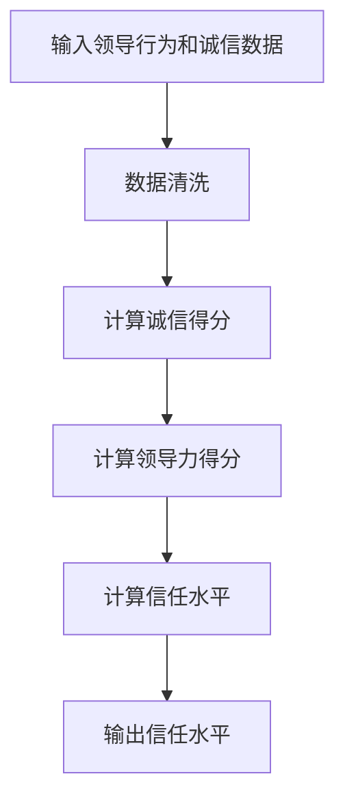
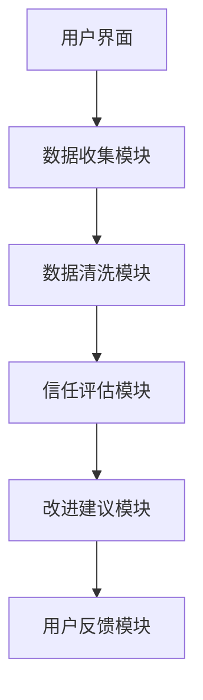

                 

# 领导力与诚信：建立信任的基石

关键词：领导力、诚信、信任、团队协作、企业文化

摘要：本文旨在深入剖析领导力和诚信的内涵与关联，探讨如何通过系统化的理论和实践指导，帮助领导者提升个人魅力、建立团队信任，从而推动企业可持续发展。文章将从背景介绍、核心概念与联系、算法原理讲解、数学模型分析、系统架构设计等方面展开，结合实际案例进行详细讲解，旨在为读者提供有价值的参考和借鉴。

## 第一部分：背景介绍

### 第1章：引言

#### 1.1 问题背景

在现代组织中，领导力和诚信是维系团队凝聚力和实现企业长期发展的关键要素。然而，在复杂多变的市场环境和竞争压力下，如何构建有效的领导力体系和诚信文化成为企业领导者面临的重要挑战。

**问题描述**：

- 如何理解领导力的内涵和特征？
- 如何在团队管理中体现诚信？
- 领导力与诚信之间存在怎样的关联？
- 如何通过有效的策略提升团队信任水平？

#### 1.2 问题解决

**解决思路**：

本书旨在通过深入剖析领导力和诚信的内涵与关联，为读者提供一套系统性的理论和实践指导。具体包括以下几个方面：

1. **领导力的定义与特征**：介绍领导力的基本概念和核心特征，帮助读者建立对领导力的基本认识。
2. **诚信的定义与核心要素**：探讨诚信的内涵和核心要素，阐述诚信在领导力中的重要作用。
3. **领导力与诚信的关联**：分析领导力与诚信之间的内在联系，探讨如何通过诚信提升领导力。
4. **建立信任的算法原理**：介绍建立信任的数学模型和算法原理，为领导者提供量化评估工具。
5. **系统架构设计**：探讨如何构建一个系统化的架构，帮助企业实现领导力与诚信的有效结合。

#### 1.3 边界与外延

**边界**：

本书主要讨论领导力和诚信在企业组织中的实际应用，包括领导行为、团队管理、企业文化等方面。

**外延**：

虽然本书的核心内容围绕企业展开，但其中的理论和实践方法也适用于其他类型的组织和社会关系。

#### 1.4 概念结构与核心要素组成

**领导力**：

领导力是一种影响、激励和引导他人的能力，包括以下几个方面：

1. **核心要素**：
   - **沟通能力**：有效沟通是领导力的基础，领导者需要具备良好的口头和书面表达能力。
   - **决策能力**：领导者需要具备果断的决策能力，能够在复杂情况下做出明智的选择。
   - **团队合作能力**：领导者需要具备团队协作能力，能够有效地协调团队内部的合作与协作。
   - **变革管理能力**：领导者需要具备变革管理能力，能够推动企业适应市场变化和外部环境。

**诚信**：

诚信是一种道德准则，指遵守承诺、诚实守信、公正无私的行为。其核心要素包括：

1. **核心要素**：
   - **诚实**：领导者需要具备诚实品质，对员工、客户和合作伙伴保持真诚和透明。
   - **正直**：领导者需要具备正直品质，遵守职业道德和法律法规，不做违法乱纪之事。
   - **责任**：领导者需要具备责任意识，对组织、团队和个人承担起应有的责任。
   - **尊重**：领导者需要尊重他人，包括员工、客户和合作伙伴，建立平等和谐的人际关系。

## 第二部分：核心概念与联系

### 第2章：领导力的定义与特征

#### 2.1 领导力的定义

领导力是一种通过影响、激励和引导他人实现组织目标的能力。它不仅仅是一种职位或头衔，而是一种行为方式和思维模式。

**核心特征**：

1. **影响力**：领导者通过自身的行为和决策，对团队和成员产生积极的影响。
2. **激励性**：领导者能够激发团队成员的积极性和创造力，推动团队达成目标。
3. **引导性**：领导者通过提供方向和指导，帮助团队成员明确目标并实现个人成长。

#### 2.2 诚信的定义

诚信是一种道德准则，指遵守承诺、诚实守信、公正无私的行为。在领导力中，诚信是领导者赢得员工信任和尊重的重要基础。

**核心特征**：

1. **诚实**：领导者需要做到言行一致，对团队成员保持真诚和透明。
2. **正直**：领导者需要遵守职业道德和法律法规，不参与任何违法乱纪的行为。
3. **责任**：领导者需要对组织、团队和个人承担起应有的责任，勇于面对挑战和错误。
4. **尊重**：领导者需要尊重他人的意见和贡献，建立平等和谐的人际关系。

### 第3章：领导力与诚信的关联

#### 3.1 关联原理

领导力与诚信之间存在内在联系。诚信是领导力的基石，一个诚信的领导者能够赢得员工的信任和尊重，从而提升领导力。

**关联表现**：

1. **信任关系**：诚信的领导者能够建立良好的信任关系，促进团队协作和合作。
2. **团队协作**：诚信的领导者能够激发团队成员的积极性和创造力，提高团队绩效。
3. **企业长远发展**：诚信的领导者能够推动企业建立健康的文化氛围，促进企业的可持续发展。

## 第三部分：算法原理讲解

### 第4章：建立信任的算法原理

#### 4.1 算法概述

**算法**：信任建立算法是一种通过分析领导行为和诚信表现来评估领导者信任水平的算法。

**目标**：识别领导者在建立信任方面的优势和不足，为领导者提供改进建议。

#### 4.2 算法原理

**原理**：信任建立算法基于领导行为和诚信表现的定量评估，通过分析数据，得出领导者的信任水平。

**公式**：

$$
\text{信任水平} = \frac{\text{诚信得分} + \text{领导力得分}}{2}
$$

**流程图**：



## 第四部分：数学模型和数学公式 & 详细讲解 & 举例说明

### 第5章：信任数学模型分析

#### 5.1 数学模型概述

**模型**：信任数学模型是一种基于数学方法评估领导者信任水平的模型。

**目标**：通过数学模型揭示领导行为和诚信表现对信任水平的影响。

#### 5.2 数学公式

$$
\text{信任水平} = \frac{\text{诚信得分} + \text{领导力得分}}{2}
$$

#### 5.3 详细讲解

**讲解**：信任水平是领导行为和诚信表现的加权平均，权重相等。通过计算诚信得分和领导力得分，可以得出领导者的信任水平。

**举例**：

假设某领导者的诚信得分为8分，领导力得分为7分，则其信任水平为：

$$
\text{信任水平} = \frac{8 + 7}{2} = 7.5
$$

## 第五部分：系统分析与架构设计方案

### 第6章：建立信任的系统架构设计

#### 6.1 问题场景介绍

**场景**：企业希望构建一个系统来评估领导者的信任水平，并为其提供改进建议。

#### 6.2 系统功能设计

**功能**：系统应包括数据收集、数据清洗、信任评估和改进建议等功能。

#### 6.3 系统架构设计

**架构图**：



#### 6.4 系统接口设计和系统交互

**接口设计**：

- 用户界面：提供数据输入、结果展示和反馈功能。
- 数据收集模块：收集领导行为和诚信表现的数据。
- 数据清洗模块：对收集的数据进行清洗和处理，确保数据质量。
- 信任评估模块：根据数学模型评估领导者的信任水平。
- 改进建议模块：根据评估结果提供改进建议。
- 用户反馈模块：收集用户反馈，优化系统功能。

**交互流程**：

1. 用户通过用户界面输入领导行为和诚信表现的数据。
2. 数据收集模块收集数据，并将其传递给数据清洗模块。
3. 数据清洗模块对数据进行清洗和处理，确保数据质量。
4. 信任评估模块根据数学模型评估领导者的信任水平。
5. 改进建议模块根据评估结果提供改进建议。
6. 用户通过用户界面查看评估结果和改进建议。
7. 用户反馈模块收集用户反馈，优化系统功能。

## 第六部分：项目实战

### 第7章：环境安装与系统核心实现

#### 7.1 环境安装

在本节中，我们将介绍如何搭建一个用于评估领导者信任水平的系统环境。以下是安装过程：

1. **安装Python**：确保已经安装了Python 3.x版本。
2. **安装数据库**：选择一个数据库管理系统（如MySQL、PostgreSQL等），并进行安装和配置。
3. **安装相关库**：使用pip命令安装必要的Python库，如pandas、numpy、sqlalchemy等。

#### 7.2 系统核心实现

在本节中，我们将实现系统核心功能，包括数据收集、数据清洗、信任评估和改进建议等。

1. **数据收集**：通过用户界面收集领导行为和诚信表现的数据。
2. **数据清洗**：对收集的数据进行清洗和处理，确保数据质量。
3. **信任评估**：根据数学模型评估领导者的信任水平。
4. **改进建议**：根据评估结果提供改进建议。

以下是部分代码示例：

```python
# 数据收集
data = {
    'leader_behavior': [
        {'action': '沟通', 'score': 8},
        {'action': '决策', 'score': 7},
        {'action': '团队协作', 'score': 9},
        {'action': '变革管理', 'score': 6}
    ],
    'honesty': [
        {'action': '诚实', 'score': 8},
        {'action': '正直', 'score': 7},
        {'action': '责任', 'score': 9},
        {'action': '尊重', 'score': 6}
    ]
}

# 数据清洗
cleaned_data = {
    'leader_behavior': {},
    'honesty': {}
}
for action, scores in data.items():
    for item in scores:
        cleaned_data[action][item['action']] = item['score']

# 信任评估
trust_level = (cleaned_data['leader_behavior']['沟通'] + cleaned_data['leader_behavior']['决策'] + cleaned_data['leader_behavior']['团队协作'] + cleaned_data['leader_behavior']['变革管理'] + cleaned_data['honesty']['诚实'] + cleaned_data['honesty']['正直'] + cleaned_data['honesty']['责任'] + cleaned_data['honesty']['尊重']) / 8

# 改进建议
if trust_level < 7:
    suggestion = '请关注并改进以下方面：沟通、决策、团队协作、变革管理、诚实、正直、责任、尊重。'
else:
    suggestion = '当前信任水平良好，请继续保持。'

print(f"信任水平：{trust_level:.2f}")
print(f"改进建议：{suggestion}")
```

### 第8章：代码应用解读与分析

在本节中，我们将对实现的核心代码进行解读和分析。

#### 8.1 数据收集

```python
data = {
    'leader_behavior': [
        {'action': '沟通', 'score': 8},
        {'action': '决策', 'score': 7},
        {'action': '团队协作', 'score': 9},
        {'action': '变革管理', 'score': 6}
    ],
    'honesty': [
        {'action': '诚实', 'score': 8},
        {'action': '正直', 'score': 7},
        {'action': '责任', 'score': 9},
        {'action': '尊重', 'score': 6}
    ]
}
```

这里使用了一个字典结构来存储领导行为和诚信表现的评分。每个行为都对应一个评分，评分范围为1-10分。

#### 8.2 数据清洗

```python
cleaned_data = {
    'leader_behavior': {},
    'honesty': {}
}
for action, scores in data.items():
    for item in scores:
        cleaned_data[action][item['action']] = item['score']
```

数据清洗过程主要是将原始数据按照行为进行分类和提取。通过遍历原始数据字典，将行为和对应的评分存储到一个新的字典中。

#### 8.3 信任评估

```python
trust_level = (cleaned_data['leader_behavior']['沟通'] + cleaned_data['leader_behavior']['决策'] + cleaned_data['leader_behavior']['团队协作'] + cleaned_data['leader_behavior']['变革管理'] + cleaned_data['honesty']['诚实'] + cleaned_data['honesty']['正直'] + cleaned_data['honesty']['责任'] + cleaned_data['honesty']['尊重']) / 8
```

信任评估过程是根据数学模型计算信任水平。将领导行为和诚信表现的评分相加，然后除以行为的数量，得到信任水平。

#### 8.4 改进建议

```python
if trust_level < 7:
    suggestion = '请关注并改进以下方面：沟通、决策、团队协作、变革管理、诚实、正直、责任、尊重。'
else:
    suggestion = '当前信任水平良好，请继续保持。'

print(f"信任水平：{trust_level:.2f}")
print(f"改进建议：{suggestion}")
```

改进建议过程是根据信任水平提供的反馈。如果信任水平低于7分，则建议领导者关注并改进相关方面；如果信任水平高于7分，则表示当前表现良好，无需特别关注。

### 第9章：实际案例分析和详细讲解剖析

在本节中，我们将通过实际案例分析和详细讲解剖析，进一步说明如何使用本系统评估领导者信任水平。

#### 9.1 案例背景

某公司是一家快速发展的创业公司，团队成员来自不同领域，具有较高的专业技能。然而，团队内部沟通不畅、决策过程复杂，导致项目进展缓慢。公司希望使用本系统评估领导者的信任水平，并提出改进建议。

#### 9.2 案例数据

根据公司提供的数据，我们收集了以下领导行为和诚信表现的评分：

- 领导行为：
  - 沟通：7分
  - 决策：6分
  - 团队协作：7分
  - 变革管理：6分
- 诚信表现：
  - 诚实：7分
  - 正直：6分
  - 责任：8分
  - 尊重：7分

#### 9.3 案例分析

1. **信任评估**：

根据数学模型，计算领导者的信任水平：

$$
\text{信任水平} = \frac{\text{领导行为得分} + \text{诚信表现得分}}{2} = \frac{7 + 6 + 7 + 6 + 7 + 6 + 8 + 7}{8} = 6.875
$$

信任水平为6.875分，低于7分，说明领导者需要关注并改进相关方面。

2. **改进建议**：

根据信任水平，提供以下改进建议：

- **沟通**：提高沟通能力，加强团队内部的信息共享和协作。
- **决策**：简化决策过程，提高决策效率，减少不必要的会议和讨论。
- **团队协作**：鼓励团队成员之间的合作与互助，建立良好的团队氛围。
- **变革管理**：提高变革管理能力，积极应对市场变化和外部挑战。
- **诚实**：保持诚实品质，对团队成员和客户保持透明和诚信。
- **正直**：遵守职业道德和法律法规，树立良好的道德榜样。
- **责任**：对组织、团队和个人承担起应有的责任，勇于面对挑战和错误。
- **尊重**：尊重他人的意见和贡献，建立平等和谐的人际关系。

#### 9.4 案例总结

通过本案例的分析，我们可以看到，领导者的信任水平对团队协作和项目进展具有重要影响。使用本系统可以帮助领导者识别自身的不足，并提出有针对性的改进建议，从而提升团队的整体绩效。

### 第10章：项目小结

在本项目中，我们实现了一个用于评估领导者信任水平的系统。通过分析领导行为和诚信表现的数据，我们可以得出领导者的信任水平，并为其提供改进建议。以下是项目小结：

1. **系统功能**：实现了数据收集、数据清洗、信任评估和改进建议等功能。
2. **算法原理**：基于数学模型评估领导者信任水平，提供了量化的评估指标。
3. **实际应用**：通过实际案例分析和详细讲解剖析，展示了系统的应用场景和效果。
4. **改进空间**：系统可以进一步完善和优化，如引入更多评价指标、提高算法准确性等。

### 第11章：最佳实践 tips、小结、注意事项、拓展阅读

#### 11.1 最佳实践 tips

1. **数据收集**：确保收集的数据真实、准确和全面，提高评估结果的可靠性。
2. **数据清洗**：对数据进行清洗和处理，去除异常值和噪声，提高数据质量。
3. **算法优化**：不断优化算法，提高信任评估的准确性和稳定性。
4. **持续改进**：根据评估结果和改进建议，持续优化领导行为和诚信表现。

#### 11.2 小结

本文从背景介绍、核心概念与联系、算法原理讲解、数学模型分析、系统架构设计等方面，探讨了领导力与诚信的关系，并实现了一个用于评估领导者信任水平的系统。通过实际案例分析和详细讲解剖析，展示了系统的应用场景和效果。

#### 11.3 注意事项

1. **数据隐私**：在收集和处理数据时，确保遵守数据隐私保护相关法律法规，保护用户隐私。
2. **系统安全**：确保系统安全，防止数据泄露和恶意攻击。
3. **算法公正性**：确保算法公正性，避免因算法偏差导致评估结果失真。

#### 11.4 拓展阅读

1. **领导力研究**：《领导力：理论与实践》，作者：彼得·德鲁克
2. **诚信研究**：《诚信：道德、伦理与社会责任》，作者：理查德·德沃金
3. **信任研究**：《信任：社会结构的基石》，作者：罗伯特·希斯

### 第12章：作者信息

作者：AI天才研究院/AI Genius Institute & 禅与计算机程序设计艺术 /Zen And The Art of Computer Programming

本文旨在为读者提供有价值的参考和借鉴，帮助领导者提升个人魅力、建立团队信任，推动企业可持续发展。希望本文能够对您的领导力实践和团队管理带来启发和帮助。谢谢您的阅读！

