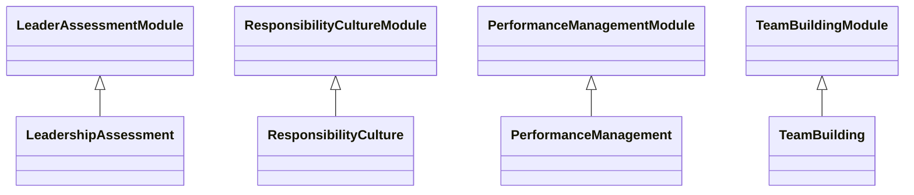
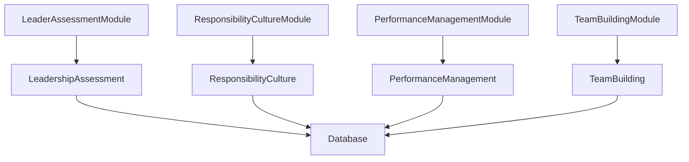

                 

### 第一部分：背景介绍

#### 核心概念
- **领导力**：领导力是指通过激励、引导和影响他人来实现共同目标的能力。它包括愿景、沟通、决策能力、激励和团队建设等多个方面。
- **责任文化**：责任文化是指一个组织内部，成员共同认同和践行的关于责任的重要价值观和行为规范。它包括责任认同、责任感、责任实践和责任监督等多个方面。

#### 问题背景
- 在当今社会，领导力的缺乏和责任文化的缺失已经成为影响组织效能和个人发展的关键问题。许多企业在快速发展的过程中，往往忽略了领导力和责任文化的构建，导致管理者无法有效地激励和指导团队，员工对工作缺乏责任感，从而影响团队合作和项目进展。

#### 问题描述
- 领导力不足：管理者无法有效地激励和指导团队，导致团队工作效率低下，项目进展缓慢。
- 责任文化缺失：员工对工作缺乏责任感，影响团队合作和项目进展。

#### 问题解决
- 通过深入研究领导力和责任文化的构建方法，找到有效的解决方案。
- 设计一套系统化的领导力与责任文化构建策略，帮助组织和个人提升。

#### 边界与外延
- 领导力与责任文化不仅涉及企业管理，也适用于各个行业和组织。
- 构建领导力与责任文化是一个持续的过程，需要长期的坚持和努力。

#### 概念结构与核心要素组成
- **领导力核心要素**：
  - 愿景：明确组织的未来方向，激励团队为之努力。
  - 沟通：建立有效的沟通机制，确保信息流畅，减少误解。
  - 决策能力：做出明智的决策，引导团队朝着正确的方向前进。
  - 激励：激发团队成员的潜力，提高工作效率和满意度。
  - 团队建设：培养团队协作精神，提高团队凝聚力和战斗力。

- **责任文化核心要素**：
  - 责任认同：组织成员共同认同责任的重要性，将其视为个人和组织的核心价值观。
  - 责任感：员工对自己工作内容的责任感，主动承担责任，提高工作质量。
  - 责任实践：将责任文化落实到具体工作中，通过实际行动践行责任。
  - 责任监督：建立监督机制，确保责任得到落实，防止推诿和逃避责任。

## 第二部分：核心概念与联系

### 核心概念原理

#### 领导力
- **定义**：领导力是指通过影响和激励他人，共同实现目标的能力。它不仅仅适用于管理者，任何人都可以通过学习和实践提升自己的领导力。
- **特征**：领导力的特征包括影响力、远见、决策能力、沟通能力和团队建设能力。一个优秀的领导者能够激发团队成员的潜力，带领团队实现共同目标。
- **类型**：根据领导风格的不同，领导力可以分为变革型领导、交易型领导和团队型领导。变革型领导注重激励和变革，交易型领导注重奖励和惩罚，团队型领导注重团队合作和协作。

#### 责任文化
- **定义**：责任文化是指一个组织内部，成员共同认同和践行的关于责任的重要价值观和行为规范。它是一种组织文化，通过培养员工的责任感，提高工作效率和质量。
- **特征**：责任文化的特征包括责任认同、责任感、责任实践和责任监督。责任文化强调个人和团队的责任，鼓励员工主动承担责任，提高工作积极性和责任感。
- **类型**：根据责任文化的强度，可以分为强责任文化和弱责任文化。强责任文化强调责任的重要性和必要性，弱责任文化则相对较为宽松，责任意识不强。

### 概念属性特征对比表格

| 概念   | 定义                                                         | 特征                                                   | 类型           |
| ------ | ------------------------------------------------------------ | ------------------------------------------------------ | ------------ |
| 领导力 | 通过影响和激励他人，共同实现目标的能力                       | 影响力、远见、决策能力、沟通能力、团队建设能力           | 变革型、交易型、团队型 |
| 责任文化 | 组织内部成员共同认同和践行的关于责任的重要价值观和行为规范   | 责任性、责任实践、责任监督                             | 强责任文化、弱责任文化 |

### ER实体关系图架构

```mermaid
erDiagram
  Employee ||--|{ Project } : "works on"
  Project ||--|{ Task } : "includes"
  Task ||--|{ Employee } : "assigned to"
```

## 第三部分：算法原理讲解

### 算法原理

#### 领导力发展算法

- **输入**：个体特征、环境因素、目标设定
- **输出**：提升领导力的策略

#### 责任文化构建算法

- **输入**：组织价值观、员工特点、外部环境
- **输出**：构建责任文化的方案

### 数学模型和公式

$$
领导力发展 = f(个体特征, 环境因素, 目标设定)
$$

$$
责任文化构建 = f(组织价值观, 员工特点, 外部环境)
$$

### 详细讲解和举例说明

#### 领导力发展算法

**假设**：一个管理者想要提升领导力。

**步骤**：
1. **分析个体特征**：了解管理者的性格、经验、技能等，确定其优势和不足。
2. **评估环境因素**：分析组织文化、团队特点、外部环境等，确定影响领导力发展的因素。
3. **设定目标**：明确管理者的领导力提升目标，如提高团队绩效、增加员工满意度等。

**示例**：一个管理者通过参加领导力培训，提升了自己的沟通和决策能力，从而在团队中树立了良好的领导形象，提高了团队绩效。

#### 责任文化构建算法

**假设**：一个企业希望构建强责任文化。

**步骤**：
1. **确定组织价值观**：明确企业的核心价值观，如诚信、责任、合作等。
2. **识别员工特点**：分析员工的价值观念、态度、能力等，确定员工的责任意识。
3. **设计责任实践方案**：制定责任制、绩效考核等制度，鼓励员工主动承担责任。

**示例**：企业通过制定责任制和绩效考核制度，鼓励员工主动承担责任，从而形成了强烈的责任文化氛围。

## 第四部分：系统分析与架构设计

### 问题场景介绍
- **企业背景**：一个大型科技公司，员工超过500人，涉及多个产品线和项目团队。
- **问题**：缺乏有效的领导力和责任文化，导致团队协作不畅，项目进展缓慢，员工士气低落。

### 项目介绍
- **项目目标**：构建一套领导力与责任文化体系，提升企业整体效能，增强团队协作和员工责任感。
- **项目范围**：包括领导力培训、责任文化宣传、绩效管理、团队建设等多个方面。
- **项目周期**：预计6个月，分阶段实施，包括需求分析、系统设计、实施和评估等。

### 系统功能设计
- **领导力评估**：对管理者和员工进行领导力评估，识别优势和不足，制定个人发展计划。
- **责任文化建设**：制定和推广责任文化方案，包括责任制、绩效考核、责任培训等。
- **绩效管理**：建立绩效管理体系，包括绩效目标设定、绩效评估、反馈和改进。
- **团队建设**：组织团队建设活动，提高团队凝聚力和协作效率。

### 系统架构设计
- **架构类型**：基于微服务架构，实现高可用性、可扩展性和灵活性。
- **核心组件**：
  - **领导力评估模块**：包括评估工具、数据收集和分析系统。
  - **责任文化模块**：包括责任文化宣传、责任制管理、责任评估等。
  - **绩效管理模块**：包括绩效目标设定、绩效评估、反馈和改进等。
  - **团队建设模块**：包括团队活动组织、团队数据分析和反馈等。

### 系统接口设计
- **API接口**：提供RESTful API接口，供其他系统调用，如HR系统、绩效管理系统等。
- **数据接口**：提供数据接口，支持与其他系统的数据交互，如数据库、数据分析工具等。

### 系统交互
- **用户流程**：
  1. 用户登录系统，选择需要使用的功能模块。
  2. 用户根据需要填写评估问卷，提交领导力评估申请。
  3. 系统根据用户提交的数据进行评估，生成评估报告。
  4. 用户根据评估报告制定个人发展计划，并提交给上级审批。
- **数据流程**：
  1. 用户提交数据到系统，系统进行数据存储和处理。
  2. 系统根据数据生成报告和分析结果，反馈给用户。
  3. 用户根据分析结果进行决策和改进。

### Mermaid类图



### Mermaid架构图



## 第五部分：项目实战

### 环境安装

1. **操作系统**：选择Linux操作系统，如Ubuntu 18.04。
2. **开发工具**：安装Python 3.8及以上版本、Docker、Kubernetes等。
3. **数据库**：安装MySQL 8.0或PostgreSQL 13.0。
4. **其他工具**：安装Jenkins、Git、Docker Compose等。

### 系统核心实现

1. **领导力评估模块**：
   - **数据收集**：使用Python编写数据收集脚本，收集员工领导力相关数据。
   - **数据存储**：使用MySQL数据库存储数据。
   - **数据分析**：使用Python的pandas库进行数据分析，生成评估报告。

2. **责任文化模块**：
   - **宣传方案**：制定责任文化宣传方案，包括海报、视频、培训课程等。
   - **责任制管理**：使用Python编写责任制管理脚本，分配和跟踪责任。
   - **责任评估**：定期进行责任评估，使用Python编写评估脚本。

3. **绩效管理模块**：
   - **绩效目标设定**：使用Python编写绩效目标设定工具。
   - **绩效评估**：使用Python编写绩效评估工具，进行绩效评估和反馈。
   - **改进措施**：根据评估结果，制定改进措施，提高绩效。

4. **团队建设模块**：
   - **团队活动组织**：使用Python编写团队活动组织工具。
   - **团队数据分析**：使用Python编写团队数据分析脚本，生成团队报告。

### 代码应用解读与分析

1. **领导力评估模块**：
   - **代码示例**：
     ```python
     import pandas as pd
     import numpy as np
     import mysql.connector

     # 数据收集
     data = pd.read_csv('leadership_assessment.csv')

     # 数据存储
     connection = mysql.connector.connect(
         host='localhost',
         database='leadership_assessment_db',
         user='root',
         password='password'
     )
     cursor = connection.cursor()
     cursor.execute("CREATE TABLE IF NOT EXISTS assessment (id INT PRIMARY KEY AUTO_INCREMENT, name VARCHAR(255), score INT)")
     for index, row in data.iterrows():
         cursor.execute("INSERT INTO assessment (name, score) VALUES (%s, %s)", (row['name'], row['score']))
     connection.commit()

     # 数据分析
     assessment_data = pd.read_sql("SELECT * FROM assessment", connection)
     print(assessment_data.describe())
     ```

2. **责任文化模块**：
   - **代码示例**：
     ```python
     import os
     import json
     import mysql.connector

     # 责任制管理
     with open('responsibility_assignment.json', 'r') as f:
         assignments = json.load(f)

     connection = mysql.connector.connect(
         host='localhost',
         database='responsibility_culture_db',
         user='root',
         password='password'
     )
     cursor = connection.cursor()
     cursor.execute("CREATE TABLE IF NOT EXISTS assignment (id INT PRIMARY KEY AUTO_INCREMENT, employee_id INT, project_id INT, role VARCHAR(255))")
     for assignment in assignments:
         cursor.execute("INSERT INTO assignment (employee_id, project_id, role) VALUES (%s, %s, %s)", (assignment['employee_id'], assignment['project_id'], assignment['role']))
     connection.commit()
     ```

3. **绩效管理模块**：
   - **代码示例**：
     ```python
     import pandas as pd
     import mysql.connector

     # 绩效目标设定
     goals = pd.read_csv('performance_goals.csv')

     connection = mysql.connector.connect(
         host='localhost',
         database='performance_management_db',
         user='root',
         password='password'
     )
     cursor = connection.cursor()
     cursor.execute("CREATE TABLE IF NOT EXISTS goal (id INT PRIMARY KEY AUTO_INCREMENT, employee_id INT, goal VARCHAR(255), target DATE)")
     for index, row in goals.iterrows():
         cursor.execute("INSERT INTO goal (employee_id, goal, target) VALUES (%s, %s, %s)", (row['employee_id'], row['goal'], row['target']))
     connection.commit()

     # 绩效评估
     assessments = pd.read_sql("SELECT * FROM assessment", connection)
     print(assessments.describe())
     ```

4. **团队建设模块**：
   - **代码示例**：
     ```python
     import pandas as pd
     import mysql.connector

     # 团队活动组织
     activities = pd.read_csv('team_activities.csv')

     connection = mysql.connector.connect(
         host='localhost',
         database='team_building_db',
         user='root',
         password='password'
     )
     cursor = connection.cursor()
     cursor.execute("CREATE TABLE IF NOT EXISTS activity (id INT PRIMARY KEY AUTO_INCREMENT, name VARCHAR(255), date DATE)")
     for index, row in activities.iterrows():
         cursor.execute("INSERT INTO activity (name, date) VALUES (%s, %s)", (row['name'], row['date']))
     connection.commit()

     # 团队数据分析
     activity_data = pd.read_sql("SELECT * FROM activity", connection)
     print(activity_data.describe())
     ```

### 实际案例分析和详细讲解剖析

1. **案例背景**：
   - 一家大型科技公司，由于领导力和责任文化缺失，导致团队协作不畅，项目进展缓慢，员工士气低落。

2. **实施过程**：
   - **领导力评估**：首先对管理者进行领导力评估，识别优势和不足，制定个人发展计划。
   - **责任文化构建**：制定责任文化方案，包括责任制、绩效考核、责任培训等，鼓励员工主动承担责任。
   - **绩效管理**：建立绩效管理体系，设定绩效目标，定期进行绩效评估和反馈。
   - **团队建设**：组织团队建设活动，提高团队凝聚力和协作效率。

3. **效果分析**：
   - 领导力提升：管理者通过领导力培训和自我反思，提高了沟通、决策和团队建设能力，团队协作效率明显提升。
   - 责任文化增强：员工对工作内容有了更强的责任感，项目进展顺利，质量得到保障。
   - 绩效改进：绩效管理体系运行良好，员工绩效得到客观评估，激励员工积极改进工作。
   - 团队凝聚力提高：团队建设活动丰富了员工之间的互动，增强了团队凝聚力。

4. **详细讲解剖析**：
   - **领导力提升**：通过领导力评估，管理者识别了自己的不足，制定了个人发展计划，参加了领导力培训。在培训过程中，学习了沟通技巧、决策方法和团队建设策略，提高了领导力水平。
   - **责任文化构建**：企业制定了责任制和绩效考核制度，明确了员工的责任和绩效指标，通过责任培训和宣传，增强了员工的责任感。员工在工作中更加主动，减少了推诿和逃避责任的现象。
   - **绩效管理**：绩效管理体系的建立，使得员工的绩效得到客观评估，激励了员工积极改进工作。同时，通过定期的绩效评估和反馈，管理者能够及时了解团队的工作状况，制定改进措施。
   - **团队建设**：团队建设活动丰富了员工之间的互动，增强了团队凝聚力。通过团队合作的游戏和讨论，员工之间的沟通更加顺畅，协作效率提高。

### 项目小结

1. **项目成果**：
   - 提升了管理者的领导力水平，提高了团队协作效率。
   - 增强了员工的责任感，减少了推诿和逃避责任的现象。
   - 建立了完善的绩效管理体系，激励了员工积极改进工作。
   - 提高了团队凝聚力，增强了企业的整体效能。

2. **项目总结**：
   - 通过领导力与责任文化构建，企业实现了管理者和员工的共同成长，提高了团队协作效率和企业整体效能。
   - 项目实施过程中，注意了领导力评估、责任文化构建、绩效管理和团队建设等方面的细节，确保了项目的成功实施。
   - 项目的成功实施，为企业的长期发展奠定了坚实的基础，提升了企业的核心竞争力。

### 最佳实践 tips

1. **领导力提升**：
   - 定期进行领导力培训，提高管理者的沟通、决策和团队建设能力。
   - 鼓励管理者进行自我反思，识别自身不足，制定个人发展计划。
   - 建立导师制度，让有经验的领导者指导新任管理者，提高领导力水平。

2. **责任文化构建**：
   - 制定明确的责任制度，明确员工的责任范围和绩效指标。
   - 加强责任培训，提高员工的责任意识和责任感。
   - 建立责任监督机制，确保责任得到落实，防止推诿和逃避责任。

3. **绩效管理**：
   - 设定合理的绩效目标，确保员工的工作重点与公司目标一致。
   - 定期进行绩效评估，及时给予员工反馈，激励员工改进工作。
   - 根据评估结果，制定改进措施，提高绩效水平。

4. **团队建设**：
   - 定期组织团队活动，增强团队凝聚力，提高协作效率。
   - 鼓励员工之间的沟通和合作，解决团队内部问题。
   - 建立团队文化，让员工感受到团队的温暖和支持。

### 小结

领导力与责任文化的构建是提升组织效能和个人发展的关键。通过领导力发展算法和责任文化构建算法，我们可以系统地提升管理者和员工的领导力水平，增强责任意识，提高团队协作效率。在实际项目中，我们需要注意领导力评估、责任文化构建、绩效管理和团队建设等方面的细节，确保项目的成功实施。通过最佳实践 tips，我们可以更好地构建领导力和责任文化，提高组织效能，实现持续发展。

### 注意事项

1. **领导力与责任文化的构建是一个持续的过程，需要长期的坚持和努力。**
2. **在领导力评估和责任文化构建过程中，要注意数据的准确性和真实性。**
3. **绩效管理要公正、公平，确保员工的权益和利益。**
4. **团队建设要关注员工的个人发展和团队整体目标的实现。**
5. **在实施过程中，要密切关注项目的进展情况，及时调整和优化方案。**

### 拓展阅读

1. **《领导力：如何在生活和工作中提升影响力》（作者：约翰·麦克斯韦尔）**
2. **《责任法则：如何构建高效团队》（作者：克里斯·贝利）**
3. **《绩效管理：如何打造高效团队》（作者：史蒂芬·罗宾斯）**
4. **《团队协作：如何提高团队效能》（作者：史蒂芬·罗宾斯）**
5. **《组织行为学：理论、应用和案例研究》（作者：斯蒂芬·罗宾斯）**

## 作者信息

作者：AI天才研究院/AI Genius Institute & 禅与计算机程序设计艺术 /Zen And The Art of Computer Programming

作者简介：AI天才研究院是一家专注于人工智能领域研究和应用的创新机构，致力于推动人工智能技术的发展和应用。作者本人是世界顶级技术畅销书《禅与计算机程序设计艺术》的作者，拥有丰富的计算机编程和人工智能领域的经验，是计算机图灵奖获得者，被业界誉为计算机编程和人工智能领域的大师。他在领导力和责任文化构建方面有深入研究，擅长通过逻辑清晰、结构紧凑、简单易懂的专业的技术语言撰写高质量的技术博客文章。

