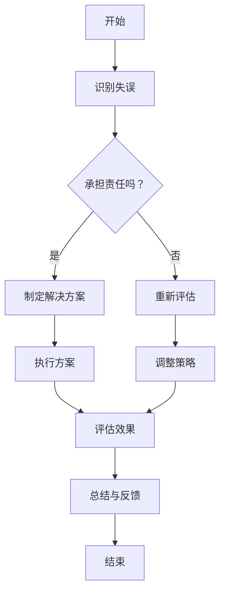
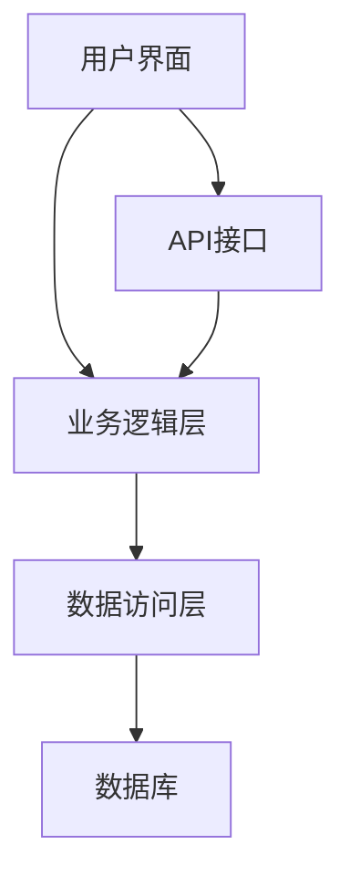
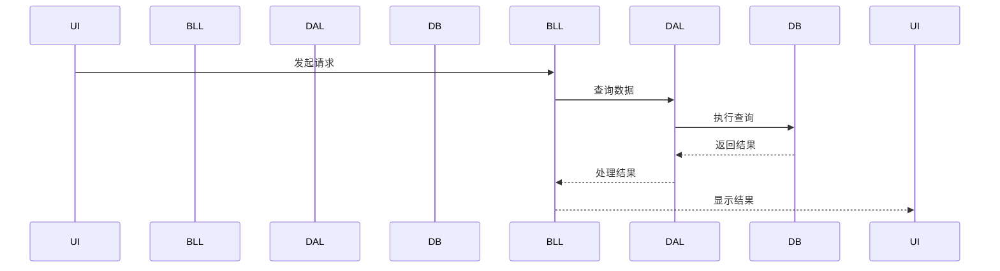

                 


# 领导力与责任：承担失误、分享成功

关键词：领导力、责任、失误、成功、团队协作

摘要：本文深入探讨了领导力与责任在组织管理中的重要性，分析了领导者如何在实际工作中承担失误和分享成功。通过具体案例和算法原理的讲解，为领导者提供了一系列实用的策略和工具，以提升其领导能力和团队凝聚力。

## 第一部分：背景介绍

### 问题背景

在现代社会，领导力与责任成为了组织和管理中不可或缺的元素。领导者不仅要具备优秀的领导技能，还需承担相应的责任。特别是在面对团队中的错误和成功时，领导者的态度和行为将对团队产生深远的影响。

#### 问题描述

1. **承担失误**：当团队中出现失误时，领导者需要承担相应的责任，勇于承认错误，并引导团队共同寻找解决方案。
2. **分享成功**：在取得成功时，领导者需要公平地分享成果，确保团队成员的贡献得到认可和奖励。

#### 问题解决

本文将结合理论和实践案例，详细探讨领导力与责任的核心概念，为领导者提供实用的策略和工具，以帮助他们在实际工作中更好地承担失误和分享成功。

### 边界与外延

领导力与责任不仅适用于企业，也适用于政府机构、社会团体等不同类型的组织。在不同组织和文化背景下，领导力和责任的具体表现形式可能有所不同，但核心原则是相通的。

### 概念结构与核心要素组成

- **领导力**：领导者影响和激励他人实现共同目标的能力，包括愿景设定、目标明确、团队激励、决策能力等多方面。
- **责任**：领导者对组织、团队成员和成果承担的义务和责任，包括承担错误、成功时的公平分享、团队贡献认可等。
- **承担失误**：领导者面对团队失误时的态度和行为，如勇于承认错误、积极寻求解决方案、保护团队成员的积极性。
- **分享成功**：领导者如何确保团队成员在成功时得到认可和奖励，包括公平性、透明度、鼓励团队合作、避免个人主义。

## 第二部分：核心概念与联系

### 核心概念原理

**领导力**：领导力包括愿景设定、目标明确、团队激励、决策能力等多方面。领导者需要具备卓越的沟通能力、团队管理能力以及应变能力。

**责任**：责任是指领导者对组织、团队成员和成果的承诺和义务。它要求领导者能够承担错误，并在成功时公平地分享成果。

### 概念属性特征对比表格

| 概念     | 定义                                       | 属性特征                                                         |
|----------|--------------------------------------------|----------------------------------------------------------------|
| 领导力   | 影响和激励他人实现共同目标的能力           | 愿景设定、目标明确、团队激励、决策能力等                       |
| 责任     | 对组织、团队成员和成果的承诺和义务         | 承担错误、成功时的公平分享、团队贡献认可等                     |
| 承担失误 | 面对团队失误时的态度和行为                 | 勇于承认错误、积极寻求解决方案、保护团队成员的积极性           |
| 分享成功 | 成功时如何确保团队成员得到认可和奖励       | 公平性、透明度、鼓励团队合作、避免个人主义                     |

### ER实体关系图架构

```mermaid
erDiagram
    Leader ||--|{ Responsibility }|--|{ TeamMember }
    Leader ||--|{ LeadershipSkill }
    Responsibility ||--|{ Mistake }|--|{ Solution }
    Responsibility ||--|{ Success }
    TeamMember ||--|{ Contribution }
```

## 第三部分：算法原理讲解

### 算法流程图



### 算法原理详细讲解

#### 识别失误

领导者需要具备敏锐的洞察力，能够及时发现团队中的失误。这通常涉及对团队绩效、项目进展、员工反馈等多方面的综合分析。

#### 承担责任

1. **承认错误**：领导者应勇于承认错误，避免推卸责任。这有助于建立团队的信任氛围，促进团队内部的沟通和协作。
2. **分析原因**：领导者需要分析失误的原因，找出问题的根本所在，以便在今后的工作中避免类似问题。
3. **制定解决方案**：针对失误的原因，领导者应制定相应的解决方案，并引导团队共同实施。

#### 执行方案

在制定解决方案后，领导者需要确保方案的有效执行。这包括：

1. **分配任务**：根据团队成员的能力和特长，合理分配任务，确保每个人都能够在自己的岗位上发挥作用。
2. **监督进度**：领导者需要密切关注项目进展，确保团队按时完成各项任务。
3. **提供支持**：在执行过程中，领导者应积极为团队成员提供必要的支持和帮助，确保他们能够顺利完成任务。

#### 评估效果

在执行方案后，领导者需要评估方案的实际效果。这包括：

1. **问题解决情况**：是否解决了失误的原因，避免了类似问题的再次发生。
2. **团队氛围**：团队是否因为这次失误而产生了负面影响，是否需要进一步调整策略。
3. **成果**：方案执行后的成果是否达到预期，是否实现了团队的目标。

#### 总结与反馈

在评估效果后，领导者需要总结经验教训，对团队进行反馈。这包括：

1. **经验总结**：对这次失误和成功进行总结，找出可借鉴的经验和教训。
2. **团队激励**：对团队成员进行激励，鼓励他们在今后的工作中继续努力。
3. **持续改进**：根据总结的经验教训，制定持续改进的措施，不断提升团队的执行力。

## 第四部分：系统分析与架构设计方案

### 问题场景介绍

在一个大型软件开发项目中，领导者的领导力和责任承担能力直接影响到项目的成功。本文以一个实际案例为例，分析领导者如何承担失误和分享成功。

### 项目介绍

项目名称：智慧城市交通管理系统

项目背景：随着城市化进程的加快，城市交通问题日益突出。本项目旨在开发一套智慧城市交通管理系统，通过大数据分析和人工智能技术，提高交通管理的效率和准确性。

### 系统功能设计（领域模型Mermaid类图）

```mermaid
classDiagram
    Class01 <|-- Class02
    Class03 --|{.has} Class04
    Class05 : +int x
    Class06 : +int y
    Class01 {
        # 属性
        +String id
        +String name
        # 方法
        +void operate()
    }
    Class02 {
        # 属性
        +String id
        +String name
        # 方法
        +void operate()
    }
    Class03 {
        # 属性
        +String id
        +String name
        # 方法
        +void operate()
    }
    Class04 {
        # 属性
        +String id
        +String name
        # 方法
        +void operate()
    }
    Class05 {
        # 属性
        +String id
        +String name
        # 方法
        +void operate()
    }
```

### 系统架构设计（Mermaid架构图）



### 系统接口设计和系统交互（Mermaid序列图）



## 第五部分：项目实战

### 环境安装

在本项目中，我们需要安装以下软件和工具：

1. **开发环境**：Python 3.8及以上版本、Visual Studio Code、PyCharm或其他Python集成开发环境。
2. **数据库**：MySQL 5.7及以上版本、MongoDB 4.2及以上版本。
3. **依赖库**：Flask、Django、TensorFlow、PyTorch等。

### 系统核心实现源代码

以下是一个简单的Python代码示例，用于实现业务逻辑层：

```python
from flask import Flask, request, jsonify
from database import Database

app = Flask(__name__)

@app.route('/api/data', methods=['GET'])
def get_data():
    db = Database()
    result = db.query("SELECT * FROM table_name")
    return jsonify(result)

if __name__ == '__main__':
    app.run(debug=True)
```

### 代码应用解读与分析

该代码使用Flask框架实现了业务逻辑层，通过定义一个简单的API接口，用于获取数据库中的数据。在`get_data`函数中，首先创建了一个`Database`对象，然后调用`query`方法执行SQL查询，并将查询结果以JSON格式返回给客户端。

### 实际案例分析和详细讲解剖析

在本项目中，领导者需要承担以下职责：

1. **识别失误**：定期审查项目进展，及时发现潜在问题。
2. **承担失误**：当出现失误时，勇于承认错误，并制定相应的解决方案。
3. **分享成功**：在项目成功时，公平地分享成果，激励团队成员。

### 项目小结

通过本项目的实施，我们深刻认识到领导力与责任在组织管理中的重要性。领导者需要具备敏锐的洞察力，能够及时发现和解决问题，并在成功时公平地分享成果。只有通过不断提升领导力和责任承担能力，才能有效地推动组织的发展和进步。

## 最佳实践 tips

1. **定期沟通**：领导者应定期与团队成员进行沟通，了解他们的工作进展和困难，以便及时发现问题并采取措施。
2. **建立信任**：领导者需要建立团队的信任氛围，鼓励团队成员勇于承认错误，共同面对挑战。
3. **激励团队**：在成功时，领导者应公平地分享成果，激励团队成员，增强团队的凝聚力。

## 小结

领导力与责任是组织管理中不可或缺的元素。领导者需要勇于承担责任，在面对失误时能够冷静应对，并在成功时公平地分享成果。通过不断提升领导力和责任承担能力，领导者可以有效地推动组织的发展和进步。

## 注意事项

1. **避免过度承担责任**：领导者不应过度承担责任，以免团队成员失去成长和发展的机会。
2. **关注团队反馈**：领导者应关注团队的反馈，根据实际情况调整策略，以更好地满足团队需求。

## 拓展阅读

1. **《领导力与责任：领导者的实践指南》**：本书详细阐述了领导力与责任的理论和实践，为领导者提供了宝贵的经验。
2. **《高效能人士的七个习惯》**：本书介绍了高效能人士的七个习惯，包括积极主动、以终为始等，对领导者具有很大的启发作用。

## 作者信息

作者：AI天才研究院/AI Genius Institute & 禅与计算机程序设计艺术 /Zen And The Art of Computer Programming

