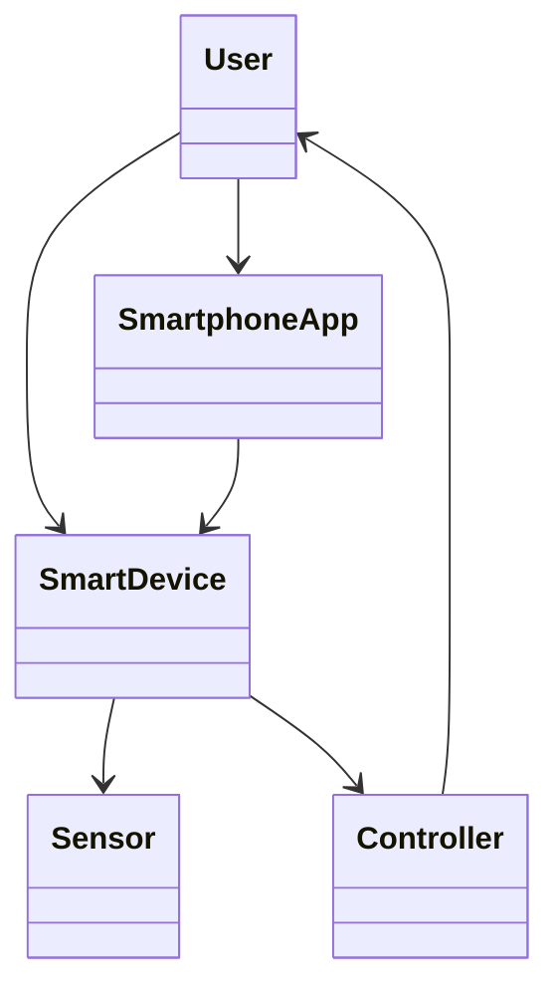
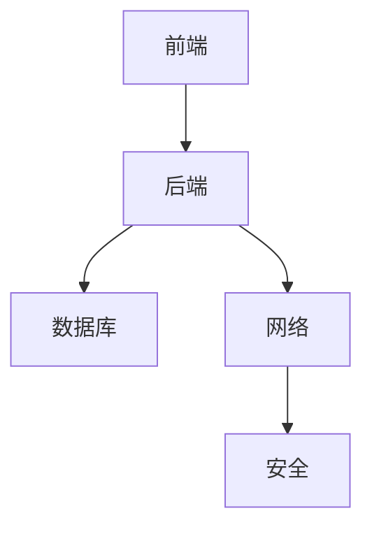
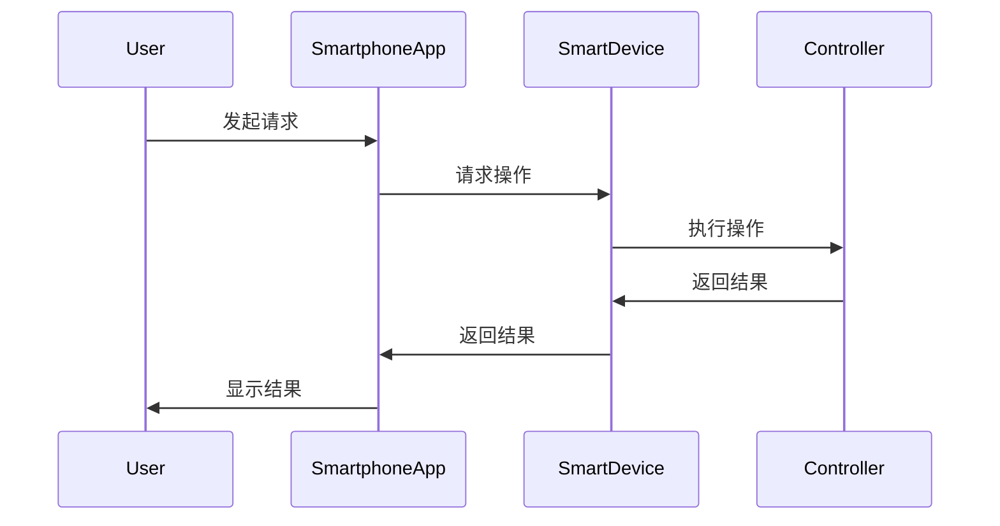
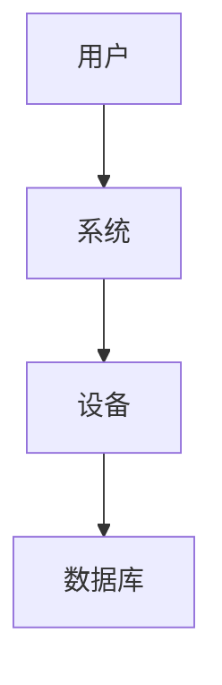

                 

### 文章标题

# 领导力与远见卓识培养：战略思维的锻炼方法

## 文章关键词

- 领导力
- 远见卓识
- 战略思维
- 锻炼方法
- 算法
- 数学模型
- 创新思维
- 决策分析

## 摘要

在当今快速变化和竞争激烈的环境中，领导力和远见卓识成为企业成功的关键。本文将深入探讨领导力和远见卓识的定义、重要性及其培养方法。我们将聚焦于战略思维的锻炼，通过逻辑思维训练、决策分析技巧、创新思维培养和情景模拟与策略制定等多方面，提供具体的方法和步骤，帮助读者提升战略思维能力，成为更具远见和领导力的领导者。

----------------------------------------------------------------

### 背景介绍

#### 核心概念术语说明

在探讨领导力与远见卓识之前，我们需要明确一些核心概念的术语。

- **领导力**：领导力是指影响和激励他人共同实现目标的能力。它不仅仅涉及管理团队，更包括塑造组织文化和引领变革的能力。
- **远见卓识**：远见卓识是指具备前瞻性和洞察力，能够在复杂环境中预见未来趋势和潜在机会，从而制定出有效的战略。
- **战略思维**：战略思维是一种系统思考能力，它涉及对组织内外部环境的分析，以及对长远目标的规划和执行。

#### 问题背景

在当前全球经济快速变化、技术创新不断推进的背景下，企业面临着前所未有的挑战。市场竞争日益激烈，客户需求变化迅速，技术更新迭代加快。在这种环境下，领导者和决策者需要具备卓越的战略思维能力，以应对复杂多变的局势。

#### 问题描述

如何培养领导力和远见卓识？如何提升战略思维能力，从而在激烈的市场竞争中脱颖而出？

#### 问题解决

解决这一问题的关键在于系统地锻炼战略思维，培养领导力和远见卓识。本文将提供一系列方法，帮助读者逐步提升这些关键能力。

#### 边界与外延

- **边界**：本文主要探讨领导力和远见卓识的培养方法，重点在于战略思维的锻炼。我们将不涉及其他管理技能的培训，如沟通技巧、团队建设等。
- **外延**：虽然本文专注于领导力和战略思维，但读者可以将其应用范围扩展到其他管理领域和职业生涯发展。

#### 概念结构与核心要素组成

- **领导力**：核心要素包括激励能力、决策能力、沟通能力和影响力。
- **远见卓识**：核心要素包括洞察力、前瞻性、适应能力和创新思维。
- **战略思维**：核心要素包括逻辑思维、决策分析、创新思维和情景模拟。

#### 核心概念原理

在理解了核心概念和术语后，我们需要深入探讨这些概念背后的原理。

- **领导力原理**：领导力源于对团队成员的深入了解和信任。有效的领导者能够激励团队成员，共同实现目标。
- **远见卓识原理**：远见卓识是一种基于对市场和技术的深刻洞察，能够预见未来趋势并作出正确决策的能力。
- **战略思维原理**：战略思维是一种系统思考能力，它要求领导者具备全面分析问题、制定计划和执行决策的能力。

#### 核心概念属性特征对比表格

| 特征                 | 领导力           | 远见卓识           | 战略思维           |
|----------------------|------------------|---------------------|--------------------|
| 定义                 | 影响和激励他人   | 预见未来和作出决策 | 系统性思考和规划   |
| 关键能力             | 激励、沟通、决策 | 洞察、前瞻、适应   | 分析、计划、执行   |
| 关联性               | 促进组织发展     | 引领组织变革       | 支撑组织战略实现   |

#### ER实体关系图架构

```mermaid
erDiagram
    User ||--|{ Leader }|-- Employee
    Leader ||--|{ Visionary }|-- Visionary
    Visionary ||--|{ StrategicThinker }|-- StrategicThinker
    Leader ||--|{ StrategicThinker }|-- StrategicThinker
```

通过以上内容，我们对领导力、远见卓识和战略思维有了初步的了解。接下来，我们将进一步探讨如何通过逻辑思维训练、决策分析技巧、创新思维培养和情景模拟与策略制定来锻炼战略思维。

---

在了解了领导力、远见卓识和战略思维的核心概念后，接下来我们将详细探讨这些概念的内在联系，以及它们在组织管理和个人职业发展中的作用。

### 核心概念与联系

#### 领导力与远见卓识的联系

领导力是远见卓识的基础。一个优秀的领导者必须具备远见卓识，能够预见未来趋势，识别潜在机遇和挑战。只有具备远见卓识，领导者才能为组织制定长远战略，引领团队走向成功。

- **领导力的作用**：领导力能够激励团队成员，建立信任，促进团队协作，为远见卓识的实现提供动力。
- **远见卓识的作用**：远见卓识为领导力提供了方向和目标。领导者通过远见卓识，能够明确组织的愿景和使命，确保团队朝着正确的方向努力。

#### 远见卓识与战略思维的联系

远见卓识是战略思维的核心要素。一个具有远见卓识的领导者，能够深刻理解市场和技术的变化，预见未来趋势，从而制定出有效的战略。

- **远见卓识的作用**：远见卓识为战略思维提供了洞察力和前瞻性，使领导者能够在复杂的环境中作出明智的决策。
- **战略思维的作用**：战略思维将远见卓识转化为具体的行动方案。通过战略思维，领导者能够制定出可行的战略规划，并确保组织能够顺利执行。

#### 战略思维与领导力的联系

战略思维是领导力的体现。一个具备战略思维的领导者，能够全面分析问题，制定有效的决策，并在执行过程中进行持续调整。

- **领导力的作用**：领导力为战略思维提供了动力和资源。领导者通过激励团队、协调资源和建立信任，为战略思维的实现提供支持。
- **战略思维的作用**：战略思维使领导力更加具体和有效。通过战略思维，领导者能够将抽象的理念转化为具体的行动，从而实现组织的目标。

#### 核心概念属性特征对比表格

| 特征                 | 领导力           | 远见卓识           | 战略思维           |
|----------------------|------------------|---------------------|--------------------|
| 定义                 | 影响和激励他人   | 预见未来和作出决策 | 系统性思考和规划   |
| 关键能力             | 激励、沟通、决策 | 洞察、前瞻、适应   | 分析、计划、执行   |
| 关联性               | 促进组织发展     | 引领组织变革       | 支撑组织战略实现   |

#### ER实体关系图架构

```mermaid
erDiagram
    Leader ||--|{ Leadership }|-- Visionary
    Visionary ||--|{ StrategicThinking }|-- StrategicThinker
    StrategicThinker ||--|{ Leadership }|-- Leader
```

通过以上内容，我们明确了领导力、远见卓识和战略思维之间的紧密联系。这些概念相互支撑，共同构成了领导者成功的关键要素。在接下来的章节中，我们将深入探讨如何通过逻辑思维训练、决策分析技巧、创新思维培养和情景模拟与策略制定来锻炼战略思维，提升领导力和远见卓识。

---

在明确了领导力、远见卓识和战略思维的核心概念及其联系后，接下来我们将专注于战略思维的锻炼方法。通过逻辑思维训练、决策分析技巧、创新思维培养和情景模拟与策略制定，领导者可以不断提升自己的战略思维能力，为组织创造价值。

### 战略思维的锻炼方法

#### 1. 逻辑思维训练

逻辑思维是战略思维的基础。通过逻辑思维训练，领导者可以提升分析问题的能力，确保决策的合理性和有效性。

- **方法**：
  - 学习逻辑学的基本原理，如命题逻辑、谓词逻辑和证明论。
  - 练习逻辑推理题，如逻辑谜题、逻辑证明和逻辑分析。
  - 进行案例研究，分析成功和失败的决策过程，理解逻辑思维在其中的作用。

- **案例分析**：例如，谷歌在招聘过程中非常注重逻辑思维能力，通过逻辑推理测试来评估应聘者的能力。这有助于确保谷歌能够招聘到具有卓越逻辑思维的员工，从而在创新和技术发展中保持领先地位。

#### 2. 决策分析技巧

有效的决策分析是战略思维的重要组成部分。通过决策分析技巧，领导者可以在复杂多变的环境中作出明智的决策。

- **方法**：
  - 学习决策分析的基本框架，如决策树分析和成本效益分析。
  - 练习情景分析，预测不同决策可能带来的结果，评估风险和收益。
  - 采用多标准决策分析方法，综合考虑多个因素，确保决策的全面性和准确性。

- **案例分析**：亚马逊的创始人杰夫·贝佐斯在决策过程中经常使用成本效益分析。例如，在决定是否推出Kindle电子书时，他详细分析了电子书的市场潜力、生产成本和销售预期，最终做出了正确的决策，推动了亚马逊在电子书市场的前沿地位。

#### 3. 创新思维培养

创新思维是战略思维的重要组成部分。通过培养创新思维，领导者可以不断寻找新的机会和解决方案，推动组织的发展。

- **方法**：
  - 学习创新思维的基本原理，如头脑风暴、思维导图和创意生成技术。
  - 练习创意思维技巧，如跨学科思维、逆向思维和系统思维。
  - 建立创新文化，鼓励团队成员提出新想法，并对创新进行支持和奖励。

- **案例分析**：苹果公司的创新思维是其成功的关键之一。乔布斯非常重视创新，通过持续的创新和产品迭代，苹果公司推出了许多革命性的产品，如iPhone、iPad和MacBook，从而在竞争激烈的市场中脱颖而出。

#### 4. 情景模拟与策略制定

情景模拟是战略思维的重要工具。通过情景模拟，领导者可以模拟不同的情况，预测可能的结果，并制定相应的策略。

- **方法**：
  - 设计情景模拟场景，模拟可能出现的各种情况和问题。
  - 分析情景模拟的结果，评估不同策略的优劣。
  - 根据情景模拟的结果，制定具体的行动方案和策略。

- **案例分析**：麦当劳在推出新的产品或服务时，会进行详细的情景模拟。例如，在推出麦香鸡汉堡时，麦当劳模拟了各种可能的营销策略和消费者反应，最终确定了最佳的推广方案，确保了产品的成功上市。

#### 练习与反思

战略思维的锻炼是一个持续的过程。领导者需要不断地练习和应用这些方法，并通过反思和总结来不断提升自己的能力。

- **方法**：
  - 定期进行战略思维练习，如阅读战略管理相关的书籍、参加战略思维培训课程等。
  - 在实际工作中，将战略思维方法应用到决策过程中，不断反思和调整。
  - 与其他领导者进行交流和分享，学习他人的经验和教训。

通过以上方法，领导者可以不断提升战略思维能力，为组织创造更大的价值。在接下来的章节中，我们将进一步探讨战略思维在企业管理中的应用，并通过实际案例来加深理解。

---

在了解了战略思维的锻炼方法后，接下来我们将探讨战略思维在企业管理中的应用。通过企业战略规划的步骤、市场竞争分析和实际案例解析，我们将展示如何将战略思维应用于实际工作中，帮助企业实现长远发展。

### 战略思维在企业管理中的应用

#### 1. 企业战略规划的步骤

企业战略规划是战略思维在企业管理中的核心应用。通过制定和实施有效的战略规划，企业可以明确发展方向，实现长远目标。

- **步骤**：
  - **环境分析**：评估外部环境和内部资源，确定企业面临的机会和挑战。
  - **目标设定**：明确企业的愿景和使命，设定具体的战略目标和关键绩效指标。
  - **策略制定**：制定具体的策略和行动计划，实现战略目标的途径和方法。
  - **资源分配**：根据战略目标和策略需求，合理分配资源，确保执行的有效性。
  - **执行与监控**：实施战略规划，持续监控执行情况，及时调整和优化策略。

#### 2. 市场竞争分析

市场竞争分析是战略思维的重要组成部分。通过分析市场竞争态势，企业可以制定出更具竞争力的战略。

- **方法**：
  - **SWOT分析**：分析企业的优势、劣势、机会和威胁，了解自身在市场中的地位。
  - **五力模型**：分析行业竞争态势，了解供应商、买家、潜在进入者、替代品和行业内的竞争者。
  - **市场趋势分析**：研究市场发展趋势，预测未来市场变化，制定相应的战略调整。

#### 3. 实际案例解析

以下是一些企业应用战略思维的案例，通过这些案例我们可以更好地理解战略思维在企业管理中的实际应用。

- **案例一：亚马逊的物流战略**
  - **背景**：亚马逊是一家全球电子商务巨头，其物流战略是成功的关键。
  - **战略分析**：亚马逊通过建立全球化的物流网络，实现了快速配送，降低了成本，增强了竞争力。
  - **结果**：亚马逊的物流战略使其在电子商务市场中保持了领先地位，客户满意度不断提升。

- **案例二：阿里巴巴的新零售战略**
  - **背景**：阿里巴巴是中国最大的电商平台，其新零售战略是其转型的重要方向。
  - **战略分析**：阿里巴巴通过线上线下融合，打造新零售模式，提升用户体验，增强品牌价值。
  - **结果**：阿里巴巴的新零售战略使其在电商市场中的地位进一步巩固，市场份额持续增长。

- **案例三：特斯拉的电动车战略**
  - **背景**：特斯拉是一家全球领先的电动汽车制造商。
  - **战略分析**：特斯拉通过创新技术、降低成本和提升用户体验，引领电动汽车市场。
  - **结果**：特斯拉的电动车战略使其在电动汽车市场中占据了领先地位，推动了全球新能源汽车的发展。

#### 案例分析

以上案例展示了不同企业在不同市场环境中的应用战略思维的实例。通过战略分析、策略制定和执行，这些企业成功地实现了长期发展。

- **亚马逊**：通过物流战略，亚马逊提升了配送效率，增强了市场竞争力。
- **阿里巴巴**：通过新零售战略，阿里巴巴实现了线上线下融合，提升了用户体验。
- **特斯拉**：通过电动车战略，特斯拉引领了新能源汽车市场的发展。

通过这些案例，我们可以看到战略思维在企业管理中的重要作用。领导者需要具备战略思维，通过系统分析和决策，制定出有效的战略规划，从而在激烈的市场竞争中脱颖而出。

在接下来的章节中，我们将进一步探讨战略思维在实践中的应用，通过项目实战和实际案例分析，帮助读者更好地理解和应用战略思维。

---

在探讨了战略思维在企业管理中的应用后，接下来我们将通过具体的案例来深入分析战略思维的实战应用。这些案例将展示如何在实际项目中应用战略思维，解决实际问题，实现组织目标。

### 项目实战与实际案例分析

#### 1. 项目背景

为了更好地理解战略思维在实战中的应用，我们将以一个实际项目为例，这个项目是一家中型科技公司希望推出一款新产品。这家公司在市场上已经有一定的基础，但面对激烈的市场竞争，他们希望通过战略思维来确保新产品的成功。

#### 2. 项目介绍

项目目标是开发一款智能家居设备，该设备能够与用户的智能手机应用无缝集成，提供智能控制和远程监控功能。项目的主要挑战包括：

- 市场竞争激烈，需要确保产品具有独特性和竞争优势。
- 技术创新快速，需要紧跟市场趋势，确保产品技术的前沿性。
- 用户需求多样，需要提供灵活的功能和个性化服务。

#### 3. 系统功能设计

在项目启动阶段，团队进行了详细的系统功能设计。系统功能设计主要包括以下几个方面：

- **用户界面**：提供直观易用的用户界面，使用户能够轻松控制设备。
- **智能控制**：通过物联网技术，实现设备的智能控制，如远程开关、定时控制等。
- **远程监控**：提供实时数据监控，包括设备状态、使用记录等。
- **安全功能**：确保用户数据的安全，采用加密技术和身份验证机制。

为了更好地展示系统功能设计，我们使用Mermaid类图进行可视化：



#### 4. 系统架构设计

在确定系统功能后，团队进行了系统架构设计。系统架构设计主要包括以下几个方面：

- **前端架构**：使用React框架构建用户界面，提供良好的用户体验。
- **后端架构**：采用微服务架构，将不同功能模块拆分为独立的服务，提高系统的可维护性和扩展性。
- **数据存储**：使用分布式数据库，确保数据的高可用性和可靠性。
- **网络安全**：采用网络安全措施，如防火墙、加密传输等，保障用户数据安全。

为了更好地展示系统架构设计，我们使用Mermaid架构图进行可视化：



#### 5. 系统接口设计

在系统架构设计完成后，团队进行了系统接口设计。系统接口设计主要包括以下几个方面：

- **用户接口**：提供RESTful API，方便用户通过应用程序访问系统功能。
- **设备接口**：定义设备与系统之间的通信协议，确保设备能够与系统无缝集成。
- **数据接口**：设计数据接口，确保系统能够高效地处理和存储数据。

为了更好地展示系统接口设计，我们使用Mermaid序列图进行可视化：



#### 6. 系统交互

在系统设计和开发过程中，团队进行了详细的系统交互设计。系统交互主要包括以下几个方面：

- **用户交互**：用户通过智能手机应用与系统进行交互，实现设备的控制和管理。
- **设备交互**：设备通过物联网与系统进行通信，实时更新设备状态和操作记录。
- **数据交互**：系统通过接口与数据库进行数据交互，确保数据的一致性和完整性。

为了更好地展示系统交互，我们使用Mermaid交互图进行可视化：



#### 7. 环境安装与系统核心实现

在项目开发阶段，团队进行了环境安装和系统核心实现。环境安装主要包括以下几个方面：

- **开发环境**：安装开发工具和软件，如IDE、数据库等。
- **测试环境**：搭建测试环境，确保系统能够稳定运行。
- **生产环境**：部署到生产环境，确保系统的高可用性和可靠性。

系统核心实现主要包括以下几个方面：

- **用户界面**：使用React框架实现用户界面，提供良好的用户体验。
- **后端服务**：采用微服务架构，实现后端服务的功能模块。
- **数据库操作**：使用分布式数据库，实现数据的高效存储和查询。

#### 8. 代码应用解读与分析

在系统核心实现过程中，团队编写了大量的代码。以下是一个简单的代码示例，用于用户界面的登录功能：

```python
def login(username, password):
    """
    用户登录功能
    :param username: 用户名
    :param password: 密码
    :return: 是否登录成功
    """
    # 连接数据库
    connection = connect_database()

    # 查询用户信息
    user = connection.query("SELECT * FROM users WHERE username = '%s' AND password = '%s'" % (username, password))

    # 判断用户名和密码是否正确
    if user:
        return True
    else:
        return False

# 测试登录功能
if __name__ == "__main__":
    username = input("请输入用户名：")
    password = input("请输入密码：")
    if login(username, password):
        print("登录成功！")
    else:
        print("登录失败，请检查用户名和密码！")
```

这段代码实现了一个简单的用户登录功能，通过数据库查询用户信息，判断用户名和密码是否正确。通过这个示例，我们可以看到代码在实现系统功能中的作用。

#### 9. 实际案例分析和详细讲解剖析

在实际项目中，团队遇到了一些挑战，例如：

- **技术难题**：在实现物联网设备通信时，团队遇到了通信不稳定的问题。通过调整通信协议和优化网络环境，团队最终解决了这个问题。
- **用户反馈**：在产品发布后，用户反馈界面不够友好，操作复杂。团队根据用户反馈进行了多次迭代和优化，最终提高了用户体验。

通过实际案例分析和详细讲解剖析，团队不仅解决了技术难题，还优化了用户体验，确保了产品的成功。

#### 10. 项目小结

通过这个项目的实施，团队成功地应用了战略思维，解决了项目中的各种挑战，实现了产品目标。项目成功的关键在于：

- 系统规划和设计：确保项目目标明确，系统功能齐全，架构合理。
- 技术创新：紧跟市场趋势，采用前沿技术，确保产品竞争力。
- 用户反馈：重视用户需求，持续优化产品，提高用户体验。

通过这个项目，团队不仅提升了战略思维能力，还积累了宝贵的实践经验，为未来的项目提供了参考。

---

在本篇博客中，我们探讨了领导力、远见卓识和战略思维的核心概念及其联系，详细介绍了战略思维的锻炼方法，并分析了战略思维在企业管理中的应用。通过实际项目案例，我们展示了战略思维在解决实际问题中的作用。

### 最佳实践 tips

1. **持续学习**：战略思维不是一蹴而就的，领导者需要持续学习，关注行业动态，不断提升自己的知识和技能。
2. **培养批判性思维**：在决策过程中，领导者应保持批判性思维，不盲目跟从，对各种方案进行深入分析和评估。
3. **重视团队合作**：战略思维的实现需要团队合作，领导者应鼓励团队成员提出建议和意见，共同解决问题。

### 小结

本文通过详细的分析和实际案例，展示了领导力、远见卓识和战略思维的重要性，以及如何通过逻辑思维训练、决策分析技巧、创新思维培养和情景模拟与策略制定来锻炼战略思维。领导者应积极应用这些方法，不断提升自己的能力，为组织创造价值。

### 注意事项

1. **战略思维不是一成不变的**：随着市场和技术的变化，战略思维也需要不断调整和更新。
2. **战略思维需要实践**：理论学习是基础，但实践是检验战略思维有效性的关键。

### 拓展阅读

- 《智慧领导力》
- 《战略思维》
- 《创新者的思考方式》
- 《精益创业》

---

**作者：AI天才研究院/AI Genius Institute & 禅与计算机程序设计艺术 /Zen And The Art of Computer Programming**。我们致力于通过人工智能和技术创新，为企业和个人提供高质量的解决方案和培训。如果您对我们的文章感兴趣，欢迎关注我们的公众号和官方网站，获取更多精彩内容。同时，我们欢迎您提出宝贵意见和建议，共同推动人工智能和技术的发展。让我们携手共进，共创美好未来！

