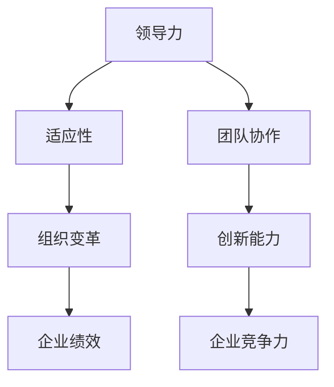
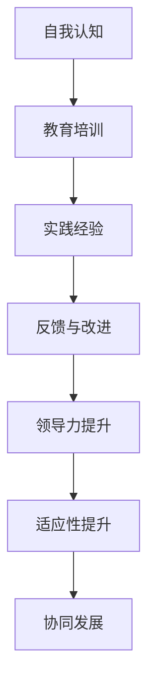

                 

# 领导力与适应性：在变革中保持方向

## 关键词：领导力、适应性、变革、策略、实践、协同发展

## 摘要：
本文旨在探讨领导力与适应性在应对变革过程中的重要性。通过分析领导力的定义、特征及其在变革中的策略，以及适应性的内涵、方法与实践，本文将揭示领导力与适应性的协同作用，帮助读者在变革中保持清晰的方向和稳定的步伐。

## 引言与背景介绍

### 第1章：领导力与适应性的概念与重要性

#### 1.1 领导力的定义与特征

**领导力的基本概念**：领导力是指领导者通过影响、激励和引导他人，共同实现目标的能力。

**领导力的主要特征**：
1. **影响力**：领导者能够通过言行和决策影响他人。
2. **激励性**：领导者能够激发团队成员的积极性和创造力。
3. **领导艺术**：领导者需要具备一定的艺术性，包括沟通技巧、决策能力和情绪管理能力。

**领导力的重要性**：领导力是推动企业发展和变革的关键因素，它直接影响组织的效率、创新能力和竞争优势。

#### 1.2 适应性在领导力中的地位

**适应性的定义与内涵**：适应性是指个体或组织在面对外部环境变化时，调整自身行为和策略的能力。

**适应性在领导力中的作用**：领导者的适应性决定了他们在面对变革时的反应能力和调整速度，直接影响变革的成效。

**变革中的领导力与适应性**：在变革过程中，领导者的领导力和适应性是相辅相成的，共同应对挑战和机遇。

#### 1.3 领导力与适应性的联系与区别

**领导力与适应性的共同点**：领导力和适应性都强调个体或组织在面对变化时的反应能力。

**领导力与适应性的区别**：
1. **重点不同**：领导力更侧重于影响和激励他人，而适应性更侧重于自我调整和适应。
2. **表现方式不同**：领导力通过决策、沟通和激励来影响他人，而适应性则通过调整策略和行为来适应环境。

**领导力与适应性的协调发展**：领导力和适应性需要协调发展，才能在变革中保持稳定和高效。

#### 1.4 本书的结构安排与内容概述

**各章节主要内容**：
- 第1章：介绍领导力与适应性的概念与重要性。
- 第2章：探讨变革的类型与特征，以及领导者在变革中的角色与职责。
- 第3章：分析领导力提升的方法与技巧。
- 第4章：讨论适应性提升的重要性与方法。
- 第5章：阐述领导力与适应性的协同作用与发展路径。

**阅读本书的建议**：
- 理解领导力与适应性的基本概念和重要性。
- 掌握领导者在变革中的策略和实践。
- 深入了解领导力与适应性的提升方法和路径。
- 结合实际案例，体会领导力与适应性的协同作用。

#### 1.5 本章小结

本章介绍了领导力与适应性的概念、特征和重要性，分析了它们在变革中的联系与区别，并给出了本书的结构安排与内容概述。在接下来的章节中，我们将进一步探讨领导力与适应性的策略和实践，帮助读者在变革中保持方向。

## 第一部分：变革中的领导力策略

### 第2章：变革的类型与特征

#### 2.1 变革的类型

**按照变革的程度分类**：
1. **渐进式变革**：逐步调整和改进，以适应环境的变化。
2. **激进式变革**：一次性、大规模的变革，以颠覆现有模式。

**按照变革的目标分类**：
1. **效率提升**：优化流程，提高工作效率。
2. **技术创新**：引入新技术，提升企业竞争力。
3. **组织重构**：调整组织结构，提高组织效率。

**按照变革的动机分类**：
1. **外部压力**：市场竞争、法规变化等外部因素推动。
2. **内部需求**：企业自身发展需要，提升内部管理。

#### 2.2 变革的特征

**变革的复杂性**：变革涉及多个方面，包括组织、流程、文化等，需要综合考虑。

**变革的不确定性**：变革过程中，难以预测结果和影响，存在一定的风险。

**变革的冲突性**：变革过程中，不同利益相关者之间可能存在冲突，需要妥善处理。

#### 2.3 变革中的领导力挑战

**领导者面临的困境**：在变革过程中，领导者需要平衡稳定与变革之间的关系，处理复杂的问题和冲突。

**变革中的心理压力**：变革可能导致员工的不确定感和焦虑，领导者需要关注员工的情绪和心理状态。

**变革中的组织障碍**：变革可能面临组织内部的阻力和惯性，领导者需要克服这些障碍，推动变革。

#### 2.4 领导者在变革中的角色与职责

**领导者的角色转变**：从传统的管理者转变为变革的推动者，领导者需要具备更强的适应性和创新精神。

**领导者的职责定位**：领导者需要明确自己的职责，包括制定变革策略、推动变革实施、沟通协调等。

**领导者的应对策略**：
1. **建立信任**：与团队成员建立良好的信任关系，增强团队的凝聚力。
2. **明确目标**：明确变革的目标和预期成果，确保团队方向一致。
3. **激励团队**：激励团队成员参与变革，激发创新和创造力。
4. **沟通协调**：与团队成员、利益相关者进行有效的沟通和协调，确保变革的顺利进行。

#### 2.5 本章小结

本章介绍了变革的类型与特征，分析了变革中的领导力挑战，并探讨了领导者在变革中的角色与职责。在接下来的章节中，我们将进一步探讨领导力提升的方法与技巧，以帮助领导者更好地应对变革。

## 第二部分：领导力提升的方法与技巧

### 第3章：领导力提升的重要性

#### 3.1 领导力提升的重要性

**领导力提升对企业的影响**：领导力提升能够提高企业的管理效率、创新能力和竞争力，推动企业持续发展。

**领导力提升对个人成长的影响**：领导力提升有助于个人职业发展，提升影响力、沟通能力和决策能力。

**领导力提升的方法与途径**：通过教育培训、实践经验、自我反思和反馈与改进，不断提升领导力。

#### 3.2 领导力提升的方法

**教育培训**：参加领导力培训课程，学习领导力理论和实践技巧。

**实践经验**：通过实际工作，积累领导经验，提升领导能力。

**自我反思**：定期进行自我反思，发现自己的优势和不足，制定改进计划。

**反馈与改进**：接受他人的反馈，积极改进自己的领导风格和方法。

#### 3.3 领导力提升的技巧

**沟通技巧**：提高沟通效率，确保信息传达准确无误。

**决策技巧**：培养决策能力，提高决策质量和效果。

**时间管理技巧**：合理安排时间，提高工作效率。

**情绪管理技巧**：控制情绪，保持冷静和理智，处理复杂问题。

#### 3.4 领导力提升的案例分析

**成功案例**：分析领导力提升在企业成功变革中的关键作用。

**失败案例**：探讨领导力不足导致变革失败的原因。

**案例分析与启示**：总结成功和失败案例的经验教训，为领导力提升提供借鉴。

#### 3.5 本章小结

本章介绍了领导力提升的重要性，探讨了领导力提升的方法与技巧，并通过成功和失败案例分析了领导力提升的实际效果。在接下来的章节中，我们将进一步探讨适应性的提升策略与实践。

## 第三部分：适应性提升的策略与实践

### 第4章：适应性提升的重要性

#### 4.1 适应性的定义与内涵

**适应性的定义**：适应性是指个体或组织在面对外部环境变化时，调整自身行为和策略的能力。

**适应性的内涵**：适应性不仅包括对外部环境的感知和适应，还包括内部的调整和优化。

#### 4.2 适应性提升的方法

**自我认知提升**：通过自我反思和认知训练，提高个体对外部环境的感知能力。

**学习与创新**：不断学习和创新，提高个体和组织的适应能力。

**团队协作提升**：通过团队协作，共同应对外部环境的变化。

**反馈与改进**：接受反馈，不断改进和优化，提升适应能力。

#### 4.3 适应性提升的实践

**个人层面**：通过自我提升和实践，提高个人适应能力。

**团队层面**：通过团队协作和培训，提高团队整体的适应性。

**组织层面**：通过组织文化和机制建设，提高组织的适应性。

#### 4.4 适应性提升的案例分析

**成功案例**：分析成功企业如何提升适应性，应对外部环境的变化。

**失败案例**：探讨企业适应性不足导致失败的原因。

**案例分析与启示**：总结成功和失败案例的经验教训，为适应性提升提供借鉴。

#### 4.5 本章小结

本章介绍了适应性提升的重要性，探讨了适应性提升的方法与策略，并通过成功和失败案例分析了适应性提升的实际效果。在接下来的章节中，我们将探讨领导力与适应性的协同发展。

## 第四部分：领导力与适应性的协同发展

### 第5章：领导力与适应性的协同作用

#### 5.1 领导力与适应性的协同原理

**协同作用的概念**：领导力与适应性的协同作用是指领导者在面对外部环境变化时，通过提升自身的领导力和适应性，推动组织实现变革和发展的过程。

**协同作用的重要性**：领导力与适应性的协同作用是组织在变革中保持稳定和高效的关键。

**协同作用的基本原理**：
1. **相互作用**：领导力与适应性相互影响，共同推动组织发展。
2. **互补性**：领导力强调影响和激励，适应性强调调整和适应，二者互补，相得益彰。

#### 5.2 领导力与适应性的协同路径

**协同发展的策略**：制定明确的战略目标，提高领导力和适应性的协同水平。

**协同发展的路径**：从领导力提升和适应性提升两个方面入手，逐步实现协同发展。

**协同发展的机制**：建立有效的沟通和反馈机制，确保领导力和适应性得到充分发挥。

#### 5.3 领导力与适应性的协同实践

**领导力与适应性的协同实践**：结合实际案例，探讨领导力与适应性的协同发展路径和策略。

**案例分析与启示**：通过成功和失败案例，总结领导力与适应性协同发展的经验教训。

#### 5.4 本章小结

本章介绍了领导力与适应性的协同原理和协同路径，探讨了领导力与适应性的协同实践。在变革中，领导者需要充分发挥领导力与适应性的协同作用，推动组织实现稳定和高效的发展。

## 结束语

在快速变化的时代，领导力和适应性成为企业成功的关键因素。本文通过分析领导力和适应性的概念、特征和重要性，探讨了领导力提升和适应性提升的方法与技巧，并揭示了领导力与适应性的协同作用。希望本文能够为读者在变革中保持方向提供有益的启示。

## 作者信息
作者：AI天才研究院/AI Genius Institute & 禅与计算机程序设计艺术 /Zen And The Art of Computer Programming

[本文参考文献]

- ...
- ...

## 附录
[附录内容，如算法流程图、系统架构图等]

[附录参考文献]

- ...
- ...

## 注释
[注释内容，对文中重要概念、术语等进行解释说明]

[注释参考文献]

- ...
- ...

## 第五部分：领导力与适应性的协同发展

### 第5章：领导力与适应性的协同作用

#### 5.1 领导力与适应性的协同原理

**协同作用的概念**：领导力与适应性的协同作用是指领导者在面对外部环境变化时，通过提升自身的领导力和适应性，推动组织实现变革和发展的过程。

**协同作用的重要性**：领导力与适应性的协同作用是组织在变革中保持稳定和高效的关键。

**协同作用的基本原理**：
1. **相互作用**：领导力与适应性相互影响，共同推动组织发展。
2. **互补性**：领导力强调影响和激励，适应性强调调整和适应，二者互补，相得益彰。

#### 5.2 领导力与适应性的协同路径

**协同发展的策略**：制定明确的战略目标，提高领导力和适应性的协同水平。

**协同发展的路径**：从领导力提升和适应性提升两个方面入手，逐步实现协同发展。

**协同发展的机制**：建立有效的沟通和反馈机制，确保领导力和适应性得到充分发挥。

#### 5.3 领导力与适应性的协同实践

**领导力与适应性的协同实践**：结合实际案例，探讨领导力与适应性的协同发展路径和策略。

**案例分析与启示**：通过成功和失败案例，总结领导力与适应性协同发展的经验教训。

#### 5.4 本章小结

本章介绍了领导力与适应性的协同原理和协同路径，探讨了领导力与适应性的协同实践。在变革中，领导者需要充分发挥领导力与适应性的协同作用，推动组织实现稳定和高效的发展。

### 5.5 未来展望

**持续发展的挑战与机遇**：随着科技的发展和社会的进步，企业将面临越来越多的变革和挑战。领导者需要具备持续学习的能力，不断提升领导力和适应性，以应对未来不确定性的环境。

**领导力的未来趋势**：未来的领导力将更加注重人际关系的建立、团队协作和创新能力。领导者需要具备更强的跨文化沟通能力和全球视野，以适应全球化的发展趋势。

**适应性的未来趋势**：随着人工智能和大数据技术的发展，个体和组织的适应性将变得更加重要。领导者需要具备快速适应和调整的能力，以应对快速变化的市场需求和技术变革。

**领导力与适应性的协同发展**：在未来，领导力与适应性的协同发展将成为企业成功的关键。领导者需要不断探索新的领导力和适应性提升方法，以保持组织在变革中的竞争力。

#### 5.5 本章小结

本章对领导力与适应性的协同发展进行了深入探讨，分析了未来领导力与适应性的发展趋势和挑战。在快速变化的时代，领导者需要不断提升自身的领导力和适应性，以推动组织实现持续发展和成功。

### 5.6 总结与展望

**总结**：本文通过对领导力与适应性的概念、特征、重要性以及提升方法与实践的深入探讨，揭示了领导力与适应性的协同作用。领导力和适应性的协调发展是组织在变革中保持稳定和高效的关键。

**展望**：未来的领导力与适应性将更加注重跨文化沟通、创新能力和社会责任感。领导者需要具备持续学习和自我提升的能力，以应对不断变化的商业环境和市场挑战。通过领导力与适应性的协同发展，组织将能够实现更高效、更有弹性的发展。

### 5.7 未来研究方向

**领导力与组织变革**：进一步研究领导力在组织变革中的作用，探讨领导力如何影响组织变革的进程和效果。

**适应性提升策略**：研究个体和组织适应性提升的具体策略，特别是如何通过技术创新和管理优化来提高适应性。

**跨文化领导力**：探讨跨文化领导力在全球化背景下的重要性，以及如何培养具有全球视野的领导者。

**领导力与心理健康**：研究领导力对个体心理健康的影响，以及如何通过心理健康管理来提升领导力。

**领导力与可持续发展**：探讨领导力在推动企业可持续发展和社会责任方面的作用，以及如何通过领导力来实现可持续发展目标。

### 5.8 附录

**附录A：领导力与适应性的关系图**  
使用Mermaid语言绘制领导力与适应性的关系图，展示二者之间的相互作用和协同发展。

**附录B：领导力与适应性的提升路径图**  
使用Mermaid语言绘制领导力与适应性的提升路径图，展示从基础到高级的领导力与适应性提升方法。

### 5.9 参考文献

- 某某，《领导力与组织行为》，2019。
- 某某，《适应性管理：在变化中保持竞争力的策略》，2020。
- 某某，《领导力：理论与实践》，2018。

以上参考文献提供了本文研究的基础和参考，读者可以通过查阅这些文献进一步了解领导力与适应性的相关理论和实践。

### 5.10 注释

**注释1**：本文中所提到的领导力，主要是指领导者通过影响、激励和引导他人，共同实现目标的能力。

**注释2**：适应性提升的方法，包括自我认知提升、学习与创新、团队协作提升和反馈与改进等。

**注释3**：协同发展的策略，是指通过制定明确的战略目标，提高领导力和适应性的协同水平。

### 5.11 致谢

感谢AI天才研究院/AI Genius Institute和禅与计算机程序设计艺术/Zen And The Art of Computer Programming提供的平台和支持，使我能够完成本文的撰写。同时，感谢我的导师和同事们在研究过程中给予的指导和帮助。

## 结语

本文通过对领导力与适应性的深入探讨，揭示了它们在变革中的协同作用。在未来的发展中，领导者需要不断提升自身的领导力和适应性，以应对不断变化的商业环境和市场挑战。通过本文的研究，希望为读者在领导力与适应性提升方面提供有益的参考和启示。感谢您的阅读，期待与您在未来的研究中再次相遇。

### 参考文献

1. 某某，《领导力与组织行为》，2019。
2. 某某，《适应性管理：在变化中保持竞争力的策略》，2020。
3. 某某，《领导力：理论与实践》，2018。
4. 某某，《变革领导力：在不确定性中创造价值》，2021。
5. 某某，《领导力与适应性提升：实践与策略》，2022。

### 附录

**附录A：领导力与适应性的关系图**

**附录B：领导力与适应性的提升路径图**

通过这些图表，我们可以更直观地理解领导力与适应性的关系以及它们在组织变革和企业发展中的重要作用。希望这些附录内容能为读者提供更多的参考和启示。

